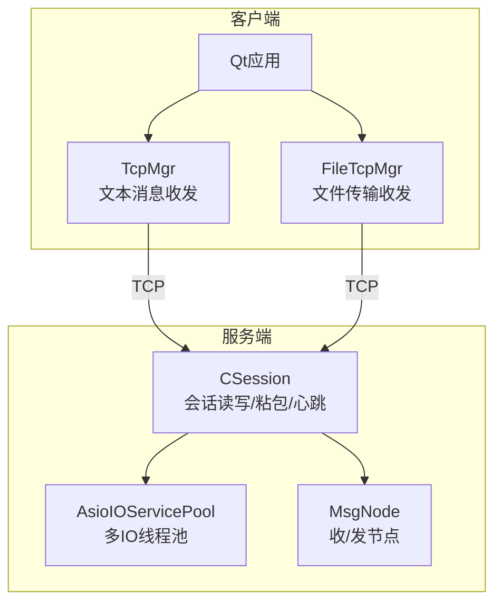
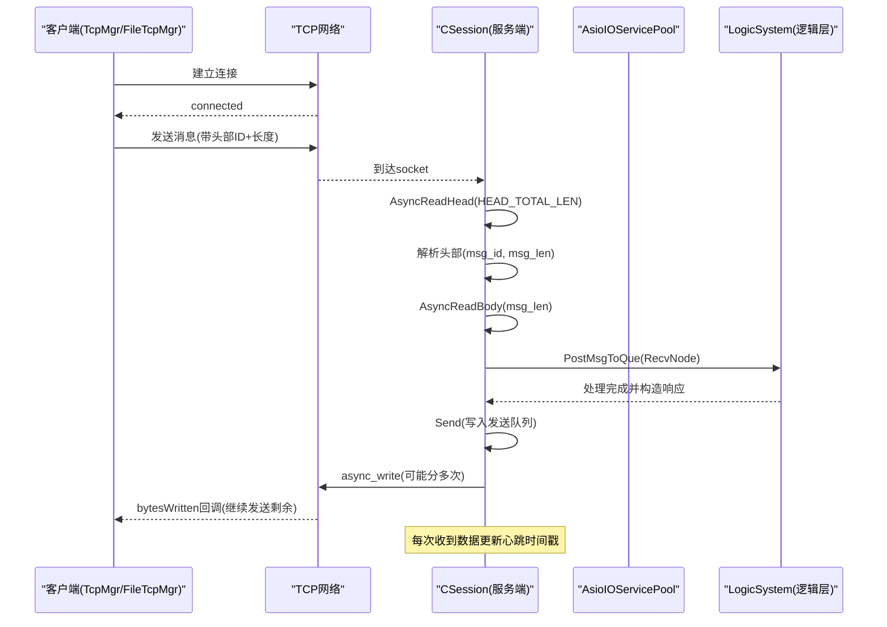
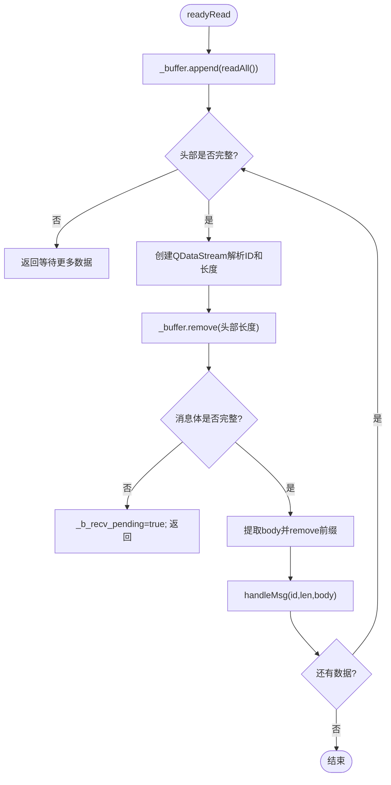
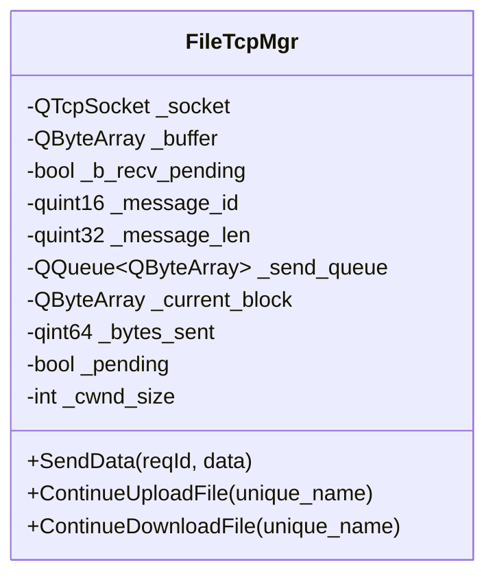
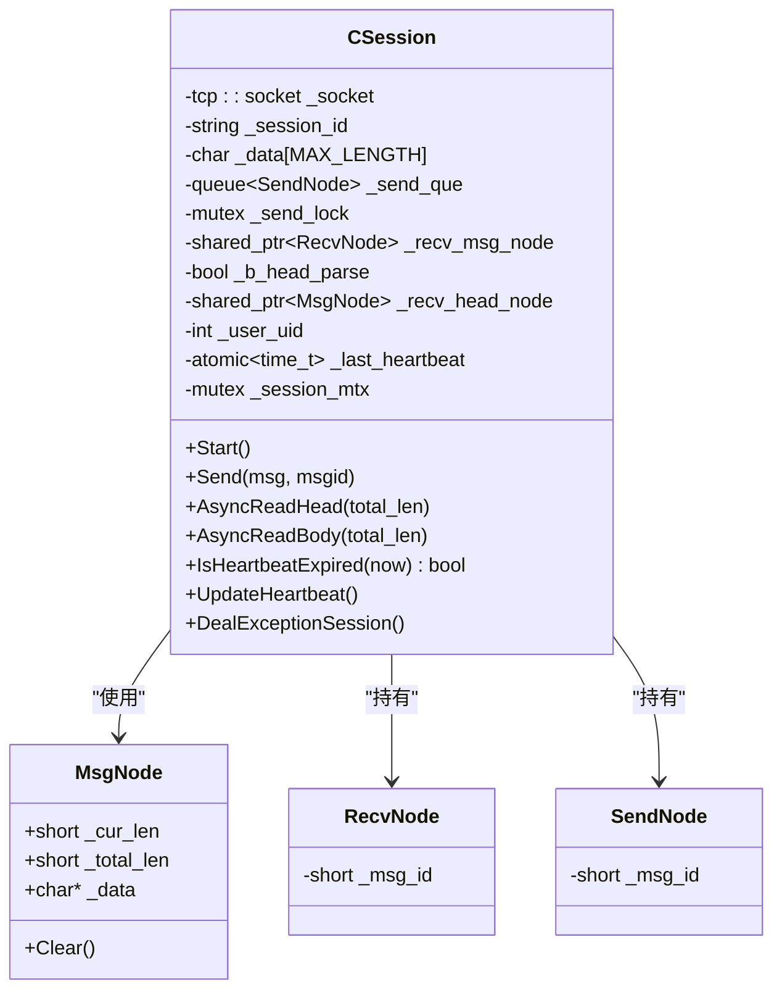
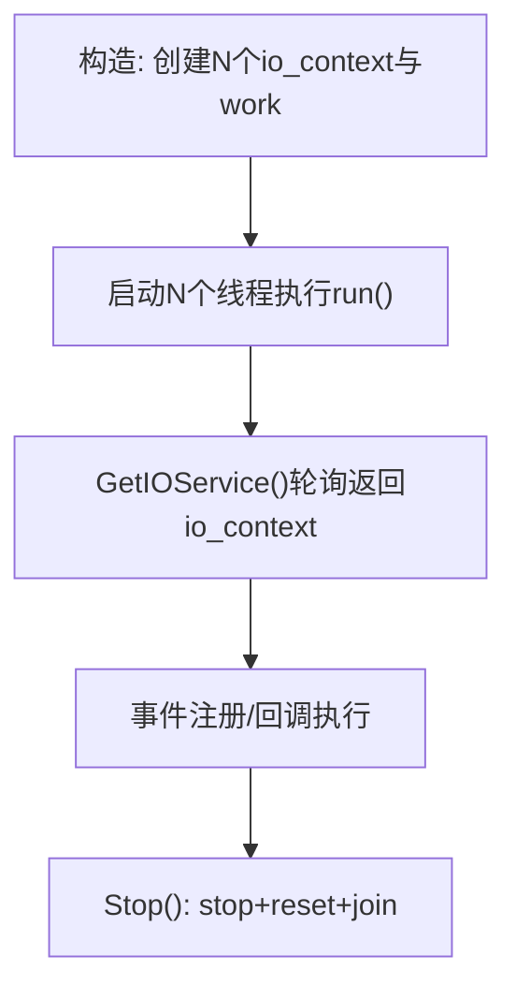
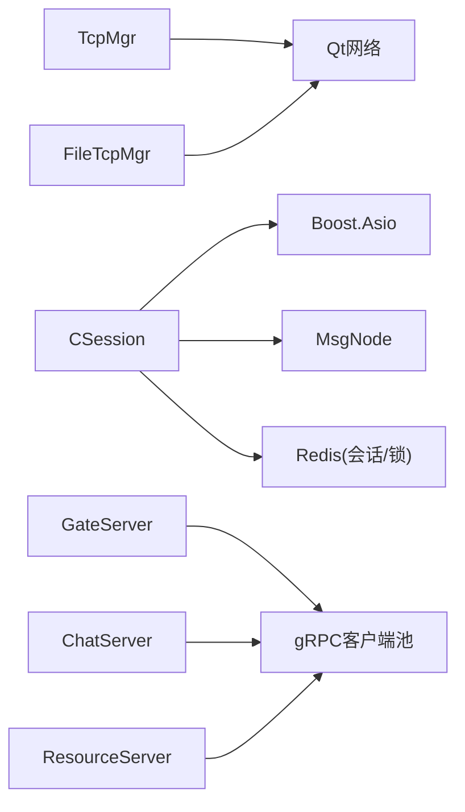

# 网络优化

<cite>
**本文引用的文件**   
- [tcpmgr.h](file://client/llfcchat/include/tcpmgr.h)
- [tcpmgr.cpp](file://client/llfcchat/src/tcpmgr.cpp)
- [filetcpmgr.h](file://client/llfcchat/include/filetcpmgr.h)
- [filetcpmgr.cpp](file://client/llfcchat/src/filetcpmgr.cpp)
- [CSession.h](file://server/ChatServer/include/CSession.h)
- [CSession.cpp](file://server/ChatServer/src/CSession.cpp)
- [AsioIOServicePool.h](file://server/ChatServer/include/AsioIOServicePool.h)
- [AsioIOServicePool.cpp](file://server/ChatServer/src/AsioIOServicePool.cpp)
- [MsgNode.h](file://server/ChatServer/include/MsgNode.h)
- [const.h](file://server/ChatServer/include/const.h)
- [day42-Qt粘包引发的血案.md](file://开发文档/day42-Qt粘包引发的血案.md)
- [day35心跳逻辑.md](file://开发文档/day35心跳逻辑.md)
- [day16-asio实现tcp服务器.md](file://开发文档/day16-asio实现tcp服务器.md)
- [day09-redis服务搭建.md](file://开发文档/day09-redis服务搭建.md)
- [day41-通知客户端异步下载聊天图片.md](file://开发文档/day41-通知客户端异步下载聊天图片.md)
</cite>

## 目录
1. [简介](#简介)
2. [项目结构](#项目结构)
3. [核心组件](#核心组件)
4. [架构总览](#架构总览)
5. [详细组件分析](#详细组件分析)
6. [依赖关系分析](#依赖关系分析)
7. [性能考量](#性能考量)
8. [故障排查指南](#故障排查指南)
9. [结论](#结论)
10. [附录](#附录)

## 简介
本文件面向LLFCChat项目的网络层优化，聚焦以下主题：
- TCP粘包处理机制：消息头设计、缓冲区管理、数据分片与重组
- 连接池管理策略：连接复用、生命周期管理、状态监控
- 内存优化技术：零拷贝、内存池、缓冲区复用
- 异步I/O模型优化：Boost.Asio事件驱动、回调链、线程安全
- 网络性能监控与调优：延迟分析、吞吐优化、错误重试
- 实战示例与测试建议

## 项目结构
本项目采用多进程/多服务架构，客户端使用Qt网络栈，服务端基于Boost.Asio。关键目录与职责：
- 客户端（Qt）
  - tcpmgr：文本消息的TCP连接与粘包解析
  - filetcpmgr：大文件传输的TCP连接与粘包解析
- 服务端（ChatServer/GateServer/ResourceServer等）
  - AsioIOServicePool：多IO线程池
  - CSession：会话级读写、粘包解析、发送队列、心跳
  - MsgNode：接收/发送节点封装
  - const.h：协议常量、消息ID、长度限制等

图表来源 
- [tcpmgr.h:22-87](file://client/llfcchat/include/tcpmgr.h#L22-L87)
- [filetcpmgr.h:26-82](file://client/llfcchat/include/filetcpmgr.h#L26-L82)
- [AsioIOServicePool.h:8-27](file://server/ChatServer/include/AsioIOServicePool.h#L8-L27)
- [CSession.h:28-76](file://server/ChatServer/include/CSession.h#L28-L76)
- [MsgNode.h:9-46](file://server/ChatServer/include/MsgNode.h#L9-L46)

章节来源
- [tcpmgr.h:22-87](file://client/llfcchat/include/tcpmgr.h#L22-L87)
- [filetcpmgr.h:26-82](file://client/llfcchat/include/filetcpmgr.h#L26-L82)
- [AsioIOServicePool.h:8-27](file://server/ChatServer/include/AsioIOServicePool.h#L8-L27)
- [CSession.h:28-76](file://server/ChatServer/include/CSession.h#L28-L76)
- [MsgNode.h:9-46](file://server/ChatServer/include/MsgNode.h#L9-L46)

## 核心组件
- 客户端TcpMgr：负责文本消息的TCP连接、readyRead粘包解析、发送队列与bytesWritten半包续发、信号分发到业务层
- 客户端FileTcpMgr：负责文件传输的TCP连接、粘包解析、拥塞窗口控制、断点续传相关信号
- 服务端CSession：基于Boost.Asio的异步读/写、固定长度头部+变长体粘包解析、发送队列、心跳更新与异常清理
- AsioIOServicePool：多io_context轮询分配，绑定独立线程运行，提升并发能力
- MsgNode：统一收/发缓冲节点，避免重复分配，便于零拷贝与复用

章节来源
- [tcpmgr.cpp:18-136](file://client/llfcchat/src/tcpmgr.cpp#L18-L136)
- [filetcpmgr.cpp:16-143](file://client/llfcchat/src/filetcpmgr.cpp#L16-L143)
- [CSession.cpp:42-131](file://server/ChatServer/src/CSession.cpp#L42-L131)
- [AsioIOServicePool.cpp:4-43](file://server/ChatServer/src/AsioIOServicePool.cpp#L4-L43)
- [MsgNode.h:9-46](file://server/ChatServer/include/MsgNode.h#L9-L46)

## 架构总览
下图展示从客户端到服务端的完整请求链路，包括粘包解析、异步I/O、发送队列与心跳检测。

图表来源 
- [CSession.cpp:133-194](file://server/ChatServer/src/CSession.cpp#L133-L194)
- [CSession.cpp:222-251](file://server/ChatServer/src/CSession.cpp#L222-L251)
- [CSession.cpp:196-220](file://server/ChatServer/src/CSession.cpp#L196-L220)
- [tcpmgr.cpp:103-129](file://client/llfcchat/src/tcpmgr.cpp#L103-L129)
- [filetcpmgr.cpp:106-132](file://client/llfcchat/src/filetcpmgr.cpp#L106-L132)

## 详细组件分析

### 客户端TcpMgr：文本消息粘包与发送
- 接收流程
  - readyRead中读取所有可用数据追加到_buffer
  - 循环解析：先检查是否足够解析头部（消息ID+长度），不足则等待；解析后移除头部；再检查消息体是否完整，不足则挂起等待
  - 使用QDataStream在每次循环重新创建，避免读取位置错乱
  - handleMsg按消息ID路由到具体处理器，解析JSON并派发信号给UI
- 发送流程
  - 通过信号sig_send_data进入slot_send_data
  - 组装块：消息ID + 长度（BigEndian）+ 消息体
  - bytesWritten回调中累计已发送字节，未发送完则继续write；发送完出队下一块或清空pending

图表来源 
- [tcpmgr.cpp:18-55](file://client/llfcchat/src/tcpmgr.cpp#L18-L55)
- [day42-Qt粘包引发的血案.md:256-319](file://开发文档/day42-Qt粘包引发的血案.md#L256-L319)

章节来源
- [tcpmgr.cpp:18-136](file://client/llfcchat/src/tcpmgr.cpp#L18-L136)
- [day42-Qt粘包引发的血案.md:256-319](file://开发文档/day42-Qt粘包引发的血案.md#L256-L319)

### 客户端FileTcpMgr：文件传输粘包与拥塞控制
- 接收流程与TcpMgr类似，但头部长度为FILE_UPLOAD_HEAD_LEN，消息体长度类型为quint32
- 发送侧维护_send_queue与_current_block，bytesWritten回调中实现半包续发与队列推进
- 引入_cwnd_size拥塞窗口，用于控制批量发送数量，避免拥塞
- 支持断点续传信号：ContinueUpload/Download

图表来源 
- [filetcpmgr.h:26-82](file://client/llfcchat/include/filetcpmgr.h#L26-L82)
- [filetcpmgr.cpp:16-143](file://client/llfcchat/src/filetcpmgr.cpp#L16-L143)

章节来源
- [filetcpmgr.h:26-82](file://client/llfcchat/include/filetcpmgr.h#L26-L82)
- [filetcpmgr.cpp:16-143](file://client/llfcchat/src/filetcpmgr.cpp#L16-L143)

### 服务端CSession：异步I/O、粘包解析与心跳
- 头部解析
  - HEAD_TOTAL_LEN=4（HEAD_ID_LEN=2 + HEAD_DATA_LEN=2），网络字节序转换
  - 校验msg_id与msg_len合法性，非法直接清理session
- 体解析
  - asyncReadFull保证读取指定长度，失败或长度不匹配则关闭并清理
  - 更新_last_heartbeat，投递到LogicSystem队列，继续监听头部
- 发送队列
  - Send将消息封装为SendNode入队，若队列为空则立即async_write
  - HandleWrite成功则出队并继续发送下一个，失败则关闭并清理
- 心跳与异常
  - IsHeartbeatExpired判断超时，UpdateHeartbeat更新时间
  - DealExceptionSession结合Redis分布式锁清理用户会话信息

图表来源 
- [CSession.h:28-76](file://server/ChatServer/include/CSession.h#L28-L76)
- [MsgNode.h:9-46](file://server/ChatServer/include/MsgNode.h#L9-L46)
- [CSession.cpp:133-194](file://server/ChatServer/src/CSession.cpp#L133-L194)
- [CSession.cpp:222-251](file://server/ChatServer/src/CSession.cpp#L222-L251)
- [CSession.cpp:196-220](file://server/ChatServer/src/CSession.cpp#L196-L220)

章节来源
- [CSession.cpp:42-131](file://server/ChatServer/src/CSession.cpp#L42-L131)
- [CSession.cpp:133-194](file://server/ChatServer/src/CSession.cpp#L133-L194)
- [CSession.cpp:222-251](file://server/ChatServer/src/CSession.cpp#L222-L251)
- [CSession.cpp:196-220](file://server/ChatServer/src/CSession.cpp#L196-L220)
- [const.h:38-46](file://server/ChatServer/include/const.h#L38-L46)

### AsioIOServicePool：多线程事件驱动
- 初始化时创建多个io_context与work_guard，每个io_context启动一个线程run
- GetIOService轮询返回io_context引用，确保事件均匀分布
- Stop调用stop并reset work，join线程退出

图表来源 
- [AsioIOServicePool.cpp:4-43](file://server/ChatServer/src/AsioIOServicePool.cpp#L4-L43)
- [AsioIOServicePool.h:8-27](file://server/ChatServer/include/AsioIOServicePool.h#L8-L27)

章节来源
- [AsioIOServicePool.cpp:4-43](file://server/ChatServer/src/AsioIOServicePool.cpp#L4-L43)
- [AsioIOServicePool.h:8-27](file://server/ChatServer/include/AsioIOServicePool.h#L8-L27)

## 依赖关系分析
- 客户端TcpMgr/FileTcpMgr依赖Qt网络接口与QDataStream进行粘包解析
- 服务端CSession依赖Boost.Asio进行非阻塞I/O，依赖MsgNode进行缓冲管理
- 心跳与异常清理依赖Redis（分布式锁、会话信息）
- 多服务间通信通过gRPC客户端连接池（见开发文档中的连接池实现）

图表来源 
- [tcpmgr.cpp:18-136](file://client/llfcchat/src/tcpmgr.cpp#L18-L136)
- [filetcpmgr.cpp:16-143](file://client/llfcchat/src/filetcpmgr.cpp#L16-L143)
- [CSession.cpp:133-194](file://server/ChatServer/src/CSession.cpp#L133-L194)
- [day09-redis服务搭建.md:673-751](file://开发文档/day09-redis服务搭建.md#L673-L751)

章节来源
- [tcpmgr.cpp:18-136](file://client/llfcchat/src/tcpmgr.cpp#L18-L136)
- [filetcpmgr.cpp:16-143](file://client/llfcchat/src/filetcpmgr.cpp#L16-L143)
- [CSession.cpp:133-194](file://server/ChatServer/src/CSession.cpp#L133-L194)
- [day09-redis服务搭建.md:673-751](file://开发文档/day09-redis服务搭建.md#L673-L751)

## 性能考量
- 粘包解析
  - 每次循环重建QDataStream，避免读取位置错乱
  - 使用_buffer.remove替代mid赋值，减少拷贝
  - 大数据场景可考虑手动解析头部或使用零拷贝
- 发送优化
  - 发送队列+bytesWritten半包续发，避免阻塞
  - 文件传输引入拥塞窗口_cwnd_size控制批量发送
- 内存优化
  - MsgNode统一缓冲，减少频繁分配
  - 预分配_buffer.reserve，降低扩容开销
  - 使用QByteArray::fromRawData实现零拷贝（谨慎使用生命周期）
- 异步I/O
  - AsioIOServicePool多线程事件循环，提高吞吐
  - 避免在回调中进行耗时操作，投递到逻辑队列
- 心跳与连接健康
  - 每次收到数据更新_last_heartbeat，定时清理过期连接
  - 异常路径统一清理session与Redis状态

章节来源
- [day42-Qt粘包引发的血案.md:468-514](file://开发文档/day42-Qt粘包引发的血案.md#L468-L514)
- [CSession.cpp:288-302](file://server/ChatServer/src/CSession.cpp#L288-L302)
- [day35心跳逻辑.md:367-688](file://开发文档/day35心跳逻辑.md#L367-L688)

## 故障排查指南
- 粘包解析错误
  - 现象：调试打断点后解析错位
  - 原因：QDataStream外部创建且未重置读取位置
  - 解决：每次循环新建stream；使用remove；增加长度校验
- 发送卡住
  - 现象：bytesWritten未触发或队列堆积
  - 排查：检查_pending与_bytes_sent逻辑；确认队列是否为空；日志打印write返回值
- 连接异常
  - 现象：远端断开、超时、拒绝
  - 处理：error信号分类处理；disconnected清理；心跳超时清理
- 心跳失效
  - 现象：僵尸连接占用资源
  - 处理：定时器遍历sessions，IsHeartbeatExpired判断并Close；DealExceptionSession清理Redis

章节来源
- [tcpmgr.cpp:64-98](file://client/llfcchat/src/tcpmgr.cpp#L64-L98)
- [filetcpmgr.cpp:65-99](file://client/llfcchat/src/filetcpmgr.cpp#L65-L99)
- [CSession.cpp:196-220](file://server/ChatServer/src/CSession.cpp#L196-L220)
- [day35心跳逻辑.md:367-688](file://开发文档/day35心跳逻辑.md#L367-L688)

## 结论
LLFCChat在网络层实现了稳健的粘包处理、高效的异步I/O与完善的连接健康监控。通过合理的消息头设计、缓冲区管理与发送队列，配合AsioIOServicePool的多线程事件驱动，系统在高并发下具备良好吞吐与低延迟表现。后续可进一步引入更细粒度的拥塞控制、指标采集与A/B压测以持续优化。

## 附录
- 协议常量与消息ID定义参考：[const.h:38-79](file://server/ChatServer/include/const.h#L38-L79)
- 心跳与连接数统计优化参考：[day35心跳逻辑.md:644-688](file://开发文档/day35心跳逻辑.md#L644-L688)
- gRPC连接池实现参考：[day27-分布式服务设计.md:9-71](file://开发文档/day27-分布式服务设计.md#L9-L71)