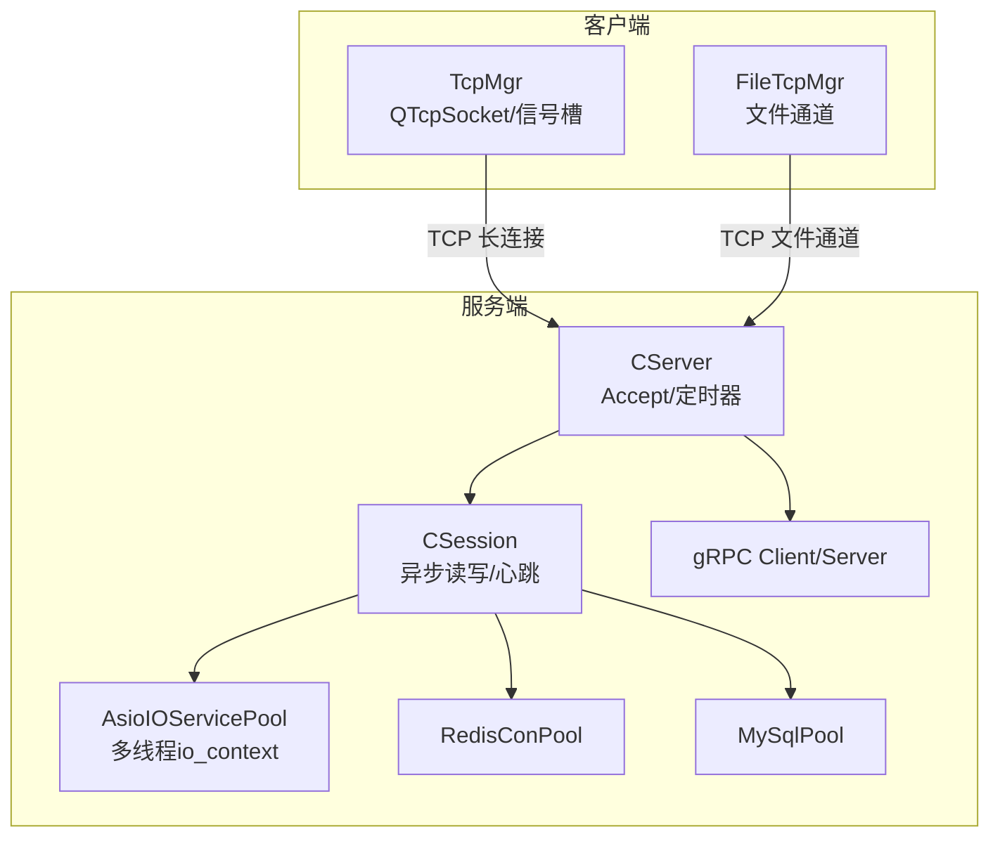
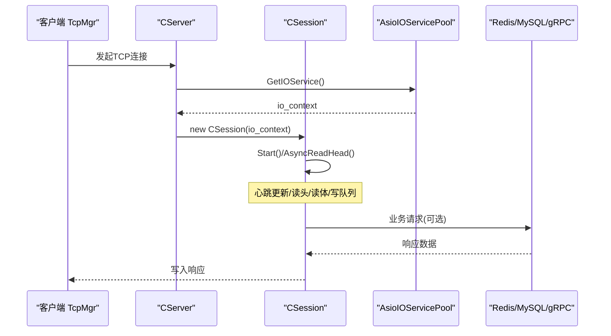
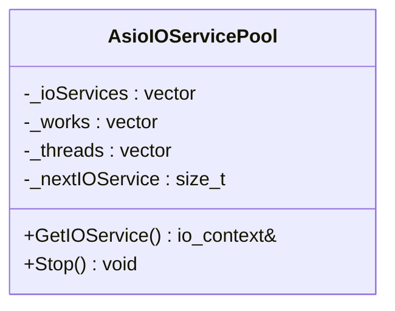
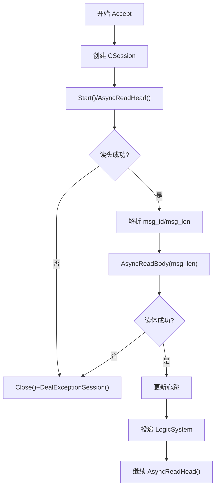
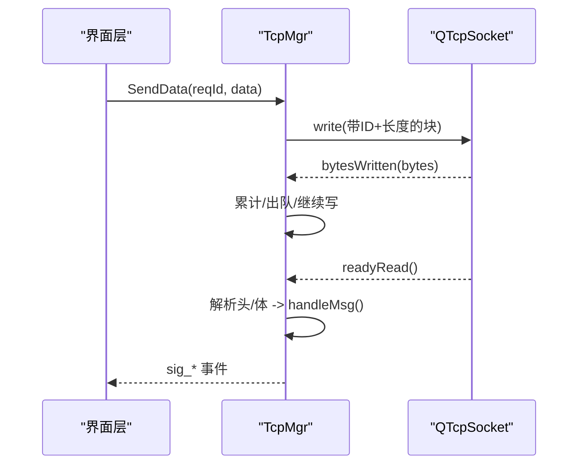
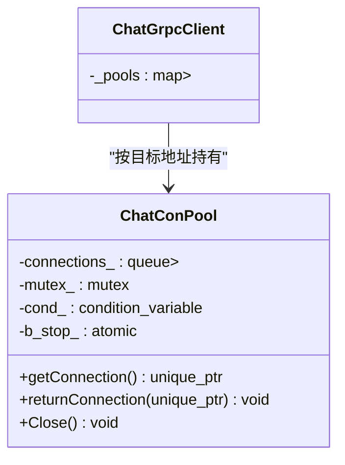
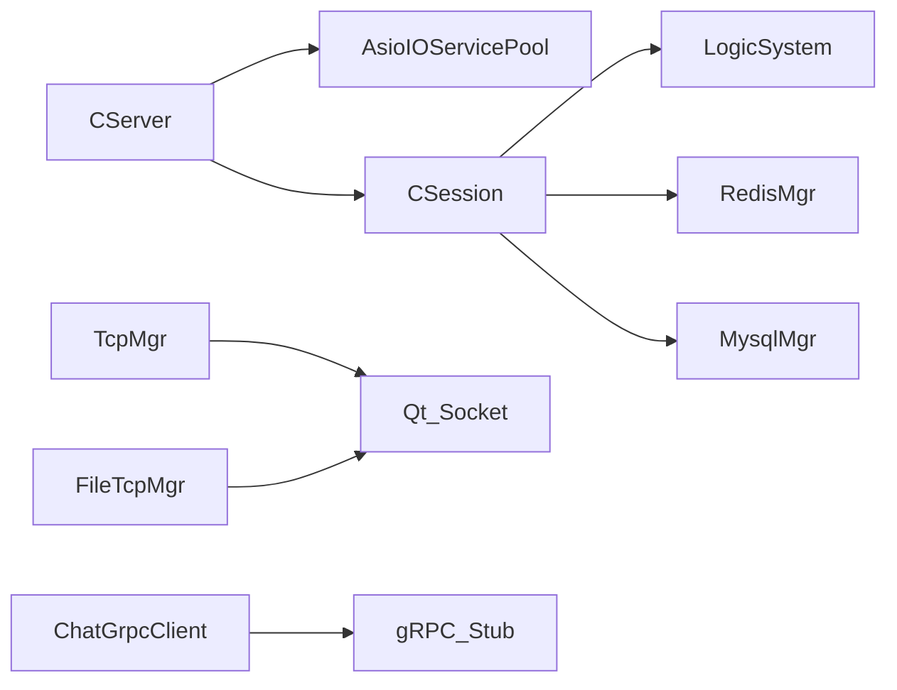

# 连接池管理策略

<cite>
**本文引用的文件**   
- [AsioIOServicePool.h](file://server/ChatServer/include/AsioIOServicePool.h)
- [AsioIOServicePool.cpp](file://server/ChatServer/src/AsioIOServicePool.cpp)
- [CSession.h](file://server/ChatServer/include/CSession.h)
- [CSession.cpp](file://server/ChatServer/src/CSession.cpp)
- [CServer.h](file://server/ChatServer/include/CServer.h)
- [CServer.cpp](file://server/ChatServer/src/CServer.cpp)
- [tcpmgr.h](file://client/llfcchat/include/tcpmgr.h)
- [tcpmgr.cpp](file://client/llfcchat/src/tcpmgr.cpp)
- [filetcpmgr.h](file://client/llfcchat/include/filetcpmgr.h)
- [filetcpmgr.cpp](file://client/llfcchat/src/filetcpmgr.cpp)
- [RedisMgr.h](file://server/ChatServer/include/RedisMgr.h)
- [MysqlDao.h](file://server/ChatServer/include/MysqlDao.h)
- [ChatGrpcClient.h](file://server/ChatServer/include/ChatGrpcClient.h)
- [VerifyGrpcClient.h](file://server/GateServer/include/VerifyGrpcClient.h)
- [day27-分布式服务设计.md](file://开发文档/day27-分布式服务设计.md)
- [day35心跳逻辑.md](file://开发文档/day35心跳逻辑.md)
</cite>

## 目录
1. [引言](#引言)
2. [项目结构](#项目结构)
3. [核心组件](#核心组件)
4. [架构总览](#架构总览)
5. [详细组件分析](#详细组件分析)
6. [依赖关系分析](#依赖关系分析)
7. [性能考量](#性能考量)
8. [故障排查指南](#故障排查指南)
9. [结论](#结论)
10. [附录](#附录)

## 引言
本文件面向LLFCChat项目的连接池与连接管理，系统性阐述客户端与服务端的连接复用、生命周期、状态监控、大小控制、异常处理与重连机制。结合Boost.Asio事件驱动模型与Qt信号槽机制，给出可落地的实现要点与调优建议，并附带关键代码路径以便快速定位。

## 项目结构
- 服务端（ChatServer）：基于Boost.Asio的多线程I/O服务池，按轮询分配io_context；会话级读写、心跳检测、超时清理；通过gRPC与外部服务通信；对Redis、MySQL使用连接池。
- 客户端（llfcchat）：基于Qt的TCP管理器，负责建立连接、粘包解析、发送队列、错误处理与断线重连；文件传输独立通道。
- GateServer等：提供HTTP/gRPC网关能力，内部同样采用AsioIOServicePool进行并发调度。

图表来源
- [AsioIOServicePool.h:1-28](file://server/ChatServer/include/AsioIOServicePool.h#L1-L28)
- [AsioIOServicePool.cpp:1-43](file://server/ChatServer/src/AsioIOServicePool.cpp#L1-L43)
- [CServer.h:1-33](file://server/ChatServer/include/CServer.h#L1-L33)
- [CServer.cpp:1-133](file://server/ChatServer/src/CServer.cpp#L1-L133)
- [CSession.h:1-86](file://server/ChatServer/include/CSession.h#L1-L86)
- [CSession.cpp:1-200](file://server/ChatServer/src/CSession.cpp#L1-L200)
- [tcpmgr.h:1-90](file://client/llfcchat/include/tcpmgr.h#L1-L90)
- [tcpmgr.cpp:1-800](file://client/llfcchat/src/tcpmgr.cpp#L1-L800)
- [filetcpmgr.h:1-85](file://client/llfcchat/include/filetcpmgr.h#L1-L85)
- [filetcpmgr.cpp:1-200](file://client/llfcchat/src/filetcpmgr.cpp#L1-L200)

章节来源
- [AsioIOServicePool.h:1-28](file://server/ChatServer/include/AsioIOServicePool.h#L1-L28)
- [AsioIOServicePool.cpp:1-43](file://server/ChatServer/src/AsioIOServicePool.cpp#L1-L43)
- [CServer.h:1-33](file://server/ChatServer/include/CServer.h#L1-L33)
- [CServer.cpp:1-133](file://server/ChatServer/src/CServer.cpp#L1-L133)
- [CSession.h:1-86](file://server/ChatServer/include/CSession.h#L1-L86)
- [CSession.cpp:1-200](file://server/ChatServer/src/CSession.cpp#L1-L200)
- [tcpmgr.h:1-90](file://client/llfcchat/include/tcpmgr.h#L1-L90)
- [tcpmgr.cpp:1-800](file://client/llfcchat/src/tcpmgr.cpp#L1-L800)
- [filetcpmgr.h:1-85](file://client/llfcchat/include/filetcpmgr.h#L1-L85)
- [filetcpmgr.cpp:1-200](file://client/llfcchat/src/filetcpmgr.cpp#L1-L200)

## 核心组件
- AsioIOServicePool：维护多个boost::asio::io_context实例，每个绑定一个Work守卫与独立线程，GetIOService以轮询方式返回，Stop统一停止并join线程。
- CServer：监听端口，接受新连接，将session加入全局映射，定时扫描过期会话并清理。
- CSession：封装socket的异步读写、消息头体解析、发送队列、心跳更新与异常处理。
- TcpMgr/FileTcpMgr：客户端侧的TCP管理器，负责连接建立、粘包/拆包、发送队列、错误处理、断线通知与重连触发。
- RedisConPool/MySqlPool：后端资源连接池，包含健康检查、自动重连与容量控制。
- ChatGrpcClient/VerifyGrpcClient：gRPC客户端连接池，复用Stub对象，条件变量等待可用连接。

章节来源
- [AsioIOServicePool.h:1-28](file://server/ChatServer/include/AsioIOServicePool.h#L1-L28)
- [AsioIOServicePool.cpp:1-43](file://server/ChatServer/src/AsioIOServicePool.cpp#L1-L43)
- [CServer.h:1-33](file://server/ChatServer/include/CServer.h#L1-L33)
- [CServer.cpp:1-133](file://server/ChatServer/src/CServer.cpp#L1-L133)
- [CSession.h:1-86](file://server/ChatServer/include/CSession.h#L1-L86)
- [CSession.cpp:1-200](file://server/ChatServer/src/CSession.cpp#L1-L200)
- [tcpmgr.h:1-90](file://client/llfcchat/include/tcpmgr.h#L1-L90)
- [tcpmgr.cpp:1-800](file://client/llfcchat/src/tcpmgr.cpp#L1-L800)
- [filetcpmgr.h:1-85](file://client/llfcchat/include/filetcpmgr.h#L1-L85)
- [filetcpmgr.cpp:1-200](file://client/llfcchat/src/filetcpmgr.cpp#L1-L200)
- [RedisMgr.h:1-45](file://server/ChatServer/include/RedisMgr.h#L1-L45)
- [MysqlDao.h:213-232](file://server/ChatServer/include/MysqlDao.h#L213-L232)
- [ChatGrpcClient.h:51-116](file://server/ChatServer/include/ChatGrpcClient.h#L51-L116)
- [VerifyGrpcClient.h:65-110](file://server/GateServer/include/VerifyGrpcClient.h#L65-L110)

## 架构总览
服务端采用“多进程/多服务 + 单进程内多线程”的混合模式：
- 每个ChatServer进程启动AsioIOServicePool，为acceptor和所有session提供独立的io_context，避免锁竞争。
- CServer负责接入层，CSession负责会话层，LogicSystem负责业务逻辑（不在本节展开）。
- 客户端通过TcpMgr维持一条长连接，FileTcpMgr用于大文件传输，二者均基于Qt的事件循环。

图表来源
- [CServer.cpp:21-38](file://server/ChatServer/src/CServer.cpp#L21-L38)
- [AsioIOServicePool.cpp:22-28](file://server/ChatServer/src/AsioIOServicePool.cpp#L22-L28)
- [CSession.cpp:42-44](file://server/ChatServer/src/CSession.cpp#L42-L44)

## 详细组件分析

### 服务端 I/O 服务池（AsioIOServicePool）
- 设计要点
  - 构造时创建N个io_context，并为每个io_context绑定Work守卫，确保run()不会提前退出。
  - 每个io_context对应一个工作线程，调用run()进入事件循环。
  - GetIOService()以_nextIOService轮询选择，保证负载均衡。
  - Stop()依次stop各io_context并释放work_guard，再join线程，保证优雅关闭。
- 复杂度与特性
  - 获取io_context为O(1)，线程间无共享状态，避免锁开销。
  - 默认线程数取硬件并发度或配置值，可按CPU核数调整。

图表来源
- [AsioIOServicePool.h:8-27](file://server/ChatServer/include/AsioIOServicePool.h#L8-L27)
- [AsioIOServicePool.cpp:4-16](file://server/ChatServer/src/AsioIOServicePool.cpp#L4-L16)
- [AsioIOServicePool.cpp:22-28](file://server/ChatServer/src/AsioIOServicePool.cpp#L22-L28)
- [AsioIOServicePool.cpp:30-42](file://server/ChatServer/src/AsioIOServicePool.cpp#L30-L42)

章节来源
- [AsioIOServicePool.h:1-28](file://server/ChatServer/include/AsioIOServicePool.h#L1-L28)
- [AsioIOServicePool.cpp:1-43](file://server/ChatServer/src/AsioIOServicePool.cpp#L1-L43)

### 服务端会话（CSession）与服务器（CServer）
- CServer
  - 监听端口，StartAccept()从AsioIOServicePool获取io_context，创建CSession并注册到_sessions映射。
  - on_timer周期性遍历会话，根据心跳判断是否过期，Close并收集后统一DealExceptionSession清理。
  - ClearSession在断开时移除用户与session关联。
- CSession
  - Start()启动异步读头，随后读体，完成一次消息处理后再继续读头。
  - Send()将消息入队，若队列为空则立即异步写入，HandleWrite完成后出队下一条。
  - UpdateHeartbeat/IsHeartbeatExpired维护心跳时间戳，配合CServer定时器清理。
  - DealExceptionSession处理异常连接，必要时上报或清理。

图表来源
- [CServer.cpp:21-38](file://server/ChatServer/src/CServer.cpp#L21-L38)
- [CServer.cpp:75-118](file://server/ChatServer/src/CServer.cpp#L75-L118)
- [CSession.cpp:42-44](file://server/ChatServer/src/CSession.cpp#L42-L44)
- [CSession.cpp:90-131](file://server/ChatServer/src/CSession.cpp#L90-L131)
- [CSession.cpp:133-194](file://server/ChatServer/src/CSession.cpp#L133-L194)
- [CSession.cpp:196-200](file://server/ChatServer/src/CSession.cpp#L196-L200)

章节来源
- [CServer.h:1-33](file://server/ChatServer/include/CServer.h#L1-L33)
- [CServer.cpp:1-133](file://server/ChatServer/src/CServer.cpp#L1-L133)
- [CSession.h:1-86](file://server/ChatServer/include/CSession.h#L1-L86)
- [CSession.cpp:1-200](file://server/ChatServer/src/CSession.cpp#L1-L200)

### 客户端 TCP 管理器（TcpMgr）
- 连接建立与事件
  - 连接成功/失败、readyRead、error、disconnected等信号分别处理，向上层发出sig_con_success/sig_connection_closed等。
- 粘包/拆包
  - 收到数据追加到_buffer，先解析头部（ID+长度），不足则等待；满足后截取消息体并调用handleMsg分发。
- 发送队列
  - bytesWritten回调中累计已发送字节，未发完继续写；发完后查看队列，取出下一条继续写。
- 错误处理
  - 区分拒绝、远程关闭、主机未知、超时、网络错误等，触发相应信号供上层重连或提示。

图表来源
- [tcpmgr.cpp:12-16](file://client/llfcchat/src/tcpmgr.cpp#L12-L16)
- [tcpmgr.cpp:18-55](file://client/llfcchat/src/tcpmgr.cpp#L18-L55)
- [tcpmgr.cpp:103-129](file://client/llfcchat/src/tcpmgr.cpp#L103-L129)
- [tcpmgr.cpp:64-91](file://client/llfcchat/src/tcpmgr.cpp#L64-L91)

章节来源
- [tcpmgr.h:1-90](file://client/llfcchat/include/tcpmgr.h#L1-L90)
- [tcpmgr.cpp:1-800](file://client/llfcchat/src/tcpmgr.cpp#L1-L800)

### 客户端文件通道（FileTcpMgr）
- 与TcpMgr类似，但针对文件传输协议（不同头部长度），支持上传/下载进度、续传、拥塞窗口_cwnd_size等。
- 发送队列与bytesWritten处理一致，保证可靠顺序发送。

章节来源
- [filetcpmgr.h:1-85](file://client/llfcchat/include/filetcpmgr.h#L1-L85)
- [filetcpmgr.cpp:1-200](file://client/llfcchat/src/filetcpmgr.cpp#L1-L200)

### gRPC 客户端连接池（ChatGrpcClient / VerifyGrpcClient）
- 使用条件变量与互斥量保护连接队列，getConnection阻塞等待可用连接，returnConnection归还连接并唤醒等待者。
- Close()设置停止标志并唤醒全部等待者，析构时安全清理。

图表来源
- [ChatGrpcClient.h:51-116](file://server/ChatServer/include/ChatGrpcClient.h#L51-L116)
- [VerifyGrpcClient.h:65-110](file://server/GateServer/include/VerifyGrpcClient.h#L65-L110)

章节来源
- [ChatGrpcClient.h:51-116](file://server/ChatServer/include/ChatGrpcClient.h#L51-L116)
- [VerifyGrpcClient.h:65-110](file://server/GateServer/include/VerifyGrpcClient.h#L65-L110)

### 后端资源连接池（RedisConPool / MySqlPool）
- RedisConPool
  - 初始化时创建指定数量的hiredis上下文，AUTH认证成功后入池。
  - 后台线程定期PING保活，失败计数达到阈值时尝试reconnect。
- MySqlPool
  - 维护SqlConnection队列，checkConnection周期执行SELECT 1探测，异常则重建连接替换。

章节来源
- [RedisMgr.h:1-45](file://server/ChatServer/include/RedisMgr.h#L1-L45)
- [MysqlDao.h:213-232](file://server/ChatServer/include/MysqlDao.h#L213-L232)

## 依赖关系分析
- 耦合关系
  - CServer依赖AsioIOServicePool获取io_context，降低acceptor与session间的锁竞争。
  - CSession依赖LogicSystem进行业务处理，依赖RedisMgr/MysqlMgr访问后端。
  - 客户端TcpMgr/FileTcpMgr仅依赖Qt网络模块与自定义数据结构，解耦UI。
- 潜在环路
  - 无直接循环依赖；CSession与LogicSystem之间通过消息队列解耦。
- 外部依赖
  - Boost.Asio、Qt、gRPC、hiredis、mysql-connector-cpp。

图表来源
- [CServer.cpp:1-133](file://server/ChatServer/src/CServer.cpp#L1-L133)
- [CSession.cpp:1-200](file://server/ChatServer/src/CSession.cpp#L1-L200)
- [tcpmgr.cpp:1-800](file://client/llfcchat/src/tcpmgr.cpp#L1-L800)
- [filetcpmgr.cpp:1-200](file://client/llfcchat/src/filetcpmgr.cpp#L1-L200)
- [ChatGrpcClient.h:51-116](file://server/ChatServer/include/ChatGrpcClient.h#L51-L116)

章节来源
- [CServer.cpp:1-133](file://server/ChatServer/src/CServer.cpp#L1-L133)
- [CSession.cpp:1-200](file://server/ChatServer/src/CSession.cpp#L1-L200)
- [tcpmgr.cpp:1-800](file://client/llfcchat/src/tcpmgr.cpp#L1-L800)
- [filetcpmgr.cpp:1-200](file://client/llfcchat/src/filetcpmgr.cpp#L1-L200)
- [ChatGrpcClient.h:51-116](file://server/ChatServer/include/ChatGrpcClient.h#L51-L116)

## 性能考量
- I/O 并发
  - AsioIOServicePool线程数建议等于CPU物理核数；高并发场景可适当增加，观察上下文切换成本。
- 发送队列
  - CSession发送队列上限MAX_SENDQUE需合理设置，防止内存暴涨；客户端TcpMgr的_send_queue应限制最大长度。
- 心跳与超时
  - 心跳间隔与超时阈值需平衡：过短增加负载，过长导致故障发现延迟。
- 粘包处理
  - 客户端每次readyRead都重新创建QDataStream解析头，避免状态污染；注意缓冲区拷贝开销。
- 资源池
  - Redis/MySQL连接池大小应与数据库最大连接数匹配；后台保活频率不宜过高。

[本节为通用指导，不直接分析具体文件]

## 故障排查指南
- 连接建立失败
  - 客户端error分支区分拒绝、主机未知、超时等，确认网络可达与端口配置。
  - 服务端HandleAccept错误日志输出，检查防火墙与端口占用。
- 心跳超时
  - 客户端收到sig_connection_closed后触发重连；服务端定时器on_timer清理过期会话。
- 发送卡住
  - 检查bytesWritten回调是否被正确连接；发送队列是否为空；是否存在死锁或过大消息。
- 后端连接异常
  - Redis/MySQL连接池checkThread/checkConnection会打印异常并重连，关注fail_count与日志。

章节来源
- [tcpmgr.cpp:64-91](file://client/llfcchat/src/tcpmgr.cpp#L64-L91)
- [CServer.cpp:75-118](file://server/ChatServer/src/CServer.cpp#L75-L118)
- [RedisMgr.h:1-45](file://server/ChatServer/include/RedisMgr.h#L1-L45)
- [MysqlDao.h:213-232](file://server/ChatServer/include/MysqlDao.h#L213-L232)

## 结论
LLFCChat的连接管理以AsioIOServicePool为核心，结合CSession/CServer实现高效的事件驱动I/O；客户端通过TcpMgr/FileTcpMgr保障可靠传输与良好用户体验；后端资源通过连接池与保活机制提升稳定性。建议在部署时依据硬件与业务特征调优线程数、队列长度、心跳间隔与连接池大小，并结合监控指标持续优化。

[本节为总结性内容，不直接分析具体文件]

## 附录

### 连接池调优参数建议
- AsioIOServicePool线程数
  - 初始值：std::thread::hardware_concurrency()
  - 观测指标：CPU利用率、上下文切换次数、任务排队长度
- CSession发送队列上限 MAX_SENDQUE
  - 建议：根据峰值带宽与内存预算估算，避免OOM
- 心跳间隔与超时
  - 间隔：30~60秒；超时：2~3倍间隔
- Redis/MySQL连接池大小
  - Redis：与客户端并发度匹配，通常数十到数百
  - MySQL：受限于max_connections与连接耗时，建议10~200

[本节为通用指导，不直接分析具体文件]

### 监控指标清单
- 服务端
  - 活跃会话数、每秒消息吞吐、平均/尾延迟、错误率、队列长度
  - 资源池：连接数、空闲数、等待数、重连次数、失败次数
- 客户端
  - 连接状态、重连次数、发送/接收速率、丢包/错误类型分布

[本节为通用指导，不直接分析具体文件]

### 关键流程参考（含代码路径）
- 服务端接受连接与分配io_context
  - [CServer.cpp:21-38](file://server/ChatServer/src/CServer.cpp#L21-L38)
  - [AsioIOServicePool.cpp:22-28](file://server/ChatServer/src/AsioIOServicePool.cpp#L22-L28)
- 会话心跳与超时清理
  - [CSession.cpp:120-121](file://server/ChatServer/src/CSession.cpp#L120-L121)
  - [CServer.cpp:75-118](file://server/ChatServer/src/CServer.cpp#L75-L118)
- 客户端粘包解析与发送队列
  - [tcpmgr.cpp:18-55](file://client/llfcchat/src/tcpmgr.cpp#L18-L55)
  - [tcpmgr.cpp:103-129](file://client/llfcchat/src/tcpmgr.cpp#L103-L129)
- gRPC连接池借用与归还
  - [ChatGrpcClient.h:59-83](file://server/ChatServer/include/ChatGrpcClient.h#L59-L83)
  - [VerifyGrpcClient.h:87-104](file://server/GateServer/include/VerifyGrpcClient.h#L87-L104)
- 资源池保活与重连
  - [RedisMgr.h:36-45](file://server/ChatServer/include/RedisMgr.h#L36-L45)
  - [MysqlDao.h:213-232](file://server/ChatServer/include/MysqlDao.h#L213-L232)

章节来源
- [CServer.cpp:21-38](file://server/ChatServer/src/CServer.cpp#L21-L38)
- [AsioIOServicePool.cpp:22-28](file://server/ChatServer/src/AsioIOServicePool.cpp#L22-L28)
- [CSession.cpp:120-121](file://server/ChatServer/src/CSession.cpp#L120-L121)
- [CServer.cpp:75-118](file://server/ChatServer/src/CServer.cpp#L75-L118)
- [tcpmgr.cpp:18-55](file://client/llfcchat/src/tcpmgr.cpp#L18-L55)
- [tcpmgr.cpp:103-129](file://client/llfcchat/src/tcpmgr.cpp#L103-L129)
- [ChatGrpcClient.h:59-83](file://server/ChatServer/include/ChatGrpcClient.h#L59-L83)
- [VerifyGrpcClient.h:87-104](file://server/GateServer/include/VerifyGrpcClient.h#L87-L104)
- [RedisMgr.h:36-45](file://server/ChatServer/include/RedisMgr.h#L36-L45)
- [MysqlDao.h:213-232](file://server/ChatServer/include/MysqlDao.h#L213-L232)