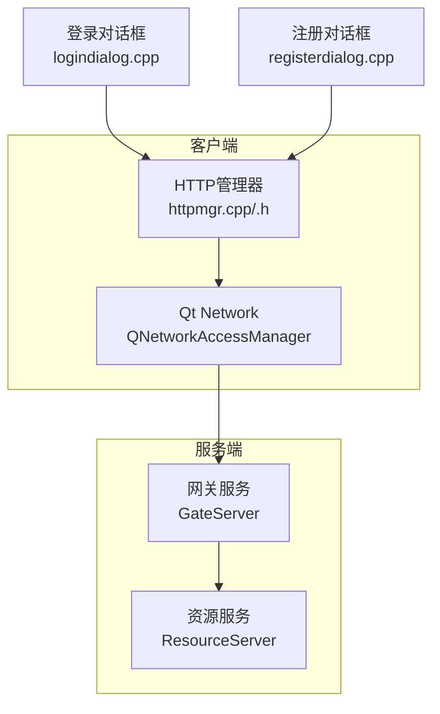
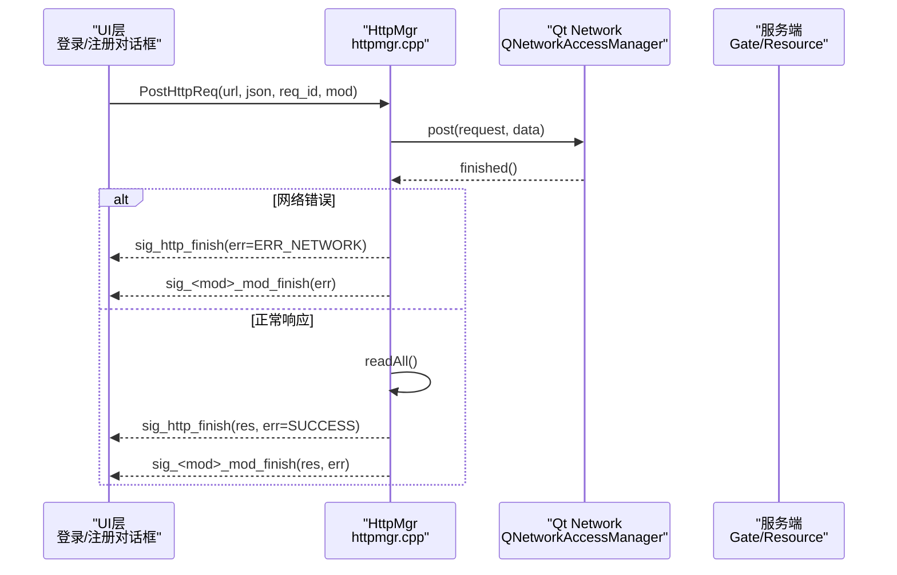
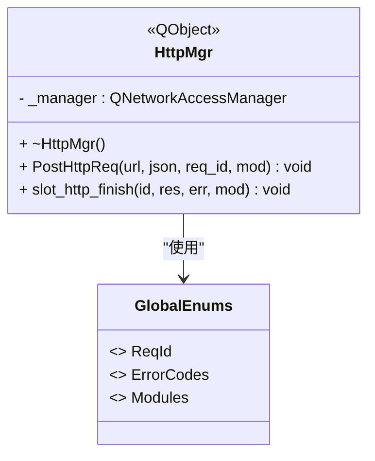
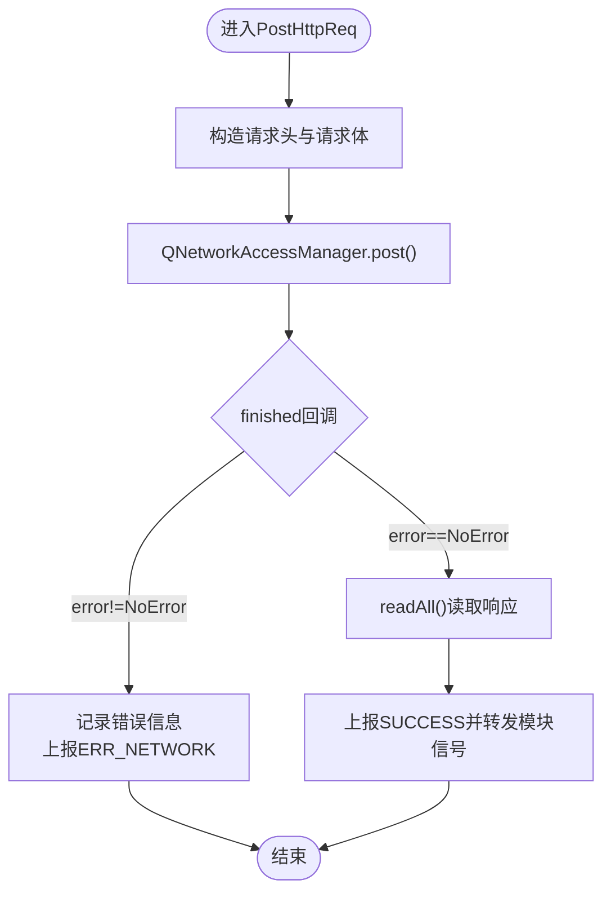
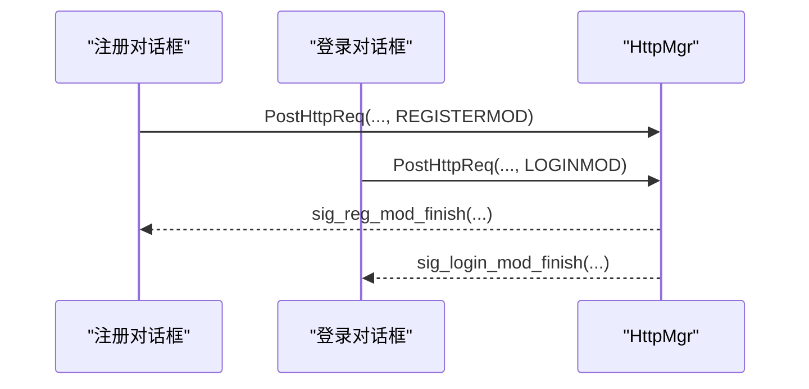
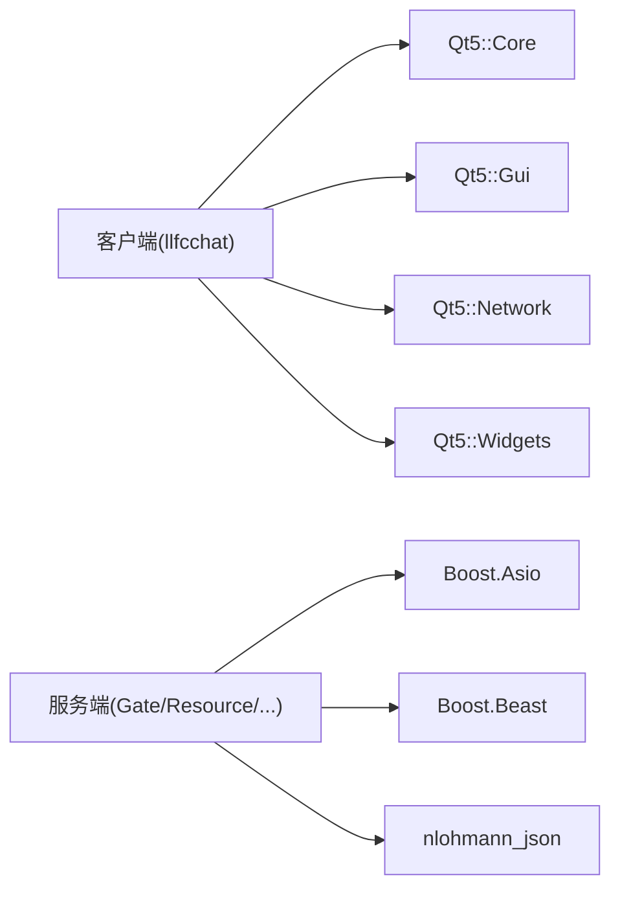

# HTTP请求优化

<cite>
**本文引用的文件**   
- [httpmgr.h](file://client/llfcchat/include/httpmgr.h)
- [httpmgr.cpp](file://client/llfcchat/src/httpmgr.cpp)
- [global.h](file://client/llfcchat/include/global.h)
- [CMakeLists.txt（客户端）](file://client/llfcchat/CMakeLists.txt)
- [Dependencies.cmake](file://cmake/Dependencies.cmake)
- [logindialog.cpp](file://client/llfcchat/src/logindialog.cpp)
- [registerdialog.cpp](file://client/llfcchat/src/registerdialog.cpp)
- [day02-客户端Http管理类设计.md](file://开发文档/day02-客户端Http管理类设计.md)
</cite>

## 目录
1. [简介](#简介)
2. [项目结构](#项目结构)
3. [核心组件](#核心组件)
4. [架构总览](#架构总览)
5. [详细组件分析](#详细组件分析)
6. [依赖关系分析](#依赖关系分析)
7. [性能考量与优化建议](#性能考量与优化建议)
8. [故障排查指南](#故障排查指南)
9. [结论](#结论)
10. [附录](#附录)

## 简介
本技术文档聚焦于LLFCChat客户端的HTTP请求优化，围绕HttpManager类（代码中为HttpMgr）的实现进行深入剖析。当前实现基于Qt Network模块，采用QNetworkAccessManager进行HTTP POST请求、响应回调与错误处理；通过信号槽机制将网络层与业务UI解耦，并按模块路由完成信号。文档同时给出Beast库在服务器侧的使用背景、HTTP/1.1与HTTP/2特性利用思路、缓存策略、批处理与断点续传方案，以及可落地的性能测试方法与优化建议，帮助读者在不改变现有接口的前提下逐步增强HTTP能力。

## 项目结构
- 客户端HTTP相关源码位于 client/llfcchat/src/httpmgr.cpp 与 include/httpmgr.h。
- 全局常量与枚举（ReqId、ErrorCodes、Modules等）定义于 client/llfcchat/include/global.h。
- 构建系统使用CMake，客户端目标链接Qt5::Network，服务器端依赖Boost.Asio与Beast。
- 业务界面（登录、注册、重置）通过HttpMgr发送HTTP请求并订阅对应模块完成信号。

**图表来源** 
- [httpmgr.cpp:8-38](file://client/llfcchat/src/httpmgr.cpp#L8-L38)
- [httpmgr.h:11-31](file://client/llfcchat/include/httpmgr.h#L11-L31)
- [logindialog.cpp:192-195](file://client/llfcchat/src/logindialog.cpp#L192-L195)
- [registerdialog.cpp:107-110](file://client/llfcchat/src/registerdialog.cpp#L107-L110)

**章节来源**
- [httpmgr.h:11-31](file://client/llfcchat/include/httpmgr.h#L11-L31)
- [httpmgr.cpp:8-38](file://client/llfcchat/src/httpmgr.cpp#L8-L38)
- [CMakeLists.txt（客户端）:191-197](file://client/llfcchat/CMakeLists.txt#L191-L197)
- [Dependencies.cmake:22-24](file://cmake/Dependencies.cmake#L22-L24)

## 核心组件
- HttpMgr：单例对象，封装QNetworkAccessManager，提供统一的POST请求入口，内部通过finished信号异步处理响应与错误，并通过模块信号分发到上层。
- global.h：集中定义请求ID、错误码、模块类型、传输状态等关键枚举与数据结构，支撑HTTP与TCP/文件传输的统一语义。
- 业务对话框：登录、注册、重置等界面负责构造JSON请求体、调用HttpMgr并订阅对应模块完成信号，完成解析与UI更新。

**章节来源**
- [httpmgr.h:11-31](file://client/llfcchat/include/httpmgr.h#L11-L31)
- [httpmgr.cpp:8-38](file://client/llfcchat/src/httpmgr.cpp#L8-L38)
- [global.h:43-101](file://client/llfcchat/include/global.h#L43-L101)
- [logindialog.cpp:192-195](file://client/llfcchat/src/logindialog.cpp#L192-L195)
- [registerdialog.cpp:107-110](file://client/llfcchat/src/registerdialog.cpp#L107-L110)

## 架构总览
下图展示从UI发起HTTP请求到响应返回的完整流程，包括错误分支与模块分发。

**图表来源** 
- [httpmgr.cpp:8-38](file://client/llfcchat/src/httpmgr.cpp#L8-L38)
- [httpmgr.cpp:46-61](file://client/llfcchat/src/httpmgr.cpp#L46-L61)
- [logindialog.cpp:192-195](file://client/llfcchat/src/logindialog.cpp#L192-L195)
- [registerdialog.cpp:107-110](file://client/llfcchat/src/registerdialog.cpp#L107-L110)

## 详细组件分析

### HttpMgr类分析
- 职责：统一封装HTTP POST请求、设置Content-Type与Content-Length、异步处理响应、错误上报与模块分发。
- 并发模型：基于Qt事件循环，所有网络回调在UI线程或指定线程的事件循环中触发，避免阻塞。
- 内存管理：使用智能指针与deleteLater确保Reply对象安全释放。
- 可扩展性：通过模块枚举与信号路由，新增模块只需增加对应信号与槽绑定。

**图表来源** 
- [httpmgr.h:11-31](file://client/llfcchat/include/httpmgr.h#L11-L31)
- [global.h:43-101](file://client/llfcchat/include/global.h#L43-L101)

**章节来源**
- [httpmgr.h:11-31](file://client/llfcchat/include/httpmgr.h#L11-L31)
- [httpmgr.cpp:8-38](file://client/llfcchat/src/httpmgr.cpp#L8-L38)
- [httpmgr.cpp:46-61](file://client/llfcchat/src/httpmgr.cpp#L46-L61)

### 请求处理流程与错误重试
- 请求构造：序列化JSON为字节数组，设置Content-Type为application/json，显式设置Content-Length。
- 响应处理：finished回调中判断error，若失败则上报ERR_NETWORK；成功则读取全部数据并上报SUCCESS。
- 错误重试：当前未内置重试逻辑，可在上层根据ErrorCodes与业务语义实现指数退避重试。

**图表来源** 
- [httpmgr.cpp:8-38](file://client/llfcchat/src/httpmgr.cpp#L8-L38)

**章节来源**
- [httpmgr.cpp:8-38](file://client/llfcchat/src/httpmgr.cpp#L8-L38)

### 模块分发与UI集成
- 模块枚举：REGISTERMOD、RESETMOD、LOGINMOD等用于区分不同业务域。
- 信号路由：HttpMgr内部slot_http_finish根据Modules向对应sig_<mod>_mod_finish转发，UI层订阅相应信号处理响应。
- 典型用法：登录对话框订阅sig_login_mod_finish，注册对话框订阅sig_reg_mod_finish。

**图表来源** 
- [httpmgr.cpp:46-61](file://client/llfcchat/src/httpmgr.cpp#L46-L61)
- [logindialog.cpp:22-24](file://client/llfcchat/src/logindialog.cpp#L22-L24)
- [registerdialog.cpp:19-21](file://client/llfcchat/src/registerdialog.cpp#L19-L21)

**章节来源**
- [httpmgr.cpp:46-61](file://client/llfcchat/src/httpmgr.cpp#L46-L61)
- [logindialog.cpp:22-24](file://client/llfcchat/src/logindialog.cpp#L22-L24)
- [registerdialog.cpp:19-21](file://client/llfcchat/src/registerdialog.cpp#L19-L21)

### 与Qt Network的集成要点
- 连接复用：QNetworkAccessManager默认启用Keep-Alive，同一主机名会复用TCP连接，减少握手开销。
- 超时控制：可通过QNetworkRequest设置Timeout属性（如ConnectTimeout、TransferTimeout），建议在业务层按需配置。
- 管道化：HTTP/1.1管道化在现代浏览器与服务端已不推荐，Qt默认行为遵循平台栈策略，不建议依赖管道化提升吞吐。
- HTTP/2：Qt5的Network模块对HTTP/2支持有限，如需HTTP/2需考虑升级至Qt6或使用底层Asio/Beast实现。

**章节来源**
- [CMakeLists.txt（客户端）:191-197](file://client/llfcchat/CMakeLists.txt#L191-L197)
- [Dependencies.cmake:22-24](file://cmake/Dependencies.cmake#L22-L24)

## 依赖关系分析
- 客户端依赖Qt5 Core/Gui/Network/Widgets，构建脚本明确链接Qt5::Network。
- 服务器端依赖Boost.Asio与Beast，用于高性能HTTP/TCP服务实现。
- JSON序列化在客户端使用Qt内置QJsonDocument，在服务端使用nlohmann-json。

**图表来源** 
- [CMakeLists.txt（客户端）:191-197](file://client/llfcchat/CMakeLists.txt#L191-L197)
- [Dependencies.cmake:6-20](file://cmake/Dependencies.cmake#L6-L20)

**章节来源**
- [CMakeLists.txt（客户端）:191-197](file://client/llfcchat/CMakeLists.txt#L191-L197)
- [Dependencies.cmake:6-20](file://cmake/Dependencies.cmake#L6-L20)

## 性能考量与优化建议
- 连接复用与Keep-Alive
  - 保持QNetworkAccessManager实例生命周期与应用一致，避免频繁创建销毁导致连接池失效。
  - 合理设置请求头，避免不必要的Header膨胀。
- 超时与重试
  - 为不同接口设置差异化超时时间（如验证码短超时、登录中等超时、大文件下载长超时）。
  - 实现指数退避重试策略，限制最大重试次数，避免雪崩。
- 并发与队列
  - 引入请求队列与并发上限，按优先级调度，避免UI卡顿。
  - 对热点URL做本地缓存（内存+磁盘），结合ETag/Last-Modified协商。
- 压缩与编码
  - 启用Accept-Encoding:gzip/deflate，服务端返回压缩内容以减少带宽占用。
  - 对大JSON响应考虑分块或分页加载。
- HTTP/2与头部压缩
  - 若升级到Qt6或自研HTTP栈，可利用HPACK头部压缩与多路复用降低RTT与CPU开销。
- 批处理与批量上传下载
  - 合并小请求为批量接口，减少握手与头部开销。
  - 大文件分片上传，支持断点续传与进度回调。
- 缓存策略
  - ETag：客户端携带If-None-Match，服务端返回304时跳过下载。
  - Last-Modified：配合If-Modified-Since实现条件请求。
  - 浏览器风格缓存：Cache-Control、Expires、Pragma等字段协同控制。
- 监控与度量
  - 统计成功率、平均延迟、重传率、带宽占用，建立告警阈值。
  - 埋点关键路径（DNS、TLS握手、首包、全量下载）。

[本节为通用优化建议，不直接分析具体文件]

## 故障排查指南
- 常见错误
  - 网络错误：检查网络连通性、代理设置、证书有效性。
  - JSON解析错误：确认服务端返回格式与字段命名一致性。
  - 模块信号未触发：检查Modules枚举与信号绑定是否正确。
- 定位方法
  - 打印reply->errorString()与HTTP状态码。
  - 抓包工具（Wireshark/Fiddler）验证请求/响应报文。
  - 日志记录请求ID、URL、耗时、错误码。
- 恢复策略
  - 自动重试（限次+退避）、降级策略（离线缓存）、用户提示与重试按钮。

**章节来源**
- [httpmgr.cpp:20-27](file://client/llfcchat/src/httpmgr.cpp#L20-L27)
- [registerdialog.cpp:113-139](file://client/llfcchat/src/registerdialog.cpp#L113-L139)

## 结论
当前HttpMgr以简洁可靠的Qt Network实现完成了基础HTTP POST能力，并通过信号槽实现了模块化的响应分发。为进一步优化性能与可靠性，建议引入请求队列、超时与重试、缓存策略、批处理与断点续传，并在必要时升级HTTP栈以利用HTTP/2特性。服务器侧可借助Beast的高性能I/O能力，配合客户端优化形成端到端的高效通信链路。

[本节为总结性内容，不直接分析具体文件]

## 附录
- 参考文档：客户端Http管理类设计文档提供了HttpMgr的设计动机与演进过程，有助于理解接口设计与扩展方向。

**章节来源**
- [day02-客户端Http管理类设计.md:113-219](file://开发文档/day02-客户端Http管理类设计.md#L113-L219)