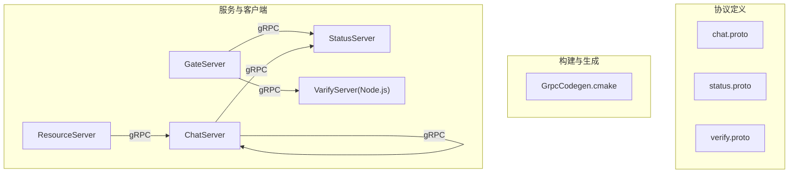
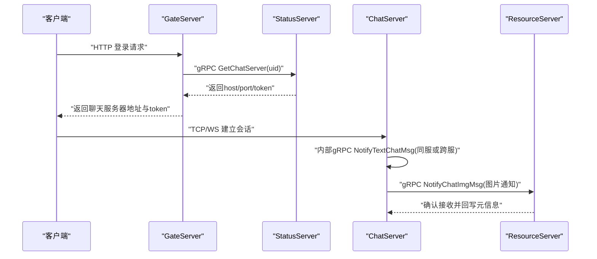
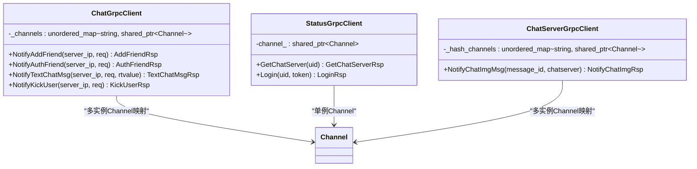
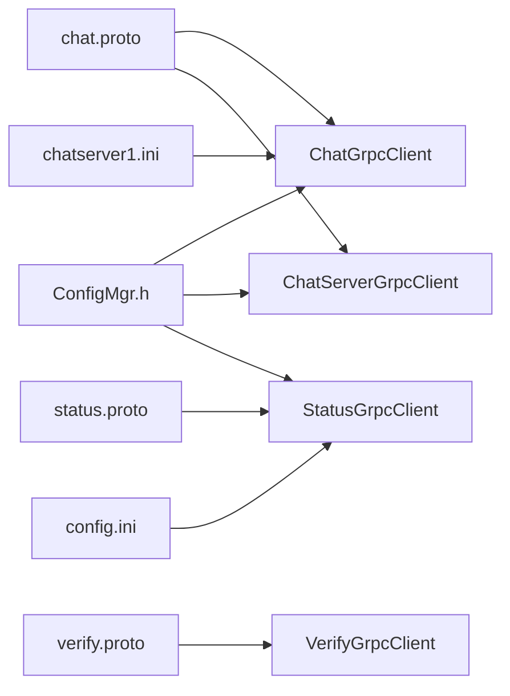

# gRPC调用优化

<cite>
**本文引用的文件**   
- [chat.proto](file://proto/chat_service/chat.proto)
- [status.proto](file://proto/status_service/status.proto)
- [verify.proto](file://proto/verify_service/verify.proto)
- [ChatGrpcClient.h](file://server/ChatServer/include/ChatGrpcClient.h)
- [ChatGrpcClient.cpp](file://server/ChatServer/src/ChatGrpcClient.cpp)
- [StatusGrpcClient.h](file://server/GateServer/include/StatusGrpcClient.h)
- [StatusGrpcClient.cpp](file://server/GateServer/src/StatusGrpcClient.cpp)
- [ChatServerGrpcClient.h](file://server/ResourceServer/include/ChatServerGrpcClient.h)
- [ChatServerGrpcClient.cpp](file://server/ResourceServer/src/ChatServerGrpcClient.cpp)
- [ConfigMgr.h](file://server/ChatServer/include/ConfigMgr.h)
- [chatserver1.ini](file://server/ChatServer/config/chatserver1.ini)
- [config.ini](file://server/GateServer/config/config.ini)
- [GrpcCodegen.cmake](file://cmake/GrpcCodegen.cmake)
- [const.h](file://server/ChatServer/include/const.h)
- [day34多服程踢人逻辑.md](file://开发文档/day34多服程踢人逻辑.md)
- [day29-好友认证和聊天通信.md](file://开发文档/day29-好友认证和聊天通信.md)
- [day42-用户加载聊天资源.md](file://开发文档/day42-用户加载聊天资源.md)
</cite>

## 更新摘要
**已完成的变更**   
- 连接池优化已替换为gRPC原生通道管理机制
- 所有RPC调用添加了3秒超时机制防止连接挂起
- 简化了客户端实现，移除了复杂的连接池管理逻辑
- 使用gRPC内置的Channel生命周期管理替代自定义连接池

## 目录
1. [简介](#简介)
2. [项目结构](#项目结构)
3. [核心组件](#核心组件)
4. [架构总览](#架构总览)
5. [详细组件分析](#详细组件分析)
6. [依赖关系分析](#依赖关系分析)
7. [性能考量](#性能考量)
8. [故障排查指南](#故障排查指南)
9. [结论](#结论)
10. [附录](#附录)

## 简介
本技术文档围绕LLFCChat项目的gRPC调用进行系统性优化说明，覆盖Protocol Buffers序列化设计、客户端连接管理（基于gRPC原生Channel）、流式通信优化技巧、拦截器使用（日志、鉴权、错误处理）、网络传输层优化（压缩、超时、重试），以及微服务间调用的监控、链路追踪与故障诊断方法。文档同时给出可落地的配置示例与最佳实践，帮助读者在现有工程基础上快速提升gRPC性能与稳定性。

**重要更新**：项目已从自定义连接池迁移到gRPC原生Channel管理，并实现了统一的3秒超时机制，显著提升了系统的稳定性和资源利用率。

## 项目结构
本项目采用多服务拆分：GateServer作为HTTP入口，StatusServer负责服务发现与登录令牌，ChatServer提供聊天业务RPC，ResourceServer负责资源通知，VerifyService为Node.js实现的验证码服务。Proto定义位于proto目录，CMake脚本负责代码生成。各服务端通过gRPC原生Channel实现跨服务调用。

**图表来源**
- [chat.proto:1-105](file://proto/chat_service/chat.proto#L1-L105)
- [status.proto:1-32](file://proto/status_service/status.proto#L1-L32)
- [verify.proto:1-19](file://proto/verify_service/verify.proto#L1-L19)
- [GrpcCodegen.cmake:1-72](file://cmake/GrpcCodegen.cmake#L1-L72)

## 核心组件
- Protocol Buffers消息与服务定义：chat.proto、status.proto、verify.proto定义了跨服务交互契约。
- gRPC客户端与原生Channel管理：ChatGrpcClient、StatusGrpcClient、ChatServerGrpcClient分别封装了不同服务的RPC调用与gRPC Channel管理。
- 配置管理：ConfigMgr与INI配置文件用于动态获取目标服务地址与端口。
- 错误码与工具：const.h中的ErrorCodes与Defer辅助统一错误处理与资源释放。

**章节来源**
- [ChatGrpcClient.h:1-100](file://server/ChatServer/include/ChatGrpcClient.h#L1-L100)
- [ChatGrpcClient.cpp:1-191](file://server/ChatServer/src/ChatGrpcClient.cpp#L1-L191)
- [StatusGrpcClient.h:1-36](file://server/GateServer/include/StatusGrpcClient.h#L1-L36)
- [StatusGrpcClient.cpp:1-49](file://server/GateServer/src/StatusGrpcClient.cpp#L1-L49)
- [ChatServerGrpcClient.h:1-30](file://server/ResourceServer/include/ChatServerGrpcClient.h#L1-L30)
- [ChatServerGrpcClient.cpp:1-50](file://server/ResourceServer/src/ChatServerGrpcClient.cpp#L1-L50)
- [ConfigMgr.h:1-84](file://server/ChatServer/include/ConfigMgr.h#L1-L84)
- [const.h:1-104](file://server/ChatServer/include/const.h#L1-L104)

## 架构总览
下图展示了LLFCChat中gRPC服务间的调用关系与数据流向，包括登录流程、聊天消息转发、图片通知等关键路径。

**图表来源**
- [StatusGrpcClient.cpp:1-49](file://server/GateServer/src/StatusGrpcClient.cpp#L1-L49)
- [ChatGrpcClient.cpp:1-191](file://server/ChatServer/src/ChatGrpcClient.cpp#L1-L191)
- [ChatServerGrpcClient.cpp:1-50](file://server/ResourceServer/src/ChatServerGrpcClient.cpp#L1-L50)

## 详细组件分析

### Protocol Buffers设计与序列化优化
- 字段类型选择
  - 使用int32表示ID与状态码，减少序列化体积；对大整数如文件大小使用int64。
  - 字符串字段仅承载必要文本（用户名、昵称、文件名等），避免冗余。
  - 列表字段repeated用于批量消息（如文本聊天消息数组），降低往返次数。
- 消息结构设计
  - 请求/响应分离，明确error字段用于业务错误码，便于上层统一处理。
  - 将高频字段放在靠前位置，有利于protobuf变长编码优化。
- 生成与集成
  - 通过CMake脚本统一生成.pb与.grpc.pb文件，确保编译期一致性。

**章节来源**
- [chat.proto:1-105](file://proto/chat_service/chat.proto#L1-L105)
- [status.proto:1-32](file://proto/status_service/status.proto#L1-L32)
- [verify.proto:1-19](file://proto/verify_service/verify.proto#L1-L19)
- [GrpcCodegen.cmake:1-72](file://cmake/GrpcCodegen.cmake#L1-L72)

### gRPC原生Channel管理机制
**重大更新**：项目已从自定义连接池迁移到gRPC原生Channel管理，大幅简化了代码复杂度并提升了可靠性。

- **Channel生命周期管理**
  - 每个服务对应一个或多个Channel实例，由gRPC框架自动管理连接生命周期。
  - Channel支持连接复用、自动重连和负载均衡，无需手动维护连接池。
  - 使用`grpc::CreateChannel()`创建Channel，配合`InsecureChannelCredentials()`进行连接配置。

- **Channel映射表设计**
  - `ChatGrpcClient`使用`unordered_map<std::string, std::shared_ptr<Channel>>`存储多个目标服务器的Channel。
  - `ChatServerGrpcClient`同样使用映射表管理多个ChatServer实例的连接。
  - `StatusGrpcClient`使用单一Channel连接到StatusServer。

- **Stub按需创建**
  - 每次RPC调用时根据Channel创建新的Stub实例，避免连接竞争。
  - Stub是轻量级对象，创建开销极小，适合频繁创建销毁。

**图表来源**
- [ChatGrpcClient.h:1-100](file://server/ChatServer/include/ChatGrpcClient.h#L1-L100)
- [StatusGrpcClient.h:1-36](file://server/GateServer/include/StatusGrpcClient.h#L1-L36)
- [ChatServerGrpcClient.h:1-30](file://server/ResourceServer/include/ChatServerGrpcClient.h#L1-L30)

**章节来源**
- [ChatGrpcClient.cpp:1-191](file://server/ChatServer/src/ChatGrpcClient.cpp#L1-L191)
- [StatusGrpcClient.cpp:1-49](file://server/GateServer/src/StatusGrpcClient.cpp#L1-L49)
- [ChatServerGrpcClient.cpp:1-50](file://server/ResourceServer/src/ChatServerGrpcClient.cpp#L1-L50)

### 3秒超时机制实现
**新增功能**：所有RPC调用都实现了统一的3秒超时机制，有效防止连接挂起和资源泄漏。

- **超时设置原理**
  - 使用`ClientContext::set_deadline()`设置调用截止时间。
  - 超时时间设置为当前系统时间加3秒：`std::chrono::system_clock::now() + std::chrono::seconds(3)`。
  - 超时后gRPC框架自动返回错误状态，避免长时间阻塞。

- **超时应用场景**
  - 所有跨服务RPC调用都应用3秒超时，包括好友申请、消息转发、用户踢出等操作。
  - 超时保护适用于网络异常、服务不可用、死锁等场景。
  - 超时错误被统一转换为`ErrorCodes::RPCFailed`，便于上层处理。

- **超时配置优势**
  - 防止资源耗尽：避免线程长时间等待导致内存和CPU资源浪费。
  - 提高系统弹性：超时失败的服务可以快速降级或重试。
  - 改善用户体验：用户不会因服务无响应而长时间等待。

**章节来源**
- [ChatGrpcClient.cpp:32-57](file://server/ChatServer/src/ChatGrpcClient.cpp#L32-L57)
- [ChatGrpcClient.cpp:104-129](file://server/ChatServer/src/ChatGrpcClient.cpp#L104-L129)
- [ChatGrpcClient.cpp:131-164](file://server/ChatServer/src/ChatGrpcClient.cpp#L131-L164)
- [ChatGrpcClient.cpp:166-190](file://server/ChatServer/src/ChatGrpcClient.cpp#L166-L190)
- [StatusGrpcClient.cpp:3-19](file://server/GateServer/src/StatusGrpcClient.cpp#L3-L19)
- [StatusGrpcClient.cpp:21-39](file://server/GateServer/src/StatusGrpcClient.cpp#L21-L39)
- [ChatServerGrpcClient.cpp:4-37](file://server/ResourceServer/src/ChatServerGrpcClient.cpp#L4-L37)

### 流式通信优化技巧
- 双向流
  - 适用于实时聊天场景，可减少握手开销，但需考虑背压与内存控制。
  - 建议在客户端侧限制并发写入与缓冲上限，服务端侧做限流与丢弃策略。
- 服务端流
  - 适合推送大量历史消息或事件流，客户端应分页消费并及时ack。
- 客户端流
  - 适合批量上传（如图片分片），服务端应聚合处理并返回进度。
- 当前项目以单向RPC为主，未来可按场景引入流式接口以提升吞吐与延迟表现。

### gRPC拦截器的使用
- 日志记录
  - 建议在全局拦截器中记录请求ID、耗时、入参摘要与出参状态码，便于链路追踪。
- 认证授权
  - 在拦截器中校验Token或签名，拒绝非法请求，减少后端压力。
- 错误处理
  - 统一包装异常为gRPC状态码，配合业务错误码形成双层错误体系。
- 当前工程未内置拦截器，可在ServerBuilder中添加自定义拦截器链。

### 网络传输层优化
- 压缩算法
  - 根据负载特征选择gzip或deflate，文本消息适合gzip，二进制图片建议走独立通道。
- 超时配置
  - 设置合理的CallTimeout与ChannelIdleTimeout，避免长时间阻塞。
- 重试机制
  - 对幂等请求启用指数退避重试，非幂等请求谨慎重试并结合去重。
- 当前工程使用InsecureChannelCredentials，生产环境建议启用TLS与证书校验。

### 微服务间调用的监控、链路追踪与故障诊断
- 监控指标
  - 暴露QPS、P99延迟、错误率、连接池利用率、重试次数等指标。
- 链路追踪
  - 注入TraceID贯穿上下游，结合日志与APM平台定位瓶颈。
- 故障诊断
  - 利用错误码与日志快速定位问题，结合分布式锁与缓存命中率分析热点。

## 依赖关系分析
- Proto依赖：所有服务共享proto定义，保证契约一致。
- 客户端依赖：各服务客户端依赖各自的Channel管理与配置管理器。
- 配置依赖：INI文件驱动服务地址与端口，便于热更新与多实例部署。

**图表来源**
- [chat.proto:1-105](file://proto/chat_service/chat.proto#L1-L105)
- [status.proto:1-32](file://proto/status_service/status.proto#L1-L32)
- [verify.proto:1-19](file://proto/verify_service/verify.proto#L1-L19)
- [ChatGrpcClient.h:1-100](file://server/ChatServer/include/ChatGrpcClient.h#L1-L100)
- [ChatServerGrpcClient.h:1-30](file://server/ResourceServer/include/ChatServerGrpcClient.h#L1-L30)
- [StatusGrpcClient.h:1-36](file://server/GateServer/include/StatusGrpcClient.h#L1-L36)
- [ConfigMgr.h:1-84](file://server/ChatServer/include/ConfigMgr.h#L1-L84)
- [chatserver1.ini:1-30](file://server/ChatServer/config/chatserver1.ini#L1-L30)
- [config.ini:1-25](file://server/GateServer/config/config.ini#L1-L25)

## 性能考量
- **Channel管理优化**
  - 使用gRPC原生Channel替代自定义连接池，减少内存占用和上下文切换开销。
  - Channel自动管理连接生命周期，避免连接泄漏和僵尸连接问题。
- **超时机制**
  - 3秒超时有效防止资源耗尽，提高系统整体稳定性。
  - 超时失败可以快速重试或降级，避免雪崩效应。
- **序列化优化**
  - 合理划分消息结构，减少不必要的字段与嵌套，优先使用数值类型。
- **压缩与带宽**
  - 对文本消息启用压缩，对二进制数据采用独立通道与分片传输。
- **监控与观测**
  - 采集关键指标，结合告警与自动化扩容提升系统弹性。

## 故障排查指南
- **常见错误码**
  - RPCFailed表示gRPC调用失败，需检查网络、服务状态与超时配置。
  - TokenInvalid与UidInvalid涉及鉴权与用户有效性，需核对上游参数。
  - ServerIpErr表示目标服务器IP不存在，需检查配置映射。
- **日志与追踪**
  - 在客户端与服务端添加详细日志，包含请求ID、耗时与堆栈。
- **Channel相关问题**
  - 观察Channel创建失败和连接异常，确保配置正确和服务可达。
  - 检查超时设置是否合理，避免过短导致误判或过长导致资源占用。
- **配置错误**
  - 检查INI文件中Host与Port是否正确，PeerServer列表是否完整。

**章节来源**
- [const.h:1-104](file://server/ChatServer/include/const.h#L1-L104)
- [ChatGrpcClient.cpp:1-191](file://server/ChatServer/src/ChatGrpcClient.cpp#L1-L191)
- [StatusGrpcClient.cpp:1-49](file://server/GateServer/src/StatusGrpcClient.cpp#L1-L49)
- [ChatServerGrpcClient.cpp:1-50](file://server/ResourceServer/src/ChatServerGrpcClient.cpp#L1-L50)
- [chatserver1.ini:1-30](file://server/ChatServer/config/chatserver1.ini#L1-L30)
- [config.ini:1-25](file://server/GateServer/config/config.ini#L1-L25)

## 结论
通过对Proto设计、gRPC原生Channel管理、3秒超时机制、流式通信、拦截器、网络传输层与监控追踪的系统化优化，LLFCChat的gRPC调用可实现更高的吞吐、更低的延迟与更强的稳定性。从自定义连接池迁移到gRPC原生Channel管理，不仅简化了代码复杂度，还显著提升了系统的可靠性和可维护性。建议在生产环境中逐步引入拦截器、压缩、重试与全链路监控，持续迭代完善。

## 附录
- **配置示例**
  - chatserver1.ini与config.ini展示了服务地址、端口与依赖服务配置，便于快速搭建多实例环境。
- **最佳实践**
  - 统一错误码与日志格式，避免硬编码；Channel与超时参数按压测结果调优；敏感信息加密传输。
  - 使用gRPC原生Channel管理替代自定义连接池，充分利用框架的优化特性。
  - 始终设置合理的超时时间，防止连接挂起和资源泄漏。

**章节来源**
- [chatserver1.ini:1-30](file://server/ChatServer/config/chatserver1.ini#L1-L30)
- [config.ini:1-25](file://server/GateServer/config/config.ini#L1-L25)