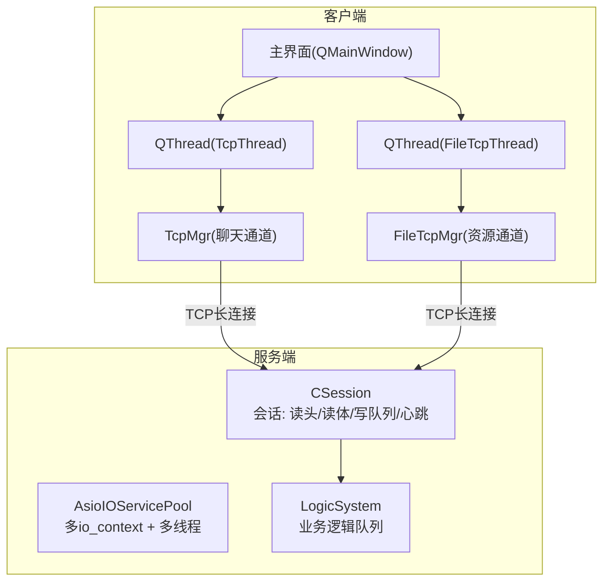
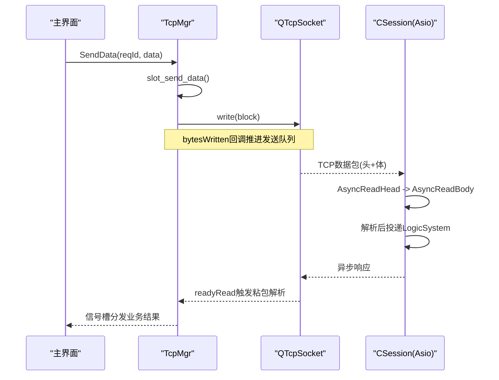
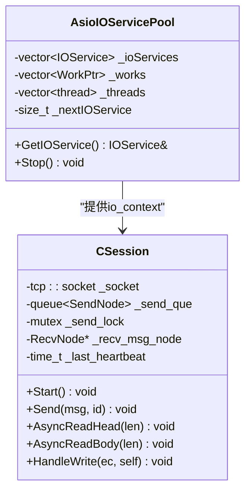
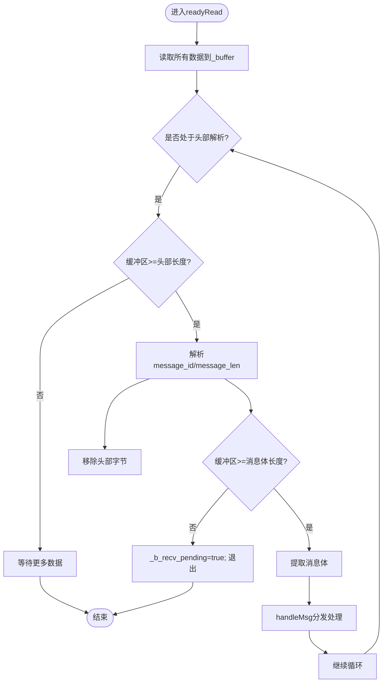
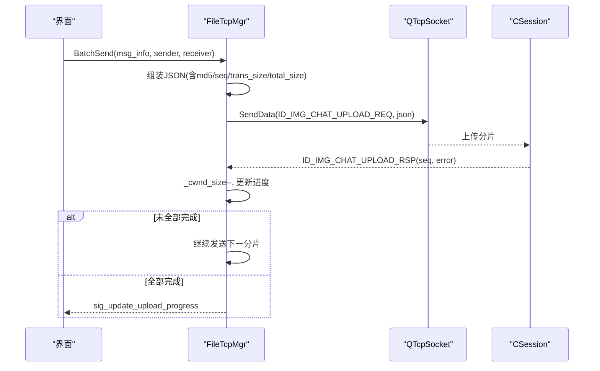
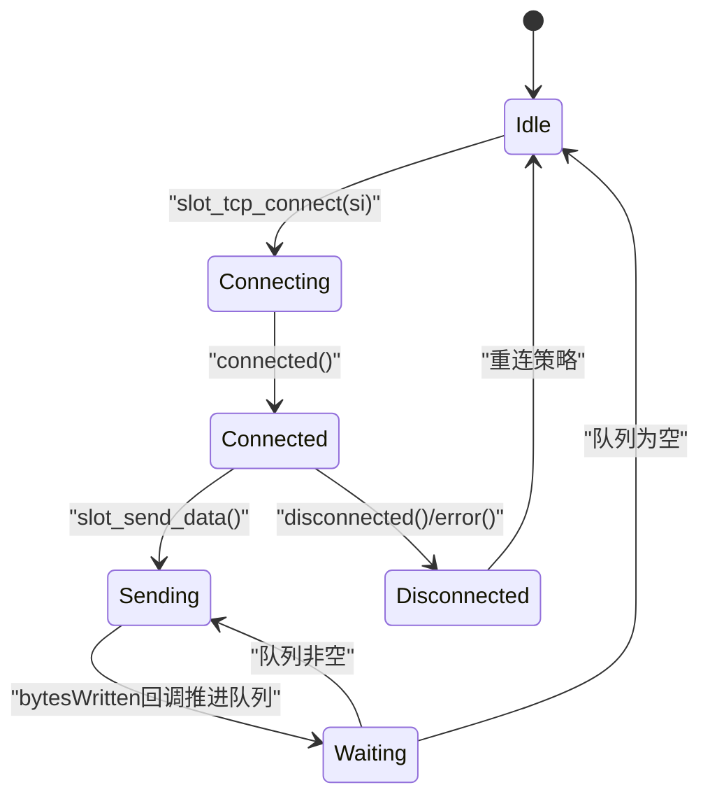
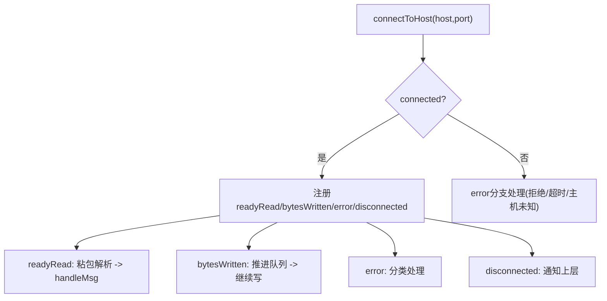
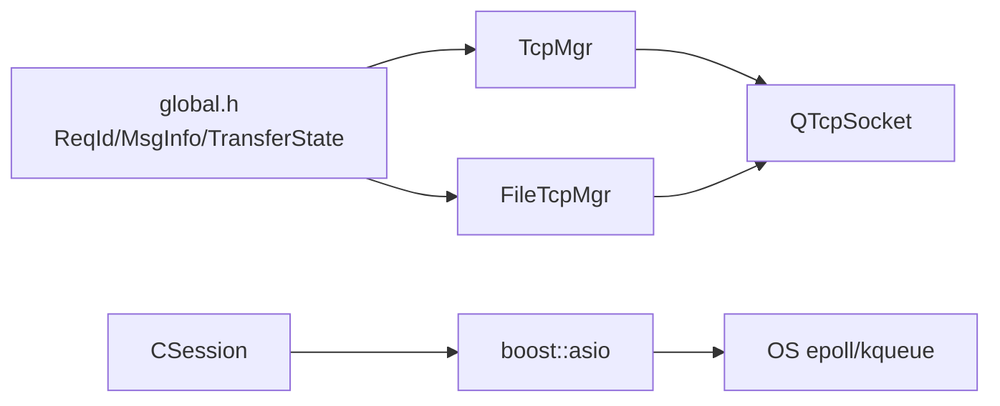

# 异步IO优化

<cite>
**本文引用的文件**   
- [tcpmgr.h](file://client/llfcchat/include/tcpmgr.h)
- [tcpmgr.cpp](file://client/llfcchat/src/tcpmgr.cpp)
- [filetcpmgr.h](file://client/llfcchat/include/filetcpmgr.h)
- [filetcpmgr.cpp](file://client/llfcchat/src/filetcpmgr.cpp)
- [global.h](file://client/llfcchat/include/global.h)
- [AsioIOServicePool.h](file://server/ChatServer/include/AsioIOServicePool.h)
- [AsioIOServicePool.cpp](file://server/ChatServer/src/AsioIOServicePool.cpp)
- [CSession.h](file://server/ChatServer/include/CSession.h)
- [CSession.cpp](file://server/ChatServer/src/CSession.cpp)
- [main.cpp](file://client/llfcchat/src/main.cpp)
</cite>

## 目录
1. [引言](#引言)
2. [项目结构](#项目结构)
3. [核心组件](#核心组件)
4. [架构总览](#架构总览)
5. [详细组件分析](#详细组件分析)
6. [依赖关系分析](#依赖关系分析)
7. [性能考量](#性能考量)
8. [故障排查指南](#故障排查指南)
9. [结论](#结论)
10. [附录](#附录)

## 引言
本技术文档围绕LLFCChat客户端与服务器端的异步I/O优化展开，重点解释Boost.Asio的异步事件循环、I/O多路复用与零拷贝在服务器端的应用；同时深入剖析客户端TcpMgr类的异步发送队列设计、缓冲区管理与内存优化策略。文档还记录Qt线程模型与Asio集成的方案（QThread的使用与信号槽机制），并给出TCP连接的异步建立、数据收发与错误处理流程。最后提供避免阻塞操作的正确用法示例与高并发场景下的资源竞争处理建议。

## 项目结构
本项目采用“客户端（Qt）+ 服务端（C++/Boost.Asio）”的分层架构：
- 客户端使用Qt网络模块（QTcpSocket）实现消息粘包/拆包、异步读写与信号槽驱动的业务分发；通过独立线程管理聊天与资源传输两个连接通道。
- 服务端基于Boost.Asio构建高性能事件循环池，按CPU核数分配多个io_context，每个上下文一个线程运行run()，实现高并发连接处理。

**图表来源** 
- [main.cpp:36-42](file://client/llfcchat/src/main.cpp#L36-L42)
- [AsioIOServicePool.h:12-27](file://server/ChatServer/include/AsioIOServicePool.h#L12-L27)
- [AsioIOServicePool.cpp:4-16](file://server/ChatServer/src/AsioIOServicePool.cpp#L4-L16)
- [CSession.h:28-76](file://server/ChatServer/include/CSession.h#L28-L76)

**章节来源**
- [main.cpp:36-42](file://client/llfcchat/src/main.cpp#L36-L42)
- [AsioIOServicePool.h:12-27](file://server/ChatServer/include/AsioIOServicePool.h#L12-L27)
- [AsioIOServicePool.cpp:4-16](file://server/ChatServer/src/AsioIOServicePool.cpp#L4-L16)
- [CSession.h:28-76](file://server/ChatServer/include/CSession.h#L28-L76)

## 核心组件
- 客户端聊天通道管理器 TcpMgr：封装QTcpSocket的异步读写、粘包处理、发送队列与信号槽分发。
- 客户端资源通道管理器 FileTcpMgr：负责头像上传、图片下载、断点续传、拥塞窗口控制等。
- 服务端会话 CSession：基于Boost.Asio的异步读头/读体、异步写队列、心跳检测与异常清理。
- 服务端事件循环池 AsioIOServicePool：多io_context轮询分配，线程级并行执行事件循环。

**章节来源**
- [tcpmgr.h:22-87](file://client/llfcchat/include/tcpmgr.h#L22-L87)
- [filetcpmgr.h:26-82](file://client/llfcchat/include/filetcpmgr.h#L26-L82)
- [CSession.h:28-76](file://server/ChatServer/include/CSession.h#L28-L76)
- [AsioIOServicePool.h:8-27](file://server/ChatServer/include/AsioIOServicePool.h#L8-L27)

## 架构总览
下图展示从UI发起请求到网络收发、再到业务处理的完整调用链，体现Qt信号槽与Asio事件驱动的协作方式。

**图表来源** 
- [tcpmgr.cpp:103-129](file://client/llfcchat/src/tcpmgr.cpp#L103-L129)
- [CSession.cpp:130-191](file://server/ChatServer/src/CSession.cpp#L130-L191)
- [CSession.cpp:87-128](file://server/ChatServer/src/CSession.cpp#L87-L128)

## 详细组件分析

### Boost.Asio异步IO模型（服务器端）
- 事件循环机制：AsioIOServicePool为每个io_context创建独立线程并调用run()，形成事件循环。GetIOService()以轮询方式返回io_context，保证负载均衡。
- I/O多路复用：底层由操作系统epoll/kqueue/select等实现，Asio将socket事件统一抽象为回调，避免阻塞。
- 零拷贝技术：async_write使用buffer包装原生内存，减少内核态与用户态之间的数据拷贝次数；结合固定大小缓冲区和队列顺序写入，降低内存碎片。

**图表来源** 
- [AsioIOServicePool.h:8-27](file://server/ChatServer/include/AsioIOServicePool.h#L8-L27)
- [AsioIOServicePool.cpp:4-16](file://server/ChatServer/src/AsioIOServicePool.cpp#L4-L16)
- [CSession.h:28-76](file://server/ChatServer/include/CSession.h#L28-L76)
- [CSession.cpp:43-75](file://server/ChatServer/src/CSession.cpp#L43-L75)

**章节来源**
- [AsioIOServicePool.h:12-27](file://server/ChatServer/include/AsioIOServicePool.h#L12-L27)
- [AsioIOServicePool.cpp:4-16](file://server/ChatServer/src/AsioIOServicePool.cpp#L4-L16)
- [CSession.cpp:130-191](file://server/ChatServer/src/CSession.cpp#L130-L191)

### TcpMgr类：异步发送队列、缓冲区与内存优化
- 发送队列设计：使用QQueue保存待发送块，bytesWritten回调中推进队列，避免阻塞式write；_pending标志位确保同一时刻仅有一个块在写。
- 缓冲区管理：readyRead中持续读取所有可用数据，维护_buffer与_b_recv_pending状态机，完成头部与消息体的粘包/拆包。
- 内存优化：每次解析头部时重新构造QDataStream，避免流状态污染；mid/len字段解析后立即移除已消费字节，防止缓冲区膨胀。

**图表来源** 
- [tcpmgr.cpp:18-55](file://client/llfcchat/src/tcpmgr.cpp#L18-L55)

**章节来源**
- [tcpmgr.h:48-55](file://client/llfcchat/include/tcpmgr.h#L48-L55)
- [tcpmgr.cpp:18-55](file://client/llfcchat/src/tcpmgr.cpp#L18-L55)
- [tcpmgr.cpp:103-129](file://client/llfcchat/src/tcpmgr.cpp#L103-L129)

### FileTcpMgr：文件传输与拥塞窗口控制
- 拥塞窗口：_cwnd_size用于限制并发发送的数据块数量，收到ID_IMG_CHAT_UPLOAD_RSP或ID_IMG_CHAT_CONTINUE_UPLOAD_RSP时递减，避免突发流量导致拥塞。
- 断点续传：根据seq与trans_size定位文件偏移，支持暂停/恢复；下载侧按seq覆盖或追加写入，完成后通知界面。
- 批量发送：BatchSend与ContinueUpload/Download接口配合UserMgr中的传输状态机，实现有序、可控的文件传输。

**图表来源** 
- [filetcpmgr.cpp:521-608](file://client/llfcchat/src/filetcpmgr.cpp#L521-L608)
- [filetcpmgr.cpp:610-693](file://client/llfcchat/src/filetcpmgr.cpp#L610-L693)

**章节来源**
- [filetcpmgr.h:55-64](file://client/llfcchat/include/filetcpmgr.h#L55-L64)
- [filetcpmgr.cpp:186-221](file://client/llfcchat/src/filetcpmgr.cpp#L186-L221)
- [filetcpmgr.cpp:521-608](file://client/llfcchat/src/filetcpmgr.cpp#L521-L608)

### Qt线程模型与Asio集成
- 线程隔离：main.cpp启动TcpThread与FileTcpThread，分别承载聊天与资源通道的网络事件，避免阻塞UI线程。
- 信号槽跨线程：TcpMgr/FileTcpMgr暴露sig_send_data等信号，其他线程emit后由对应对象所在线程的槽函数处理，保证线程安全。
- 性能考虑：信号槽默认QueuedConnection跨线程自动排队，避免锁竞争；网络I/O集中在专用线程，UI保持流畅。

**图表来源** 
- [main.cpp:36-42](file://client/llfcchat/src/main.cpp#L36-L42)
- [tcpmgr.cpp:12-16](file://client/llfcchat/src/tcpmgr.cpp#L12-L16)
- [tcpmgr.cpp:94-98](file://client/llfcchat/src/tcpmgr.cpp#L94-L98)

**章节来源**
- [main.cpp:36-42](file://client/llfcchat/src/main.cpp#L36-L42)
- [tcpmgr.h:56-87](file://client/llfcchat/include/tcpmgr.h#L56-L87)

### TCP连接的异步建立、数据收发与错误处理
- 异步建立：connectToHost后监听connected/disconnected/error信号，区分拒绝、超时、主机不可达等错误类型。
- 数据收发：readyRead粘包解析；bytesWritten推进发送队列；handleMsg按ReqId路由到具体业务处理器。
- 错误处理：error信号分支处理不同错误码；断开后发出sig_connection_closed供上层重连或提示。

**图表来源** 
- [tcpmgr.cpp:12-16](file://client/llfcchat/src/tcpmgr.cpp#L12-L16)
- [tcpmgr.cpp:18-55](file://client/llfcchat/src/tcpmgr.cpp#L18-L55)
- [tcpmgr.cpp:64-91](file://client/llfcchat/src/tcpmgr.cpp#L64-L91)
- [tcpmgr.cpp:94-98](file://client/llfcchat/src/tcpmgr.cpp#L94-L98)

**章节来源**
- [tcpmgr.cpp:12-16](file://client/llfcchat/src/tcpmgr.cpp#L12-L16)
- [tcpmgr.cpp:18-55](file://client/llfcchat/src/tcpmgr.cpp#L18-L55)
- [tcpmgr.cpp:64-91](file://client/llfcchat/src/tcpmgr.cpp#L64-L91)
- [tcpmgr.cpp:94-98](file://client/llfcchat/src/tcpmgr.cpp#L94-L98)

## 依赖关系分析
- 客户端依赖Qt网络库与JSON解析；业务层通过全局ReqId枚举进行消息路由。
- 服务端依赖Boost.Asio与Beast（HTTP），并通过LogicSystem解耦网络与业务。
- 线程间通过信号槽通信，避免共享状态直接访问，降低锁粒度。

**图表来源** 
- [global.h:43-88](file://client/llfcchat/include/global.h#L43-L88)
- [tcpmgr.h:3-12](file://client/llfcchat/include/tcpmgr.h#L3-L12)
- [filetcpmgr.h:4-15](file://client/llfcchat/include/filetcpmgr.h#L4-L15)
- [CSession.h:2-16](file://server/ChatServer/include/CSession.h#L2-L16)

**章节来源**
- [global.h:43-88](file://client/llfcchat/include/global.h#L43-L88)
- [tcpmgr.h:3-12](file://client/llfcchat/include/tcpmgr.h#L3-L12)
- [filetcpmgr.h:4-15](file://client/llfcchat/include/filetcpmgr.h#L4-L15)
- [CSession.h:2-16](file://server/ChatServer/include/CSession.h#L2-L16)

## 性能考量
- 事件循环并行化：服务端按CPU核数创建io_context，提升并发能力。
- 零拷贝与缓冲复用：async_write使用buffer包装，减少拷贝；固定大小缓冲与队列顺序写入降低内存碎片。
- 发送队列与拥塞控制：客户端通过bytesWritten推进队列，FileTcpMgr用_cwnd_size限制并发分片，避免拥塞。
- 粘包处理效率：readyRead一次性读取并循环解析，避免频繁系统调用；mid/len解析后立即释放已消费字节。
- 线程隔离与信号槽：网络I/O与UI分离，QueuedConnection天然排队，避免锁竞争。

[本节为通用指导，不直接分析具体文件]

## 故障排查指南
- 连接失败：检查error分支的错误码（拒绝、超时、主机未知），确认配置host/port与防火墙规则。
- 粘包/丢包：确认readyRead循环是否正确判断头部与消息体长度；检查_buffer移除逻辑与_b_recv_pending状态切换。
- 发送阻塞：观察bytesWritten回调是否被触发；检查_send_queue是否为空与_pending标志位是否正确复位。
- 文件传输中断：核对_cwnd_size变化与seq一致性；确认断点续传的trans_size与文件偏移匹配。

**章节来源**
- [tcpmgr.cpp:64-91](file://client/llfcchat/src/tcpmgr.cpp#L64-L91)
- [tcpmgr.cpp:18-55](file://client/llfcchat/src/tcpmgr.cpp#L18-L55)
- [tcpmgr.cpp:103-129](file://client/llfcchat/src/tcpmgr.cpp#L103-L129)
- [filetcpmgr.cpp:521-608](file://client/llfcchat/src/filetcpmgr.cpp#L521-L608)

## 结论
LLFCChat通过客户端Qt信号槽与服务器端Boost.Asio事件循环的高效协作，实现了高并发、低延迟的异步I/O架构。TcpMgr与FileTcpMgr分别在聊天与资源通道上提供了稳定的粘包处理、发送队列与拥塞控制；服务端AsioIOServicePool与CSession则充分利用多核与零拷贝特性，保障大规模连接下的吞吐与稳定性。遵循本文档的实践建议，可进一步提升系统的可靠性与性能。

[本节为总结性内容，不直接分析具体文件]

## 附录
- 正确使用异步API避免阻塞：
  - 发送数据：通过Sig_send_data信号提交任务，由槽函数统一组织block并调用write，避免在主线程阻塞。
  - 接收数据：在readyRead中循环解析，不要单次readAll后直接处理大消息体，应拆分后再分发。
- 高并发资源竞争处理：
  - 使用互斥保护共享队列（如CSession::_send_lock）；客户端通过信号槽隐式序列化任务。
  - 合理设置拥塞窗口_cwnd_size与发送队列上限，防止突发流量压垮对端。

[本节为通用指导，不直接分析具体文件]