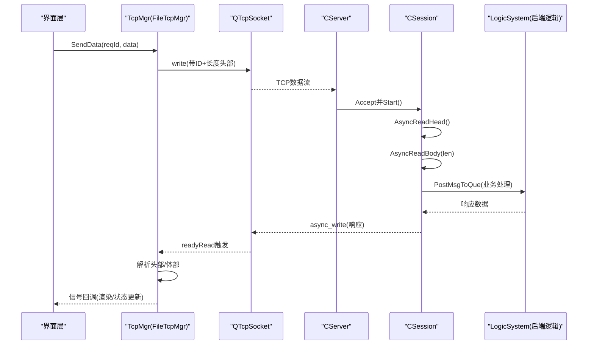
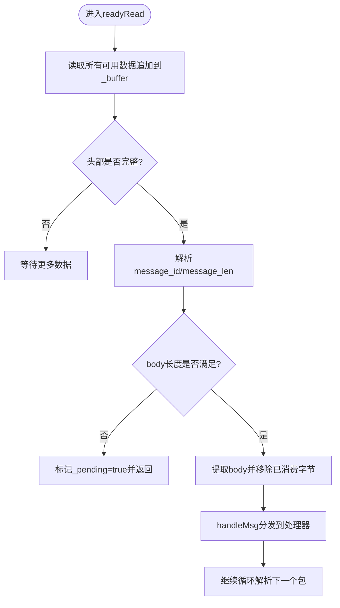
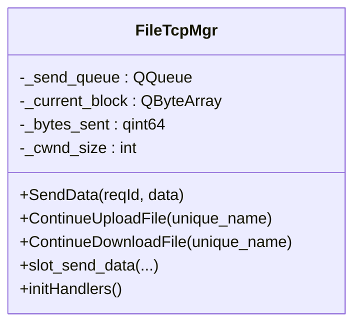
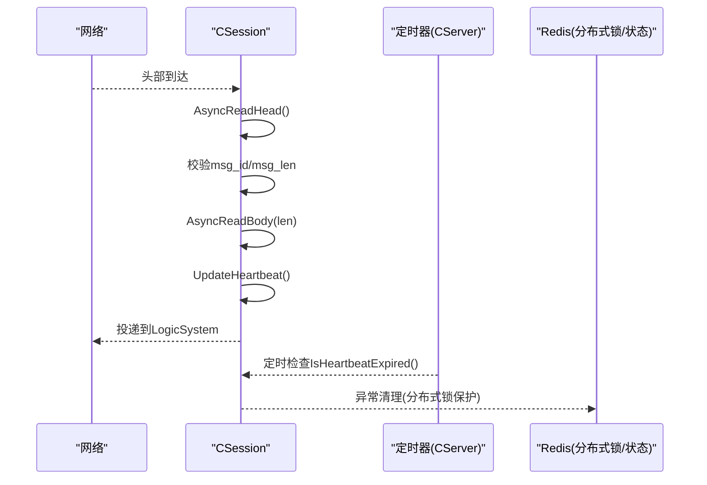
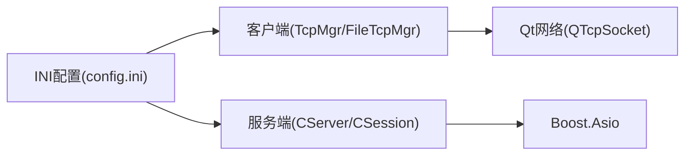

# 网络协议栈调优

<cite>
**本文引用的文件**   
- [tcpmgr.h](file://client/llfcchat/include/tcpmgr.h)
- [tcpmgr.cpp](file://client/llfcchat/src/tcpmgr.cpp)
- [filetcpmgr.h](file://client/llfcchat/include/filetcpmgr.h)
- [filetcpmgr.cpp](file://client/llfcchat/src/filetcpmgr.cpp)
- [CSession.h](file://server/ChatServer/include/CSession.h)
- [CSession.cpp](file://server/ChatServer/src/CSession.cpp)
- [CServer.h](file://server/ChatServer/include/CServer.h)
- [CServer.cpp](file://server/ChatServer/src/CServer.cpp)
- [config.ini](file://client/llfcchat/config/config.ini)
- [day35心跳逻辑.md](file://开发文档/day35心跳逻辑.md)
</cite>

## 目录
1. [简介](#简介)
2. [项目结构](#项目结构)
3. [核心组件](#核心组件)
4. [架构总览](#架构总览)
5. [详细组件分析](#详细组件分析)
6. [依赖关系分析](#依赖关系分析)
7. [性能考量与调优建议](#性能考量与调优建议)
8. [故障排查指南](#故障排查指南)
9. [结论](#结论)
10. [附录](#附录)

## 简介
本技术文档面向LLFCChat的TCP/IP协议栈，聚焦于客户端与服务端在网络层与传输层的实现细节，并结合代码现状给出可落地的调优方向。内容涵盖：
- TCP参数调优（缓冲区、窗口、拥塞控制）
- 延迟优化（Nagle/TCP_NODELAY、Keep-Alive）
- 带宽利用率优化（数据包大小、分片策略、流量整形）
- 跨平台差异处理（Windows/Linux/macOS）
- 监控指标采集与分析（吞吐、时延、丢包）
- 不同网络环境适配策略与基准测试方法

说明：当前仓库未直接暴露系统级TCP参数设置或内核参数修改接口，因此调优建议以“应用层可配置项”和“可插拔扩展点”为主，便于在不侵入系统内核的前提下获得收益。

## 项目结构
本项目采用多进程服务架构，客户端使用Qt网络模块，服务端基于Boost.Asio实现高并发I/O。关键路径如下：
- 客户端消息收发：TcpMgr/FileTcpMgr封装QTcpSocket，负责粘包/拆包、发送队列、错误处理与信号分发
- 服务端会话管理：CSession/CServer基于Boost.Asio异步读写，维护会话生命周期、心跳检测与异常清理
- 配置管理：INI配置文件用于端口等基础信息；可扩展为网络参数集中管理

```mermaid
graph TB
subgraph "客户端"
A["TcpMgr<br/>聊天消息"]
B["FileTcpMgr<br/>文件传输"]
C["QTcpSocket"]
end
subgraph "服务端"
D["CServer<br/>监听与Accept"]
E["CSession<br/>异步读写/心跳"]
F["AsioIOServicePool"]
end
A --> C
B --> C
C < --> D
D --> E
E --> F
```

**图表来源** 
- [tcpmgr.h:22-87](file://client/llfcchat/include/tcpmgr.h#L22-L87)
- [filetcpmgr.h:26-82](file://client/llfcchat/include/filetcpmgr.h#L26-L82)
- [CServer.h:10-37](file://server/ChatServer/include/CServer.h#L10-L37)
- [CSession.h:28-76](file://server/ChatServer/include/CSession.h#L28-L76)

**章节来源**
- [tcpmgr.h:22-87](file://client/llfcchat/include/tcpmgr.h#L22-L87)
- [filetcpmgr.h:26-82](file://client/llfcchat/include/filetcpmgr.h#L26-L82)
- [CServer.h:10-37](file://server/ChatServer/include/CServer.h#L10-L37)
- [CSession.h:28-76](file://server/ChatServer/include/CSession.h#L28-L76)

## 核心组件
- TcpMgr：封装聊天消息的TCP连接、粘包解析、发送队列与事件回调
- FileTcpMgr：独立文件传输通道，支持断点续传、批量发送、拥塞窗口计数
- CSession：服务端会话对象，负责异步读头/体、写队列、心跳更新与异常清理
- CServer：监听器与定时器，维护活跃会话集合、定时清理过期会话

关键职责边界：
- 客户端侧仅做应用层协议编解码与缓冲管理，不直接操作内核TCP参数
- 服务端侧通过Asio异步模型提升吞吐，结合定时器进行心跳与资源回收

**章节来源**
- [tcpmgr.cpp:18-136](file://client/llfcchat/src/tcpmgr.cpp#L18-L136)
- [filetcpmgr.cpp:16-143](file://client/llfcchat/src/filetcpmgr.cpp#L16-L143)
- [CSession.cpp:10-41](file://server/ChatServer/src/CSession.cpp#L10-L41)
- [CServer.cpp:8-14](file://server/ChatServer/src/CServer.cpp#L8-L14)

## 架构总览
下图展示一次聊天消息从客户端到服务端的完整调用链，以及文件下载的分片流程。



**图表来源** 
- [tcpmgr.cpp:18-55](file://client/llfcchat/src/tcpmgr.cpp#L18-L55)
- [filetcpmgr.cpp:16-55](file://client/llfcchat/src/filetcpmgr.cpp#L16-L55)
- [CSession.cpp:130-191](file://server/ChatServer/src/CSession.cpp#L130-L191)
- [CServer.cpp:21-38](file://server/ChatServer/src/CServer.cpp#L21-L38)

## 详细组件分析

### 客户端TcpMgr（聊天消息）
- 接收流程：readyRead累积数据，循环解析固定长度的头部（消息ID+长度），再按长度读取体部，最后分发至处理器映射表
- 发送流程：将待发数据入队，bytesWritten回调驱动分段写入，避免阻塞
- 错误处理：区分连接拒绝、远端关闭、主机不可达、超时、网络错误等，统一上报信号



**图表来源** 
- [tcpmgr.cpp:18-55](file://client/llfcchat/src/tcpmgr.cpp#L18-L55)

**章节来源**
- [tcpmgr.h:22-87](file://client/llfcchat/include/tcpmgr.h#L22-L87)
- [tcpmgr.cpp:18-136](file://client/llfcchat/src/tcpmgr.cpp#L18-L136)

### 客户端FileTcpMgr（文件传输）
- 协议：与聊天消息类似，但头部长度常量不同，且体部常包含Base64编码的文件块
- 断点续传：维护seq、trans_size、total_size、last_seq等字段，支持增量请求与写入
- 拥塞控制：内部维护_cwnd_size计数，在收到响应后递减，配合批量发送控制并发度



**图表来源** 
- [filetcpmgr.h:26-82](file://client/llfcchat/include/filetcpmgr.h#L26-L82)
- [filetcpmgr.cpp:186-221](file://client/llfcchat/src/filetcpmgr.cpp#L186-L221)

**章节来源**
- [filetcpmgr.h:26-82](file://client/llfcchat/include/filetcpmgr.h#L26-L82)
- [filetcpmgr.cpp:16-143](file://client/llfcchat/src/filetcpmgr.cpp#L16-L143)

### 服务端CSession（会话与心跳）
- 异步读：先读固定长度头部，校验msg_id/msg_len合法性，再读体部，完成后投递到逻辑队列
- 异步写：维护发送队列，按顺序async_write，失败则关闭并清理
- 心跳：记录_last_heartbeat时间戳，IsHeartbeatExpired判断是否超时；UpdateHeartbeat在每次成功读后更新



**图表来源** 
- [CSession.cpp:130-191](file://server/ChatServer/src/CSession.cpp#L130-L191)
- [CSession.cpp:285-299](file://server/ChatServer/src/CSession.cpp#L285-L299)
- [CServer.cpp:75-118](file://server/ChatServer/src/CServer.cpp#L75-L118)

**章节来源**
- [CSession.h:28-76](file://server/ChatServer/include/CSession.h#L28-L76)
- [CSession.cpp:10-41](file://server/ChatServer/src/CSession.cpp#L10-L41)
- [CSession.cpp:130-191](file://server/ChatServer/src/CSession.cpp#L130-L191)
- [CSession.cpp:285-299](file://server/ChatServer/src/CSession.cpp#L285-L299)
- [CServer.cpp:75-118](file://server/ChatServer/src/CServer.cpp#L75-L118)

### 服务端CServer（监听与心跳定时器）
- 监听：创建acceptor，异步接受连接并启动会话
- 定时器：每60秒遍历会话集合，检测心跳过期，关闭并清理无效会话，统计在线数写入Redis

**章节来源**
- [CServer.h:10-37](file://server/ChatServer/include/CServer.h#L10-L37)
- [CServer.cpp:8-14](file://server/ChatServer/src/CServer.cpp#L8-L14)
- [CServer.cpp:75-118](file://server/ChatServer/src/CServer.cpp#L75-L118)

## 依赖关系分析
- 客户端依赖Qt网络库（QTcpSocket），通过信号槽机制解耦UI与网络层
- 服务端依赖Boost.Asio，采用io_context池化与异步回调，降低线程切换开销
- 配置管理通过INI文件提供基础网络参数（如端口），可扩展为集中式网络参数管理



**图表来源** 
- [tcpmgr.h:22-87](file://client/llfcchat/include/tcpmgr.h#L22-L87)
- [filetcpmgr.h:26-82](file://client/llfcchat/include/filetcpmgr.h#L26-L82)
- [CServer.h:10-37](file://server/ChatServer/include/CServer.h#L10-L37)
- [config.ini:1-4](file://client/llfcchat/config/config.ini#L1-L4)

**章节来源**
- [config.ini:1-4](file://client/llfcchat/config/config.ini#L1-L4)

## 性能考量与调优建议
以下建议均围绕现有代码结构提出，优先保证可落地性与最小侵入性。

- 缓冲区大小
  - 客户端：当前使用QByteArray作为接收缓冲，建议在配置中引入read_buf_size与write_buf_size，并在socket建立后动态调整（若平台允许）。对于大文件传输，FileTcpMgr可按MAX_FILE_LEN分片，建议根据RTT与带宽估算最优分片大小。
  - 服务端：Asio的buffer由底层驱动管理，可在CSession::AsyncReadHead/Body中增加日志统计实际read/write大小，辅助评估是否需要增大内核缓冲区。

- 窗口大小与拥塞控制
  - 客户端：FileTcpMgr已有_cwnd_size计数，可作为应用层拥塞控制的起点。建议结合ACK速率与重传情况动态调整_cwnd_size，避免突发拥塞。
  - 服务端：CSession发送队列需限制最大长度（已有MAX_SENDQUE概念），在高负载下应结合内存占用与CPU使用率动态调整队列上限。

- 延迟优化
  - Nagle算法与TCP_NODELAY：当前代码未显式设置TCP_NODELAY。对低延迟场景（如聊天消息），建议在socket建立后立即启用TCP_NODELAY；对大文件传输，可保持默认以获得更好吞吐。
  - Keep-Alive：服务端已通过心跳维持连接活性，客户端可考虑启用TCP Keep-Alive以减少中间设备回收空闲连接的概率。

- 带宽利用率
  - 分片策略：FileTcpMgr使用Base64编码，会增加约33%开销。建议对二进制直传与文本混用场景进行协议分层，或采用更高效的序列化方案。
  - 流量整形：可在FileTcpMgr中引入令牌桶或漏桶算法，平滑突发流量，避免拥塞。

- 跨平台差异
  - Windows：可通过WSASetsockopt设置TCP_NODELAY、SO_KEEPALIVE；内核缓冲区可通过注册表或WMI查询。
  - Linux：可通过setsockopt设置TCP_NODELAY、TCP_QUICKACK、SO_RCVBUF/SO_SNDBUF；内核参数如net.core.rmem_max/net.core.wmem_max影响全局缓冲。
  - macOS：可通过sysctl查看/调整kern.ipc.somaxconn、net.inet.tcp.sendspace/receivspace等。

- 监控指标
  - 吞吐量：统计单位时间内发送/接收字节数（_bytes_sent、readAll累计）
  - 延迟：在消息头加入时间戳，计算端到端往返时延
  - 丢包率：统计重传次数与总发送次数（需依赖底层统计或抓包工具）

[本节为通用指导，不直接分析具体文件]

## 故障排查指南
- 常见错误分类
  - 连接拒绝/主机不可达/超时：客户端统一上报sig_con_success(false)，上层需重试或提示用户
  - 远端关闭：触发disconnected信号，释放资源并尝试重连
  - 网络错误：记录errorString并上报，必要时降级为HTTP或其他通道

- 调试手段
  - 打印关键路径的read/write长度与耗时，定位瓶颈
  - 使用Wireshark抓包验证协议格式与重传行为
  - 在服务端开启详细日志，观察心跳与异常清理流程

**章节来源**
- [tcpmgr.cpp:64-98](file://client/llfcchat/src/tcpmgr.cpp#L64-L98)
- [filetcpmgr.cpp:65-99](file://client/llfcchat/src/filetcpmgr.cpp#L65-L99)
- [CSession.cpp:193-217](file://server/ChatServer/src/CSession.cpp#L193-L217)
- [CServer.cpp:75-118](file://server/ChatServer/src/CServer.cpp#L75-L118)

## 结论
LLFCChat的网络协议栈在客户端与服务端分别采用Qt与Asio的高性能实现，具备清晰的粘包/拆包、异步读写与心跳机制。当前代码未直接暴露系统级TCP参数设置，调优应以应用层可配置项与扩展点为主，逐步引入TCP_NODELAY、Keep-Alive、拥塞控制与流量整形，并通过监控指标持续验证效果。

[本节为总结，不直接分析具体文件]

## 附录
- 心跳机制参考：服务器定时检测会话心跳，超过阈值则判定为过期并清理
- 配置示例：INI文件中定义GateServer的host与port，可扩展为网络参数中心化管理

**章节来源**
- [day35心跳逻辑.md:28-39](file://开发文档/day35心跳逻辑.md#L28-L39)
- [day35心跳逻辑.md:41-93](file://开发文档/day35心跳逻辑.md#L41-L93)
- [config.ini:1-4](file://client/llfcchat/config/config.ini#L1-L4)