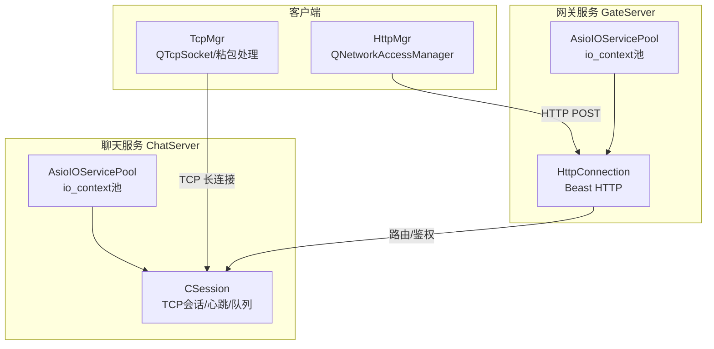
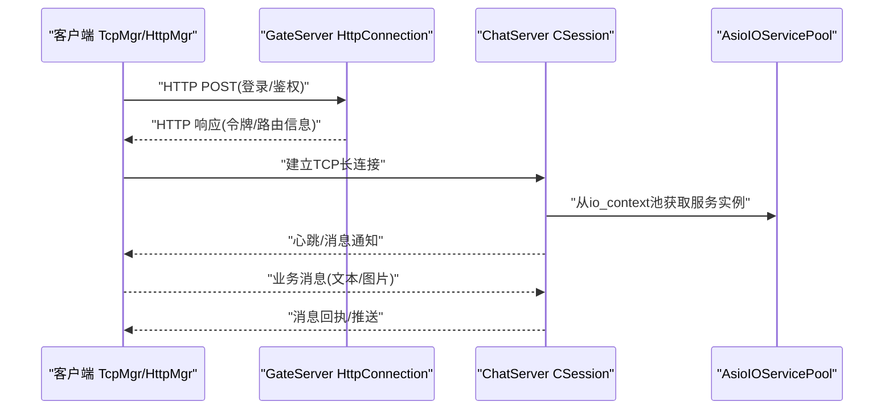
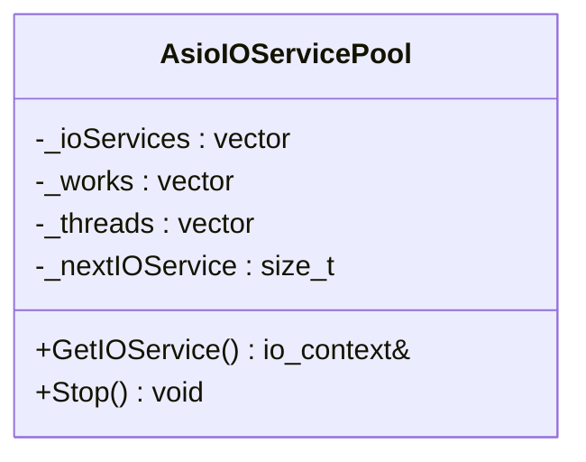
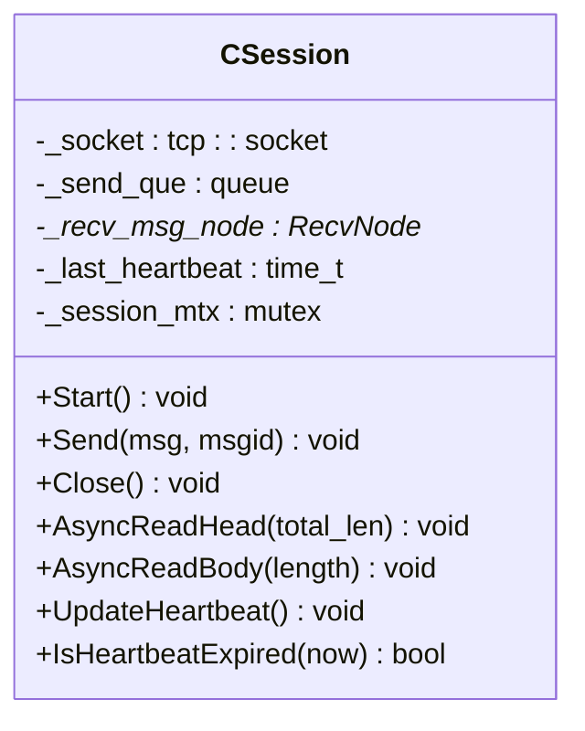
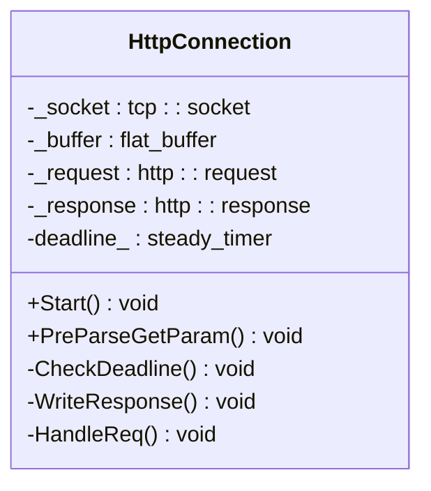
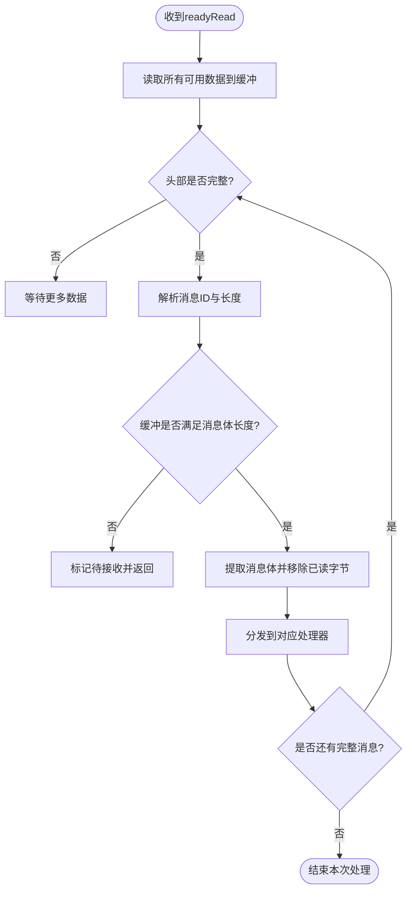
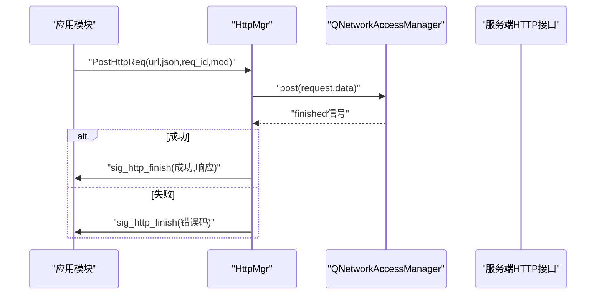
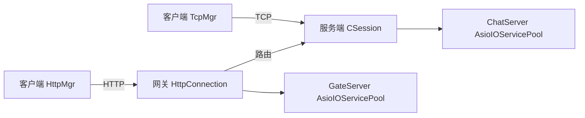

# 网络通信优化

<cite>
**本文引用的文件**   
- [AsioIOServicePool.h](file://server/ChatServer/include/AsioIOServicePool.h)
- [AsioIOServicePool.cpp](file://server/ChatServer/src/AsioIOServicePool.cpp)
- [CSession.h](file://server/ChatServer/include/CSession.h)
- [HttpConnection.h](file://server/GateServer/include/HttpConnection.h)
- [tcpmgr.h](file://client/llfcchat/include/tcpmgr.h)
- [tcpmgr.cpp](file://client/llfcchat/src/tcpmgr.cpp)
- [httpmgr.h](file://client/llfcchat/include/httpmgr.h)
- [httpmgr.cpp](file://client/llfcchat/src/httpmgr.cpp)
</cite>

## 目录
1. [引言](#引言)
2. [项目结构](#项目结构)
3. [核心组件](#核心组件)
4. [架构总览](#架构总览)
5. [详细组件分析](#详细组件分析)
6. [依赖关系分析](#依赖关系分析)
7. [性能考量](#性能考量)
8. [故障排查指南](#故障排查指南)
9. [结论](#结论)
10. [附录](#附录)

## 引言
本技术文档聚焦LLFCChat在网络通信方面的优化实践，围绕Boost.Asio异步I/O模型、事件循环调优、I/O多路复用与零拷贝策略展开；同时覆盖TCP连接池管理、连接复用与负载均衡策略；并对HTTP请求与gRPC调用进行优化说明，给出网络协议栈调优建议。文档还包含延迟优化、带宽利用率提升、数据包压缩以及高并发场景下的资源调度策略，帮助读者在工程实践中获得可落地的性能保障方案。

## 项目结构
本项目采用分层与分服务组织：
- 客户端（Qt + Boost.Asio）：负责HTTP请求封装、TCP长连接收发、消息粘包处理与UI信号分发。
- 服务端（Gate/Chat/Resource/Status等）：基于Boost.Asio与Beast构建高性能异步服务器，使用io_context池实现线程级并行与负载均衡。

图表来源
- [AsioIOServicePool.h:1-28](file://server/ChatServer/include/AsioIOServicePool.h#L1-L28)
- [AsioIOServicePool.cpp:1-43](file://server/ChatServer/src/AsioIOServicePool.cpp#L1-L43)
- [CSession.h:1-86](file://server/ChatServer/include/CSession.h#L1-L86)
- [HttpConnection.h:1-36](file://server/GateServer/include/HttpConnection.h#L1-L36)
- [tcpmgr.h:1-90](file://client/llfcchat/include/tcpmgr.h#L1-L90)
- [httpmgr.h:1-34](file://client/llfcchat/include/httpmgr.h#L1-L34)

章节来源
- [AsioIOServicePool.h:1-28](file://server/ChatServer/include/AsioIOServicePool.h#L1-L28)
- [AsioIOServicePool.cpp:1-43](file://server/ChatServer/src/AsioIOServicePool.cpp#L1-L43)
- [CSession.h:1-86](file://server/ChatServer/include/CSession.h#L1-L86)
- [HttpConnection.h:1-36](file://server/GateServer/include/HttpConnection.h#L1-L36)
- [tcpmgr.h:1-90](file://client/llfcchat/include/tcpmgr.h#L1-L90)
- [httpmgr.h:1-34](file://client/llfcchat/include/httpmgr.h#L1-L34)

## 核心组件
- AsioIOServicePool：为每个io_context分配独立线程，提供轮询获取io_context的能力，实现线程级并行与负载均衡。
- CSession：封装TCP会话的读写、心跳检测、发送队列与异常处理，是聊天服务的高并发核心。
- HttpConnection：基于Beast的HTTP连接处理器，支持超时控制与参数解析。
- TcpMgr：客户端TCP管理器，负责粘包/拆包、发送队列、错误处理与信号分发。
- HttpMgr：客户端HTTP管理器，封装POST请求与响应回调。

章节来源
- [AsioIOServicePool.h:1-28](file://server/ChatServer/include/AsioIOServicePool.h#L1-L28)
- [AsioIOServicePool.cpp:1-43](file://server/ChatServer/src/AsioIOServicePool.cpp#L1-L43)
- [CSession.h:1-86](file://server/ChatServer/include/CSession.h#L1-L86)
- [HttpConnection.h:1-36](file://server/GateServer/include/HttpConnection.h#L1-L36)
- [tcpmgr.h:1-90](file://client/llfcchat/include/tcpmgr.h#L1-L90)
- [httpmgr.h:1-34](file://client/llfcchat/include/httpmgr.h#L1-L34)

## 架构总览
下图展示了客户端与服务端的关键交互路径，包括HTTP鉴权与TCP长连接的消息通道。

图表来源
- [HttpConnection.h:1-36](file://server/GateServer/include/HttpConnection.h#L1-L36)
- [CSession.h:1-86](file://server/ChatServer/include/CSession.h#L1-L86)
- [AsioIOServicePool.cpp:1-43](file://server/ChatServer/src/AsioIOServicePool.cpp#L1-L43)
- [tcpmgr.cpp:1-800](file://client/llfcchat/src/tcpmgr.cpp#L1-L800)

## 详细组件分析

### AsioIOServicePool：事件循环与负载均衡
- 设计要点
  - 每个io_context绑定一个工作守护（work_guard），确保run()不会提前退出。
  - 启动与io_context数量一致的线程，分别运行各自的io_context。
  - GetIOService采用轮询方式返回io_context，实现简单有效的负载均衡。
  - Stop时依次stop各io_context并释放work_guard，再join线程，保证优雅关闭。
- 性能影响
  - 将I/O事件分散到多个CPU核，避免单点瓶颈。
  - 轮询选择io_context降低锁竞争，提高吞吐。
- 可扩展性
  - 可根据硬件并发数或业务负载动态调整池大小。

图表来源
- [AsioIOServicePool.h:1-28](file://server/ChatServer/include/AsioIOServicePool.h#L1-L28)
- [AsioIOServicePool.cpp:1-43](file://server/ChatServer/src/AsioIOServicePool.cpp#L1-L43)

章节来源
- [AsioIOServicePool.h:1-28](file://server/ChatServer/include/AsioIOServicePool.h#L1-L28)
- [AsioIOServicePool.cpp:1-43](file://server/ChatServer/src/AsioIOServicePool.cpp#L1-L43)

### CSession：TCP会话、心跳与发送队列
- 关键职责
  - 维护tcp::socket、会话ID、用户UID、心跳时间戳。
  - 实现异步读头/体、写队列与异常处理。
  - 心跳过期检测与异常会话清理。
- 数据流
  - 接收：先解析头部长度，再按长度读取消息体，进入逻辑处理。
  - 发送：通过队列串行化写入，避免竞态与乱序。
- 性能要点
  - 使用固定缓冲区减少内存分配。
  - 发送队列+互斥保护，保证顺序与一致性。

图表来源
- [CSession.h:1-86](file://server/ChatServer/include/CSession.h#L1-L86)

章节来源
- [CSession.h:1-86](file://server/ChatServer/include/CSession.h#L1-L86)

### HttpConnection：Beast HTTP连接处理
- 功能特性
  - 基于beast::flat_buffer进行高效读取。
  - 使用steady_timer设置连接处理截止时间，防止慢连接占用资源。
  - 支持GET参数预解析与响应写入。
- 性能要点
  - 合理设置buffer大小，平衡内存与吞吐。
  - 超时机制避免僵尸连接。

图表来源
- [HttpConnection.h:1-36](file://server/GateServer/include/HttpConnection.h#L1-L36)

章节来源
- [HttpConnection.h:1-36](file://server/GateServer/include/HttpConnection.h#L1-L36)

### TcpMgr：客户端TCP管理与粘包处理
- 核心流程
  - readyRead中累积数据，循环解析头部（消息ID+长度），再按长度读取消息体。
  - 发送侧维护发送队列与当前块，bytesWritten回调驱动分段发送。
  - 错误与断开事件统一处理并向上层信号派发。
- 性能要点
  - 避免频繁小写，合并发送。
  - 粘包处理保证消息边界正确。

图表来源
- [tcpmgr.cpp:1-800](file://client/llfcchat/src/tcpmgr.cpp#L1-L800)

章节来源
- [tcpmgr.h:1-90](file://client/llfcchat/include/tcpmgr.h#L1-L90)
- [tcpmgr.cpp:1-800](file://client/llfcchat/src/tcpmgr.cpp#L1-L800)

### HttpMgr：客户端HTTP请求封装
- 功能特性
  - 构造JSON请求体，设置Content-Type与Content-Length。
  - 使用QNetworkAccessManager发起异步POST，finished回调处理成功/失败。
  - 根据模块分发完成信号，便于上层解耦。
- 性能要点
  - 避免阻塞主线程，全部异步化。
  - 及时释放reply对象，防止内存泄漏。

图表来源
- [httpmgr.cpp:1-62](file://client/llfcchat/src/httpmgr.cpp#L1-L62)
- [httpmgr.h:1-34](file://client/llfcchat/include/httpmgr.h#L1-L34)

章节来源
- [httpmgr.h:1-34](file://client/llfcchat/include/httpmgr.h#L1-L34)
- [httpmgr.cpp:1-62](file://client/llfcchat/src/httpmgr.cpp#L1-L62)

## 依赖关系分析
- 客户端依赖
  - TcpMgr依赖QTcpSocket与Qt信号槽机制，用于可靠的数据收发与UI更新。
  - HttpMgr依赖QNetworkAccessManager进行HTTP通信。
- 服务端依赖
  - AsioIOServicePool被Gate/Chat等服务使用，提供io_context池。
  - CSession依赖boost::asio与自定义数据结构（MsgNode/SendNode）。
  - HttpConnection依赖boost::beast进行HTTP解析与响应。

图表来源
- [tcpmgr.cpp:1-800](file://client/llfcchat/src/tcpmgr.cpp#L1-L800)
- [httpmgr.cpp:1-62](file://client/llfcchat/src/httpmgr.cpp#L1-L62)
- [CSession.h:1-86](file://server/ChatServer/include/CSession.h#L1-L86)
- [HttpConnection.h:1-36](file://server/GateServer/include/HttpConnection.h#L1-L36)
- [AsioIOServicePool.cpp:1-43](file://server/ChatServer/src/AsioIOServicePool.cpp#L1-L43)

章节来源
- [tcpmgr.cpp:1-800](file://client/llfcchat/src/tcpmgr.cpp#L1-L800)
- [httpmgr.cpp:1-62](file://client/llfcchat/src/httpmgr.cpp#L1-L62)
- [CSession.h:1-86](file://server/ChatServer/include/CSession.h#L1-L86)
- [HttpConnection.h:1-36](file://server/GateServer/include/HttpConnection.h#L1-L36)
- [AsioIOServicePool.cpp:1-43](file://server/ChatServer/src/AsioIOServicePool.cpp#L1-L43)

## 性能考量
- 事件循环调优
  - 使用AsioIOServicePool将不同连接的io_context分配到不同线程，充分利用多核。
  - 保持每个io_context的工作守护，避免run提前退出导致的事件丢失。
- I/O多路复用
  - 基于Boost.Asio的epoll/kqueue/IOCP抽象，自动选择最优多路复用后端。
  - 合理设置socket选项（如Nagle禁用、TCP_NODELAY）以降低延迟。
- 零拷贝与缓冲
  - 服务端使用固定缓冲区与beast::flat_buffer减少内存复制。
  - 客户端发送队列合并小包，减少系统调用次数。
- TCP连接池与复用
  - 客户端维持长连接，避免频繁握手开销。
  - 服务端按会话管理连接生命周期，配合心跳保活。
- 负载均衡
  - 轮询io_context实现轻量级负载均衡。
  - 网关层可按能力或距离选择后端服务（扩展点）。
- HTTP/gRPC优化
  - HTTP：设置正确的Content-Type/Length，启用Keep-Alive，必要时开启压缩。
  - gRPC：复用Channel，合理设置超时与重试，使用Protobuf二进制传输。
- 延迟与带宽
  - 心跳间隔与超时阈值需结合网络环境调优。
  - 大文件传输采用分片与断点续传，提升带宽利用率。
- 资源调度
  - 限制并发连接数与队列长度，防止OOM。
  - 监控CPU/内存/网络指标，动态扩缩容。

[本节为通用指导，不直接分析具体文件]

## 故障排查指南
- 常见问题定位
  - 粘包/拆包错误：检查头部解析与长度校验逻辑。
  - 连接中断：关注error/disconnected信号与心跳超时。
  - 发送阻塞：查看发送队列长度与bytesWritten回调。
  - HTTP失败：检查错误码与响应体内容。
- 调试建议
  - 增加日志记录关键节点（解析、入队、出队、发送、接收）。
  - 使用抓包工具验证协议字段与序列号。
  - 压测观察吞吐与延迟，定位热点路径。

章节来源
- [tcpmgr.cpp:1-800](file://client/llfcchat/src/tcpmgr.cpp#L1-L800)
- [httpmgr.cpp:1-62](file://client/llfcchat/src/httpmgr.cpp#L1-L62)
- [CSession.h:1-86](file://server/ChatServer/include/CSession.h#L1-L86)

## 结论
通过对Boost.Asio事件循环、io_context池、会话管理与HTTP/gRPC优化的系统化设计与实现，LLFCChat在高并发场景下具备稳定的吞吐与低延迟表现。建议在后续迭代中持续完善连接池、负载均衡与压缩策略，并结合监控与压测数据进行精细化调优。

[本节为总结性内容，不直接分析具体文件]

## 附录
- 术语表
  - io_context：Boost.Asio的事件循环上下文。
  - work_guard：守护io_context运行，防止run提前退出。
  - Beast：Boost库中的HTTP/网络工具集。
  - Protobuf：Google序列化框架，常用于gRPC。
- 参考实现路径
  - 事件循环与池：AsioIOServicePool
  - 会话与心跳：CSession
  - HTTP连接：HttpConnection
  - 客户端TCP：TcpMgr
  - 客户端HTTP：HttpMgr

[本节为补充信息，不直接分析具体文件]