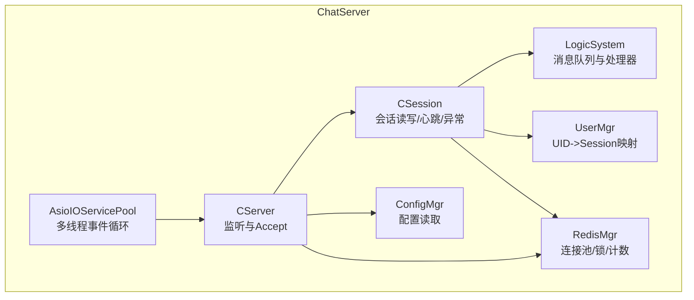
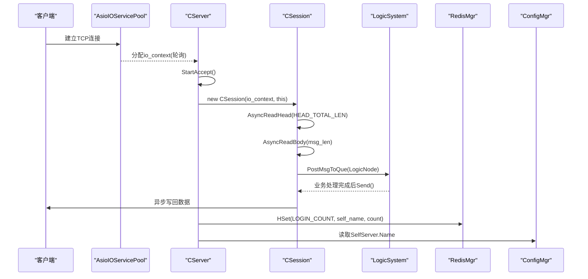
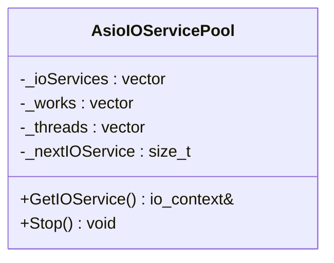
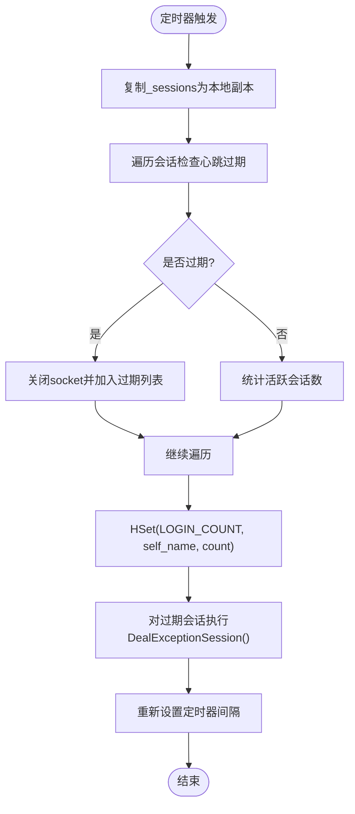
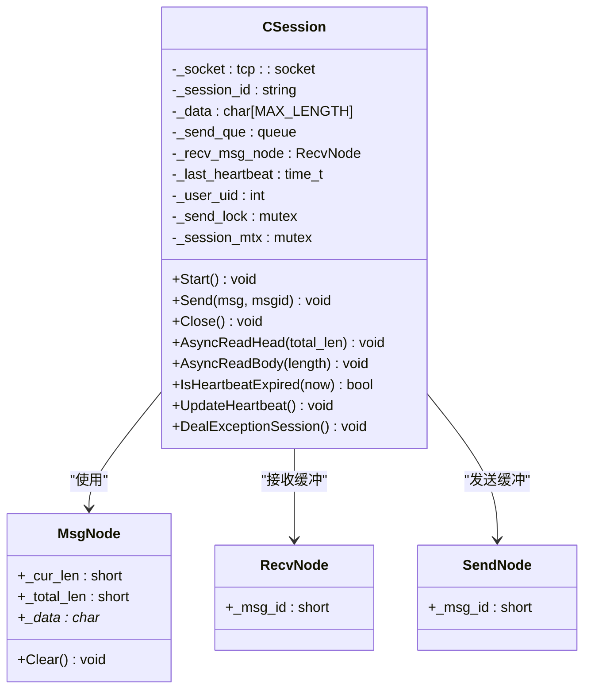
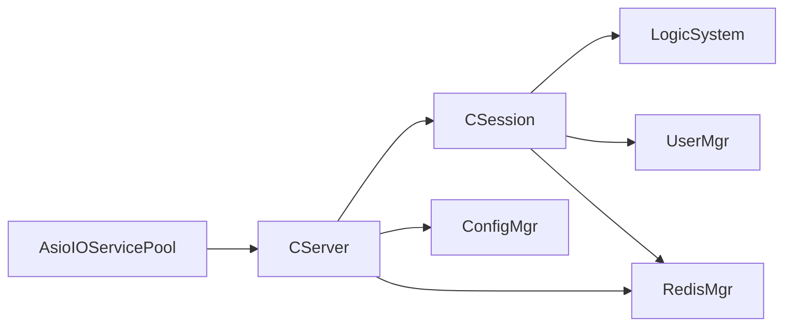

# 连接池管理

<cite>
**本文引用的文件**   
- [AsioIOServicePool.h](file://server/ChatServer/include/AsioIOServicePool.h)
- [AsioIOServicePool.cpp](file://server/ChatServer/src/AsioIOServicePool.cpp)
- [CSession.h](file://server/ChatServer/include/CSession.h)
- [CSession.cpp](file://server/ChatServer/src/CSession.cpp)
- [CServer.h](file://server/ChatServer/include/CServer.h)
- [CServer.cpp](file://server/ChatServer/src/CServer.cpp)
- [MsgNode.h](file://server/ChatServer/include/MsgNode.h)
- [const.h](file://server/ChatServer/include/const.h)
- [UserMgr.h](file://server/ChatServer/include/UserMgr.h)
- [RedisMgr.h](file://server/ChatServer/include/RedisMgr.h)
- [ConfigMgr.h](file://server/ChatServer/include/ConfigMgr.h)
- [chatserver1.ini](file://server/ChatServer/config/chatserver1.ini)
- [LogicSystem.h](file://server/ChatServer/include/LogicSystem.h)
</cite>

## 目录
1. [简介](#简介)
2. [项目结构](#项目结构)
3. [核心组件](#核心组件)
4. [架构总览](#架构总览)
5. [详细组件分析](#详细组件分析)
6. [依赖关系分析](#依赖关系分析)
7. [性能考量与调优](#性能考量与调优)
8. [故障排查指南](#故障排查指南)
9. [结论](#结论)
10. [附录：配置示例与最佳实践](#附录配置示例与最佳实践)

## 简介
本技术文档围绕 LLFCChat 聊天服务中的连接池与会话管理展开，重点阐述 AsioIOServicePool 的多线程事件循环设计、TCP 连接生命周期管理、CSession 会话机制（用户绑定、状态维护、异常处理），以及连接池监控指标、性能调优建议与故障恢复策略。文档面向不同技术背景的读者，提供从高层架构到代码级细节的完整说明，并给出可操作的配置示例与最佳实践。

## 项目结构
LLFCChat 服务端采用多进程/多模块架构，其中 ChatServer 负责 TCP 长连接与业务逻辑编排。关键目录与文件如下：
- server/ChatServer/include: 头文件定义核心类与接口
- server/ChatServer/src: 实现文件，包含 IO 池、服务器、会话、逻辑调度等
- server/ChatServer/config: 配置文件（INI）用于端口、RPC、数据库、Redis 等参数

图表来源
- [AsioIOServicePool.h:1-28](file://server/ChatServer/include/AsioIOServicePool.h#L1-L28)
- [AsioIOServicePool.cpp:1-43](file://server/ChatServer/src/AsioIOServicePool.cpp#L1-L43)
- [CServer.h:1-39](file://server/ChatServer/include/CServer.h#L1-L39)
- [CServer.cpp:1-133](file://server/ChatServer/src/CServer.cpp#L1-L133)
- [CSession.h:1-86](file://server/ChatServer/include/CSession.h#L1-L86)
- [CSession.cpp:1-335](file://server/ChatServer/src/CSession.cpp#L1-L335)
- [LogicSystem.h:1-60](file://server/ChatServer/include/LogicSystem.h#L1-L60)
- [UserMgr.h:1-22](file://server/ChatServer/include/UserMgr.h#L1-L22)
- [RedisMgr.h:1-305](file://server/ChatServer/include/RedisMgr.h#L1-L305)
- [ConfigMgr.h:1-84](file://server/ChatServer/include/ConfigMgr.h#L1-L84)

章节来源
- [AsioIOServicePool.h:1-28](file://server/ChatServer/include/AsioIOServicePool.h#L1-L28)
- [AsioIOServicePool.cpp:1-43](file://server/ChatServer/src/AsioIOServicePool.cpp#L1-L43)
- [CServer.h:1-39](file://server/ChatServer/include/CServer.h#L1-L39)
- [CServer.cpp:1-133](file://server/ChatServer/src/CServer.cpp#L1-L133)
- [CSession.h:1-86](file://server/ChatServer/include/CSession.h#L1-L86)
- [CSession.cpp:1-335](file://server/ChatServer/src/CSession.cpp#L1-L335)
- [LogicSystem.h:1-60](file://server/ChatServer/include/LogicSystem.h#L1-L60)
- [UserMgr.h:1-22](file://server/ChatServer/include/UserMgr.h#L1-L22)
- [RedisMgr.h:1-305](file://server/ChatServer/include/RedisMgr.h#L1-L305)
- [ConfigMgr.h:1-84](file://server/ChatServer/include/ConfigMgr.h#L1-L84)

## 核心组件
- AsioIOServicePool：基于 boost::asio::io_context 的多实例池，按轮询分配，每个 io_context 运行在独立线程，实现多线程事件循环与负载均衡。
- CServer：监听端口、接受连接、维护活跃会话集合、周期性定时器进行心跳检测与统计上报。
- CSession：封装 TCP socket 的异步读写、粘包/半包处理、发送队列、心跳时间戳、异常清理与分布式锁保护的资源释放。
- LogicSystem：单例消息队列与回调注册，将网络层收到的消息投递给业务处理器，解耦 IO 与业务。
- UserMgr：维护 uid 到 session 的映射，支持获取/移除会话。
- RedisMgr：hiredis 连接池、PING 保活、自动重连、分布式锁、计数操作。
- ConfigMgr：INI 配置解析与访问。

章节来源
- [AsioIOServicePool.h:1-28](file://server/ChatServer/include/AsioIOServicePool.h#L1-L28)
- [AsioIOServicePool.cpp:1-43](file://server/ChatServer/src/AsioIOServicePool.cpp#L1-L43)
- [CServer.h:1-39](file://server/ChatServer/include/CServer.h#L1-L39)
- [CServer.cpp:1-133](file://server/ChatServer/src/CServer.cpp#L1-L133)
- [CSession.h:1-86](file://server/ChatServer/include/CSession.h#L1-L86)
- [CSession.cpp:1-335](file://server/ChatServer/src/CSession.cpp#L1-L335)
- [LogicSystem.h:1-60](file://server/ChatServer/include/LogicSystem.h#L1-L60)
- [UserMgr.h:1-22](file://server/ChatServer/include/UserMgr.h#L1-L22)
- [RedisMgr.h:1-305](file://server/ChatServer/include/RedisMgr.h#L1-L305)
- [ConfigMgr.h:1-84](file://server/ChatServer/include/ConfigMgr.h#L1-L84)

## 架构总览
下图展示从客户端连接到消息处理的端到端流程，包括事件循环池、会话、逻辑系统与外部依赖（Redis、配置）。

图表来源
- [AsioIOServicePool.cpp:1-43](file://server/ChatServer/src/AsioIOServicePool.cpp#L1-L43)
- [CServer.cpp:1-133](file://server/ChatServer/src/CServer.cpp#L1-L133)
- [CSession.cpp:1-335](file://server/ChatServer/src/CSession.cpp#L1-L335)
- [LogicSystem.h:1-60](file://server/ChatServer/include/LogicSystem.h#L1-L60)
- [RedisMgr.h:1-305](file://server/ChatServer/include/RedisMgr.h#L1-L305)
- [ConfigMgr.h:1-84](file://server/ChatServer/include/ConfigMgr.h#L1-L84)

## 详细组件分析

### AsioIOServicePool：多线程事件循环与负载均衡
- 设计模式
  - 单例模式：全局唯一实例，避免重复创建 io_context。
  - 工作守护（work_guard）：为每个 io_context 持有 work，确保 run() 不会因无任务退出。
  - 轮询分配：_nextIOService 自增取模，实现简单高效的负载均衡。
- 线程模型
  - 构造时创建 size 个 io_context 与对应 thread，每个 thread 调用 run() 驱动事件循环。
  - Stop() 依次 stop 所有 io_context，释放 work_guard，join 所有线程，保证优雅关闭。
- 复杂度与特性
  - GetIOService() 时间复杂度 O(1)，空间复杂度 O(N) 存储 N 个 io_context 与线程。
  - 适合高并发 I/O 场景，避免单 io_context 成为热点瓶颈。

图表来源
- [AsioIOServicePool.h:1-28](file://server/ChatServer/include/AsioIOServicePool.h#L1-L28)
- [AsioIOServicePool.cpp:1-43](file://server/ChatServer/src/AsioIOServicePool.cpp#L1-L43)

章节来源
- [AsioIOServicePool.h:1-28](file://server/ChatServer/include/AsioIOServicePool.h#L1-L28)
- [AsioIOServicePool.cpp:1-43](file://server/ChatServer/src/AsioIOServicePool.cpp#L1-L43)

### CServer：连接管理与定时任务
- 连接管理
  - HandleAccept：接受新连接后启动会话读取，插入 _sessions 映射。
  - ClearSession：删除会话并从用户管理器中移除关联。
  - CheckValid：校验会话是否仍有效。
- 定时器
  - on_timer：每 60s 遍历会话副本，检测心跳过期，关闭 socket，收集过期会话统一处理；更新登录数到 Redis。
  - StartTimer/StopTimer：控制定时器启停。
- 线程安全
  - 使用互斥锁保护 _sessions 的并发访问。

图表来源
- [CServer.cpp:75-118](file://server/ChatServer/src/CServer.cpp#L75-L118)

章节来源
- [CServer.h:1-39](file://server/ChatServer/include/CServer.h#L1-L39)
- [CServer.cpp:1-133](file://server/ChatServer/src/CServer.cpp#L1-L133)

### CSession：会话生命周期、读写与异常处理
- 生命周期
  - 构造：生成唯一 session_id，初始化接收头部节点与心跳时间。
  - Start：发起头部读取。
  - 析构：输出日志（便于调试）。
- 读流程
  - AsyncReadHead：读取固定长度头部，解析 msg_id 与 msg_len，校验合法性后进入 body 读取。
  - AsyncReadBody：读取完整 body，校验长度与有效性，更新心跳，投递 LogicNode 至 LogicSystem，继续等待下一个头部。
  - asyncReadFull/asyncReadLen：递归式非阻塞读取，直到达到目标长度。
- 写流程
  - Send：加锁入队，若队列为空则立即发起一次 async_write；HandleWrite 成功后弹出并继续下一项。
  - 队列上限：MAX_SENDQUE，超过则丢弃并记录日志。
- 心跳与异常
  - IsHeartbeatExpired：基于最后心跳时间与阈值判断。
  - UpdateHeartbeat：每次成功读取后更新时间。
  - DealExceptionSession：通过 Redis 分布式锁保护清理流程，防止竞态；清理用户会话、IP、Token 等键。
- 资源清理
  - Close：关闭 socket，标记 _b_close。
  - 与 CServer::ClearSession 配合完成会话移除与用户关联清理。

图表来源
- [CSession.h:1-86](file://server/ChatServer/include/CSession.h#L1-L86)
- [CSession.cpp:1-335](file://server/ChatServer/src/CSession.cpp#L1-L335)
- [MsgNode.h:1-48](file://server/ChatServer/include/MsgNode.h#L1-L48)
- [const.h:1-104](file://server/ChatServer/include/const.h#L1-L104)

章节来源
- [CSession.h:1-86](file://server/ChatServer/include/CSession.h#L1-L86)
- [CSession.cpp:1-335](file://server/ChatServer/src/CSession.cpp#L1-L335)
- [MsgNode.h:1-48](file://server/ChatServer/include/MsgNode.h#L1-L48)
- [const.h:1-104](file://server/ChatServer/include/const.h#L1-L104)

### 消息协议与数据结构
- 头部格式：HEAD_ID_LEN(2字节) + HEAD_DATA_LEN(2字节)，总长 HEAD_TOTAL_LEN=4。
- 最大消息长度：MAX_LENGTH=2048（ChatServer）。
- 队列限制：MAX_RECVQUE=10000，MAX_SENDQUE=1000。
- 消息 ID：MSG_IDS 枚举定义各类请求/响应标识。

章节来源
- [const.h:1-104](file://server/ChatServer/include/const.h#L1-L104)
- [MsgNode.h:1-48](file://server/ChatServer/include/MsgNode.h#L1-L48)

### 用户与会话管理
- UserMgr：维护 uid -> shared_ptr<CSession> 的映射，提供 SetUserSession、GetSession、RmvUserSession。
- CServer：在 Accept 成功后插入 _sessions，并在清理时调用 UserMgr 移除关联。
- CSession：SetUserId/GetUserId 用于绑定用户 UID。

章节来源
- [UserMgr.h:1-22](file://server/ChatServer/include/UserMgr.h#L1-L22)
- [CServer.cpp:40-63](file://server/ChatServer/src/CServer.cpp#L40-L63)
- [CSession.cpp:29-37](file://server/ChatServer/src/CSession.cpp#L29-L37)

### 外部依赖：Redis 与配置
- RedisMgr：hiredis 连接池，PING 保活，失败计数与自动重连；提供分布式锁 acquireLock/releaseLock；HSet/Del/ExistsKey 等操作。
- ConfigMgr：INI 解析，SectionInfo 提供 key 访问；CServer 使用 SelfServer.Name 作为服务名上报登录数。

章节来源
- [RedisMgr.h:1-305](file://server/ChatServer/include/RedisMgr.h#L1-L305)
- [ConfigMgr.h:1-84](file://server/ChatServer/include/ConfigMgr.h#L1-L84)
- [chatserver1.ini:1-30](file://server/ChatServer/config/chatserver1.ini#L1-L30)

## 依赖关系分析
- AsioIOServicePool 被 CServer 用于分配 io_context，从而将 Accept 与后续会话处理分散到多个线程的事件循环。
- CServer 依赖 CSession、UserMgr、RedisMgr、ConfigMgr。
- CSession 依赖 MsgNode、LogicSystem、RedisMgr、CServer。
- LogicSystem 依赖 CSession、UserMgr、RedisMgr、ConfigMgr。

图表来源
- [AsioIOServicePool.cpp:1-43](file://server/ChatServer/src/AsioIOServicePool.cpp#L1-L43)
- [CServer.cpp:1-133](file://server/ChatServer/src/CServer.cpp#L1-L133)
- [CSession.cpp:1-335](file://server/ChatServer/src/CSession.cpp#L1-L335)
- [LogicSystem.h:1-60](file://server/ChatServer/include/LogicSystem.h#L1-L60)
- [UserMgr.h:1-22](file://server/ChatServer/include/UserMgr.h#L1-L22)
- [RedisMgr.h:1-305](file://server/ChatServer/include/RedisMgr.h#L1-L305)
- [ConfigMgr.h:1-84](file://server/ChatServer/include/ConfigMgr.h#L1-L84)

章节来源
- [AsioIOServicePool.cpp:1-43](file://server/ChatServer/src/AsioIOServicePool.cpp#L1-L43)
- [CServer.cpp:1-133](file://server/ChatServer/src/CServer.cpp#L1-L133)
- [CSession.cpp:1-335](file://server/ChatServer/src/CSession.cpp#L1-L335)
- [LogicSystem.h:1-60](file://server/ChatServer/include/LogicSystem.h#L1-L60)
- [UserMgr.h:1-22](file://server/ChatServer/include/UserMgr.h#L1-L22)
- [RedisMgr.h:1-305](file://server/ChatServer/include/RedisMgr.h#L1-L305)
- [ConfigMgr.h:1-84](file://server/ChatServer/include/ConfigMgr.h#L1-L84)

## 性能考量与调优
- 事件循环池大小
  - 默认大小为硬件并发线程数，建议根据 CPU 核数与 I/O 负载调整，避免过多线程导致上下文切换开销。
- 发送队列与内存占用
  - MAX_SENDQUE=1000，过大可能导致内存增长；需结合业务峰值压测确定合理值。
- 心跳超时
  - 当前硬编码阈值为 20 秒，可根据网络质量与服务期望调整；过长会导致僵尸连接堆积，过短易误判。
- Redis 连接池
  - PING 保活周期与重试策略已内置；在高延迟或抖动网络下可适当增大保活频率与重试次数。
- 定时器粒度
  - 60 秒心跳检测周期适用于一般场景；高吞吐场景可缩短至 10~30 秒以提升实时性。
- 序列化与 JSON
  - 频繁 json 序列化可能成为瓶颈，建议批量合并或缓存常用字段。

[本节为通用指导，不直接分析具体文件]

## 故障排查指南
- 连接无法建立
  - 检查 AsioIOServicePool 线程是否全部启动；确认端口未被占用；查看 CServer 构造函数日志。
- 读超时/粘包问题
  - 确认 HEAD_TOTAL_LEN 与 MSG 协议一致；检查 asyncReadFull/asyncReadLen 是否正确拼接；观察“read length not match”日志。
- 写失败/队列满
  - 关注“send que fulled”日志；检查下游业务处理速度；必要时增大 MAX_SENDQUE 或优化业务逻辑。
- 心跳过期与异常清理
  - 观察 IsHeartbeatExpired 判定；确认客户端心跳发送频率；检查 Redis 锁获取与释放是否正常。
- Redis 连接异常
  - 查看 RedisMgr 的 PING 失败与重连日志；确认 AUTH 密码与网络连通性。
- 配置错误
  - 核对 chatserver1.ini 的 SelfServer.Name、Host、Port 等；确保 ConfigMgr 能正确读取。

章节来源
- [CSession.cpp:87-191](file://server/ChatServer/src/CSession.cpp#L87-L191)
- [CServer.cpp:75-118](file://server/ChatServer/src/CServer.cpp#L75-L118)
- [RedisMgr.h:1-305](file://server/ChatServer/include/RedisMgr.h#L1-L305)
- [chatserver1.ini:1-30](file://server/ChatServer/config/chatserver1.ini#L1-L30)

## 结论
AsioIOServicePool 通过多 io_context 与轮询分配实现了高效的多线程事件循环，显著提升了 I/O 并发能力。CServer 与 CSession 协作完成连接的接受、会话的生命周期管理、心跳检测与异常清理。借助 Redis 分布式锁与连接池，系统在多实例部署下具备一致的会话清理与资源管理能力。通过合理的配置与调优，可在高并发场景下保持稳定的性能与可靠性。

[本节为总结性内容，不直接分析具体文件]

## 附录：配置示例与最佳实践
- 配置示例（chatserver1.ini）
  - [GateServer] Port = 8080
  - [VarifyServer] Host = 127.0.0.1, Port = 50051
  - [StatusServer] Host = 127.0.0.1, Port = 50052
  - [SelfServer] Name = chatserver1, Host = 0.0.0.0, Port = 8090, RPCPort = 50055
  - [Mysql] Host = 127.0.0.1, Port = 3308, User = root, Passwd = 123456., Schema = llfc
  - [Redis] Host = 127.0.0.1, Port = 6380, Passwd = 123456
  - [PeerServer] Servers = chatserver2
  - [chatserver2] Name = chatserver2, Host = 127.0.0.1, Port = 50056

- 最佳实践
  - 事件循环池大小：设置为 CPU 核数或略高于核数，避免过度线程化。
  - 发送队列上限：根据峰值 QPS 与平均消息大小评估，避免内存暴涨。
  - 心跳阈值：结合网络 RTT 与客户端行为设定，兼顾实时性与稳定性。
  - Redis 连接池：开启 PING 保活，合理设置认证与超时；监控连接池健康度。
  - 监控指标：定期上报 LOGIN_COUNT、活跃会话数、发送队列长度、Redis 连接失败率。
  - 故障恢复：利用分布式锁保护清理流程，避免竞态；对异常连接快速回收，减少资源泄漏。

章节来源
- [chatserver1.ini:1-30](file://server/ChatServer/config/chatserver1.ini#L1-L30)
- [const.h:1-104](file://server/ChatServer/include/const.h#L1-L104)
- [RedisMgr.h:1-305](file://server/ChatServer/include/RedisMgr.h#L1-L305)
- [CServer.cpp:103-107](file://server/ChatServer/src/CServer.cpp#L103-L107)