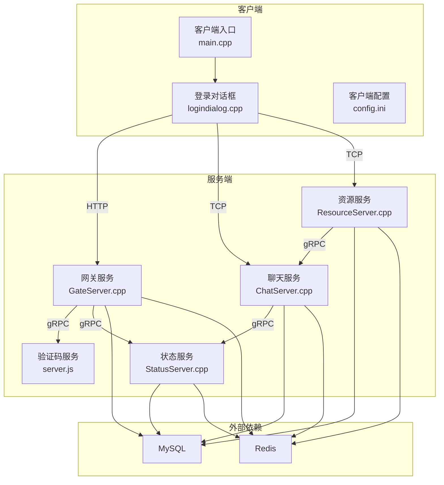
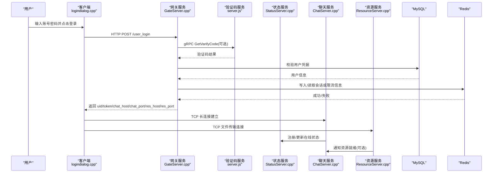
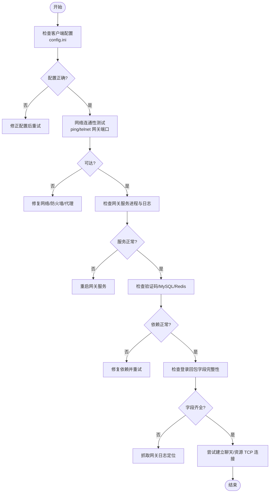
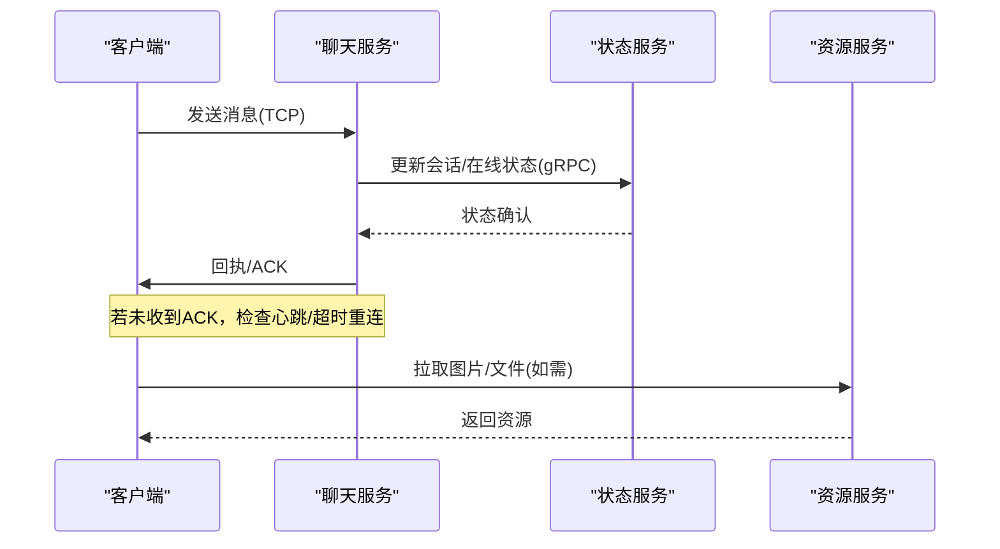
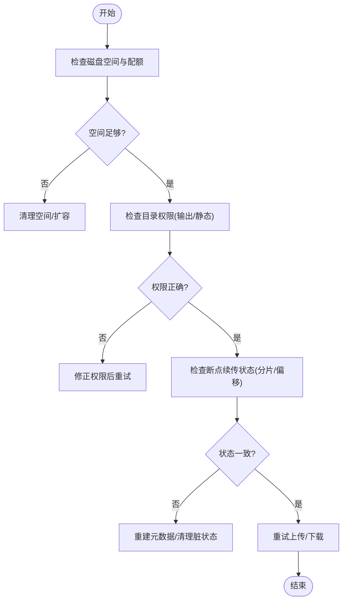
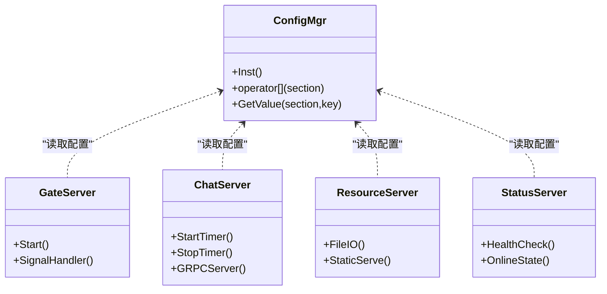
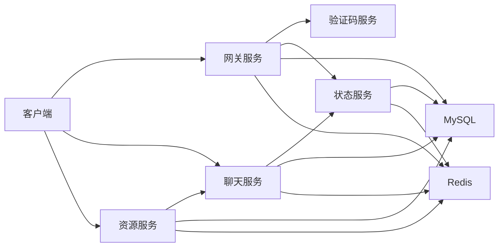

# 常见故障场景

<cite>
**本文引用的文件**   
- [README.md](file://README.md)
- [客户端配置文件 config.ini](file://client/llfcchat/config/config.ini)
- [网关服务配置 config.ini](file://server/GateServer/config/config.ini)
- [聊天服务配置 chatserver1.ini](file://server/ChatServer/config/chatserver1.ini)
- [资源服务配置 config.ini](file://server/ResourceServer/config/config.ini)
- [状态服务配置 config.ini](file://server/StatusServer/config/config.ini)
- [网关服务入口 GateServer.cpp](file://server/GateServer/src/GateServer.cpp)
- [聊天服务入口 ChatServer.cpp](file://server/ChatServer/src/ChatServer.cpp)
- [资源服务入口 ResourceServer.cpp](file://server/ResourceServer/src/ResourceServer.cpp)
- [状态服务入口 StatusServer.cpp](file://server/StatusServer/src/StatusServer.cpp)
- [客户端入口 main.cpp](file://client/llfcchat/src/main.cpp)
- [登录对话框 logindialog.cpp](file://client/llfcchat/src/logindialog.cpp)
- [验证码服务 server.js](file://server/VarifyServer/server.js)
- [Redis 模块 redis.js](file://server/VarifyServer/redis.js)
- [数据库脚本 llfc.sql](file://sql备份/llfc.sql)
</cite>

## 目录
1. [简介](#简介)
2. [项目结构](#项目结构)
3. [核心组件](#核心组件)
4. [架构总览](#架构总览)
5. [详细组件分析](#详细组件分析)
6. [依赖关系分析](#依赖关系分析)
7. [性能与稳定性考量](#性能与稳定性考量)
8. [故障排查与应急手册](#故障排查与应急手册)
9. [结论](#结论)
10. [附录：关键配置项速查](#附录关键配置项速查)

## 简介
本文件面向 LLFCChat 生产环境的运维与技术支持团队，聚焦“常见故障场景”的识别、定位与处置。内容覆盖：
- 服务重启、数据恢复、配置修正、紧急修复等应急响应流程
- 用户登录失败的排查步骤（认证服务检查、网络连接验证、用户数据完整性确认）
- 聊天功能异常的诊断方法（消息路由检查、会话状态验证、实时通信链路调试）
- 文件传输故障的处理方案（存储空间检查、权限验证、断点续传恢复）
- 服务部署常见问题（端口冲突、依赖缺失、配置文件错误等）
- 完整的故障处理流程图与应急操作清单，帮助快速响应生产问题

## 项目结构
LLFCChat 采用多服务分布式架构，包含客户端、网关、聊天、资源、状态、验证码等服务，以及 MySQL、Redis 等外部依赖。各服务通过 gRPC 和 HTTP/TCP 进行交互，配置文件以 INI 为主，客户端使用 QSettings 读取本地配置。

**图表来源** 
- [客户端入口 main.cpp:1-44](file://client/llfcchat/src/main.cpp#L1-L44)
- [登录对话框 logindialog.cpp:1-200](file://client/llfcchat/src/logindialog.cpp#L1-L200)
- [网关服务入口 GateServer.cpp:1-163](file://server/GateServer/src/GateServer.cpp#L1-L163)
- [聊天服务入口 ChatServer.cpp:1-81](file://server/ChatServer/src/ChatServer.cpp#L1-L81)
- [资源服务入口 ResourceServer.cpp:1-42](file://server/ResourceServer/src/ResourceServer.cpp#L1-L42)
- [状态服务入口 StatusServer.cpp:1-72](file://server/StatusServer/src/StatusServer.cpp#L1-L72)
- [验证码服务 server.js:1-76](file://server/VarifyServer/server.js#L1-L76)
- [Redis 模块 redis.js:1-101](file://server/VarifyServer/redis.js#L1-L101)

**章节来源**
- [README.md:1-112](file://README.md#L1-L112)

## 核心组件
- 客户端
  - 入口程序加载样式与配置，启动 TCP 线程与资源下载线程，显示主界面
  - 登录对话框负责 HTTP 登录请求、解析回包并触发 TCP 长连接建立
- 网关服务
  - 提供 HTTP API，校验用户登录，返回聊天服务器与资源服务器地址及令牌
  - 集成 Redis、MySQL 管理模块，监听信号优雅退出
- 聊天服务
  - 提供 gRPC 接口与 Asio 网络服务，维护会话、心跳、踢人逻辑
  - 启动时初始化登录计数到 Redis，支持优雅关闭
- 资源服务
  - 提供文件上传/下载能力，基于文件系统与配置路径
- 状态服务
  - 提供服务健康与在线状态查询，gRPC 服务
- 验证码服务
  - 生成并发送邮箱验证码，使用 Redis 缓存验证码，失败重试与超时控制

**章节来源**
- [客户端入口 main.cpp:1-44](file://client/llfcchat/src/main.cpp#L1-L44)
- [登录对话框 logindialog.cpp:1-200](file://client/llfcchat/src/logindialog.cpp#L1-L200)
- [网关服务入口 GateServer.cpp:1-163](file://server/GateServer/src/GateServer.cpp#L1-L163)
- [聊天服务入口 ChatServer.cpp:1-81](file://server/ChatServer/src/ChatServer.cpp#L1-L81)
- [资源服务入口 ResourceServer.cpp:1-42](file://server/ResourceServer/src/ResourceServer.cpp#L1-L42)
- [状态服务入口 StatusServer.cpp:1-72](file://server/StatusServer/src/StatusServer.cpp#L1-L72)
- [验证码服务 server.js:1-76](file://server/VarifyServer/server.js#L1-L76)
- [Redis 模块 redis.js:1-101](file://server/VarifyServer/redis.js#L1-L101)

## 架构总览
下图展示从客户端登录到聊天与资源访问的关键调用链，便于故障定位与影响面评估。

**图表来源** 
- [登录对话框 logindialog.cpp:1-200](file://client/llfcchat/src/logindialog.cpp#L1-L200)
- [网关服务入口 GateServer.cpp:1-163](file://server/GateServer/src/GateServer.cpp#L1-L163)
- [验证码服务 server.js:1-76](file://server/VarifyServer/server.js#L1-L76)
- [状态服务入口 StatusServer.cpp:1-72](file://server/StatusServer/src/StatusServer.cpp#L1-L72)
- [聊天服务入口 ChatServer.cpp:1-81](file://server/ChatServer/src/ChatServer.cpp#L1-L81)
- [资源服务入口 ResourceServer.cpp:1-42](file://server/ResourceServer/src/ResourceServer.cpp#L1-L42)

## 详细组件分析

### 用户登录失败排查
典型症状：客户端提示“网络请求错误”或登录无响应。
排查要点：
- 客户端配置是否正确（网关 host/port）
- 网关服务是否启动且端口可访问
- 验证码服务是否可用（如启用）
- 数据库与 Redis 连通性
- 登录回包字段是否完整（uid、token、chat_host、chat_port、res_host、res_port）

**图表来源** 
- [客户端配置文件 config.ini:1-4](file://client/llfcchat/config/config.ini#L1-L4)
- [网关服务入口 GateServer.cpp:1-163](file://server/GateServer/src/GateServer.cpp#L1-L163)
- [验证码服务 server.js:1-76](file://server/VarifyServer/server.js#L1-L76)
- [Redis 模块 redis.js:1-101](file://server/VarifyServer/redis.js#L1-L101)
- [登录对话框 logindialog.cpp:1-200](file://client/llfcchat/src/logindialog.cpp#L1-L200)

**章节来源**
- [客户端配置文件 config.ini:1-4](file://client/llfcchat/config/config.ini#L1-L4)
- [网关服务入口 GateServer.cpp:1-163](file://server/GateServer/src/GateServer.cpp#L1-L163)
- [验证码服务 server.js:1-76](file://server/VarifyServer/server.js#L1-L76)
- [Redis 模块 redis.js:1-101](file://server/VarifyServer/redis.js#L1-L101)
- [登录对话框 logindialog.cpp:1-200](file://client/llfcchat/src/logindialog.cpp#L1-L200)

### 聊天功能异常诊断
常见现象：消息不送达、掉线频繁、群聊不同步。
诊断步骤：
- 检查聊天服务端口与 gRPC 端口是否监听
- 验证心跳机制是否正常（服务启动时会设置登录计数）
- 确认状态服务在线状态同步
- 检查跨服路由（PeerServer/其他聊天服务节点）
- 查看粘包与协议解析（Qt 网络层）

**图表来源** 
- [聊天服务入口 ChatServer.cpp:1-81](file://server/ChatServer/src/ChatServer.cpp#L1-L81)
- [状态服务入口 StatusServer.cpp:1-72](file://server/StatusServer/src/StatusServer.cpp#L1-L72)
- [资源服务入口 ResourceServer.cpp:1-42](file://server/ResourceServer/src/ResourceServer.cpp#L1-L42)

**章节来源**
- [聊天服务入口 ChatServer.cpp:1-81](file://server/ChatServer/src/ChatServer.cpp#L1-L81)
- [状态服务入口 StatusServer.cpp:1-72](file://server/StatusServer/src/StatusServer.cpp#L1-L72)
- [资源服务入口 ResourceServer.cpp:1-42](file://server/ResourceServer/src/ResourceServer.cpp#L1-L42)

### 文件传输故障处理
常见问题：上传中断、下载失败、进度卡住。
处理要点：
- 检查资源服务输出目录与静态目录权限
- 磁盘空间充足性
- 断点续传状态（分片/偏移量记录）
- 与聊天服务的协作（通知客户端异步下载）

**图表来源** 
- [资源服务配置 config.ini:1-27](file://server/ResourceServer/config/config.ini#L1-L27)
- [资源服务入口 ResourceServer.cpp:1-42](file://server/ResourceServer/src/ResourceServer.cpp#L1-L42)

**章节来源**
- [资源服务配置 config.ini:1-27](file://server/ResourceServer/config/config.ini#L1-L27)
- [资源服务入口 ResourceServer.cpp:1-42](file://server/ResourceServer/src/ResourceServer.cpp#L1-L42)

### 服务部署相关问题
- 端口冲突：确认各服务端口唯一（网关、聊天、资源、状态、gRPC）
- 依赖缺失：确保 MySQL、Redis 运行且配置一致
- 配置文件错误：核对各服务 INI 中的 Host/Port/Schema/Passwd
- 信号处理：服务应捕获 SIGINT/SIGTERM 实现优雅退出

**图表来源** 
- [网关服务入口 GateServer.cpp:1-163](file://server/GateServer/src/GateServer.cpp#L1-L163)
- [聊天服务入口 ChatServer.cpp:1-81](file://server/ChatServer/src/ChatServer.cpp#L1-L81)
- [资源服务入口 ResourceServer.cpp:1-42](file://server/ResourceServer/src/ResourceServer.cpp#L1-L42)
- [状态服务入口 StatusServer.cpp:1-72](file://server/StatusServer/src/StatusServer.cpp#L1-L72)

**章节来源**
- [网关服务入口 GateServer.cpp:1-163](file://server/GateServer/src/GateServer.cpp#L1-L163)
- [聊天服务入口 ChatServer.cpp:1-81](file://server/ChatServer/src/ChatServer.cpp#L1-L81)
- [资源服务入口 ResourceServer.cpp:1-42](file://server/ResourceServer/src/ResourceServer.cpp#L1-L42)
- [状态服务入口 StatusServer.cpp:1-72](file://server/StatusServer/src/StatusServer.cpp#L1-L72)

## 依赖关系分析
- 客户端依赖：QSettings 读取本地配置；HTTP 与 TCP 网络库
- 网关服务依赖：Boost.Asio、JSON、hiredis、MySQL、gRPC
- 聊天/资源/状态服务依赖：AsioIOServicePool、ConfigMgr、RedisMgr、MysqlMgr、gRPC
- 验证码服务依赖：ioredis、grpc-js、uuid、邮件模块

**图表来源** 
- [客户端入口 main.cpp:1-44](file://client/llfcchat/src/main.cpp#L1-L44)
- [网关服务入口 GateServer.cpp:1-163](file://server/GateServer/src/GateServer.cpp#L1-L163)
- [聊天服务入口 ChatServer.cpp:1-81](file://server/ChatServer/src/ChatServer.cpp#L1-L81)
- [资源服务入口 ResourceServer.cpp:1-42](file://server/ResourceServer/src/ResourceServer.cpp#L1-L42)
- [状态服务入口 StatusServer.cpp:1-72](file://server/StatusServer/src/StatusServer.cpp#L1-L72)
- [验证码服务 server.js:1-76](file://server/VarifyServer/server.js#L1-L76)
- [Redis 模块 redis.js:1-101](file://server/VarifyServer/redis.js#L1-L101)

**章节来源**
- [客户端入口 main.cpp:1-44](file://client/llfcchat/src/main.cpp#L1-L44)
- [网关服务入口 GateServer.cpp:1-163](file://server/GateServer/src/GateServer.cpp#L1-L163)
- [聊天服务入口 ChatServer.cpp:1-81](file://server/ChatServer/src/ChatServer.cpp#L1-L81)
- [资源服务入口 ResourceServer.cpp:1-42](file://server/ResourceServer/src/ResourceServer.cpp#L1-L42)
- [状态服务入口 StatusServer.cpp:1-72](file://server/StatusServer/src/StatusServer.cpp#L1-L72)
- [验证码服务 server.js:1-76](file://server/VarifyServer/server.js#L1-L76)
- [Redis 模块 redis.js:1-101](file://server/VarifyServer/redis.js#L1-L101)

## 性能与稳定性考量
- 连接池与线程池：AsioIOServicePool 提升并发处理能力
- 心跳与超时：聊天服务定时任务保障会话活性
- 缓存与限流：Redis 用于验证码、会话、限流等
- 优雅退出：信号处理避免数据不一致
- 存储优化：MySQL 索引设计（聊天消息按 thread_id 与时间排序）

[本节为通用指导，不直接分析具体文件]

## 故障排查与应急手册

### 服务重启与优雅关闭
- 网关/聊天/资源/状态服务均捕获 SIGINT/SIGTERM，停止 io_context 并释放资源
- 建议通过系统服务管理器（systemd/supervisor）统一管控生命周期
- 重启前检查依赖（MySQL/Redis）可用性，避免启动失败

**章节来源**
- [网关服务入口 GateServer.cpp:1-163](file://server/GateServer/src/GateServer.cpp#L1-L163)
- [聊天服务入口 ChatServer.cpp:1-81](file://server/ChatServer/src/ChatServer.cpp#L1-L81)
- [资源服务入口 ResourceServer.cpp:1-42](file://server/ResourceServer/src/ResourceServer.cpp#L1-L42)
- [状态服务入口 StatusServer.cpp:1-72](file://server/StatusServer/src/StatusServer.cpp#L1-L72)

### 数据恢复与一致性
- 聊天消息表 chat_message 与会话表 chat_thread 由 SQL 脚本维护
- 恢复流程：停止写服务 -> 导入备份 -> 校验索引与约束 -> 启动服务 -> 观察日志

**章节来源**
- [数据库脚本 llfc.sql:1-200](file://sql备份/llfc.sql#L1-L200)

### 配置修正与热更新
- 客户端配置位于 client/llfcchat/config/config.ini，修改后需重启客户端
- 服务端配置位于各自服务的 config.ini，修改后需重启对应服务
- 注意端口、Host、Schema、Passwd 的一致性

**章节来源**
- [客户端配置文件 config.ini:1-4](file://client/llfcchat/config/config.ini#L1-L4)
- [网关服务配置 config.ini:1-25](file://server/GateServer/config/config.ini#L1-L25)
- [聊天服务配置 chatserver1.ini:1-30](file://server/ChatServer/config/chatserver1.ini#L1-L30)
- [资源服务配置 config.ini:1-27](file://server/ResourceServer/config/config.ini#L1-L27)
- [状态服务配置 config.ini:1-23](file://server/StatusServer/config/config.ini#L1-L23)

### 紧急修复与降级策略
- 验证码服务不可用时，可临时关闭验证码校验（需评估安全风险）
- 资源服务不可用时，禁用图片/文件下载，仅保留文本聊天
- 状态服务不可用时，下线状态查询，保留基础聊天能力

[本节为通用指导，不直接分析具体文件]

### 用户登录失败排查清单
- 客户端配置：host/port 是否正确
- 网关服务：进程存活、端口监听、日志无异常
- 验证码服务：Redis 连通、邮件发送正常
- 数据库：用户表存在、密码校验通过
- Redis：会话/限流键读写正常
- 登录回包：uid、token、chat_host、chat_port、res_host、res_port 齐全

**章节来源**
- [客户端配置文件 config.ini:1-4](file://client/llfcchat/config/config.ini#L1-L4)
- [网关服务入口 GateServer.cpp:1-163](file://server/GateServer/src/GateServer.cpp#L1-L163)
- [验证码服务 server.js:1-76](file://server/VarifyServer/server.js#L1-L76)
- [Redis 模块 redis.js:1-101](file://server/VarifyServer/redis.js#L1-L101)
- [登录对话框 logindialog.cpp:1-200](file://client/llfcchat/src/logindialog.cpp#L1-L200)

### 聊天功能异常诊断清单
- 聊天服务：端口与 gRPC 端口监听正常
- 心跳：登录计数在 Redis 中初始化与清理
- 状态服务：在线状态同步正常
- 跨服路由：PeerServer 配置正确
- 粘包：检查 Qt 网络层协议解析

**章节来源**
- [聊天服务入口 ChatServer.cpp:1-81](file://server/ChatServer/src/ChatServer.cpp#L1-L81)
- [状态服务入口 StatusServer.cpp:1-72](file://server/StatusServer/src/StatusServer.cpp#L1-L72)

### 文件传输故障处理清单
- 磁盘空间：检查输出目录与静态目录容量
- 权限：确保读写权限正确
- 断点续传：分片与偏移量一致，清理脏状态
- 通知：聊天服务通知客户端异步下载

**章节来源**
- [资源服务配置 config.ini:1-27](file://server/ResourceServer/config/config.ini#L1-L27)
- [资源服务入口 ResourceServer.cpp:1-42](file://server/ResourceServer/src/ResourceServer.cpp#L1-L42)

### 服务部署常见问题清单
- 端口冲突：确认所有服务端口唯一
- 依赖缺失：MySQL/Redis 版本与配置匹配
- 配置文件错误：INI 字段拼写与类型正确
- 信号处理：确保优雅退出逻辑生效

**章节来源**
- [网关服务入口 GateServer.cpp:1-163](file://server/GateServer/src/GateServer.cpp#L1-L163)
- [聊天服务入口 ChatServer.cpp:1-81](file://server/ChatServer/src/ChatServer.cpp#L1-L81)
- [资源服务入口 ResourceServer.cpp:1-42](file://server/ResourceServer/src/ResourceServer.cpp#L1-L42)
- [状态服务入口 StatusServer.cpp:1-72](file://server/StatusServer/src/StatusServer.cpp#L1-L72)

## 结论
通过明确的服务边界、清晰的配置管理与完善的依赖治理，LLFCChat 在生产环境具备较强的可观测性与可恢复性。针对常见故障场景，建议建立标准化的排查清单与应急流程，结合监控与日志，快速定位与恢复，保障用户体验与服务稳定性。

[本节为总结性内容，不直接分析具体文件]

## 附录：关键配置项速查
- 客户端配置
  - GateServer.host/port：网关地址与端口
- 网关服务配置
  - GateServer.Port：网关监听端口
  - VarifyServer.Host/Port：验证码服务地址
  - StatusServer.Host/Port：状态服务地址
  - Mysql.*：MySQL 连接参数
  - Redis.*：Redis 连接参数
  - ResServer.*：资源服务地址与 RPC 端口
- 聊天服务配置
  - SelfServer.*：自身名称、Host、Port、RPCPort
  - PeerServer.Servers：对端聊天服务列表
  - chatserverX.*：对端服务节点配置
- 资源服务配置
  - SelfServer.*：自身名称、Host、Port
  - Output.Path：文件输出目录
  - Static.Path：静态资源目录
  - chatserverX.*：聊天服务节点配置
- 状态服务配置
  - StatusServer.*：服务端口与 Host
  - chatservers.*：聊天服务节点列表

**章节来源**
- [客户端配置文件 config.ini:1-4](file://client/llfcchat/config/config.ini#L1-L4)
- [网关服务配置 config.ini:1-25](file://server/GateServer/config/config.ini#L1-L25)
- [聊天服务配置 chatserver1.ini:1-30](file://server/ChatServer/config/chatserver1.ini#L1-L30)
- [资源服务配置 config.ini:1-27](file://server/ResourceServer/config/config.ini#L1-L27)
- [状态服务配置 config.ini:1-23](file://server/StatusServer/config/config.ini#L1-L23)