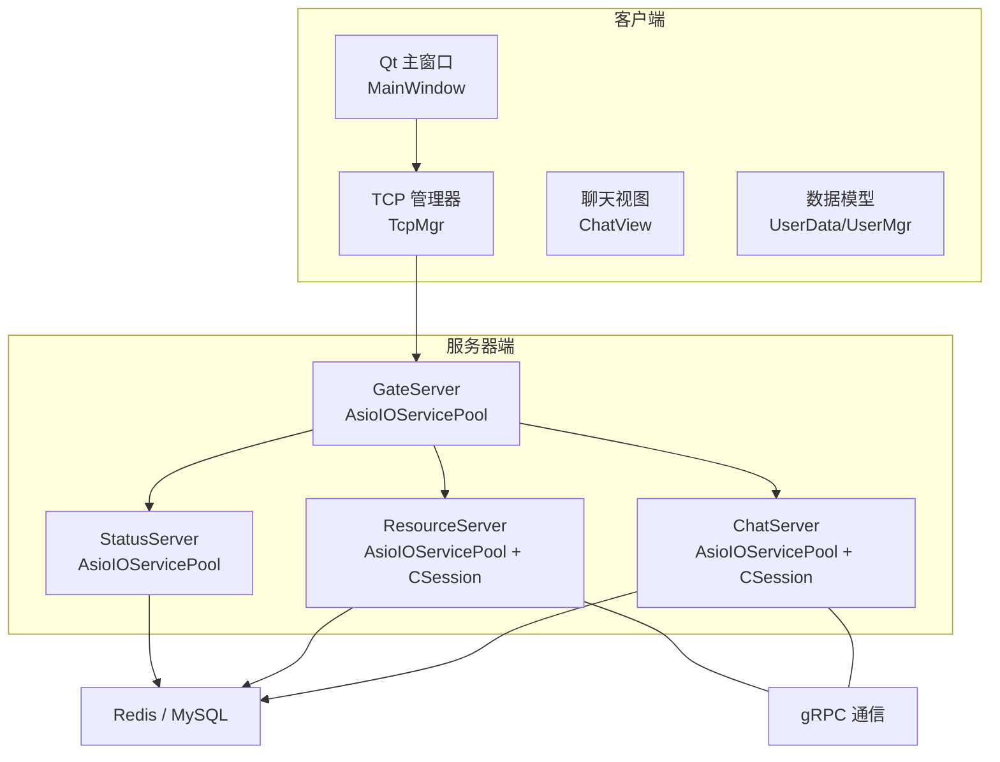
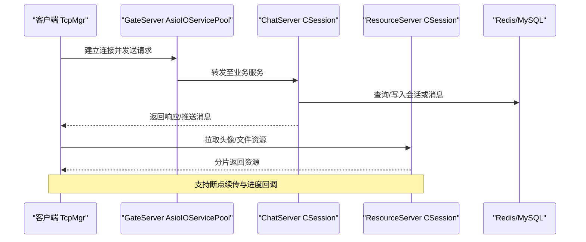
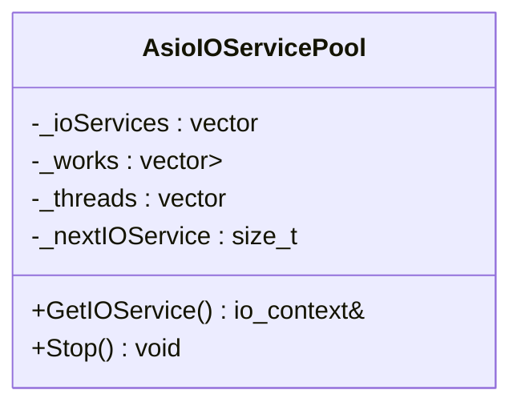
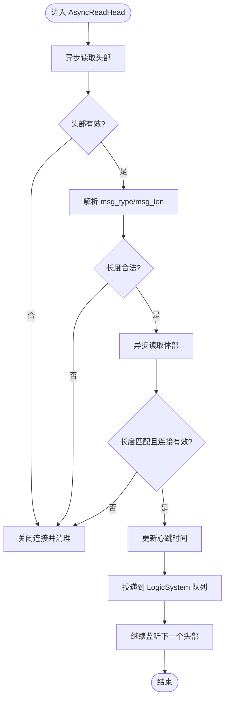
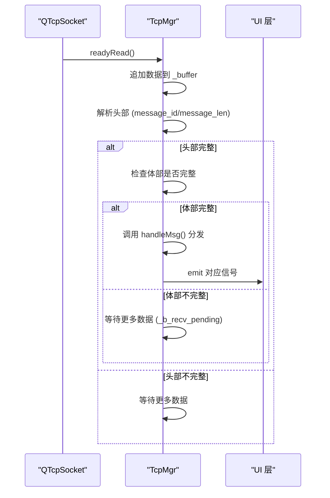
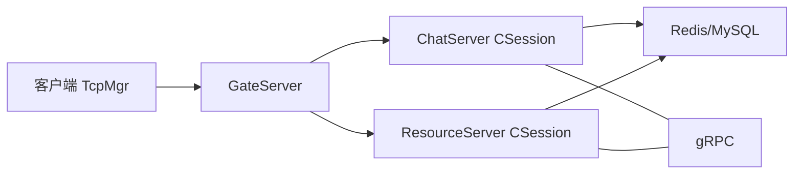

# 性能问题

<cite>
**本文引用的文件**   
- [CMakeLists.txt](file://CMakeLists.txt)
- [README.md](file://README.md)
- [AsioIOServicePool.h（ChatServer）](file://server/ChatServer/include/AsioIOServicePool.h)
- [AsioIOServicePool.h（GateServer）](file://server/GateServer/include/AsioIOServicePool.h)
- [AsioIOServicePool.h（ResourceServer）](file://server/ResourceServer/include/AsioIOServicePool.h)
- [AsioIOServicePool.h（StatusServer）](file://server/StatusServer/include/AsioIOServicePool.h)
- [CSession.h（ChatServer）](file://server/ChatServer/include/CSession.h)
- [CSession.cpp（ChatServer）](file://server/ChatServer/src/CSession.cpp)
- [CSession.cpp（ResourceServer）](file://server/ResourceServer/src/CSession.cpp)
- [tcpmgr.h](file://client/llfcchat/include/tcpmgr.h)
- [mainwindow.h](file://client/llfcchat/include/mainwindow.h)
- [ChatView.h](file://client/llfcchat/include/ChatView.h)
- [UserData.h](file://client/llfcchat/include/UserData.h)
- [usermgr.h](file://client/llfcchat/include/usermgr.h)
- [chatdialog.h](file://client/llfcchat/include/chatdialog.h)
- [chatpage.cpp](file://client/llfcchat/src/chatpage.cpp)
- [chatuserwid.cpp](file://client/llfcchat/src/chatuserwid.cpp)
- [filetcpmgr.cpp](file://client/llfcchat/src/filetcpmgr.cpp)
- [day35心跳逻辑.md](file://开发文档/day35心跳逻辑.md)
- [day15-客户端Tcp管理类设计.md](file://开发文档/day15-客户端Tcp管理类设计.md)
- [day27-分布式服务设计.md](file://开发文档/day27-分布式服务设计.md)
- [day36-实现头像编辑框.md](file://开发文档/day36-实现头像编辑框.md)
- [day38-断点续传.md](file://开发文档/day38-断点续传.md)
</cite>

## 目录
1. [引言](#引言)
2. [项目结构](#项目结构)
3. [核心组件](#核心组件)
4. [架构总览](#架构总览)
5. [详细组件分析](#详细组件分析)
6. [依赖关系分析](#依赖关系分析)
7. [性能考量与优化建议](#性能考量与优化建议)
8. [故障排查指南](#故障排查指南)
9. [结论](#结论)
10. [附录](#附录)

## 引言
本文件面向LLFCChat在CPU占用过高、内存泄漏、异步I/O阻塞以及Qt界面卡顿等典型性能问题的诊断与优化。内容覆盖：
- CPU热点定位与线程分析
- 内存泄漏检测与智能指针使用规范
- Asio事件循环阻塞、队列积压与I/O瓶颈分析
- Qt主线程优化、后台任务与图片加载优化
- 系统资源监控与性能指标采集配置
- 生产环境快速定位与调优技巧

## 项目结构
本项目采用多进程/多服务架构，包含客户端（Qt + Boost.Asio/TCP）与多个服务器端（Chat/Gate/Resource/Status），并通过gRPC与Redis/MySQL交互。构建系统基于CMake，要求Ninja Multi-Config生成器，统一设置C++17标准。

图表来源
- [CMakeLists.txt:1-34](file://CMakeLists.txt#L1-L34)
- [AsioIOServicePool.h（ChatServer）:1-27](file://server/ChatServer/include/AsioIOServicePool.h#L1-L27)
- [AsioIOServicePool.h（GateServer）:1-27](file://server/GateServer/include/AsioIOServicePool.h#L1-L27)
- [AsioIOServicePool.h（ResourceServer）:1-27](file://server/ResourceServer/include/AsioIOServicePool.h#L1-L27)
- [AsioIOServicePool.h（StatusServer）:1-27](file://server/StatusServer/include/AsioIOServicePool.h#L1-L27)

章节来源
- [CMakeLists.txt:1-34](file://CMakeLists.txt#L1-L34)
- [README.md:1-112](file://README.md#L1-L112)

## 核心组件
- AsioIOServicePool：为各服务提供多线程的io_context池，轮询分配，避免单点阻塞。
- CSession：封装TCP会话，负责粘包处理、读写异步化、心跳更新、异常清理与消息投递到逻辑层。
- TcpMgr：客户端网络收发管理，维护发送队列、粘包解析、信号槽与UI解耦。
- ChatView：自定义滚动区域，用于聊天消息列表渲染与滚动行为控制。
- UserData/UserMgr：客户端数据模型与用户状态、下载/上传信息、会话映射等集中管理。

章节来源
- [AsioIOServicePool.h（ChatServer）:1-27](file://server/ChatServer/include/AsioIOServicePool.h#L1-L27)
- [CSession.h（ChatServer）:1-86](file://server/ChatServer/include/CSession.h#L1-L86)
- [CSession.cpp（ChatServer）:1-200](file://server/ChatServer/src/CSession.cpp#L1-L200)
- [tcpmgr.h:1-90](file://client/llfcchat/include/tcpmgr.h#L1-L90)
- [ChatView.h:1-33](file://client/llfcchat/include/ChatView.h#L1-L33)
- [UserData.h:1-288](file://client/llfcchat/include/UserData.h#L1-L288)
- [usermgr.h:77-115](file://client/llfcchat/include/usermgr.h#L77-L115)

## 架构总览
下图展示客户端与服务端的交互路径，包括网络协议、会话管理与数据流向。

图表来源
- [CSession.cpp（ChatServer）:1-200](file://server/ChatServer/src/CSession.cpp#L1-L200)
- [CSession.cpp（ResourceServer）:119-161](file://server/ResourceServer/src/CSession.cpp#L119-L161)
- [tcpmgr.h:1-90](file://client/llfcchat/include/tcpmgr.h#L1-L90)

## 详细组件分析

### AsioIOServicePool（多线程事件循环池）
- 作用：每个服务通过该池创建多个io_context，并在独立线程中run()，以并发处理网络事件，避免单线程阻塞。
- 关键点：
  - 构造时初始化work_guard保证io_context不会提前退出。
  - GetIOService()轮询返回io_context，降低热点竞争。
  - Stop()需先stop再reset work，确保所有线程安全退出。
- 性能影响：合理线程数可显著提升吞吐；过多线程会增加上下文切换开销。

图表来源
- [AsioIOServicePool.h（ChatServer）:1-27](file://server/ChatServer/include/AsioIOServicePool.h#L1-L27)
- [AsioIOServicePool.h（GateServer）:1-27](file://server/GateServer/include/AsioIOServicePool.h#L1-L27)
- [AsioIOServicePool.h（ResourceServer）:1-27](file://server/ResourceServer/include/AsioIOServicePool.h#L1-L27)
- [AsioIOServicePool.h（StatusServer）:1-27](file://server/StatusServer/include/AsioIOServicePool.h#L1-L27)

章节来源
- [AsioIOServicePool.h（ChatServer）:1-27](file://server/ChatServer/include/AsioIOServicePool.h#L1-L27)
- [AsioIOServicePool.h（GateServer）:1-27](file://server/GateServer/include/AsioIOServicePool.h#L1-L27)
- [AsioIOServicePool.h（ResourceServer）:1-27](file://server/ResourceServer/include/AsioIOServicePool.h#L1-L27)
- [AsioIOServicePool.h（StatusServer）:1-27](file://server/StatusServer/include/AsioIOServicePool.h#L1-L27)

### CSession（会话与心跳、异常处理）
- 职责：
  - 异步读取头部与体部，处理粘包与长度校验。
  - 更新心跳时间戳，配合定时任务清理过期连接。
  - 将消息投递到LogicSystem队列，避免阻塞IO线程。
  - 写队列串行化输出，防止乱序与竞态。
- 风险点：
  - 读/写回调中的异常路径需确保Close与清理逻辑一致。
  - 发送队列满时需有告警与限流策略。
  - 心跳过期判断与分布式锁释放顺序需严格。

图表来源
- [CSession.cpp（ChatServer）:1-200](file://server/ChatServer/src/CSession.cpp#L1-L200)
- [CSession.cpp（ResourceServer）:119-161](file://server/ResourceServer/src/CSession.cpp#L119-L161)

章节来源
- [CSession.h（ChatServer）:1-86](file://server/ChatServer/include/CSession.h#L1-L86)
- [CSession.cpp（ChatServer）:1-200](file://server/ChatServer/src/CSession.cpp#L1-L200)
- [CSession.cpp（ResourceServer）:119-161](file://server/ResourceServer/src/CSession.cpp#L119-L161)

### TcpMgr（客户端网络栈）
- 职责：
  - 维护QTcpSocket生命周期与错误处理。
  - 粘包解析：缓冲区累积、头体分离、状态机驱动。
  - 发送队列与当前块管理，避免重复发送与丢包。
  - 通过信号槽与UI解耦，避免阻塞主线程。
- 性能关注：
  - readyRead频繁触发时的缓冲拷贝与QByteArray操作成本。
  - 发送队列过长导致的延迟与内存增长。

图表来源
- [tcpmgr.h:1-90](file://client/llfcchat/include/tcpmgr.h#L1-L90)
- [day15-客户端Tcp管理类设计.md:37-132](file://开发文档/day15-客户端Tcp管理类设计.md#L37-L132)

章节来源
- [tcpmgr.h:1-90](file://client/llfcchat/include/tcpmgr.h#L1-L90)
- [day15-客户端Tcp管理类设计.md:37-132](file://开发文档/day15-客户端Tcp管理类设计.md#L37-L132)

### ChatView（聊天视图与滚动）
- 职责：自定义滚动区域，支持尾插、头插、中间插入与全量移除，拦截滚动条事件以优化渲染。
- 性能关注：
  - 大量widget插入导致重绘与布局计算开销。
  - 建议引入Model/View与委托机制，减少widget数量与重绘次数。

章节来源
- [ChatView.h:1-33](file://client/llfcchat/include/ChatView.h#L1-L33)

### UserData/UserMgr（数据模型与用户状态）
- 职责：
  - 维护用户信息、好友列表、会话映射、下载/上传状态、未回复消息等。
  - 提供线程安全的访问接口与状态同步。
- 性能关注：
  - 容器（QMap/QHash）频繁查找与插入的复杂度。
  - shared_ptr引用计数与潜在循环引用。

章节来源
- [UserData.h:1-288](file://client/llfcchat/include/UserData.h#L1-L288)
- [usermgr.h:77-115](file://client/llfcchat/include/usermgr.h#L77-L115)

## 依赖关系分析
- 客户端依赖：
  - Qt框架（QMainWindow、QTcpSocket、QLabel、QPixmap等）。
  - 自研TcpMgr进行网络收发与粘包处理。
  - UserMgr集中管理数据与状态。
- 服务器端依赖：
  - Boost.Asio（io_context、socket、async_read/write）。
  - gRPC（跨服务通信）。
  - Redis/MySQL（会话、消息、验证码等持久化）。
- 关键耦合：
  - CSession与LogicSystem强耦合，消息投递需保证非阻塞。
  - AsioIOServicePool与各服务实例的生命周期绑定。

图表来源
- [CSession.cpp（ChatServer）:1-200](file://server/ChatServer/src/CSession.cpp#L1-L200)
- [CSession.cpp（ResourceServer）:119-161](file://server/ResourceServer/src/CSession.cpp#L119-L161)
- [tcpmgr.h:1-90](file://client/llfcchat/include/tcpmgr.h#L1-L90)

章节来源
- [CSession.cpp（ChatServer）:1-200](file://server/ChatServer/src/CSession.cpp#L1-L200)
- [CSession.cpp（ResourceServer）:119-161](file://server/ResourceServer/src/CSession.cpp#L119-L161)
- [tcpmgr.h:1-90](file://client/llfcchat/include/tcpmgr.h#L1-L90)

## 性能考量与优化建议

### CPU占用过高排查与优化
- 线程分析：
  - 服务器端确认AsioIOServicePool线程数与硬件并发匹配，避免过多线程导致上下文切换。
  - 客户端检查readyRead高频触发导致的CPU抖动，必要时合并处理或降采样。
- 热点函数定位：
  - 服务器端CSession的AsyncReadHead/AsyncReadBody与HandleWrite为热点，需关注memcpy、日志打印与锁竞争。
  - 客户端TcpMgr的handleMsg与粘包解析循环，避免不必要的字符串复制。
- 算法复杂度优化：
  - 聊天列表渲染从O(n) widget插入改为Model/View缓存复用，降低重绘与布局开销。
  - 用户/会话映射使用unordered_map替代QMap提升查找效率。

章节来源
- [AsioIOServicePool.h（ChatServer）:1-27](file://server/ChatServer/include/AsioIOServicePool.h#L1-L27)
- [CSession.cpp（ChatServer）:1-200](file://server/ChatServer/src/CSession.cpp#L1-L200)
- [tcpmgr.h:1-90](file://client/llfcchat/include/tcpmgr.h#L1-L90)
- [ChatView.h:1-33](file://client/llfcchat/include/ChatView.h#L1-L33)

### 内存泄漏检测与修复
- 工具使用：
  - Windows平台可使用Visual Studio诊断工具、Valgrind（WSL）或AddressSanitizer。
  - 服务端启用ASAN编译选项捕获越界与use-after-free。
- 智能指针使用：
  - 避免shared_ptr循环引用，必要时使用weak_ptr打破环。
  - 确保CSession析构路径正确关闭socket并清理队列。
- 资源释放检查：
  - 文件句柄、临时缓冲区在异常路径也要释放。
  - 下载/上传状态在UserMgr中及时清理，避免长期持有。

章节来源
- [CSession.cpp（ChatServer）:1-200](file://server/ChatServer/src/CSession.cpp#L1-L200)
- [usermgr.h:77-115](file://client/llfcchat/include/usermgr.h#L77-L115)

### 异步I/O性能问题诊断
- Asio事件循环阻塞：
  - 检查LogicSystem队列消费速度是否跟得上投递速度。
  - 避免在IO回调中进行耗时操作（如数据库同步写入）。
- 队列积压：
  - CSession发送队列满时记录告警，必要时限流或丢弃低优先级消息。
  - TcpMgr发送队列长度监控，避免内存暴涨。
- I/O瓶颈分析：
  - 观察网卡吞吐与磁盘IO，区分网络带宽与存储瓶颈。
  - 大文件传输采用分片与断点续传，降低单次IO压力。

章节来源
- [CSession.cpp（ChatServer）:1-200](file://server/ChatServer/src/CSession.cpp#L1-L200)
- [CSession.cpp（ResourceServer）:119-161](file://server/ResourceServer/src/CSession.cpp#L119-L161)
- [tcpmgr.h:1-90](file://client/llfcchat/include/tcpmgr.h#L1-L90)

### Qt界面卡顿解决方法
- UI线程优化：
  - 避免在主线程执行耗时操作（图片解码、文件IO）。
  - 使用QTimer或后台线程处理批量更新，减少频繁repaint。
- 后台任务处理：
  - TcpMgr与UserMgr的信号槽异步更新UI，确保主线程只负责显示。
- 图片加载优化：
  - 预加载默认头像，异步替换真实头像。
  - 缩放时使用平滑变换与合适尺寸，避免大图缩放。

章节来源
- [chatpage.cpp:276-303](file://client/llfcchat/src/chatpage.cpp#L276-L303)
- [chatuserwid.cpp:75-107](file://client/llfcchat/src/chatuserwid.cpp#L75-L107)
- [filetcpmgr.cpp:399-436](file://client/llfcchat/src/filetcpmgr.cpp#L399-L436)
- [day36-实现头像编辑框.md:1893-1928](file://开发文档/day36-实现头像编辑框.md#L1893-L1928)

### 系统资源监控与性能指标收集
- 指标采集：
  - 服务器端统计会话数量、发送/接收字节数、队列长度、心跳过期率。
  - 客户端监控网络延迟、下载进度、UI帧率。
- 配置方法：
  - 通过配置文件调整AsioIOServicePool线程数、发送队列上限、心跳超时时间。
  - 开启日志分级，生产环境仅保留关键性能日志。

章节来源
- [AsioIOServicePool.h（ChatServer）:1-27](file://server/ChatServer/include/AsioIOServicePool.h#L1-L27)
- [CSession.cpp（ChatServer）:1-200](file://server/ChatServer/src/CSession.cpp#L1-L200)

### 生产环境快速定位与调优技巧
- 快速定位：
  - 使用perf或Windows性能分析器抓取CPU热点。
  - 查看Redis/MySQL慢查询与连接池状态。
- 调优技巧：
  - 调整TCP缓冲区大小与内核参数。
  - 对热点代码进行无锁化或细粒度锁优化。
  - 引入缓存（如本地头像缓存）减少远程IO。

章节来源
- [day35心跳逻辑.md:644-688](file://开发文档/day35心跳逻辑.md#L644-L688)
- [day38-断点续传.md:2130-2652](file://开发文档/day38-断点续传.md#L2130-L2652)

## 故障排查指南
- CPU高占用：
  - 检查CSession的AsyncReadHead/AsyncReadBody是否存在死循环或频繁日志。
  - 验证LogicSystem队列消费是否阻塞。
- 内存泄漏：
  - 使用ASan或Valgrind定位未释放对象。
  - 检查UserMgr中下载/上传状态是否及时清理。
- 界面卡顿：
  - 确认图片加载是否在后台线程完成。
  - 减少ChatView中widget数量，改用Model/View。
- 网络问题：
  - 检查TcpMgr粘包解析逻辑是否正确。
  - 监控AsioIOServicePool线程是否全部运行。

章节来源
- [CSession.cpp（ChatServer）:1-200](file://server/ChatServer/src/CSession.cpp#L1-L200)
- [usermgr.h:77-115](file://client/llfcchat/include/usermgr.h#L77-L115)
- [chatpage.cpp:276-303](file://client/llfcchat/src/chatpage.cpp#L276-L303)
- [tcpmgr.h:1-90](file://client/llfcchat/include/tcpmgr.h#L1-L90)

## 结论
通过对AsioIOServicePool、CSession、TcpMgr、ChatView与UserData/UserMgr等核心组件的分析，明确了LLFCChat在CPU、内存、异步I/O与UI方面的潜在瓶颈。结合线程池优化、内存管理规范、队列限流与Model/View重构，可显著提升系统性能与稳定性。在生产环境中，应建立完善的监控与日志体系，快速定位并解决性能问题。

## 附录
- 相关开发文档索引：
  - 心跳逻辑与连接数优化
  - 客户端Tcp管理类设计与粘包处理
  - 头像编辑与断点续传实现
  - 分布式服务设计与用户连接管理

章节来源
- [day35心跳逻辑.md:1-26](file://开发文档/day35心跳逻辑.md#L1-L26)
- [day15-客户端Tcp管理类设计.md:37-132](file://开发文档/day15-客户端Tcp管理类设计.md#L37-L132)
- [day36-实现头像编辑框.md:1893-1928](file://开发文档/day36-实现头像编辑框.md#L1893-L1928)
- [day38-断点续传.md:2130-2652](file://开发文档/day38-断点续传.md#L2130-L2652)
- [day27-分布式服务设计.md:277-344](file://开发文档/day27-分布式服务设计.md#L277-L344)