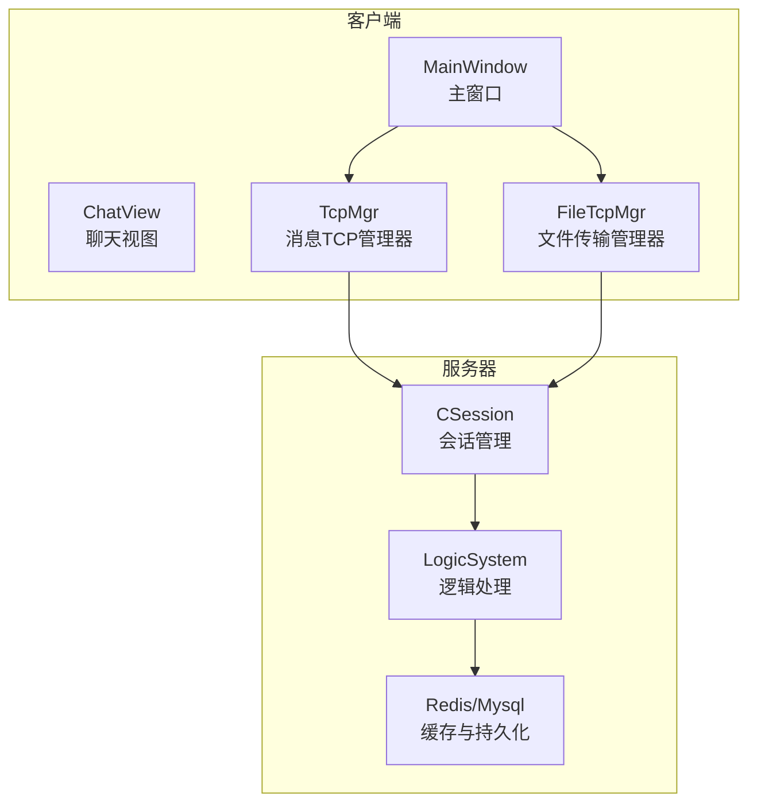
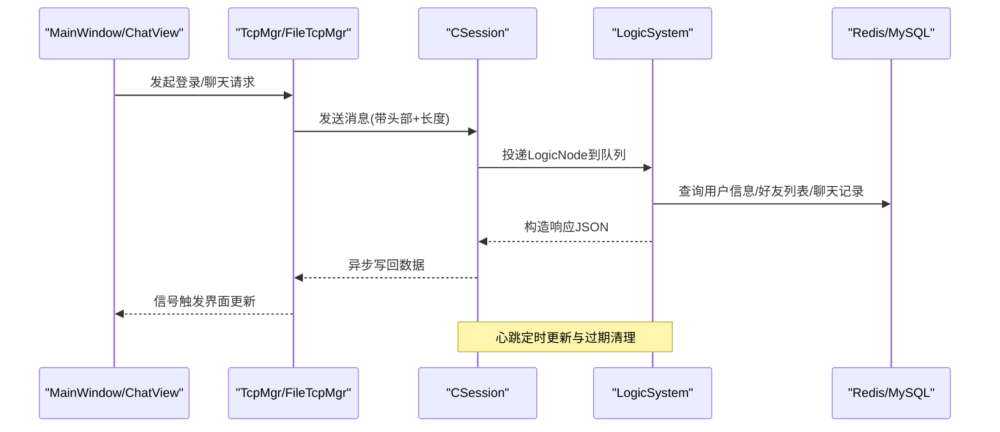
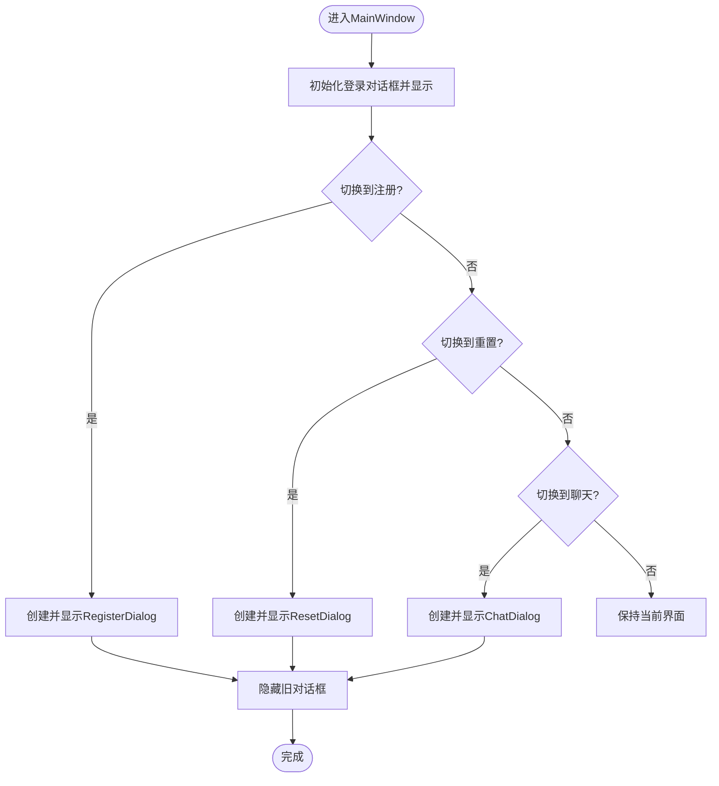
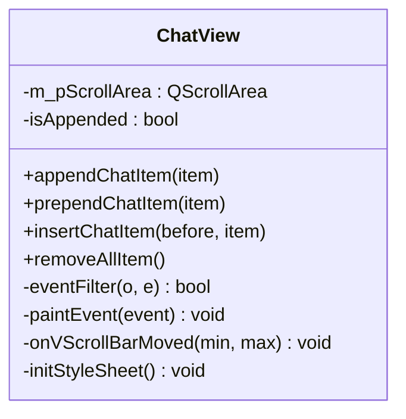
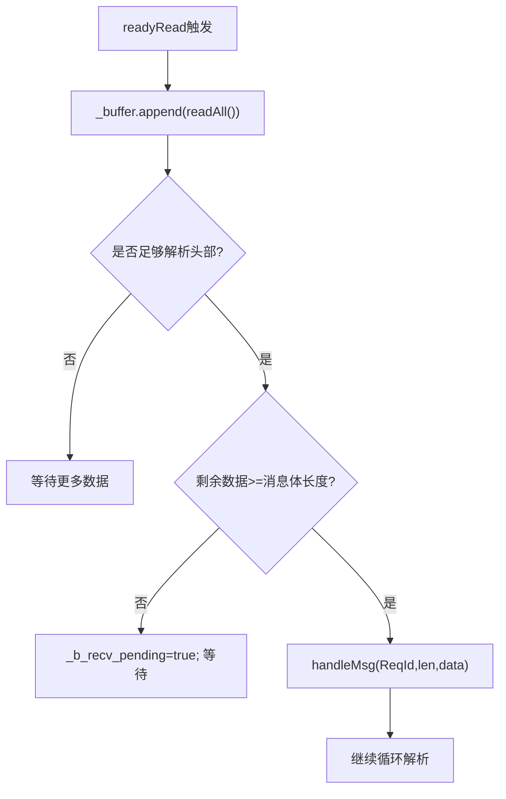
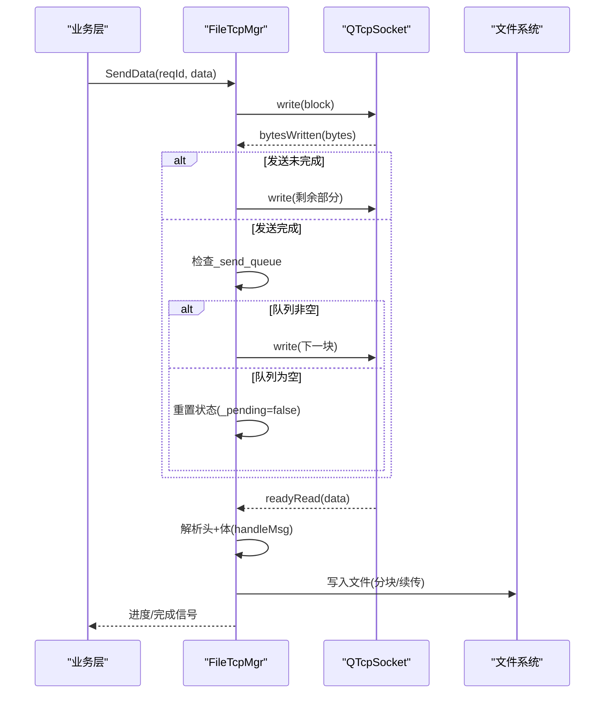
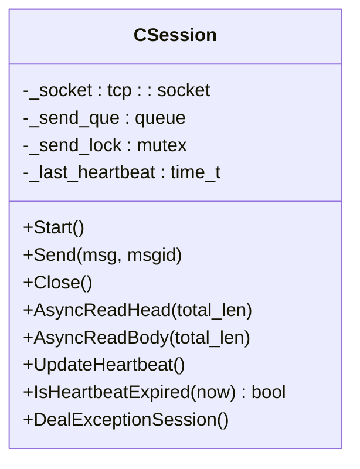
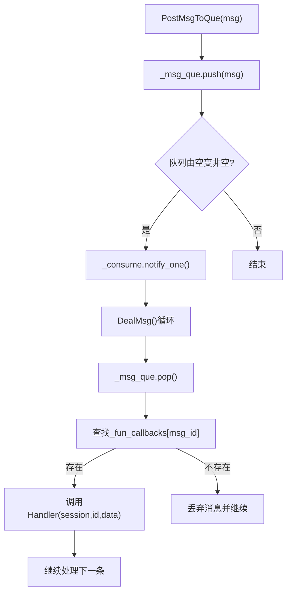
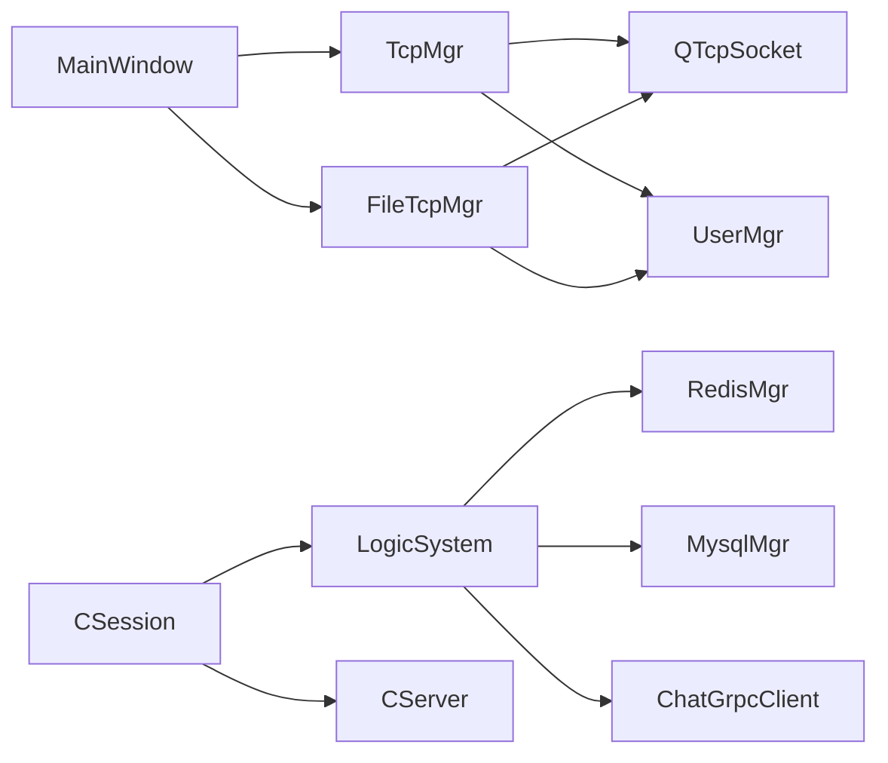

# 性能问题排查

<cite>
**本文引用的文件**   
- [client/llfcchat/src/mainwindow.cpp](file://client/llfcchat/src/mainwindow.cpp)
- [client/llfcchat/include/mainwindow.h](file://client/llfcchat/include/mainwindow.h)
- [client/llfcchat/src/chatview.cpp](file://client/llfcchat/src/chatview.cpp)
- [client/llfcchat/include/chatview.h](file://client/llfcchat/include/chatview.h)
- [client/llfcchat/src/tcpmgr.cpp](file://client/llfcchat/src/tcpmgr.cpp)
- [client/llfcchat/src/filetcpmgr.cpp](file://client/llfcchat/src/filetcpmgr.cpp)
- [server/ChatServer/src/LogicSystem.cpp](file://server/ChatServer/src/LogicSystem.cpp)
- [server/ChatServer/include/LogicSystem.h](file://server/ChatServer/include/LogicSystem.h)
- [server/ChatServer/src/CSession.cpp](file://server/ChatServer/src/CSession.cpp)
- [server/ChatServer/include/CSession.h](file://server/ChatServer/include/CSession.h)
- [CMakeLists.txt](file://CMakeLists.txt)
- [client/llfcchat/CMakeLists.txt](file://client/llfcchat/CMakeLists.txt)
</cite>

## 目录
1. [简介](#简介)
2. [项目结构](#项目结构)
3. [核心组件](#核心组件)
4. [架构总览](#架构总览)
5. [详细组件分析](#详细组件分析)
6. [依赖关系分析](#依赖关系分析)
7. [性能考量与优化建议](#性能考量与优化建议)
8. [故障排查指南](#故障排查指南)
9. [结论](#结论)
10. [附录：性能测试案例与工具使用](#附录性能测试案例与工具使用)

## 简介
本文件面向LLFCChat项目的性能问题排查与优化，覆盖客户端MainWindow的UI渲染、事件处理与内存管理；服务器端LogicSystem的线程模型、异步I/O与资源监控；以及FileTcpMgr的文件传输并发控制、缓冲区管理与I/O优化。文档同时提供Valgrind、gprof、Qt Creator性能分析器的使用指南，并给出可复现的性能测试案例与优化前后对比方法，帮助开发者快速定位和解决内存泄漏、CPU占用过高、GC频繁（Qt对象生命周期相关）、响应延迟等瓶颈。

## 项目结构
本项目采用多模块工程：
- 客户端：基于Qt5的GUI应用，包含登录、注册、聊天界面、消息收发、文件传输等能力。
- 服务器：基于Boost.Asio与gRPC的多服务架构，包括ChatServer、GateServer、ResourceServer、StatusServer等。
- 构建系统：CMake + vcpkg，统一依赖管理与子模块编译。

图表来源
- [client/llfcchat/src/mainwindow.cpp:1-164](file://client/llfcchat/src/mainwindow.cpp#L1-L164)
- [client/llfcchat/src/chatview.cpp:1-133](file://client/llfcchat/src/chatview.cpp#L1-L133)
- [client/llfcchat/src/tcpmgr.cpp:1-800](file://client/llfcchat/src/tcpmgr.cpp#L1-L800)
- [client/llfcchat/src/filetcpmgr.cpp:1-800](file://client/llfcchat/src/filetcpmgr.cpp#L1-L800)
- [server/ChatServer/src/CSession.cpp:1-338](file://server/ChatServer/src/CSession.cpp#L1-L338)
- [server/ChatServer/src/LogicSystem.cpp:1-800](file://server/ChatServer/src/LogicSystem.cpp#L1-L800)

章节来源
- [CMakeLists.txt:1-34](file://CMakeLists.txt#L1-L34)
- [client/llfcchat/CMakeLists.txt:1-222](file://client/llfcchat/CMakeLists.txt#L1-L222)

## 核心组件
- MainWindow：负责界面状态切换、对话框生命周期管理、网络断开重连与UI尺寸调整。
- ChatView：自定义滚动区域与布局，用于高效追加聊天项与滚动条行为控制。
- TcpMgr：封装QTcpSocket的消息收发、粘包处理、错误处理与信号转发。
- FileTcpMgr：实现断点续传、分块发送/接收、进度回调与批量发送队列。
- CSession：基于Boost.Asio的异步读写、心跳检测、异常会话清理与发送队列保护。
- LogicSystem：单工作线程的消息队列处理器，按消息ID分发到具体Handler，涉及Redis/MySQL/gRPC交互。

章节来源
- [client/llfcchat/include/mainwindow.h:1-57](file://client/llfcchat/include/mainwindow.h#L1-L57)
- [client/llfcchat/src/mainwindow.cpp:1-164](file://client/llfcchat/src/mainwindow.cpp#L1-L164)
- [client/llfcchat/include/chatview.h:1-33](file://client/llfcchat/include/chatview.h#L1-L33)
- [client/llfcchat/src/chatview.cpp:1-133](file://client/llfcchat/src/chatview.cpp#L1-L133)
- [client/llfcchat/src/tcpmgr.cpp:1-800](file://client/llfcchat/src/tcpmgr.cpp#L1-L800)
- [client/llfcchat/src/filetcpmgr.cpp:1-800](file://client/llfcchat/src/filetcpmgr.cpp#L1-L800)
- [server/ChatServer/include/CSession.h:1-86](file://server/ChatServer/include/CSession.h#L1-L86)
- [server/ChatServer/src/CSession.cpp:1-338](file://server/ChatServer/src/CSession.cpp#L1-L338)
- [server/ChatServer/include/LogicSystem.h:1-61](file://server/ChatServer/include/LogicSystem.h#L1-L61)
- [server/ChatServer/src/LogicSystem.cpp:1-800](file://server/ChatServer/src/LogicSystem.cpp#L1-L800)

## 架构总览
下图展示客户端与服务端的交互流程，包括登录、聊天消息、图片上传下载、心跳与异常处理。

图表来源
- [client/llfcchat/src/tcpmgr.cpp:1-800](file://client/llfcchat/src/tcpmgr.cpp#L1-L800)
- [client/llfcchat/src/filetcpmgr.cpp:1-800](file://client/llfcchat/src/filetcpmgr.cpp#L1-L800)
- [server/ChatServer/src/CSession.cpp:1-338](file://server/ChatServer/src/CSession.cpp#L1-L338)
- [server/ChatServer/src/LogicSystem.cpp:1-800](file://server/ChatServer/src/LogicSystem.cpp#L1-L800)

## 详细组件分析

### 客户端MainWindow：UI性能与内存管理
- 界面切换与对话框生命周期
  - 通过setCentralWidget切换LoginDialog/RegisterDialog/ResetDialog/ChatDialog，注意旧对话框隐藏与释放时机，避免重复new导致内存增长。
  - 在离线或连接异常时调用offlineLogin重建登录界面，需确保旧界面被正确隐藏与析构。
- 事件处理优化
  - 大量connect绑定信号槽，应确保在不需要时断开连接，避免悬空指针与重复回调。
  - 弹窗提示使用QMessageBox，应避免在主线程阻塞，必要时使用异步方式。
- 内存管理最佳实践
  - 使用父对象自动释放机制，避免手动delete造成双重释放。
  - 对大对象（如图片）进行懒加载与缓存，减少内存峰值。

图表来源
- [client/llfcchat/src/mainwindow.cpp:1-164](file://client/llfcchat/src/mainwindow.cpp#L1-L164)
- [client/llfcchat/include/mainwindow.h:1-57](file://client/llfcchat/include/mainwindow.h#L1-L57)

章节来源
- [client/llfcchat/src/mainwindow.cpp:1-164](file://client/llfcchat/src/mainwindow.cpp#L1-L164)
- [client/llfcchat/include/mainwindow.h:1-57](file://client/llfcchat/include/mainwindow.h#L1-L57)

### 客户端ChatView：界面渲染优化
- 滚动区域与布局
  - 使用QScrollArea承载聊天内容，通过appendChatItem尾插新消息，配合onVScrollBarMoved将滚动条置底，保证最新消息可见。
  - isAppended标志位避免多次滚动到底部导致的抖动。
- 事件过滤与绘制
  - eventFilter处理鼠标进入/离开以控制滚动条显隐，paintEvent委托样式绘制，减少自定义绘制开销。
- 性能建议
  - 避免频繁insertWidget，尽量批量添加后一次性刷新。
  - 使用QTimer节流滚动操作，降低UI卡顿。

图表来源
- [client/llfcchat/include/chatview.h:1-33](file://client/llfcchat/include/chatview.h#L1-L33)
- [client/llfcchat/src/chatview.cpp:1-133](file://client/llfcchat/src/chatview.cpp#L1-L133)

章节来源
- [client/llfcchat/src/chatview.cpp:1-133](file://client/llfcchat/src/chatview.cpp#L1-L133)
- [client/llfcchat/include/chatview.h:1-33](file://client/llfcchat/include/chatview.h#L1-L33)

### 客户端TcpMgr：网络I/O与粘包处理
- 粘包处理
  - readyRead中循环读取所有数据，先解析头部（消息ID+长度），再根据长度读取消息体，避免粘包/半包问题。
- 发送队列与背压
  - bytesWritten回调中维护_current_block与_send_queue，当发送未完成时继续写入，完成后从队列取下一块，防止内存暴涨。
- 错误处理
  - error信号分支处理连接拒绝、远程关闭、主机未找到、超时等，及时emit连接失败信号并通知上层。

图表来源
- [client/llfcchat/src/tcpmgr.cpp:1-800](file://client/llfcchat/src/tcpmgr.cpp#L1-L800)

章节来源
- [client/llfcchat/src/tcpmgr.cpp:1-800](file://client/llfcchat/src/tcpmgr.cpp#L1-L800)

### 客户端FileTcpMgr：文件传输并发与缓冲优化
- 断点续传与分块
  - 支持上传/下载的seq序列号、last标记、total_size/current_size，实现断点续传与进度反馈。
- 并发控制与缓冲区
  - _send_queue作为发送队列，_pending标记当前是否正在发送，bytesWritten回调驱动队列消费，避免阻塞。
  - 接收侧_buffer累积数据，按头+体解析，减少频繁IO。
- I/O优化
  - Base64编解码仅在必要路径执行，文件写入使用Append模式避免重复打开。
  - 批量发送BatchSend提升吞吐，结合_cwnd_size进行简单的拥塞控制。

图表来源
- [client/llfcchat/src/filetcpmgr.cpp:1-800](file://client/llfcchat/src/filetcpmgr.cpp#L1-L800)

章节来源
- [client/llfcchat/src/filetcpmgr.cpp:1-800](file://client/llfcchat/src/filetcpmgr.cpp#L1-L800)

### 服务器CSession：异步I/O与心跳检测
- 异步读写
  - AsyncReadHead/AsyncReadBody实现非阻塞读，HandleWrite异步写，保证高并发下不阻塞。
- 心跳与异常清理
  - UpdateHeartbeat记录最近心跳时间，IsHeartbeatExpired判断超时；DealExceptionSession清理Redis中的会话与登录信息。
- 发送队列保护
  - _send_que与_send_lock保证多线程安全，超过MAX_SENDQUE直接丢弃，防止内存溢出。

图表来源
- [server/ChatServer/include/CSession.h:1-86](file://server/ChatServer/include/CSession.h#L1-L86)
- [server/ChatServer/src/CSession.cpp:1-338](file://server/ChatServer/src/CSession.cpp#L1-L338)

章节来源
- [server/ChatServer/src/CSession.cpp:1-338](file://server/ChatServer/src/CSession.cpp#L1-L338)
- [server/ChatServer/include/CSession.h:1-86](file://server/ChatServer/include/CSession.h#L1-L86)

### 服务器LogicSystem：线程模型与消息分发
- 单工作线程队列
  - DealMsg循环从_msg_que取出消息，查找_fun_callbacks映射并调用对应Handler，保证顺序处理。
- 回调注册与分发
  - RegisterCallBacks注册各消息类型的处理函数，PostMsgToQue线程安全入队并条件变量唤醒。
- 性能关注点
  - 单线程可能成为瓶颈，在高负载场景考虑多工作线程或任务拆分。
  - Handler中涉及Redis/MySQL/gRPC调用，应尽量避免阻塞，必要时异步化。

图表来源
- [server/ChatServer/src/LogicSystem.cpp:1-800](file://server/ChatServer/src/LogicSystem.cpp#L1-L800)
- [server/ChatServer/include/LogicSystem.h:1-61](file://server/ChatServer/include/LogicSystem.h#L1-L61)

章节来源
- [server/ChatServer/src/LogicSystem.cpp:1-800](file://server/ChatServer/src/LogicSystem.cpp#L1-L800)
- [server/ChatServer/include/LogicSystem.h:1-61](file://server/ChatServer/include/LogicSystem.h#L1-L61)

## 依赖关系分析
- 客户端依赖Qt5网络与Widgets库，CMakeLists中明确链接Qt5::Core/Gui/Network/Widgets。
- 服务器依赖Boost.Asio、gRPC、jsoncpp、Redis/MySQL客户端，构建脚本通过vcpkg管理依赖。
- 组件间耦合：
  - MainWindow依赖TcpMgr/FileTcpMgr进行通信。
  - TcpMgr/FileTcpMgr依赖QTcpSocket与UserMgr。
  - CSession依赖CServer、LogicSystem、RedisMgr、MysqlMgr。
  - LogicSystem依赖RedisMgr、MysqlMgr、ChatGrpcClient。

图表来源
- [client/llfcchat/CMakeLists.txt:185-207](file://client/llfcchat/CMakeLists.txt#L185-L207)
- [server/ChatServer/src/CSession.cpp:1-338](file://server/ChatServer/src/CSession.cpp#L1-L338)
- [server/ChatServer/src/LogicSystem.cpp:1-800](file://server/ChatServer/src/LogicSystem.cpp#L1-L800)

章节来源
- [client/llfcchat/CMakeLists.txt:1-222](file://client/llfcchat/CMakeLists.txt#L1-L222)
- [CMakeLists.txt:1-34](file://CMakeLists.txt#L1-L34)

## 性能考量与优化建议

### 内存泄漏检测
- 客户端
  - 使用Valgrind检测Qt对象生命周期与动态分配，重点关注MainWindow对话框切换时的内存增长。
  - 避免重复new对话框而不释放，确保父对象析构时自动释放子对象。
- 服务器
  - 使用Valgrind检测CSession与LogicSystem中的shared_ptr/queue生命周期，确保异常路径正确清理。
  - Redis/MySQL连接池复用，避免频繁创建销毁。

### CPU占用过高
- 客户端
  - ChatView的appendChatItem与onVScrollBarMoved频繁调用可能导致UI卡顿，建议使用QTimer节流与批量插入。
  - 图片加载与Base64编解码应在后台线程执行，避免阻塞主线程。
- 服务器
  - LogicSystem单线程处理所有消息，高负载下应考虑多工作线程或任务拆分。
  - Handler中数据库/Redis调用应批量化与异步化，减少锁竞争。

### GC频繁（Qt对象生命周期）
- 客户端
  - 大量临时QByteArray/QJsonDocument在TcpMgr/FileTcpMgr中创建，应复用缓冲区与对象，减少分配。
  - 图片对象使用QPixmap缓存，避免重复加载。
- 服务器
  - Json::Value频繁序列化/反序列化，考虑使用更高效的序列化方案或对象池。

### 响应延迟
- 客户端
  - 网络请求与UI更新分离，使用信号槽异步更新界面。
  - 文件传输使用断点续传与批量发送，提升吞吐。
- 服务器
  - CSession的发送队列限制MAX_SENDQUE，避免阻塞；心跳检测间隔合理设置。
  - LogicSystem的Handler中避免阻塞调用，必要时使用异步任务。

## 故障排查指南
- 常见问题
  - 界面卡顿：检查ChatView的滚动与插入逻辑，确认是否频繁重绘。
  - 内存增长：使用Valgrind定位未释放对象，检查对话框生命周期。
  - 高CPU占用：使用gprof或Qt Creator性能分析器定位热点函数。
  - 响应延迟：检查网络I/O与数据库调用，优化批处理与缓存。
- 调试步骤
  - 启用日志输出，定位关键路径耗时。
  - 使用性能分析器生成火焰图，识别热点。
  - 逐步隔离问题模块，验证优化效果。

章节来源
- [client/llfcchat/src/chatview.cpp:1-133](file://client/llfcchat/src/chatview.cpp#L1-L133)
- [client/llfcchat/src/tcpmgr.cpp:1-800](file://client/llfcchat/src/tcpmgr.cpp#L1-L800)
- [client/llfcchat/src/filetcpmgr.cpp:1-800](file://client/llfcchat/src/filetcpmgr.cpp#L1-L800)
- [server/ChatServer/src/CSession.cpp:1-338](file://server/ChatServer/src/CSession.cpp#L1-L338)
- [server/ChatServer/src/LogicSystem.cpp:1-800](file://server/ChatServer/src/LogicSystem.cpp#L1-L800)

## 结论
通过对MainWindow、ChatView、TcpMgr、FileTcpMgr、CSession与LogicSystem的详细分析，明确了客户端UI渲染、事件处理、内存管理与服务器异步I/O、线程模型、资源调度的关键优化点。结合性能分析工具与测试案例，可有效定位并解决内存泄漏、CPU占用过高、GC频繁与响应延迟等问题，提升整体系统性能与稳定性。

## 附录：性能测试案例与工具使用

### 性能测试案例
- 聊天消息吞吐测试
  - 模拟大量聊天消息发送与接收，统计平均延迟与吞吐量。
  - 观察ChatView的appendChatItem频率与UI卡顿情况。
- 文件传输压力测试
  - 并发上传/下载大文件，监控FileTcpMgr的_send_queue长度与_buffer大小。
  - 验证断点续传与进度反馈的正确性。
- 服务器负载测试
  - 模拟高并发登录与聊天请求，观察LogicSystem的_msg_que长度与处理耗时。
  - 检查CSession的发送队列是否溢出与心跳检测是否正常。

### 工具使用指南
- Valgrind
  - 客户端：valgrind --leak-check=full ./llfcchat
  - 服务器：valgrind --leak-check=full ./ChatServer
  - 分析输出，定位未释放内存与重复分配。
- gprof
  - 编译时添加-g -pg参数，运行后生成gmon.out，使用gprof分析热点函数。
- Qt Creator性能分析器
  - 启动Profiler，选择CPU Profiler与Memory Profiler，运行应用并收集数据。
  - 查看火焰图与内存分配趋势，优化热点代码。

章节来源
- [client/llfcchat/CMakeLists.txt:185-207](file://client/llfcchat/CMakeLists.txt#L185-L207)
- [CMakeLists.txt:1-34](file://CMakeLists.txt#L1-L34)