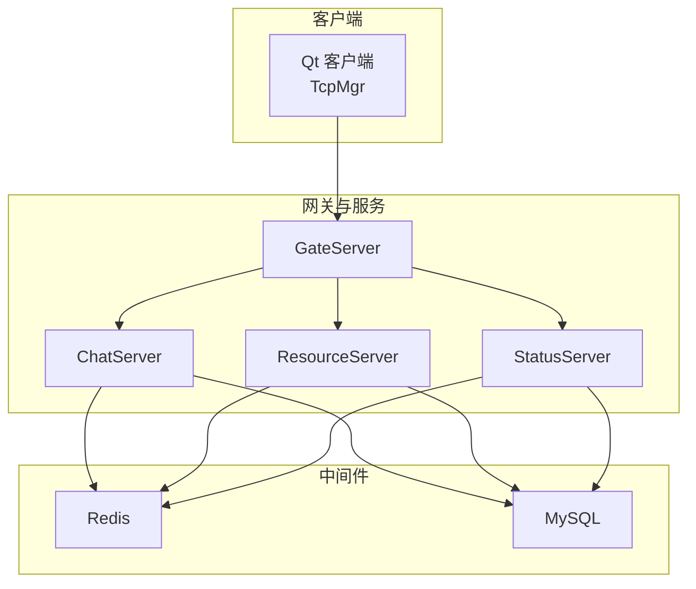
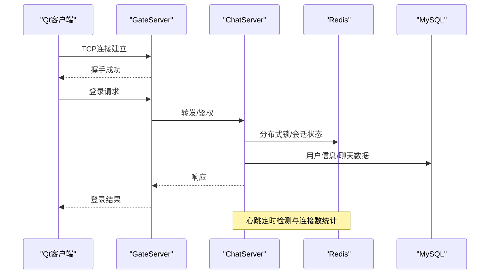
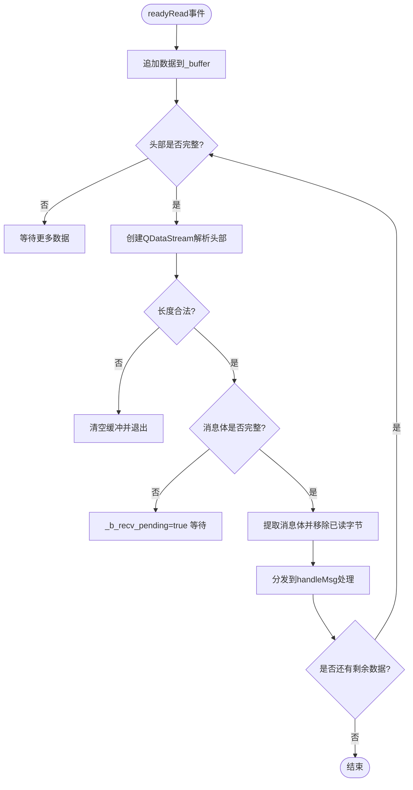
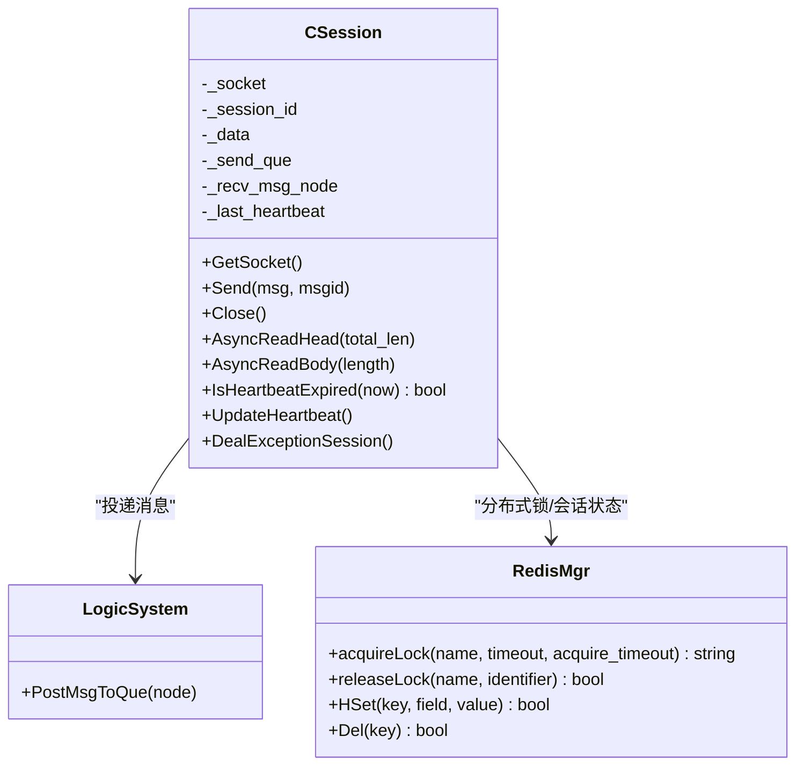
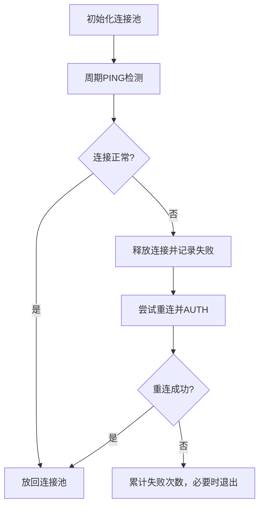
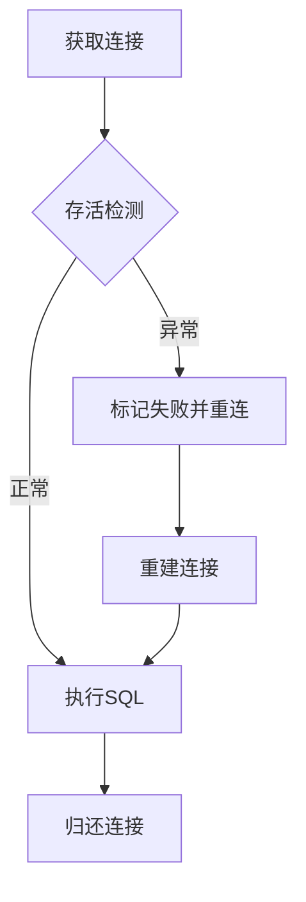
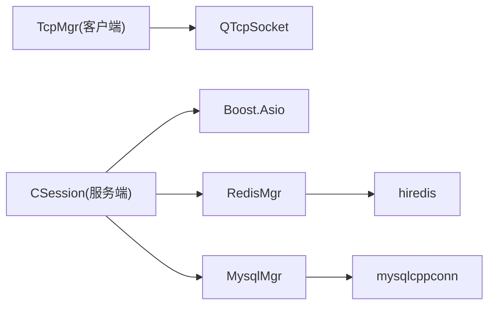

# 故障排查

<cite>
**本文引用的文件**   
- [README.md](file://README.md)
- [tcpmgr.h](file://client/llfcchat/include/tcpmgr.h)
- [tcpmgr.cpp](file://client/llfcchat/src/tcpmgr.cpp)
- [CSession.h](file://server/ChatServer/include/CSession.h)
- [MysqlMgr.h](file://server/ChatServer/include/MysqlMgr.h)
- [RedisMgr.h](file://server/ChatServer/include/RedisMgr.h)
- [MysqlDao.h](file://server/ChatServer/include/MysqlDao.h)
- [const.h](file://server/ChatServer/include/const.h)
- [utils.h](file://server/ChatServer/include/utils.h)
- [chatserver1.ini](file://server/ChatServer/config/chatserver1.ini)
- [day42-Qt粘包引发的血案.md](file://开发文档/day42-Qt粘包引发的血案.md)
- [day35心跳逻辑.md](file://开发文档/day35心跳逻辑.md)
- [day33单服程踢人逻辑.md](file://开发文档/day33单服程踢人逻辑.md)
- [GateServer.cpp](file://server/GateServer/src/GateServer.cpp)
</cite>

## 目录
1. [简介](#简介)
2. [项目结构](#项目结构)
3. [核心组件](#核心组件)
4. [架构总览](#架构总览)
5. [详细组件分析](#详细组件分析)
6. [依赖关系分析](#依赖关系分析)
7. [性能与内存问题排查](#性能与内存问题排查)
8. [日志分析方法](#日志分析方法)
9. [典型故障场景与应急处理](#典型故障场景与应急处理)
10. [预防与监控告警建议](#预防与监控告警建议)
11. [结论](#结论)

## 简介
本故障排查文档面向LLFCChat项目的运维与研发人员，聚焦网络层、数据库层、内存与性能、日志分析与应急响应等关键领域。文档基于仓库中的客户端TCP管理、服务端会话与连接池实现、Redis与MySQL连接池与健康检查、心跳与分布式锁机制、以及Qt粘包解析实践等源码与开发文档进行系统化梳理，提供可操作的诊断步骤、定位技巧与修复建议。

## 项目结构
- 客户端（Qt）：通过TcpMgr封装QTcpSocket，负责连接、粘包处理、错误回调与消息分发。
- 服务器端（C++）：
  - ChatServer/GateServer/ResourceServer/StatusServer：基于Boost.Asio的异步I/O服务，维护会话、心跳、消息路由与业务逻辑。
  - VarifyServer（Node.js）：验证码与邮件等服务。
- 中间件：MySQL（持久化）、Redis（缓存/分布式锁/计数）。
- 配置：各服务ini配置文件集中管理端口、主机、认证信息。

**图示来源** 
- [tcpmgr.h:1-90](file://client/llfcchat/include/tcpmgr.h#L1-L90)
- [CSession.h:1-86](file://server/ChatServer/include/CSession.h#L1-L86)
- [chatserver1.ini:1-30](file://server/ChatServer/config/chatserver1.ini#L1-L30)

**章节来源**
- [README.md:1-112](file://README.md#L1-L112)

## 核心组件
- 客户端TCP管理器（TcpMgr）：封装连接、发送队列、粘包解析、错误处理与信号回调。
- 服务端会话（CSession）：基于Asio的读写、心跳更新、异常清理与消息投递。
- 连接池与资源管理：
  - Redis连接池（RedisConPool/RedisMgr）：健康检查、自动重连、分布式锁。
  - MySQL连接池（MySqlPool/MysqlDao/MysqlMgr）：存活检测、自动重连、事务封装。
- 配置与常量：端口、协议头长度、错误码、时间戳工具等。

**章节来源**
- [tcpmgr.h:1-90](file://client/llfcchat/include/tcpmgr.h#L1-L90)
- [tcpmgr.cpp:63-91](file://client/llfcchat/src/tcpmgr.cpp#L63-L91)
- [CSession.h:1-86](file://server/ChatServer/include/CSession.h#L1-L86)
- [RedisMgr.h:1-305](file://server/ChatServer/include/RedisMgr.h#L1-L305)
- [MysqlDao.h:102-160](file://server/ChatServer/include/MysqlDao.h#L102-L160)
- [MysqlMgr.h:1-41](file://server/ChatServer/include/MysqlMgr.h#L1-L41)
- [const.h:1-46](file://server/ChatServer/include/const.h#L1-L46)
- [utils.h:1-7](file://server/ChatServer/include/utils.h#L1-L7)

## 架构总览
系统采用“客户端—网关—业务服务”分层架构，结合gRPC与HTTP交互，使用Redis做分布式协调与缓存，MySQL做持久化存储。会话级心跳与分布式锁保障多实例一致性，连接池保证高并发下的稳定性。

**图示来源** 
- [GateServer.cpp:119-162](file://server/GateServer/src/GateServer.cpp#L119-L162)
- [CSession.h:1-86](file://server/ChatServer/include/CSession.h#L1-L86)
- [RedisMgr.h:1-305](file://server/ChatServer/include/RedisMgr.h#L1-L305)
- [MysqlMgr.h:1-41](file://server/ChatServer/include/MysqlMgr.h#L1-L41)

## 详细组件分析

### 客户端TCP管理与粘包处理
- 连接与错误处理：
  - 监听error信号，区分连接拒绝、远程关闭、主机未找到、超时、网络错误等，并触发sig_con_success(false)通知上层。
- 粘包解析：
  - 使用QDataStream读取头部（ID+长度），注意不要在循环外复用stream对象；每次解析需重新创建或重置位置，避免buffer变化导致读取错位。
  - 推荐在readyRead中while循环处理完整消息，确保半包与粘包均被正确处理。
- 发送队列：
  - 使用QQueue暂存待发包，避免阻塞UI线程；当前块发送完成后继续下一块。

**图示来源** 
- [tcpmgr.cpp:63-91](file://client/llfcchat/src/tcpmgr.cpp#L63-L91)
- [day42-Qt粘包引发的血案.md:1-514](file://开发文档/day42-Qt粘包引发的血案.md#L1-L514)

**章节来源**
- [tcpmgr.cpp:63-91](file://client/llfcchat/src/tcpmgr.cpp#L63-L91)
- [day42-Qt粘包引发的血案.md:1-514](file://开发文档/day42-Qt粘包引发的血案.md#L1-L514)

### 服务端会话与心跳机制
- 会话生命周期：
  - CSession维护socket、接收/发送队列、心跳时间戳、用户UID与会话ID。
  - 异步读取头部与消息体，错误时关闭连接并清理会话。
- 心跳与过期清理：
  - 定时器遍历sessions，判断IsHeartbeatExpired，关闭过期连接并收集待处理项。
  - 统计在线会话数量写入Redis，减少频繁加锁开销。
- 分布式锁与踢人：
  - 异常路径使用Redis分布式锁保护会话清理，防止多实例竞态。

**图示来源** 
- [CSession.h:1-86](file://server/ChatServer/include/CSession.h#L1-L86)
- [day35心跳逻辑.md:1-688](file://开发文档/day35心跳逻辑.md#L1-L688)
- [day33单服程踢人逻辑.md:397-460](file://开发文档/day33单服程踢人逻辑.md#L397-L460)

**章节来源**
- [CSession.h:1-86](file://server/ChatServer/include/CSession.h#L1-L86)
- [day35心跳逻辑.md:1-688](file://开发文档/day35心跳逻辑.md#L1-L688)
- [day33单服程踢人逻辑.md:397-460](file://开发文档/day33单服程踢人逻辑.md#L397-L460)

### Redis连接池与健康检查
- 连接池初始化：
  - 预创建N个redisContext，AUTH成功后入池。
- 健康检查线程：
  - 周期性PING检测，失败则释放并重建连接，累计fail_count后批量重连。
- 操作封装：
  - Get/Set/Del/HSet/HGet/LPush/RPop等接口统一从池中获取连接，执行后归还。

**图示来源** 
- [RedisMgr.h:1-305](file://server/ChatServer/include/RedisMgr.h#L1-L305)

**章节来源**
- [RedisMgr.h:1-305](file://server/ChatServer/include/RedisMgr.h#L1-L305)

### MySQL连接池与查询健壮性
- 连接池与存活检测：
  - 定期SELECT 1探测连接健康，失败标记并重建连接。
- 重连策略：
  - 失败计数驱动重连循环，直到恢复或达到上限。
- 事务封装：
  - MysqlMgr封装注册、登录、好友申请、聊天消息等常用操作。

**图示来源** 
- [MysqlDao.h:102-160](file://server/ChatServer/include/MysqlDao.h#L102-L160)
- [MysqlMgr.h:1-41](file://server/ChatServer/include/MysqlMgr.h#L1-L41)

**章节来源**
- [MysqlDao.h:102-160](file://server/ChatServer/include/MysqlDao.h#L102-L160)
- [MysqlMgr.h:1-41](file://server/ChatServer/include/MysqlMgr.h#L1-L41)

## 依赖关系分析
- 客户端依赖Qt网络库与自定义Singleton模式。
- 服务端依赖Boost.Asio/Beast、gRPC、hiredis、mysqlcppconn。
- 配置中心化管理，便于多实例部署与动态切换。

**图示来源** 
- [tcpmgr.h:1-90](file://client/llfcchat/include/tcpmgr.h#L1-L90)
- [CSession.h:1-86](file://server/ChatServer/include/CSession.h#L1-L86)
- [RedisMgr.h:1-305](file://server/ChatServer/include/RedisMgr.h#L1-L305)
- [MysqlMgr.h:1-41](file://server/ChatServer/include/MysqlMgr.h#L1-L41)

**章节来源**
- [tcpmgr.h:1-90](file://client/llfcchat/include/tcpmgr.h#L1-L90)
- [CSession.h:1-86](file://server/ChatServer/include/CSession.h#L1-L86)
- [RedisMgr.h:1-305](file://server/ChatServer/include/RedisMgr.h#L1-L305)
- [MysqlMgr.h:1-41](file://server/ChatServer/include/MysqlMgr.h#L1-L41)

## 性能与内存问题排查
- 内存泄漏检测：
  - 关注QByteArray与QDataStream的使用，避免长生命周期对象持有大缓冲区；及时clear/remove释放。
  - 检查Redis/MySQL连接池析构与Close调用，确保无悬挂连接。
- CPU占用过高：
  - 热点路径为readyRead粘包解析与心跳定时器遍历；优化buffer操作（remove优于mid赋值），减少不必要的拷贝。
  - 心跳检测间隔与阈值合理设置，避免频繁扫描。
- GC频繁（Qt非GC语言，但存在大量临时对象）：
  - 减少字符串拼接与临时对象创建，使用reserve预分配缓冲区容量。
- 性能瓶颈定位：
  - 使用getCurrentTimestamp工具打点关键路径耗时。
  - 观察连接池等待与重连频率，评估poolSize与并发量匹配度。

[本节为通用指导，不直接分析具体文件]

## 日志分析方法
- 日志级别配置：
  - 客户端qDebug用于调试，生产环境建议降低级别或输出到文件。
  - 服务端std::cout/cerr用于关键错误与异常堆栈，配合进程守护与日志轮转。
- 关键日志定位：
  - 连接错误：ConnectionRefusedError、HostNotFoundError、SocketTimeoutError、NetworkError。
  - 粘包解析：打印message_id与message_len，校验长度合法性。
  - 连接池：PING失败、AUTH失败、重连成功/失败。
- 错误堆栈分析：
  - 捕获std::exception与boost::system::error_code，记录ec.what()与上下文信息。
- 性能指标监控：
  - 会话数量、连接池大小、重连次数、平均响应时间。

**章节来源**
- [tcpmgr.cpp:63-91](file://client/llfcchat/src/tcpmgr.cpp#L63-L91)
- [const.h:1-46](file://server/ChatServer/include/const.h#L1-L46)
- [utils.h:1-7](file://server/ChatServer/include/utils.h#L1-L7)

## 典型故障场景与应急处理
- 连接失败：
  - 现象：sig_con_success(false)，错误类型为ConnectionRefusedError或HostNotFoundError。
  - 处理：检查服务端端口与防火墙，确认配置文件中Host/Port正确。
- 网络超时：
  - 现象：SocketTimeoutError，客户端长时间无响应。
  - 处理：调整客户端超时参数，检查服务端负载与心跳阈值。
- 粘包处理异常：
  - 现象：message_id/length解析错误，断点调试时更易复现。
  - 处理：确保每次解析重新创建QDataStream，使用remove而非mid赋值，添加长度校验。
- 连接断开：
  - 现象：RemoteHostClosedError，会话清理。
  - 处理：检查心跳过期逻辑与分布式锁释放，确保Redis会话状态一致。
- 数据库连接池耗尽：
  - 现象：getConnection等待超时，重连频繁。
  - 处理：增大poolSize，优化慢查询，检查死锁与事务时长。
- 查询缓慢：
  - 现象：SQL执行时间长，连接池占用久。
  - 处理：索引优化、分页限制、避免全表扫描。
- 死锁问题：
  - 现象：Redis分布式锁竞争，会话清理卡住。
  - 处理：统一加锁顺序，使用scoped_lock避免交叉锁；缩短锁持有时间。
- 数据不一致：
  - 现象：Redis与MySQL状态不同步。
  - 处理：增加一致性校验与补偿任务，必要时回滚与重试。

**章节来源**
- [tcpmgr.cpp:63-91](file://client/llfcchat/src/tcpmgr.cpp#L63-L91)
- [day42-Qt粘包引发的血案.md:1-514](file://开发文档/day42-Qt粘包引发的血案.md#L1-L514)
- [day35心跳逻辑.md:1-688](file://开发文档/day35心跳逻辑.md#L1-L688)
- [day33单服程踢人逻辑.md:397-460](file://开发文档/day33单服程踢人逻辑.md#L397-L460)
- [MysqlDao.h:102-160](file://server/ChatServer/include/MysqlDao.h#L102-L160)
- [RedisMgr.h:1-305](file://server/ChatServer/include/RedisMgr.h#L1-L305)

## 预防与监控告警建议
- 预防措施：
  - 连接池大小根据并发量预估，预留余量；定期健康检查与自动重连。
  - 粘包解析严格校验长度，异常数据清空缓冲。
  - 心跳阈值合理设置，避免误判与僵尸连接。
- 监控告警：
  - 连接池等待时间、重连失败率、会话过期率、Redis/MySQL错误率。
  - 关键错误日志聚合与实时告警（如连接拒绝、超时、死锁）。
- 应急响应流程：
  - 服务重启：优先重启异常节点，恢复连接池与会话。
  - 数据恢复：从备份恢复MySQL/Redis数据，校验一致性。
  - 配置修正：更新配置文件后热加载或滚动升级。
  - 紧急修复：快速回滚版本，隔离问题服务。

**章节来源**
- [chatserver1.ini:1-30](file://server/ChatServer/config/chatserver1.ini#L1-L30)
- [GateServer.cpp:119-162](file://server/GateServer/src/GateServer.cpp#L119-L162)

## 结论
LLFCChat项目在客户端与服务端均实现了稳健的网络与资源管理机制。通过规范化的粘包解析、连接池健康检查、心跳与分布式锁，系统具备较强的容错能力。故障排查应围绕网络层、数据库层、内存与性能、日志分析四大维度展开，结合监控告警与应急预案，快速定位并解决问题，保障服务稳定运行。