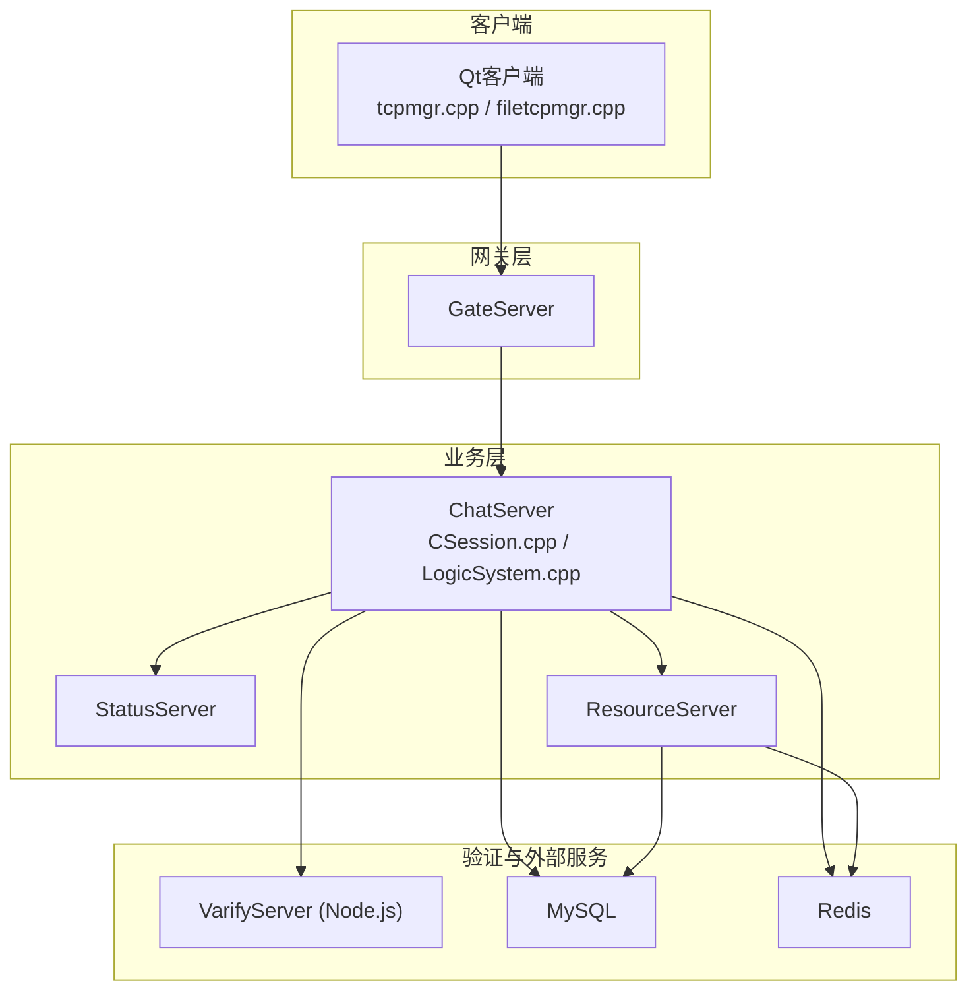
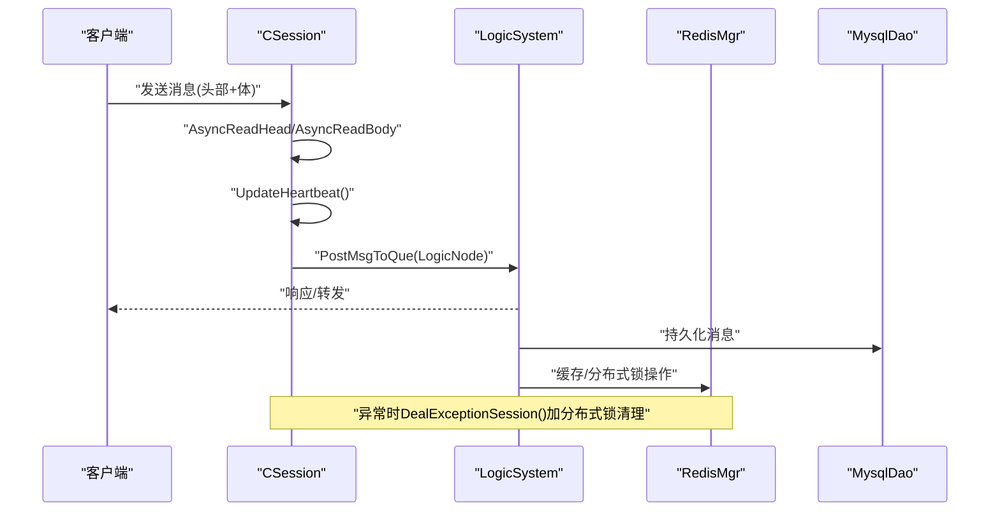
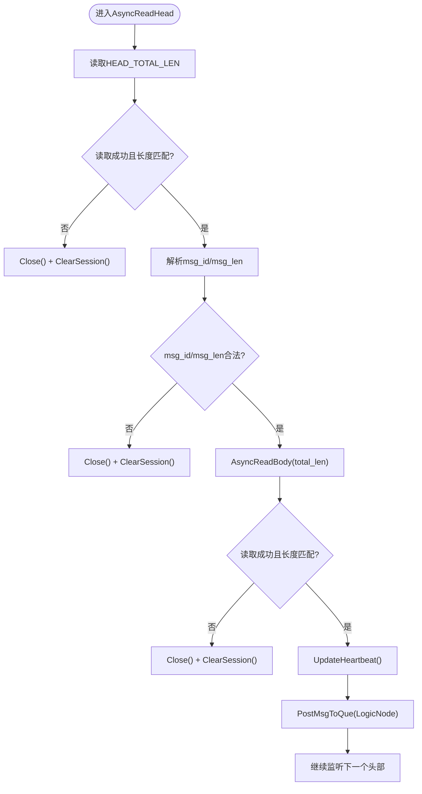
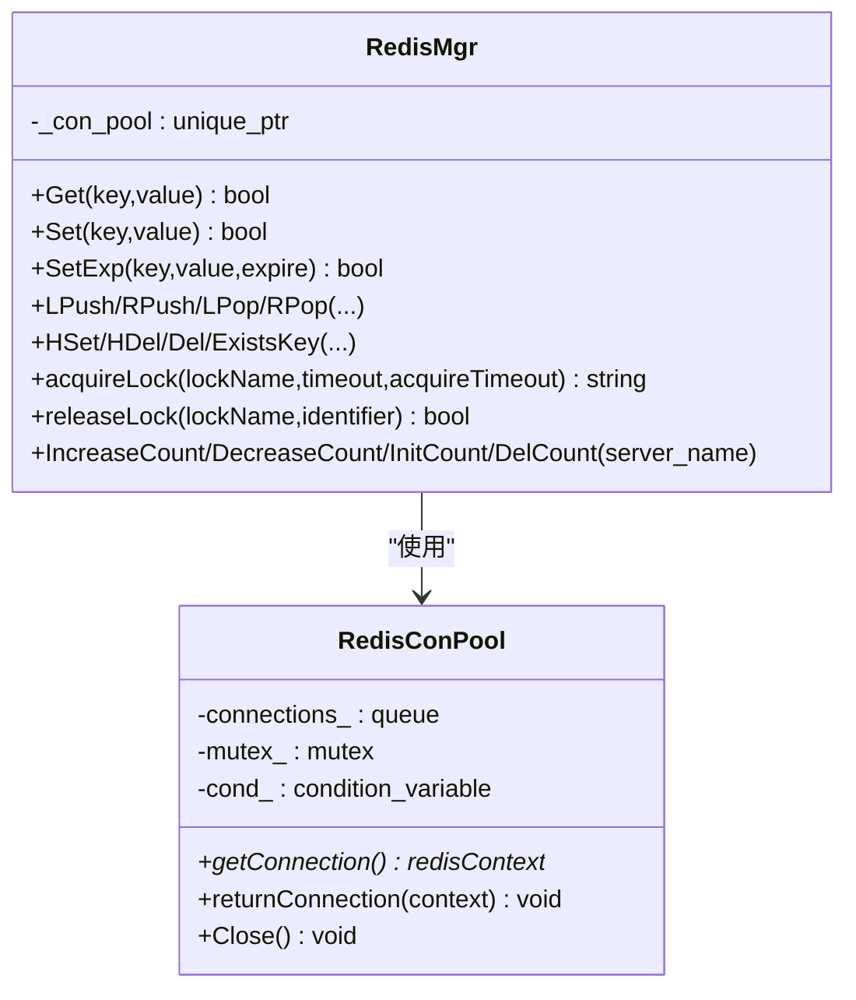
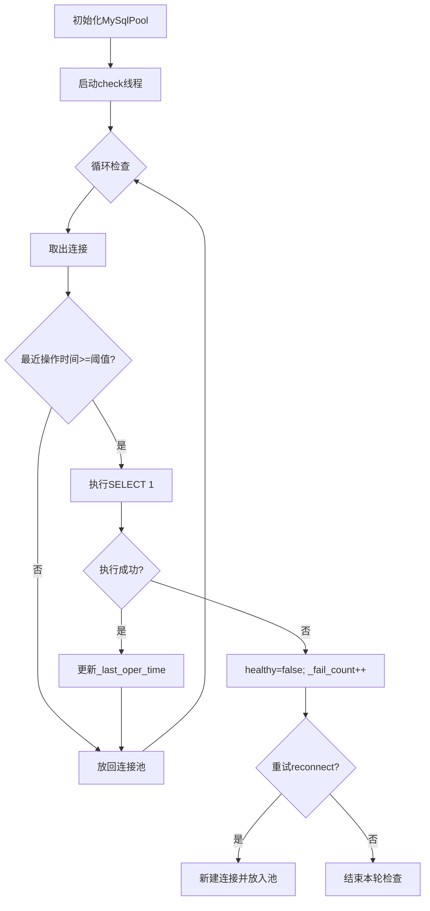
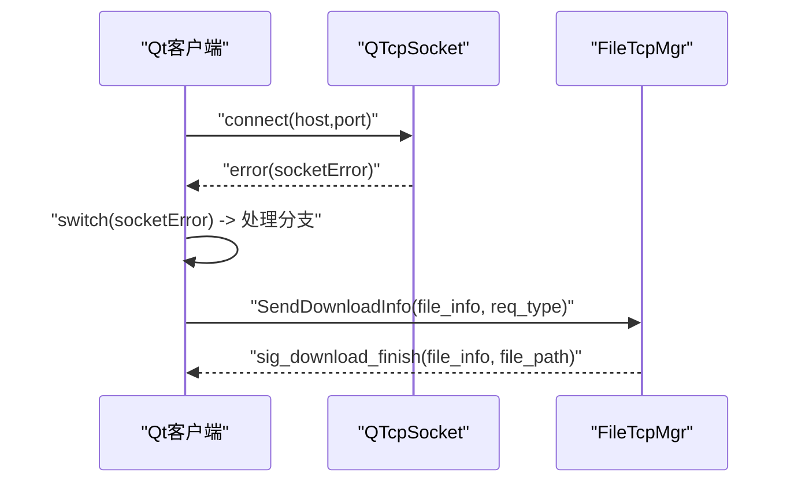
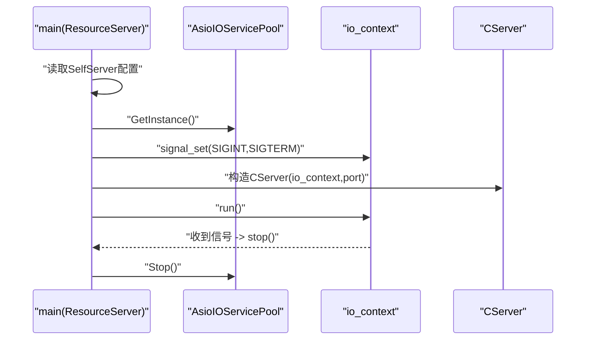
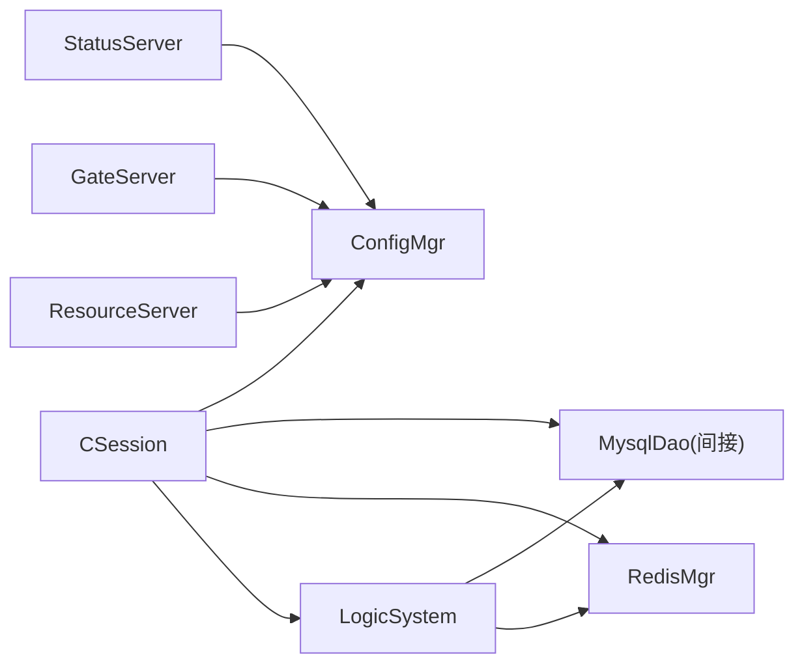
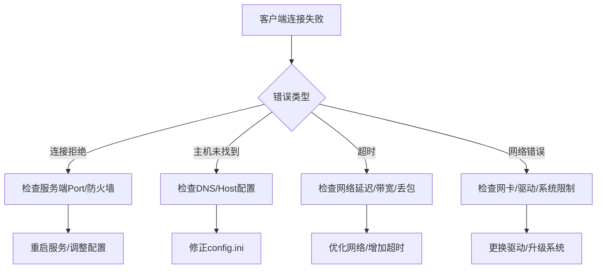

# 故障排查

<cite>
**本文引用的文件**   
- [CSession.h](file://server/ChatServer/include/CSession.h)
- [CSession.cpp](file://server/ChatServer/src/CSession.cpp)
- [const.h](file://server/ChatServer/include/const.h)
- [MysqlDao.h](file://server/ChatServer/include/MysqlDao.h)
- [RedisMgr.h](file://server/ChatServer/include/RedisMgr.h)
- [ConfigMgr.cpp](file://server/ChatServer/src/ConfigMgr.cpp)
- [chatserver1.ini](file://server/ChatServer/config/chatserver1.ini)
- [tcpmgr.cpp](file://client/llfcchat/src/tcpmgr.cpp)
- [filetcpmgr.cpp](file://client/llfcchat/src/filetcpmgr.cpp)
- [LogicSystem.cpp](file://server/ChatServer/src/LogicSystem.cpp)
- [ResourceServer.cpp](file://server/ResourceServer/src/ResourceServer.cpp)
- [day35心跳逻辑.md](file://开发文档/day35心跳逻辑.md)
- [day09-redis服务搭建.md](file://开发文档/day09-redis服务搭建.md)
- [day11-注册功能.md](file://开发文档/day11-注册功能.md)
- [day38-断点续传.md](file://开发文档/day38-断点续传.md)
- [utils.h](file://server/ChatServer/include/utils.h)
- [utils.cpp](file://server/ChatServer/src/utils.cpp)
</cite>

## 目录
1. [简介](#简介)
2. [项目结构](#项目结构)
3. [核心组件](#核心组件)
4. [架构总览](#架构总览)
5. [详细组件分析](#详细组件分析)
6. [依赖关系分析](#依赖关系分析)
7. [性能考量与调优](#性能考量与调优)
8. [故障排查指南](#故障排查指南)
9. [结论](#结论)
10. [附录：调试工具与恢复流程](#附录调试工具与恢复流程)

## 简介
本文件面向LLFCChat生产环境的故障排查，覆盖常见问题定位、错误日志分析、性能调优方法，以及分布式场景下的服务发现失败、数据不一致和竞态条件处理。重点包括网络连接问题、数据库连接异常、服务启动失败的排查步骤；内存泄漏检测、线程死锁分析与CPU占用过高的诊断方法；日志级别配置、性能指标收集与监控告警设置；并给出调试工具使用指南与应急恢复流程。

## 项目结构
LLFCChat采用多服务架构（ChatServer、GateServer、StatusServer、ResourceServer、VarifyServer），客户端基于Qt实现TCP/HTTP通信，服务端通过Boost.Asio进行高并发网络IO，并使用gRPC进行服务间调用。关键配置通过INI文件加载，MySQL与Redis分别用于持久化与缓存/分布式锁。

**图示来源** 
- [CSession.cpp](file://server/ChatServer/src/CSession.cpp)
- [LogicSystem.cpp](file://server/ChatServer/src/LogicSystem.cpp)
- [ResourceServer.cpp](file://server/ResourceServer/src/ResourceServer.cpp)
- [tcpmgr.cpp](file://client/llfcchat/src/tcpmgr.cpp)
- [filetcpmgr.cpp](file://client/llfcchat/src/filetcpmgr.cpp)

**章节来源**
- [CSession.h:1-86](file://server/ChatServer/include/CSession.h#L1-L86)
- [CSession.cpp:1-335](file://server/ChatServer/src/CSession.cpp#L1-L335)
- [chatserver1.ini:1-30](file://server/ChatServer/config/chatserver1.ini#L1-L30)

## 核心组件
- CSession：会话管理、异步读写、心跳更新、异常清理（含分布式锁保护）。
- RedisMgr：Redis连接池、健康检查、分布式锁接口。
- MysqlDao：MySQL连接池、健康检查与自动重连。
- ConfigMgr：INI配置读取（各服务独立配置文件）。
- LogicSystem：消息路由与业务处理（如心跳处理、通知等）。
- 客户端tcpmgr/filetcpmgr：TCP连接、错误处理、文件下载断点续传。

**章节来源**
- [CSession.cpp:87-128](file://server/ChatServer/src/CSession.cpp#L87-L128)
- [CSession.cpp:130-191](file://server/ChatServer/src/CSession.cpp#L130-L191)
- [CSession.cpp:301-333](file://server/ChatServer/src/CSession.cpp#L301-L333)
- [RedisMgr.h:281-304](file://server/ChatServer/include/RedisMgr.h#L281-L304)
- [MysqlDao.h:102-160](file://server/ChatServer/include/MysqlDao.h#L102-L160)
- [ConfigMgr.cpp:1-30](file://server/ChatServer/src/ConfigMgr.cpp#L1-L30)
- [LogicSystem.cpp:564-591](file://server/ChatServer/src/LogicSystem.cpp#L564-L591)
- [tcpmgr.cpp:63-91](file://client/llfcchat/src/tcpmgr.cpp#L63-L91)
- [filetcpmgr.cpp:399-433](file://client/llfcchat/src/filetcpmgr.cpp#L399-L433)

## 架构总览
下图展示一次聊天消息从客户端到服务器、再到存储与缓存的完整路径，以及心跳与异常清理的关键节点。

**图示来源** 
- [CSession.cpp:87-128](file://server/ChatServer/src/CSession.cpp#L87-L128)
- [CSession.cpp:130-191](file://server/ChatServer/src/CSession.cpp#L130-L191)
- [CSession.cpp:301-333](file://server/ChatServer/src/CSession.cpp#L301-L333)
- [LogicSystem.cpp:564-591](file://server/ChatServer/src/LogicSystem.cpp#L564-L591)
- [MysqlDao.h:102-160](file://server/ChatServer/include/MysqlDao.h#L102-L160)
- [RedisMgr.h:281-304](file://server/ChatServer/include/RedisMgr.h#L281-L304)

## 详细组件分析

### CSession会话与心跳
- 异步读头/体：解析协议头（ID、长度）、校验合法性、分配RecvNode、投递至LogicSystem。
- 心跳机制：每次接收消息后更新时间戳；定时任务判断是否过期（示例阈值20s，建议生产60s）；过期则关闭socket并触发异常清理。
- 异常清理：获取分布式锁，校验当前session_id一致性，清理Redis中的用户会话、IP映射与Token。

**图示来源** 
- [CSession.cpp:130-191](file://server/ChatServer/src/CSession.cpp#L130-L191)
- [CSession.cpp:87-128](file://server/ChatServer/src/CSession.cpp#L87-L128)
- [day35心跳逻辑.md:41-93](file://开发文档/day35心跳逻辑.md#L41-L93)

**章节来源**
- [CSession.cpp:130-191](file://server/ChatServer/src/CSession.cpp#L130-L191)
- [CSession.cpp:87-128](file://server/ChatServer/src/CSession.cpp#L87-L128)
- [CSession.cpp:285-299](file://server/ChatServer/src/CSession.cpp#L285-L299)
- [day35心跳逻辑.md:41-93](file://开发文档/day35心跳逻辑.md#L41-L93)

### Redis连接池与健康检查
- 连接池初始化：按配置创建多个redisContext，执行AUTH认证。
- 健康检查线程：周期性PING，失败则重建连接并重试认证；统计失败次数并尝试重连。
- 分布式锁：acquireLock/releaseLock用于跨进程/跨实例的原子操作（如踢人、清理会话）。

**图示来源** 
- [day09-redis服务搭建.md:673-808](file://开发文档/day09-redis服务搭建.md#L673-L808)
- [RedisMgr.h:281-304](file://server/ChatServer/include/RedisMgr.h#L281-L304)

**章节来源**
- [day09-redis服务搭建.md:673-808](file://开发文档/day09-redis服务搭建.md#L673-L808)
- [RedisMgr.h:281-304](file://server/ChatServer/include/RedisMgr.h#L281-L304)

### MySQL连接池与健康检查
- 连接池初始化：创建指定数量的sql::Connection，设置schema。
- 健康检查线程：定期执行SELECT 1探测连接存活，失败则标记并计数；后台线程根据失败次数尝试reconnect。
- 超时与替换：对长时间未操作的连接进行探测，异常时替换连接对象。

**图示来源** 
- [MysqlDao.h:102-160](file://server/ChatServer/include/MysqlDao.h#L102-L160)
- [day11-注册功能.md:402-469](file://开发文档/day11-注册功能.md#L402-L469)

**章节来源**
- [MysqlDao.h:102-160](file://server/ChatServer/include/MysqlDao.h#L102-L160)
- [day11-注册功能.md:402-469](file://开发文档/day11-注册功能.md#L402-L469)

### 客户端TCP与文件传输
- TCP错误处理：区分连接拒绝、远程关闭、主机未找到、超时、网络错误等，统一上报sig_con_success(false)。
- 文件下载：分片请求、进度显示、最后分片完成后回调通知界面刷新；支持暂停状态与断点续传。

**图示来源** 
- [tcpmgr.cpp:63-91](file://client/llfcchat/src/tcpmgr.cpp#L63-L91)
- [filetcpmgr.cpp:399-433](file://client/llfcchat/src/filetcpmgr.cpp#L399-L433)
- [filetcpmgr.cpp:769-805](file://client/llfcchat/src/filetcpmgr.cpp#L769-L805)

**章节来源**
- [tcpmgr.cpp:63-91](file://client/llfcchat/src/tcpmgr.cpp#L63-L91)
- [filetcpmgr.cpp:399-433](file://client/llfcchat/src/filetcpmgr.cpp#L399-L433)
- [filetcpmgr.cpp:769-805](file://client/llfcchat/src/filetcpmgr.cpp#L769-L805)

### 服务启动与信号处理
- 资源服务主函数：读取配置、创建AsioIOServicePool、绑定SIGINT/SIGTERM信号、启动io_context.run()，异常时停止pool并输出错误信息。

**图示来源** 
- [ResourceServer.cpp:15-41](file://server/ResourceServer/src/ResourceServer.cpp#L15-L41)

**章节来源**
- [ResourceServer.cpp:15-41](file://server/ResourceServer/src/ResourceServer.cpp#L15-L41)

## 依赖关系分析
- CSession依赖LogicSystem进行消息分发，依赖RedisMgr进行分布式锁与会话清理，依赖MysqlDao进行持久化（由LogicSystem间接调用）。
- 各服务通过ConfigMgr读取INI配置，包含端口、Host、数据库与Redis参数。
- 客户端依赖Qt网络库与服务端交互，文件传输模块依赖UserMgr与UI信号。

**图示来源** 
- [CSession.cpp:1-335](file://server/ChatServer/src/CSession.cpp#L1-L335)
- [LogicSystem.cpp:564-591](file://server/ChatServer/src/LogicSystem.cpp#L564-L591)
- [ConfigMgr.cpp:1-30](file://server/ChatServer/src/ConfigMgr.cpp#L1-L30)

**章节来源**
- [CSession.cpp:1-335](file://server/ChatServer/src/CSession.cpp#L1-L335)
- [LogicSystem.cpp:564-591](file://server/ChatServer/src/LogicSystem.cpp#L564-L591)
- [ConfigMgr.cpp:1-30](file://server/ChatServer/src/ConfigMgr.cpp#L1-L30)

## 性能考量与调优
- 发送队列限流：CSession维护_send_que，超过MAX_SENDQUE直接丢弃并记录日志，避免阻塞与内存膨胀。
- 心跳阈值：示例为20s，生产建议60s，平衡及时性与开销。
- 连接池大小：Redis/MySQL连接池需根据并发量与延迟目标调整，避免过多上下文切换或等待。
- 健康检查频率：MySQL每60秒进行一次批量检查，Redis周期性PING，降低无效查询。
- 日志级别：生产环境建议减少DEBUG级输出，仅保留ERROR/WARN及关键事件，降低I/O压力。

**章节来源**
- [CSession.cpp:43-75](file://server/ChatServer/src/CSession.cpp#L43-L75)
- [CSession.cpp:285-299](file://server/ChatServer/src/CSession.cpp#L285-L299)
- [MysqlDao.h:102-160](file://server/ChatServer/include/MysqlDao.h#L102-L160)
- [day09-redis服务搭建.md:673-808](file://开发文档/day09-redis服务搭建.md#L673-L808)

## 故障排查指南

### 网络连接问题
- 客户端错误分类：连接拒绝、远程关闭、主机未找到、超时、网络错误。定位顺序：DNS解析→端口可达性→防火墙策略→服务端监听状态。
- 服务端异常清理：当read/write失败时，CSession会Close并调用DealExceptionSession，确保分布式锁下清理Redis会话与Token。
- 中间设备回收：启用心跳包维持NAT/负载均衡会话，避免静默断开。

**图示来源** 
- [tcpmgr.cpp:63-91](file://client/llfcchat/src/tcpmgr.cpp#L63-L91)
- [CSession.cpp:301-333](file://server/ChatServer/src/CSession.cpp#L301-L333)
- [day35心跳逻辑.md:28-41](file://开发文档/day35心跳逻辑.md#L28-L41)

**章节来源**
- [tcpmgr.cpp:63-91](file://client/llfcchat/src/tcpmgr.cpp#L63-L91)
- [CSession.cpp:301-333](file://server/ChatServer/src/CSession.cpp#L301-L333)
- [day35心跳逻辑.md:28-41](file://开发文档/day35心跳逻辑.md#L28-L41)

### 数据库连接异常
- 现象：SELECT 1失败、连接被回收、认证失败。
- 排查：检查MysqlDao健康检查线程日志、失败计数与重连结果；确认用户名/密码/schema正确；观察连接池大小与活跃连接数。
- 恢复：自动重连失败时，手动重启服务或重置连接池；必要时扩容数据库连接上限。

**章节来源**
- [MysqlDao.h:102-160](file://server/ChatServer/include/MysqlDao.h#L102-L160)
- [day11-注册功能.md:402-469](file://开发文档/day11-注册功能.md#L402-L469)

### 服务启动失败
- 现象：main中捕获异常并输出错误信息；信号处理未生效导致无法优雅退出。
- 排查：检查INI配置（端口冲突、Host不可达）；确认依赖服务（Redis/MySQL/gRPC）可用；查看日志输出位置与权限。
- 恢复：修正配置、释放端口、重启依赖服务；确保信号处理器已注册。

**章节来源**
- [ResourceServer.cpp:15-41](file://server/ResourceServer/src/ResourceServer.cpp#L15-L41)
- [chatserver1.ini:1-30](file://server/ChatServer/config/chatserver1.ini#L1-L30)

### 内存泄漏检测
- 工具：Windows下使用Visual Studio诊断工具或Valgrind（Linux）；关注CSession析构日志与堆栈。
- 常见点：未释放的redisReply、未关闭的文件句柄、未释放的shared_ptr循环引用。
- 修复：确保freeReplyObject调用、文件close、智能指针生命周期管理。

**章节来源**
- [day09-redis服务搭建.md:673-808](file://开发文档/day09-redis服务搭建.md#L673-L808)
- [CSession.cpp:17-19](file://server/ChatServer/src/CSession.cpp#L17-L19)

### 线程死锁分析
- 风险点：先加线程锁再加分布式锁，与反向顺序可能形成交叉锁。
- 解决：使用std::scoped_lock一次性加多把锁，保证加锁顺序一致；将异常处理移出临界区。
- 实践：心跳定时器内收集过期session后再单独处理，避免在持有_mutex时调用分布式锁。

**章节来源**
- [day35心跳逻辑.md:95-172](file://开发文档/day35心跳逻辑.md#L95-L172)
- [day35心跳逻辑.md:644-688](file://开发文档/day35心跳逻辑.md#L644-L688)

### CPU占用过高
- 原因：频繁日志打印、无界队列堆积、忙轮询、锁竞争严重。
- 优化：降低日志级别、限制队列长度、引入背压、减少锁粒度。
- 监控：使用perf/htop/VS性能分析器定位热点函数。

**章节来源**
- [CSession.cpp:43-75](file://server/ChatServer/src/CSession.cpp#L43-L75)

### 分布式服务发现失败
- 现象：PeerServer列表不可用、gRPC连接失败。
- 排查：检查ConfigMgr读取的PeerServer配置、gRPC端口连通性、防火墙规则。
- 恢复：修正配置、重启服务、检查DNS与路由。

**章节来源**
- [chatserver1.ini:24-30](file://server/ChatServer/config/chatserver1.ini#L24-L30)

### 数据不一致与竞态条件
- 场景：异地登录踢人、文件上传状态同步。
- 方案：使用Redis分布式锁保证原子性；校验session_id一致性；使用版本号或时间戳避免脏写。
- 验证：通过日志与Redis键值核对一致性。

**章节来源**
- [CSession.cpp:301-333](file://server/ChatServer/src/CSession.cpp#L301-L333)
- [day38-断点续传.md:1924-2041](file://开发文档/day38-断点续传.md#L1924-L2041)

### 日志级别配置与监控告警
- 日志：将cout替换为结构化日志框架（如spdlog），按ERROR/WARN/INFO分级；生产关闭DEBUG。
- 指标：暴露QPS、延迟、连接池大小、错误率；采集到Prometheus/Grafana。
- 告警：设置阈值（如错误率>1%、延迟>500ms）触发通知。

[本节为通用指导，不直接分析具体文件]

## 结论
LLFCChat通过CSession、RedisMgr、MysqlDao等核心组件实现了高并发聊天服务。故障排查需围绕网络、数据库、配置、分布式锁与心跳机制展开。生产环境应强化日志分级、性能监控与自动化恢复能力，确保快速定位与最小影响。

[本节为总结，不直接分析具体文件]

## 附录：调试工具与恢复流程
- 调试工具：
  - Windows：Visual Studio诊断、WinDbg、Process Explorer。
  - Linux：gdb、valgrind、perf、strace。
- 恢复流程：
  - 服务重启：优雅停止（信号处理）→ 清理连接池 → 重启。
  - 数据修复：回滚事务、清理Redis脏数据、重建索引。
  - 回滚版本：切换分支/镜像，灰度发布。

**章节来源**
- [ResourceServer.cpp:15-41](file://server/ResourceServer/src/ResourceServer.cpp#L15-L41)
- [day11-注册功能.md:402-469](file://开发文档/day11-注册功能.md#L402-L469)
- [utils.cpp:1-15](file://server/ChatServer/src/utils.cpp#L1-L15)