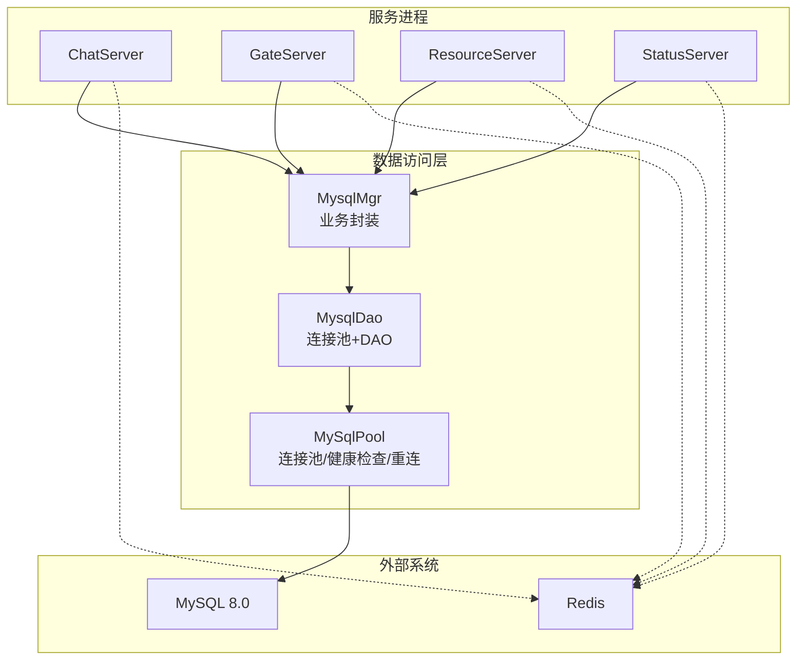
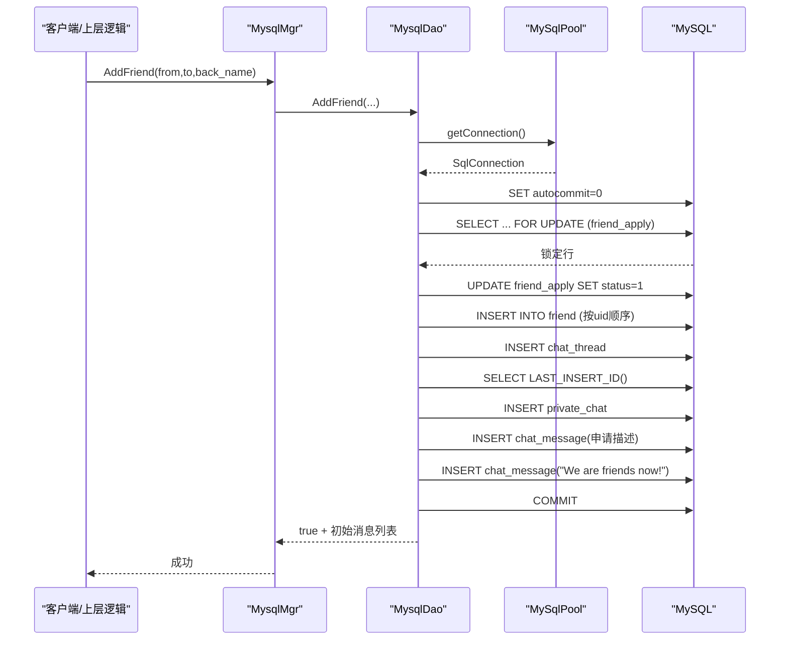
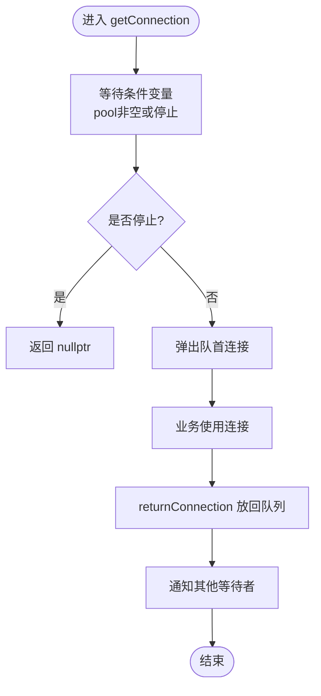
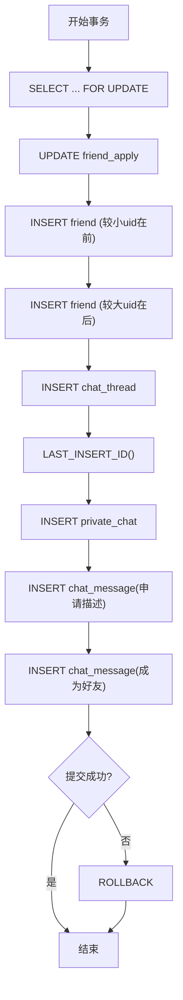
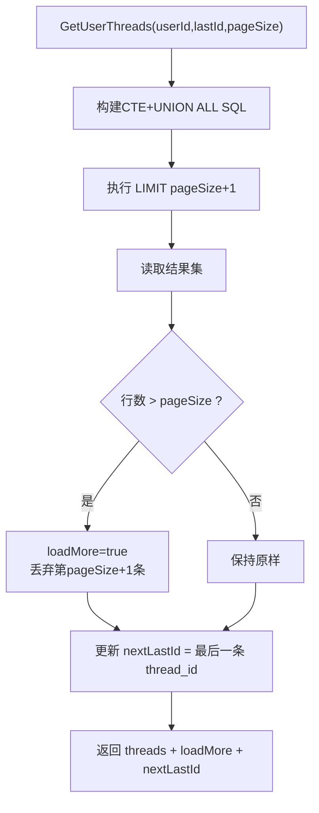
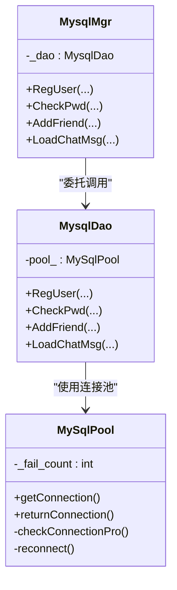

# 数据库问题

<cite>
**本文引用的文件**   
- [MysqlMgr.h](file://server/ChatServer/include/MysqlMgr.h)
- [MysqlDao.h](file://server/ChatServer/include/MysqlDao.h)
- [MysqlMgr.cpp](file://server/ChatServer/src/MysqlMgr.cpp)
- [MysqlDao.cpp](file://server/ChatServer/src/MysqlDao.cpp)
- [chatserver1.ini](file://server/ChatServer/config/chatserver1.ini)
- [llfc.sql](file://sql备份/llfc.sql)
</cite>

## 目录
1. [简介](#简介)
2. [项目结构](#项目结构)
3. [核心组件](#核心组件)
4. [架构总览](#架构总览)
5. [详细组件分析](#详细组件分析)
6. [依赖关系分析](#依赖关系分析)
7. [性能与优化](#性能与优化)
8. [故障排查指南](#故障排查指南)
9. [监控与日志分析](#监控与日志分析)
10. [迁移与备份恢复](#迁移与备份恢复)
11. [生产应急处理流程](#生产应急处理流程)
12. [结论](#结论)

## 简介
本文件面向LLFCChat项目的数据库问题，提供从连接失败、查询性能、事务一致性到监控日志、迁移备份以及生产应急的全链路排障指南。内容基于代码库中的MySQL连接池、DAO层实现、SQL脚本与配置文件进行系统化梳理，帮助快速定位并解决常见问题。

## 项目结构
本项目在服务器端（ChatServer/GateServer/ResourceServer/StatusServer）均包含MySQL访问模块，其中ChatServer的MysqlMgr与MysqlDao是数据库访问的核心。连接池、健康检查、重连逻辑集中在MysqlDao中；业务方法通过MysqlMgr统一暴露。

**图表来源** 
- [MysqlMgr.h:1-41](file://server/ChatServer/include/MysqlMgr.h#L1-L41)
- [MysqlDao.h:18-232](file://server/ChatServer/include/MysqlDao.h#L18-L232)
- [MysqlDao.cpp:1-13](file://server/ChatServer/src/MysqlDao.cpp#L1-L13)

**章节来源**
- [MysqlMgr.h:1-41](file://server/ChatServer/include/MysqlMgr.h#L1-L41)
- [MysqlDao.h:18-232](file://server/ChatServer/include/MysqlDao.h#L18-L232)
- [MysqlDao.cpp:1-13](file://server/ChatServer/src/MysqlDao.cpp#L1-L13)

## 核心组件
- MysqlMgr：对外暴露注册、登录、好友申请、聊天消息等数据库操作接口，内部委托给MysqlDao。
- MysqlDao：封装所有SQL执行逻辑，使用自定义连接池MySqlPool管理连接、健康检查与自动重连。
- MySqlPool：线程安全的连接池，支持条件变量等待、空闲连接存活检测、失败计数与重建连接。

关键职责划分：
- 配置读取：MysqlDao构造时从ConfigMgr读取Host/Port/User/Passwd/Schema，初始化连接池大小。
- 连接获取与归还：getConnection()/returnConnection()配合Defer确保异常路径也归还连接。
- 健康检查：后台线程定期“SELECT 1”探测连接可用性，失败则重建连接并补充池容量。
- 事务与锁：在好友申请等业务中使用FOR UPDATE、固定插入顺序避免死锁。

**章节来源**
- [MysqlMgr.h:1-41](file://server/ChatServer/include/MysqlMgr.h#L1-L41)
- [MysqlMgr.cpp:1-95](file://server/ChatServer/src/MysqlMgr.cpp#L1-L95)
- [MysqlDao.h:18-232](file://server/ChatServer/include/MysqlDao.h#L18-L232)
- [MysqlDao.cpp:1-17](file://server/ChatServer/src/MysqlDao.cpp#L1-L17)

## 架构总览
下图展示一次“添加好友”的完整调用链，包括数据库事务、行级锁与消息写入。

**图表来源** 
- [MysqlDao.cpp:247-504](file://server/ChatServer/src/MysqlDao.cpp#L247-L504)

**章节来源**
- [MysqlDao.cpp:247-504](file://server/ChatServer/src/MysqlDao.cpp#L247-L504)

## 详细组件分析

### 连接池与健康检查
- 连接池初始化：启动时创建N个连接，设置schema，记录最后使用时间戳。
- 健康检查：后台线程每60秒扫描，对超过阈值未使用的连接执行“SELECT 1”，失败则标记不健康并尝试重建。
- 重连机制：维护_fail_count，当检测到失败时循环重建连接直到达到目标池大小。
- 获取连接：使用条件变量阻塞等待可用连接，避免忙等。

**图表来源** 
- [MysqlDao.h:184-206](file://server/ChatServer/include/MysqlDao.h#L184-L206)

**章节来源**
- [MysqlDao.h:25-232](file://server/ChatServer/include/MysqlDao.h#L25-L232)
- [MysqlDao.cpp:1-17](file://server/ChatServer/src/MysqlDao.cpp#L1-L17)

### 事务与死锁防护
- 事务边界：AddFriend内显式setAutoCommit(false)，并在异常路径rollback。
- 行级锁：使用FOR UPDATE锁定friend_apply相关行，保证并发安全。
- 死锁规避：friend表插入按uid大小顺序，避免双向插入导致的锁环。
- 错误码识别：捕获MySQL错误码1213（死锁），提示重试策略。

**图表来源** 
- [MysqlDao.cpp:247-504](file://server/ChatServer/src/MysqlDao.cpp#L247-L504)

**章节来源**
- [MysqlDao.cpp:247-504](file://server/ChatServer/src/MysqlDao.cpp#L247-L504)

### 分页与游标加载
- 会话列表：CTE+UNION ALL+LIMIT N+1判断是否还有更多数据，返回nextLastId作为游标。
- 消息加载：按thread_id和message_id分页，多取一条用于loadMore标志。

**图表来源** 
- [MysqlDao.cpp:681-770](file://server/ChatServer/src/MysqlDao.cpp#L681-L770)

**章节来源**
- [MysqlDao.cpp:681-770](file://server/ChatServer/src/MysqlDao.cpp#L681-L770)

### 配置与连接参数
- 连接信息来源于配置文件[Mysql]段：Host、Port、User、Passwd、Schema。
- 连接池大小默认5（可在构造处调整）。

**章节来源**
- [chatserver1.ini:14-19](file://server/ChatServer/config/chatserver1.ini#L14-L19)
- [MysqlDao.cpp:1-13](file://server/ChatServer/src/MysqlDao.cpp#L1-L13)

## 依赖关系分析
- MysqlMgr依赖MysqlDao，MysqlDao依赖MySqlPool。
- 配置由ConfigMgr注入，SQL脚本定义表结构与存储过程。
- 错误处理依赖MySQL错误码（如1213死锁、1062唯一键冲突）。

**图表来源** 
- [MysqlMgr.h:1-41](file://server/ChatServer/include/MysqlMgr.h#L1-L41)
- [MysqlDao.h:236-267](file://server/ChatServer/include/MysqlDao.h#L236-L267)
- [MysqlDao.h:25-232](file://server/ChatServer/include/MysqlDao.h#L25-L232)

**章节来源**
- [MysqlMgr.h:1-41](file://server/ChatServer/include/MysqlMgr.h#L1-L41)
- [MysqlDao.h:236-267](file://server/ChatServer/include/MysqlDao.h#L236-L267)

## 性能与优化
- 索引建议
  - chat_message：已存在idx_thread_created、idx_thread_message，适合按thread_id与时间/ID分页。
  - user：name/email有索引，适合登录校验与邮箱查重。
  - private_chat：uniq_private_thread(user1_id,user2_id)避免重复会话。
- 查询优化
  - 使用prepareStatement绑定参数，避免拼接SQL。
  - 分页采用LIMIT N+1判断是否有下一页，减少额外COUNT。
  - 会话列表使用CTE合并private/group，减少多次往返。
- 连接池调优
  - 根据并发量调整poolSize，避免连接耗尽。
  - 健康检查间隔与超时阈值需结合网络延迟与MySQL负载调整。

**章节来源**
- [llfc.sql:24-37](file://sql备份/llfc.sql#L24-L37)
- [llfc.sql:467-481](file://sql备份/llfc.sql#L467-L481)
- [llfc.sql:408-418](file://sql备份/llfc.sql#L408-L418)
- [MysqlDao.cpp:871-936](file://server/ChatServer/src/MysqlDao.cpp#L871-L936)
- [MysqlDao.cpp:681-770](file://server/ChatServer/src/MysqlDao.cpp#L681-L770)

## 故障排查指南

### 连接失败常见原因
- 网络不通：Host/Port错误或防火墙拦截。
- 权限不足：User/Passwd不正确或无Schema访问权限。
- 连接池耗尽：并发过高导致getConnection阻塞或超时。
- 连接失效：长时间空闲后连接被服务端回收，健康检查未生效。

排查步骤：
- 核对配置文件[Mysql]段是否正确。
- 本地直连MySQL验证连通性与权限。
- 观察日志中“mysql connection init success/fail”“Error keeping connection alive”“Reconnect failed”。
- 监控连接池大小与活跃数，必要时扩容poolSize。

**章节来源**
- [chatserver1.ini:14-19](file://server/ChatServer/config/chatserver1.ini#L14-L19)
- [MysqlDao.h:25-60](file://server/ChatServer/include/MysqlDao.h#L25-L60)
- [MysqlDao.cpp:1-17](file://server/ChatServer/src/MysqlDao.cpp#L1-L17)

### 查询性能问题诊断
- 慢查询分析：开启MySQL慢查询日志，定位耗时SQL。
- 索引命中：使用EXPLAIN查看执行计划，确认是否走索引。
- 锁等待：检查SHOW ENGINE INNODB STATUS，关注行锁/表锁。
- 分页优化：避免大偏移量，使用游标分页。

**章节来源**
- [MysqlDao.cpp:871-936](file://server/ChatServer/src/MysqlDao.cpp#L871-L936)
- [MysqlDao.cpp:681-770](file://server/ChatServer/src/MysqlDao.cpp#L681-L770)

### 事务问题与一致性
- 死锁检测：错误码1213，建议重试或调整锁顺序。
- 事务超时：长事务导致锁竞争，缩短事务范围。
- 数据一致性：确保FOR UPDATE与固定插入顺序，避免脏读/幻读。

**章节来源**
- [MysqlDao.cpp:247-504](file://server/ChatServer/src/MysqlDao.cpp#L247-L504)

## 监控与日志分析
- 连接状态监控
  - 观察连接池大小、空闲连接数、失败计数_fail_count。
  - 定期检查“SELECT 1”成功率。
- 查询性能分析
  - 采集慢查询日志，分析TOP SQL。
  - 监控InnoDB锁等待与事务时长。
- 错误日志解读
  - SQLException输出包含error code与SQLState，便于分类处理。
  - 关注“mysql pool init failed”“Reconnect failed”等关键字。

**章节来源**
- [MysqlDao.h:25-232](file://server/ChatServer/include/MysqlDao.h#L25-L232)
- [MysqlDao.cpp:1-17](file://server/ChatServer/src/MysqlDao.cpp#L1-L17)

## 迁移与备份恢复
- 备份
  - 使用mysqldump导出llfc库，包含表结构与存储过程。
- 恢复
  - 在新环境导入llfc.sql，确保字符集与引擎一致。
- 迁移注意事项
  - 校验索引与约束，避免数据不一致。
  - 迁移后验证存储过程reg_user行为。

**章节来源**
- [llfc.sql:1-15](file://sql备份/llfc.sql#L1-L15)
- [llfc.sql:660-753](file://sql备份/llfc.sql#L660-L753)

## 生产应急处理流程
- 快速止血
  - 临时扩容连接池或限流降级。
  - 隔离异常节点，避免雪崩。
- 根因定位
  - 收集MySQL慢查询、锁等待、错误日志。
  - 检查配置变更与最近部署。
- 恢复验证
  - 回放关键路径（注册、登录、发消息）。
  - 监控连接池与QPS恢复正常。

[本节为通用流程说明，不直接引用具体文件]

## 结论
通过对连接池、DAO层、事务与索引的系统化分析，可高效定位LLFCChat数据库问题的根因。建议在生产环境中完善监控告警、规范事务边界、优化索引与分页策略，并结合备份恢复演练提升稳定性与可恢复性。