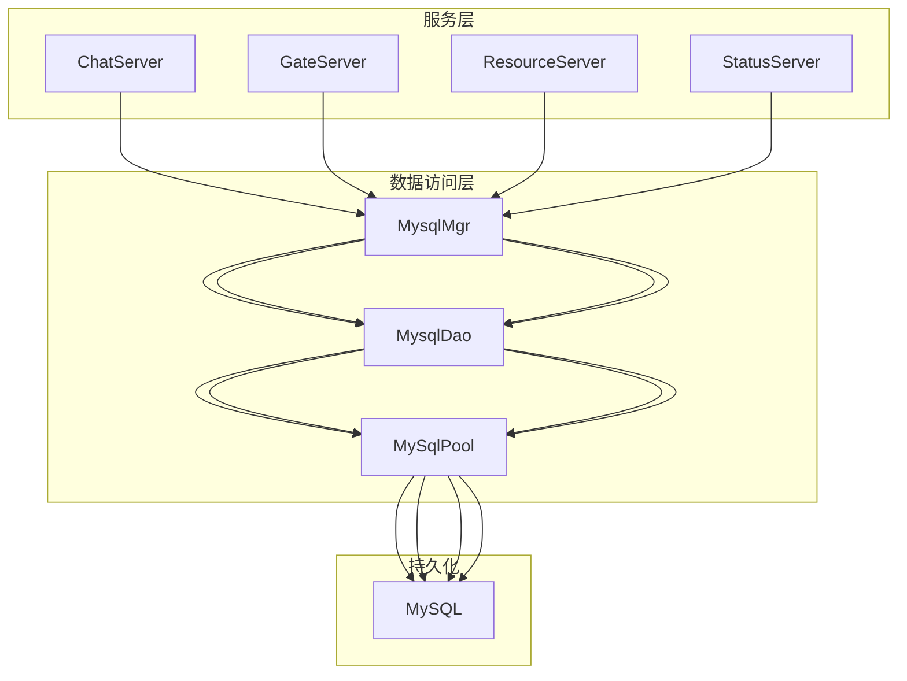
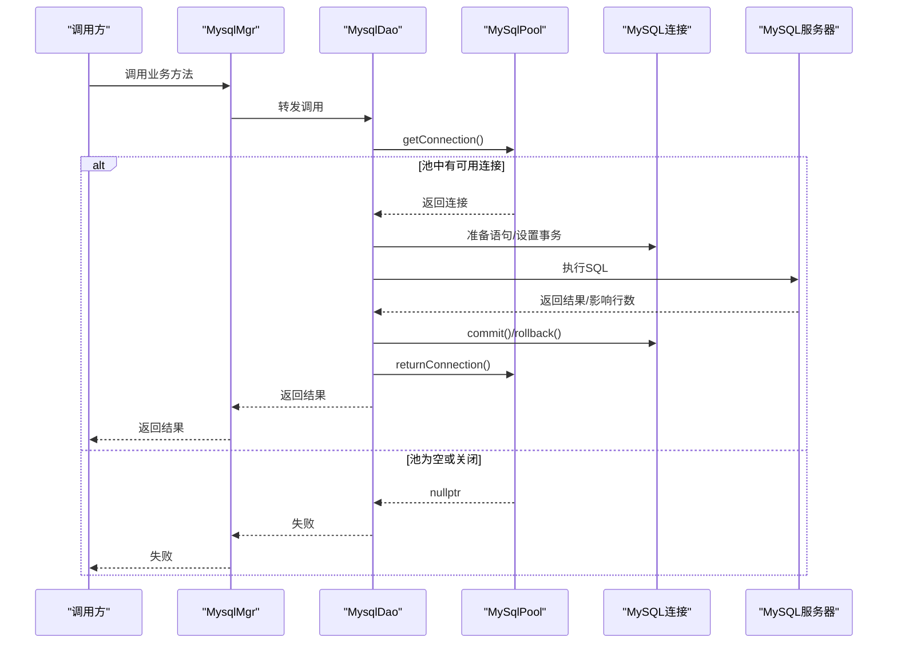
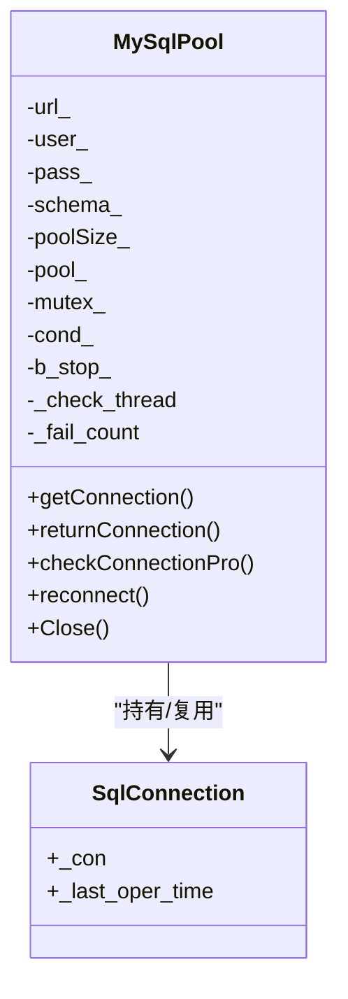
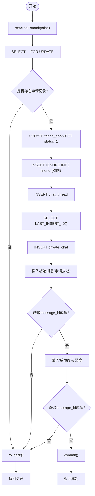

# 数据库问题排查

<cite>
**本文引用的文件**   
- [MysqlDao.h](file://server/ChatServer/include/MysqlDao.h)
- [MysqlMgr.h](file://server/ChatServer/include/MysqlMgr.h)
- [MysqlDao.cpp](file://server/ChatServer/src/MysqlDao.cpp)
- [MysqlMgr.cpp](file://server/ChatServer/src/MysqlMgr.cpp)
- [chatserver1.ini](file://server/ChatServer/config/chatserver1.ini)
- [config.ini](file://server/GateServer/config/config.ini)
- [llfc.sql](file://sql备份/llfc.sql)
</cite>

## 目录
1. [简介](#简介)
2. [项目结构](#项目结构)
3. [核心组件](#核心组件)
4. [架构总览](#架构总览)
5. [详细组件分析](#详细组件分析)
6. [依赖关系分析](#依赖关系分析)
7. [性能与优化](#性能与优化)
8. [故障排查指南](#故障排查指南)
9. [监控与运维](#监控与运维)
10. [结论](#结论)

## 简介
本文件面向LLFCChat项目的数据库问题排查，聚焦MySQL连接池耗尽、查询缓慢、死锁、数据不一致等典型问题。文档基于代码仓库中的MysqlDao与MysqlMgr实现，结合SQL脚本与配置文件，给出诊断方法、优化建议与运维实践，帮助团队快速定位并解决数据库相关问题。

## 项目结构
本项目包含多个服务（ChatServer、GateServer、ResourceServer、StatusServer），每个服务均包含MysqlDao与MysqlMgr模块，用于访问MySQL。数据库结构与存储过程定义在SQL备份文件中；各服务的MySQL连接参数通过INI配置加载。

图表来源
- [MysqlMgr.h](file://server/ChatServer/include/MysqlMgr.h)
- [MysqlDao.h](file://server/ChatServer/include/MysqlDao.h)
- [MysqlDao.cpp](file://server/ChatServer/src/MysqlDao.cpp)

章节来源
- [MysqlMgr.h](file://server/ChatServer/include/MysqlMgr.h)
- [MysqlDao.h](file://server/ChatServer/include/MysqlDao.h)
- [MysqlDao.cpp](file://server/ChatServer/src/MysqlDao.cpp)
- [chatserver1.ini](file://server/ChatServer/config/chatserver1.ini)
- [config.ini](file://server/GateServer/config/config.ini)
- [llfc.sql](file://sql备份/llfc.sql)

## 核心组件
- MysqlMgr：单例管理器，对外暴露业务接口，内部委托给MysqlDao执行。
- MysqlDao：封装具体SQL操作，使用MySqlPool管理连接，处理事务、异常与结果映射。
- MySqlPool：自定义连接池，提供连接获取/归还、健康检查、自动重连、线程安全控制。

章节来源
- [MysqlMgr.h](file://server/ChatServer/include/MysqlMgr.h)
- [MysqlMgr.cpp](file://server/ChatServer/src/MysqlMgr.cpp)
- [MysqlDao.h](file://server/ChatServer/include/MysqlDao.h)
- [MysqlDao.cpp](file://server/ChatServer/src/MysqlDao.cpp)

## 架构总览
下图展示从业务调用到数据库的完整链路，包括连接池、事务与错误处理的关键节点。

图表来源
- [MysqlMgr.cpp](file://server/ChatServer/src/MysqlMgr.cpp)
- [MysqlDao.cpp](file://server/ChatServer/src/MysqlDao.cpp)
- [MysqlDao.h](file://server/ChatServer/include/MysqlDao.h)

## 详细组件分析

### 连接池与连接生命周期（MySqlPool）
- 初始化：按配置创建固定数量的连接，记录最后操作时间戳。
- 获取/归还：互斥保护+条件变量等待，避免忙等；支持优雅关闭。
- 健康检查：后台线程周期性检测连接存活，必要时重建连接；失败计数驱动重连。
- 线程安全：mutex与condition_variable保证并发安全。

图表来源
- [MysqlDao.h](file://server/ChatServer/include/MysqlDao.h)

章节来源
- [MysqlDao.h](file://server/ChatServer/include/MysqlDao.h)
- [MysqlDao.cpp](file://server/ChatServer/src/MysqlDao.cpp)

### 事务与一致性（MysqlDao关键路径）
- 好友申请与加好友流程：显式开启事务，先FOR UPDATE锁定申请记录，再更新状态、插入双向好友关系、创建会话与消息，最后提交；任一失败回滚。
- 私聊会话创建：先查后插，唯一键冲突时重试读取已存在ID，确保幂等。
- 批量消息写入：手动事务，逐条插入并取LAST_INSERT_ID，提交或回滚。

图表来源
- [MysqlDao.cpp](file://server/ChatServer/src/MysqlDao.cpp)

章节来源
- [MysqlDao.cpp](file://server/ChatServer/src/MysqlDao.cpp)

### 分页与查询设计
- 聊天线程列表：CTE + UNION ALL + ORDER BY + LIMIT N+1，判断是否还有下一页，并返回nextLastId游标。
- 聊天消息分页：按thread_id与message_id范围查询，多取一条判断loadMore，返回next_cursor。

章节来源
- [MysqlDao.cpp](file://server/ChatServer/src/MysqlDao.cpp)

### 管理器与DAO职责分离
- MysqlMgr仅做接口转发，保持单一职责，便于测试与扩展。
- MysqlDao专注SQL实现、事务与异常处理。

章节来源
- [MysqlMgr.h](file://server/ChatServer/include/MysqlMgr.h)
- [MysqlMgr.cpp](file://server/ChatServer/src/MysqlMgr.cpp)
- [MysqlDao.h](file://server/ChatServer/include/MysqlDao.h)

## 依赖关系分析
- 配置依赖：各服务通过INI文件加载MySQL连接信息（Host、Port、User、Passwd、Schema）。
- 运行时依赖：MysqlMgr依赖MysqlDao，MysqlDao依赖MySqlPool，最终依赖MySQL Connector C++与MySQL服务器。

图表来源
- [chatserver1.ini](file://server/ChatServer/config/chatserver1.ini)
- [config.ini](file://server/GateServer/config/config.ini)
- [MysqlMgr.h](file://server/ChatServer/include/MysqlMgr.h)
- [MysqlDao.h](file://server/ChatServer/include/MysqlDao.h)

章节来源
- [chatserver1.ini](file://server/ChatServer/config/chatserver1.ini)
- [config.ini](file://server/GateServer/config/config.ini)
- [MysqlMgr.h](file://server/ChatServer/include/MysqlMgr.h)
- [MysqlDao.h](file://server/ChatServer/include/MysqlDao.h)

## 性能与优化

### 索引设计与查询优化
- chat_message表
  - 主键：message_id
  - 复合索引：idx_thread_created(thread_id, created_at)、idx_thread_message(thread_id, message_id)
  - 建议：优先使用按thread_id与message_id的分页查询，避免全表扫描；若存在按created_at排序的场景，可评估覆盖索引。
- user表
  - 主键：id
  - 唯一索引：uid、email
  - 普通索引：name
  - 建议：登录校验尽量使用uid或email精确匹配；name模糊查询需避免前缀通配符。
- friend表
  - 唯一索引：self_friend(self_id, friend_id)
  - 建议：好友列表查询应基于self_id精确过滤。
- private_chat表
  - 主键：thread_id
  - 唯一索引：uniq_private_thread(user1_id, user2_id)
  - 辅助索引：idx_private_user1_thread、idx_private_user2_thread
  - 建议：会话创建与查询均命中唯一索引，避免重复创建。
- group_chat_member表
  - 主键：(thread_id, user_id)
  - 辅助索引：idx_user_threads(user_id)
  - 建议：按用户维度拉取群聊会话时使用该索引。

章节来源
- [llfc.sql](file://sql备份/llfc.sql)

### SQL与事务优化要点
- 使用PreparedStatement绑定参数，避免拼接注入与类型转换开销。
- 批量写入采用单事务内多次executeUpdate，减少网络往返与提交开销。
- 对热点行加锁场景（如好友申请）使用FOR UPDATE，并确保一致的加锁顺序以避免死锁。
- 分页查询LIMIT N+1判断是否有下一页，避免额外COUNT。

章节来源
- [MysqlDao.cpp](file://server/ChatServer/src/MysqlDao.cpp)

### 连接池调优
- 池大小：默认5个连接，在高并发下可能不足，需根据QPS与平均响应时间评估扩容。
- 健康检查周期：后台线程每1秒循环，超过阈值进行存活探测与重连。
- 超时与重试：建议在获取连接处增加超时与退避重试策略，避免雪崩。

章节来源
- [MysqlDao.h](file://server/ChatServer/include/MysqlDao.h)
- [MysqlDao.cpp](file://server/ChatServer/src/MysqlDao.cpp)

## 故障排查指南

### 连接池耗尽
症状
- 应用端长时间阻塞在getConnection，日志出现“等待连接”或超时。
- 数据库连接数接近上限，出现Too many connections。

排查步骤
- 检查连接池大小与当前活跃连接数，确认是否存在连接泄漏（未returnConnection）。
- 观察健康检查线程是否正常工作，失败计数是否持续上升。
- 查看慢查询与长事务，确认是否存在未释放的事务占用连接。

解决方案
- 适当增大连接池大小，并结合压测确定合理值。
- 为所有SQL路径添加统一的资源释放保障（如RAII/Defer模式），确保异常分支也能归还连接。
- 增加连接获取超时与熔断降级，避免级联故障。

章节来源
- [MysqlDao.h](file://server/ChatServer/include/MysqlDao.h)
- [MysqlDao.cpp](file://server/ChatServer/src/MysqlDao.cpp)

### 查询性能缓慢
症状
- 特定接口响应时间飙升，CPU/IO升高。
- 慢查询日志中出现大量全表扫描或临时表/文件排序。

排查步骤
- 使用EXPLAIN分析关键SQL的执行计划，关注type、key、rows、Extra。
- 检查索引是否命中，是否存在函数导致索引失效。
- 评估JOIN与子查询复杂度，考虑拆分或引入缓存。

解决方案
- 优化SQL：限定必要字段、合理使用WHERE与ORDER BY、避免SELECT *。
- 调整索引：根据实际查询模式补充复合索引，注意选择性。
- 分页优化：使用基于主键或有序列的游标分页，避免深分页。

章节来源
- [llfc.sql](file://sql备份/llfc.sql)
- [MysqlDao.cpp](file://server/ChatServer/src/MysqlDao.cpp)

### 死锁问题
症状
- 日志出现死锁错误码（如1213），部分请求失败。
- 高并发下好友申请/加好友流程偶发失败。

排查步骤
- 启用InnoDB死锁日志，分析最近一次死锁详情。
- 检查加锁顺序与范围，确认是否存在反向加锁。
- 评估事务粒度，缩短持锁时间。

解决方案
- 统一加锁顺序：例如始终按较小uid先加锁，避免交叉。
- 将大事务拆分为小事务，减少锁竞争。
- 对热点行使用乐观锁或版本号字段，降低悲观锁压力。

章节来源
- [MysqlDao.cpp](file://server/ChatServer/src/MysqlDao.cpp)

### 数据不一致
症状
- 好友关系缺失或重复。
- 会话创建后消息丢失或乱序。

排查步骤
- 核对事务边界与提交点，确认异常路径是否回滚。
- 检查唯一约束与幂等逻辑（如INSERT IGNORE、唯一键冲突重试）。
- 审计日志与数据库binlog，定位异常写入。

解决方案
- 强化事务完整性：任何分支均需commit或rollback。
- 幂等设计：对关键写操作增加唯一键或去重逻辑。
- 补偿机制：异步校对任务修复不一致数据。

章节来源
- [MysqlDao.cpp](file://server/ChatServer/src/MysqlDao.cpp)
- [llfc.sql](file://sql备份/llfc.sql)

## 监控与运维

### 慢查询日志分析
- 开启slow_query_log，设置long_query_time阈值，定期导出分析。
- 结合EXPLAIN与索引统计，定位低效SQL。

### 连接状态监控
- 监控SHOW PROCESSLIST与performance_schema，识别长事务与阻塞。
- 监控连接池指标：活跃连接、等待队列长度、失败次数。

### 资源使用情况检查
- 监控InnoDB缓冲池命中率、磁盘IO、锁等待。
- 关注CPU与内存峰值，评估是否需要分库分表或读写分离。

### 备份恢复与高可用
- 定期mysqldump或XtraBackup全量/增量备份，验证恢复流程。
- 主从复制与只读副本分担读压力，配合连接路由实现读写分离。
- 故障转移：主库宕机时切换至备库，应用侧支持多数据源配置与动态切换。

[本节为通用运维指导，不直接分析具体文件]

## 结论
通过对MysqlDao与MysqlMgr的实现细节分析，结合SQL脚本与配置，我们明确了连接池、事务与索引等关键环节的设计与潜在风险。针对连接池耗尽、查询缓慢、死锁与数据不一致等问题，提供了系统化的排查方法与优化建议。建议在生产环境完善监控告警、备份恢复与高可用方案，持续提升系统的稳定性与性能。