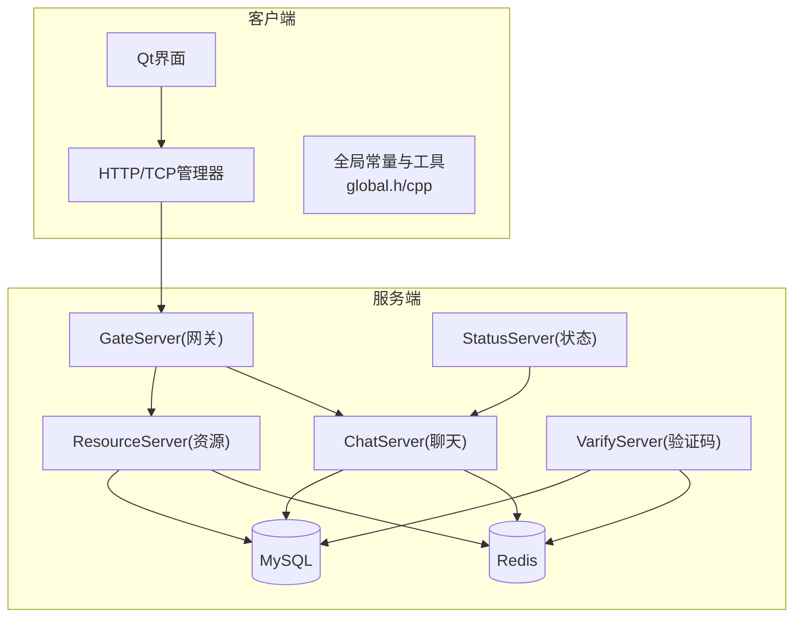
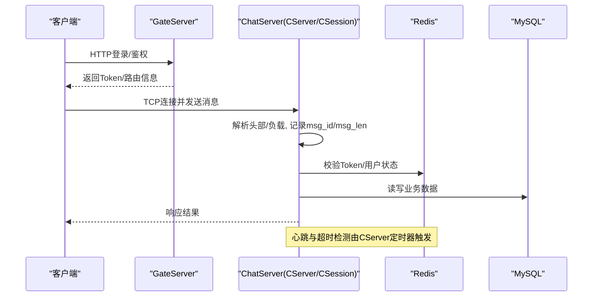
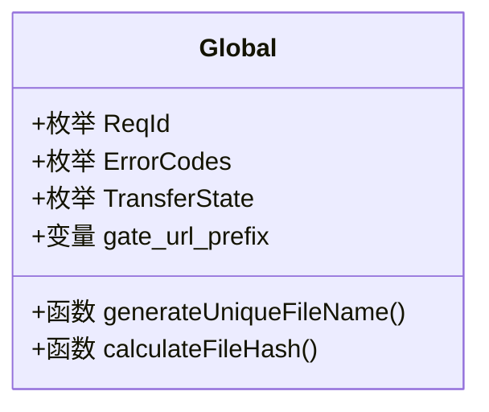
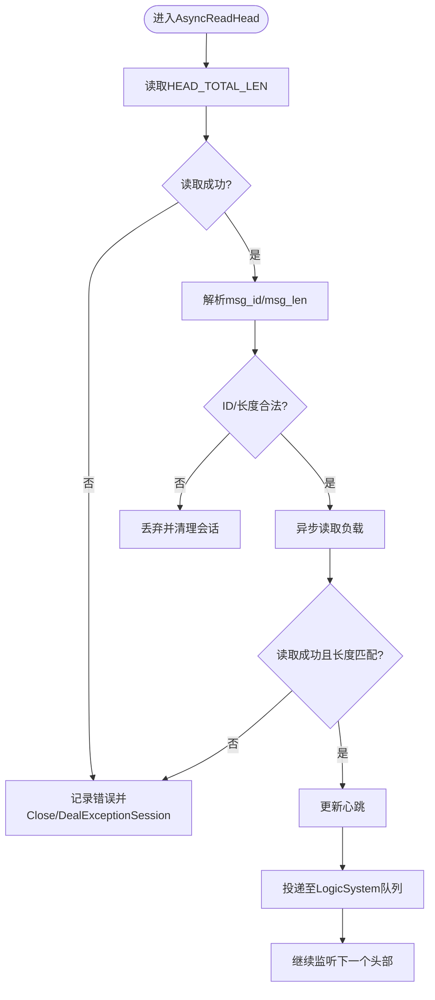
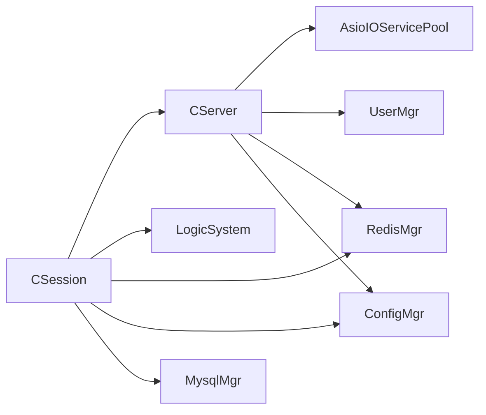

# 日志分析

<cite>
**本文引用的文件**   
- [global.h](file://client/llfcchat/include/global.h)
- [global.cpp](file://client/llfcchat/src/global.cpp)
- [utils.h](file://server/ChatServer/include/utils.h)
- [utils.cpp](file://server/ChatServer/src/utils.cpp)
- [CSession.cpp](file://server/ChatServer/src/CSession.cpp)
- [CServer.cpp](file://server/ChatServer/src/CServer.cpp)
- [ConfigMgr.h](file://server/ChatServer/include/ConfigMgr.h)
- [RedisMgr.h](file://server/ChatServer/include/RedisMgr.h)
- [MysqlMgr.h](file://server/ChatServer/include/MysqlMgr.h)
- [AsioIOServicePool.h](file://server/ChatServer/include/AsioIOServicePool.h)
- [LogicSystem.h](file://server/ChatServer/include/LogicSystem.h)
- [UserMgr.h](file://server/ChatServer/include/UserMgr.h)
- [ChatServiceImpl.h](file://server/ChatServer/include/ChatServiceImpl.h)
- [ChatServiceImpl.cpp](file://server/ChatServer/src/ChatServiceImpl.cpp)
- [LogicSystem.cpp](file://server/ChatServer/src/LogicSystem.cpp)
- [config.ini](file://server/GateServer/config/config.ini)
- [chatserver1.ini](file://server/ChatServer/config/chatserver1.ini)
- [chatserver2.ini](file://server/ChatServer/config/chatserver2.ini)
</cite>

## 目录
1. [简介](#简介)
2. [项目结构](#项目结构)
3. [核心组件](#核心组件)
4. [架构总览](#架构总览)
5. [详细组件分析](#详细组件分析)
6. [依赖关系分析](#依赖关系分析)
7. [性能与监控](#性能与监控)
8. [故障排查指南](#故障排查指南)
9. [结论](#结论)
10. [附录](#附录)

## 简介
本文件面向LLFCChat项目的日志分析与排障，聚焦以下目标：
- 日志级别配置与输出格式规范（以现有代码为基础进行归纳与扩展建议）
- 关键日志定位方法（网络I/O、会话生命周期、业务处理链路）
- 错误堆栈捕获与结构化日志最佳实践
- 性能指标采集与监控告警思路
- 常见错误模式识别与实战案例

说明：当前仓库中服务器端主要使用标准输出进行调试式打印，尚未发现统一的日志框架或全局日志配置类。因此本文在“现状”基础上给出可落地的改进建议与落地路径，确保读者既能基于现有代码快速定位问题，也能按建议逐步完善日志体系。

## 项目结构
- 客户端（Qt）：包含UI、网络、HTTP/TCP管理、全局常量与工具等。全局头文件集中定义消息ID、错误码、传输状态等，便于统一日志字段。
- 服务端（多进程服务）：
  - ChatServer：聊天主服务，负责TCP会话、消息路由、业务逻辑编排、与Redis/MySQL交互
  - GateServer：网关服务，提供HTTP入口与鉴权转发
  - ResourceServer：资源服务，处理文件上传下载
  - StatusServer：状态服务，对外暴露状态查询
  - VarifyServer：验证码服务（Node.js），用于邮箱验证码等
- 公共组件：AsioIOServicePool、ConfigMgr、RedisMgr、MysqlMgr、LogicSystem、UserMgr等

**图表来源** 
- [CServer.cpp:1-133](file://server/ChatServer/src/CServer.cpp#L1-L133)
- [CSession.cpp:1-200](file://server/ChatServer/src/CSession.cpp#L1-L200)
- [ConfigMgr.h:55-89](file://server/ChatServer/include/ConfigMgr.h#L55-L89)

**章节来源**
- [global.h:1-296](file://client/llfcchat/include/global.h#L1-L296)
- [global.cpp:1-91](file://client/llfcchat/src/global.cpp#L1-L91)
- [CServer.cpp:1-133](file://server/ChatServer/src/CServer.cpp#L1-L133)
- [CSession.cpp:1-200](file://server/ChatServer/src/CSession.cpp#L1-L200)

## 核心组件
- 全局常量与工具（客户端）
  - global.h/cpp定义了请求ID、错误码、消息类型、传输状态、唯一文件名生成、文件哈希计算等，是构建结构化日志字段的重要基础。
- 时间戳工具（服务端）
  - utils.h/cpp提供统一的时间戳获取函数，可用于日志行首时间标记。
- 会话与服务器（服务端）
  - CSession封装了TCP读写的异步流程、心跳更新、异常处理与发送队列；CServer负责Accept、会话集合管理、定时清理过期会话与统计上报。
- 配置与存储（服务端）
  - ConfigMgr负责配置文件读取与路径管理；RedisMgr、MysqlMgr分别对接缓存与持久化存储；AsioIOServicePool提供IO线程池。

**章节来源**
- [global.h:1-296](file://client/llfcchat/include/global.h#L1-L296)
- [global.cpp:1-91](file://client/llfcchat/src/global.cpp#L1-L91)
- [utils.h:1-7](file://server/ChatServer/include/utils.h#L1-L7)
- [utils.cpp:1-15](file://server/ChatServer/src/utils.cpp#L1-L15)
- [CSession.cpp:1-200](file://server/ChatServer/src/CSession.cpp#L1-L200)
- [CServer.cpp:1-133](file://server/ChatServer/src/CServer.cpp#L1-L133)
- [ConfigMgr.h:55-89](file://server/ChatServer/include/ConfigMgr.h#L55-L89)

## 架构总览
下图展示从客户端到各服务端的典型调用链路与日志埋点位置（以现有代码为依据）：

**图表来源** 
- [CSession.cpp:133-194](file://server/ChatServer/src/CSession.cpp#L133-L194)
- [CServer.cpp:75-118](file://server/ChatServer/src/CServer.cpp#L75-L118)
- [ChatServiceImpl.cpp:1-200](file://server/ChatServer/src/ChatServiceImpl.cpp#L1-L200)
- [LogicSystem.cpp:1-200](file://server/ChatServer/src/LogicSystem.cpp#L1-L200)

## 详细组件分析

### 客户端全局模块（global.h/cpp）
- 作用
  - 集中定义协议ID、错误码、消息类型、传输状态等，为日志字段标准化提供基础
  - 提供字符串异或、延迟执行、唯一文件名生成、文件MD5计算、加载占位图等工具
- 日志相关建议
  - 将ErrorCodes、ReqId、TransferState等枚举值作为日志关键字段，保证跨模块一致
  - 对网络失败、JSON解析失败等错误，统一输出错误码与上下文（如URL、请求ID）

**图表来源** 
- [global.h:43-111](file://client/llfcchat/include/global.h#L43-L111)
- [global.cpp:33-63](file://client/llfcchat/src/global.cpp#L33-L63)

**章节来源**
- [global.h:1-296](file://client/llfcchat/include/global.h#L1-L296)
- [global.cpp:1-91](file://client/llfcchat/src/global.cpp#L1-L91)

### 服务端时间戳工具（utils.h/cpp）
- 作用
  - 提供统一的时间戳格式化函数，便于日志行首时间标记
- 使用建议
  - 在所有关键日志行前缀加上该时间戳，便于时序分析与聚合平台检索

**章节来源**
- [utils.h:1-7](file://server/ChatServer/include/utils.h#L1-L7)
- [utils.cpp:1-15](file://server/ChatServer/src/utils.cpp#L1-L15)

### 会话层（CSession）
- 职责
  - 异步读取消息头与负载，校验长度与ID合法性，更新心跳，投递至逻辑队列
  - 发送队列保护与溢出告警，异常关闭与清理
- 关键日志点
  - 读取失败、长度不匹配、非法msg_id/msg_len、异常抛出、发送队列满等
- 建议
  - 将std::cout替换为结构化日志（JSON），包含session_id、msg_id、msg_len、error_code、stack_trace等

**图表来源** 
- [CSession.cpp:133-194](file://server/ChatServer/src/CSession.cpp#L133-L194)
- [CSession.cpp:90-131](file://server/ChatServer/src/CSession.cpp#L90-L131)

**章节来源**
- [CSession.cpp:1-200](file://server/ChatServer/src/CSession.cpp#L1-L200)

### 服务器主控（CServer）
- 职责
  - 接受新连接、维护会话集合、定时器清理过期会话、统计在线数上报Redis
- 关键日志点
  - 启动监听端口、Accept失败、定时器错误、会话清理、在线计数上报
- 建议
  - 将控制台输出改为结构化日志，增加服务名、端口、事件类型、指标数值

**章节来源**
- [CServer.cpp:1-133](file://server/ChatServer/src/CServer.cpp#L1-L133)

### 配置管理（ConfigMgr）
- 职责
  - 读取INI配置，提供键值访问与路径管理（静态目录、bin输出路径）
- 日志相关
  - 配置项缺失或路径异常时，应输出警告并回退默认值

**章节来源**
- [ConfigMgr.h:55-89](file://server/ChatServer/include/ConfigMgr.h#L55-L89)

### 存储与缓存（RedisMgr、MysqlMgr）
- 职责
  - 封装Redis/MySQL操作，提供Set/Get/事务等能力
- 日志相关
  - 所有外部IO失败需记录错误码、SQLState、错误信息与重试次数

**章节来源**
- [RedisMgr.h](file://server/ChatServer/include/RedisMgr.h)
- [MysqlMgr.h](file://server/ChatServer/include/MysqlMgr.h)

### 业务实现（ChatServiceImpl、LogicSystem）
- 职责
  - 具体业务逻辑编排、消息分发、与存储交互
- 日志相关
  - 建议在每个业务入口/出口记录结构化日志，包含请求ID、用户ID、操作类型、耗时、结果码

**章节来源**
- [ChatServiceImpl.cpp](file://server/ChatServer/src/ChatServiceImpl.cpp)
- [LogicSystem.cpp](file://server/ChatServer/src/LogicSystem.cpp)

## 依赖关系分析
- 耦合关系
  - CSession依赖CServer、LogicSystem、RedisMgr、ConfigMgr、MysqlMgr
  - CServer依赖AsioIOServicePool、UserMgr、RedisMgr、ConfigMgr
- 潜在风险
  - 同步阻塞IO出现在异步回调中会导致性能下降
  - 未加锁的共享容器访问可能引发竞态

**图表来源** 
- [CSession.cpp:1-200](file://server/ChatServer/src/CSession.cpp#L1-L200)
- [CServer.cpp:1-133](file://server/ChatServer/src/CServer.cpp#L1-L133)

**章节来源**
- [CSession.cpp:1-200](file://server/ChatServer/src/CSession.cpp#L1-L200)
- [CServer.cpp:1-133](file://server/ChatServer/src/CServer.cpp#L1-L133)

## 性能与监控
- 指标采集建议
  - 连接数、在线会话数、消息吞吐、平均/分位延迟、错误率、队列长度、超时率
  - 通过CServer定时器上报在线会话数至Redis，可作为监控基线
- 监控与告警
  - 基于Redis键值变化设置阈值告警（如在线会话突降、错误率突增）
  - 结合日志聚合平台（如ELK/Loki）对结构化日志进行实时检索与可视化

**章节来源**
- [CServer.cpp:103-118](file://server/ChatServer/src/CServer.cpp#L103-L118)

## 故障排查指南
- 常见错误模式与定位要点
  - 连接失败：检查Accept错误码、端口占用、防火墙策略
  - 心跳超时：关注定时器错误、会话心跳更新时间、网络抖动
  - 权限错误：检查Token有效性、Redis键是否存在、MySQL权限
  - 数据异常：核对msg_id/msg_len合法性、JSON解析错误码、数据库约束
- 实用命令与技巧
  - grep过滤关键日志：grep -E "handle read failed|invalid msg_id|send que fulled" logs.txt
  - 聚合平台：将结构化日志按service、level、event_type、session_id索引
  - 实时监控：对错误率、延迟P95/P99、队列长度设置阈值告警
- 结构化日志字段建议
  - 时间戳、服务名、级别、事件类型、session_id、user_id、req_id、error_code、message、stack_trace、latency_ms

**章节来源**
- [CSession.cpp:90-131](file://server/ChatServer/src/CSession.cpp#L90-L131)
- [CSession.cpp:133-194](file://server/ChatServer/src/CSession.cpp#L133-L194)
- [CServer.cpp:75-118](file://server/ChatServer/src/CServer.cpp#L75-L118)

## 结论
- 当前服务端日志以控制台输出为主，缺少统一框架与结构化输出
- 建议尽快引入结构化日志库（如spdlog），配合全局时间戳工具与错误码枚举，形成一致的日志规范
- 在关键路径（网络I/O、会话生命周期、业务处理、存储交互）埋点，建立监控与告警体系，提升排障效率

## 附录
- 配置文件参考
  - GateServer配置：config.ini
  - ChatServer配置：chatserver1.ini、chatserver2.ini
- 日志级别与输出格式建议
  - 级别：DEBUG/INFO/WARN/ERROR/FATAL
  - 格式：JSON，包含必要字段（时间戳、服务名、级别、事件、上下文、错误信息、堆栈）

**章节来源**
- [config.ini](file://server/GateServer/config/config.ini)
- [chatserver1.ini](file://server/ChatServer/config/chatserver1.ini)
- [chatserver2.ini](file://server/ChatServer/config/chatserver2.ini)