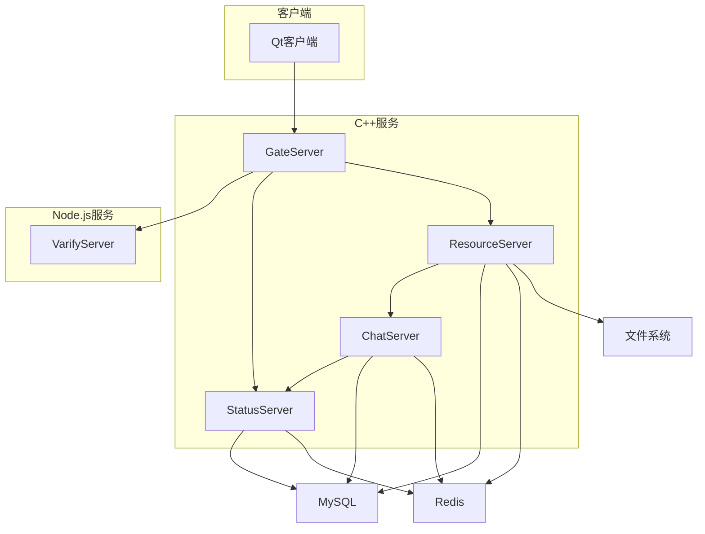
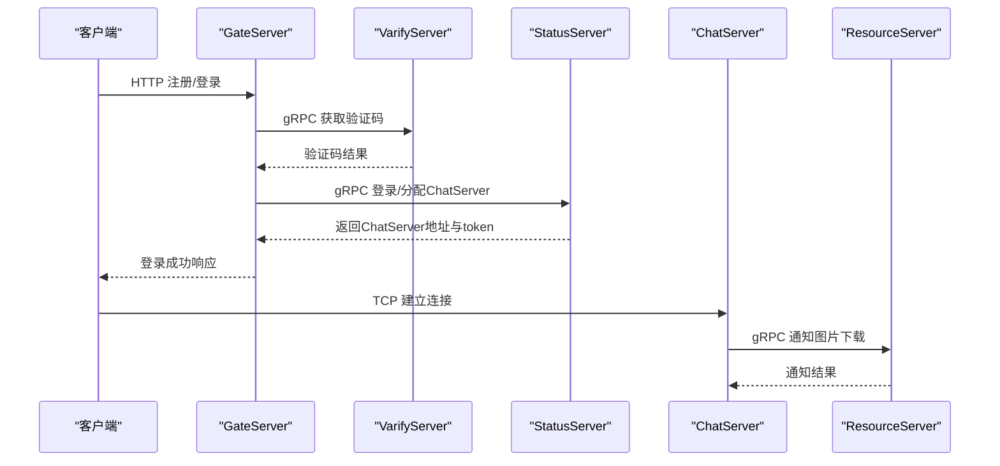
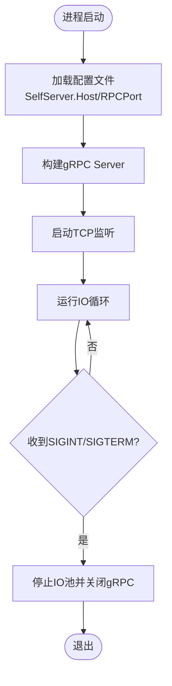
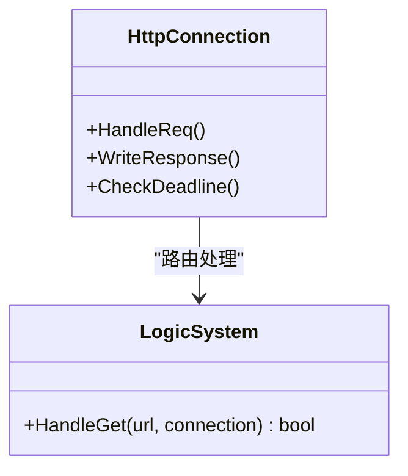
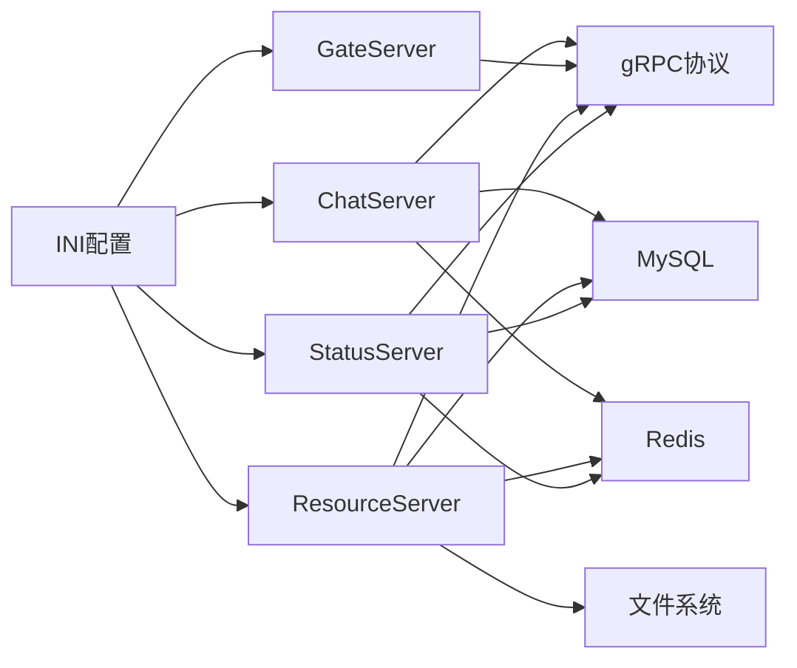

# 服务问题

<cite>
**本文引用的文件**   
- [README.md](file://README.md)
- [CMakeLists.txt](file://CMakeLists.txt)
- [vcpkg.json](file://vcpkg.json)
- [chatserver1.ini](file://server/ChatServer/config/chatserver1.ini)
- [chatserver2.ini](file://server/ChatServer/config/chatserver2.ini)
- [GateServer配置config.ini](file://server/GateServer/config/config.ini)
- [ResourceServer配置config.ini](file://server/ResourceServer/config/config.ini)
- [StatusServer配置config.ini](file://server/StatusServer/config/config.ini)
- [ConfigMgr.h（ChatServer）](file://server/ChatServer/include/ConfigMgr.h)
- [ConfigMgr.cpp（ChatServer）](file://server/ChatServer/src/ConfigMgr.cpp)
- [ConfigMgr.h（GateServer）](file://server/GateServer/include/ConfigMgr.h)
- [ConfigMgr.cpp（GateServer）](file://server/GateServer/src/ConfigMgr.cpp)
- [chat.proto](file://proto/chat_service/chat.proto)
- [status.proto](file://proto/status_service/status.proto)
- [verify.proto](file://proto/verify_service/verify.proto)
- [ChatServer.cpp](file://server/ChatServer/src/ChatServer.cpp)
- [CSession.cpp](file://server/ChatServer/src/CSession.cpp)
- [HttpConnection.cpp](file://server/GateServer/src/HttpConnection.cpp)
- [AsioIOServicePool.cpp（ResourceServer）](file://server/ResourceServer/src/AsioIOServicePool.cpp)
- [AsioIOServicePool.cpp（StatusServer）](file://server/StatusServer/src/AsioIOServicePool.cpp)
- [AsioIOServicePool.cpp（GateServer）](file://server/GateServer/src/AsioIOServicePool.cpp)
- [tcpmgr.cpp（客户端）](file://client/llfcchat/src/tcpmgr.cpp)
- [day27-分布式服务设计.md](file://开发文档/day27-分布式服务设计.md)
- [day35心跳逻辑.md](file://开发文档/day35心跳逻辑.md)
- [day08-邮箱认证服务.md](file://开发文档/day08-邮箱认证服务.md)
- [day41-通知客户端异步下载聊天图片.md](file://开发文档/day41-通知客户端异步下载聊天图片.md)
</cite>

## 目录
1. [简介](#简介)
2. [项目结构](#项目结构)
3. [核心组件](#核心组件)
4. [架构总览](#架构总览)
5. [详细组件分析](#详细组件分析)
6. [依赖关系分析](#依赖关系分析)
7. [性能与稳定性考虑](#性能与稳定性考虑)
8. [故障排查指南](#故障排查指南)
9. [结论](#结论)
10. [附录：健康检查与监控告警建议](#附录健康检查与监控告警建议)

## 简介
本文件面向LLFCChat微服务的运维与研发人员，聚焦“服务启动失败、gRPC通信异常、服务间依赖问题、健康检查与监控告警、重启与恢复流程、生产应急处理”等关键场景。内容基于仓库中的配置文件、gRPC协议定义、服务启动与网络I/O实现、以及开发文档中的分布式设计与错误处理实践进行系统化梳理，帮助快速定位并解决问题。

## 项目结构
- 多语言后端服务：
  - C++服务：ChatServer、GateServer、ResourceServer、StatusServer
  - Node.js服务：VarifyServer（验证码服务）
- Qt客户端：llfcchat
- gRPC协议定义：chat_service、status_service、verify_service
- 构建系统：CMake + vcpkg管理依赖

**图表来源** 
- [ChatServer.cpp:40-79](file://server/ChatServer/src/ChatServer.cpp#L40-L79)
- [HttpConnection.cpp:132-167](file://server/GateServer/src/HttpConnection.cpp#L132-L167)
- [ResourceServer.cpp:1-41](file://server/ResourceServer/src/ResourceServer.cpp#L1-L41)
- [StatusServer主函数示例:452-518](file://开发文档/day14-登录功能.md#L452-L518)

**章节来源**
- [CMakeLists.txt:1-34](file://CMakeLists.txt#L1-L34)
- [vcpkg.json:1-32](file://vcpkg.json#L1-L32)
- [README.md:1-112](file://README.md#L1-L112)

## 核心组件
- ChatServer：提供TCP长连接与gRPC服务，负责消息转发、好友关系、踢人、图片通知等。
- GateServer：HTTP网关，接收客户端HTTP请求，路由到验证、状态、资源等服务。
- ResourceServer：静态资源与文件上传下载服务，通过gRPC与ChatServer交互。
- StatusServer：状态与路由服务，提供用户登录、分配ChatServer实例等能力。
- VarifyServer：验证码服务（Node.js），供GateServer调用。
- 配置管理：各服务通过INI配置文件加载端口、地址、数据库、Redis等参数。

**章节来源**
- [chat.proto:1-105](file://proto/chat_service/chat.proto#L1-L105)
- [status.proto:1-32](file://proto/status_service/status.proto#L1-L32)
- [verify.proto:1-19](file://proto/verify_service/verify.proto#L1-L19)
- [ChatServer.cpp:40-79](file://server/ChatServer/src/ChatServer.cpp#L40-L79)
- [HttpConnection.cpp:132-167](file://server/GateServer/src/HttpConnection.cpp#L132-L167)

## 架构总览
- 客户端通过GateServer的HTTP接口完成注册、登录、验证码获取等；登录后由StatusServer返回目标ChatServer的地址与令牌。
- ChatServer维护TCP会话，并通过gRPC与其他ChatServer或ResourceServer通信。
- ResourceServer通过gRPC向ChatServer下发图片下载通知，同时从文件系统读写资源。
- StatusServer集中管理用户登录态与路由信息，GateServer作为统一入口。

**图表来源** 
- [HttpConnection.cpp:132-167](file://server/GateServer/src/HttpConnection.cpp#L132-L167)
- [status.proto:1-32](file://proto/status_service/status.proto#L1-L32)
- [chat.proto:1-105](file://proto/chat_service/chat.proto#L1-L105)
- [day08-邮箱认证服务.md:405-445](file://开发文档/day08-邮箱认证服务.md#L405-L445)
- [day41-通知客户端异步下载聊天图片.md:61-215](file://开发文档/day41-通知客户端异步下载聊天图片.md#L61-L215)

## 详细组件分析

### ChatServer（聊天服务）
- 启动流程：读取SelfServer配置，创建gRPC服务器监听RPCPort，同时启动TCP服务监听Port。
- 错误处理：信号捕获后优雅关闭gRPC与IO池；读/写回调中处理异常并清理会话。
- 依赖：Mysql、Redis用于持久化与会话管理；与StatusServer、其他ChatServer、ResourceServer通过gRPC通信。

**图表来源** 
- [ChatServer.cpp:40-79](file://server/ChatServer/src/ChatServer.cpp#L40-L79)
- [day27-分布式服务设计.md:221-276](file://开发文档/day27-分布式服务设计.md#L221-L276)

**章节来源**
- [ChatServer.cpp:40-79](file://server/ChatServer/src/ChatServer.cpp#L40-L79)
- [CSession.cpp:184-224](file://server/ChatServer/src/CSession.cpp#L184-L224)
- [day35心跳逻辑.md:318-365](file://开发文档/day35心跳逻辑.md#L318-L365)

### GateServer（HTTP网关）
- 职责：解析HTTP请求，路由至业务逻辑；跨域设置；短连接模式。
- 错误处理：未匹配路由返回404；异常时记录日志并继续接受新连接。
- 依赖：VarifyServer（验证码）、StatusServer（状态）、ResourceServer（资源）。

**图表来源** 
- [HttpConnection.cpp:132-167](file://server/GateServer/src/HttpConnection.cpp#L132-L167)

**章节来源**
- [HttpConnection.cpp:132-167](file://server/GateServer/src/HttpConnection.cpp#L132-L167)
- [day04-beast搭建http服务器.md:139-191](file://开发文档/day04-beast搭建http服务器.md#L139-L191)

### ResourceServer（资源服务）
- 职责：文件上传/下载、静态资源访问；通过gRPC与ChatServer协作下发图片通知。
- 配置：输出路径、静态路径、ChatServer列表。
- IO模型：AsioIOServicePool多线程并行处理。

**章节来源**
- [ResourceServer配置config.ini:1-27](file://server/ResourceServer/config/config.ini#L1-L27)
- [AsioIOServicePool.cpp（ResourceServer）:1-43](file://server/ResourceServer/src/AsioIOServicePool.cpp#L1-L43)
- [day41-通知客户端异步下载聊天图片.md:61-215](file://开发文档/day41-通知客户端异步下载聊天图片.md#L61-L215)

### StatusServer（状态服务）
- 职责：用户登录校验、分配ChatServer实例、维护登录态。
- 配置：监听端口、Host、已注册ChatServer列表。
- 启动：gRPC服务独立线程运行，配合信号优雅关闭。

**章节来源**
- [StatusServer配置config.ini:1-23](file://server/StatusServer/config/config.ini#L1-L23)
- [day14-登录功能.md:452-518](file://开发文档/day14-登录功能.md#L452-L518)

### VarifyServer（验证码服务）
- 职责：生成并缓存验证码；供GateServer调用。
- 集成：GateServer通过gRPC调用，使用连接池复用Stub。

**章节来源**
- [verify.proto:1-19](file://proto/verify_service/verify.proto#L1-L19)
- [day08-邮箱认证服务.md:405-445](file://开发文档/day08-邮箱认证服务.md#L405-L445)

## 依赖关系分析
- 配置驱动：所有服务通过INI配置文件加载端口、主机、数据库、Redis等信息。
- gRPC协议：ChatService、StatusService、VarifyService三套协议定义清晰，客户端与服务端需保持版本一致。
- 外部依赖：MySQL、Redis、文件系统、Boost.Asio、gRPC/protobuf。

**图表来源** 
- [ConfigMgr.cpp（ChatServer）:1-50](file://server/ChatServer/src/ConfigMgr.cpp#L1-L50)
- [ConfigMgr.cpp（GateServer）:1-50](file://server/GateServer/src/ConfigMgr.cpp#L1-L50)
- [chat.proto:1-105](file://proto/chat_service/chat.proto#L1-L105)
- [status.proto:1-32](file://proto/status_service/status.proto#L1-L32)
- [verify.proto:1-19](file://proto/verify_service/verify.proto#L1-L19)

**章节来源**
- [chatserver1.ini:1-30](file://server/ChatServer/config/chatserver1.ini#L1-L30)
- [chatserver2.ini:1-30](file://server/ChatServer/config/chatserver2.ini#L1-L30)
- [GateServer配置config.ini:1-25](file://server/GateServer/config/config.ini#L1-L25)
- [ResourceServer配置config.ini:1-27](file://server/ResourceServer/config/config.ini#L1-L27)
- [StatusServer配置config.ini:1-23](file://server/StatusServer/config/config.ini#L1-L23)

## 性能与稳定性考虑
- I/O模型：各服务采用AsioIOServicePool多线程模型，提升并发处理能力。
- 连接池：gRPC客户端使用连接池减少握手开销，提高吞吐。
- 心跳与超时：会话层维护心跳时间，异常读/写及时清理会话，避免资源泄漏。
- 优雅关闭：信号捕获后停止IO循环并关闭gRPC，保证数据一致性。

**章节来源**
- [AsioIOServicePool.cpp（GateServer）:1-43](file://server/GateServer/src/AsioIOServicePool.cpp#L1-L43)
- [AsioIOServicePool.cpp（StatusServer）:1-43](file://server/StatusServer/src/AsioIOServicePool.cpp#L1-L43)
- [CSession.cpp:184-224](file://server/ChatServer/src/CSession.cpp#L184-L224)
- [day35心跳逻辑.md:318-365](file://开发文档/day35心跳逻辑.md#L318-L365)

## 故障排查指南

### 一、服务启动失败的常见原因与解决方法
- 端口冲突
  - 现象：服务无法绑定端口，启动即退出。
  - 排查：检查各服务配置的Port/RPCPort是否重复；确认防火墙或安全组放行。
  - 参考配置：
    - ChatServer1：[chatserver1.ini:1-30](file://server/ChatServer/config/chatserver1.ini#L1-L30)
    - ChatServer2：[chatserver2.ini:1-30](file://server/ChatServer/config/chatserver2.ini#L1-L30)
    - GateServer：[GateServer配置config.ini:1-25](file://server/GateServer/config/config.ini#L1-L25)
    - ResourceServer：[ResourceServer配置config.ini:1-27](file://server/ResourceServer/config/config.ini#L1-L27)
    - StatusServer：[StatusServer配置config.ini:1-23](file://server/StatusServer/config/config.ini#L1-L23)
- 配置文件错误
  - 现象：读取INI失败或关键字段为空导致初始化异常。
  - 排查：确认工作目录下存在正确的INI文件；核对Section与Key名称；检查路径与权限。
  - 参考实现：
    - [ConfigMgr.cpp（ChatServer）:1-50](file://server/ChatServer/src/ConfigMgr.cpp#L1-L50)
    - [ConfigMgr.cpp（GateServer）:1-50](file://server/GateServer/src/ConfigMgr.cpp#L1-L50)
- 依赖服务不可用
  - 现象：连接MySQL/Redis失败，或gRPC目标不可达。
  - 排查：检查数据库与Redis服务状态；确认Host/Port/密码正确；网络连通性测试。
  - 参考配置：各服务INI中的[Mysql]、[Redis]段。
- 构建环境缺失
  - 现象：编译或运行时缺少依赖库。
  - 排查：确认vcpkg依赖安装完整；CMake生成器为Ninja Multi-Config；非源码目录构建。
  - 参考：
    - [CMakeLists.txt:1-34](file://CMakeLists.txt#L1-L34)
    - [vcpkg.json:1-32](file://vcpkg.json#L1-L32)

**章节来源**
- [chatserver1.ini:1-30](file://server/ChatServer/config/chatserver1.ini#L1-L30)
- [chatserver2.ini:1-30](file://server/ChatServer/config/chatserver2.ini#L1-L30)
- [GateServer配置config.ini:1-25](file://server/GateServer/config/config.ini#L1-L25)
- [ResourceServer配置config.ini:1-27](file://server/ResourceServer/config/config.ini#L1-L27)
- [StatusServer配置config.ini:1-23](file://server/StatusServer/config/config.ini#L1-L23)
- [ConfigMgr.cpp（ChatServer）:1-50](file://server/ChatServer/src/ConfigMgr.cpp#L1-L50)
- [ConfigMgr.cpp（GateServer）:1-50](file://server/GateServer/src/ConfigMgr.cpp#L1-L50)
- [CMakeLists.txt:1-34](file://CMakeLists.txt#L1-L34)
- [vcpkg.json:1-32](file://vcpkg.json#L1-L32)

### 二、gRPC通信失败诊断
- 服务发现失败
  - 现象：GateServer/ChatServer无法找到StatusServer或目标ChatServer。
  - 排查：检查INI中StatusServer与PeerServer配置；确认服务已启动且端口可达。
  - 参考：
    - [status.proto:1-32](file://proto/status_service/status.proto#L1-L32)
    - [chatserver1.ini:1-30](file://server/ChatServer/config/chatserver1.ini#L1-L30)
- 接口调用超时
  - 现象：gRPC调用长时间无响应。
  - 排查：检查服务端负载与阻塞点；客户端连接池大小与重试策略；网络延迟。
  - 参考：
    - [day41-通知客户端异步下载聊天图片.md:61-215](file://开发文档/day41-通知客户端异步下载聊天图片.md#L61-L215)
- 协议版本不兼容
  - 现象：字段缺失或类型不匹配导致反序列化失败。
  - 排查：确保proto文件版本一致；重新生成pb/grpc头文件；检查消息字段编号。
  - 参考：
    - [chat.proto:1-105](file://proto/chat_service/chat.proto#L1-L105)
    - [status.proto:1-32](file://proto/status_service/status.proto#L1-L32)
    - [verify.proto:1-19](file://proto/verify_service/verify.proto#L1-L19)

**章节来源**
- [status.proto:1-32](file://proto/status_service/status.proto#L1-L32)
- [chat.proto:1-105](file://proto/chat_service/chat.proto#L1-L105)
- [verify.proto:1-19](file://proto/verify_service/verify.proto#L1-L19)
- [day41-通知客户端异步下载聊天图片.md:61-215](file://开发文档/day41-通知客户端异步下载聊天图片.md#L61-L215)

### 三、服务间依赖关系问题排查
- 服务注册与发现
  - 现象：GateServer无法获取ChatServer地址；ChatServer之间无法互访。
  - 排查：确认StatusServer中[chatservers]配置；检查各服务INI中的PeerServer与对应节点配置。
  - 参考：
    - [StatusServer配置config.ini:1-23](file://server/StatusServer/config/config.ini#L1-L23)
    - [chatserver1.ini:1-30](file://server/ChatServer/config/chatserver1.ini#L1-L30)
    - [chatserver2.ini:1-30](file://server/ChatServer/config/chatserver2.ini#L1-L30)
- 负载均衡配置
  - 现象：流量集中在单一ChatServer。
  - 排查：检查StatusServer返回策略；客户端重连与选择逻辑；必要时引入外部负载均衡。
  - 参考：
    - [status.proto:1-32](file://proto/status_service/status.proto#L1-L32)
- 故障转移机制
  - 现象：某ChatServer宕机后用户无法迁移。
  - 排查：检查心跳与失效检测；登录态在Redis中的更新；客户端重连逻辑。
  - 参考：
    - [day35心跳逻辑.md:318-365](file://开发文档/day35心跳逻辑.md#L318-L365)

**章节来源**
- [StatusServer配置config.ini:1-23](file://server/StatusServer/config/config.ini#L1-L23)
- [chatserver1.ini:1-30](file://server/ChatServer/config/chatserver1.ini#L1-L30)
- [chatserver2.ini:1-30](file://server/ChatServer/config/chatserver2.ini#L1-L30)
- [status.proto:1-32](file://proto/status_service/status.proto#L1-L32)
- [day35心跳逻辑.md:318-365](file://开发文档/day35心跳逻辑.md#L318-L365)

### 四、健康检查与监控告警配置方法
- 服务状态监控
  - 建议：暴露HTTP健康检查端点（如/gz/health），返回服务状态码与依赖检查结果（DB/Redis/gRPC）。
  - 实施：在GateServer中新增路由，查询各依赖可用性并汇总状态。
- 性能指标收集
  - 建议：采集QPS、延迟、错误率、连接数、CPU/内存占用；通过Prometheus抓取自定义指标。
  - 实施：在服务中统计关键指标并暴露HTTP端点；或使用OpenTelemetry埋点。
- 异常告警设置
  - 建议：对gRPC调用失败、超时、依赖不可用、会话异常断开等事件设置阈值告警。
  - 实施：结合日志系统与告警平台（如AlertManager）配置规则与通知渠道。

[本节为通用指导，不直接分析具体文件]

### 五、服务重启与故障恢复操作流程
- 单服务重启
  - 步骤：停止服务→检查日志→修复配置或依赖→重新启动→验证健康检查。
  - 注意：确保端口释放；确认依赖服务可用；观察gRPC与TCP监听是否正常。
- 多服务恢复顺序
  - 推荐顺序：MySQL/Redis→StatusServer→GateServer→ChatServer→ResourceServer→VarifyServer。
- 回滚与降级
  - 策略：保留上一版本镜像/二进制；切换流量至备用实例；必要时关闭非核心功能。

[本节为通用流程，不直接分析具体文件]

### 六、生产环境应急处理方案
- 快速止血
  - 隔离故障节点；切换流量至健康节点；限制入站流量或启用熔断。
- 根因定位
  - 收集日志与指标；复现问题；检查配置变更与依赖状态；定位代码缺陷或资源瓶颈。
- 恢复与复盘
  - 逐步恢复服务；验证端到端流程；编写事故报告与改进措施。

[本节为通用应急策略，不直接分析具体文件]

## 结论
LLFCChat微服务通过清晰的配置管理与gRPC协议实现了模块化与可扩展性。故障排查应围绕“配置正确性、依赖可用性、协议一致性、I/O与连接池稳定性”展开。建议在生产环境完善健康检查、指标采集与告警体系，并制定标准化的重启与应急流程，以提升整体稳定性与可观测性。

## 附录：健康检查与监控告警建议
- 健康检查端点设计
  - /health：返回服务状态与依赖检查结果（OK/DEGRADED/UNHEALTHY）。
  - /ready：就绪探针，确保依赖全部可用后再接入流量。
- 指标项建议
  - 应用级：QPS、平均延迟、错误率、活跃连接数。
  - 依赖级：DB连接池使用率、Redis命中率、gRPC调用成功率与延迟。
- 告警规则示例
  - gRPC调用失败率>5%持续1分钟。
  - 依赖不可用超过30秒。
  - 会话异常断开率突增。
- 工具链建议
  - Prometheus+Grafana用于指标可视化；AlertManager用于告警分发；ELK用于日志聚合与分析。

[本节为通用建议，不直接分析具体文件]