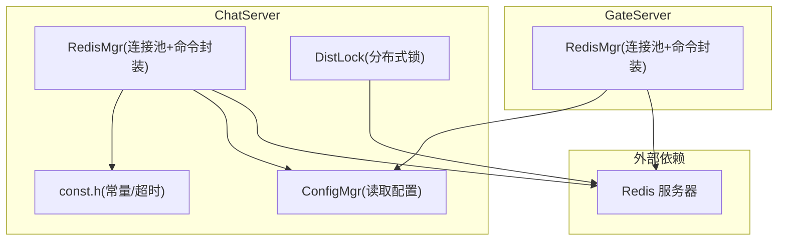
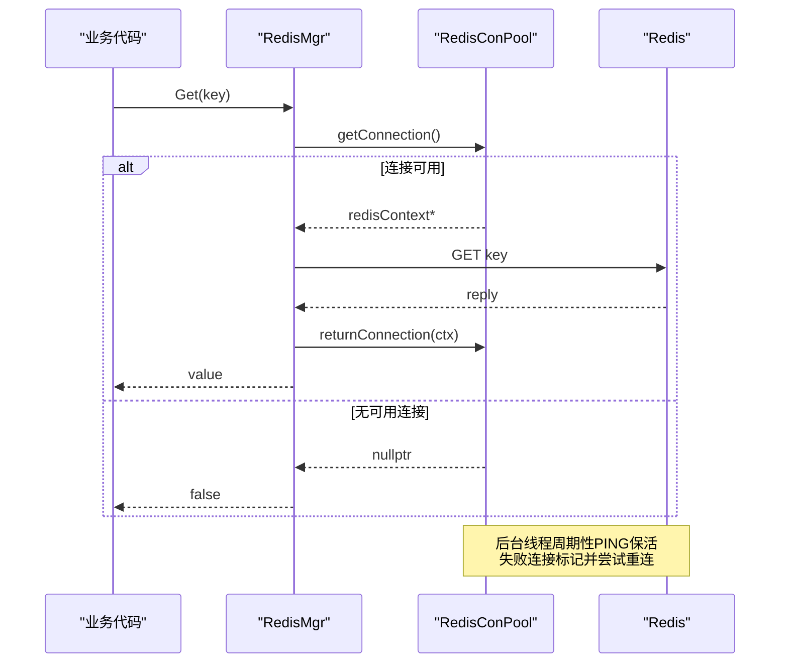
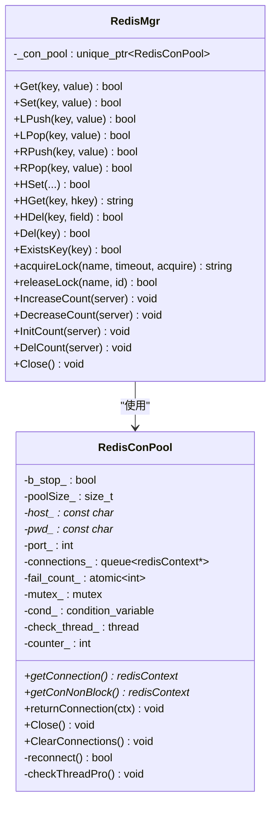
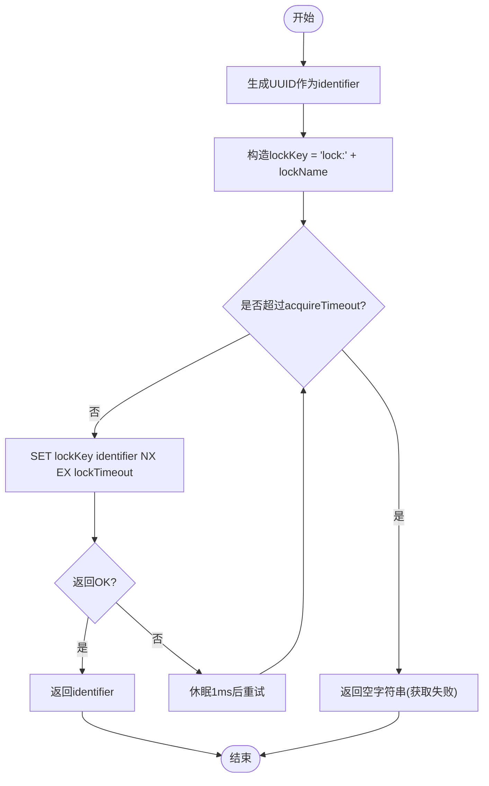
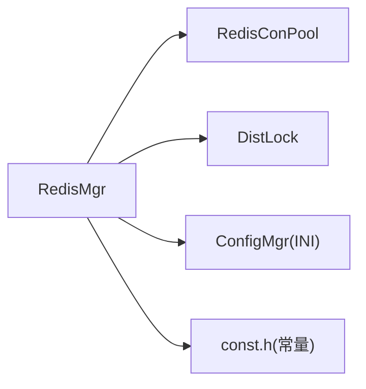

# 缓存问题

<cite>
**本文引用的文件**   
- [RedisMgr.h](file://server/ChatServer/include/RedisMgr.h)
- [RedisMgr.cpp](file://server/ChatServer/src/RedisMgr.cpp)
- [DistLock.h](file://server/ChatServer/include/DistLock.h)
- [DistLock.cpp](file://server/ChatServer/src/DistLock.cpp)
- [const.h](file://server/ChatServer/include/const.h)
- [chatserver1.ini](file://server/ChatServer/config/chatserver1.ini)
- [config.ini](file://server/GateServer/config/config.ini)
- [day09-redis服务搭建.md](file://开发文档/day09-redis服务搭建.md)
- [day32分布式锁设计思路.md](file://开发文档/day32分布式锁设计思路.md)
- [day35心跳逻辑.md](file://开发文档/day35心跳逻辑.md)
</cite>

## 目录
1. [简介](#简介)
2. [项目结构](#项目结构)
3. [核心组件](#核心组件)
4. [架构总览](#架构总览)
5. [详细组件分析](#详细组件分析)
6. [依赖关系分析](#依赖关系分析)
7. [性能与监控](#性能与监控)
8. [故障排查指南](#故障排查指南)
9. [结论](#结论)
10. [附录](#附录)

## 简介
本文件面向LLFCChat系统中的Redis缓存相关问题，提供从连接、认证、连接池、分布式锁到数据一致性与性能调优的完整排障与优化指南。内容覆盖：
- Redis连接失败的常见原因与修复（超时、认证失败、内存溢出等）
- 缓存不一致问题的诊断与解决（穿透、雪崩、热点）
- 分布式锁常见问题（获取失败、超时、死锁检测）
- Redis性能调优与监控（内存、慢查询、连接池）
- 失效策略配置与调试技巧
- 生产环境快速恢复方案

## 项目结构
本项目在多个服务端模块中复用Redis能力，关键实现集中在ChatServer与GateServer的Redis管理器与分布式锁模块，并通过配置文件注入连接参数。

图表来源
- [RedisMgr.h:1-305](file://server/ChatServer/include/RedisMgr.h#L1-L305)
- [RedisMgr.cpp:1-462](file://server/ChatServer/src/RedisMgr.cpp#L1-L462)
- [DistLock.cpp:1-73](file://server/ChatServer/src/DistLock.cpp#L1-L73)
- [const.h:81-94](file://server/ChatServer/include/const.h#L81-L94)
- [chatserver1.ini:20-24](file://server/ChatServer/config/chatserver1.ini#L20-L24)
- [config.ini:15-18](file://server/GateServer/config/config.ini#L15-L18)

章节来源
- [RedisMgr.h:1-305](file://server/ChatServer/include/RedisMgr.h#L1-L305)
- [RedisMgr.cpp:1-462](file://server/ChatServer/src/RedisMgr.cpp#L1-L462)
- [DistLock.cpp:1-73](file://server/ChatServer/src/DistLock.cpp#L1-L73)
- [const.h:81-94](file://server/ChatServer/include/const.h#L81-L94)
- [chatserver1.ini:20-24](file://server/ChatServer/config/chatserver1.ini#L20-L24)
- [config.ini:15-18](file://server/GateServer/config/config.ini#L15-L18)

## 核心组件
- RedisConPool：连接池，负责初始化连接、AUTH认证、PING保活、异常连接回收与重连、线程安全借还连接。
- RedisMgr：对外暴露常用命令（GET/SET/HSET/HGET/LPUSH/RPOP等）、键存在性检查、分布式锁封装、登录计数统计等。
- DistLock：基于SET NX EX + Lua脚本的分布式锁实现，支持获取超时与释放校验。
- 配置与常量：通过INI配置注入Host/Port/Passwd；通过常量定义锁超时与重试时间。

章节来源
- [RedisMgr.h:9-265](file://server/ChatServer/include/RedisMgr.h#L9-L265)
- [RedisMgr.cpp:1-462](file://server/ChatServer/src/RedisMgr.cpp#L1-L462)
- [DistLock.h:1-18](file://server/ChatServer/include/DistLock.h#L1-L18)
- [DistLock.cpp:1-73](file://server/ChatServer/src/DistLock.cpp#L1-L73)
- [const.h:81-94](file://server/ChatServer/include/const.h#L81-L94)
- [chatserver1.ini:20-24](file://server/ChatServer/config/chatserver1.ini#L20-L24)
- [config.ini:15-18](file://server/GateServer/config/config.ini#L15-L18)

## 架构总览
下图展示一次典型“获取缓存”调用链，以及连接池保活与重连流程。

图表来源
- [RedisMgr.cpp:19-46](file://server/ChatServer/src/RedisMgr.cpp#L19-L46)
- [RedisMgr.h:63-108](file://server/ChatServer/include/RedisMgr.h#L63-L108)
- [RedisMgr.h:137-206](file://server/ChatServer/include/RedisMgr.h#L137-L206)

## 详细组件分析

### Redis连接池与命令封装
- 连接池初始化：按配置创建固定数量连接，执行AUTH认证，启动保活线程。
- 借还连接：getConnection阻塞等待可用连接；returnConnection归还并唤醒等待者。
- 保活与重连：定时对池中连接执行PING，失败则标记fail_count_并尝试reconnect；成功则放回池。
- 命令封装：Get/Set/LPush/RPop/HSet/HDel/Del/ExistsKey等均有统一错误处理与资源释放。

图表来源
- [RedisMgr.h:9-265](file://server/ChatServer/include/RedisMgr.h#L9-L265)
- [RedisMgr.cpp:1-462](file://server/ChatServer/src/RedisMgr.cpp#L1-L462)

章节来源
- [RedisMgr.h:9-265](file://server/ChatServer/include/RedisMgr.h#L9-L265)
- [RedisMgr.cpp:1-462](file://server/ChatServer/src/RedisMgr.cpp#L1-L462)

### 分布式锁实现
- 加锁：SET lockName identifier NX EX lockTimeout，带过期时间防止死锁，循环重试直到acquireTimeout。
- 解锁：EVAL Lua脚本判断identifier是否匹配，匹配则DEL释放。
- 标识符：使用UUID保证唯一性。

图表来源
- [DistLock.cpp:27-49](file://server/ChatServer/src/DistLock.cpp#L27-L49)
- [const.h:91-94](file://server/ChatServer/include/const.h#L91-L94)

章节来源
- [DistLock.h:1-18](file://server/ChatServer/include/DistLock.h#L1-L18)
- [DistLock.cpp:1-73](file://server/ChatServer/src/DistLock.cpp#L1-L73)
- [const.h:91-94](file://server/ChatServer/include/const.h#L91-L94)

### 配置与常量
- 连接信息：Host/Port/Passwd由INI配置注入。
- 锁参数：LOCK_TIME_OUT与ACQUIRE_TIME_OUT定义锁有效期与获取超时。

章节来源
- [chatserver1.ini:20-24](file://server/ChatServer/config/chatserver1.ini#L20-L24)
- [config.ini:15-18](file://server/GateServer/config/config.ini#L15-L18)
- [const.h:91-94](file://server/ChatServer/include/const.h#L91-L94)

## 依赖关系分析
- RedisMgr依赖RedisConPool进行连接管理，依赖DistLock进行分布式锁操作。
- 各服务模块通过ConfigMgr读取INI配置，避免硬编码。
- 常量集中定义键前缀与锁超时，便于统一维护。

图表来源
- [RedisMgr.cpp:1-15](file://server/ChatServer/src/RedisMgr.cpp#L1-L15)
- [RedisMgr.h:267-303](file://server/ChatServer/include/RedisMgr.h#L267-L303)
- [DistLock.cpp:1-18](file://server/ChatServer/src/DistLock.cpp#L1-L18)
- [const.h:81-94](file://server/ChatServer/include/const.h#L81-L94)

章节来源
- [RedisMgr.cpp:1-15](file://server/ChatServer/src/RedisMgr.cpp#L1-L15)
- [RedisMgr.h:267-303](file://server/ChatServer/include/RedisMgr.h#L267-L303)
- [DistLock.cpp:1-18](file://server/ChatServer/src/DistLock.cpp#L1-L18)
- [const.h:81-94](file://server/ChatServer/include/const.h#L81-L94)

## 性能与监控
- 连接池大小：根据并发量调整初始池大小，避免频繁创建/销毁连接。
- 保活频率：PING间隔与阈值需平衡网络开销与故障发现速度。
- 慢查询日志：开启Redis slowlog，定位耗时命令与热点键。
- 内存监控：关注maxmemory、used_memory、eviction策略，避免OOM导致数据丢失。
- 连接数限制：确保Redis maxclients足够支撑所有服务实例。

[本节为通用指导，不直接分析具体文件]

## 故障排查指南

### 一、Redis连接失败
常见现象
- 应用启动时报连接错误或认证失败
- 运行中偶发连接断开，命令执行失败
- 连接池耗尽，请求阻塞或超时

可能原因
- 网络不可达或端口不通（防火墙/NAT/负载均衡）
- 密码错误或未启用requirepass但客户端强制AUTH
- 连接池过小导致竞争
- 中间设备空闲连接回收导致TCP断链

定位步骤
- 检查INI配置中的Host/Port/Passwd是否正确
- 本地redis-cli连通测试与AUTH验证
- 观察连接池日志输出（认证成功/失败、PING失败、重连次数）
- 查看系统网络状态与防火墙规则

修复建议
- 修正配置，确保AUTH成功
- 增大连接池大小，合理设置保活间隔
- 调整中间设备会话保持策略
- 增加重试与退避机制（当前已具备基础重试）

章节来源
- [chatserver1.ini:20-24](file://server/ChatServer/config/chatserver1.ini#L20-L24)
- [config.ini:15-18](file://server/GateServer/config/config.ini#L15-L18)
- [RedisMgr.h:11-48](file://server/ChatServer/include/RedisMgr.h#L11-L48)
- [RedisMgr.h:137-206](file://server/ChatServer/include/RedisMgr.h#L137-L206)
- [day09-redis服务搭建.md:29-44](file://开发文档/day09-redis服务搭建.md#L29-L44)

### 二、认证失败
常见现象
- 启动时AUTH返回错误
- 连接池初始化部分连接失败

可能原因
- 密码不一致或未设置requirepass
- 客户端AUTH顺序或参数错误

定位步骤
- 确认Redis requirepass配置与INI Passwd一致
- 使用redis-cli手动AUTH验证
- 检查连接池初始化日志

修复建议
- 统一密码管理，避免多环境差异
- 若禁用认证，请移除AUTH调用（不建议）

章节来源
- [RedisMgr.h:22-34](file://server/ChatServer/include/RedisMgr.h#L22-L34)
- [day09-redis服务搭建.md:33-44](file://开发文档/day09-redis服务搭建.md#L33-L44)

### 三、连接超时与保活
常见现象
- 长时间无流量后连接被回收
- PING失败导致连接被丢弃

可能原因
- 中间设备空闲超时
- Redis负载高导致响应延迟

定位步骤
- 检查保活线程工作日志与fail_count_变化
- 观察网络层TIME_WAIT与FIN_WAIT状态

修复建议
- 缩短PING间隔或提高阈值
- 调整keepalive参数
- 提升Redis性能与扩容

章节来源
- [RedisMgr.h:36-46](file://server/ChatServer/include/RedisMgr.h#L36-L46)
- [RedisMgr.h:137-206](file://server/ChatServer/include/RedisMgr.h#L137-L206)

### 四、内存溢出与OOM
常见现象
- Redis拒绝写入或驱逐大量键
- 应用侧出现大量命令失败

可能原因
- maxmemory不足或eviction策略不当
- 大对象或热键占用过多内存

定位步骤
- 查看Redis内存使用与淘汰策略
- 分析热点键与大对象分布

修复建议
- 扩容内存或优化数据结构
- 设置合理的TTL与过期策略
- 引入分片或冷热分离

章节来源
- [day09-redis服务搭建.md:29-44](file://开发文档/day09-redis服务搭建.md#L29-L44)

### 五、缓存数据不一致
常见问题
- 穿透：大量不存在键直接打到后端
- 雪崩：大量键同时过期导致后端压力激增
- 热点：热点键读写放大，造成抖动

诊断方法
- 统计缓存命中率与空值比例
- 监控过期时间与TTL分布
- 分析热点键访问模式

解决方案
- 穿透：布隆过滤器或短TTL空值缓存
- 雪崩：随机化TTL、限流降级、预热
- 热点：本地缓存+分布式锁防击穿、读写分离

章节来源
- [RedisMgr.cpp:19-46](file://server/ChatServer/src/RedisMgr.cpp#L19-L46)
- [RedisMgr.cpp:247-281](file://server/ChatServer/src/RedisMgr.cpp#L247-L281)

### 六、分布式锁问题
常见问题
- 获取失败：acquireTimeout过短或竞争严重
- 锁超时：业务执行时间超过lockTimeout
- 死锁：Lua脚本误判或标识符不一致

诊断方法
- 记录获取/释放成功率与耗时
- 检查锁键是否存在与持有者标识
- 分析业务临界区执行时长

解决方案
- 合理设置lockTimeout与acquireTimeout
- 使用唯一identifier并确保仅持有者释放
- 避免长事务与阻塞操作

章节来源
- [DistLock.cpp:27-73](file://server/ChatServer/src/DistLock.cpp#L27-L73)
- [const.h:91-94](file://server/ChatServer/include/const.h#L91-L94)
- [day32分布式锁设计思路.md:1-543](file://开发文档/day32分布式锁设计思路.md#L1-L543)

### 七、生产环境快速恢复
- 重启服务：清理僵死连接与临时状态
- 重置连接池：调用Close/ClearConnections重建
- 降级开关：关闭非核心缓存逻辑，保障主链路
- 回滚配置：回退到稳定版本配置

章节来源
- [RedisMgr.h:285-288](file://server/ChatServer/include/RedisMgr.h#L285-L288)

## 结论
通过对连接池、命令封装、分布式锁与配置的全面分析，结合常见故障场景与修复手段，可显著提升LLFCChat缓存系统的稳定性与可观测性。建议在生产环境中完善监控告警、慢查询分析与容量规划，持续优化连接池与锁参数，确保在高并发与极端条件下仍能提供稳定服务。

[本节为总结，不直接分析具体文件]

## 附录
- 相关开发文档参考：
  - Redis服务搭建与Windows/Linux安装、hiredis库配置与测试
  - 分布式锁设计与多进程测试
  - 心跳逻辑与连接数统计优化

章节来源
- [day09-redis服务搭建.md:1-800](file://开发文档/day09-redis服务搭建.md#L1-L800)
- [day32分布式锁设计思路.md:1-543](file://开发文档/day32分布式锁设计思路.md#L1-L543)
- [day35心跳逻辑.md:28-688](file://开发文档/day35心跳逻辑.md#L28-L688)