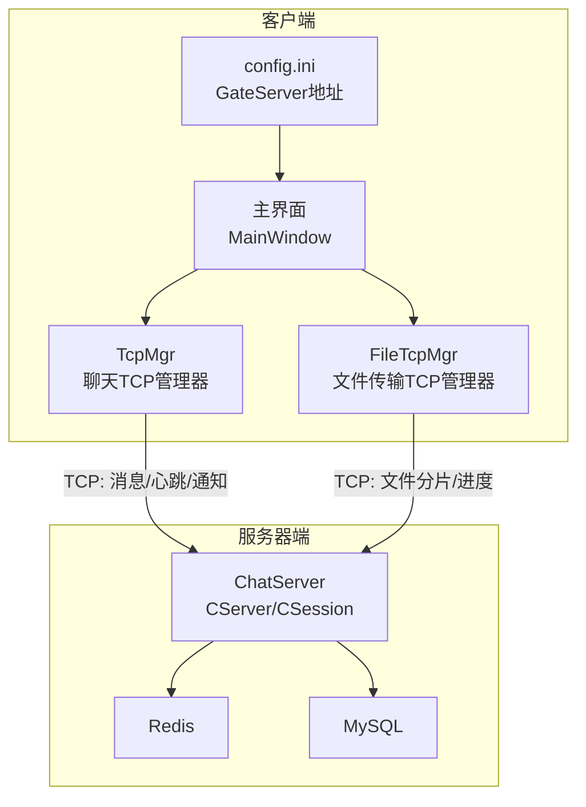
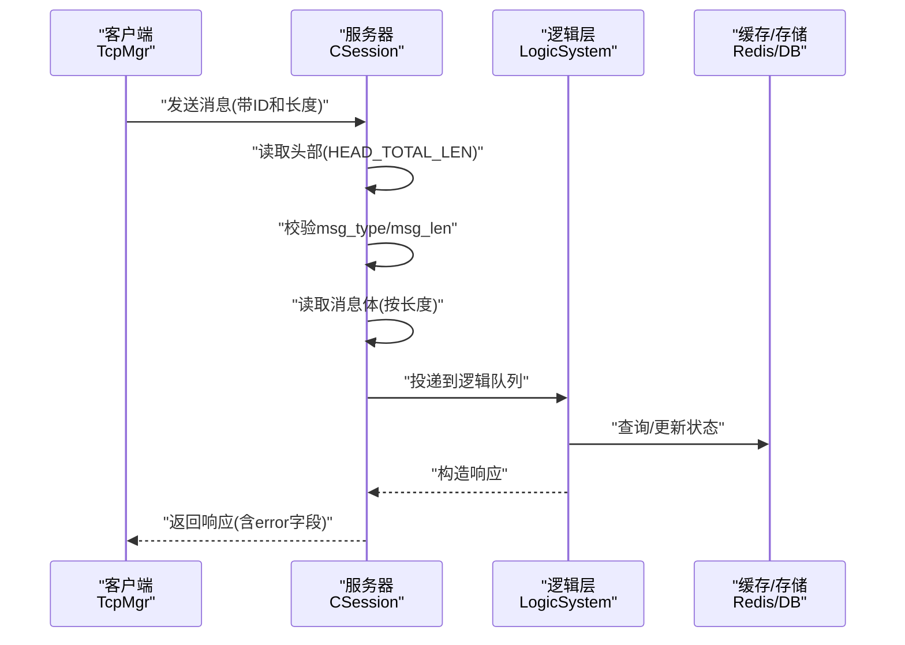
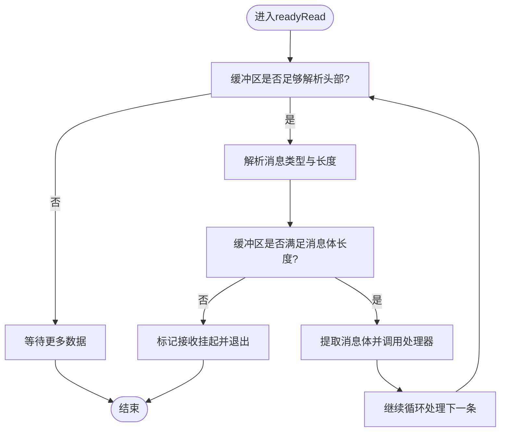
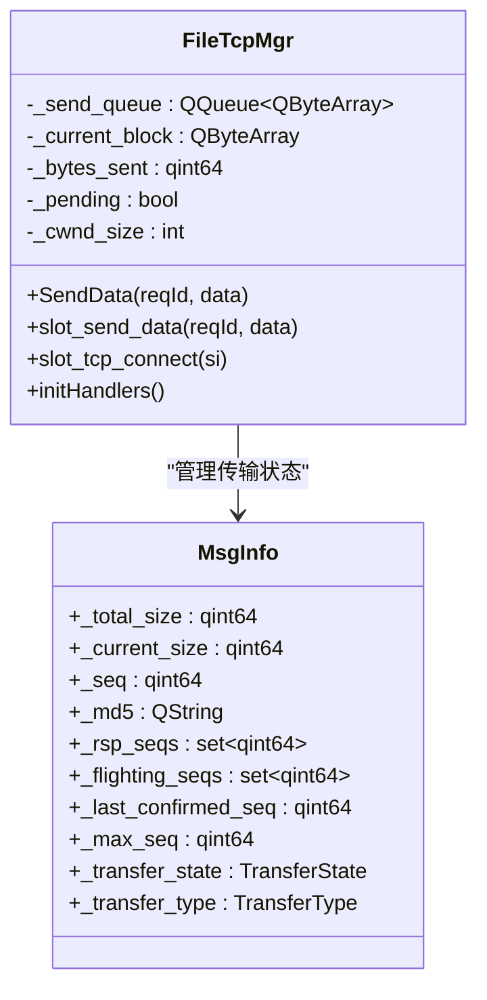
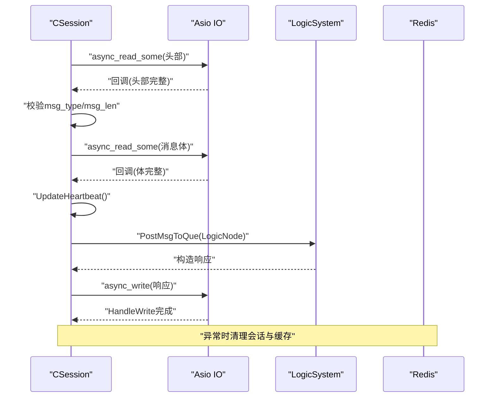
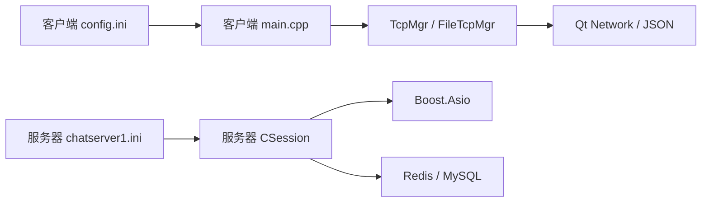

# 网络连接问题

<cite>
**本文引用的文件**   
- [tcpmgr.h](file://client/llfcchat/include/tcpmgr.h)
- [tcpmgr.cpp](file://client/llfcchat/src/tcpmgr.cpp)
- [filetcpmgr.h](file://client/llfcchat/include/filetcpmgr.h)
- [filetcpmgr.cpp](file://client/llfcchat/src/filetcpmgr.cpp)
- [global.h](file://client/llfcchat/include/global.h)
- [CSession.h](file://server/ChatServer/include/CSession.h)
- [CSession.cpp](file://server/ChatServer/src/CSession.cpp)
- [const.h](file://server/ChatServer/include/const.h)
- [config.ini](file://client/llfcchat/config/config.ini)
- [chatserver1.ini](file://server/ChatServer/config/chatserver1.ini)
- [main.cpp](file://client/llfcchat/src/main.cpp)
</cite>

## 目录
1. [简介](#简介)
2. [项目结构](#项目结构)
3. [核心组件](#核心组件)
4. [架构总览](#架构总览)
5. [详细组件分析](#详细组件分析)
6. [依赖关系分析](#依赖关系分析)
7. [性能考量](#性能考量)
8. [故障排查指南](#故障排查指南)
9. [结论](#结论)
10. [附录](#附录)

## 简介
本文件面向LLFCChat的网络连接问题，提供从客户端到服务器的端到端排障指南。重点覆盖：
- TCP连接失败的常见原因与解决方法（连接超时、连接被拒绝、主机名解析失败等）
- 客户端TcpManager的连接管理逻辑（重连机制、发送队列、粘包处理、错误处理）
- 服务器端CSession会话管理问题（会话断开、心跳超时、消息粘包/半包）诊断方法
- 网络调试工具使用（抓包、端口检测、防火墙检查）
- 常见错误码与解决方案
- 生产环境快速定位技巧

## 项目结构
本项目采用多进程/多服务架构：
- 客户端（Qt）通过TCP与聊天服务器通信，另有一个独立的文件传输通道
- 服务器端基于Boost.Asio实现高并发IO，包含会话管理、心跳、离线通知、消息分发等
- 配置分离：客户端GateServer地址、服务器监听端口、RPC端口、数据库与Redis等

图表来源
- [main.cpp:1-44](file://client/llfcchat/src/main.cpp#L1-L44)
- [config.ini:1-4](file://client/llfcchat/config/config.ini#L1-L4)
- [tcpmgr.h:1-90](file://client/llfcchat/include/tcpmgr.h#L1-L90)
- [filetcpmgr.h:1-85](file://client/llfcchat/include/filetcpmgr.h#L1-L85)
- [CSession.h:1-86](file://server/ChatServer/include/CSession.h#L1-L86)

章节来源
- [main.cpp:1-44](file://client/llfcchat/src/main.cpp#L1-L44)
- [config.ini:1-4](file://client/llfcchat/config/config.ini#L1-L4)

## 核心组件
- 客户端TcpMgr：负责聊天消息的TCP连接、粘包/半包解析、发送队列、错误信号上报
- 客户端FileTcpMgr：负责文件上传/下载的分片、断点续传、拥塞窗口控制、进度回调
- 服务器CSession：基于Asio的异步读写、头部+体协议解析、心跳更新、异常会话清理、离线通知
- 全局常量与协议ID：定义消息类型、错误码、最大长度、拥塞窗口等

章节来源
- [tcpmgr.h:1-90](file://client/llfcchat/include/tcpmgr.h#L1-L90)
- [tcpmgr.cpp:1-137](file://client/llfcchat/src/tcpmgr.cpp#L1-L137)
- [filetcpmgr.h:1-85](file://client/llfcchat/include/filetcpmgr.h#L1-L85)
- [filetcpmgr.cpp:1-143](file://client/llfcchat/src/filetcpmgr.cpp#L1-L143)
- [CSession.h:1-86](file://server/ChatServer/include/CSession.h#L1-L86)
- [CSession.cpp:1-191](file://server/ChatServer/src/CSession.cpp#L1-L191)
- [global.h:1-296](file://client/llfcchat/include/global.h#L1-L296)
- [const.h:1-104](file://server/ChatServer/include/const.h#L1-L104)

## 架构总览
下图展示一次典型的消息收发流程，包括客户端发送、服务器接收、业务处理与回包。

图表来源
- [tcpmgr.cpp:18-55](file://client/llfcchat/src/tcpmgr.cpp#L18-L55)
- [CSession.cpp:130-191](file://server/ChatServer/src/CSession.cpp#L130-L191)
- [const.h:38-46](file://server/ChatServer/include/const.h#L38-L46)

## 详细组件分析

### 客户端TcpMgr连接管理与错误处理
- 连接建立后触发成功信号；readyRead中循环解析头部与消息体，处理粘包/半包
- bytesWritten驱动发送队列，避免阻塞UI线程
- error事件分类处理：连接被拒绝、远程关闭、主机未找到、超时、网络错误等
- disconnected事件通知上层进行重连或提示

图表来源
- [tcpmgr.cpp:18-55](file://client/llfcchat/src/tcpmgr.cpp#L18-L55)

章节来源
- [tcpmgr.cpp:18-137](file://client/llfcchat/src/tcpmgr.cpp#L18-L137)

### 客户端FileTcpMgr文件传输与拥塞控制
- 独立TCP通道用于大文件传输，支持分片、序列号确认、断点续传
- 拥塞窗口_cwnd_size限制并发分片数量，避免拥塞
- 下载时根据seq决定覆盖或追加写入，完成时触发完成信号
- 上传时维护已确认序列集合，计算最后确认序列推进进度

图表来源
- [filetcpmgr.h:26-82](file://client/llfcchat/include/filetcpmgr.h#L26-L82)
- [global.h:167-199](file://client/llfcchat/include/global.h#L167-L199)

章节来源
- [filetcpmgr.cpp:16-143](file://client/llfcchat/src/filetcpmgr.cpp#L16-L143)
- [global.h:167-199](file://client/llfcchat/include/global.h#L167-L199)

### 服务器CSession会话管理与心跳
- 异步读取头部与消息体，严格校验长度与ID合法性
- 每次收到数据更新_last_heartbeat，定时判断是否过期（>20秒视为心跳超时）
- 写队列保证顺序发送，HandleWrite完成后自动出队并继续发送
- 异常路径统一Close并清理会话，必要时清除Redis中的会话与Token信息

图表来源
- [CSession.cpp:130-191](file://server/ChatServer/src/CSession.cpp#L130-L191)
- [CSession.cpp:285-333](file://server/ChatServer/src/CSession.cpp#L285-L333)

章节来源
- [CSession.cpp:1-191](file://server/ChatServer/src/CSession.cpp#L1-L191)
- [CSession.cpp:285-333](file://server/ChatServer/src/CSession.cpp#L285-L333)

### 协议与错误码
- 客户端与服务器共用消息类型枚举，确保请求/响应匹配
- 错误码统一在JSON中携带error字段，便于解析与提示
- 服务器侧对非法msg_type/msg_len直接清理会话，防止资源泄露

章节来源
- [global.h:43-95](file://client/llfcchat/include/global.h#L43-L95)
- [const.h:5-20](file://server/ChatServer/include/const.h#L5-L20)

## 依赖关系分析
- 客户端依赖Qt网络模块与JSON解析库
- 服务器依赖Boost.Asio、gRPC、Redis、MySQL
- 配置文件分别位于客户端与服务端，启动时加载

图表来源
- [main.cpp:1-44](file://client/llfcchat/src/main.cpp#L1-L44)
- [config.ini:1-4](file://client/llfcchat/config/config.ini#L1-L4)
- [chatserver1.ini:1-30](file://server/ChatServer/config/chatserver1.ini#L1-L30)

章节来源
- [main.cpp:1-44](file://client/llfcchat/src/main.cpp#L1-L44)
- [config.ini:1-4](file://client/llfcchat/config/config.ini#L1-L4)
- [chatserver1.ini:1-30](file://server/ChatServer/config/chatserver1.ini#L1-L30)

## 性能考量
- 客户端发送队列与bytesWritten回调避免阻塞UI线程，提升吞吐
- 服务器异步IO模型减少上下文切换，提高并发能力
- 文件传输拥塞窗口限制并发分片，降低网络拥塞风险
- 心跳间隔与超时阈值需平衡实时性与资源占用

[本节为通用指导，不直接分析具体文件]

## 故障排查指南

### 常见问题与解决
- 连接超时
  - 现象：error事件触发SocketTimeoutError，sig_con_success(false)
  - 排查：检查目标主机可达性、端口开放、防火墙规则、DNS解析
  - 解决：调整超时时间、检查网关与代理设置、确认服务端监听地址
- 连接被拒绝
  - 现象：ConnectionRefusedError
  - 排查：服务端进程是否运行、端口是否正确、IP绑定是否为0.0.0.0
  - 解决：启动服务、修正端口、检查iptables/Windows防火墙
- 主机名解析失败
  - 现象：HostNotFoundError
  - 排查：DNS配置、hosts文件、域名有效性
  - 解决：更换为IP直连、修复DNS、添加正确映射
- 粘包/半包
  - 现象：消息体长度不一致、解析失败
  - 排查：客户端/服务器头体协议一致性、字节序、长度字段类型
  - 解决：统一HEAD_TOTAL_LEN与HEAD_DATA_LEN、确保网络字节序转换
- 心跳超时
  - 现象：服务器IsHeartbeatExpired返回true，会话被清理
  - 排查：客户端是否定期发送心跳、网络延迟是否过大
  - 解决：缩短心跳间隔、优化网络、增加重试策略

章节来源
- [tcpmgr.cpp:64-91](file://client/llfcchat/src/tcpmgr.cpp#L64-L91)
- [filetcpmgr.cpp:65-93](file://client/llfcchat/src/filetcpmgr.cpp#L65-L93)
- [CSession.cpp:285-293](file://server/ChatServer/src/CSession.cpp#L285-L293)

### 网络调试工具使用
- 抓包分析
  - 工具：Wireshark、tcpdump
  - 步骤：捕获本地回环或网卡流量，过滤端口（如8090），查看握手与报文结构
- 端口检测
  - 工具：netstat、ss、telnet、nc
  - 步骤：检查端口监听状态、连通性测试
- 防火墙检查
  - Windows：控制面板/高级安全Windows防火墙
  - Linux：iptables、firewalld
  - 步骤：放行入站/出站规则，验证策略生效

[本节为通用指导，不直接分析具体文件]

### 常见错误码与解决方案
- 客户端错误码
  - SUCCESS=0：操作成功
  - ERR_JSON=1：JSON解析失败
  - ERR_NETWORK=2：网络错误
- 服务器错误码
  - Success=0：成功
  - Error_Json=1001：JSON解析错误
  - RPCFailed=1002：RPC请求错误
  - TokenInvalid=1010：Token失效
  - UidInvalid=1011：uid无效
- 解决方案
  - 检查JSON结构与字段完整性
  - 校验Token有效期与用户状态
  - 核对UID合法性与权限

章节来源
- [global.h:91-95](file://client/llfcchat/include/global.h#L91-L95)
- [const.h:5-20](file://server/ChatServer/include/const.h#L5-L20)

### 生产环境快速定位技巧
- 日志采集
  - 客户端：启用qDebug输出，集中收集错误事件
  - 服务器：记录CSession异常路径与ClearSession调用
- 指标监控
  - 连接数、心跳成功率、消息延迟、队列长度
- 快速恢复
  - 重启服务、清理僵尸会话、重置Redis键值
  - 客户端重连策略：指数退避、上限次数

[本节为通用指导，不直接分析具体文件]

## 结论
通过对客户端TcpMgr与服务器CSession的分析，明确了连接管理、粘包处理、心跳机制与错误处理的关键点。结合网络调试工具与错误码体系，可高效定位与解决LLFCChat的网络问题。建议在生产环境中完善监控与告警，持续优化心跳与重连策略，保障用户体验与系统稳定性。

[本节为总结性内容，不直接分析具体文件]

## 附录
- 配置示例
  - 客户端GateServer地址：host=localhost, port=8080
  - 服务器监听端口：SelfServer.Port=8090，RPCPort=50055
- 关键常量
  - 客户端文件上传包头长度：FILE_UPLOAD_HEAD_LEN=6
  - 服务器头部总长度：HEAD_TOTAL_LEN=4，头部类型长度：HEAD_TYPE_LEN=2，头部数据长度：HEAD_DATA_LEN=2

章节来源
- [config.ini:1-4](file://client/llfcchat/config/config.ini#L1-L4)
- [chatserver1.ini:1-30](file://server/ChatServer/config/chatserver1.ini#L1-L30)
- [global.h:15-24](file://client/llfcchat/include/global.h#L15-L24)
- [const.h:38-46](file://server/ChatServer/include/const.h#L38-L46)