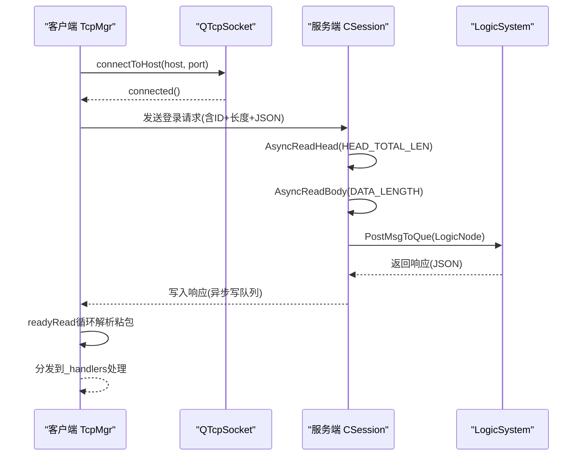
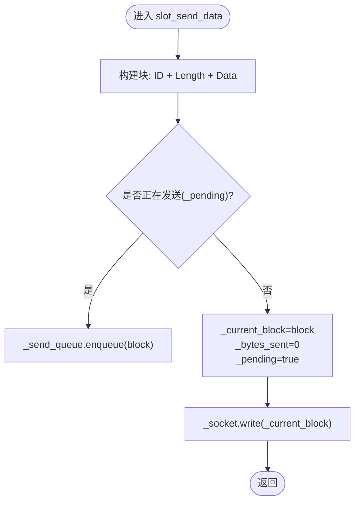
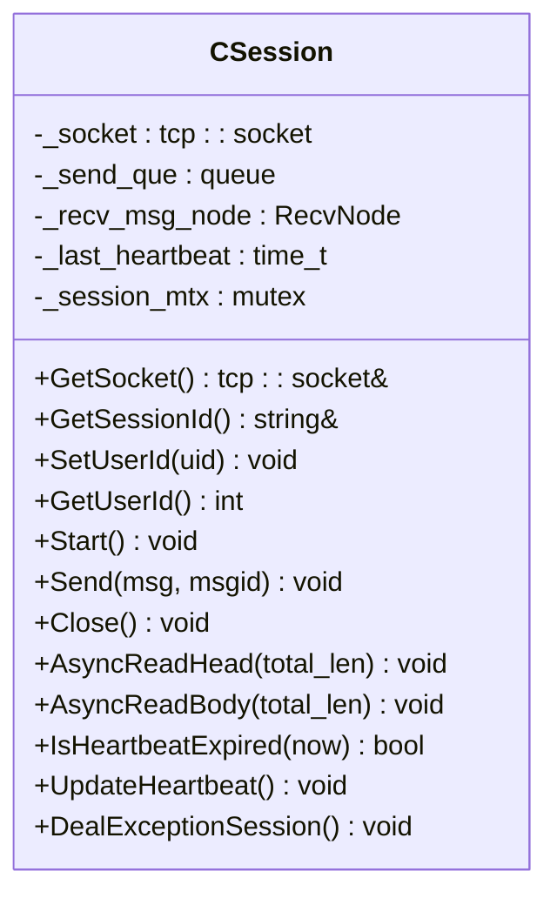
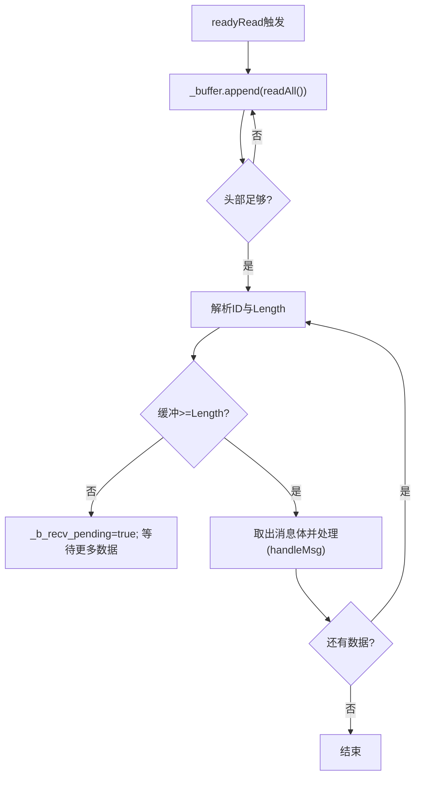
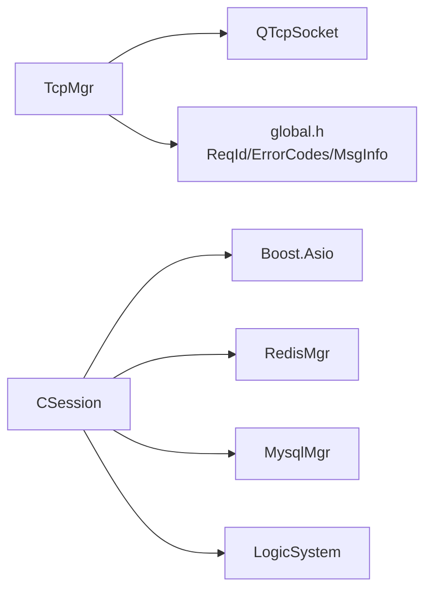

# 网络问题排查

<cite>
**本文引用的文件**
- [tcpmgr.h](file://client/llfcchat/include/tcpmgr.h)
- [tcpmgr.cpp](file://client/llfcchat/src/tcpmgr.cpp)
- [CSession.h](file://server/ChatServer/include/CSession.h)
- [CSession.cpp](file://server/ChatServer/src/CSession.cpp)
- [global.h](file://client/llfcchat/include/global.h)
- [config.ini（客户端）](file://client/llfcchat/config/config.ini)
- [chatserver1.ini](file://server/ChatServer/config/chatserver1.ini)
- [config.ini（网关）](file://server/GateServer/config/config.ini)
</cite>

## 目录
1. [简介](#简介)
2. [项目结构](#项目结构)
3. [核心组件](#核心组件)
4. [架构总览](#架构总览)
5. [详细组件分析](#详细组件分析)
6. [依赖关系分析](#依赖关系分析)
7. [性能与稳定性考量](#性能与稳定性考量)
8. [故障排查指南](#故障排查指南)
9. [结论](#结论)
10. [附录：日志定位与调试技巧](#附录日志定位与调试技巧)

## 简介
本文件面向LLFCChat项目的网络层问题排查，聚焦以下常见场景：TCP连接失败、连接超时、粘包处理、异常断开与重连。文档从客户端TcpMgr的连接管理与发送队列、服务器端CSession的会话生命周期、心跳检测与异常清理等角度进行深度剖析，并提供环境配置检查、防火墙与端口占用排查方法，以及基于现有代码的日志定位与调试建议，帮助开发者快速定位并解决网络相关问题。

## 项目结构
本项目包含客户端与服务端两部分：
- 客户端使用Qt网络库实现TCP通信，核心为TcpMgr类，负责连接管理、粘包处理、消息分发与发送队列。
- 服务端采用Boost.Asio实现高并发TCP服务，核心为CSession类，负责读写协议头/体、异步收发、心跳维护与异常会话清理。

```mermaid
graph TB
subgraph "客户端"
UI["界面层"] --> TCPMGR["TcpMgr<br/>连接/粘包/发送队列"]
TCPMGR --> QTCP["QTcpSocket"]
end
subgraph "服务端"
ASIO["Asio IO线程池"] --> CSESSION["CSession<br/>会话/心跳/异常处理"]
CSESSION --> LOGIC["LogicSystem<br/>业务逻辑"]
CSESSION --> REDIS["RedisMgr<br/>分布式锁/状态"]
CSESSION --> MYSQL["MysqlMgr<br/>持久化"]
end
QTCP < --> CSESSION
```

**图表来源**
- [tcpmgr.h:22-87](file://client/llfcchat/include/tcpmgr.h#L22-L87)
- [tcpmgr.cpp:103-136](file://client/llfcchat/src/tcpmgr.cpp#L103-L136)
- [CSession.h:28-76](file://server/ChatServer/include/CSession.h#L28-L76)
- [CSession.cpp:42-44](file://server/ChatServer/src/CSession.cpp#L42-L44)

**章节来源**
- [tcpmgr.h:22-87](file://client/llfcchat/include/tcpmgr.h#L22-L87)
- [CSession.h:28-76](file://server/ChatServer/include/CSession.h#L28-L76)

## 核心组件
- 客户端TcpMgr
  - 职责：建立/关闭连接、接收数据粘包解析、消息路由到处理器、发送队列与半包发送控制、错误信号上报。
  - 关键成员：_socket、_buffer、_send_queue、_current_block、_bytes_sent、_pending、_handlers。
  - 关键槽函数：slot_tcp_connect、slot_send_data、slot_tcp_close；信号：sig_con_success、sig_connection_closed等。
- 服务器端CSession
  - 职责：会话生命周期管理、协议头/体异步读取、发送队列与异步写、心跳更新与过期检测、异常会话清理。
  - 关键方法：Start、AsyncReadHead、AsyncReadBody、Send、Close、IsHeartbeatExpired、UpdateHeartbeat、DealExceptionSession。

**章节来源**
- [tcpmgr.h:22-87](file://client/llfcchat/include/tcpmgr.h#L22-L87)
- [tcpmgr.cpp:10-136](file://client/llfcchat/src/tcpmgr.cpp#L10-L136)
- [CSession.h:28-76](file://server/ChatServer/include/CSession.h#L28-L76)
- [CSession.cpp:42-44](file://server/ChatServer/src/CSession.cpp#L42-L44)

## 架构总览
客户端与服务端通过固定格式的TCP协议交互：头部包含消息ID与长度，随后是消息体（通常为JSON）。客户端在readyRead中循环解析，服务端按HEAD_TOTAL_LEN与DATA_LENGTH分阶段读取，确保粘包/半包正确处理。



**图表来源**
- [tcpmgr.cpp:18-55](file://client/llfcchat/src/tcpmgr.cpp#L18-L55)
- [CSession.cpp:133-194](file://server/ChatServer/src/CSession.cpp#L133-L194)
- [CSession.cpp:90-131](file://server/ChatServer/src/CSession.cpp#L90-L131)

## 详细组件分析

### 客户端TcpMgr：连接管理与粘包处理
- 连接建立与错误处理
  - 监听connected/disconnected/error事件，上报成功/失败信号，便于上层UI反馈。
  - 对ConnectionRefusedError、RemoteHostClosedError、HostNotFoundError、SocketTimeoutError等进行分类处理。
- 粘包解析
  - 在readyRead中持续读取所有可用数据追加到_buffer。
  - 先解析头部（消息ID与长度），再判断剩余缓冲是否满足消息体长度，不足则等待更多数据。
  - 解析完成后调用handleMsg分发到对应处理器。
- 发送队列与半包发送
  - slot_send_data将消息封装为“ID+长度+数据”块，若正在发送则入队；否则设置为当前块并write。
  - bytesWritten回调累计已写字节，未写完继续写；写完则出队下一块或重置状态。
- 消息处理器
  - initHandlers注册各类ReqId对应的处理lambda，统一解析JSON并转发信号给UI。



**图表来源**
- [tcpmgr.cpp:1044-1079](file://client/llfcchat/src/tcpmgr.cpp#L1044-L1079)

**章节来源**
- [tcpmgr.cpp:18-55](file://client/llfcchat/src/tcpmgr.cpp#L18-L55)
- [tcpmgr.cpp:103-136](file://client/llfcchat/src/tcpmgr.cpp#L103-L136)
- [tcpmgr.cpp:1044-1079](file://client/llfcchat/src/tcpmgr.cpp#L1044-L1079)
- [tcpmgr.cpp:182-987](file://client/llfcchat/src/tcpmgr.cpp#L182-L987)

### 服务器端CSession：会话生命周期与心跳
- 会话启动与读流程
  - Start调用AsyncReadHead读取固定长度的头部，解析msg_id与msg_len后进入AsyncReadBody读取消息体。
  - 读取完成后更新心跳时间，投递到LogicSystem处理，再回到头部读取。
- 发送与写队列
  - Send将消息节点推入_send_que，若队列为空则立即发起async_write；HandleWrite完成后再出队继续写。
- 心跳与异常处理
  - UpdateHeartbeat每次收到数据时更新时间戳；IsHeartbeatExpired判断是否超过阈值（如20秒）。
  - DealExceptionSession加分布式锁清理会话、删除用户相关缓存（session、token、IP映射等），避免僵尸会话。



**图表来源**
- [CSession.h:28-76](file://server/ChatServer/include/CSession.h#L28-L76)
- [CSession.cpp:42-44](file://server/ChatServer/src/CSession.cpp#L42-L44)
- [CSession.cpp:90-131](file://server/ChatServer/src/CSession.cpp#L90-L131)
- [CSession.cpp:196-220](file://server/ChatServer/src/CSession.cpp#L196-L220)
- [CSession.cpp:288-336](file://server/ChatServer/src/CSession.cpp#L288-L336)

**章节来源**
- [CSession.cpp:133-194](file://server/ChatServer/src/CSession.cpp#L133-L194)
- [CSession.cpp:90-131](file://server/ChatServer/src/CSession.cpp#L90-L131)
- [CSession.cpp:196-220](file://server/ChatServer/src/CSession.cpp#L196-L220)
- [CSession.cpp:288-336](file://server/ChatServer/src/CSession.cpp#L288-L336)

### 协议与粘包处理要点
- 客户端发送格式：QDataStream以BigEndian写入ID与长度，随后拼接数据体。
- 客户端接收解析：先校验头部长度，再根据长度截取消息体，循环处理直到缓冲不足。
- 服务端读取：严格HEAD_TOTAL_LEN与DATA_LENGTH分段读取，长度不匹配即关闭会话并清理。



**图表来源**
- [tcpmgr.cpp:18-55](file://client/llfcchat/src/tcpmgr.cpp#L18-L55)

**章节来源**
- [tcpmgr.cpp:18-55](file://client/llfcchat/src/tcpmgr.cpp#L18-L55)
- [global.h:43-88](file://client/llfcchat/include/global.h#L43-L88)

## 依赖关系分析
- 客户端依赖
  - Qt网络库（QTcpSocket）、QThread（TcpThread）、QTimer（可选）、QJsonDocument（消息解析）。
  - 全局类型定义（ReqId、ErrorCodes、MsgInfo等）用于消息标识与传输状态。
- 服务端依赖
  - Boost.Asio（网络IO）、JSON库（消息序列化）、Redis/Mysql（状态与持久化）、分布式锁（异常清理）。



**图表来源**
- [tcpmgr.h:22-87](file://client/llfcchat/include/tcpmgr.h#L22-L87)
- [global.h:43-88](file://client/llfcchat/include/global.h#L43-L88)
- [CSession.h:28-76](file://server/ChatServer/include/CSession.h#L28-L76)

**章节来源**
- [tcpmgr.h:22-87](file://client/llfcchat/include/tcpmgr.h#L22-L87)
- [global.h:43-88](file://client/llfcchat/include/global.h#L43-L88)
- [CSession.h:28-76](file://server/ChatServer/include/CSession.h#L28-L76)

## 性能与稳定性考量
- 发送队列与背压
  - 客户端使用_send_queue与_pending标志避免阻塞式写；服务端_send_que限制最大长度防止内存膨胀。
- 粘包与半包
  - 客户端循环解析减少系统调用次数；服务端严格长度校验避免越界与资源浪费。
- 心跳与超时
  - 服务端每收到数据更新_last_heartbeat，定时检测过期会话，及时释放资源。
- 错误恢复
  - 客户端error事件分类处理，必要时可结合上层重连策略；服务端异常路径统一清理会话与缓存。

[本节为通用指导，不直接分析具体文件]

## 故障排查指南

### 常见问题与定位步骤
- TCP连接失败
  - 现象：connected未触发，error事件报ConnectionRefusedError或HostNotFoundError。
  - 排查：
    - 检查客户端配置host/port是否正确（参考客户端config.ini）。
    - 确认服务端进程监听端口与地址（参考ChatServer配置）。
    - 使用ping/traceroute/nslookup验证网络可达性与DNS解析。
    - 检查防火墙/安全组规则是否放行端口。
- 连接超时
  - 现象：SocketTimeoutError或长时间无connected。
  - 排查：
    - 检查网络延迟与丢包情况。
    - 确认服务端是否过载或IO阻塞。
    - 调整客户端连接超时参数（若框架支持）。
- 粘包/半包导致解析失败
  - 现象：readyRead中头部解析正常但body长度不匹配或解析为空。
  - 排查：
    - 核对客户端发送的ID与Length是否与协议一致（BigEndian）。
    - 检查服务端HEAD_TOTAL_LEN与DATA_LENGTH常量是否匹配。
    - 打印_buffer内容与截取位置，确认循环解析逻辑。
- 连接异常断开
  - 现象：disconnected触发或error事件RemoteHostClosedError。
  - 排查：
    - 查看服务端日志是否有read length not match或invalid msg_id/data length。
    - 检查心跳是否过期（IsHeartbeatExpired阈值）。
    - 确认分布式锁与Redis键值是否被正确清理。

**章节来源**
- [tcpmgr.cpp:64-91](file://client/llfcchat/src/tcpmgr.cpp#L64-L91)
- [tcpmgr.cpp:18-55](file://client/llfcchat/src/tcpmgr.cpp#L18-L55)
- [CSession.cpp:133-194](file://server/ChatServer/src/CSession.cpp#L133-L194)
- [CSession.cpp:288-336](file://server/ChatServer/src/CSession.cpp#L288-L336)

### 环境因素排查清单
- 网络配置
  - 客户端config.ini中的GateServer host/port需与实际网关一致。
  - ChatServer的SelfServer Host/Port需绑定到期望接口（如0.0.0.0）。
- 防火墙与安全组
  - 放行客户端到服务端的TCP端口（如8090、9090、5005x等）。
  - 检查本地Windows防火墙或Linux iptables/firewalld规则。
- 端口占用
  - 使用netstat/listen命令检查端口是否被其他进程占用。
  - 避免多实例冲突，确保每个服务端口唯一。

**章节来源**
- [config.ini（客户端）:1-4](file://client/llfcchat/config/config.ini#L1-L4)
- [chatserver1.ini:1-30](file://server/ChatServer/config/chatserver1.ini#L1-L30)
- [config.ini（网关）:1-25](file://server/GateServer/config/config.ini#L1-L25)

## 结论
通过深入分析客户端TcpMgr与服务端CSession的实现，可以明确网络层的关键点在于：稳定的连接管理、严格的粘包处理、可靠的发送队列与心跳机制。结合日志分析与环境排查，能够快速定位并解决常见的TCP连接失败、超时、粘包与异常断开问题。建议在开发过程中增加更详细的日志输出与监控指标，进一步提升问题定位效率。

[本节为总结性内容，不直接分析具体文件]

## 附录：日志定位与调试技巧
- 客户端关键日志点
  - 连接事件：connected/disconnected/error（打印错误码与描述）。
  - 接收数据：readyRead中打印_message_id、_message_len与_body片段。
  - 发送过程：bytesWritten回调打印已写字节与队列状态。
- 服务端关键日志点
  - 头部解析：打印msg_id与msg_len，校验合法性。
  - 读取长度：记录实际读取字节数与预期长度差异。
  - 心跳过期：打印_session_id与过期时间差。
  - 异常清理：打印分布式锁获取与释放、Redis键删除操作。
- 调试工具
  - Wireshark抓包分析TCP握手、粘包与重传。
  - 使用strace/ltrace跟踪系统调用（Linux）。
  - 在关键路径添加断点与变量监视（IDE调试器）。

**章节来源**
- [tcpmgr.cpp:18-55](file://client/llfcchat/src/tcpmgr.cpp#L18-L55)
- [tcpmgr.cpp:103-136](file://client/llfcchat/src/tcpmgr.cpp#L103-L136)
- [CSession.cpp:133-194](file://server/ChatServer/src/CSession.cpp#L133-L194)
- [CSession.cpp:288-336](file://server/ChatServer/src/CSession.cpp#L288-L336)