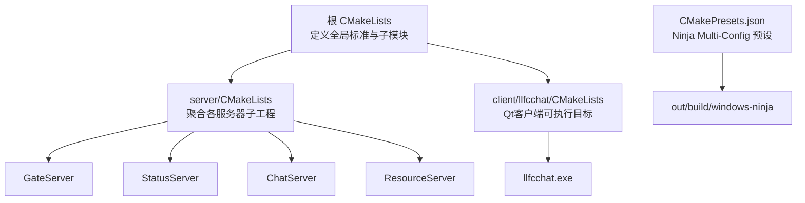
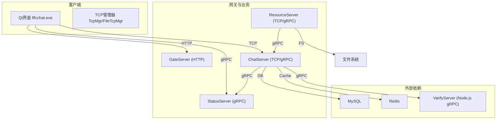
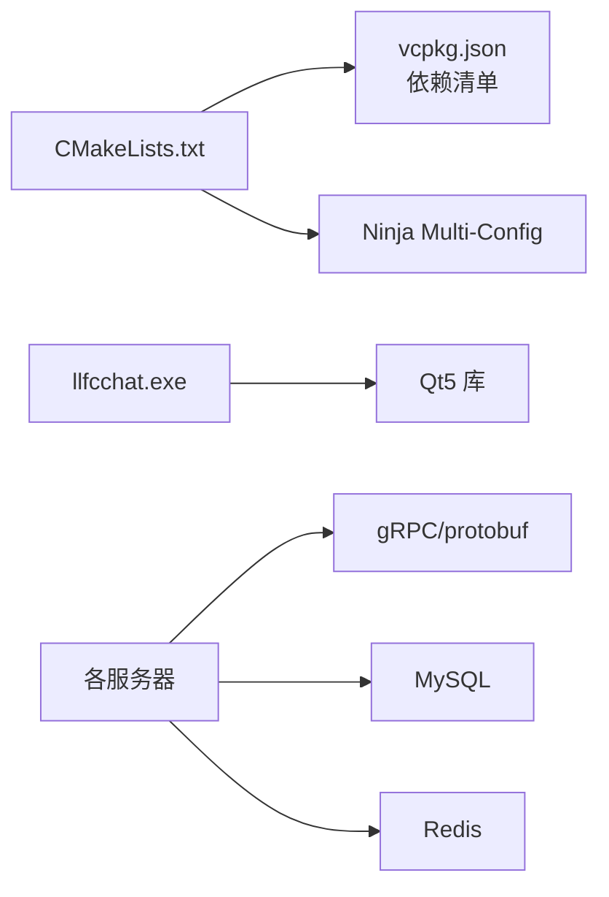

# 调试工具和技巧

<cite>
**本文引用的文件**   
- [CMakeLists.txt](file://CMakeLists.txt)
- [CMakePresets.json](file://CMakePresets.json)
- [AGENTS.md](file://AGENTS.md)
- [client/llfcchat/CMakeLists.txt](file://client/llfcchat/CMakeLists.txt)
- [client/llfcchat/config/config.ini](file://client/llfcchat/config/config.ini)
- [server/GateServer/config/config.ini](file://server/GateServer/config/config.ini)
- [server/ChatServer/config/chatserver1.ini](file://server/ChatServer/config/chatserver1.ini)
- [client/llfcchat/src/main.cpp](file://client/llfcchat/src/main.cpp)
- [开发文档/day07-visualstudio配置grpc.md](file://开发文档/day07-visualstudio配置grpc.md)
- [开发文档/day09-redis服务搭建.md](file://开发文档/day09-redis服务搭建.md)
- [开发文档/day15-客户端Tcp管理类设计.md](file://开发文档/day15-客户端Tcp管理类设计.md)
- [开发文档/day34多服程踢人逻辑.md](file://开发文档/day34多服程踢人逻辑.md)
- [开发文档/day41-通知客户端异步下载聊天图片.md](file://开发文档/day41-通知客户端异步下载聊天图片.md)
- [.gitignore](file://.gitignore)
- [server/ChatServer/include/MysqlDao.h](file://server/ChatServer/include/MysqlDao.h)
- [server/ResourceServer/src/LogicSystem.cpp](file://server/ResourceServer/src/LogicSystem.cpp)
- [client/llfcchat/src/filetcpmgr.cpp](file://client/llfcchat/src/filetcpmgr.cpp)
- [client/llfcchat/src/tcpmgr.cpp](file://client/llfcchat/src/tcpmgr.cpp)
</cite>

## 目录
1. [简介](#简介)
2. [项目结构](#项目结构)
3. [核心组件](#核心组件)
4. [架构总览](#架构总览)
5. [详细组件分析](#详细组件分析)
6. [依赖分析](#依赖分析)
7. [性能考虑](#性能考虑)
8. [故障排查指南](#故障排查指南)
9. [结论](#结论)
10. [附录](#附录)

## 简介
本指南面向LLFCChat项目的开发与运维人员，系统化整理调试工具与技巧，覆盖：
- Visual Studio调试器设置、断点与变量监视
- 日志系统配置与使用（级别、轮转、关键信息输出规范）
- 网络调试（Wireshark抓包、HTTP请求调试、gRPC接口测试）
- 内存与性能分析（Valgrind、性能剖析、线程分析）
- 常见调试场景（死锁、内存泄漏、并发问题）
- 生产环境远程调试方法与注意事项

## 项目结构
本项目采用CMake + vcpkg构建，包含多个服务器进程与Qt客户端。根级CMakeLists统一入口，子模块分别管理各自依赖与生成规则；CMakePresets提供Windows Ninja Multi-Config的标准化配置与构建预设。

**图表来源** 
- [CMakeLists.txt:1-33](file://CMakeLists.txt#L1-L33)
- [client/llfcchat/CMakeLists.txt:167-173](file://client/llfcchat/CMakeLists.txt#L167-L173)
- [CMakePresets.json:1-35](file://CMakePresets.json#L1-L35)

**章节来源**
- [CMakeLists.txt:1-33](file://CMakeLists.txt#L1-L33)
- [client/llfcchat/CMakeLists.txt:1-32](file://client/llfcchat/CMakeLists.txt#L1-L32)
- [CMakePresets.json:1-35](file://CMakePresets.json#L1-L35)
- [AGENTS.md:1-51](file://AGENTS.md#L1-L51)

## 核心组件
- 构建与运行
  - 使用Ninja Multi-Config生成器，Debug/Release双配置
  - vcpkg清单模式，triplet为x64-windows-static-md
  - 输出路径约定在 out/run/<Config>/...
- 客户端
  - Qt GUI应用，读取config.ini获取GateServer地址前缀
  - TCP通信用于聊天消息，FileTcpMgr用于大文件分片传输
- 服务器
  - GateServer：HTTP入口，转发至内部服务
  - ChatServer：聊天业务，支持分布式踢人与会话管理
  - StatusServer：状态服务
  - ResourceServer：资源服务（文件上传/下载）

**章节来源**
- [AGENTS.md:14-44](file://AGENTS.md#L14-L44)
- [client/llfcchat/src/main.cpp:24-34](file://client/llfcchat/src/main.cpp#L24-L34)
- [client/llfcchat/config/config.ini:1-4](file://client/llfcchat/config/config.ini#L1-L4)
- [server/GateServer/config/config.ini:1-25](file://server/GateServer/config/config.ini#L1-L25)
- [server/ChatServer/config/chatserver1.ini:1-30](file://server/ChatServer/config/chatserver1.ini#L1-L30)

## 架构总览
下图展示客户端与各服务的交互关系，以及gRPC与HTTP/TCP的调用边界。

**图表来源** 
- [server/GateServer/config/config.ini:1-25](file://server/GateServer/config/config.ini#L1-L25)
- [server/ChatServer/config/chatserver1.ini:1-30](file://server/ChatServer/config/chatserver1.ini#L1-L30)
- [开发文档/day08-邮箱认证服务.md:405-445](file://开发文档/day08-邮箱认证服务.md#L405-L445)
- [开发文档/day41-通知客户端异步下载聊天图片.md:61-157](file://开发文档/day41-通知客户端异步下载聊天图片.md#L61-L157)

## 详细组件分析

### Visual Studio调试器设置与断点技巧
- 生成器与工具链
  - 固定使用“Ninja Multi-Config”生成器，确保MSVC与Ninja协同工作
  - 通过CMakePresets配置toolchainFile指向vcpkg，便于本地化依赖解析
- 启动参数与工作目录
  - 客户端main中读取config.ini并拼接gate_url_prefix，建议将config.ini置于可执行目录
  - 服务器配置文件位于各自config目录下，运行时需保证路径正确
- 断点与条件断点
  - 在网络收发关键路径（如readyRead、error、bytesWritten）设置断点，观察粘包/半包处理
  - 对gRPC调用前后设置断点，检查请求体与返回码
- 变量监视与日志结合
  - 监视TCP缓冲区长度、消息ID、消息长度字段，验证协议一致性
  - 配合qDebug输出，定位异常分支

**章节来源**
- [CMakePresets.json:1-35](file://CMakePresets.json#L1-L35)
- [client/llfcchat/src/main.cpp:24-34](file://client/llfcchat/src/main.cpp#L24-L34)
- [开发文档/day07-visualstudio配置grpc.md:41-63](file://开发文档/day07-visualstudio配置grpc.md#L41-L63)
- [开发文档/day15-客户端Tcp管理类设计.md:37-132](file://开发文档/day15-客户端Tcp管理类设计.md#L37-L132)

### 日志系统配置与使用
- 日志级别与输出
  - 客户端广泛使用qDebug进行调试输出，建议在Debug构建启用，Release构建关闭或降级
  - 服务器端使用std::cout输出关键错误信息（如数据库连接健康检查失败）
- 日志文件与轮转
  - .gitignore忽略*.log，建议按服务划分日志目录，实现按大小/时间轮转
  - 关键事件（登录、踢人、文件传输进度）应记录结构化日志（含用户ID、会话ID、时间戳）
- 关键信息输出规范
  - 网络层：记录消息ID、长度、方向（收/发）、错误码
  - 业务层：记录操作结果、耗时、上游服务响应码
  - 数据层：记录SQL语句摘要、影响行数、异常堆栈

**章节来源**
- [.gitignore:53-54](file://.gitignore#L53-L54)
- [server/ChatServer/include/MysqlDao.h:42-100](file://server/ChatServer/include/MysqlDao.h#L42-L100)
- [client/llfcchat/src/filetcpmgr.cpp:74-100](file://client/llfcchat/src/filetcpmgr.cpp#L74-L100)
- [client/llfcchat/src/tcpmgr.cpp:641-673](file://client/llfcchat/src/tcpmgr.cpp#L641-L673)

### 网络调试工具使用方法
- Wireshark抓包分析
  - 过滤HTTP端口（默认8080）与gRPC端口（如50051/50052），查看握手与请求体
  - 针对TCP粘包问题，关注连续数据包长度与协议头解析是否一致
- HTTP请求调试
  - 使用浏览器开发者工具或curl发送GET/POST，验证JSON格式与字段完整性
  - GateServer配置中明确Host/Port，确保请求路由到正确服务
- gRPC接口测试
  - 使用grpcurl或自定义Stub发起调用，检查Status.ok()与错误码
  - 连接池复用与归还逻辑需在断点处验证，避免连接泄露

**章节来源**
- [server/GateServer/config/config.ini:1-25](file://server/GateServer/config/config.ini#L1-L25)
- [开发文档/day08-邮箱认证服务.md:405-445](file://开发文档/day08-邮箱认证服务.md#L405-L445)
- [开发文档/day41-通知客户端异步下载聊天图片.md:61-157](file://开发文档/day41-通知客户端异步下载聊天图片.md#L61-L157)

### 内存分析与性能分析
- Valgrind内存检测
  - 在Linux环境下编译后运行valgrind --leak-check=full，定位未释放内存与越界访问
  - Windows下可使用Visual Studio诊断工具（内存快照、CPU采样）
- 性能剖析工具
  - VS内置性能分析（CPU/内存/IO），识别热点函数与阻塞点
  - 针对网络I/O与序列化（JSON/Protobuf）进行采样，优化编解码路径
- 线程分析工具
  - 使用线程视图观察线程创建/销毁、同步原语（mutex/condition_variable）使用
  - 检查MysqlDao中的健康检查线程与主循环是否存在竞争或死锁风险

**章节来源**
- [server/ChatServer/include/MysqlDao.h:42-100](file://server/ChatServer/include/MysqlDao.h#L42-L100)
- [server/ResourceServer/src/LogicSystem.cpp:1-45](file://server/ResourceServer/src/LogicSystem.cpp#L1-L45)

### 常见调试场景操作步骤
- 死锁调试
  - 捕获线程堆栈，定位互斥量持有顺序不一致的代码段
  - 在分布式场景中，检查Redis分布式锁的获取/释放是否成对出现
- 内存泄漏定位
  - 使用内存快照对比对象生命周期，追踪未释放的容器元素与动态分配对象
  - 关注文件传输队列与下载任务的生命周期管理
- 并发问题排查
  - 审查信号槽与异步回调的执行上下文，避免跨线程直接访问UI
  - 对共享数据结构加锁策略进行审计，减少锁粒度与持有时间

**章节来源**
- [开发文档/day34多服程踢人逻辑.md:126-270](file://开发文档/day34多服程踢人逻辑.md#L126-L270)
- [client/llfcchat/src/filetcpmgr.cpp:399-433](file://client/llfcchat/src/filetcpmgr.cpp#L399-L433)

### 生产环境远程调试方法与注意事项
- 日志与遥测
  - 开启结构化日志与指标上报（QPS、延迟、错误率），集中收集到日志平台
  - 敏感信息脱敏（密码、Token、手机号等）
- 安全与权限
  - 远程调试需最小权限原则，限制访问范围与时间窗口
  - 使用TLS加密通道，避免明文传输调试数据
- 回滚与应急
  - 灰度发布与快速回滚机制，确保问题修复后可迅速恢复
  - 准备热修复补丁与在线重启方案，降低停机时间

[本节为通用指导，不直接分析具体文件]

## 依赖分析
- 构建依赖
  - CMake强制要求Ninja Multi-Config生成器，禁止原地构建
  - vcpkg清单模式管理第三方库，triplet固定为x64-windows-static-md
- 运行时依赖
  - Qt5（Core/Gui/Network/Widgets）与WinMain集成
  - gRPC、protobuf、abseil、boringssl等由vcpkg安装
  - MySQL与Redis作为后端存储与缓存

**图表来源** 
- [CMakeLists.txt:1-33](file://CMakeLists.txt#L1-L33)
- [client/llfcchat/CMakeLists.txt:191-207](file://client/llfcchat/CMakeLists.txt#L191-L207)
- [AGENTS.md:46-51](file://AGENTS.md#L46-L51)

**章节来源**
- [CMakeLists.txt:1-33](file://CMakeLists.txt#L1-L33)
- [client/llfcchat/CMakeLists.txt:191-207](file://client/llfcchat/CMakeLists.txt#L191-L207)
- [AGENTS.md:46-51](file://AGENTS.md#L46-L51)

## 性能考虑
- 网络I/O
  - 使用非阻塞模型与事件循环，避免阻塞UI线程
  - 合理设置TCP缓冲与超时，减少粘包与重传
- 序列化与反序列化
  - Protobuf优于JSON的性能，但在小消息场景差异有限
  - 批量处理与对象池可减少频繁分配开销
- 数据库与缓存
  - 连接池大小与超时策略需根据负载调优
  - 热点数据缓存命中率提升整体吞吐

[本节为通用指导，不直接分析具体文件]

## 故障排查指南
- 常见问题定位
  - 连接失败：检查防火墙、端口占用、服务启动顺序
  - 粘包/半包：确认协议头解析与缓冲区拼接逻辑
  - gRPC错误：核对端口、证书、Stub初始化与连接池归还
- 日志与诊断
  - 启用详细日志，收集堆栈与上下文信息
  - 使用网络抓包与性能剖析工具交叉验证
- 恢复与预防
  - 增加重试与熔断机制，避免雪崩
  - 定期演练故障恢复流程，完善监控告警

**章节来源**
- [client/llfcchat/src/filetcpmgr.cpp:74-100](file://client/llfcchat/src/filetcpmgr.cpp#L74-L100)
- [server/ChatServer/include/MysqlDao.h:42-100](file://server/ChatServer/include/MysqlDao.h#L42-L100)

## 结论
通过标准化的构建配置、完善的日志体系、系统的网络与性能调试方法，以及针对死锁、内存泄漏、并发问题的专项排查流程，可显著提升LLFCChat项目的开发效率与稳定性。在生产环境中，应强化遥测与安全控制，确保问题可观测、可追溯、可恢复。

[本节为总结性内容，不直接分析具体文件]

## 附录
- 常用命令与环境
  - 加载VS环境、配置与构建参考AGENTS.md
  - 客户端与服务器的配置文件位置与关键字段说明
- 参考资料
  - Visual Studio与gRPC配置指南
  - Redis服务搭建与常见问题解决

**章节来源**
- [AGENTS.md:14-44](file://AGENTS.md#L14-L44)
- [开发文档/day07-visualstudio配置grpc.md:41-63](file://开发文档/day07-visualstudio配置grpc.md#L41-L63)
- [开发文档/day09-redis服务搭建.md:97-118](file://开发文档/day09-redis服务搭建.md#L97-L118)