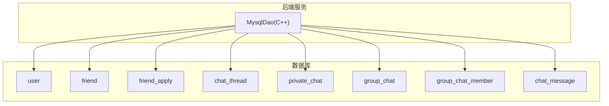
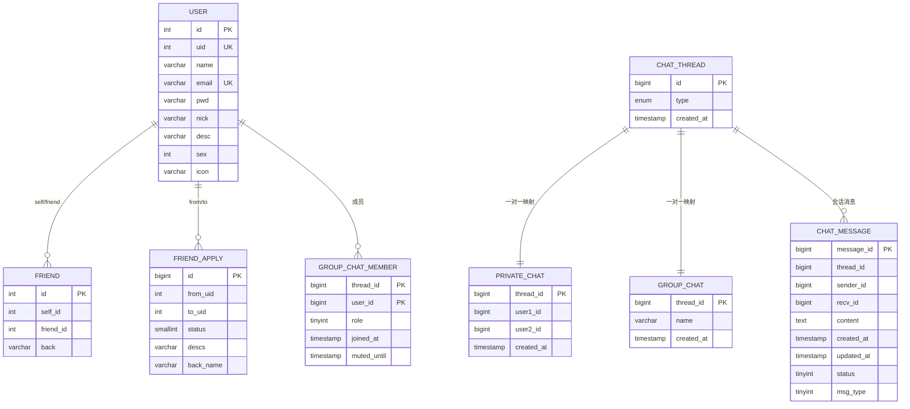
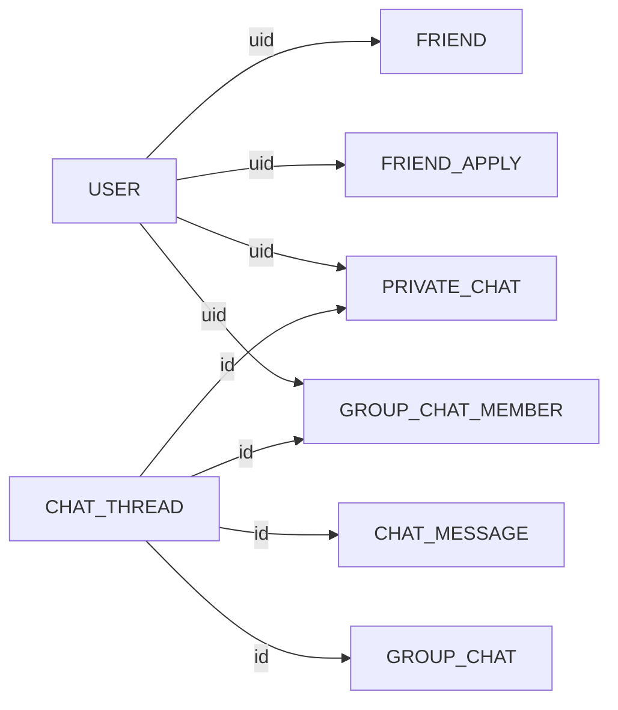

# MySQL表结构设计

<cite>
**本文引用的文件**   
- [llfc.sql](file://sql备份/llfc.sql)
- [chat_message.sql](file://sql备份/chat_message.sql)
- [llfc2.sql](file://sql备份/llfc2.sql)
- [llfc3.sql](file://sql备份/llfc3.sql)
- [MysqlDao.h](file://server/ChatServer/include/MysqlDao.h)
- [MysqlDao.cpp](file://server/ChatServer/src/MysqlDao.cpp)
</cite>

## 目录
1. [引言](#引言)
2. [项目结构](#项目结构)
3. [核心组件](#核心组件)
4. [架构总览](#架构总览)
5. [详细组件分析](#详细组件分析)
6. [依赖关系分析](#依赖关系分析)
7. [性能考虑](#性能考虑)
8. [故障排查指南](#故障排查指南)
9. [结论](#结论)
10. [附录](#附录)

## 引言
本文件面向LLFCChat项目的MySQL数据库设计，聚焦于用户、聊天会话与消息、好友关系与申请、群聊及成员等核心实体的表结构设计。文档基于仓库中的SQL备份与后端DAO层代码，系统梳理字段定义、数据类型选择、主键与索引策略、约束与默认值、字符集配置，并给出关系建模说明、查询优化建议、数据迁移策略与常见问题排查要点。

## 项目结构
- SQL脚本集中于“sql备份”目录，包含多版本演进（llfc.sql、llfc2.sql、llfc3.sql）以及独立的消息表脚本（chat_message.sql）。
- 后端服务通过C++ DAO层访问MySQL，关键接口集中在ChatServer的MysqlDao中，涵盖用户注册、密码校验、好友申请与认证、好友建立、会话创建、消息分页加载与批量写入等。

图表来源 
- [llfc.sql:24-37](file://sql备份/llfc.sql#L24-L37)
- [llfc.sql:149-155](file://sql备份/llfc.sql#L149-L155)
- [llfc.sql:179-187](file://sql备份/llfc.sql#L179-L187)
- [llfc.sql:294-304](file://sql备份/llfc.sql#L294-L304)
- [llfc.sql:363-369](file://sql备份/llfc.sql#L363-L369)
- [llfc.sql:382-391](file://sql备份/llfc.sql#L382-L391)
- [llfc.sql:408-418](file://sql备份/llfc.sql#L408-L418)
- [MysqlDao.h:236-267](file://server/ChatServer/include/MysqlDao.h#L236-L267)

章节来源
- [llfc.sql:1-756](file://sql备份/llfc.sql#L1-L756)
- [MysqlDao.h:236-267](file://server/ChatServer/include/MysqlDao.h#L236-L267)

## 核心组件
- 用户表 user：存储用户账号、邮箱、昵称、头像等基础信息，uid为业务唯一标识，email唯一。
- 好友关系表 friend：记录双向好友关系，使用自增id与联合唯一索引保证每对关系的唯一性。
- 好友申请表 friend_apply：记录好友申请状态、描述与回名，from_uid+to_uid唯一避免重复申请。
- 聊天会话表 chat_thread：会话抽象，区分私聊与群聊类型，作为消息归属维度。
- 私聊表 private_chat：映射thread_id到两个用户，提供用户维度的会话查找索引。
- 群聊表 group_chat：以thread_id为主键扩展群聊元信息（如名称）。
- 群成员表 group_chat_member：维护群成员与角色、加入时间、禁言截止时间等。
- 聊天消息表 chat_message：承载消息内容、发送者、接收者、时间与状态，按会话与时间排序。

章节来源
- [llfc.sql:466-481](file://sql备份/llfc.sql#L466-L481)
- [llfc.sql:179-187](file://sql备份/llfc.sql#L179-L187)
- [llfc.sql:294-304](file://sql备份/llfc.sql#L294-L304)
- [llfc.sql:149-155](file://sql备份/llfc.sql#L149-L155)
- [llfc.sql:408-418](file://sql备份/llfc.sql#L408-L418)
- [llfc.sql:363-369](file://sql备份/llfc.sql#L363-L369)
- [llfc.sql:382-391](file://sql备份/llfc.sql#L382-L391)
- [llfc.sql:24-37](file://sql备份/llfc.sql#L24-L37)

## 架构总览
下图展示核心实体之间的关系与主要查询路径：用户与好友关系、会话与消息、群聊与成员。

图表来源 
- [llfc.sql:466-481](file://sql备份/llfc.sql#L466-L481)
- [llfc.sql:179-187](file://sql备份/llfc.sql#L179-L187)
- [llfc.sql:294-304](file://sql备份/llfc.sql#L294-L304)
- [llfc.sql:149-155](file://sql备份/llfc.sql#L149-L155)
- [llfc.sql:408-418](file://sql备份/llfc.sql#L408-L418)
- [llfc.sql:363-369](file://sql备份/llfc.sql#L363-L369)
- [llfc.sql:382-391](file://sql备份/llfc.sql#L382-L391)
- [llfc.sql:24-37](file://sql备份/llfc.sql#L24-L37)

## 详细组件分析

### 用户表 user
- 字段与类型
  - id：自增主键，用于内部行定位。
  - uid：业务用户ID，唯一索引，对外暴露与关联。
  - name/email/pwd/nick/desc/sex/icon：用户基本信息与头像路径。
- 约束与索引
  - 主键：id
  - 唯一索引：uid、email
  - 普通索引：name（便于用户名检索）
- 字符集与默认值
  - 字符集utf8mb4，支持表情与多语言；各字符串字段设置NOT NULL DEFAULT ''。
- 设计要点
  - uid作为跨模块一致的用户标识，email唯一保障登录安全。
  - 头像icon采用相对或资源路径，便于静态资源服务器管理。

章节来源
- [llfc.sql:466-481](file://sql备份/llfc.sql#L466-L481)

### 好友关系表 friend
- 字段与类型
  - id：自增主键。
  - self_id/friend_id：双方用户ID。
  - back：备注信息。
- 约束与索引
  - 主键：id
  - 唯一索引：(self_id, friend_id)，确保同一方向的好友关系唯一。
- 关系建模
  - 双向好友通常由两条记录表示（A->B与B->A），体现对称关系。
- 设计要点
  - 使用联合唯一索引防止重复添加；back字段用于显示别名。

章节来源
- [llfc.sql:179-187](file://sql备份/llfc.sql#L179-L187)

### 好友申请表 friend_apply
- 字段与类型
  - id：自增主键。
  - from_uid/to_uid：申请人与被申请人。
  - status：申请状态（如待处理、已同意、已拒绝）。
  - descs/back_name：申请描述与回名。
- 约束与索引
  - 主键：id
  - 唯一索引：(from_uid, to_uid)，避免重复申请。
- 设计要点
  - 通过唯一索引与状态字段实现幂等申请与审批流程。

章节来源
- [llfc.sql:294-304](file://sql备份/llfc.sql#L294-L304)

### 聊天会话表 chat_thread
- 字段与类型
  - id：会话ID，自增主键。
  - type：枚举'private'/'group'，区分私聊与群聊。
  - created_at：会话创建时间。
- 约束与索引
  - 主键：id
- 设计要点
  - 将会话抽象为统一维度，私聊与群聊分别用扩展表细化。

章节来源
- [llfc.sql:149-155](file://sql备份/llfc.sql#L149-L155)

### 私聊表 private_chat
- 字段与类型
  - thread_id：引用chat_thread.id，主键。
  - user1_id/user2_id：两位用户ID。
  - created_at：创建时间。
- 约束与索引
  - 主键：thread_id
  - 唯一索引：(user1_id, user2_id)，确保两人之间仅一个私聊会话。
  - 辅助索引：(user1_id, thread_id)、(user2_id, thread_id)，加速按用户查会话。
- 设计要点
  - 通过用户维度的索引快速定位会话，支撑会话列表与消息加载。

章节来源
- [llfc.sql:408-418](file://sql备份/llfc.sql#L408-L418)

### 群聊表 group_chat
- 字段与类型
  - thread_id：引用chat_thread.id，主键。
  - name：群名称（可为空）。
  - created_at：创建时间。
- 约束与索引
  - 主键：thread_id
- 设计要点
  - 与chat_thread一对一扩展，便于后续扩展群属性（如公告、头像等）。

章节来源
- [llfc.sql:363-369](file://sql备份/llfc.sql#L363-L369)

### 群成员表 group_chat_member
- 字段与类型
  - thread_id/user_id：复合主键，表示某用户在某群的成员身份。
  - role：角色（普通成员/管理员/创建者）。
  - joined_at：加入时间。
  - muted_until：禁言截止时间。
- 约束与索引
  - 主键：(thread_id, user_id)
  - 普通索引：user_id，便于按用户查询其所在群。
- 设计要点
  - 复合主键天然限制重复成员；role与muted_until支持权限与管控。

章节来源
- [llfc.sql:382-391](file://sql备份/llfc.sql#L382-L391)

### 聊天消息表 chat_message
- 字段与类型
  - message_id：自增主键。
  - thread_id：所属会话ID。
  - sender_id/recv_id：发送者与接收者ID。
  - content：消息内容（文本或媒体链接）。
  - created_at/updated_at：创建与更新时间戳。
  - status：消息状态（未读/已读/撤回）。
  - msg_type：消息类型（文本/图片/视频/文件）。
- 约束与索引
  - 主键：message_id
  - 复合索引：(thread_id, created_at)、(thread_id, message_id)，支撑按会话分页与顺序读取。
- 设计要点
  - 通过thread_id与时间/ID双索引，高效实现会话历史分页与倒序加载。
  - status与msg_type支持消息状态管理与多媒体扩展。

章节来源
- [llfc.sql:24-37](file://sql备份/llfc.sql#L24-L37)
- [chat_message.sql:24-36](file://sql备份/chat_message.sql#L24-L36)

## 依赖关系分析
- 会话与消息
  - chat_message.thread_id -> chat_thread.id（一对多）
- 私聊与会话
  - private_chat.thread_id -> chat_thread.id（一对一）
- 群聊与会话
  - group_chat.thread_id -> chat_thread.id（一对一）
- 群成员与会话
  - group_chat_member.thread_id -> chat_thread.id（多对一）
- 用户与关系
  - friend.self_id/friend_id -> user.uid（逻辑外键，无物理约束）
  - friend_apply.from_uid/to_uid -> user.uid（逻辑外键）
- 用户与会话
  - private_chat.user1_id/user2_id -> user.uid（逻辑外键）
  - group_chat_member.user_id -> user.uid（逻辑外键）

图表来源 
- [llfc.sql:24-37](file://sql备份/llfc.sql#L24-L37)
- [llfc.sql:149-155](file://sql备份/llfc.sql#L149-L155)
- [llfc.sql:179-187](file://sql备份/llfc.sql#L179-L187)
- [llfc.sql:294-304](file://sql备份/llfc.sql#L294-L304)
- [llfc.sql:363-369](file://sql备份/llfc.sql#L363-L369)
- [llfc.sql:382-391](file://sql备份/llfc.sql#L382-L391)
- [llfc.sql:408-418](file://sql备份/llfc.sql#L408-L418)

章节来源
- [llfc.sql:24-37](file://sql备份/llfc.sql#L24-L37)
- [llfc.sql:149-155](file://sql备份/llfc.sql#L149-L155)
- [llfc.sql:179-187](file://sql备份/llfc.sql#L179-L187)
- [llfc.sql:294-304](file://sql备份/llfc.sql#L294-L304)
- [llfc.sql:363-369](file://sql备份/llfc.sql#L363-L369)
- [llfc.sql:382-391](file://sql备份/llfc.sql#L382-L391)
- [llfc.sql:408-418](file://sql备份/llfc.sql#L408-L418)

## 性能考虑
- 索引策略
  - chat_message：(thread_id, created_at)与(thread_id, message_id)双索引，覆盖会话历史分页与顺序读取场景。
  - private_chat：(user1_id, thread_id)、(user2_id, thread_id)加速按用户获取会话。
  - group_chat_member：user_id索引支持按用户查询其所在群。
- 分页与游标
  - 使用lastId+pageSize进行分页，结合created_at或message_id排序，避免深分页开销。
- 字符集与存储
  - utf8mb4支持表情与多语言，content使用TEXT适合长文本；注意大对象读写成本。
- 事务与一致性
  - 好友申请与认证、好友建立涉及多表操作，建议在应用层使用事务保证一致性。
- 热点与分库分表
  - chat_message为高写表，未来可考虑按thread_id哈希分表或归档历史消息至冷存储。

[本节为通用性能建议，不直接分析具体文件]

## 故障排查指南
- 连接与驱动异常
  - 检查MysqlDao初始化参数（Host、Port、User、Passwd、Schema）是否正确。
- 存储过程调用
  - 注册流程调用reg_user存储过程，需确认输出参数@result获取逻辑正确。
- 唯一约束冲突
  - friend_apply的(from_uid, to_uid)唯一索引可能导致重复插入失败，需在上层去重。
- 索引失效与慢查询
  - 若出现会话历史加载缓慢，检查是否命中(thread_id, created_at)或(thread_id, message_id)索引。
- 字符集问题
  - 中文或表情乱码时，确认客户端与服务端均使用utf8mb4。

章节来源
- [MysqlDao.cpp:19-57](file://server/ChatServer/src/MysqlDao.cpp#L19-L57)
- [MysqlDao.cpp:169-200](file://server/ChatServer/src/MysqlDao.cpp#L169-L200)

## 结论
本设计以chat_thread为核心会话抽象，配合private_chat与group_chat扩展私聊与群聊语义，chat_message承载消息流，user、friend、friend_apply、group_chat_member构成用户与关系模型。索引与默认值设计满足常见查询场景，字符集与数据类型兼顾扩展性与兼容性。后续可按规模引入分库分表与缓存策略，进一步提升吞吐与可用性。

[本节为总结性内容，不直接分析具体文件]

## 附录

### 常用查询模式与索引利用
- 会话历史分页：WHERE thread_id=? ORDER BY created_at DESC LIMIT ? OFFSET ?
- 按用户获取私聊会话：WHERE user1_id=? OR user2_id=?
- 群成员查询：WHERE thread_id=? 或 WHERE user_id=?

[本节为概念性说明，不直接分析具体文件]

### 数据迁移策略
- 版本化脚本
  - 使用llfc2.sql、llfc3.sql等增量脚本，逐步演进表结构。
- 灰度与回滚
  - 先在新环境验证脚本，再在旧环境执行；保留回滚脚本与备份。
- 数据校验
  - 迁移后核对计数、唯一约束与索引有效性，必要时重建索引。

[本节为通用迁移建议，不直接分析具体文件]