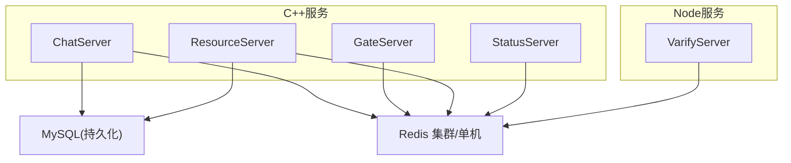
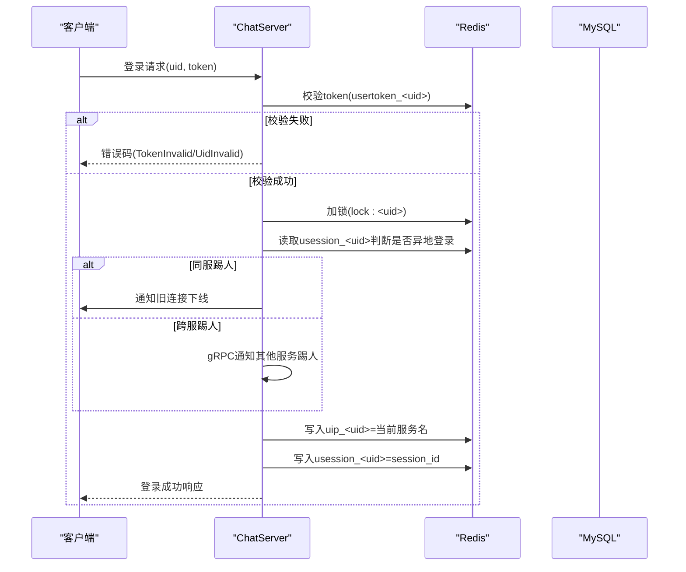
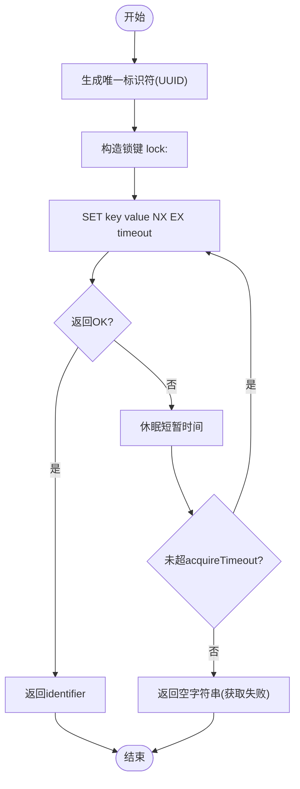
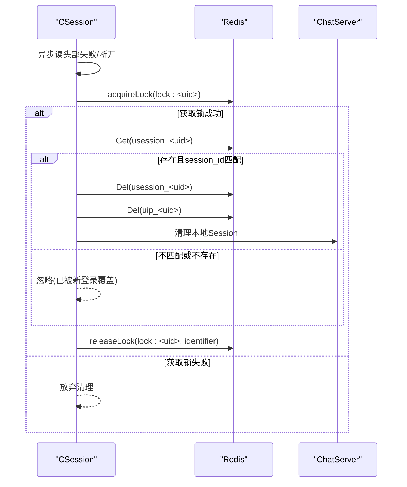
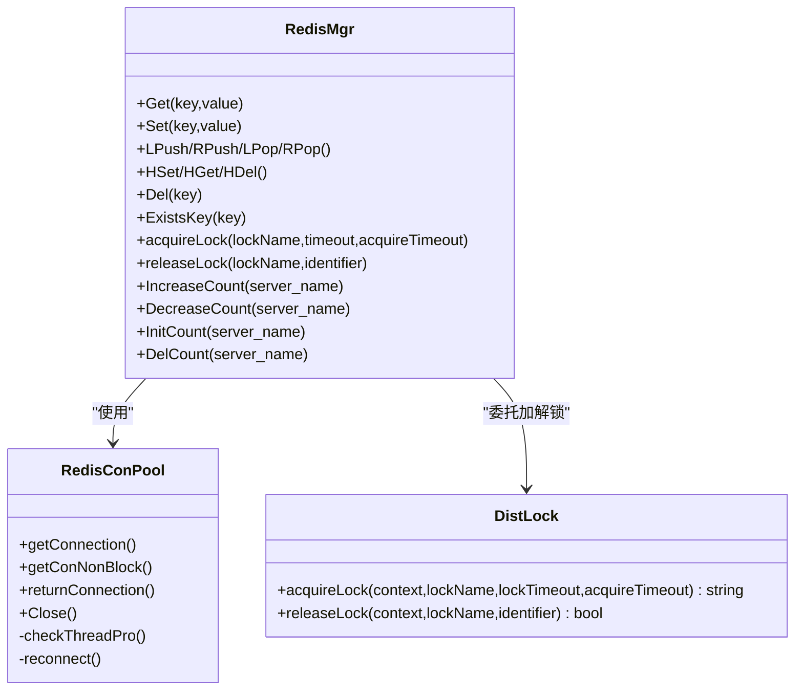

# Redis缓存设计

<cite>
**本文引用的文件**   
- [RedisMgr.h](file://server/ChatServer/include/RedisMgr.h)
- [RedisMgr.cpp](file://server/ChatServer/src/RedisMgr.cpp)
- [DistLock.h](file://server/ChatServer/include/DistLock.h)
- [DistLock.cpp](file://server/ChatServer/src/DistLock.cpp)
- [const.h](file://server/ChatServer/include/const.h)
- [CSession.cpp](file://server/ChatServer/src/CSession.cpp)
- [LogicSystem.cpp](file://server/ChatServer/src/LogicSystem.cpp)
- [ChatGrpcClient.cpp](file://server/ChatServer/src/ChatGrpcClient.cpp)
- [redis.js](file://server/VarifyServer/redis.js)
- [server.js](file://server/VarifyServer/server.js)
</cite>

## 目录
1. [引言](#引言)
2. [项目结构](#项目结构)
3. [核心组件](#核心组件)
4. [架构总览](#架构总览)
5. [详细组件分析](#详细组件分析)
6. [依赖关系分析](#依赖关系分析)
7. [性能与一致性策略](#性能与一致性策略)
8. [故障排查指南](#故障排查指南)
9. [结论](#结论)
10. [附录：命名规范与过期策略](#附录：命名规范与过期策略)

## 引言
本设计文档围绕LLFCChat项目中Redis的缓存与分布式能力进行系统化说明，覆盖用户会话、在线状态、验证码、分布式锁、热点数据等关键场景。文档基于现有代码实现进行分析，给出数据结构选型、命名规范、过期策略、一致性与高可用方案，并提供监控、内存优化与集群部署建议。

## 项目结构
本项目在多个服务中复用统一的Redis访问层（hiredis连接池+封装），并在验证码服务中使用Node.js ioredis客户端。核心涉及：
- C++侧：ChatServer/GateServer/ResourceServer/StatusServer中的RedisMgr与DistLock
- Node侧：VarifyServer中的redis.js与server.js

图表来源
- [RedisMgr.h](file://server/ChatServer/include/RedisMgr.h)
- [RedisMgr.cpp](file://server/ChatServer/src/RedisMgr.cpp)
- [DistLock.cpp](file://server/ChatServer/src/DistLock.cpp)
- [redis.js](file://server/VarifyServer/redis.js)

章节来源
- [RedisMgr.h:1-305](file://server/ChatServer/include/RedisMgr.h#L1-L305)
- [RedisMgr.cpp:1-462](file://server/ChatServer/src/RedisMgr.cpp#L1-L462)
- [DistLock.cpp:1-73](file://server/ChatServer/src/DistLock.cpp#L1-L73)
- [redis.js:1-101](file://server/VarifyServer/redis.js#L1-L101)

## 核心组件
- RedisConPool：连接池管理，包含连接获取、归还、健康检查与自动重连
- RedisMgr：对外暴露String/List/Hash操作与分布式锁接口，以及登录计数统计
- DistLock：基于SET NX EX + Lua脚本的分布式锁实现
- VarifyServer redis模块：ioredis封装，提供Get/Exists/SetExpire等能力

章节来源
- [RedisMgr.h:1-305](file://server/ChatServer/include/RedisMgr.h#L1-L305)
- [RedisMgr.cpp:1-462](file://server/ChatServer/src/RedisMgr.cpp#L1-L462)
- [DistLock.h:1-18](file://server/ChatServer/include/DistLock.h#L1-L18)
- [DistLock.cpp:1-73](file://server/ChatServer/src/DistLock.cpp#L1-L73)
- [redis.js:1-101](file://server/VarifyServer/redis.js#L1-L101)

## 架构总览
Redis在系统中的角色：
- 会话与在线状态：以String存储uid->session_id映射，配合心跳与断线清理
- 验证码：以String存储email->code，带过期时间
- 分布式锁：以lock:前缀Key+UUID标识符，Lua保证原子释放
- 热点数据：用户基础信息、好友列表等通过Redis缓存，回源DB时写回缓存
- 计数器：按服务名统计登录数量，使用Hash结构

图表来源
- [LogicSystem.cpp](file://server/ChatServer/src/LogicSystem.cpp)
- [CSession.cpp](file://server/ChatServer/src/CSession.cpp)
- [RedisMgr.cpp](file://server/ChatServer/src/RedisMgr.cpp)
- [DistLock.cpp](file://server/ChatServer/src/DistLock.cpp)

## 详细组件分析

### 连接池与基础命令封装
- 连接池特性
  - 初始化固定大小连接并AUTH认证
  - 后台线程周期性PING保活，异常连接剔除并重连
  - 阻塞/非阻塞取连接，条件变量唤醒
- 基础命令封装
  - String: Get/Set/Del/Exists
  - List: LPush/RPush/LPop/RPop
  - Hash: HSet/HGet/HDel
  - 所有方法均从连接池取连接，执行后归还，统一异常处理与日志

章节来源
- [RedisMgr.h:1-305](file://server/ChatServer/include/RedisMgr.h#L1-L305)
- [RedisMgr.cpp:1-462](file://server/ChatServer/src/RedisMgr.cpp#L1-L462)

### 分布式锁实现
- 加锁
  - Key格式：lock:<lockName>
  - 使用SET key identifier NX EX lockTimeout原子设置，identifier为UUID
  - 支持acquireTimeout重试轮询
- 解锁
  - 使用Lua脚本比较value是否为当前identifier，匹配则DEL，否则返回0
- 超时与死锁防护
  - 锁过期自动释放，避免进程崩溃导致死锁
  - 仅持有者可释放，防止误删

图表来源
- [DistLock.cpp:1-73](file://server/ChatServer/src/DistLock.cpp#L1-L73)

章节来源
- [DistLock.h:1-18](file://server/ChatServer/include/DistLock.h#L1-L18)
- [DistLock.cpp:1-73](file://server/ChatServer/src/DistLock.cpp#L1-L73)
- [RedisMgr.cpp:362-393](file://server/ChatServer/src/RedisMgr.cpp#L362-L393)

### 用户会话与在线状态
- 键空间
  - usession_<uid>: session_id
  - uip_<uid>: 当前登录服务器名称
  - utoken_<uid>: 登录令牌
- 登录流程
  - 校验utoken_<uid>
  - 加锁lock:<uid>防并发
  - 读取usession_<uid>判断是否异地登录，必要时踢人
  - 写入uip_<uid>与usession_<uid>
- 断线清理
  - 读取失败或连接关闭时，加锁删除usession_<uid>与uip_<uid>，确保一致性

图表来源
- [CSession.cpp](file://server/ChatServer/src/CSession.cpp)
- [RedisMgr.cpp](file://server/ChatServer/src/RedisMgr.cpp)
- [DistLock.cpp](file://server/ChatServer/src/DistLock.cpp)

章节来源
- [CSession.cpp](file://server/ChatServer/src/CSession.cpp)
- [const.h:81-89](file://server/ChatServer/include/const.h#L81-L89)

### 验证码存储
- 键空间
  - code_prefix + email: 验证码值
- 行为
  - 若不存在则生成短码并设置过期时间（秒）
  - 发送邮箱验证码
- 注意
  - 当前实现将set与expire分两步调用，存在极小概率中间态；建议改为SET key value EX seconds一次性设置

章节来源
- [server.js:1-76](file://server/VarifyServer/server.js#L1-L76)
- [redis.js:1-101](file://server/VarifyServer/redis.js#L1-L101)

### 热点数据缓存（用户基础信息）
- 键空间
  - ubaseinfo_<uid>: JSON字符串（uid/pwd/name/email/nick/desc/sex/icon）
- 行为
  - 优先查Redis，命中直接返回
  - 未命中则查询MySQL，回填Redis并设置合理过期时间
- 适用场景
  - 读多写少的基础资料，降低DB压力

章节来源
- [ChatGrpcClient.cpp](file://server/ChatServer/src/ChatGrpcClient.cpp)
- [const.h:84-84](file://server/ChatServer/include/const.h#L84-L84)

### 登录计数统计
- 键空间
  - logincount: Hash，field=服务名，value=计数
- 行为
  - 通过分布式锁lockcount保护HGet/HSet原子性
  - 服务启动/退出时InitCount/DelCount，登录/登出时IncreaseCount/DecreaseCount

章节来源
- [RedisMgr.cpp:395-461](file://server/ChatServer/src/RedisMgr.cpp#L395-L461)
- [const.h:85-89](file://server/ChatServer/include/const.h#L85-L89)

## 依赖关系分析
- ChatServer/GateServer/ResourceServer/StatusServer共享RedisMgr与DistLock
- VarifyServer独立使用ioredis封装
- 常量定义集中管理键名前缀与锁参数

图表来源
- [RedisMgr.h:1-305](file://server/ChatServer/include/RedisMgr.h#L1-L305)
- [RedisMgr.cpp:1-462](file://server/ChatServer/src/RedisMgr.cpp#L1-L462)
- [DistLock.h:1-18](file://server/ChatServer/include/DistLock.h#L1-L18)
- [DistLock.cpp:1-73](file://server/ChatServer/src/DistLock.cpp#L1-L73)

章节来源
- [const.h:81-94](file://server/ChatServer/include/const.h#L81-L94)

## 性能与一致性策略

### 数据结构选择
- String
  - 用途：会话ID、Token、验证码、简单配置
  - 复杂度：O(1)读写
- Hash
  - 用途：登录计数（按服务名聚合）、对象字段拆分（可选）
  - 复杂度：O(1)字段级操作
- List
  - 用途：消息队列、离线消息缓冲（可扩展）
  - 复杂度：O(1)两端插入/弹出
- Set/ZSet
  - 用途：去重集合、排行榜、活跃用户集合（可扩展）
  - 复杂度：O(1)/O(logN)

### 命名规范
- 会话：usession_<uid>
- 在线位置：uip_<uid>
- Token：utoken_<uid>
- 基础信息：ubaseinfo_<uid>
- 验证码：code_prefix + email
- 锁：lock:<resource>
- 计数：logincount(HASH)

章节来源
- [const.h:81-89](file://server/ChatServer/include/const.h#L81-L89)

### 过期时间策略
- Token与会话：结合业务心跳与登录有效期，建议TTL与心跳周期联动
- 验证码：固定TTL（如600秒）
- 热点数据：根据更新频率设置TTL，避免脏读

### 数据一致性保证
- 登录/踢人：分布式锁保护临界区，确保usession/uip写入顺序正确
- 验证码：建议使用SET key value EX一次性设置，避免分步不一致
- 热点数据：Cache-Aside模式，先更新DB再删除缓存，或采用延迟双删

### 缓存穿透、击穿、雪崩防护
- 穿透
  - 对不存在的数据设置短TTL的空值占位
  - 布隆过滤器拦截非法uid
- 击穿
  - 热点Key加互斥锁（分布式锁）重建缓存
  - 逻辑内联原子化更新
- 雪崩
  - TTL加入随机抖动
  - 多级缓存（本地+Redis）
  - 限流降级与快速失败

### 缓存更新同步机制
- Cache-Aside：读时回源，写时先写DB再删缓存
- 订阅发布：变更事件广播，失效相关缓存
- 定时任务：定期校验热点数据一致性

### 性能监控与内存优化
- 监控指标
  - 命中率、QPS、延迟分布、连接池使用率、错误率
  - Redis内存碎片率、最大内存、淘汰策略
- 优化手段
  - 合理设置maxmemory与eviction策略
  - 压缩大对象、减少热Key倾斜
  - 连接池大小与IO线程数调优

### 集群部署最佳实践
- 主从/哨兵：保障高可用与自动故障转移
- 分片：按业务域划分数据库实例，避免单点瓶颈
- 安全：启用AUTH、ACL、TLS加密传输
- 备份：RDB/AOF组合，定期快照与增量备份

## 故障排查指南
- 连接问题
  - 检查AUTH、网络连通、防火墙、端口
  - 观察连接池健康检查日志与重连次数
- 锁问题
  - 确认identifier一致，Lua脚本返回值
  - 检查锁TTL与acquireTimeout设置
- 会话异常
  - 核对usession/uip键是否存在与匹配
  - 检查断线清理路径是否被锁保护
- 验证码异常
  - 检查set与expire原子性，建议改用SET EX
  - 查看Redis错误日志与网络异常

章节来源
- [RedisMgr.cpp:1-462](file://server/ChatServer/src/RedisMgr.cpp#L1-L462)
- [DistLock.cpp:1-73](file://server/ChatServer/src/DistLock.cpp#L1-L73)
- [CSession.cpp](file://server/ChatServer/src/CSession.cpp)
- [server.js:1-76](file://server/VarifyServer/server.js#L1-L76)
- [redis.js:1-101](file://server/VarifyServer/redis.js#L1-L101)

## 结论
本项目通过统一的Redis访问层与分布式锁实现，支撑了会话管理、在线状态、验证码、热点数据与计数统计等核心场景。建议在验证码设置上采用原子SET EX，完善穿透/击穿/雪崩防护，引入监控与容量规划，逐步演进到更稳健的缓存一致性模型。

## 附录：命名规范与过期策略
- 命名规范
  - 会话：usession_<uid>
  - 在线位置：uip_<uid>
  - Token：utoken_<uid>
  - 基础信息：ubaseinfo_<uid>
  - 验证码：code_prefix + email
  - 锁：lock:<resource>
  - 计数：logincount(HASH)
- 过期策略
  - Token与会话：TTL与心跳周期联动
  - 验证码：固定TTL（如600秒）
  - 热点数据：按更新频率设置TTL，避免脏读

章节来源
- [const.h:81-94](file://server/ChatServer/include/const.h#L81-L94)
- [server.js:1-76](file://server/VarifyServer/server.js#L1-L76)
- [redis.js:1-101](file://server/VarifyServer/redis.js#L1-L101)