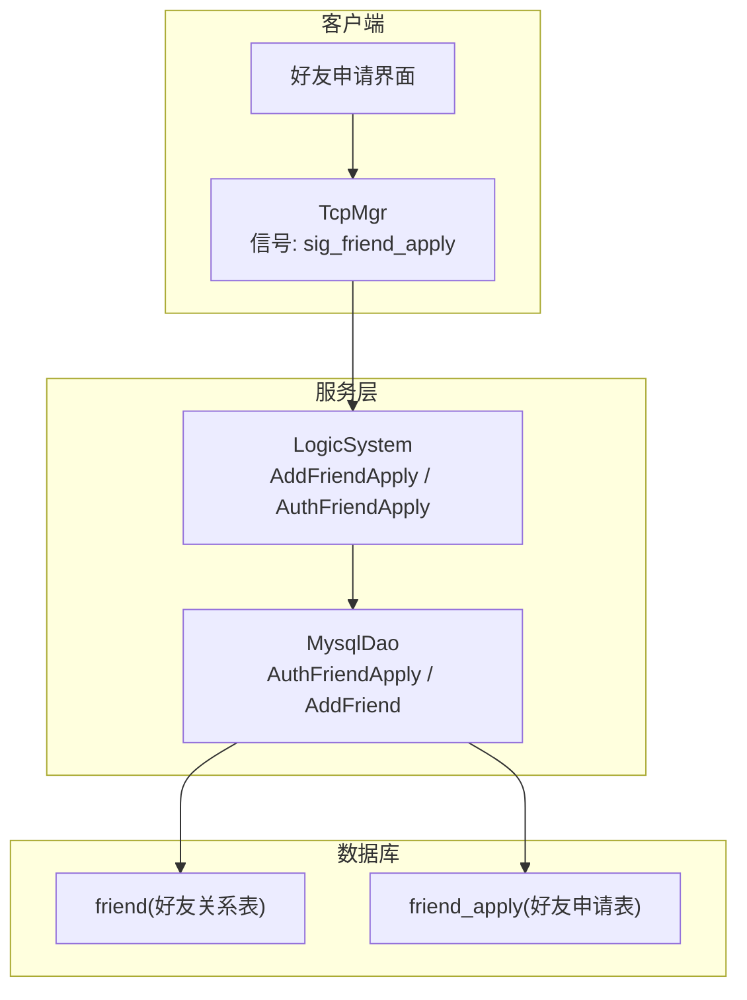
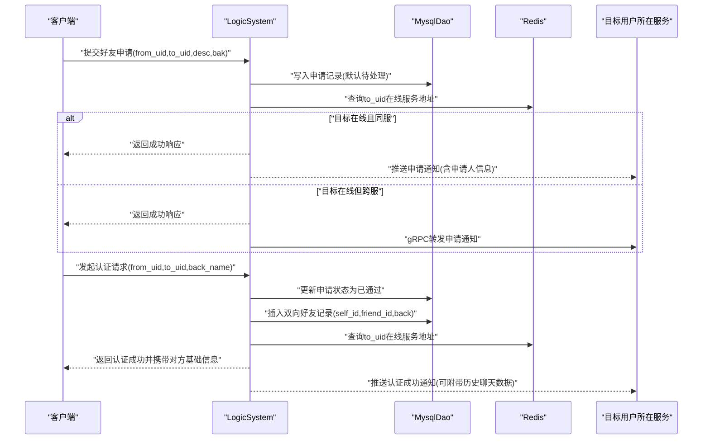
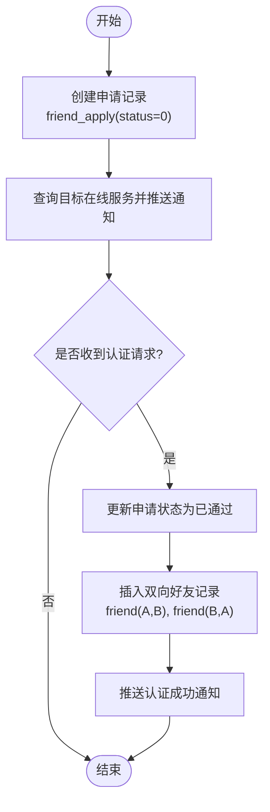
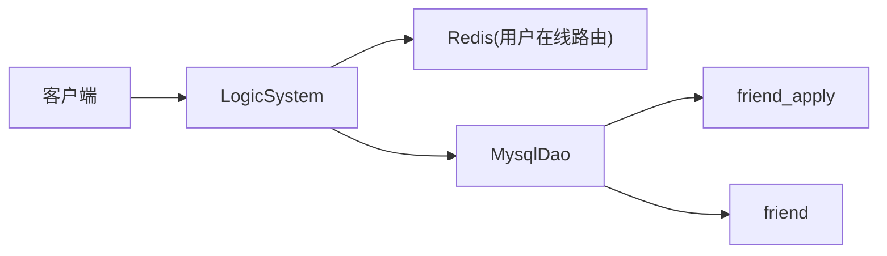

# 好友关系表(friend, friend_apply)

<cite>
**本文引用的文件**   
- [llfc3.sql](file://sql备份/llfc3.sql)
- [MysqlDao.cpp](file://server/ResourceServer/src/MysqlDao.cpp)
- [day28-好友查询和申请.md](file://开发文档/day28-好友查询和申请.md)
- [day29-好友认证和聊天通信.md](file://开发文档/day29-好友认证和聊天通信.md)
- [day37-聊天信息存储方案.md](file://开发文档/day37-聊天信息存储方案.md)
</cite>

## 目录
1. [简介](#简介)
2. [项目结构](#项目结构)
3. [核心组件](#核心组件)
4. [架构总览](#架构总览)
5. [详细组件分析](#详细组件分析)
6. [依赖分析](#依赖分析)
7. [性能考虑](#性能考虑)
8. [故障排查指南](#故障排查指南)
9. [结论](#结论)
10. [附录](#附录)

## 简介
本文件围绕LLFCChat项目中“好友关系”相关的数据模型与业务流程进行系统化说明，重点覆盖以下两点：
- 数据表设计：friend（好友关系表）与 friend_apply（好友申请表）的字段、约束与索引策略。
- 业务状态管理：好友申请的状态流转、双向好友关系的存储策略与一致性保障。

## 项目结构
与好友关系相关的定义与实现主要分布在如下位置：
- 数据库定义：SQL脚本中定义了 friend 与 friend_apply 表结构及示例数据。
- 服务层实现：资源服务器中的 MysqlDao 提供对 friend_apply 状态更新与 friend 插入的核心方法。
- 开发文档：描述了好友申请与认证的完整流程、消息通知与跨服务转发机制。

图表来源 
- [llfc3.sql:63-73](file://sql备份/llfc3.sql#L63-L73)
- [llfc3.sql:131-143](file://sql备份/llfc3.sql#L131-L143)
- [MysqlDao.cpp:212-245](file://server/ResourceServer/src/MysqlDao.cpp#L212-L245)
- [MysqlDao.cpp:247-259](file://server/ResourceServer/src/MysqlDao.cpp#L247-L259)
- [day28-好友查询和申请.md:346-416](file://开发文档/day28-好友查询和申请.md#L346-L416)
- [day29-好友认证和聊天通信.md:1-98](file://开发文档/day29-好友认证和聊天通信.md#L1-L98)
- [day37-聊天信息存储方案.md:1659-1902](file://开发文档/day37-聊天信息存储方案.md#L1659-L1902)

章节来源
- [llfc3.sql:63-73](file://sql备份/llfc3.sql#L63-L73)
- [llfc3.sql:131-143](file://sql备份/llfc3.sql#L131-L143)

## 核心组件
- friend 表：记录已建立的双向好友关系，包含 self_id（自己ID）、friend_id（好友ID）、back（备注名）。通过联合唯一索引确保同一用户对之间不会重复存储。
- friend_apply 表：记录好友申请单，包含 from_uid（申请人ID）、to_uid（被申请人ID）、status（申请状态）、descs（申请描述）、back_name（备注名）。通过联合唯一索引保证同一申请方向仅存在一条记录。

章节来源
- [llfc3.sql:63-73](file://sql备份/llfc3.sql#L63-L73)
- [llfc3.sql:131-143](file://sql备份/llfc3.sql#L131-L143)

## 架构总览
好友关系涉及“申请—审核—建立关系—双向同步”的完整链路，关键参与方包括客户端、逻辑服务、数据库与Redis（用于在线用户路由）。整体流程如下：

图表来源 
- [day28-好友查询和申请.md:346-416](file://开发文档/day28-好友查询和申请.md#L346-L416)
- [day29-好友认证和聊天通信.md:1-98](file://开发文档/day29-好友认证和聊天通信.md#L1-L98)
- [day37-聊天信息存储方案.md:1659-1902](file://开发文档/day37-聊天信息存储方案.md#L1659-L1902)
- [MysqlDao.cpp:212-245](file://server/ResourceServer/src/MysqlDao.cpp#L212-L245)
- [MysqlDao.cpp:247-259](file://server/ResourceServer/src/MysqlDao.cpp#L247-L259)

## 详细组件分析

### 表结构设计
- friend 表
  - 字段：id（自增主键）、self_id（自己ID）、friend_id（好友ID）、back（备注名）
  - 约束：联合唯一索引 self_friend(self_id, friend_id)，确保同一用户对之间只有一条记录
  - 用途：表示已确认的好友关系；通常以双向两条记录体现 A→B 与 B→A

- friend_apply 表
  - 字段：id（自增主键）、from_uid（申请人ID）、to_uid（被申请人ID）、status（申请状态）、descs（申请描述）、back_name（备注名）
  - 约束：联合唯一索引 from_to_uid(from_uid, to_uid)，防止重复申请
  - 用途：承载好友申请的生命周期状态，如“待处理/已通过/已拒绝”等

章节来源
- [llfc3.sql:63-73](file://sql备份/llfc3.sql#L63-L73)
- [llfc3.sql:131-143](file://sql备份/llfc3.sql#L131-L143)

### 状态管理与双向存储策略
- 申请状态
  - status=0：默认或拒绝（具体语义由业务约定，常见为未处理/拒绝）
  - status=1：已通过（认证通过）
  - 更新逻辑：在认证通过后，将对应申请记录的 status 置为已通过

- 双向好友存储
  - 认证通过后，系统会插入两条好友记录：
    - self_id=A, friend_id=B, back=“A对B的备注”
    - self_id=B, friend_id=A, back=“B对A的备注”
  - 这样每个用户在自己的视角下都能独立维护对好友的备注，同时保证关系对称性

章节来源
- [day29-好友认证和聊天通信.md:1-98](file://开发文档/day29-好友认证和聊天通信.md#L1-L98)
- [day37-聊天信息存储方案.md:1785-1902](file://开发文档/day37-聊天信息存储方案.md#L1785-L1902)
- [MysqlDao.cpp:212-245](file://server/ResourceServer/src/MysqlDao.cpp#L212-L245)
- [MysqlDao.cpp:247-259](file://server/ResourceServer/src/MysqlDao.cpp#L247-L259)

### 申请与认证流程（代码级时序）
- 申请阶段
  - 客户端发送申请，服务端写入 friend_apply（默认待处理），并通过Redis查询目标用户所在服务后推送通知
- 认证阶段
  - 客户端发起认证，服务端更新 friend_apply 状态为已通过，并插入双向好友记录，随后通知双方（必要时附带历史聊天数据）

图表来源 
- [day28-好友查询和申请.md:346-416](file://开发文档/day28-好友查询和申请.md#L346-L416)
- [day29-好友认证和聊天通信.md:1-98](file://开发文档/day29-好友认证和聊天通信.md#L1-L98)
- [day37-聊天信息存储方案.md:1659-1902](file://开发文档/day37-聊天信息存储方案.md#L1659-L1902)

### 数据访问与事务要点
- MysqlDao::AuthFriendApply
  - 根据 from_uid 与 to_uid 更新 friend_apply 的 status 为已通过
  - 注意参数顺序：实际更新的是“反向申请”的记录（即被申请人的视角）
- MysqlDao::AddFriend
  - 插入双向好友记录，确保 self_id 与 friend_id 的唯一性约束不被违反
  - 若需要，可同时返回历史聊天数据以便客户端渲染

章节来源
- [MysqlDao.cpp:212-245](file://server/ResourceServer/src/MysqlDao.cpp#L212-L245)
- [MysqlDao.cpp:247-259](file://server/ResourceServer/src/MysqlDao.cpp#L247-L259)

## 依赖分析
- 数据层依赖
  - friend_apply 的 status 驱动认证结果
  - friend 的联合唯一索引保证关系不重复
- 服务层依赖
  - LogicSystem 负责编排申请与认证流程，协调 Redis 路由与 gRPC 跨服通知
  - MysqlDao 封装 SQL 操作，确保状态更新与关系插入的正确性

图表来源 
- [day28-好友查询和申请.md:346-416](file://开发文档/day28-好友查询和申请.md#L346-L416)
- [day29-好友认证和聊天通信.md:1-98](file://开发文档/day29-好友认证和聊天通信.md#L1-L98)
- [day37-聊天信息存储方案.md:1659-1902](file://开发文档/day37-聊天信息存储方案.md#L1659-L1902)
- [MysqlDao.cpp:212-245](file://server/ResourceServer/src/MysqlDao.cpp#L212-L245)
- [MysqlDao.cpp:247-259](file://server/ResourceServer/src/MysqlDao.cpp#L247-L259)

章节来源
- [day28-好友查询和申请.md:346-416](file://开发文档/day28-好友查询和申请.md#L346-L416)
- [day29-好友认证和聊天通信.md:1-98](file://开发文档/day29-好友认证和聊天通信.md#L1-L98)
- [day37-聊天信息存储方案.md:1659-1902](file://开发文档/day37-聊天信息存储方案.md#L1659-L1902)
- [MysqlDao.cpp:212-245](file://server/ResourceServer/src/MysqlDao.cpp#L212-L245)
- [MysqlDao.cpp:247-259](file://server/ResourceServer/src/MysqlDao.cpp#L247-L259)

## 性能考虑
- 索引优化
  - friend 表的 self_friend 联合唯一索引避免重复插入，提升关系查询效率
  - friend_apply 表的 from_to_uid 联合唯一索引避免重复申请，减少冲突检测开销
- 并发与一致性
  - 认证与插入好友建议在同一事务内完成，防止状态不一致
  - 跨服通知失败时应有重试与补偿机制，确保两端状态一致
- 缓存与路由
  - 使用 Redis 缓存用户在线服务地址，降低路由延迟
  - 高频读取场景可考虑本地缓存好友列表（需设置失效策略）

[本节为通用指导，无需特定文件引用]

## 故障排查指南
- 申请重复
  - 现象：多次提交相同方向的申请
  - 排查：检查 from_to_uid 唯一索引是否生效；确认前端是否重复提交
- 认证失败
  - 现象：认证通过后未生成好友关系
  - 排查：查看 MysqlDao::AuthFriendApply 与 AddFriend 的执行日志；确认事务是否回滚
- 双向关系缺失
  - 现象：A能看到B，但B看不到A
  - 排查：检查 friend 表是否存在两条记录；确认插入逻辑是否正确
- 通知未达
  - 现象：对方未收到申请或认证成功通知
  - 排查：检查 Redis 路由是否正确；确认跨服 gRPC 调用是否成功

章节来源
- [MysqlDao.cpp:212-245](file://server/ResourceServer/src/MysqlDao.cpp#L212-L245)
- [MysqlDao.cpp:247-259](file://server/ResourceServer/src/MysqlDao.cpp#L247-L259)
- [day28-好友查询和申请.md:346-416](file://开发文档/day28-好友查询和申请.md#L346-L416)
- [day29-好友认证和聊天通信.md:1-98](file://开发文档/day29-好友认证和聊天通信.md#L1-L98)
- [day37-聊天信息存储方案.md:1659-1902](file://开发文档/day37-聊天信息存储方案.md#L1659-L1902)

## 结论
- friend 与 friend_apply 的设计清晰分离了“关系”与“申请”两个关注点，结合联合唯一索引有效保证了数据一致性与完整性。
- 申请—认证—双向关系建立的流程在服务端通过 LogicSystem 与 MysqlDao 协同完成，借助 Redis 与 gRPC 实现跨服通知与路由。
- 建议在认证与插入好友时使用事务，确保状态与关系的一致性；同时完善通知重试与补偿机制，提升系统鲁棒性。

[本节为总结性内容，无需特定文件引用]

## 附录
- 字段字典
  - friend.self_id：自己ID
  - friend.friend_id：好友ID
  - friend.back：备注名
  - friend_apply.from_uid：申请人ID
  - friend_apply.to_uid：被申请人ID
  - friend_apply.status：申请状态（0=默认/拒绝，1=已通过）
  - friend_apply.descs：申请描述
  - friend_apply.back_name：备注名

章节来源
- [llfc3.sql:63-73](file://sql备份/llfc3.sql#L63-L73)
- [llfc3.sql:131-143](file://sql备份/llfc3.sql#L131-L143)