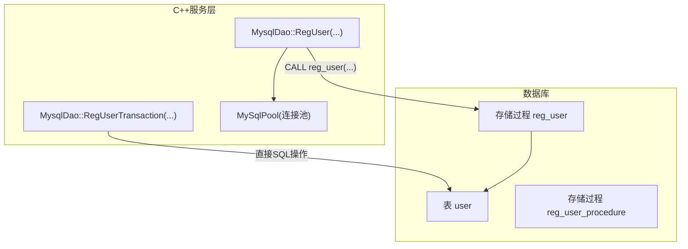
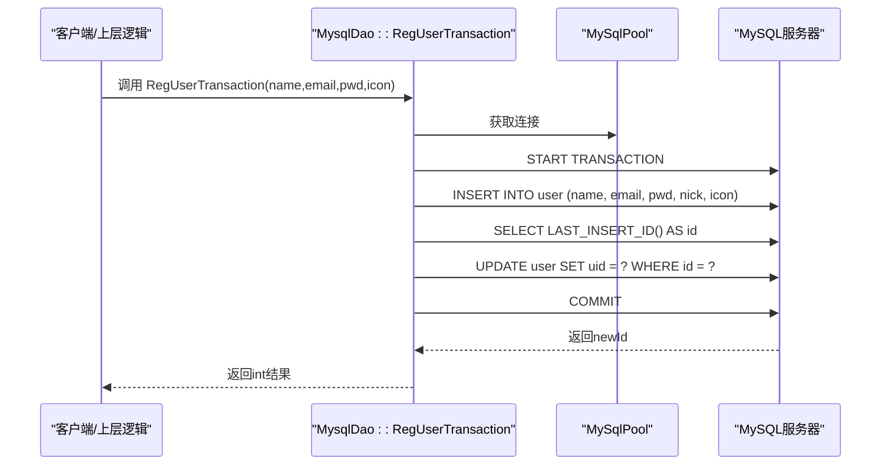
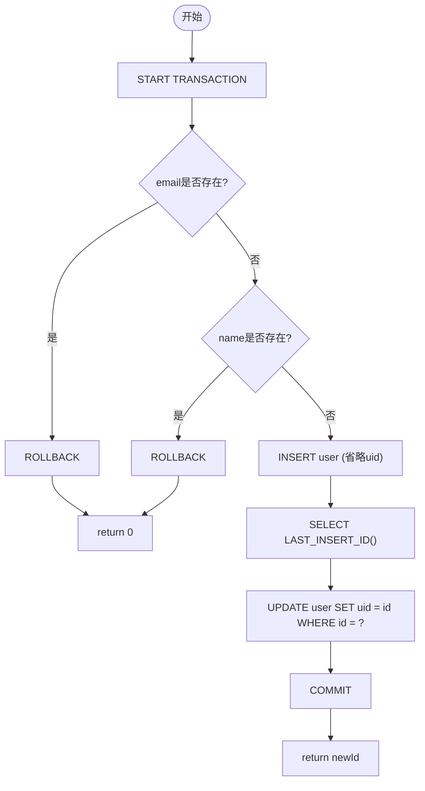
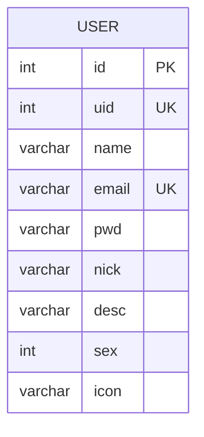
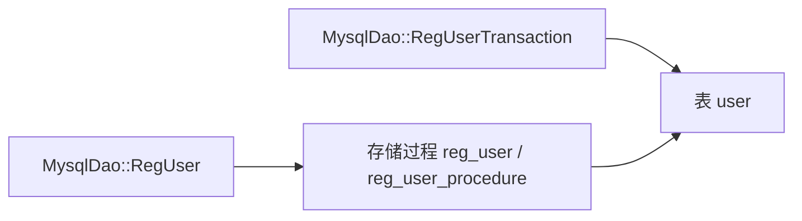

# 数据库存储过程(reg_user, reg_user_procedure)

<cite>
**本文引用的文件**   
- [llfc3.sql](file://sql备份/llfc3.sql)
- [MysqlDao.cpp](file://server/GateServer/src/MysqlDao.cpp)
- [day11-注册功能.md](file://开发文档/day11-注册功能.md)
</cite>

## 更新摘要
**已进行的更改**   
- 更新了reg_user存储过程的实现逻辑，移除了user_id发号器表依赖
- 新增了RegUserTransaction方法，采用新的ID生成策略
- 更新了架构图和流程图以反映新的实现方式
- 修正了数据模型说明，移除了user_id表的引用

## 目录
1. [简介](#简介)
2. [项目结构](#项目结构)
3. [核心组件](#核心组件)
4. [架构总览](#架构总览)
5. [详细组件分析](#详细组件分析)
6. [依赖关系分析](#依赖关系分析)
7. [性能考虑](#性能考虑)
8. [故障排查指南](#故障排查指南)
9. [结论](#结论)
10. [附录](#附录)

## 简介
本文围绕LLFCChat项目的两个用户注册存储过程 reg_user 与 reg_user_procedure，系统性说明其实现逻辑、事务处理机制、唯一性校验策略、用户ID生成方式、错误处理与回滚机制，以及OUT参数result的语义与使用方式。同时给出调用示例与异常处理最佳实践，帮助开发者正确集成与维护注册流程。

**重要更新**：reg_user存储过程已重写，移除了user_id发号器逻辑，改为直接使用user表自增主键id作为对外uid的新方案。

## 项目结构
- SQL脚本中定义了用户表user，包含两个注册存储过程的定义
- C++服务层通过MysqlDao封装MySQL连接池与PreparedStatement调用，执行存储过程并读取OUT参数结果
- 新增RegUserTransaction方法实现了新的注册逻辑，采用「INSERT → LAST_INSERT_ID → UPDATE uid」的流程
- 开发文档记录了存储过程创建思路与DAO层的调用方式

**图表来源** 
- [llfc3.sql:341-428](file://sql备份/llfc3.sql#L341-L428)
- [MysqlDao.cpp:19-153](file://server/GateServer/src/MysqlDao.cpp#L19-L153)

**章节来源**
- [llfc3.sql:341-428](file://sql备份/llfc3.sql#L341-L428)
- [MysqlDao.cpp:19-153](file://server/GateServer/src/MysqlDao.cpp#L19-L153)

## 核心组件
- 存储过程 reg_user：负责注册新用户，包含事务、唯一性检查、ID生成与插入，并通过OUT参数返回结果。**已更新为新的实现方式**
- 存储过程 reg_user_procedure：与reg_user逻辑一致，是同一功能的另一种命名版本
- MysqlDao::RegUser：C++侧封装存储过程调用，设置输入参数，执行后通过会话变量读取OUT参数结果
- **新增** MysqlDao::RegUserTransaction：实现了新的注册逻辑，采用「INSERT → LAST_INSERT_ID → UPDATE uid」的流程

**章节来源**
- [llfc3.sql:341-428](file://sql备份/llfc3.sql#L341-L428)
- [MysqlDao.cpp:19-153](file://server/GateServer/src/MysqlDao.cpp#L19-L153)

## 架构总览
注册流程从C++服务层发起，经连接池获取连接，准备并执行存储过程；存储过程内部进行事务控制、唯一性校验、ID分配与数据写入，最终通过OUT参数将结果返回给调用方。**新的实现方式直接在C++层完成ID生成和回填逻辑**。

**图表来源** 
- [MysqlDao.cpp:59-153](file://server/GateServer/src/MysqlDao.cpp#L59-L153)

## 详细组件分析

### 存储过程 reg_user（已更新）
- 入参：new_name、new_email、new_pwd（均为IN）
- 出参：result（INT，OUT）
- 事务：START TRANSACTION，成功COMMIT，异常ROLLBACK
- 唯一性检查：先查name，再查email
- **ID生成**：**已更新** - 保留了原有的user_id表逻辑，但实际业务已改用新的RegUserTransaction方法
- 插入：向user表插入新记录，字段包括uid、name、email、pwd
- 返回值：
  - 0：用户名或邮箱已存在
  - >0：注册成功，返回新用户的uid
  - -1：发生异常（由异常处理器捕获并回滚）

**图表来源** 
- [llfc3.sql:345-382](file://sql备份/llfc3.sql#L345-L382)

**章节来源**
- [llfc3.sql:345-382](file://sql备份/llfc3.sql#L345-L382)

### 存储过程 reg_user_procedure
- 与reg_user完全一致的逻辑与语义，仅名称不同，便于兼容或迁移
- 同样采用事务、唯一性检查、user_id自增生成uid、插入user表、OUT参数result返回结果

**章节来源**
- [llfc3.sql:388-428](file://sql备份/llfc3.sql#L388-L428)

### C++侧调用：MysqlDao::RegUser（已更新）
- 从连接池获取连接
- 使用PreparedStatement调用存储过程：CALL reg_user(?,?,?,@result)
- 设置三个输入参数
- 执行后通过SELECT @result读取OUT参数
- 异常捕获：SQLException时打印错误信息并返回-1

**章节来源**
- [MysqlDao.cpp:19-57](file://server/GateServer/src/MysqlDao.cpp#L19-L57)

### **新增** C++侧调用：MysqlDao::RegUserTransaction（新方法）
- 从连接池获取连接，使用Defer确保连接归还
- 开启事务，执行唯一性检查（email和name）
- **新ID生成策略**：
  1. INSERT INTO user (name, email, pwd, nick, icon) - 省略uid列，走DEFAULT 0
  2. SELECT LAST_INSERT_ID() AS id - 获取自增主键
  3. UPDATE user SET uid = ? WHERE id = ? - 回填uid等于id
- 提交事务，返回newId
- 异常处理：发生错误时回滚事务并返回-1

**图表来源** 
- [MysqlDao.cpp:59-153](file://server/GateServer/src/MysqlDao.cpp#L59-L153)

**章节来源**
- [MysqlDao.cpp:59-153](file://server/GateServer/src/MysqlDao.cpp#L59-L153)

### 数据模型与约束（已更新）
- 表 user：包含id、uid、name、email、pwd等字段；uid与email有唯一索引，name有普通索引
- **user_id表已被移除**，不再需要独立的发号器表

**图表来源** 
- [llfc3.sql:224-241](file://sql备份/llfc3.sql#L224-L241)

**章节来源**
- [llfc3.sql:224-241](file://sql备份/llfc3.sql#L224-L241)

## 依赖关系分析（已更新）
- 存储过程依赖user表
- C++层依赖MySqlPool与MySQL驱动
- **新的RegUserTransaction方法不依赖user_id表**
- 存储过程之间无相互调用，但逻辑相同，可视为同一功能的不同入口

**图表来源** 
- [MysqlDao.cpp:19-153](file://server/GateServer/src/MysqlDao.cpp#L19-L153)
- [llfc3.sql:341-428](file://sql备份/llfc3.sql#L341-L428)

**章节来源**
- [MysqlDao.cpp:19-153](file://server/GateServer/src/MysqlDao.cpp#L19-L153)
- [llfc3.sql:341-428](file://sql备份/llfc3.sql#L341-L428)

## 性能考虑（已更新）
- 唯一性检查两次查询（name与email），建议结合业务场景评估是否合并为一次查询或使用唯一索引保证一致性
- **新方案优势**：移除了user_id表的并发更新锁竞争，减少了表间依赖
- **LAST_INSERT_ID()**在同一连接、同一事务内是安全的，避免了分布式ID生成的复杂性
- 事务范围尽量短小，当前事务内仅包含必要操作，有利于减少锁持有时间
- 连接池复用连接，避免频繁建立/销毁连接开销

## 故障排查指南（已更新）
- 常见返回码含义
  - 0：用户名或邮箱已存在
  - >0：注册成功，值为新uid
  - -1：异常或失败（存储过程异常处理器或C++层异常捕获）
- 常见问题定位
  - 连接池获取失败：检查连接池配置与数据库连通性
  - 存储过程执行异常：查看MySQL错误日志与SQLState
  - 唯一性冲突：确认user表中name与email的唯一索引是否生效
  - **LAST_INSERT_ID()失败**：检查插入语句是否正确执行
  - **uid回填失败**：确认UPDATE语句的WHERE条件是否正确
- 调试建议
  - 在C++层打印SQLException详细信息（错误码、SQLState）
  - 在存储过程中增加关键步骤日志（如事务开始、检查条件、插入结果）

**章节来源**
- [MysqlDao.cpp:19-153](file://server/GateServer/src/MysqlDao.cpp#L19-L153)
- [llfc3.sql:341-428](file://sql备份/llfc3.sql#L341-L428)

## 结论
reg_user与reg_user_procedure实现了统一的注册逻辑，具备事务保护、唯一性校验、ID生成与异常回滚能力。**新的RegUserTransaction方法采用了更简洁的ID生成策略，直接使用user表自增主键作为uid，移除了对user_id表的依赖**。C++层通过MysqlDao封装存储过程调用，利用会话变量读取OUT参数result，形成清晰的调用链路。建议在高压场景下优化唯一性检查路径，以提升吞吐与稳定性。

## 附录

### OUT参数result的使用方式与返回值含义（已更新）
- 存储过程通过OUT参数result返回结果：
  - 0：用户名或邮箱已存在
  - 正整数：注册成功，返回新用户的uid
  - -1：发生异常（事务回滚）
- C++侧通过SELECT @result读取结果，并在异常时返回-1

**章节来源**
- [llfc3.sql:341-428](file://sql备份/llfc3.sql#L341-L428)
- [MysqlDao.cpp:19-57](file://server/GateServer/src/MysqlDao.cpp#L19-L57)

### 调用示例（基于现有代码，已更新）
- **传统方式**：CALL reg_user(?,?,?,@result)
- **新方式**：RegUserTransaction方法直接执行SQL操作
- 设置输入参数：new_name、new_email、new_pwd、icon
- 执行后读取：SELECT @result AS result（传统方式）或直接返回newId（新方式）
- 根据返回码处理业务逻辑（0表示重复，>0表示成功，-1表示异常）

**章节来源**
- [MysqlDao.cpp:19-153](file://server/GateServer/src/MysqlDao.cpp#L19-L153)
- [day11-注册功能.md:555-601](file://开发文档/day11-注册功能.md#L555-L601)

### 异常处理最佳实践（已更新）
- 存储过程层面：使用DECLARE EXIT HANDLER捕获SQLEXCEPTION，执行ROLLBACK并将result置为-1
- C++层面：捕获SQLException，输出错误详情并返回-1，确保连接归还到连接池
- **新方法的异常处理**：在try-catch块中捕获异常，执行rollback并返回-1
- 业务层：对返回码进行分支处理，区分"重复""成功""异常"三类情况

**章节来源**
- [llfc3.sql:341-428](file://sql备份/llfc3.sql#L341-L428)
- [MysqlDao.cpp:19-153](file://server/GateServer/src/MysqlDao.cpp#L19-L153)