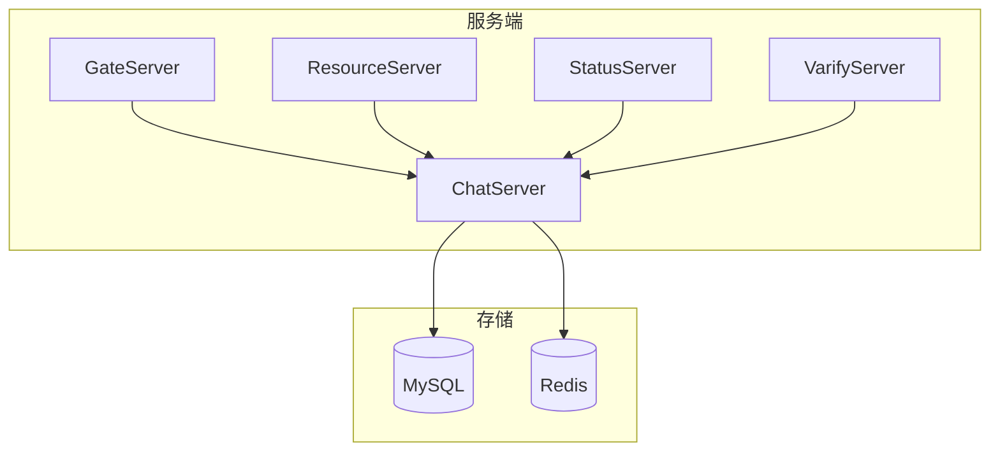
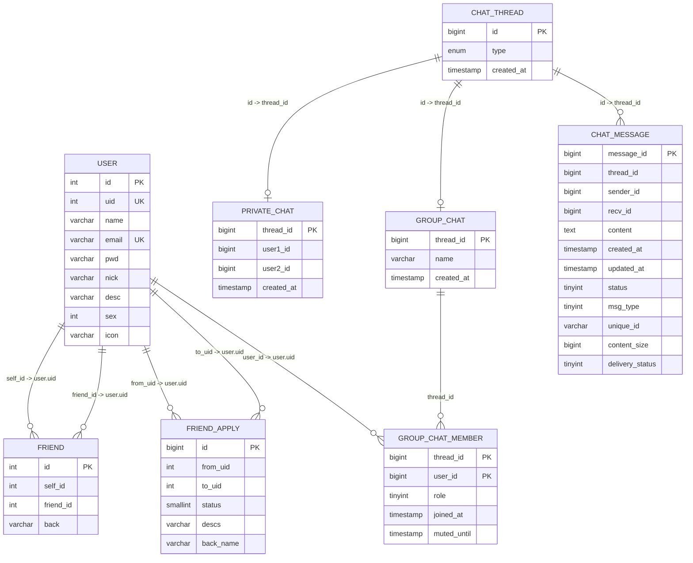
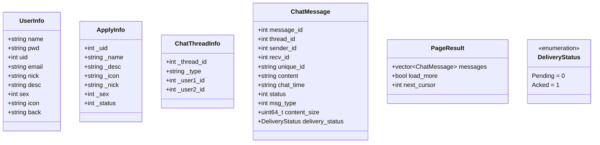

# 数据库表结构

<cite>
**本文引用的文件**   
- [llfc.sql](file://sql备份/llfc.sql)
- [chat_message.sql](file://sql备份/chat_message.sql)
- [20260730_message_reliability.sql](file://sql备份/20260730_message_reliability.sql)
- [llfc2.sql](file://sql备份/llfc2.sql)
- [llfc3.sql](file://sql备份/llfc3.sql)
- [data.h](file://server/ChatServer/include/data.h)
- [MysqlDao.h](file://server/ChatServer/include/MysqlDao.h)
- [MysqlDao.cpp](file://server/ChatServer/src/MysqlDao.cpp)
</cite>

## 更新摘要
**变更内容**   
- chat_message表新增幂等性支持字段：unique_id、content_size、delivery_status
- 新增唯一索引 uk_chat_message_sender_unique 支持消息去重
- 新增索引 idx_chat_message_pending 优化待投递消息查询
- status字段语义扩展，新增值3表示"未上传完成"状态
- 实现至少一次投递机制和ACK确认机制

## 目录
1. [简介](#简介)
2. [项目结构](#项目结构)
3. [核心组件](#核心组件)
4. [架构总览](#架构总览)
5. [详细组件分析](#详细组件分析)
6. [依赖关系分析](#依赖关系分析)
7. [性能考虑](#性能考虑)
8. [故障排查指南](#故障排查指南)
9. [结论](#结论)
10. [附录](#附录)

## 简介
本文件为 LLFCChat 项目的数据库表结构文档，覆盖以下核心表：user（用户信息表）、chat_message（聊天消息表）、friend（好友关系表）、friend_apply（好友申请表）、chat_thread（聊天会话表）、private_chat（私聊会话表）、group_chat（群聊表）、group_chat_member（群成员表）等。文档包含字段定义、数据类型、约束条件、索引设计、表间关系与关联规则、ER图、示例数据说明，以及主键/外键设计原则和唯一性约束的业务含义。

**最新更新**：chat_message表已增强幂等性支持，通过unique_id字段和相应的索引机制确保消息的至少一次投递和去重处理。

## 项目结构
本项目采用多服务架构（ChatServer、GateServer、ResourceServer、StatusServer、VarifyServer），其中 ChatServer 负责聊天业务逻辑与数据库访问。数据库脚本位于 sql备份 目录下，C++ 数据模型与 DAO 层位于 server/ChatServer 中。

本节为概念性概览，不直接分析具体文件，故无"章节来源"。

## 核心组件
- 数据模型与类型映射：data.h 定义了 UserInfo、ApplyInfo、ChatThreadInfo、ChatMessage、PageResult 等结构体，用于在 C++ 层表示数据库记录与查询结果。
- 数据库访问层：MysqlDao.h/.cpp 提供注册、登录、好友申请、好友认证、会话创建、消息加载与发送等 DAO 方法，封装 MySQL 连接池与 SQL 操作。
- 数据库脚本：sql备份/*.sql 包含完整的建表语句、初始数据与存储过程，是数据库结构的权威来源。

**章节来源**
- [data.h:1-119](file://server/ChatServer/include/data.h#L1-L119)
- [MysqlDao.h:1-526](file://server/ChatServer/include/MysqlDao.h#L1-L526)
- [MysqlDao.cpp:1-200](file://server/ChatServer/src/MysqlDao.cpp#L1-L200)

## 架构总览
LLFCChat 的数据库以 user 为核心实体，通过 friend/friend_apply 管理好友关系，通过 chat_thread/private_chat/group_chat/group_chat_member 组织会话与成员，通过 chat_message 持久化消息。整体关系如下：

**图表来源**
- [llfc.sql:24-42](file://sql备份/llfc.sql#L24-L42)
- [llfc.sql:150-155](file://sql备份/llfc.sql#L150-L155)
- [llfc.sql:180-187](file://sql备份/llfc.sql#L180-L187)
- [llfc.sql:295-304](file://sql备份/llfc.sql#L295-304)
- [llfc.sql:364-369](file://sql备份/llfc.sql#L364-369)
- [llfc.sql:383-391](file://sql备份/llfc.sql#L383-391)
- [llfc.sql:409-418](file://sql备份/llfc.sql#L409-418)
- [llfc.sql:467-481](file://sql备份/llfc.sql#L467-481)

## 详细组件分析

### 表：user（用户信息表）
- 字段与类型
  - id: int, 自增主键
  - uid: int, 业务用户ID，唯一索引
  - name: varchar(255), 用户名
  - email: varchar(255), 邮箱，唯一索引
  - pwd: varchar(255), 密码
  - nick: varchar(255), 昵称
  - desc: varchar(255), 描述
  - sex: int, 性别
  - icon: varchar(255), 头像路径
- 约束与索引
  - 主键：id
  - 唯一索引：uid、email
  - 普通索引：name
- 设计要点
  - uid 作为对外暴露的用户标识，具备唯一性；email 作为登录账号之一，亦需唯一。
  - 使用 utf8mb4 字符集，支持表情与多语言。
- 示例数据
  - 见 llfc.sql 中的 INSERT 语句（如 uid=1002、1019、1175、1176 等）。

**章节来源**
- [llfc.sql:467-481](file://sql备份/llfc.sql#L467-L481)

### 表：chat_thread（聊天会话表）
- 字段与类型
  - id: bigint, 自增主键
  - type: enum('private','group'), 会话类型
  - created_at: timestamp, 创建时间
- 约束与索引
  - 主键：id
- 设计要点
  - 统一抽象私聊与群聊会话，便于消息层通用处理。
- 示例数据
  - 见 llfc.sql 中的 INSERT 语句（如 id=35 private、45 group 等）。

**章节来源**
- [llfc.sql:150-155](file://sql备份/llfc.sql#L150-L155)

### 表：private_chat（私聊会话表）
- 字段与类型
  - thread_id: bigint, 主键，引用 chat_thread.id
  - user1_id: bigint, 参与者1
  - user2_id: bigint, 参与者2
  - created_at: timestamp, 创建时间
- 约束与索引
  - 主键：thread_id
  - 唯一索引：(user1_id, user2_id)，保证同一对用户仅有一个私聊会话
  - 辅助索引：idx_private_user1_thread(user1_id, thread_id)、idx_private_user2_thread(user2_id, thread_id)
- 设计要点
  - 通过唯一索引确保一对用户只有一个私聊会话，避免重复创建。
  - 辅助索引优化按用户查找其会话的性能。
- 示例数据
  - 见 llfc.sql 中的 INSERT 语句（如 thread_id=35, user1_id=1019, user2_id=1002）。

**章节来源**
- [llfc.sql:409-418](file://sql备份/llfc.sql#L409-L418)

### 表：group_chat（群聊表）
- 字段与类型
  - thread_id: bigint, 主键，引用 chat_thread.id
  - name: varchar(255), 群名称（可为空）
  - created_at: timestamp, 创建时间
- 约束与索引
  - 主键：thread_id
- 设计要点
  - 与 chat_thread.type='group' 对应，扩展群聊元数据。
- 示例数据
  - 见 llfc.sql 中的 INSERT 语句（如 thread_id=45、46、47、48）。

**章节来源**
- [llfc.sql:364-369](file://sql备份/llfc.sql#L364-L369)

### 表：group_chat_member（群成员表）
- 字段与类型
  - thread_id: bigint, 主键左部，引用 group_chat.thread_id
  - user_id: bigint, 主键右部，引用 user.uid
  - role: tinyint, 角色（0普通成员、1管理员、2创建者）
  - joined_at: timestamp, 加入时间
  - muted_until: timestamp, 禁言截止时间（可空）
- 约束与索引
  - 复合主键：(thread_id, user_id)
  - 普通索引：idx_user_threads(user_id)
- 设计要点
  - 复合主键保证每个用户在每个群仅有一条成员记录。
  - 索引 idx_user_threads 支持按用户查询其所在群列表。
- 示例数据
  - 见 llfc.sql 中的 INSERT 语句（如 thread_id=45, user_id=1213/1275）。

**章节来源**
- [llfc.sql:383-391](file://sql备份/llfc.sql#L383-L391)

### 表：friend（好友关系表）
- 字段与类型
  - id: int, 自增主键
  - self_id: int, 自己
  - friend_id: int, 好友
  - back: varchar(255), 备注名
- 约束与索引
  - 主键：id
  - 唯一索引：(self_id, friend_id)，防止重复添加同一好友
- 设计要点
  - 双向好友关系通常由两条记录表示（A->B 与 B->A），back 字段可分别保存各自备注。
- 示例数据
  - 见 llfc.sql 中的 INSERT 语句（如 self_id=1019, friend_id=1002 与反向记录）。

**章节来源**
- [llfc.sql:180-187](file://sql备份/llfc.sql#L180-L187)

### 表：friend_apply（好友申请表）
- 字段与类型
  - id: bigint, 自增主键
  - from_uid: int, 申请人
  - to_uid: int, 被申请人
  - status: smallint, 状态（如 0待处理、1已同意等）
  - descs: varchar(255), 申请说明
  - back_name: varchar(255), 对方备注名
- 约束与索引
  - 主键：id
  - 唯一索引：(from_uid, to_uid)，防止重复申请
- 设计要点
  - 唯一索引确保同一申请人对同一被申请人的申请只存在一条记录，便于更新状态或备注。
- 示例数据
  - 见 llfc.sql 中的 INSERT 语句（如 from_uid=1002, to_uid=1019, status=1）。

**章节来源**
- [llfc.sql:295-304](file://sql备份/llfc.sql#L295-304)

### 表：chat_message（聊天消息表）
**更新** 该表已增强幂等性支持和投递状态管理

- 字段与类型
  - message_id: bigint, 自增主键
  - thread_id: bigint, 会话ID
  - sender_id: bigint, 发送者
  - recv_id: bigint, 接收者（私聊时为对方，群聊时可能为0或广播语义）
  - content: text, 消息内容
  - created_at: timestamp, 创建时间
  - updated_at: timestamp, 更新时间（默认当前时间，更新时自动刷新）
  - status: tinyint, 消息状态（0未读、1发送失败、2已读、3资源未上传完成）
  - msg_type: tinyint, 消息类型（0文本、1图片、2视频、3文件）
  - **unique_id**: varchar(64), 客户端去重标识，历史/系统消息为NULL
  - **content_size**: bigint unsigned, 内容字节大小（文本为0，图片为字节数）
  - **delivery_status**: tinyint, 投递状态（0待投递、1已投递ACK）
- 约束与索引
  - 主键：message_id
  - **唯一索引**：uk_chat_message_sender_unique(sender_id, unique_id) - 同一发送者的unique_id唯一
  - 复合索引：idx_thread_created(thread_id, created_at)
  - 复合索引：idx_thread_message(thread_id, message_id)
  - **新索引**：idx_chat_message_pending(recv_id, delivery_status, message_id) - 待投递消息查询
- 设计要点
  - **幂等性支持**：通过unique_id字段和唯一索引确保同一发送者的消息不会重复插入
  - **投递状态分离**：delivery_status独立于status，专门管理消息投递状态
  - **内容大小跟踪**：content_size字段记录消息内容大小，便于离线资源管理
  - **两个复合索引**分别支持按会话+时间分页与按会话+消息ID分页，满足历史消息拉取与断点续传场景
  - **updated_at**可用于消息撤回、编辑等场景的时间戳追踪
- 示例数据
  - 见 llfc.sql 中的 INSERT 语句（如 thread_id=35、45、46 等多条消息，包含unique_id、content_size、delivery_status字段）。

**章节来源**
- [chat_message.sql:24-42](file://sql备份/chat_message.sql#L24-L42)
- [20260730_message_reliability.sql:165-200](file://sql备份/20260730_message_reliability.sql#L165-L200)

## 依赖关系分析
- 实体关系
  - user 与 friend/friend_apply：通过 uid 关联，实现好友关系与申请流程。
  - user 与 group_chat_member：通过 user_id 关联，维护群成员权限与状态。
  - chat_thread 与 private_chat/group_chat：通过 thread_id 一对一扩展私聊/群聊元数据。
  - chat_thread 与 chat_message：通过 thread_id 一对多关联消息。
- 索引与查询优化
  - private_chat 的唯一索引 (user1_id, user2_id) 保障会话唯一性。
  - chat_message 的复合索引支撑高效分页与定位。
  - **新增**：uk_chat_message_sender_unique 确保消息幂等性，idx_chat_message_pending 优化待投递消息查询。
  - group_chat_member 的复合主键与用户索引提升成员查询效率。
- DAO 层调用
  - MysqlDao 提供 RegUser、CheckPwd、AddFriendApply、AuthFriendApply、CreatePrivateChat、LoadChatMsg、AddChatMsg 等方法，直接映射到上述表的 CRUD 操作。
  - **新增**：SaveMessageResult枚举和幂等消息写入逻辑。

**图表来源**
- [data.h:1-119](file://server/ChatServer/include/data.h#L1-L119)

**章节来源**
- [MysqlDao.h:289-526](file://server/ChatServer/include/MysqlDao.h#L289-L526)
- [MysqlDao.cpp:1-200](file://server/ChatServer/src/MysqlDao.cpp#L1-L200)

## 性能考虑
- 索引策略
  - chat_message 的 idx_thread_created 与 idx_thread_message 分别优化按时间与按 ID 的分页查询，适合历史消息滚动加载。
  - private_chat 的 uniq_private_thread 避免重复会话创建带来的冗余与冲突。
  - group_chat_member 的 idx_user_threads 加速"我的群"列表查询。
  - **新增**：uk_chat_message_sender_unique 确保幂等性查询性能，idx_chat_message_pending 优化待投递消息批量查询。
- 存储引擎与字符集
  - InnoDB 引擎支持事务与行级锁，utf8mb4 字符集支持完整 Unicode。
- 连接池与健康检查
  - MySqlPool 维护连接池并定期检测连接健康，失败自动重连，提升稳定性。
- **幂等性优化**
  - 通过唯一索引避免重复插入，减少不必要的数据库操作。
  - 待投递消息索引优化离线消息推送性能。
- 建议
  - 对高频查询字段（如 thread_id、created_at、user_id）保持合适的索引。
  - 大字段（content）若频繁检索，可考虑分表或归档策略。
  - 监控幂等性冲突率，必要时调整unique_id生成策略。

本节为一般性指导，不直接分析具体文件，故无"章节来源"。

## 故障排查指南
- 常见问题
  - 重复好友申请：检查 friend_apply 的唯一索引 (from_uid, to_uid)。
  - 私聊会话重复：检查 private_chat 的唯一索引 (user1_id, user2_id)。
  - 消息分页异常：确认 chat_message 的 idx_thread_created 与 idx_thread_message 是否存在且有效。
  - **幂等性冲突**：检查 uk_chat_message_sender_unique 索引是否正常工作。
  - **待投递消息堆积**：检查 idx_chat_message_pending 索引和delivery_status字段更新逻辑。
- 诊断步骤
  - 查看 MysqlDao 的 SQL 执行日志与异常输出。
  - 校验存储过程 reg_user 的事务回滚与返回值。
  - 验证连接池健康检查线程是否正常运行。
  - **新增**：检查幂等性冲突的unique_id生成逻辑和冲突处理机制。
  - **新增**：监控待投递消息队列长度和ACK确认延迟。

**章节来源**
- [MysqlDao.cpp:1-200](file://server/ChatServer/src/MysqlDao.cpp#L1-L200)
- [llfc.sql:660-756](file://sql备份/llfc.sql#L660-L756)

## 结论
LLFCChat 的数据库设计围绕用户、好友关系、会话与消息展开，采用统一的 chat_thread 抽象私聊与群聊，并通过合理的索引与唯一约束保障数据一致性与查询性能。**最新增强**：chat_message表通过unique_id字段和相应索引实现了幂等性支持，通过delivery_status字段实现了至少一次投递机制，提升了系统的可靠性和一致性。DAO 层将业务逻辑与数据库操作解耦，便于扩展与维护。建议在后续迭代中持续监控热点查询与数据增长，适时进行分库分表或冷热数据分离。

本节为总结性内容，不直接分析具体文件，故无"章节来源"。

## 附录

### ER图（代码级映射）

**图表来源**
- [llfc.sql:24-42](file://sql备份/llfc.sql#L24-L42)
- [llfc.sql:150-155](file://sql备份/llfc.sql#L150-L155)
- [llfc.sql:180-187](file://sql备份/llfc.sql#L180-L187)
- [llfc.sql:295-304](file://sql备份/llfc.sql#L295-304)
- [llfc.sql:364-369](file://sql备份/llfc.sql#L364-369)
- [llfc.sql:383-391](file://sql备份/llfc.sql#L383-391)
- [llfc.sql:409-418](file://sql备份/llfc.sql#L409-L418)
- [llfc.sql:467-481](file://sql备份/llfc.sql#L467-L481)

### 主键与外键设计原则
- 主键
  - 使用自增整数或 bigint 作为主键，保证唯一性与顺序性。
  - 复合主键适用于多对多关系（如 group_chat_member）。
- 外键
  - 当前脚本未显式声明外键约束，但通过命名约定与业务逻辑保证一致性（如 thread_id、user_id、uid）。
  - 建议在应用层进行完整性校验，必要时可在数据库层启用外键约束。
- 唯一性约束
  - uid、email 唯一保证用户身份唯一。
  - (user1_id, user2_id) 唯一保证私聊会话唯一。
  - (from_uid, to_uid) 唯一防止重复申请。
  - (self_id, friend_id) 唯一防止重复好友关系。
  - **新增**：(sender_id, unique_id) 唯一保证消息幂等性。

本节为概念性说明，不直接分析具体文件，故无"章节来源"。

### 示例数据说明
- user：包含多个测试用户（如 uid=1002、1019、1175、1176 等），用于演示好友关系与聊天功能。
- chat_thread：包含私聊与会话（type='private'）与群聊（type='group'）样例。
- private_chat：展示一对用户的私聊会话。
- group_chat/group_chat_member：展示群聊及其成员角色。
- friend/friend_apply：展示好友关系与申请状态。
- chat_message：展示多条聊天记录，涵盖不同 thread_id 与消息类型，**包含unique_id、content_size、delivery_status字段**。

**章节来源**
- [llfc.sql:42-144](file://sql备份/llfc.sql#L42-L144)
- [llfc.sql:160-174](file://sql备份/llfc.sql#L160-L174)
- [llfc.sql:374-403](file://sql备份/llfc.sql#L374-L403)
- [llfc.sql:423-433](file://sql备份/llfc.sql#L423-L433)
- [llfc.sql:192-289](file://sql备份/llfc.sql#L192-L289)
- [llfc.sql:309-358](file://sql备份/llfc.sql#L309-L358)

### 幂等性机制详解
**新增**：chat_message表通过以下机制实现消息幂等性：

- **unique_id字段**：客户端生成的唯一标识符，用于识别同一消息的不同重试请求
- **唯一索引**：uk_chat_message_sender_unique(sender_id, unique_id) 确保同一发送者的unique_id唯一
- **UPSERT逻辑**：AddChatMsg方法使用INSERT ... ON DUPLICATE KEY UPDATE语法
- **冲突检测**：当unique_id冲突时，比较content、msg_type、content_size等字段判断是否为相同消息
- **状态分离**：delivery_status独立管理投递状态，status管理展示状态

**章节来源**
- [20260730_message_reliability.sql:1-210](file://sql备份/20260730_message_reliability.sql#L1-L210)
- [MysqlDao.h:289-526](file://server/ChatServer/include/MysqlDao.h#L289-L526)

### 投递状态管理机制
**新增**：delivery_status字段实现至少一次投递机制：

- **状态值**：0=待投递，1=已投递(ACK)
- **默认值**：新消息默认为0（待投递），历史消息默认为1（已投递）
- **查询优化**：idx_chat_message_pending索引支持按recv_uid快速查询待投递消息
- **ACK确认**：MarkMessagesDelivered方法批量更新投递状态
- **防越权**：所有UPDATE操作都带recv_id过滤，防止越权修改

**章节来源**
- [20260730_message_reliability.sql:175-187](file://sql备份/20260730_message_reliability.sql#L175-L187)
- [MysqlDao.h:494-502](file://server/ChatServer/include/MysqlDao.h#L494-L502)