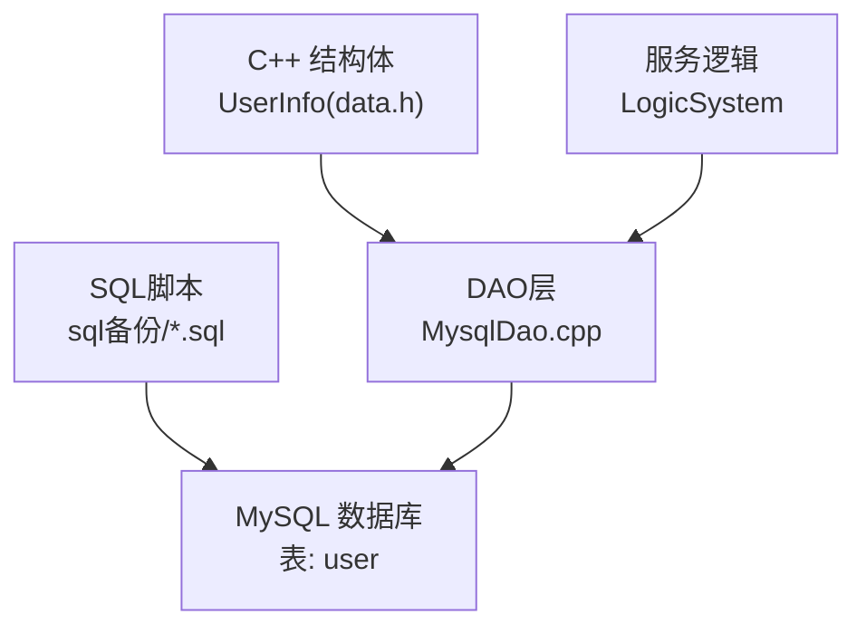
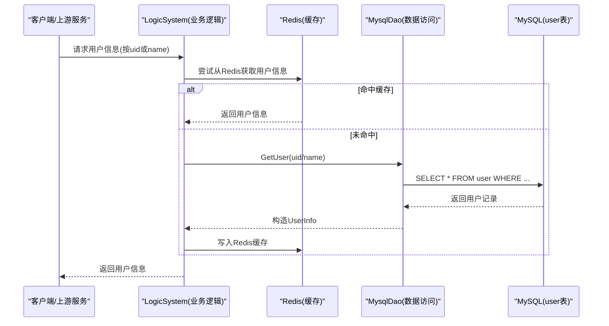
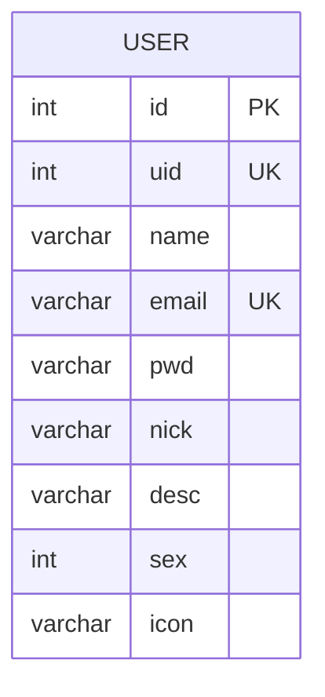
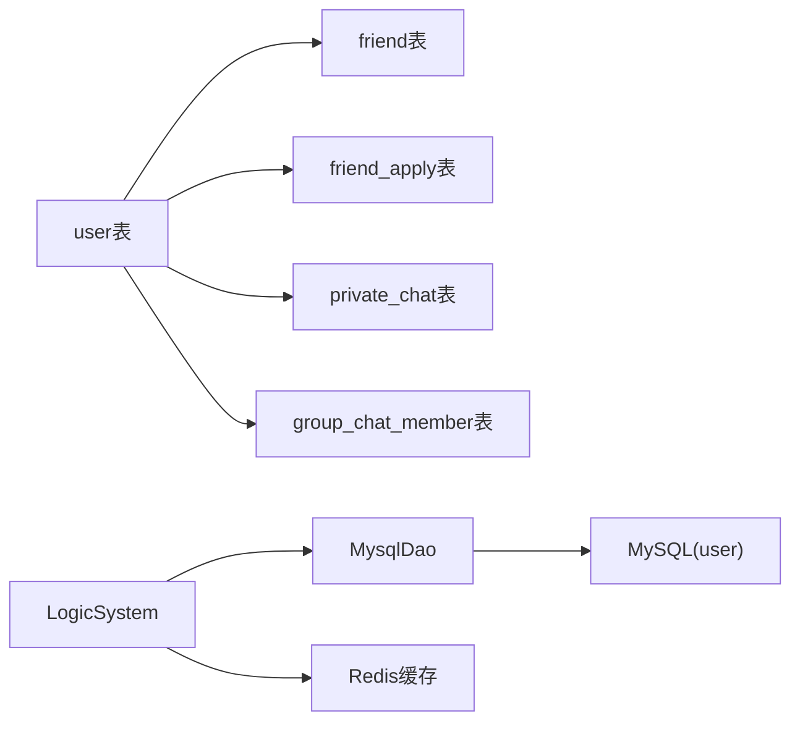

# 用户信息表(user)

<cite>
**本文引用的文件**   
- [llfc.sql](file://sql备份/llfc.sql)
- [llfc2.sql](file://sql备份/llfc2.sql)
- [llfc3.sql](file://sql备份/llfc3.sql)
- [MysqlDao.cpp（GateServer）](file://server/GateServer/src/MysqlDao.cpp)
- [data.h（ChatServer）](file://server/ChatServer/include/data.h)
</cite>

## 更新摘要
**已进行的更改**
- 更新了用户注册逻辑的实现方式，从使用user_id发号器改为直接使用自增主键id作为uid
- 移除了对user_id表的依赖，简化了注册流程
- 新增了RegUserTransaction方法的详细实现说明
- 更新了存储过程reg_user的逻辑描述
- 完善了uid生成机制的技术细节

## 目录
1. [简介](#简介)
2. [项目结构](#项目结构)
3. [核心组件](#核心组件)
4. [架构总览](#架构总览)
5. [详细组件分析](#详细组件分析)
6. [依赖关系分析](#依赖关系分析)
7. [性能考虑](#性能考虑)
8. [故障排查指南](#故障排查指南)
9. [结论](#结论)
10. [附录](#附录)

## 简介
本文件为 LLFCChat 的用户信息表 user 的完整技术文档，聚焦字段定义、约束与索引策略，解释业务主键 uid 的设计原则，email 唯一性约束的实现方式，以及查询优化建议。同时给出基于仓库中 SQL 脚本的结构说明与示例数据引用路径，帮助读者快速理解并正确使用该表。

**重要更新**：用户注册逻辑已采用方案A，废弃user_id发号器表，注册时直接使用user表自增主键id作为对外uid。新的注册流程通过INSERT省略uid列后使用LAST_INSERT_ID()获取新主键，再UPDATE user SET uid = id回填，实现了更简洁高效的uid生成机制。

## 项目结构
- 数据库定义位于 sql备份 目录下的多个版本 SQL 文件中，user 表结构在各版本中保持一致。
- 服务端数据结构 data.h 定义了 UserInfo 结构体，与 user 表的字段一一对应。
- MysqlDao.cpp 声明了访问 user 表的核心方法，包括新的RegUserTransaction方法实现。
- 存储过程 reg_user 已更新以支持新的注册逻辑。



图表来源
- [llfc.sql:467-481](file://sql备份/llfc.sql#L467-L481)
- [data.h（ChatServer）:12-24](file://server/ChatServer/include/data.h#L12-L24)
- [MysqlDao.cpp（GateServer）:59-153](file://server/GateServer/src/MysqlDao.cpp#L59-L153)

章节来源
- [llfc.sql:467-481](file://sql备份/llfc.sql#L467-L481)
- [llfc2.sql:179-193](file://sql备份/llfc2.sql#L179-193)
- [llfc3.sql:221-235](file://sql备份/llfc3.sql#L221-235)
- [data.h（ChatServer）:12-24](file://server/ChatServer/include/data.h#L12-L24)
- [MysqlDao.cpp（GateServer）:59-153](file://server/GateServer/src/MysqlDao.cpp#L59-L153)

## 核心组件
- 用户表 user：存储用户基础信息与认证相关字段。
- 业务主键 uid：作为跨系统一致的用户标识，具备唯一性约束，现在直接等于自增主键id。
- email 唯一性：通过唯一索引保证邮箱全局唯一。
- name 索引：提供用户名检索加速。
- 服务端结构体 UserInfo：与 user 表字段映射，用于服务间数据传输与处理。
- 新的注册事务处理：RegUserTransaction方法实现了无发号器的注册逻辑。

章节来源
- [llfc.sql:467-481](file://sql备份/llfc.sql#L467-L481)
- [data.h（ChatServer）:12-24](file://server/ChatServer/include/data.h#L12-L24)
- [MysqlDao.cpp（GateServer）:59-153](file://server/GateServer/src/MysqlDao.cpp#L59-L153)

## 架构总览
下图展示用户信息在系统中的流转：客户端或服务端调用 DAO 层访问 MySQL，业务逻辑层使用 Redis 缓存用户信息，uid 作为关键路由与关联键贯穿全链路。新的注册流程简化了uid生成步骤。



图表来源
- [MysqlDao.cpp（GateServer）:59-153](file://server/GateServer/src/MysqlDao.cpp#L59-L153)
- [llfc.sql:467-481](file://sql备份/llfc.sql#L467-L481)

## 详细组件分析

### 表结构与字段定义
- id：自增主键，整型，用于内部行定位。
- uid：业务主键，整型，非空且默认值为 0，全局唯一（唯一索引），**现已直接等于自增主键id**。
- name：用户名，变长字符串，非空默认空串。
- email：邮箱，变长字符串，非空默认空串，唯一索引。
- pwd：密码，变长字符串，非空默认空串。
- nick：昵称，变长字符串，非空默认空串。
- desc：描述，变长字符串，非空默认空串。
- sex：性别，整型，非空默认 0。
- icon：头像路径或标识，变长字符串，非空默认空串。



图表来源
- [llfc.sql:467-481](file://sql备份/llfc.sql#L467-L481)
- [llfc2.sql:179-193](file://sql备份/llfc2.sql#L179-193)
- [llfc3.sql:221-235](file://sql备份/llfc3.sql#L221-235)

章节来源
- [llfc.sql:467-481](file://sql备份/llfc.sql#L467-L481)
- [llfc2.sql:179-193](file://sql备份/llfc2.sql#L179-193)
- [llfc3.sql:221-235](file://sql备份/llfc3.sql#L221-235)

### 业务主键 uid 的设计原则
- 一致性：uid 作为跨服务、跨模块统一的用户标识，避免使用自增 id 暴露内部实现细节。
- 唯一性：通过唯一索引保障全局唯一，防止重复分配。
- 可寻址：在登录、会话绑定、好友关系、消息发送等场景中，uid 作为外键或关联键，简化查询与路由。
- 可扩展：当需要分库分表时，uid 可作为分片键的基础。
- **新设计**：采用方案A，uid直接等于自增主键id，简化了uid生成逻辑，消除了对独立发号器的依赖。

章节来源
- [llfc.sql:467-481](file://sql备份/llfc.sql#L467-L481)
- [MysqlDao.cpp（GateServer）:108-136](file://server/GateServer/src/MysqlDao.cpp#L108-L136)

### 新的注册流程实现（方案A）
**已更新**：用户注册逻辑已完全重写，采用方案A实现：

1. **移除发号器依赖**：删除了`UPDATE user_id SET id = id + 1`与`SELECT id FROM user_id`逻辑
2. **简化插入操作**：INSERT语句省略uid列，走DEFAULT 0值
3. **获取新主键**：使用`SELECT LAST_INSERT_ID()`获取新插入记录的自增主键id
4. **回填uid**：执行`UPDATE user SET uid = ? WHERE id = ?`将uid设置为id的值
5. **事务保证**：整个流程在事务中执行，确保数据一致性

```mermaid
flowchart TD
A[开始注册] --> B[检查email是否已存在]
B --> C{email存在?}
C --> |是| D[返回0 - 用户已存在]
C --> |否| E[检查name是否已存在]
E --> F{name存在?}
F --> |是| G[返回0 - 用户名已存在]
F --> |否| H[INSERT user表(省略uid列)]
H --> I[SELECT LAST_INSERT_ID()获取新id]
I --> J[UPDATE user SET uid = id WHERE id = newId]
J --> K[提交事务]
K --> L[返回newId作为uid]
```

图表来源
- [MysqlDao.cpp（GateServer）:59-153](file://server/GateServer/src/MysqlDao.cpp#L59-L153)

章节来源
- [MysqlDao.cpp（GateServer）:59-153](file://server/GateServer/src/MysqlDao.cpp#L59-L153)

### email 的唯一性约束
- 通过 UNIQUE INDEX `email`(`email`) 保证邮箱全局唯一，避免重复注册。
- 在注册流程中，DAO 层会检查 email 是否已存在，确保数据一致性。
- 重置密码等敏感操作需校验 email 与 name 匹配，防止越权。

章节来源
- [llfc.sql:467-481](file://sql备份/llfc.sql#L467-L481)
- [MysqlDao.cpp（GateServer）:77-90](file://server/GateServer/src/MysqlDao.cpp#L77-L90)

### 索引优化策略
- 主键 id：BTREE 索引，用于行级定位与自增插入优化。
- 唯一索引 uid：BTREE 索引，支撑按 uid 精确查找与去重，**现已与id值相同**。
- 唯一索引 email：BTREE 索引，支撑邮箱唯一性与登录校验。
- 普通索引 name：BTREE 索引，提升用户名搜索性能。
- 字符集与排序规则：utf8mb4 + unicode_ci，支持多语言与大小写不敏感比较。

章节来源
- [llfc.sql:467-481](file://sql备份/llfc.sql#L467-L481)
- [llfc2.sql:179-193](file://sql备份/llfc2.sql#L179-193)
- [llfc3.sql:221-235](file://sql备份/llfc3.sql#L221-235)

### 示例数据
以下示例数据来自 SQL 脚本中的 INSERT 语句，可用于验证字段含义与取值范围（仅展示路径，不直接列出内容）：
- 示例用户记录路径：[llfc.sql:486-643](file://sql备份/llfc.sql#L486-L643)
- 示例用户记录路径：[llfc2.sql:198-250](file://sql备份/llfc2.sql#L198-L250)
- 示例用户记录路径：[llfc3.sql:240-319](file://sql备份/llfc3.sql#L240-L319)

**注意**：由于采用了新的注册逻辑，新用户的数据将满足`user.uid == user.id`的条件，而老用户可能保持原有的uid值。

章节来源
- [llfc.sql:486-643](file://sql备份/llfc.sql#L486-L643)
- [llfc2.sql:198-250](file://sql备份/llfc2.sql#L198-L250)
- [llfc3.sql:240-319](file://sql备份/llfc3.sql#L240-L319)

### 与服务端结构的映射
- UserInfo 结构体字段与 user 表字段一一对应，便于序列化与传输。
- 登录流程中，LogicSystem 优先从 Redis 获取用户信息，未命中则通过 MysqlDao.GetUser 查询 MySQL，并将结果缓存至 Redis。


图表来源
- [data.h（ChatServer）:12-24](file://server/ChatServer/include/data.h#L12-L24)

章节来源
- [data.h（ChatServer）:12-24](file://server/ChatServer/include/data.h#L12-L24)

## 依赖关系分析
- 表依赖：user 表被 friend、friend_apply、private_chat、group_chat_member 等表通过 uid 引用，形成社交关系与聊天会话的数据关联。
- 代码依赖：LogicSystem -> MysqlDao -> MySQL(user)，并通过 Redis 缓存提升性能。
- 约束依赖：uid 唯一索引与 email 唯一索引对注册与登录流程有强约束作用。
- **新依赖关系**：不再依赖user_id表，简化了数据依赖关系。



图表来源
- [llfc.sql:177-434](file://sql备份/llfc.sql#L177-L434)
- [MysqlDao.cpp（GateServer）:59-153](file://server/GateServer/src/MysqlDao.cpp#L59-L153)

章节来源
- [llfc.sql:177-434](file://sql备份/llfc.sql#L177-L434)
- [MysqlDao.cpp（GateServer）:59-153](file://server/GateServer/src/MysqlDao.cpp#L59-L153)

## 性能考虑
- 索引选择：uid 与 email 的唯一索引适合等值查询；name 索引适用于模糊前缀或精确匹配场景。
- 缓存策略：Redis 缓存用户信息，减少 MySQL 压力，提高响应速度。
- 连接池：MySqlPool 维护连接池并定期健康检查，降低连接开销与异常影响。
- 字符集：utf8mb4 支持广泛字符，但会增加存储空间与比较成本，需权衡。
- **新性能优势**：移除了user_id表的并发更新操作，减少了锁竞争和事务复杂度，提升了注册性能。

章节来源
- [MysqlDao.cpp（GateServer）:59-153](file://server/GateServer/src/MysqlDao.cpp#L59-L153)

## 故障排查指南
- 注册失败：检查 email 是否已存在（唯一索引冲突）、name 是否重复（业务校验）。
- 登录失败：确认 Redis 中 token 有效、uid 是否存在于 user 表、email 与 name 是否匹配。
- 查询缓慢：评估索引命中率，必要时增加覆盖索引或调整查询条件。
- 连接异常：查看 MySqlPool 健康检查日志，确认数据库连通性与权限。
- **新问题排查**：如果新用户uid不为正数，检查LAST_INSERT_ID()调用是否成功，确认INSERT操作是否正确执行。

章节来源
- [MysqlDao.cpp（GateServer）:59-153](file://server/GateServer/src/MysqlDao.cpp#L59-L153)

## 结论
user 表以自增 id 为主键、uid 为业务主键，配合 email 唯一索引与 name 索引，满足 LLFCChat 在注册、登录、社交关系与聊天场景下的数据需求。**新的注册方案A通过直接使用自增主键id作为uid，简化了uid生成逻辑，消除了对独立发号器的依赖，提升了系统性能和可维护性**。结合 Redis 缓存与连接池管理，系统在性能与可靠性方面具备良好表现。建议在后续扩展中继续围绕 uid 进行分片与缓存设计，保持数据一致性与高可用。

## 附录
- 字段类型与约束总结：
  - id：INT，自增主键
  - uid：INT，非空，默认 0，唯一索引，**现已直接等于id值**
  - name：VARCHAR(255)，非空，默认空串
  - email：VARCHAR(255)，非空，默认空串，唯一索引
  - pwd：VARCHAR(255)，非空，默认空串
  - nick：VARCHAR(255)，非空，默认空串
  - desc：VARCHAR(255)，非空，默认空串
  - sex：INT，非空，默认 0
  - icon：VARCHAR(255)，非空，默认空串

章节来源
- [llfc.sql:467-481](file://sql备份/llfc.sql#L467-L481)
- [llfc2.sql:179-193](file://sql备份/llfc2.sql#L179-193)
- [llfc3.sql:221-235](file://sql备份/llfc3.sql#L221-235)
- [MysqlDao.cpp（GateServer）:59-153](file://server/GateServer/src/MysqlDao.cpp#L59-L153)