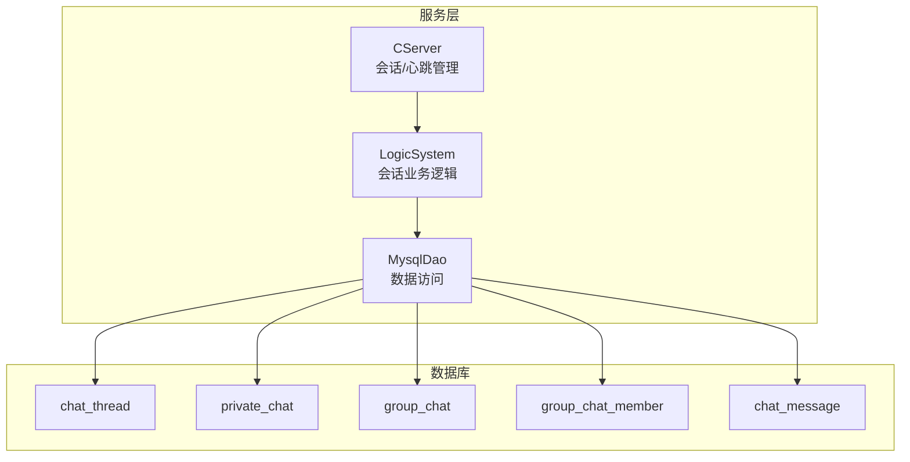
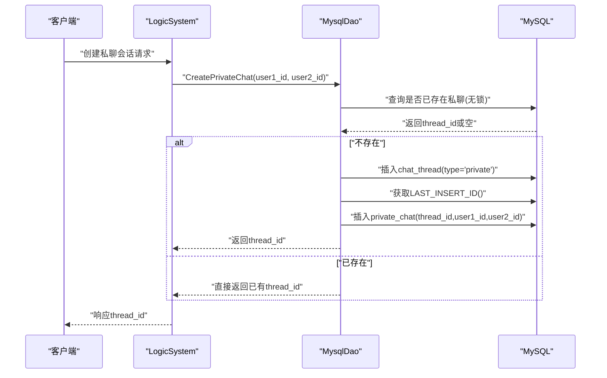
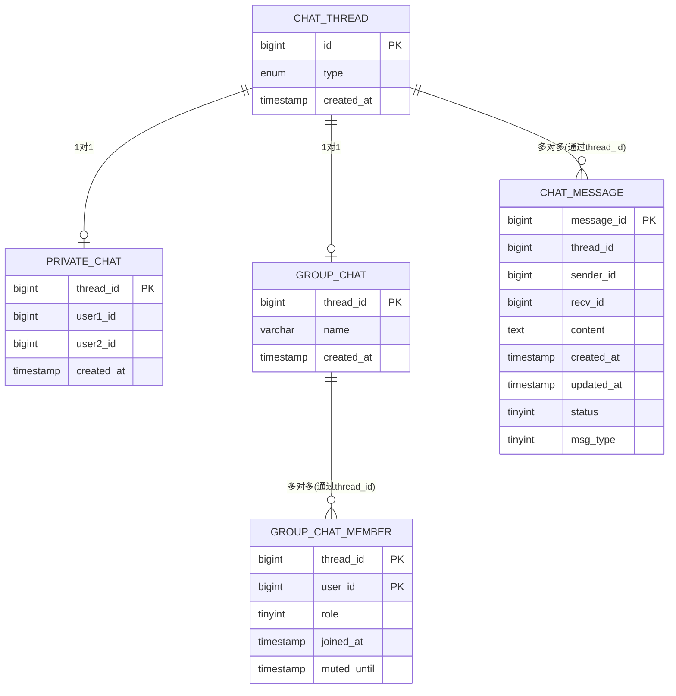
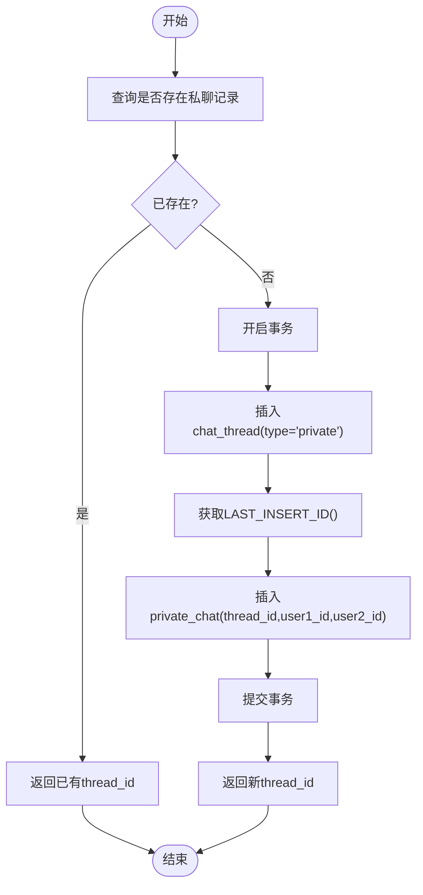
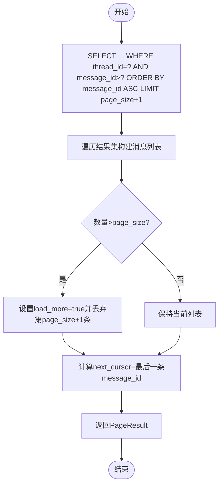
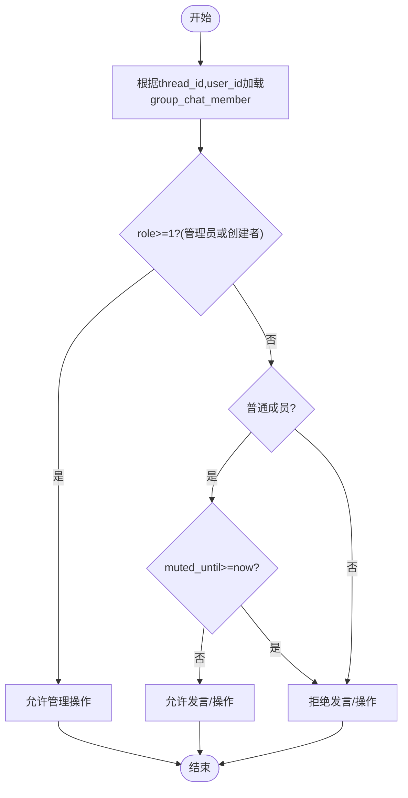
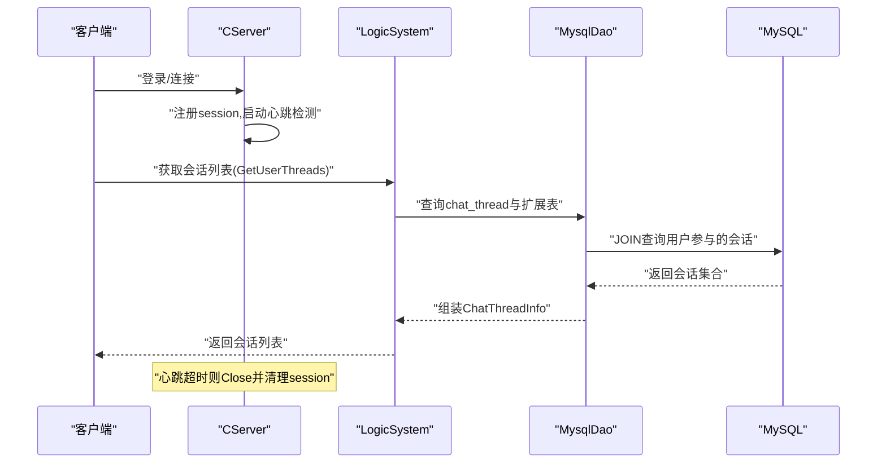
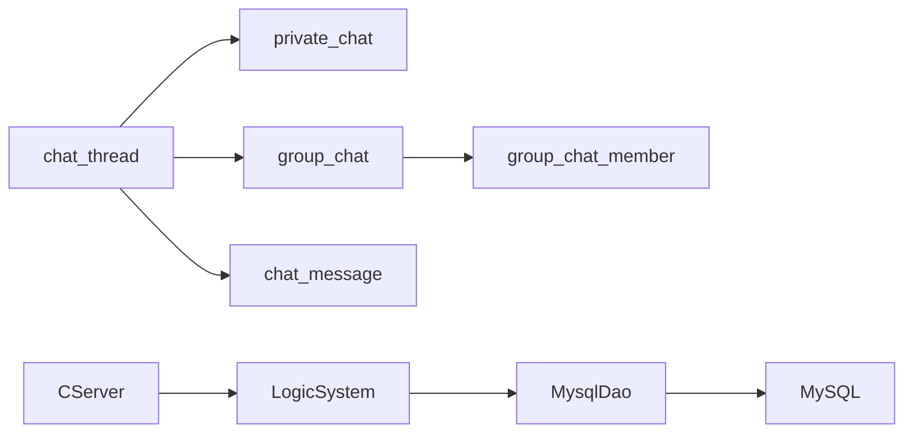

# 聊天会话表(chat_thread, private_chat, group_chat, group_chat_member)

<cite>
**本文引用的文件**   
- [llfc3.sql](file://sql备份/llfc3.sql)
- [llfc2.sql](file://sql备份/llfc2.sql)
- [llfc.sql](file://sql备份/llfc.sql)
- [data.h](file://server/ChatServer/include/data.h)
- [MysqlDao.h](file://server/ChatServer/include/MysqlDao.h)
- [MysqlDao.cpp](file://server/ChatServer/src/MysqlDao.cpp)
- [LogicSystem.cpp](file://server/ChatServer/src/LogicSystem.cpp)
- [CServer.cpp](file://server/ChatServer/src/CServer.cpp)
</cite>

## 目录
1. [简介](#简介)
2. [项目结构](#项目结构)
3. [核心组件](#核心组件)
4. [架构总览](#架构总览)
5. [详细组件分析](#详细组件分析)
6. [依赖关系分析](#依赖关系分析)
7. [性能考虑](#性能考虑)
8. [故障排查指南](#故障排查指南)
9. [结论](#结论)

## 简介
本文件面向LLFCChat项目的聊天会话相关数据库表与后端实现，重点说明以下四张表的设计与作用：
- chat_thread（会话基础表）：统一抽象私聊与群聊的“会话”概念，通过type字段区分类型。
- private_chat（私聊会话表）：存储私聊双方用户ID及创建时间，与chat_thread一一对应。
- group_chat（群聊表）：存储群聊基本信息（如名称），与chat_thread一一对应。
- group_chat_member（群成员表）：管理群成员的加入时间、角色（普通成员/管理员/创建者）以及禁言截止时间。

文档同时解释会话生命周期管理与权限控制机制，包括私聊会话创建、消息加载、群成员角色与禁言策略等。

## 项目结构
与聊天会话相关的SQL定义位于sql备份目录下；服务端逻辑在server/ChatServer中，包含数据访问层（MysqlDao）、业务逻辑层（LogicSystem）以及会话管理（CServer）。

图表来源
- [llfc3.sql:47-55](file://sql备份/llfc3.sql#L47-L55)
- [llfc3.sql:165-173](file://sql备份/llfc3.sql#L165-L173)
- [llfc3.sql:180-191](file://sql备份/llfc3.sql#L180-L191)
- [llfc3.sql:198-210](file://sql备份/llfc3.sql#L198-L210)
- [llfc3.sql:21-36](file://sql备份/llfc3.sql#L21-L36)
- [MysqlDao.h:236-267](file://server/ChatServer/include/MysqlDao.h#L236-L267)
- [LogicSystem.cpp:828-852](file://server/ChatServer/src/LogicSystem.cpp#L828-L852)
- [CServer.cpp:47-100](file://server/ChatServer/src/CServer.cpp#L47-L100)

章节来源
- [llfc3.sql:47-55](file://sql备份/llfc3.sql#L47-L55)
- [llfc3.sql:165-173](file://sql备份/llfc3.sql#L165-L173)
- [llfc3.sql:180-191](file://sql备份/llfc3.sql#L180-L191)
- [llfc3.sql:198-210](file://sql备份/llfc3.sql#L198-L210)
- [llfc3.sql:21-36](file://sql备份/llfc3.sql#L21-L36)
- [MysqlDao.h:236-267](file://server/ChatServer/include/MysqlDao.h#L236-L267)
- [LogicSystem.cpp:828-852](file://server/ChatServer/src/LogicSystem.cpp#L828-L852)
- [CServer.cpp:47-100](file://server/ChatServer/src/CServer.cpp#L47-L100)

## 核心组件
- 会话基础表 chat_thread：统一会话标识与类型，作为私聊与群聊的根实体。
- 私聊扩展表 private_chat：绑定两个用户，确保同一对用户的私聊会话唯一性。
- 群聊扩展表 group_chat：存储群聊元信息（如名称）。
- 群成员表 group_chat_member：记录成员角色与禁言状态，支持权限控制。
- 消息表 chat_message：承载会话中的消息内容、发送者与接收者、状态等。

章节来源
- [llfc3.sql:47-55](file://sql备份/llfc3.sql#L47-L55)
- [llfc3.sql:198-210](file://sql备份/llfc3.sql#L198-L210)
- [llfc3.sql:165-173](file://sql备份/llfc3.sql#L165-L173)
- [llfc3.sql:180-191](file://sql备份/llfc3.sql#L180-L191)
- [llfc3.sql:21-36](file://sql备份/llfc3.sql#L21-L36)

## 架构总览
聊天会话的数据流与服务交互如下：客户端请求由LogicSystem处理，调用MysqlDao进行数据库操作，最终读写chat_thread、private_chat、group_chat、group_chat_member与chat_message。会话生命周期由CServer维护连接与心跳。

图表来源
- [LogicSystem.cpp:828-852](file://server/ChatServer/src/LogicSystem.cpp#L828-L852)
- [MysqlDao.cpp:780-869](file://server/ChatServer/src/MysqlDao.cpp#L780-L869)
- [llfc3.sql:47-55](file://sql备份/llfc3.sql#L47-L55)
- [llfc3.sql:198-210](file://sql备份/llfc3.sql#L198-L210)

章节来源
- [LogicSystem.cpp:828-852](file://server/ChatServer/src/LogicSystem.cpp#L828-L852)
- [MysqlDao.cpp:780-869](file://server/ChatServer/src/MysqlDao.cpp#L780-L869)

## 详细组件分析

### 表结构与关系设计
- chat_thread
  - id：自增主键，会话唯一标识
  - type：枚举值'private'或'group'，用于区分私聊与群聊
  - created_at：创建时间戳
- private_chat
  - thread_id：外键引用chat_thread.id，一对一
  - user1_id、user2_id：私聊双方用户ID
  - created_at：创建时间戳
  - 索引：唯一约束(user1_id,user2_id)，避免重复会话；按user1/user2+thread_id建立索引优化查询
- group_chat
  - thread_id：外键引用chat_thread.id，一对一
  - name：群聊名称
  - created_at：创建时间戳
- group_chat_member
  - thread_id、user_id：复合主键，表示某用户在某群的成员关系
  - role：角色（0=普通成员，1=管理员，2=创建者）
  - joined_at：加入时间
  - muted_until：禁言截止时间（NULL表示未禁言）
  - 索引：按user_id建立索引以快速查找用户参与的群
- chat_message
  - message_id：自增主键
  - thread_id：所属会话
  - sender_id、recv_id：发送者与接收者
  - content：消息内容
  - created_at、updated_at：时间戳
  - status：消息状态（如未读/已读/撤回）
  - msg_type：消息类型（文本/图片/视频/文件）

图表来源
- [llfc3.sql:47-55](file://sql备份/llfc3.sql#L47-L55)
- [llfc3.sql:198-210](file://sql备份/llfc3.sql#L198-L210)
- [llfc3.sql:165-173](file://sql备份/llfc3.sql#L165-L173)
- [llfc3.sql:180-191](file://sql备份/llfc3.sql#L180-L191)
- [llfc3.sql:21-36](file://sql备份/llfc3.sql#L21-L36)

章节来源
- [llfc3.sql:47-55](file://sql备份/llfc3.sql#L47-L55)
- [llfc3.sql:198-210](file://sql备份/llfc3.sql#L198-L210)
- [llfc3.sql:165-173](file://sql备份/llfc3.sql#L165-L173)
- [llfc3.sql:180-191](file://sql备份/llfc3.sql#L180-L191)
- [llfc3.sql:21-36](file://sql备份/llfc3.sql#L21-L36)

### 私聊会话创建流程与幂等性
- 目标：为两个用户创建或复用私聊会话，保证幂等性与并发安全。
- 步骤：
  1) 先无锁查询是否存在该用户对之间的私聊记录
  2) 若存在，直接返回已有thread_id
  3) 若不存在，开启事务插入chat_thread与private_chat，提交事务并返回新thread_id
  4) 遇到唯一键冲突时回滚并重试查询，确保并发下不产生重复会话

图表来源
- [MysqlDao.cpp:780-869](file://server/ChatServer/src/MysqlDao.cpp#L780-L869)
- [llfc3.sql:47-55](file://sql备份/llfc3.sql#L47-L55)
- [llfc3.sql:198-210](file://sql备份/llfc3.sql#L198-L210)

章节来源
- [MysqlDao.cpp:780-869](file://server/ChatServer/src/MysqlDao.cpp#L780-L869)

### 消息加载与分页
- 目标：按thread_id与last_message_id分页加载聊天记录，支持“加载更多”。
- 步骤：
  1) 使用LIMIT page_size+1查询，判断是否还有更多数据
  2) 读取结果集构建消息列表
  3) 若超过page_size，设置load_more=true并丢弃多余一条
  4) 返回next_cursor为最后一条message_id

图表来源
- [MysqlDao.cpp:871-936](file://server/ChatServer/src/MysqlDao.cpp#L871-L936)
- [llfc3.sql:21-36](file://sql备份/llfc3.sql#L21-L36)

章节来源
- [MysqlDao.cpp:871-936](file://server/ChatServer/src/MysqlDao.cpp#L871-L936)

### 群成员角色与权限控制
- 角色定义：
  - 0：普通成员
  - 1：管理员
  - 2：创建者
- 禁言控制：
  - muted_until为NULL表示未禁言
  - 当当前时间小于等于muted_until时，视为禁言状态
- 权限建议（基于角色与禁言状态的常见控制点）：
  - 发言权限：普通成员可发言；管理员与创建者可发言；被禁言用户禁止发言
  - 管理权限：管理员与创建者可执行踢人、禁言、修改群信息等操作
  - 创建者独占：仅创建者可解散群、转让创建者身份等敏感操作

图表来源
- [llfc3.sql:180-191](file://sql备份/llfc3.sql#L180-L191)

章节来源
- [llfc3.sql:180-191](file://sql备份/llfc3.sql#L180-L191)

### 会话生命周期管理
- 会话创建：
  - 私聊：LogicSystem调用MysqlDao::CreatePrivateChat，确保幂等与并发安全
  - 群聊：通过group_chat与group_chat_member建立群与成员关系（具体创建流程见群聊扩展）
- 会话查询：
  - GetUserThreads：按用户ID分页获取其参与的所有会话（私聊/群聊）
- 会话销毁：
  - 群解散：删除group_chat记录，清理group_chat_member关联
  - 私聊销毁：删除private_chat与chat_thread记录（需考虑消息归档与权限校验）
- 会话活跃性：
  - CServer维护用户会话与心跳，超时自动关闭并清理资源

图表来源
- [LogicSystem.cpp:828-852](file://server/ChatServer/src/LogicSystem.cpp#L828-L852)
- [MysqlDao.h:236-267](file://server/ChatServer/include/MysqlDao.h#L236-L267)
- [CServer.cpp:47-100](file://server/ChatServer/src/CServer.cpp#L47-L100)

章节来源
- [LogicSystem.cpp:828-852](file://server/ChatServer/src/LogicSystem.cpp#L828-L852)
- [MysqlDao.h:236-267](file://server/ChatServer/include/MysqlDao.h#L236-L267)
- [CServer.cpp:47-100](file://server/ChatServer/src/CServer.cpp#L47-L100)

## 依赖关系分析
- 数据模型依赖：
  - private_chat与group_chat均依赖chat_thread.id
  - group_chat_member依赖group_chat.thread_id与user.user_id
  - chat_message依赖chat_thread.thread_id
- 服务层依赖：
  - LogicSystem依赖MysqlDao提供的会话与消息接口
  - MysqlDao依赖MySQL连接池与SQL语句
  - CServer依赖会话管理与心跳机制

图表来源
- [llfc3.sql:47-55](file://sql备份/llfc3.sql#L47-L55)
- [llfc3.sql:198-210](file://sql备份/llfc3.sql#L198-L210)
- [llfc3.sql:165-173](file://sql备份/llfc3.sql#L165-L173)
- [llfc3.sql:180-191](file://sql备份/llfc3.sql#L180-L191)
- [llfc3.sql:21-36](file://sql备份/llfc3.sql#L21-L36)
- [MysqlDao.h:236-267](file://server/ChatServer/include/MysqlDao.h#L236-L267)
- [LogicSystem.cpp:828-852](file://server/ChatServer/src/LogicSystem.cpp#L828-L852)
- [CServer.cpp:47-100](file://server/ChatServer/src/CServer.cpp#L47-L100)

章节来源
- [llfc3.sql:47-55](file://sql备份/llfc3.sql#L47-L55)
- [llfc3.sql:198-210](file://sql备份/llfc3.sql#L198-L210)
- [llfc3.sql:165-173](file://sql备份/llfc3.sql#L165-L173)
- [llfc3.sql:180-191](file://sql备份/llfc3.sql#L180-L191)
- [llfc3.sql:21-36](file://sql备份/llfc3.sql#L21-L36)
- [MysqlDao.h:236-267](file://server/ChatServer/include/MysqlDao.h#L236-L267)
- [LogicSystem.cpp:828-852](file://server/ChatServer/src/LogicSystem.cpp#L828-L852)
- [CServer.cpp:47-100](file://server/ChatServer/src/CServer.cpp#L47-L100)

## 性能考虑
- 索引优化：
  - private_chat的唯一索引(user1_id,user2_id)避免重复会话
  - private_chat的idx_private_user1_thread与idx_private_user2_thread加速按用户查询会话
  - group_chat_member的idx_user_threads加速按用户查询参与的群
  - chat_message的idx_thread_created与idx_thread_message优化按会话分页与排序
- 事务与锁：
  - 私聊创建采用无锁查询+事务插入，必要时重试以避免并发冲突
  - 消息写入批量插入减少往返开销
- 分页策略：
  - 多取一条判断是否有下一页，避免全量扫描
- 连接池：
  - MySQL连接池与Redis连接池提升并发能力与稳定性

章节来源
- [llfc3.sql:198-210](file://sql备份/llfc3.sql#L198-L210)
- [llfc3.sql:180-191](file://sql备份/llfc3.sql#L180-L191)
- [llfc3.sql:21-36](file://sql备份/llfc3.sql#L21-L36)
- [MysqlDao.cpp:871-936](file://server/ChatServer/src/MysqlDao.cpp#L871-L936)

## 故障排查指南
- 私聊会话创建失败：
  - 检查unique键冲突错误码（如1062），确认重试逻辑是否正确
  - 查看日志输出SQLException与错误码
- 消息加载异常：
  - 确认thread_id与last_message_id参数正确
  - 检查索引是否存在且有效
- 群成员权限问题：
  - 验证group_chat_member.role与muted_until字段是否符合预期
  - 检查业务逻辑中对角色的判断与禁言时间比较
- 会话心跳超时：
  - 检查CServer的心跳检测与Close逻辑
  - 确认客户端心跳是否正常发送

章节来源
- [MysqlDao.cpp:837-869](file://server/ChatServer/src/MysqlDao.cpp#L837-L869)
- [MysqlDao.cpp:871-936](file://server/ChatServer/src/MysqlDao.cpp#L871-L936)
- [CServer.cpp:47-100](file://server/ChatServer/src/CServer.cpp#L47-L100)

## 结论
LLFCChat通过chat_thread统一抽象会话，结合private_chat与group_chat分别承载私聊与群聊的扩展信息，group_chat_member提供精细化的权限控制与禁言机制。后端通过LogicSystem与MysqlDao实现会话创建、消息加载与分页等核心功能，CServer负责会话生命周期管理。整体设计具备良好的可扩展性与性能表现，适合大规模聊天场景。