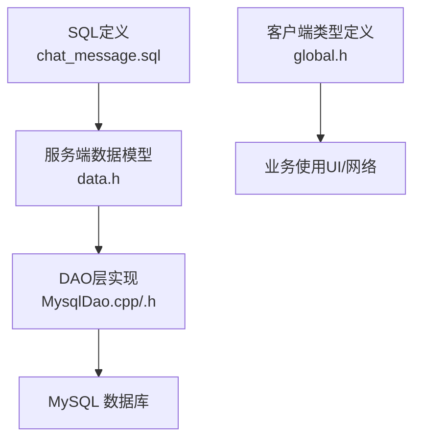
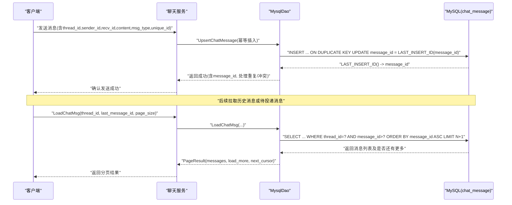
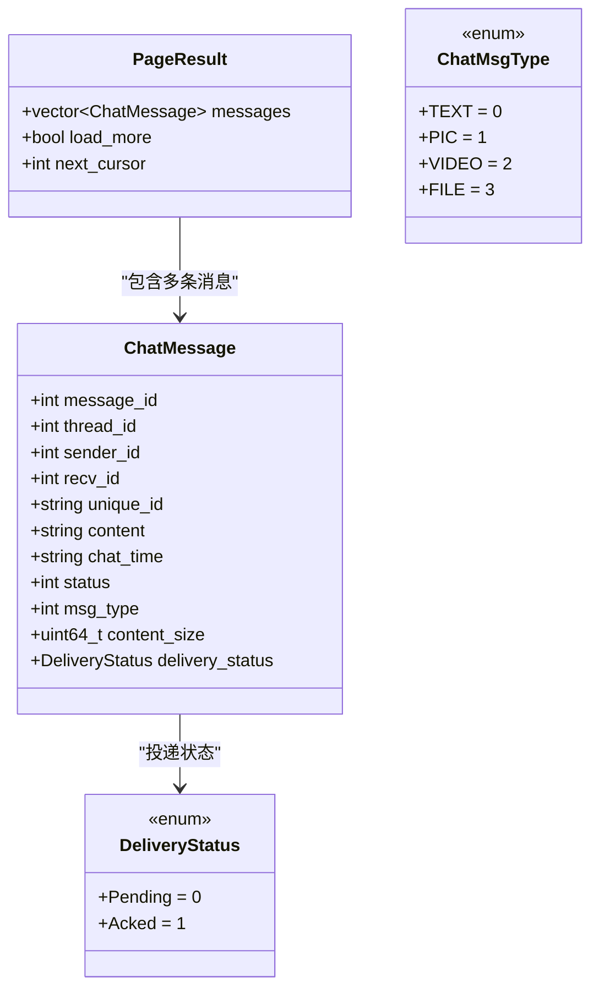
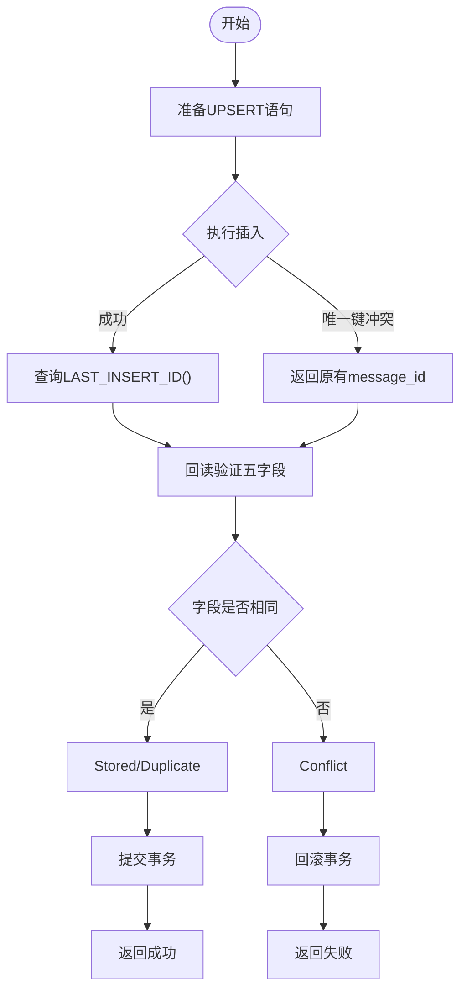
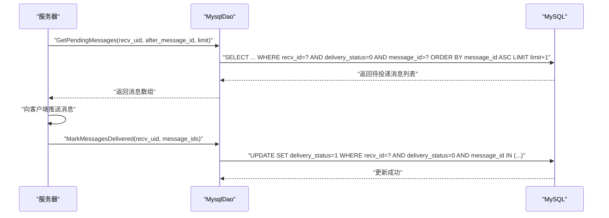
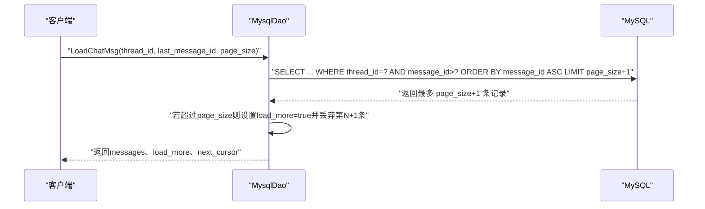
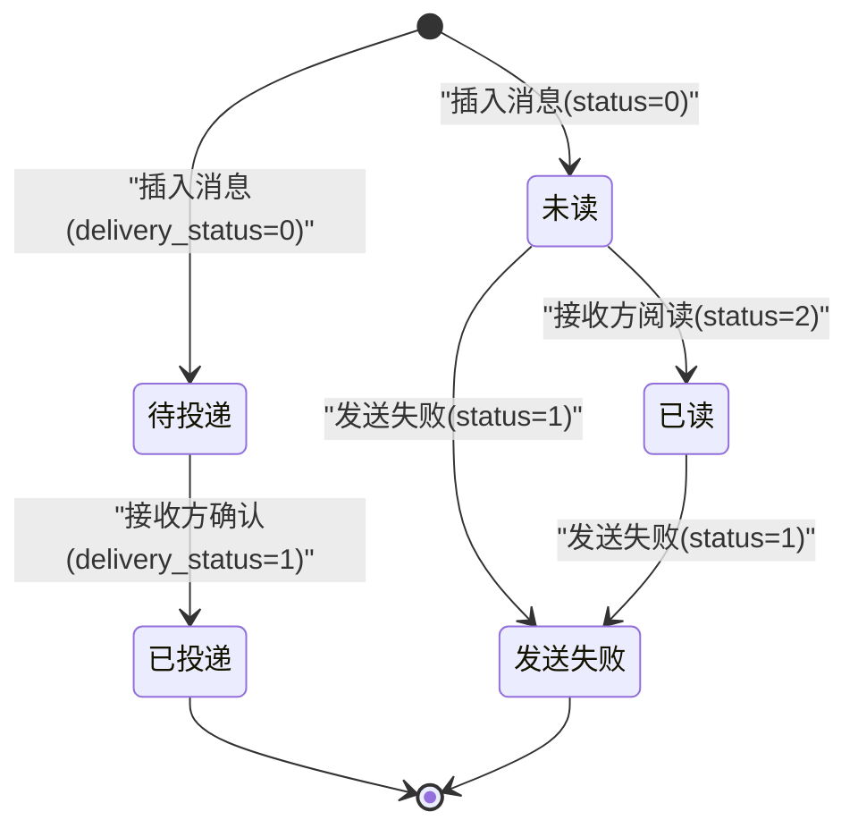
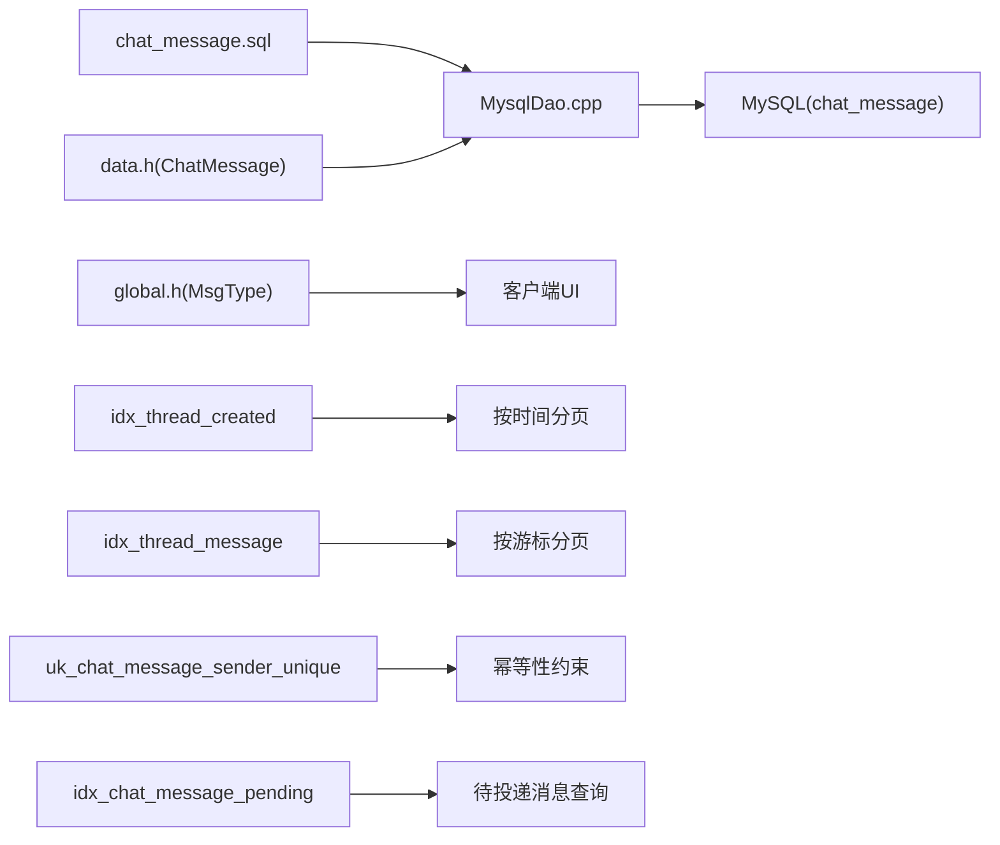

# 聊天消息表(chat_message)

<cite>
**本文引用的文件**   
- [chat_message.sql](file://sql备份/chat_message.sql)
- [llfc.sql](file://sql备份/llfc.sql)
- [day37-聊天信息存储方案.md](file://开发文档/day37-聊天信息存储方案.md)
- [data.h](file://server/ChatServer/include/data.h)
- [global.h](file://client/llfcchat/include/global.h)
- [MysqlDao.cpp](file://server/ChatServer/src/MysqlDao.cpp)
- [MysqlDao.h](file://server/ChatServer/include/MysqlDao.h)
</cite>

## 更新摘要
**变更内容**   
- 新增三个核心字段：unique_id（幂等性标识）、content_size（内容大小）、delivery_status（投递状态）
- 新增两个关键索引：uk_chat_message_sender_unique（唯一性约束）、idx_chat_message_pending（待发送消息优化）
- 实现消息幂等性写入机制，支持重复请求处理
- 优化离线消息投递流程，提升消息可靠性

## 目录
1. [简介](#简介)
2. [项目结构](#项目结构)
3. [核心组件](#核心组件)
4. [架构总览](#架构总览)
5. [详细组件分析](#详细组件分析)
6. [依赖关系分析](#依赖关系分析)
7. [性能考虑](#性能考虑)
8. [故障排查指南](#故障排查指南)
9. [结论](#结论)
10. [附录](#附录)

## 简介
本文件围绕聊天消息表 chat_message 的字段设计、索引优化与状态管理进行系统化说明。重点覆盖 message_id、thread_id、sender_id、recv_id、content、created_at、updated_at、status、msg_type 等关键字段，以及新增的 unique_id、content_size、delivery_status 字段。解释复合索引 idx_thread_created、idx_thread_message、uk_chat_message_sender_unique 与 idx_chat_message_pending 的查询优化作用，并结合服务端代码梳理消息写入、分页拉取、幂等性处理与投递状态管理的业务逻辑。

## 项目结构
- 数据库定义位于 sql备份 目录下的多个 SQL 文件中，其中 chat_message 表结构在各版本中保持一致。
- 服务端数据模型与 DAO 层在 server/ChatServer 下实现，负责消息持久化、幂等性处理与分页读取。
- 客户端对消息类型的枚举定义在 include/global.h 中，与服务端 data.h 中的 ChatMessage 结构体对应。

图表来源
- [chat_message.sql:24-42](file://sql备份/chat_message.sql#L24-L42)
- [data.h:84-96](file://server/ChatServer/include/data.h#L84-L96)
- [MysqlDao.cpp:943-1013](file://server/ChatServer/src/MysqlDao.cpp#L943-L1013)
- [global.h:145-150](file://client/llfcchat/include/global.h#L145-L150)

章节来源
- [chat_message.sql:24-42](file://sql备份/chat_message.sql#L24-L42)
- [llfc.sql:24-42](file://sql备份/llfc.sql#L24-L42)
- [data.h:84-96](file://server/ChatServer/include/data.h#L84-L96)
- [global.h:145-150](file://client/llfcchat/include/global.h#L145-L150)

## 核心组件
- 表结构与字段：message_id(自增主键)、thread_id(会话ID)、sender_id(发送者ID)、recv_id(接收者ID)、content(文本内容)、created_at(创建时间)、updated_at(更新时间)、status(消息状态)、msg_type(消息类型)、unique_id(幂等性标识)、content_size(内容大小)、delivery_status(投递状态)。
- 索引设计：idx_thread_created(thread_id, created_at) 用于按会话+时间范围分页；idx_thread_message(thread_id, message_id) 用于按会话+消息ID增量拉取；uk_chat_message_sender_unique(sender_id, unique_id) 用于幂等性约束；idx_chat_message_pending(recv_id, delivery_status, message_id) 用于待发送消息查询优化。
- 数据模型：服务端 ChatMessage 结构体映射表字段，包含 DeliveryStatus 枚举；客户端 MsgType/ChatMsgType 枚举映射 msg_type。
- DAO 操作：UpsertChatMessage 幂等插入并回填 message_id；AddChatMsg 批量插入并处理冲突；LoadChatMsg 基于 thread_id 和 last_message_id 分页读取；GetPendingMessages 查询待投递消息。

章节来源
- [chat_message.sql:24-42](file://sql备份/chat_message.sql#L24-L42)
- [data.h:84-96](file://server/ChatServer/include/data.h#L84-L96)
- [MysqlDao.cpp:943-1013](file://server/ChatServer/src/MysqlDao.cpp#L943-L1013)
- [MysqlDao.cpp:1153-1205](file://server/ChatServer/src/MysqlDao.cpp#L1153-L1205)
- [global.h:145-150](file://client/llfcchat/include/global.h#L145-L150)

## 架构总览
消息从客户端发出后，经网关/聊天服务处理，最终由 DAO 层通过幂等 UPSERT 写入 MySQL 的 chat_message 表；客户端登录或进入会话时通过 LoadChatMsg 接口按 thread_id 与 last_message_id 分页拉取历史消息，或通过 GetPendingMessages 获取待投递消息。

图表来源
- [MysqlDao.cpp:943-1013](file://server/ChatServer/src/MysqlDao.cpp#L943-L1013)
- [MysqlDao.cpp:1153-1205](file://server/ChatServer/src/MysqlDao.cpp#L1153-L1205)

## 详细组件分析

### 表结构与字段设计
- message_id: BIGINT UNSIGNED AUTO_INCREMENT，全局唯一标识一条消息，作为主键。
- thread_id: BIGINT UNSIGNED NOT NULL，会话ID，单聊/群聊共用同一 thread_id。
- sender_id: BIGINT UNSIGNED NOT NULL，发送者用户ID。
- recv_id: BIGINT UNSIGNED NOT NULL，接收者用户ID。
- content: TEXT，消息正文，支持多语言字符集 utf8mb4。
- created_at: TIMESTAMP DEFAULT CURRENT_TIMESTAMP，记录插入时刻。
- updated_at: TIMESTAMP DEFAULT CURRENT_TIMESTAMP ON UPDATE CURRENT_TIMESTAMP，随更新自动刷新，可用于撤回/编辑标记。
- status: TINYINT NOT NULL DEFAULT 0，注释为"0=未读 1=发送失败 2=已读 3=资源未上传完成"。
- msg_type: TINYINT NOT NULL DEFAULT 0，注释为"0=文本 1=图片 2=视频 3=文件"。
- unique_id: VARCHAR(64)，客户端去重标识，历史/系统消息为NULL，用于幂等性约束。
- content_size: BIGINT UNSIGNED NOT NULL DEFAULT 0，文本为0，图片为字节数。
- delivery_status: TINYINT NOT NULL DEFAULT 0，注释为"0=待投递 1=已投递(ACK)"。

**更新** 新增的三个字段增强了消息系统的可靠性和幂等性处理能力。

章节来源
- [chat_message.sql:24-36](file://sql备份/chat_message.sql#L24-L36)
- [llfc.sql:24-36](file://sql备份/llfc.sql#L24-L36)
- [day37-聊天信息存储方案.md:67-93](file://开发文档/day37-聊天信息存储方案.md#L67-L93)

### 索引设计与查询优化
- 主键索引 PRIMARY KEY (message_id)：用于精确查找单条消息。
- 复合索引 idx_thread_created(thread_id, created_at)：
  - 适用场景：按会话和时间范围分页加载历史消息，如 "WHERE thread_id=? ORDER BY created_at DESC LIMIT N"。
  - 优势：避免全表扫描，利用左前缀匹配快速定位会话内时间段内的消息。
- 复合索引 idx_thread_message(thread_id, message_id)：
  - 适用场景：增量拉取，如 "WHERE thread_id=? AND message_id > ? ORDER BY message_id ASC LIMIT N+1"。
  - 优势：以游标模式分页，避免 OFFSET 带来的性能退化，适合大表分页。
- 唯一索引 uk_chat_message_sender_unique(sender_id, unique_id)：
  - 适用场景：幂等性约束，防止同一发送者的相同消息被重复插入。
  - 优势：确保消息的唯一性，支持重试机制而不产生重复数据。
- 复合索引 idx_chat_message_pending(recv_id, delivery_status, message_id)：
  - 适用场景：待投递消息查询，如 "WHERE recv_id=? AND delivery_status=0 AND message_id > ? ORDER BY message_id ASC"。
  - 优势：优化离线消息推送和断线重连后的消息补发，提升投递效率。

**更新** 新增的两个索引分别支持幂等性约束和待发送消息查询优化。

章节来源
- [chat_message.sql:37-41](file://sql备份/chat_message.sql#L37-L41)
- [llfc.sql:37-41](file://sql备份/llfc.sql#L37-L41)
- [day37-聊天信息存储方案.md:97-101](file://开发文档/day37-聊天信息存储方案.md#L97-L101)

### 数据模型与类型映射
- 服务端 ChatMessage 结构体包含 message_id、thread_id、sender_id、recv_id、unique_id、content、chat_time、status、msg_type、content_size、delivery_status，与表字段一一对应。
- DeliveryStatus 枚举定义了 Pending(0) 和 Acked(1) 两种状态，与应用层"至少一次投递"机制配合。
- 客户端 MsgType/ChatMsgType 枚举将 0/1/2/3 分别映射到文本、图片、视频、文件，便于 UI 渲染与传输协议解析。

图表来源
- [data.h:84-96](file://server/ChatServer/include/data.h#L84-L96)
- [data.h:74-77](file://server/ChatServer/include/data.h#L74-L77)
- [data.h:103-107](file://server/ChatServer/include/data.h#L103-L107)
- [data.h:114-119](file://server/ChatServer/include/data.h#L114-L119)
- [global.h:145-150](file://client/llfcchat/include/global.h#L145-L150)

章节来源
- [data.h:84-96](file://server/ChatServer/include/data.h#L84-L96)
- [global.h:145-150](file://client/llfcchat/include/global.h#L145-L150)

### 幂等性消息写入流程
- UpsertChatMessage 方法使用 MySQL 的 INSERT ... ON DUPLICATE KEY UPDATE 语法实现幂等插入。
- 当遇到 (sender_id, unique_id) 唯一键冲突时，通过 LAST_INSERT_ID(message_id) 返回原有消息ID，不修改原行数据。
- 参数绑定包括 thread_id、sender_id、recv_id、content、created_at、updated_at、status、msg_type、unique_id、content_size、delivery_status。
- 异常捕获后回滚，保证一致性。

图表来源
- [MysqlDao.cpp:943-1013](file://server/ChatServer/src/MysqlDao.cpp#L943-L1013)

章节来源
- [MysqlDao.cpp:943-1013](file://server/ChatServer/src/MysqlDao.cpp#L943-L1013)

### 待投递消息查询与投递状态管理
- GetPendingMessages 方法查询 delivery_status=0 的待投递消息，排除尚未上传完成的图片消息。
- 查询条件为 recv_id、delivery_status=0、message_id > after_message_id，按 message_id 升序排序。
- MarkMessagesDelivered 方法批量更新消息的 delivery_status 为 1，表示已投递确认。
- 查询使用 idx_chat_message_pending 索引优化，提升大规模消息场景下的查询性能。

图表来源
- [MysqlDao.cpp:1153-1205](file://server/ChatServer/src/MysqlDao.cpp#L1153-L1205)
- [MysqlDao.cpp:1263-1297](file://server/ChatServer/src/MysqlDao.cpp#L1263-L1297)

章节来源
- [MysqlDao.cpp:1153-1205](file://server/ChatServer/src/MysqlDao.cpp#L1153-L1205)
- [MysqlDao.cpp:1263-1297](file://server/ChatServer/src/MysqlDao.cpp#L1263-L1297)

### 分页拉取历史消息
- LoadChatMsg 使用 "LIMIT N+1" 技巧判断是否还有更多数据，并通过 next_cursor 传递下一页游标。
- 查询条件为 thread_id 与 message_id > last_message_id，按 message_id 升序排序，确保稳定分页。
- 支持完整的消息字段读取，包括新增的 unique_id、content_size、delivery_status。

图表来源
- [MysqlDao.cpp:801-837](file://server/ResourceServer/src/MysqlDao.cpp#L801-L837)

章节来源
- [MysqlDao.cpp:801-837](file://server/ResourceServer/src/MysqlDao.cpp#L801-L837)

### 消息状态管理与业务逻辑
- 状态字段 status 注释为"0=未读 1=发送失败 2=已读 3=资源未上传完成"，默认 0。
- delivery_status 字段区分应用层投递状态：0=待投递，1=已投递(ACK)。
- 客户端侧存在 MsgStatus 枚举，包含 UN_READ、SEND_FAILED、READED、UN_UPLOAD 等状态，用于前端展示与交互。
- 业务上，新消息插入时 status 通常为 0（未读），delivery_status 为 0（待投递）。当接收方阅读后可更新 status 为 2（已读），delivery_status 更新为 1（已投递）。发送方可撤回消息将 status 置为 1（发送失败）。
- updated_at 随状态变更自动刷新，可作为撤回/编辑的时间戳依据。

图表来源
- [chat_message.sql:32](file://sql备份/chat_message.sql#L32)
- [data.h:74-77](file://server/ChatServer/include/data.h#L74-L77)
- [day37-聊天信息存储方案.md:76](file://开发文档/day37-聊天信息存储方案.md#L76)

章节来源
- [chat_message.sql:32](file://sql备份/chat_message.sql#L32)
- [data.h:74-77](file://server/ChatServer/include/data.h#L74-L77)
- [day37-聊天信息存储方案.md:76](file://开发文档/day37-聊天信息存储方案.md#L76)

### 消息类型(msg_type)与内容承载
- msg_type 取值 0/1/2/3 分别表示文本、图片、视频、文件。
- 对于非文本类型，content 通常存储资源URL或路径，配合资源服务器下载。
- content_size 字段记录内容字节大小，文本为0，图片为实际字节数。
- 客户端根据 msg_type 渲染不同气泡样式与媒体控件。

章节来源
- [chat_message.sql:33](file://sql备份/chat_message.sql#L33)
- [global.h:145-150](file://client/llfcchat/include/global.h#L145-L150)
- [data.h:114-119](file://server/ChatServer/include/data.h#L114-L119)

## 依赖关系分析
- 表结构定义与 SQL 脚本直接决定 DAO 层的 INSERT/SELECT 语句。
- 服务端 ChatMessage 结构体与客户端枚举共同约束 msg_type 的语义。
- LoadChatMsg 的分页策略依赖 idx_thread_message 索引；按时间分页依赖 idx_thread_created 索引。
- 幂等性写入依赖 uk_chat_message_sender_unique 唯一索引。
- 待投递消息查询依赖 idx_chat_message_pending 复合索引。
- 状态更新与 updated_at 自动刷新机制依赖 MySQL 的 ON UPDATE CURRENT_TIMESTAMP。

图表来源
- [chat_message.sql:37-41](file://sql备份/chat_message.sql#L37-L41)
- [MysqlDao.cpp:943-1013](file://server/ChatServer/src/MysqlDao.cpp#L943-L1013)
- [MysqlDao.cpp:1153-1205](file://server/ChatServer/src/MysqlDao.cpp#L1153-L1205)
- [data.h:84-96](file://server/ChatServer/include/data.h#L84-L96)
- [global.h:145-150](file://client/llfcchat/include/global.h#L145-L150)

章节来源
- [chat_message.sql:37-41](file://sql备份/chat_message.sql#L37-L41)
- [MysqlDao.cpp:943-1013](file://server/ChatServer/src/MysqlDao.cpp#L943-L1013)
- [MysqlDao.cpp:1153-1205](file://server/ChatServer/src/MysqlDao.cpp#L1153-L1205)
- [data.h:84-96](file://server/ChatServer/include/data.h#L84-L96)
- [global.h:145-150](file://client/llfcchat/include/global.h#L145-L150)

## 性能考虑
- 使用游标分页（message_id > last_message_id）避免 OFFSET 导致的性能退化。
- 复合索引 idx_thread_message 与 idx_thread_created 分别支撑按会话+ID与按会话+时间的快速检索。
- 唯一索引 uk_chat_message_sender_unique 提供高效的幂等性检查，避免重复插入。
- 复合索引 idx_chat_message_pending 优化待投递消息查询，提升离线消息推送效率。
- 批量插入减少往返开销，结合事务提升写入吞吐。
- 对于大文本或媒体内容，建议将 content 仅存 URL/路径，实际资源走对象存储或资源服务器，降低数据库压力。
- content_size 字段避免重复计算文件大小，提升性能。

## 故障排查指南
- 插入失败：检查 MysqlDao::UpsertChatMessage 的事务回滚分支与异常日志，确认连接池可用性与 SQL 参数绑定正确性。
- 幂等性冲突：核对 uk_chat_message_sender_unique 唯一键冲突处理逻辑，确保重复请求正确处理。
- 分页异常：核对 LoadChatMsg 的 LIMIT N+1 逻辑与 next_cursor 计算，确保索引命中且排序稳定。
- 待投递消息积压：检查 idx_chat_message_pending 索引使用情况，确认 GetPendingMessages 查询性能。
- 投递状态不一致：确认 delivery_status 更新时机与 MarkMessagesDelivered 调用，必要时增加审计日志。
- 类型不匹配：校验客户端 MsgType 与服务端 ChatMsgType 的一致性，避免渲染错误。

章节来源
- [MysqlDao.cpp:943-1013](file://server/ChatServer/src/MysqlDao.cpp#L943-L1013)
- [MysqlDao.cpp:1153-1205](file://server/ChatServer/src/MysqlDao.cpp#L1153-L1205)
- [MysqlDao.cpp:1263-1297](file://server/ChatServer/src/MysqlDao.cpp#L1263-L1297)

## 结论
chat_message 表通过合理的主键与复合索引设计，支撑了高并发聊天场景下的消息写入与高效分页拉取。新增的 unique_id、content_size、delivery_status 字段分别实现了幂等性约束、内容大小记录和投递状态管理，配合 uk_chat_message_sender_unique 和 idx_chat_message_pending 两个新索引，显著提升了消息系统的可靠性和性能。status 与 msg_type 字段清晰表达消息状态与类型，配合 updated_at 自动更新机制，满足撤回、编辑等业务需求。服务端 DAO 层采用幂等 UPSERT 与游标分页策略，保证了数据一致性与查询性能。建议在大规模部署中进一步分离媒体内容与文本内容，以降低数据库负载并提升扩展性。

## 附录
- 相关 SQL 脚本与开发文档提供了完整的表结构说明与同步流程示例，可参考 day37-聊天信息存储方案.md 获取更多上下文。
- 客户端 global.h 与服务端 data.h 的类型定义应保持同步，避免前后端语义不一致。
- 幂等性机制依赖于客户端生成的唯一标识符，确保在网络重试场景下不会产生重复消息。
- 投递状态管理机制支持离线消息的可靠推送，提升用户体验。