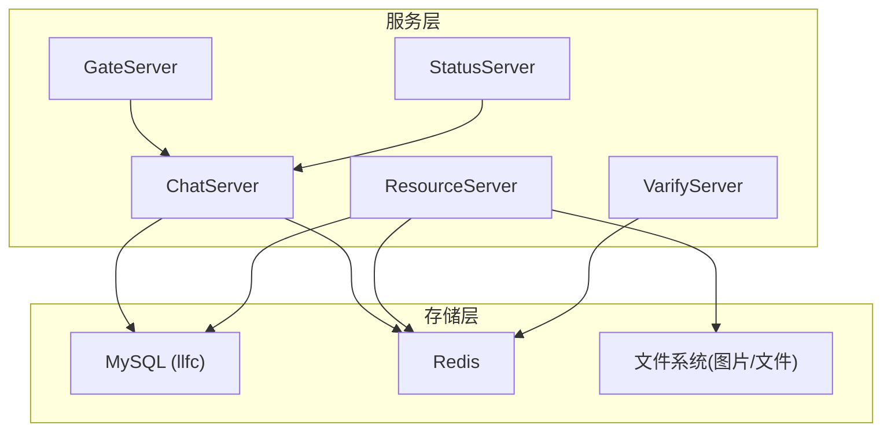
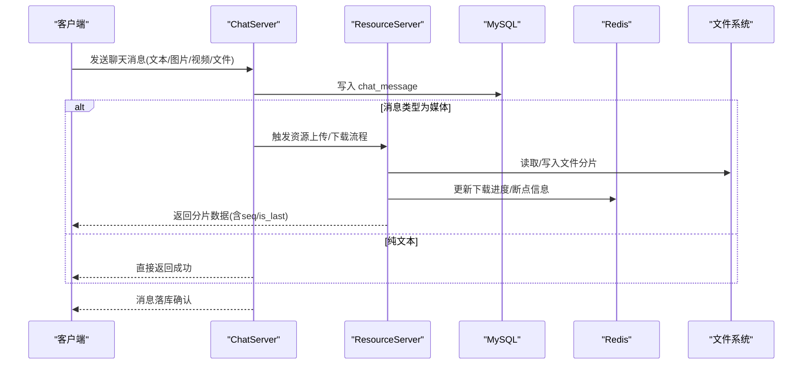
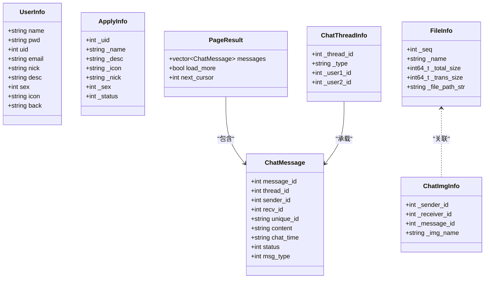
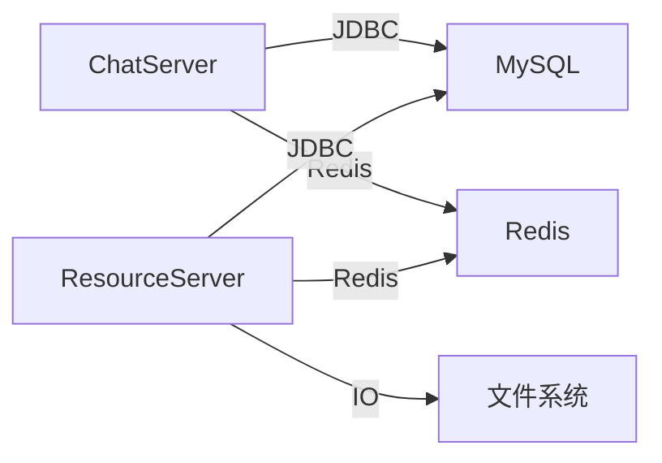
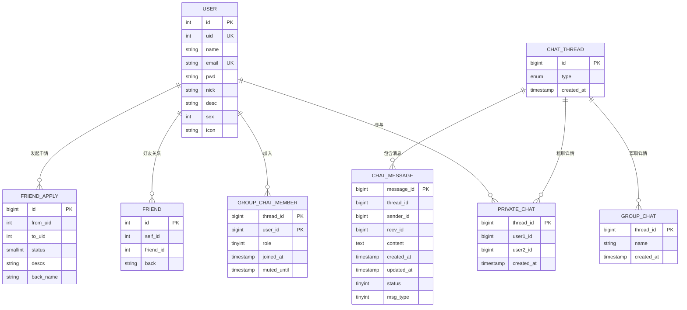

# 数据库设计

<cite>
**本文引用的文件**   
- [llfc.sql](file://sql备份/llfc.sql)
- [chat_message.sql](file://sql备份/chat_message.sql)
- [llfc2.sql](file://sql备份/llfc2.sql)
- [llfc3.sql](file://sql备份/llfc3.sql)
- [data.h（ChatServer）](file://server/ChatServer/include/data.h)
- [MysqlDao.h](file://server/ChatServer/include/MysqlDao.h)
- [FileInfo.h](file://server/ResourceServer/include/FileInfo.h)
- [const.h（ResourceServer）](file://server/ResourceServer/include/const.h)
- [day37-聊天信息存储方案.md](file://开发文档/day37-聊天信息存储方案.md)
- [day41-通知客户端异步下载聊天图片.md](file://开发文档/day41-通知客户端异步下载聊天图片.md)
</cite>

## 目录
1. [引言](#引言)
2. [项目结构](#项目结构)
3. [核心组件](#核心组件)
4. [架构总览](#架构总览)
5. [详细组件分析](#详细组件分析)
6. [依赖关系分析](#依赖关系分析)
7. [性能考虑](#性能考虑)
8. [故障排查指南](#故障排查指南)
9. [结论](#结论)
10. [附录](#附录)

## 引言
本文件为 LLFCChat 的数据库设计文档，聚焦于用户、聊天消息、好友关系与群聊、以及文件元数据等核心实体的数据模型。内容涵盖实体关系、字段定义、主键/外键、索引与约束、数据验证与业务规则、数据访问模式、缓存策略、性能优化、生命周期与归档策略、迁移与版本管理、安全与隐私、访问控制等。同时提供数据库模式图与示例数据，帮助读者快速理解并落地实施。

## 项目结构
本项目采用多服务架构：ChatServer 负责会话与消息持久化，ResourceServer 负责文件上传/下载与资源元数据，GateServer/StatusServer/VarifyServer 分别承担网关、状态与验证码等功能。数据库层面使用 MySQL 作为持久化存储，Redis 用于分布式锁、会话与下载进度等缓存。

图表来源
- [MysqlDao.h](file://server/ChatServer/include/MysqlDao.h)
- [const.h（ResourceServer）](file://server/ResourceServer/include/const.h)

章节来源
- [README.md](file://README.md)

## 核心组件
- 用户实体 user：用户基本信息与认证相关字段
- 会话线程 chat_thread：私聊/群聊会话抽象
- 私聊 private_chat：私聊成员映射
- 群聊 group_chat / group_chat_member：群聊信息与成员角色
- 消息 chat_message：聊天消息记录
- 好友 friend / friend_apply：好友关系与申请流程
- 文件元数据 FileInfo：文件传输与断点续传状态（内存/缓存）

章节来源
- [llfc.sql](file://sql备份/llfc.sql)
- [data.h（ChatServer）](file://server/ChatServer/include/data.h)
- [FileInfo.h](file://server/ResourceServer/include/FileInfo.h)

## 架构总览
下图展示数据库与服务的交互关系，以及消息与文件的读写路径。

图表来源
- [day37-聊天信息存储方案.md](file://开发文档/day37-聊天信息存储方案.md)
- [day41-通知客户端异步下载聊天图片.md](file://开发文档/day41-通知客户端异步下载聊天图片.md)

## 详细组件分析

### 用户表 user
- 主键：id（自增）
- 唯一键：uid（业务ID）、email（邮箱唯一）
- 索引：name（用户名检索）
- 字段说明：
  - uid：全局用户ID，唯一且不可重复
  - name/email/pwd：登录与认证基础信息
  - nick/desc/sex/icon：展示与社交属性
- 业务规则：
  - 注册时通过存储过程 reg_user/reg_user_procedure 保证用户名与邮箱唯一性，并生成新 uid
  - 密码建议服务端加密存储（当前字段存在明文样例，生产需改造）
- 示例数据：见 llfc.sql 中 user 表的 INSERT 语句

章节来源
- [llfc.sql](file://sql备份/llfc.sql)

### 会话线程 chat_thread
- 主键：id（自增）
- 类型：type（private/group）
- 时间戳：created_at
- 用途：统一抽象私聊与群聊会话，消息按 thread_id 归属

章节来源
- [llfc.sql](file://sql备份/llfc.sql)

### 私聊 private_chat
- 主键：thread_id（对应 chat_thread.id）
- 唯一键：user1_id + user2_id（确保一对私聊仅一条记录）
- 索引：user1_id/thread_id、user2_id/thread_id（加速按用户查询会话）
- 字段说明：user1_id/user2_id 表示双方用户；group 场景下设为 0

章节来源
- [llfc.sql](file://sql备份/llfc.sql)

### 群聊 group_chat / group_chat_member
- group_chat：thread_id（主键），name（可选），created_at
- group_chat_member：复合主键(thread_id, user_id)，role（普通/管理员/创建者），joined_at，muted_until
- 索引：user_id 上的 idx_user_threads（按用户查所在群）
- 业务规则：
  - role 用于权限控制（如禁言、踢人、改名等）
  - muted_until 支持定时解禁

章节来源
- [llfc.sql](file://sql备份/llfc.sql)

### 消息表 chat_message
- 主键：message_id（自增）
- 索引：
  - idx_thread_created(thread_id, created_at)：按时间与线程分页
  - idx_thread_message(thread_id, message_id)：按消息ID分页
- 字段说明：
  - thread_id：所属会话
  - sender_id/recv_id：发送者与接收者（群聊 recv_id 可为 0）
  - content：消息体（文本或媒体引用）
  - created_at/updated_at：创建与更新时间
  - status：未读/已读/撤回
  - msg_type：文本/图片/视频/文件（最新脚本包含该字段）
- 数据验证与业务规则：
  - 插入时需校验 thread_id 有效性（私聊/群聊）
  - 撤回逻辑通过 status=2 标记，content 可替换为“撤回了一条消息”
  - 媒体消息 content 通常存储文件名或URL，实际文件由 ResourceServer 管理

章节来源
- [chat_message.sql](file://sql备份/chat_message.sql)
- [llfc3.sql](file://sql备份/llfc3.sql)
- [llfc.sql](file://sql备份/llfc.sql)

### 好友关系 friend / friend_apply
- friend：自增 id，self_id/friend_id（唯一组合 self_friend），back（备注）
- friend_apply：自增 id，from_uid/to_uid（唯一组合 from_to_uid），status（待处理/已通过/拒绝），descs/back_name
- 业务规则：
  - 好友关系双向维护（A→B 与 B→A 两条记录）
  - 申请状态机：0=待处理，1=已通过，其他值可按需扩展
  - 认证通过后自动建立双向好友关系

章节来源
- [llfc.sql](file://sql备份/llfc.sql)

### 文件元数据与下载状态（内存/缓存）
- FileInfo：seq/name/total_size/trans_size/file_path_str（用于断点续传）
- ChatImgInfo：sender_id/receiver_id/message_id/img_name（关联消息与图片）
- 存储位置：
  - 服务器端：文件系统（按 sender/name 组织）
  - 客户端：本地磁盘（按 seq 顺序拼接）
  - 中间态：Redis（下载进度、token 校验、会话信息等）

章节来源
- [FileInfo.h](file://server/ResourceServer/include/FileInfo.h)
- [day41-通知客户端异步下载聊天图片.md](file://开发文档/day41-通知客户端异步下载聊天图片.md)

### 类与数据结构关系图

图表来源
- [data.h（ChatServer）](file://server/ChatServer/include/data.h)
- [FileInfo.h](file://server/ResourceServer/include/FileInfo.h)

## 依赖关系分析
- ChatServer 通过 MysqlDao 访问 MySQL，实现用户、好友、会话与消息的CRUD
- ResourceServer 负责文件IO与Redis状态同步，配合 ChatServer 完成媒体消息的上传/下载
- Redis 用于分布式锁、会话绑定、下载进度、登录计数等
- 文件存储在文件系统，按 sender/name 组织，便于分片与断点续传

图表来源
- [MysqlDao.h](file://server/ChatServer/include/MysqlDao.h)
- [const.h（ResourceServer）](file://server/ResourceServer/include/const.h)

章节来源
- [MysqlDao.h](file://server/ChatServer/include/MysqlDao.h)
- [const.h（ResourceServer）](file://server/ResourceServer/include/const.h)

## 性能考虑
- 索引设计
  - chat_message：idx_thread_created、idx_thread_message 支持按时间与ID分页
  - private_chat：user1/user2 到 thread_id 的索引提升会话查询效率
  - group_chat_member：user_id 索引提升按用户查群能力
- 连接池与心跳
  - MySqlPool 维护连接池，定期检测连接健康并自动重连
- 批量写入
  - AddChatMsg 使用事务批量插入，减少往返开销
- 分页策略
  - LoadChatMsg 使用 lastId/pageSize 游标分页，避免深翻页
- 缓存与分布式锁
  - Redis 用于下载进度、会话绑定、分布式锁，降低热点竞争

章节来源
- [MysqlDao.h](file://server/ChatServer/include/MysqlDao.h)
- [day37-聊天信息存储方案.md](file://开发文档/day37-聊天信息存储方案.md)

## 故障排查指南
- 注册失败
  - 检查用户名/邮箱唯一性约束，查看存储过程返回码
- 消息丢失或乱序
  - 核对 idx_thread_created/idx_thread_message 是否命中；检查事务提交与 LAST_INSERT_ID 获取
- 下载中断
  - 检查 Redis 中的下载进度 key 是否存在；确认 seq 与 is_last 一致性
- 分布式锁冲突
  - 观察 LOCK_PREFIX 下的锁持有情况；确保加锁顺序一致，避免死锁

章节来源
- [day37-聊天信息存储方案.md](file://开发文档/day37-聊天信息存储方案.md)
- [day41-通知客户端异步下载聊天图片.md](file://开发文档/day41-通知客户端异步下载聊天图片.md)

## 结论
LLFCChat 的数据模型围绕用户、会话、消息、好友与文件展开，采用 MySQL 持久化与 Redis 缓存协同，结合合理的索引与分页策略，满足高并发聊天场景的性能需求。文件传输通过 ResourceServer 与文件系统协作，利用 Redis 实现断点续传与进度同步。后续可在安全性（密码加密、敏感字段脱敏）、归档策略（历史消息冷热分层）等方面持续优化。

## 附录

### 数据库模式图（ER）

图表来源
- [llfc.sql](file://sql备份/llfc.sql)

### 数据验证规则与业务规则摘要
- 用户注册：用户名与邮箱唯一；uid 自增生成
- 好友关系：双向记录；申请状态机控制
- 消息状态：未读/已读/撤回；媒体消息 content 为引用
- 群聊权限：role 控制操作；muted_until 支持禁言到期

章节来源
- [llfc.sql](file://sql备份/llfc.sql)

### 数据访问模式与缓存策略
- 消息加载：LoadChatMsg(lastId, pageSize) 游标分页
- 批量写入：AddChatMsg(vector) 事务批量插入
- 下载进度：Redis 存储 FileInfo（seq/trans_size/total_size）
- 会话绑定：Redis 存储 uid→session_id、ip→server

章节来源
- [MysqlDao.h](file://server/ChatServer/include/MysqlDao.h)
- [day41-通知客户端异步下载聊天图片.md](file://开发文档/day41-通知客户端异步下载聊天图片.md)

### 数据生命周期、保留策略与归档
- 消息归档：可按时间维度将历史消息迁移至冷存储（如归档库/对象存储）
- 会话清理：长期无活动的会话可标记并清理冗余索引
- 文件清理：过期下载任务在 Redis 中删除；本地文件按策略回收

章节来源
- [day41-通知客户端异步下载聊天图片.md](file://开发文档/day41-通知客户端异步下载聊天图片.md)

### 数据迁移路径与版本管理
- 使用 SQL 备份文件进行版本演进（llfc2.sql → llfc3.sql → llfc.sql）
- 新增字段/索引需在变更脚本中明确标注，保持向后兼容
- 建议在测试环境先行验证再灰度发布

章节来源
- [chat_message.sql](file://sql备份/chat_message.sql)
- [llfc2.sql](file://sql备份/llfc2.sql)
- [llfc3.sql](file://sql备份/llfc3.sql)
- [llfc.sql](file://sql备份/llfc.sql)

### 数据安全、隐私与访问控制
- 密码存储：建议服务端哈希（如 bcrypt/argon2），禁止明文
- 敏感字段：昵称/描述等按需脱敏展示
- 访问控制：基于 role 的群聊权限控制；登录态通过 Redis 校验
- 传输安全：建议启用 TLS；文件下载 token 校验防越权

章节来源
- [const.h（ResourceServer）](file://server/ResourceServer/include/const.h)

### 示例数据
- 用户：参考 llfc.sql 中 user 表的 INSERT 语句
- 会话与消息：参考 chat_message.sql 与 llfc.sql 中 chat_message/chat_thread/private_chat/group_chat 的 INSERT 语句
- 好友与申请：参考 llfc.sql 中 friend/friend_apply 的 INSERT 语句

章节来源
- [llfc.sql](file://sql备份/llfc.sql)
- [chat_message.sql](file://sql备份/chat_message.sql)