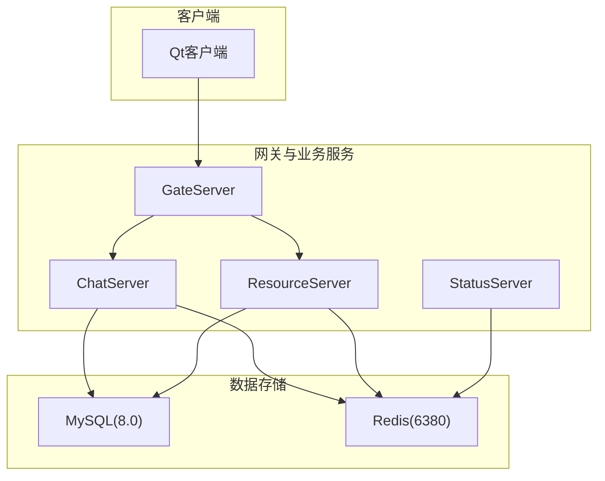
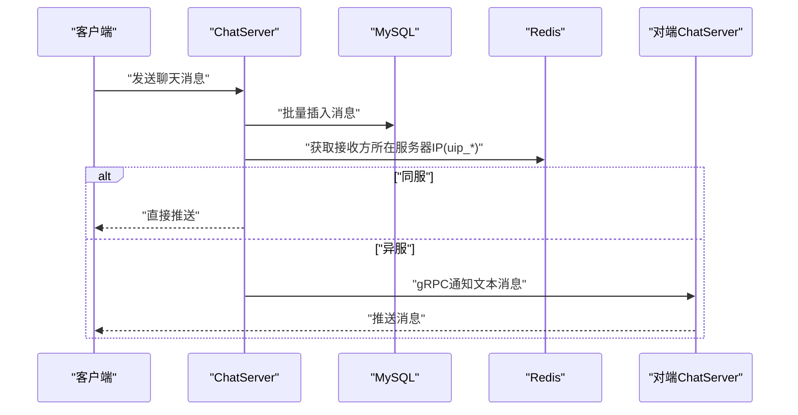
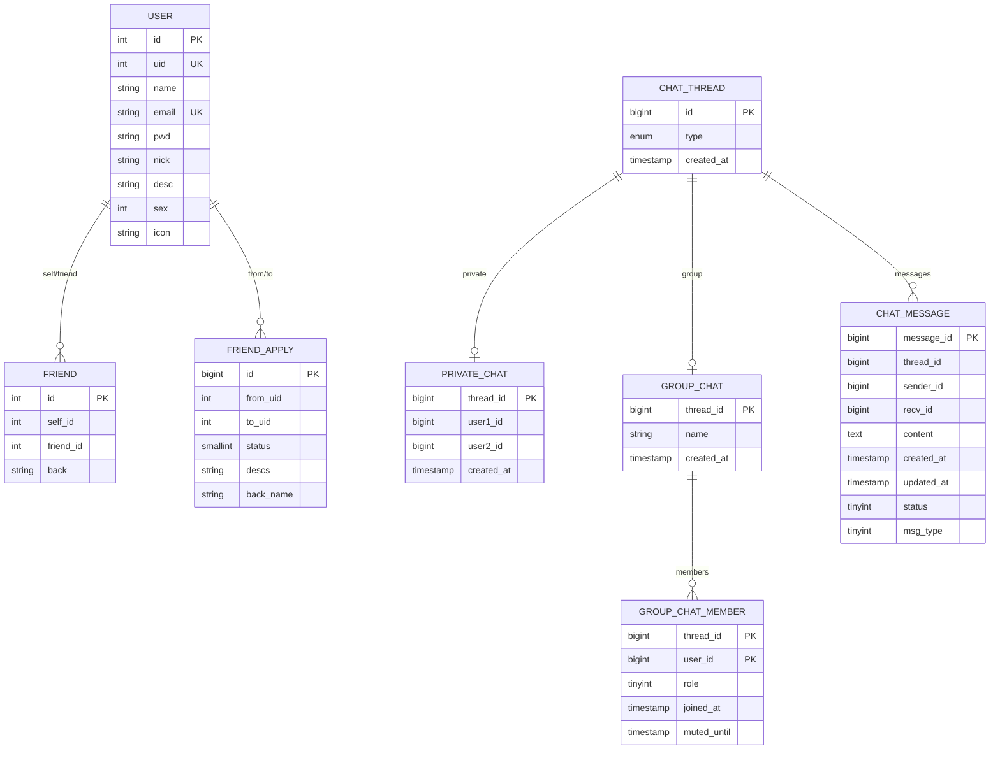
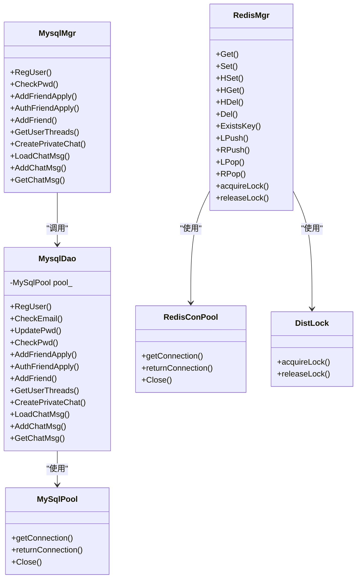
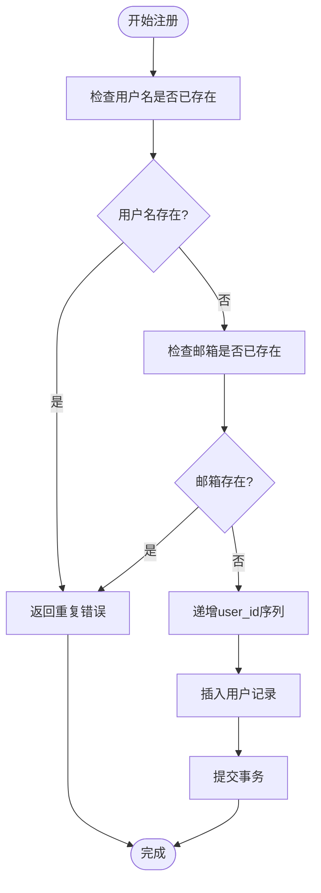
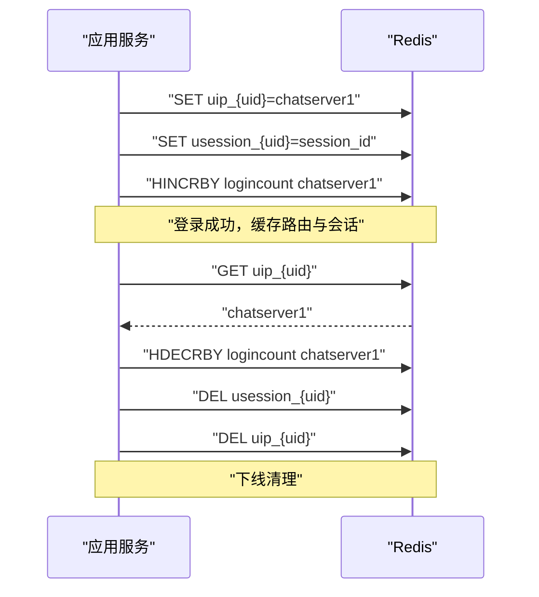
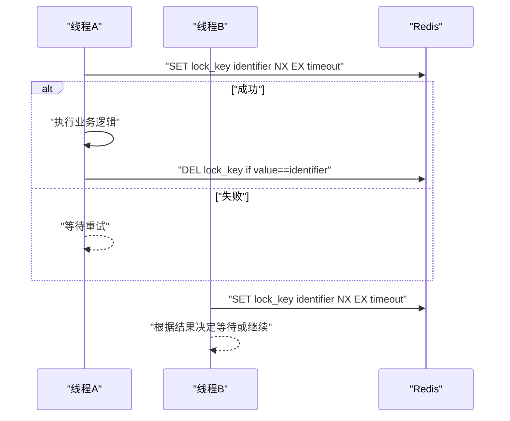

# 数据库设计

<cite>
**本文引用的文件**   
- [llfc.sql](file://sql备份/llfc.sql)
- [chat_message.sql](file://sql备份/chat_message.sql)
- [MysqlMgr.h](file://server/ChatServer/include/MysqlMgr.h)
- [MysqlDao.h](file://server/ChatServer/include/MysqlDao.h)
- [RedisMgr.h](file://server/ChatServer/include/RedisMgr.h)
- [RedisMgr.cpp](file://server/ChatServer/src/RedisMgr.cpp)
- [DistLock.h](file://server/ChatServer/include/DistLock.h)
- [data.h](file://server/ChatServer/include/data.h)
- [config.ini（ChatServer）](file://server/ChatServer/config/chatserver1.ini)
- [config.ini（GateServer）](file://server/GateServer/config/config.ini)
- [day37-聊天信息存储方案.md](file://开发文档/day37-聊天信息存储方案.md)
- [day09-redis服务搭建.md](file://开发文档/day09-redis服务搭建.md)
- [day35心跳逻辑.md](file://开发文档/day35心跳逻辑.md)
</cite>

## 目录
1. [引言](#引言)
2. [项目结构](#项目结构)
3. [核心组件](#核心组件)
4. [架构总览](#架构总览)
5. [详细组件分析](#详细组件分析)
6. [依赖关系分析](#依赖关系分析)
7. [性能与索引优化](#性能与索引优化)
8. [事务与一致性](#事务与一致性)
9. [Redis缓存设计](#redis缓存设计)
10. [分布式锁实现](#分布式锁实现)
11. [数据迁移与备份恢复](#数据迁移与备份恢复)
12. [安全考虑](#安全考虑)
13. [故障排查指南](#故障排查指南)
14. [结论](#结论)

## 引言
本设计文档面向LLFCChat项目的数据库层，重点阐述MySQL与Redis混合存储架构的设计理念、核心表结构与字段定义、读写分离与缓存策略、索引与查询优化、事务处理机制、分布式锁实现、数据迁移与备份恢复、以及连接池管理与安全加固。目标是帮助开发者快速理解并扩展系统的数据持久化与缓存能力。

## 项目结构
- 数据库脚本位于 sql备份 目录，包含完整建库建表与初始数据。
- 服务器端通过 MysqlMgr/MysqlDao 管理MySQL访问，通过 RedisMgr 管理Redis访问。
- 配置项集中在各服务的 config.ini 中，统一声明MySQL与Redis的连接参数。
- 业务数据结构定义在 data.h 中，用于消息、会话、用户等对象映射。

**图表来源** 
- [config.ini（ChatServer）:14-23](file://server/ChatServer/config/chatserver1.ini#L14-L23)
- [config.ini（GateServer）:9-18](file://server/GateServer/config/config.ini#L9-L18)

**章节来源**
- [llfc.sql:1-756](file://sql备份/llfc.sql#L1-L756)
- [config.ini（ChatServer）:14-23](file://server/ChatServer/config/chatserver1.ini#L14-L23)
- [config.ini（GateServer）:9-18](file://server/GateServer/config/config.ini#L9-L18)

## 核心组件
- MySQL层：MysqlMgr 提供业务级接口，MysqlDao 封装DAO与连接池，负责SQL执行与结果映射。
- Redis层：RedisMgr 封装hiredis操作与连接池，提供KV、List、Hash、删除、存在性检查及分布式锁能力。
- 数据模型：data.h 定义了 UserInfo、ApplyInfo、ChatThreadInfo、ChatMessage、PageResult 等结构体。
- 配置：各服务通过配置文件指定MySQL与Redis的Host、Port、Passwd、Schema等。

**章节来源**
- [MysqlMgr.h:1-41](file://server/ChatServer/include/MysqlMgr.h#L1-L41)
- [MysqlDao.h:1-270](file://server/ChatServer/include/MysqlDao.h#L1-L270)
- [RedisMgr.h:1-305](file://server/ChatServer/include/RedisMgr.h#L1-L305)
- [data.h:1-65](file://server/ChatServer/include/data.h#L1-L65)

## 架构总览
系统采用“MySQL为持久化主存 + Redis为热点缓存”的混合架构：
- 写路径：消息写入MySQL；用户基础信息、在线状态、登录计数等写入Redis。
- 读路径：优先从Redis读取热点数据（如用户信息、会话路由），未命中则回源MySQL并回填缓存。
- 跨服通信：通过gRPC通知目标ChatServer推送消息，路由键存储在Redis中。

**图表来源** 
- [day37-聊天信息存储方案.md:3283-3383](file://开发文档/day37-聊天信息存储方案.md#L3283-L3383)
- [RedisMgr.cpp:395-462](file://server/ChatServer/src/RedisMgr.cpp#L395-L462)

## 详细组件分析

### 核心表结构设计
- 用户表 user
  - 字段：id, uid, name, email, pwd, nick, desc, sex, icon
  - 索引：uid唯一、email唯一、name普通索引
  - 用途：用户基础信息与认证
- 好友关系表 friend
  - 字段：id, self_id, friend_id, back
  - 索引：self_id+friend_id唯一
  - 用途：双向好友关系与备注
- 好友申请表 friend_apply
  - 字段：id, from_uid, to_uid, status, descs, back_name
  - 索引：from_uid+to_uid唯一
  - 用途：好友申请流程状态与备注
- 聊天会话表 chat_thread
  - 字段：id, type(private/group), created_at
  - 用途：会话类型与创建时间
- 私聊会话映射 private_chat
  - 字段：thread_id, user1_id, user2_id, created_at
  - 索引：user1_id+user2_id唯一，user1/user2到thread_id组合索引
  - 用途：私聊双方与会话ID映射
- 群聊会话 group_chat
  - 字段：thread_id, name, created_at
  - 用途：群聊名称与创建时间
- 群成员 group_chat_member
  - 字段：thread_id, user_id, role, joined_at, muted_until
  - 索引：thread_id+user_id主键，user_id普通索引
  - 用途：群成员角色与禁言时间
- 聊天消息表 chat_message
  - 字段：message_id, thread_id, sender_id, recv_id, content, created_at, updated_at, status, msg_type
  - 索引：thread_id+created_at、thread_id+message_id
  - 用途：消息内容、时间与状态、类型

**图表来源** 
- [llfc.sql:24-175](file://sql备份/llfc.sql#L24-L175)
- [llfc.sql:177-434](file://sql备份/llfc.sql#L177-L434)
- [llfc.sql:464-481](file://sql备份/llfc.sql#L464-L481)

**章节来源**
- [llfc.sql:24-175](file://sql备份/llfc.sql#L24-L175)
- [llfc.sql:177-434](file://sql备份/llfc.sql#L177-L434)
- [llfc.sql:464-481](file://sql备份/llfc.sql#L464-L481)

### 数据模型与API映射
- data.h 中的结构体与表字段一一对应，便于ORM或手工映射。
- MysqlMgr 暴露注册、密码校验、好友申请/认证、好友列表、会话加载、消息分页等接口。
- RedisMgr 暴露Get/Set/HSet/HDel/Del/ExistsKey/LPush/RPush/LPop/RPop等基础操作，以及分布式锁接口。

**章节来源**
- [data.h:1-65](file://server/ChatServer/include/data.h#L1-L65)
- [MysqlMgr.h:12-35](file://server/ChatServer/include/MysqlMgr.h#L12-L35)
- [RedisMgr.h:273-305](file://server/ChatServer/include/RedisMgr.h#L273-L305)

## 依赖关系分析
- MysqlMgr 依赖 MysqlDao，后者持有 MySqlPool 管理连接生命周期与健康检测。
- RedisMgr 依赖 RedisConPool 管理hiredis连接，并通过 DistLock 实现分布式锁。
- 配置由 ConfigMgr 读取，初始化时注入到各管理器。

**图表来源** 
- [MysqlMgr.h:1-41](file://server/ChatServer/include/MysqlMgr.h#L1-L41)
- [MysqlDao.h:236-267](file://server/ChatServer/include/MysqlDao.h#L236-L267)
- [RedisMgr.h:267-305](file://server/ChatServer/include/RedisMgr.h#L267-L305)
- [DistLock.h:1-18](file://server/ChatServer/include/DistLock.h#L1-L18)

**章节来源**
- [MysqlMgr.h:1-41](file://server/ChatServer/include/MysqlMgr.h#L1-L41)
- [MysqlDao.h:236-267](file://server/ChatServer/include/MysqlDao.h#L236-L267)
- [RedisMgr.h:267-305](file://server/ChatServer/include/RedisMgr.h#L267-L305)
- [DistLock.h:1-18](file://server/ChatServer/include/DistLock.h#L1-L18)

## 性能与索引优化
- chat_message 表
  - 复合索引 idx_thread_created(thread_id, created_at) 支持按会话和时间范围分页拉取。
  - 复合索引 idx_thread_message(thread_id, message_id) 支持按会话和消息ID顺序遍历。
- private_chat 表
  - uniq_private_thread(user1_id, user2_id) 保证私聊会话唯一性。
  - idx_private_user1_thread / idx_private_user2_thread 加速按用户查找会话。
- friend 与 friend_apply
  - 自友关系与申请记录均使用联合唯一索引，避免重复与提升查询效率。
- user 表
  - uid/email 唯一索引保障身份唯一性与快速检索；name 普通索引支持模糊搜索场景。

建议：
- 对高频查询增加覆盖索引（如仅返回必要字段）。
- 对大表进行分区（如按时间或用户分片）以控制单表规模。
- 定期统计分析与慢查询日志优化。

**章节来源**
- [chat_message.sql:24-36](file://sql备份/chat_message.sql#L24-L36)
- [llfc.sql:406-418](file://sql备份/llfc.sql#L406-L418)
- [llfc.sql:177-187](file://sql备份/llfc.sql#L177-L187)
- [llfc.sql:292-304](file://sql备份/llfc.sql#L292-L304)
- [llfc.sql:464-481](file://sql备份/llfc.sql#L464-L481)

## 事务与一致性
- 注册流程使用MySQL存储过程 reg_user/reg_user_procedure，内部开启事务，校验用户名/邮箱唯一性后更新user_id序列并插入用户记录，异常回滚。
- 好友申请与认证涉及多表写入，建议在应用层使用事务包裹关键步骤，确保一致性与幂等。
- 消息写入建议使用批量插入（MysqlMgr::AddChatMsg(vector)），减少往返开销。

**图表来源** 
- [llfc.sql:660-708](file://sql备份/llfc.sql#L660-L708)

**章节来源**
- [llfc.sql:660-708](file://sql备份/llfc.sql#L660-L708)
- [MysqlMgr.h:12-20](file://server/ChatServer/include/MysqlMgr.h#L12-L20)

## Redis缓存设计
- 用户基础信息缓存
  - Key命名：USER_BASE_INFO + uid
  - 内容：JSON序列化用户信息（uid, pwd, name, email, nick, desc, sex, icon）
  - 作用：登录校验与展示信息快速读取
- 在线状态与会话路由
  - Key命名：uip_{uid} 存储用户当前所在服务器名称
  - Key命名：usession_{uid} 存储用户SessionId，用于踢人/异地登录冲突处理
- 登录计数
  - Key命名：logincount，Hash结构，按服务器名计数，配合分布式锁原子增减
- 消息队列与临时数据
  - List：LPUSH/RPUSH/LPOP/RPOP用于异步消息缓冲
  - Hash：HSET/HGET/HDEL用于结构化缓存（如文件上传元数据）
- 连接池与健康检查
  - RedisConPool维护固定数量连接，周期性PING保活，失败自动重连

**图表来源** 
- [RedisMgr.cpp:395-462](file://server/ChatServer/src/RedisMgr.cpp#L395-L462)
- [day35心跳逻辑.md:318-365](file://开发文档/day35心跳逻辑.md#L318-L365)

**章节来源**
- [RedisMgr.h:273-305](file://server/ChatServer/include/RedisMgr.h#L273-L305)
- [RedisMgr.cpp:19-80](file://server/ChatServer/src/RedisMgr.cpp#L19-L80)
- [day09-redis服务搭建.md:673-808](file://开发文档/day09-redis服务搭建.md#L673-L808)

## 分布式锁实现
- 基于Redis的原子操作实现分布式锁，支持超时与标识符释放，防止死锁与误删。
- 典型使用场景：会话清理、登录计数更新、跨服通知互斥。
- 加锁顺序：先分布式锁，再本地线程锁，避免死锁。

**图表来源** 
- [DistLock.h:1-18](file://server/ChatServer/include/DistLock.h#L1-L18)
- [RedisMgr.cpp:362-393](file://server/ChatServer/src/RedisMgr.cpp#L362-L393)

**章节来源**
- [DistLock.h:1-18](file://server/ChatServer/include/DistLock.h#L1-L18)
- [RedisMgr.cpp:362-393](file://server/ChatServer/src/RedisMgr.cpp#L362-L393)
- [day35心跳逻辑.md:318-365](file://开发文档/day35心跳逻辑.md#L318-L365)

## 数据迁移与备份恢复
- 备份策略
  - 使用mysqldump导出全量SQL（参考sql备份目录），定期归档至对象存储或异地磁盘。
  - 增量备份可结合binlog与时间点恢复（PITR）。
- 恢复策略
  - 全量恢复：导入最新备份SQL，校验表结构与数据完整性。
  - 增量恢复：回放binlog至目标时间点，确保数据一致性。
- 迁移注意事项
  - 字符集与排序规则保持一致（utf8mb4/utf8mb4_unicode_ci）。
  - 外键检查在导入前关闭，导入后开启。
  - 大表导入建议分批与禁用索引重建，完成后重建索引。

**章节来源**
- [llfc.sql:1-15](file://sql备份/llfc.sql#L1-L15)
- [llfc.sql:754-756](file://sql备份/llfc.sql#L754-L756)

## 安全考虑
- SQL注入防护
  - 使用预处理语句（cppconn prepared statement）与参数绑定，禁止拼接用户输入。
  - DAO层统一封装SQL执行，限制权限账户最小化。
- 数据安全加密
  - 密码字段pwd建议存储哈希值（如bcrypt/argon2），不在明文落库。
  - 敏感信息（如token、密钥）存放于环境变量或密钥管理服务。
- 连接安全
  - MySQL启用SSL/TLS加密传输，Redis启用AUTH与TLS（若部署支持）。
  - 网络层限制白名单与端口访问。
- 资源隔离
  - 数据库账号按服务划分，授予最小权限（SELECT/INSERT/UPDATE/EXECUTE）。
  - Redis按功能划分DB或ACL，限制命令集。

[本节为通用安全建议，不直接引用具体代码文件]

## 故障排查指南
- MySQL连接池问题
  - 检查连接健康检测线程与重连逻辑，查看SELECT 1探测失败日志。
  - 确认Schema与权限正确，密码与Host/Port配置无误。
- Redis连接与命令失败
  - 检查AUTH认证与PING保活，确认连接池大小与并发。
  - 关注HSET/HGET/HDEL返回值类型与NIL情况。
- 分布式锁异常
  - 确认锁过期时间与获取超时设置合理，避免长时间占用。
  - 检查释放逻辑是否匹配标识符，防止误删他人锁。
- 消息推送失败
  - 核对uip_{uid}路由键是否存在，确认目标服务器可达。
  - 检查gRPC通道与消息格式是否正确。

**章节来源**
- [MysqlDao.h:62-145](file://server/ChatServer/include/MysqlDao.h#L62-L145)
- [RedisMgr.cpp:19-80](file://server/ChatServer/src/RedisMgr.cpp#L19-L80)
- [day35心跳逻辑.md:318-365](file://开发文档/day35心跳逻辑.md#L318-L365)
- [day37-聊天信息存储方案.md:3283-3383](file://开发文档/day37-聊天信息存储方案.md#L3283-L3383)

## 结论
LLFCChat的数据库设计以MySQL为核心持久化、Redis为热点缓存，结合连接池、健康检测与分布式锁，实现了高可用与高性能的混合存储架构。通过合理的表结构与索引设计、事务与一致性保障、以及完善的安全与运维策略，系统能够支撑大规模用户与高并发聊天场景。后续可进一步引入读写分离、分库分表与多级缓存以提升扩展性与容灾能力。