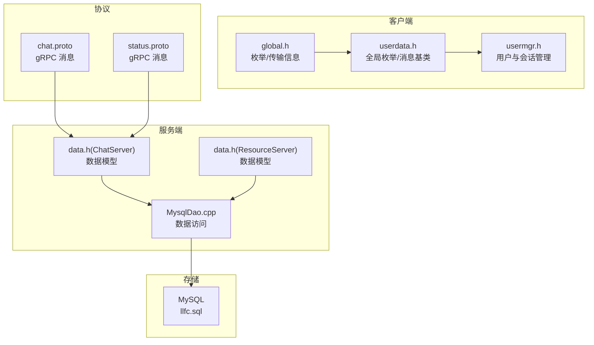
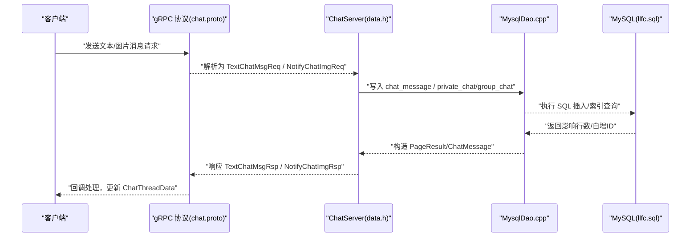
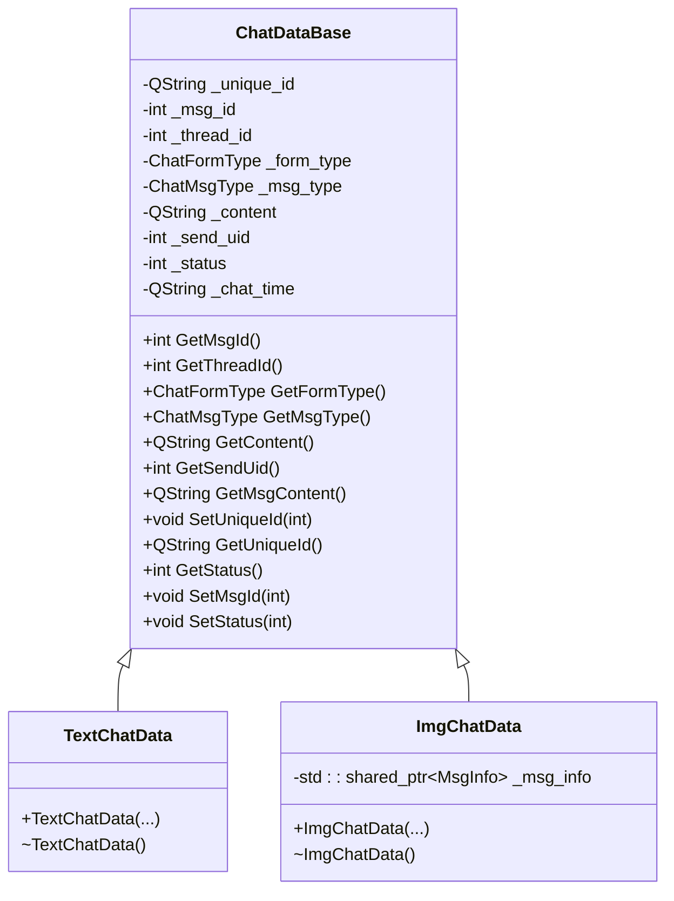
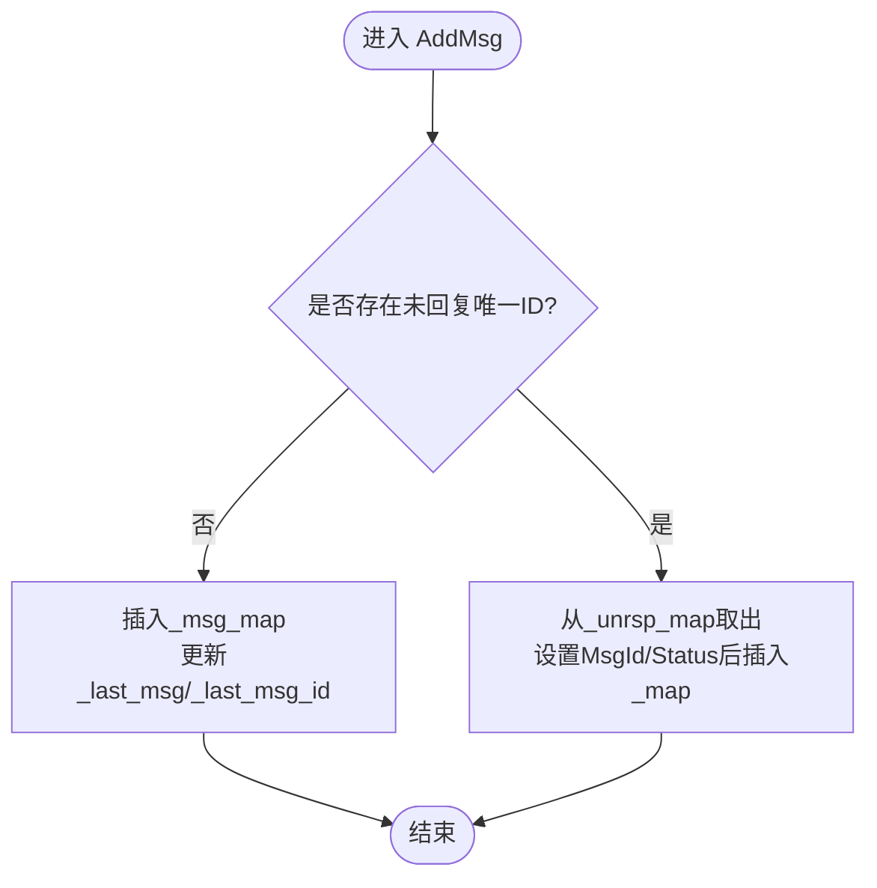
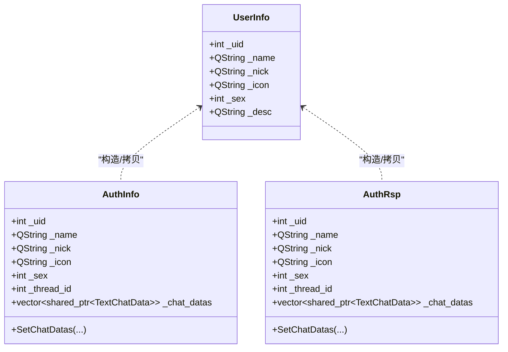
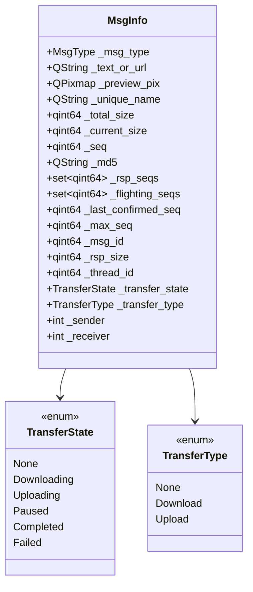
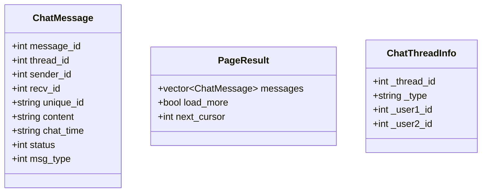
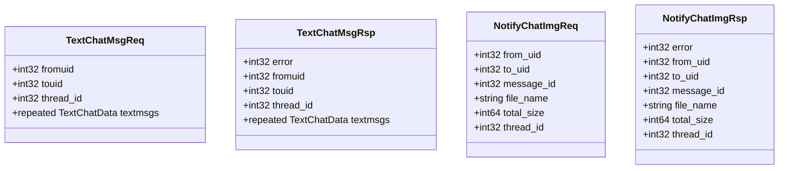
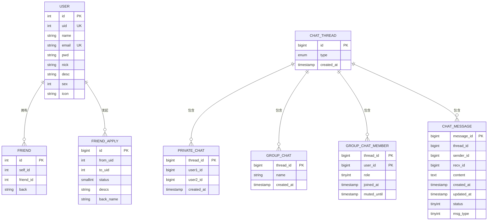
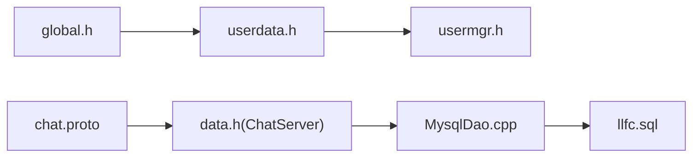

# 数据模型设计

<cite>
**本文引用的文件**   
- [userdata.h](file://client/llfcchat/include/userdata.h)
- [userdata.cpp](file://client/llfcchat/src/userdata.cpp)
- [global.h](file://client/llfcchat/include/global.h)
- [data.h（ChatServer）](file://server/ChatServer/include/data.h)
- [data.h（ResourceServer）](file://server/ResourceServer/include/data.h)
- [chat.proto](file://proto/chat_service/chat.proto)
- [status.proto](file://proto/status_service/status.proto)
- [llfc.sql](file://sql备份/llfc.sql)
- [MysqlDao.cpp](file://server/ChatServer/src/MysqlDao.cpp)
- [usermgr.h](file://client/llfcchat/include/usermgr.h)
</cite>

## 目录
1. [简介](#简介)
2. [项目结构](#项目结构)
3. [核心组件](#核心组件)
4. [架构总览](#架构总览)
5. [详细组件分析](#详细组件分析)
6. [依赖关系分析](#依赖关系分析)
7. [性能与复杂度](#性能与复杂度)
8. [序列化与反序列化](#序列化与反序列化)
9. [数据验证与完整性约束](#数据验证与完整性约束)
10. [使用示例与最佳实践](#使用示例与最佳实践)
11. [故障排查指南](#故障排查指南)
12. [结论](#结论)

## 简介
本文件为 LLFCChat 的数据模型设计文档，聚焦于客户端与服务端的核心数据实体：UserInfo、ChatMessage、FriendInfo（以 friend 表体现）、ThreadInfo（聊天会话）等。文档涵盖数据结构定义、继承层次、状态转换、业务规则、序列化和反序列化机制、数据验证与完整性约束，并提供使用示例与最佳实践，帮助开发者快速理解并正确使用数据模型。

## 项目结构
LLFCChat 采用 C++ Qt 客户端 + C++ 多服务后端（ChatServer、ResourceServer、StatusServer、GateServer）+ gRPC 协议 + MySQL 持久化的架构。数据模型在以下位置定义与使用：
- 客户端数据模型：client/llfcchat/include/userdata.h、client/llfcchat/include/global.h
- 服务端数据模型：server/ChatServer/include/data.h、server/ResourceServer/include/data.h
- 跨进程协议：proto/chat_service/chat.proto、proto/status_service/status.proto
- 数据库模式：sql备份/llfc.sql
- 数据访问层：server/ChatServer/src/MysqlDao.cpp
- 客户端用户管理与会话缓存：client/llfcchat/include/usermgr.h

**图表来源** 
- [userdata.h:1-288](file://client/llfcchat/include/userdata.h#L1-L288)
- [global.h:138-276](file://client/llfcchat/include/global.h#L138-L276)
- [data.h（ChatServer）:1-65](file://server/ChatServer/include/data.h#L1-L65)
- [data.h（ResourceServer）:1-60](file://server/ResourceServer/include/data.h#L1-L60)
- [chat.proto:1-105](file://proto/chat_service/chat.proto#L1-L105)
- [status.proto:1-32](file://proto/status_service/status.proto#L1-L32)
- [llfc.sql:24-434](file://sql备份/llfc.sql#L24-L434)
- [MysqlDao.cpp:152-179](file://server/ChatServer/src/MysqlDao.cpp#L152-L179)

**章节来源**
- [userdata.h:1-288](file://client/llfcchat/include/userdata.h#L1-L288)
- [global.h:138-276](file://client/llfcchat/include/global.h#L138-L276)
- [data.h（ChatServer）:1-65](file://server/ChatServer/include/data.h#L1-L65)
- [data.h（ResourceServer）:1-60](file://server/ResourceServer/include/data.h#L1-L60)
- [chat.proto:1-105](file://proto/chat_service/chat.proto#L1-L105)
- [status.proto:1-32](file://proto/status_service/status.proto#L1-L32)
- [llfc.sql:24-434](file://sql备份/llfc.sql#L24-L434)
- [MysqlDao.cpp:152-179](file://server/ChatServer/src/MysqlDao.cpp#L152-L179)

## 核心组件
本节概述关键数据实体及其职责：
- UserInfo：用户基本信息（名称、昵称、头像、性别、描述等），客户端与服务端均有对应结构体。
- ChatDataBase/TextChatData/ImgChatData：聊天消息抽象基类及具体类型，支持文本与图片消息的扩展。
- ChatThreadInfo/ChatThreadData：会话元信息与本地会话缓存，维护消息映射、未回复消息队列、进度更新等。
- MsgInfo：富媒体传输信息（大小、MD5、分片序号、传输状态等）。
- AuthInfo/AuthRsp：认证相关上下文，包含会话 thread_id 与历史消息。
- ApplyInfo/AddFriendApply：好友申请相关数据。
- ChatMessage/PageResult：服务端消息与分页查询结果。
- 枚举：ChatFormType、ChatMsgType、TransferState、TransferType、MsgStatus 等。

**章节来源**
- [userdata.h:108-284](file://client/llfcchat/include/userdata.h#L108-L284)
- [global.h:138-276](file://client/llfcchat/include/global.h#L138-L276)
- [data.h（ChatServer）:4-65](file://server/ChatServer/include/data.h#L4-L65)
- [data.h（ResourceServer）:4-60](file://server/ResourceServer/include/data.h#L4-L60)

## 架构总览
数据模型贯穿“客户端内存对象 -> gRPC 协议 -> 服务端内存对象 -> 数据库”的全链路。客户端通过 userdata.h 中的类组织消息与会话；服务端 data.h 提供与数据库一致的轻量结构；gRPC proto 定义跨进程消息；MySQL 提供持久化。

**图表来源** 
- [chat.proto:1-105](file://proto/chat_service/chat.proto#L1-L105)
- [data.h（ChatServer）:41-58](file://server/ChatServer/include/data.h#L41-L58)
- [MysqlDao.cpp:152-179](file://server/ChatServer/src/MysqlDao.cpp#L152-L179)
- [llfc.sql:24-434](file://sql备份/llfc.sql#L24-L434)

## 详细组件分析

### 客户端消息体系：ChatDataBase 继承层次
客户端将不同消息类型抽象为基类 ChatDataBase，派生出 TextChatData 与 ImgChatData，便于统一管理与渲染。

**图表来源** 
- [userdata.h:144-234](file://client/llfcchat/include/userdata.h#L144-L234)

**章节来源**
- [userdata.h:144-234](file://client/llfcchat/include/userdata.h#L144-L234)
- [userdata.cpp:17-47](file://client/llfcchat/src/userdata.cpp#L17-L47)

### 会话与消息缓存：ChatThreadData
ChatThreadData 维护单个会话的消息映射、最后一条消息、未回复消息队列、群成员与群名等，并提供添加、移动、更新进度等方法。

**图表来源** 
- [userdata.cpp:49-68](file://client/llfcchat/src/userdata.cpp#L49-L68)

**章节来源**
- [userdata.h:248-284](file://client/llfcchat/include/userdata.h#L248-L284)
- [userdata.cpp:49-162](file://client/llfcchat/src/userdata.cpp#L49-L162)

### 用户与认证上下文：UserInfo、AuthInfo、AuthRsp
- UserInfo：封装用户基础信息，支持从 AuthInfo/AuthRsp/SearchInfo 构造。
- AuthInfo/AuthRsp：认证上下文，包含 thread_id 与历史消息列表，用于初始化会话。

**图表来源** 
- [userdata.h:67-142](file://client/llfcchat/include/userdata.h#L67-L142)

**章节来源**
- [userdata.h:67-142](file://client/llfcchat/include/userdata.h#L67-L142)
- [userdata.cpp:144-153](file://client/llfcchat/src/userdata.cpp#L144-L153)

### 富媒体传输：MsgInfo 与传输状态
MsgInfo 记录消息类型、URL/文本内容、缩略图、唯一文件名、总大小、当前大小、分片序号、MD5、已确认序列、最大序列、关联消息ID、线程ID、传输状态与类型、发送者与接收者等。配合 TransferState/TransferType 枚举实现断点续传与进度同步。

**图表来源** 
- [global.h:152-197](file://client/llfcchat/include/global.h#L152-L197)

**章节来源**
- [global.h:152-197](file://client/llfcchat/include/global.h#L152-L197)

### 服务端数据模型：ChatMessage、PageResult、ChatThreadInfo
服务端 data.h 定义了与数据库一致的消息结构与分页结果，以及会话元信息。ChatMessage 包含 message_id、thread_id、sender_id、recv_id、unique_id、content、chat_time、status、msg_type。PageResult 包含 messages 列表、load_more 标志与 next_cursor（本页最后一条 message_id）。

**图表来源** 
- [data.h（ChatServer）:33-58](file://server/ChatServer/include/data.h#L33-L58)

**章节来源**
- [data.h（ChatServer）:33-58](file://server/ChatServer/include/data.h#L33-L58)

### gRPC 协议消息：chat.proto
chat.proto 定义了好友申请、认证、文本聊天、踢人、图片通知等 RPC 接口与消息结构。例如 TextChatMsgReq/TextChatMsgRsp、NotifyChatImgReq/NotifyChatImgRsp、AddFriendReq/Rsp、AuthFriendReq/Rsp 等。

**图表来源** 
- [chat.proto:54-104](file://proto/chat_service/chat.proto#L54-L104)

**章节来源**
- [chat.proto:1-105](file://proto/chat_service/chat.proto#L1-L105)

### 数据库模式：llfc.sql
数据库包含用户、好友、好友申请、私聊/群聊、聊天消息等表。关键表：
- user：用户基本信息
- friend：好友关系（self_id, friend_id）
- friend_apply：好友申请（from_uid, to_uid, status, descs, back_name）
- chat_thread：会话类型（private/group）
- private_chat：私聊双方与 thread_id
- group_chat：群聊名称与 thread_id
- group_chat_member：群成员与角色
- chat_message：消息内容、时间戳、状态、类型

**图表来源** 
- [llfc.sql:24-434](file://sql备份/llfc.sql#L24-L434)

**章节来源**
- [llfc.sql:24-434](file://sql备份/llfc.sql#L24-L434)

## 依赖关系分析
- 客户端 userdata.h 依赖 global.h 的枚举与 MsgInfo。
- 客户端 usermgr.h 持有 ChatThreadData 映射与用户/联系人/申请列表。
- 服务端 data.h 被 MysqlDao.cpp 使用进行数据读写。
- gRPC proto 定义跨进程消息，服务端将其转换为 data.h 结构。
- 数据库 llfc.sql 提供持久化模式，MysqlDao.cpp 负责 SQL 操作。

**图表来源** 
- [global.h:138-276](file://client/llfcchat/include/global.h#L138-L276)
- [userdata.h:1-288](file://client/llfcchat/include/userdata.h#L1-L288)
- [usermgr.h:77-115](file://client/llfcchat/include/usermgr.h#L77-L115)
- [chat.proto:1-105](file://proto/chat_service/chat.proto#L1-L105)
- [data.h（ChatServer）:1-65](file://server/ChatServer/include/data.h#L1-L65)
- [MysqlDao.cpp:152-179](file://server/ChatServer/src/MysqlDao.cpp#L152-L179)
- [llfc.sql:24-434](file://sql备份/llfc.sql#L24-L434)

**章节来源**
- [usermgr.h:77-115](file://client/llfcchat/include/usermgr.h#L77-L115)
- [MysqlDao.cpp:152-179](file://server/ChatServer/src/MysqlDao.cpp#L152-L179)

## 性能与复杂度
- 消息缓存：ChatThreadData 使用 QMap<int, shared_ptr<ChatDataBase>>，插入与查找平均 O(log n)，适合按消息 ID 快速定位。
- 未回复消息：_msg_unrsp_map 使用 QString 作为键，O(log n) 查找与删除，保证消息状态迁移高效。
- 分页查询：PageResult.next_cursor 基于 last message_id，避免深分页开销。
- 索引优化：chat_message 表对 thread_id+created_at、thread_id+message_id 建立索引，提升按会话加载与排序效率。
- 传输分片：MsgInfo._max_seq 与 _flighting_seqs/_rsp_seqs 控制并发与重传，降低网络抖动影响。

[无直接文件分析引用]

## 序列化与反序列化
- gRPC 序列化：chat.proto 与 status.proto 使用 protobuf3 自动序列化/反序列化，确保跨语言一致性。
- JSON 辅助：客户端 global.h 包含 QJsonDocument/QJsonObject 能力，可用于 HTTP 交互或调试日志。
- 客户端内存对象：userdata.h 中的类不直接序列化，通常通过构造函数从 gRPC 响应或 JSON 构建。
- 服务端数据模型：data.h 结构体用于 ORM/DAO 映射，由 MysqlDao.cpp 完成与数据库字段的双向转换。

**章节来源**
- [chat.proto:1-105](file://proto/chat_service/chat.proto#L1-L105)
- [status.proto:1-32](file://proto/status_service/status.proto#L1-L32)
- [global.h:1-12](file://client/llfcchat/include/global.h#L1-L12)
- [MysqlDao.cpp:152-179](file://server/ChatServer/src/MysqlDao.cpp#L152-L179)

## 数据验证与完整性约束
- 数据库约束：
  - user.uid/email 唯一索引，防止重复注册。
  - friend.self_id+friend_id 唯一索引，避免重复好友关系。
  - friend_apply.from_uid+to_uid 唯一索引，限制重复申请。
  - private_chat.user1_id+user2_id 唯一索引，确保一对一会话唯一性。
  - group_chat_member.thread_id+user_id 复合主键，确保成员唯一。
  - chat_message.message_id 自增主键，thread_id 外键语义由应用层保证。
- 应用层校验：
  - ChatMsgType/ChatFormType/TransferState 等枚举限定合法值。
  - ChatThreadData.AddMsg/MoveMsg 保证未回复消息正确迁移至已回复集合。
  - MsgInfo 的 MD5、分片序号、总大小用于完整性校验与断点续传。

**章节来源**
- [llfc.sql:24-434](file://sql备份/llfc.sql#L24-L434)
- [global.h:257-276](file://client/llfcchat/include/global.h#L257-L276)
- [userdata.cpp:49-68](file://client/llfcchat/src/userdata.cpp#L49-L68)

## 使用示例与最佳实践
- 创建文本消息：
  - 使用 TextChatData 构造函数传入 thread_id、msg_type=TEXT、content、send_uid、status、chat_time。
  - 通过 ChatThreadData.AppendMsg/MoveMsg 加入会话缓存。
- 发送图片消息：
  - 构造 ImgChatData，绑定 MsgInfo（含 total_size、md5、unique_name）。
  - 调用 gRPC NotifyChatImgReq 通知对方，服务端写入 chat_message。
- 加载历史消息：
  - 使用 PageResult.next_cursor 分页加载，避免全量拉取。
- 好友申请流程：
  - 客户端构造 AddFriendReq，服务端写入 friend_apply，状态机驱动 UI。
- 最佳实践：
  - 始终使用 unique_id 追踪未回复消息，避免丢失。
  - 利用 ChatThreadData.GetMsgMapRef() 谨慎修改，保持线程安全。
  - 使用 MsgInfo._flighting_seqs 做超时重传，结合 _rsp_seqs 去重。

[无直接文件分析引用]

## 故障排查指南
- 消息未显示：检查 ChatThreadData._msg_unrsp_map 是否迁移成功，确认 MoveMsg 逻辑。
- 图片下载失败：核对 MsgInfo.md5、_total_size、_current_size 与服务器返回 _rsp_size 一致性。
- 好友申请冲突：查看 friend_apply.from_uid+to_uid 唯一约束，避免重复提交。
- 会话加载缓慢：检查 chat_message 索引 idx_thread_created、idx_thread_message 是否生效。
- 登录/认证异常：确认 status.proto LoginReq/LoginRsp 与 token 传递正确。

**章节来源**
- [userdata.cpp:56-68](file://client/llfcchat/src/userdata.cpp#L56-L68)
- [global.h:167-197](file://client/llfcchat/include/global.h#L167-L197)
- [llfc.sql:24-434](file://sql备份/llfc.sql#L24-L434)
- [status.proto:22-31](file://proto/status_service/status.proto#L22-L31)

## 结论
LLFCChat 的数据模型以清晰的层次与职责划分支撑了即时通讯的核心功能：用户管理、好友关系、会话与消息、富媒体传输。通过 gRPC 协议与 MySQL 持久化，实现了跨进程与跨平台的一致性。遵循本文档的结构与最佳实践，可显著提升开发效率与系统稳定性。