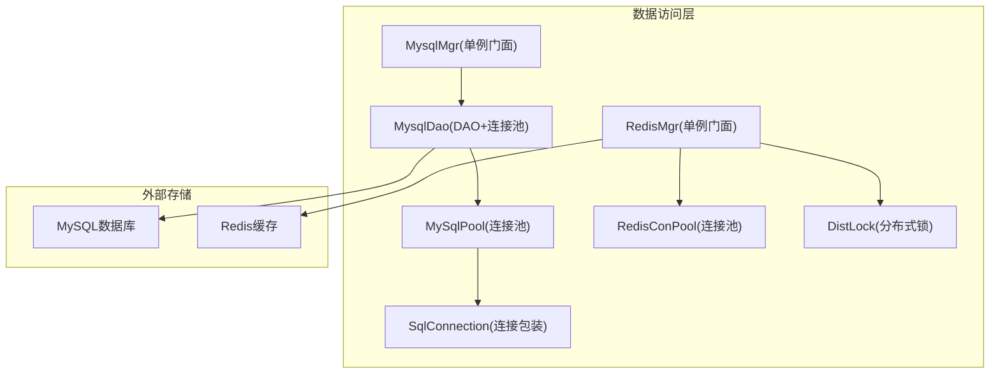
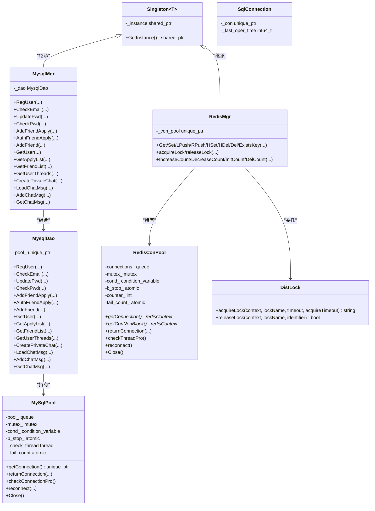
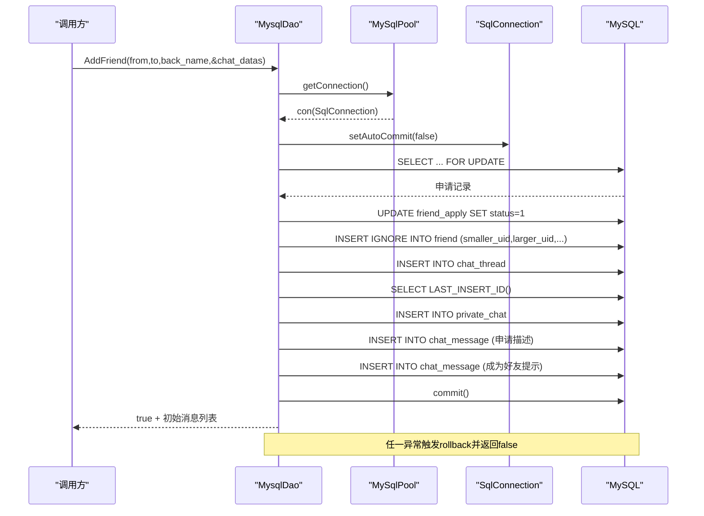
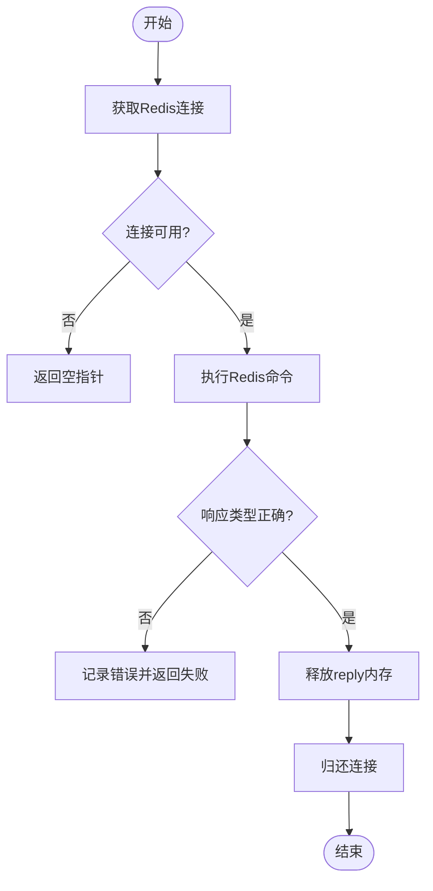
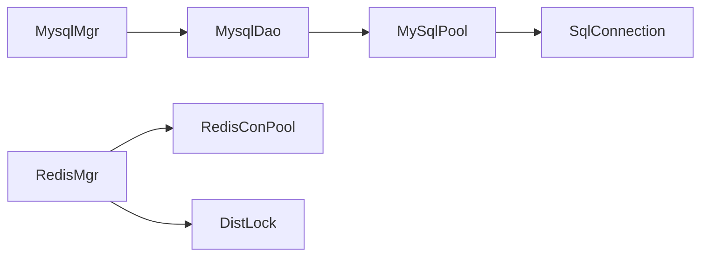

# 数据访问层设计

<cite>
**本文引用的文件**   
- [MysqlDao.h](file://server/ChatServer/include/MysqlDao.h)
- [MysqlDao.cpp](file://server/ChatServer/src/MysqlDao.cpp)
- [MysqlMgr.h](file://server/ChatServer/include/MysqlMgr.h)
- [MysqlMgr.cpp](file://server/ChatServer/src/MysqlMgr.cpp)
- [RedisMgr.h](file://server/ChatServer/include/RedisMgr.h)
- [RedisMgr.cpp](file://server/ChatServer/src/RedisMgr.cpp)
- [Singleton.h](file://server/ChatServer/include/Singleton.h)
- [data.h](file://server/ChatServer/include/data.h)
- [const.h](file://server/ChatServer/include/const.h)
- [DistLock.h](file://server/ChatServer/include/DistLock.h)
</cite>

## 目录
1. [引言](#引言)
2. [项目结构](#项目结构)
3. [核心组件](#核心组件)
4. [架构总览](#架构总览)
5. [详细组件分析](#详细组件分析)
6. [依赖关系分析](#依赖关系分析)
7. [性能考量](#性能考量)
8. [故障排查指南](#故障排查指南)
9. [结论](#结论)
10. [附录](#附录)

## 引言
本设计文档聚焦于LLFCChat服务端的“数据访问层”，围绕MySQL与Redis两大存储介质，系统阐述MysqlDao与RedisMgr的设计模式、连接池管理、事务处理机制、CRUD抽象封装、SQL构建与参数绑定、结果映射策略、缓存一致性方案、异常处理与重试、性能优化以及扩展性设计。读者可据此理解并扩展该数据访问层的实现。

## 项目结构
数据访问层主要位于ChatServer模块中，关键文件包括：
- MySQL相关：MysqlDao（DAO与连接池）、MysqlMgr（门面单例）
- Redis相关：RedisMgr（单例门面）、RedisConPool（连接池）
- 通用基础设施：Singleton（线程安全单例模板）、Defer（RAII式资源释放）、错误码与常量定义
- 数据模型：UserInfo、ApplyInfo、ChatThreadInfo、ChatMessage、PageResult等

图表来源
- [MysqlMgr.h:8-39](file://server/ChatServer/include/MysqlMgr.h#L8-L39)
- [MysqlDao.h:25-232](file://server/ChatServer/include/MysqlDao.h#L25-L232)
- [RedisMgr.h:267-303](file://server/ChatServer/include/RedisMgr.h#L267-L303)
- [DistLock.h:4-16](file://server/ChatServer/include/DistLock.h#L4-L16)

章节来源
- [MysqlMgr.h:1-41](file://server/ChatServer/include/MysqlMgr.h#L1-L41)
- [MysqlDao.h:1-270](file://server/ChatServer/include/MysqlDao.h#L1-L270)
- [RedisMgr.h:1-305](file://server/ChatServer/include/RedisMgr.h#L1-L305)
- [Singleton.h:1-33](file://server/ChatServer/include/Singleton.h#L1-L33)
- [data.h:1-65](file://server/ChatServer/include/data.h#L1-L65)
- [const.h:1-104](file://server/ChatServer/include/const.h#L1-L104)

## 核心组件
- MysqlDao：封装MySQL连接池、预编译语句、事务控制、结果映射；提供用户、好友、聊天消息等业务的CRUD接口。
- MysqlMgr：基于Singleton的轻量门面，转发调用至MysqlDao，便于上层以统一入口访问数据库。
- RedisMgr：基于Singleton的Redis操作门面，封装常用命令、队列、哈希、分布式锁等能力。
- 连接池：MySqlPool与RedisConPool分别管理底层连接的生命周期、健康检查、自动重连与并发获取/归还。
- 单例：Singleton模板类保证全局唯一实例与线程安全初始化。
- Defer：RAII式延迟执行器，确保资源在作用域结束时被正确释放（如连接归还）。

章节来源
- [MysqlDao.h:236-267](file://server/ChatServer/include/MysqlDao.h#L236-L267)
- [MysqlMgr.h:8-39](file://server/ChatServer/include/MysqlMgr.h#L8-L39)
- [RedisMgr.h:267-303](file://server/ChatServer/include/RedisMgr.h#L267-L303)
- [Singleton.h:6-29](file://server/ChatServer/include/Singleton.h#L6-L29)
- [const.h:24-36](file://server/ChatServer/include/const.h#L24-L36)

## 架构总览
数据访问层采用“门面+DAO+连接池”的分层模式：
- 门面层（MysqlMgr/RedisMgr）：对外暴露稳定API，屏蔽内部细节，使用单例模式统一管理生命周期。
- DAO层（MysqlDao）：面向业务语义封装数据库操作，负责SQL构建、参数绑定、结果映射、事务边界。
- 连接池层（MySqlPool/RedisConPool）：负责连接创建、复用、健康检查、自动重连、并发安全。

图表来源
- [MysqlMgr.h:8-39](file://server/ChatServer/include/MysqlMgr.h#L8-L39)
- [MysqlDao.h:236-267](file://server/ChatServer/include/MysqlDao.h#L236-L267)
- [MysqlDao.h:25-232](file://server/ChatServer/include/MysqlDao.h#L25-L232)
- [RedisMgr.h:267-303](file://server/ChatServer/include/RedisMgr.h#L267-L303)
- [DistLock.h:4-16](file://server/ChatServer/include/DistLock.h#L4-L16)
- [Singleton.h:6-29](file://server/ChatServer/include/Singleton.h#L6-L29)

## 详细组件分析

### MysqlDao与MySqlPool：连接池与事务
- 连接池设计
  - 构造时按配置创建固定数量的MySQL连接，设置schema，记录最后使用时间戳。
  - 后台线程周期性对连接进行健康检查（SELECT 1），失败则标记并尝试重建连接。
  - getConnection通过条件变量阻塞等待可用连接，returnConnection将连接归还并唤醒等待者。
  - Close停止检查线程并清理资源。
- 事务处理
  - 多步写操作（如添加好友）显式setAutoCommit(false)，分阶段执行查询/更新，成功commit，异常rollback。
  - 使用FOR UPDATE锁定申请记录，避免并发竞争；插入好友关系时按uid大小顺序写入，避免死锁。
- SQL与参数绑定
  - 全部使用prepareStatement与setXxx系列方法绑定参数，防止SQL注入并提升性能。
  - 复杂查询使用CTE+UNION ALL+LIMIT N+1实现分页判断与游标推进。
- 结果映射
  - 查询结果逐行读取并填充到UserInfo、ApplyInfo、ChatThreadInfo、ChatMessage等结构体。
  - 分页返回PageResult包含messages、load_more、next_cursor。

图表来源
- [MysqlDao.cpp:247-504](file://server/ChatServer/src/MysqlDao.cpp#L247-L504)

章节来源
- [MysqlDao.h:25-232](file://server/ChatServer/include/MysqlDao.h#L25-L232)
- [MysqlDao.cpp:1-1104](file://server/ChatServer/src/MysqlDao.cpp#L1-L1104)

### RedisMgr与RedisConPool：连接池与分布式锁
- 连接池设计
  - 构造时创建指定数量redisContext，AUTH认证成功后入池。
  - 后台线程每60秒对连接执行PING检测，失败计数增加并尝试重建连接。
  - getConnection阻塞等待可用连接，getConNonBlock非阻塞获取，returnConnection归还。
- 命令封装
  - Get/Set/LPush/RPush/HSet/HDel/Del/ExistsKey等基础操作均从池中取连接，执行后freeReplyObject并归还连接。
  - HSet重载支持二进制长度参数，减少字符串拼接开销。
- 分布式锁
  - acquireLock/releaseLock委托给DistLock，使用原子SETNX+过期时间实现，避免死锁与误释放。
  - 登录计数增减等操作通过分布式锁保护，保证跨进程一致性。

图表来源
- [RedisMgr.cpp:19-79](file://server/ChatServer/src/RedisMgr.cpp#L19-L79)
- [RedisMgr.cpp:81-133](file://server/ChatServer/src/RedisMgr.cpp#L81-L133)
- [RedisMgr.cpp:186-245](file://server/ChatServer/src/RedisMgr.cpp#L186-L245)

章节来源
- [RedisMgr.h:9-265](file://server/ChatServer/include/RedisMgr.h#L9-L265)
- [RedisMgr.cpp:1-462](file://server/ChatServer/src/RedisMgr.cpp#L1-L462)
- [DistLock.h:4-16](file://server/ChatServer/include/DistLock.h#L4-L16)

### 单例模式与资源管理
- Singleton模板类使用std::call_once保证线程安全的懒加载初始化，返回shared_ptr实例。
- MysqlMgr与RedisMgr继承自Singleton，构造函数中初始化各自连接池，析构时关闭连接池或清理资源。
- Defer用于RAII式资源释放，确保在任何路径下都能归还连接或释放reply对象。

章节来源
- [Singleton.h:6-29](file://server/ChatServer/include/Singleton.h#L6-L29)
- [MysqlMgr.cpp:1-95](file://server/ChatServer/src/MysqlMgr.cpp#L1-L95)
- [RedisMgr.cpp:1-15](file://server/ChatServer/src/RedisMgr.cpp#L1-L15)
- [const.h:24-36](file://server/ChatServer/include/const.h#L24-L36)

### 数据模型与结果映射
- UserInfo、ApplyInfo、ChatThreadInfo、ChatMessage、PageResult等结构体承载查询结果。
- DAO层将ResultSet字段映射到结构体成员，保证类型一致与可读性。
- PageResult包含load_more与next_cursor，便于客户端分页拉取。

章节来源
- [data.h:1-65](file://server/ChatServer/include/data.h#L1-L65)

## 依赖关系分析
- MysqlMgr依赖MysqlDao，MysqlDao依赖MySqlPool，MySqlPool依赖SqlConnection与MySQL驱动。
- RedisMgr依赖RedisConPool，RedisConPool依赖hiredis库；RedisMgr还依赖DistLock实现分布式锁。
- 所有组件通过Singleton模板获得全局唯一实例，降低耦合度。

图表来源
- [MysqlMgr.h:8-39](file://server/ChatServer/include/MysqlMgr.h#L8-L39)
- [MysqlDao.h:236-267](file://server/ChatServer/include/MysqlDao.h#L236-L267)
- [RedisMgr.h:267-303](file://server/ChatServer/include/RedisMgr.h#L267-L303)
- [DistLock.h:4-16](file://server/ChatServer/include/DistLock.h#L4-L16)

章节来源
- [MysqlMgr.h:1-41](file://server/ChatServer/include/MysqlMgr.h#L1-L41)
- [MysqlDao.h:1-270](file://server/ChatServer/include/MysqlDao.h#L1-L270)
- [RedisMgr.h:1-305](file://server/ChatServer/include/RedisMgr.h#L1-L305)

## 性能考量
- 预编译语句：所有SQL均使用prepareStatement与参数绑定，减少解析开销并防注入。
- 连接池调优：
  - MySQL：固定池大小，后台线程定期健康检查与自动重连，避免连接泄漏与失效。
  - Redis：PING保活，失败计数与重建逻辑，非阻塞获取连接提高吞吐。
- 批量与分页：
  - 聊天消息分页采用LIMIT N+1策略，减少一次往返判断是否还有下一页。
  - 好友申请与消息插入在事务内分批执行，减少网络往返。
- I/O与内存：
  - Redis reply对象及时释放，避免内存增长。
  - Defer确保异常路径也能释放资源。

[本节为通用指导，不直接分析具体文件]

## 故障排查指南
- 数据库连接失败
  - 现象：getConnection阻塞或返回空，日志出现连接失败。
  - 排查：检查MySqlPool/RedisConPool初始化参数、网络连通性、认证信息；查看后台健康检查线程日志。
- 事务回滚
  - 现象：添加好友失败，数据库状态不一致。
  - 排查：确认FOR UPDATE锁定与插入顺序；检查异常分支是否执行rollback；关注错误码（如死锁1213）。
- Redis命令失败
  - 现象：GET/SET等返回NULL或类型不符。
  - 排查：检查连接池是否可用、AUTH是否成功、reply类型校验逻辑；确认键是否存在。
- 分布式锁问题
  - 现象：计数不一致或锁竞争超时。
  - 排查：确认acquireTimeout与lockTimeout配置；检查identifier是否正确传递与释放。

章节来源
- [MysqlDao.cpp:486-504](file://server/ChatServer/src/MysqlDao.cpp#L486-L504)
- [RedisMgr.cpp:19-79](file://server/ChatServer/src/RedisMgr.cpp#L19-L79)
- [const.h:5-20](file://server/ChatServer/include/const.h#L5-L20)

## 结论
LLFCChat的数据访问层通过清晰的分层与单例门面、健壮的连接池、严格的事务控制与RAII资源管理，实现了高可靠、高性能的MySQL与Redis访问能力。其设计具备良好的扩展性，可平滑接入更多存储后端或增强缓存一致性策略。建议后续引入统一的错误码体系、连接池监控指标与更细粒度的重试退避策略，进一步提升稳定性与可观测性。

[本节为总结，不直接分析具体文件]

## 附录

### CRUD抽象设计与SQL构建要点
- 读操作：prepareStatement + setXxx + executeQuery + ResultSet遍历映射。
- 写操作：prepareStatement + setXxx + executeUpdate，必要时开启事务与回滚。
- 分页：LIMIT N+1判断是否有下一页，结合next_cursor推进。
- 参数绑定：始终使用占位符与setXxx，禁止字符串拼接SQL。

章节来源
- [MysqlDao.cpp:59-94](file://server/ChatServer/src/MysqlDao.cpp#L59-L94)
- [MysqlDao.cpp:96-124](file://server/ChatServer/src/MysqlDao.cpp#L96-L124)
- [MysqlDao.cpp:681-770](file://server/ChatServer/src/MysqlDao.cpp#L681-L770)

### 缓存与数据库一致性策略
- 读写分离：当前实现未强制读写分离，可在上层根据场景选择直读DB或走Redis缓存。
- 缓存更新策略：建议在写DB成功后同步更新或删除对应缓存键，或使用延迟双删策略。
- 数据同步机制：对于热点数据（如用户信息），可采用版本号或时间戳配合缓存失效。

[本节为概念性说明，不直接分析具体文件]

### 扩展性设计建议
- 抽象数据源接口：定义统一的IDatabase接口，支持MySQL/PostgreSQL/SQLite等多后端。
- 连接池抽象：抽象IConnectionPool，替换不同存储的连接池实现。
- 缓存适配器：定义ICache接口，支持Redis/Memcached/本地缓存等。
- 配置化：通过配置文件动态切换后端与连接池参数。

[本节为概念性说明，不直接分析具体文件]