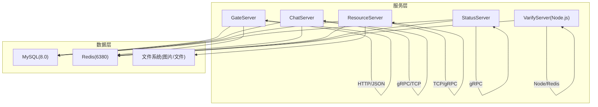
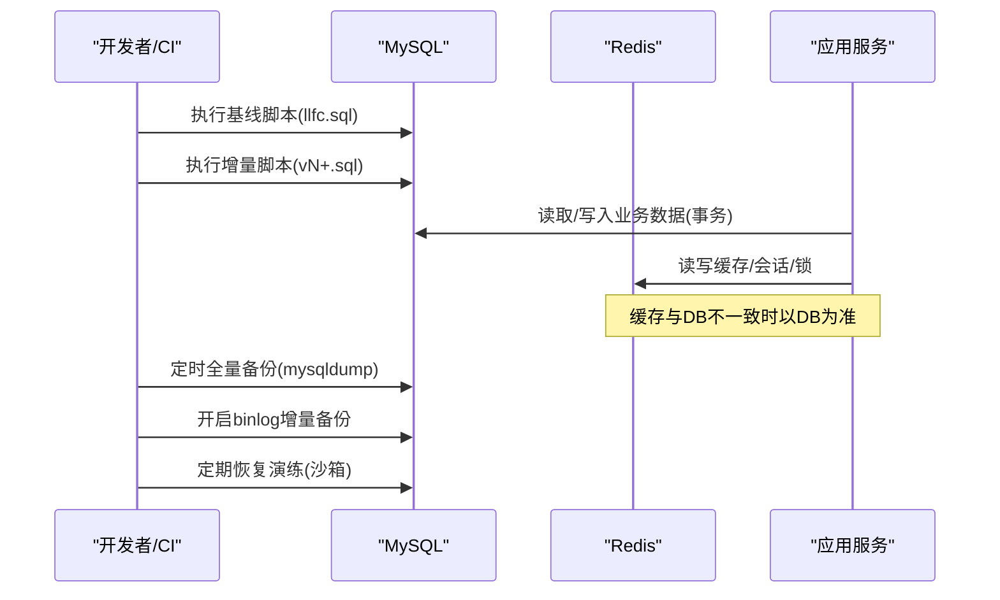
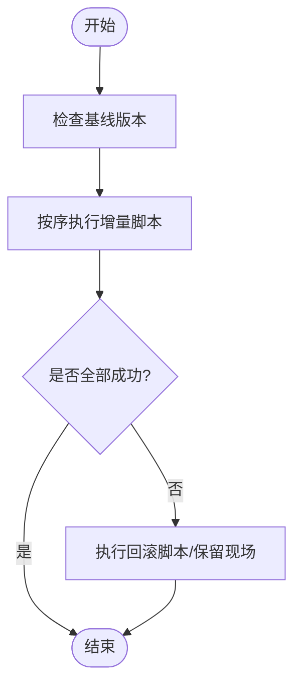
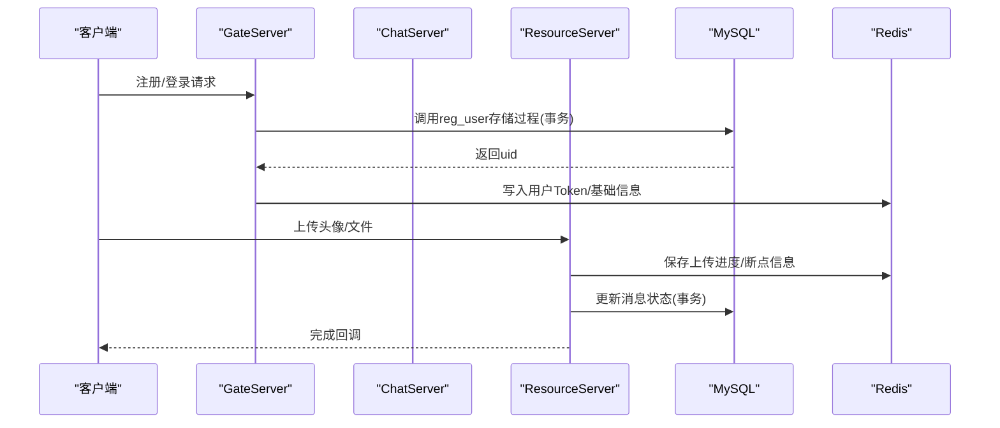
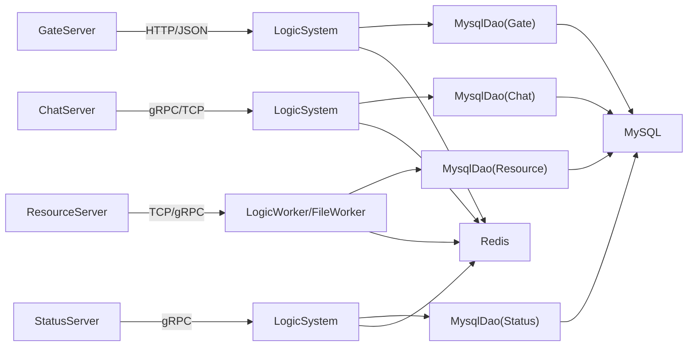

# 数据迁移与备份

<cite>
**本文引用的文件**   
- [llfc.sql](file://sql备份/llfc.sql)
- [chat_message.sql](file://sql备份/chat_message.sql)
- [llfc2.sql](file://sql备份/llfc2.sql)
- [llfc3.sql](file://sql备份/llfc3.sql)
- [MysqlDao.h](file://server/ResourceServer/include/MysqlDao.h)
- [MysqlDao.cpp（ChatServer）](file://server/ChatServer/src/MysqlDao.cpp)
- [MysqlDao.cpp（ResourceServer）](file://server/ResourceServer/src/MysqlDao.cpp)
- [LogicSystem.cpp（GateServer）](file://server/GateServer/src/LogicSystem.cpp)
- [config.ini（GateServer）](file://server/GateServer/config/config.ini)
- [config.ini（StatusServer）](file://server/StatusServer/config/config.ini)
- [redis.js（VarifyServer）](file://server/VarifyServer/redis.js)
- [day11-注册功能.md](file://开发文档/day11-注册功能.md)
- [day13-重置界面.md](file://开发文档/day13-重置界面.md)
- [day35心跳逻辑.md](file://开发文档/day35心跳逻辑.md)
- [day37-聊天信息存储方案.md](file://开发文档/day37-聊天信息存储方案.md)
- [day38-断点续传.md](file://开发文档/day38-断点续传.md)
- [day41-通知客户端异步下载聊天图片.md](file://开发文档/day41-通知客户端异步下载聊天图片.md)
</cite>

## 目录
1. [引言](#引言)
2. [项目结构](#项目结构)
3. [核心组件](#核心组件)
4. [架构总览](#架构总览)
5. [详细组件分析](#详细组件分析)
6. [依赖关系分析](#依赖关系分析)
7. [性能考量](#性能考量)
8. [故障排查指南](#故障排查指南)
9. [结论](#结论)
10. [附录](#附录)

## 引言
本文件面向LLFCChat项目的数据迁移与备份策略，覆盖数据库版本管理、增量升级与回滚、全量/增量/实时备份、一致性保障、灾难恢复与数据清理等主题。结合仓库中的SQL脚本、MySQL连接池与事务处理、Redis缓存与会话状态、以及分布式锁实现，给出可落地的实施方案与最佳实践。

## 项目结构
- SQL脚本位于 sql备份 目录，包含多版本的结构与数据快照，用于基线重建与差异对比。
- 服务端各模块通过 MysqlMgr/MysqlDao 访问 MySQL，使用连接池与事务控制；部分业务将热点数据与会话状态写入 Redis。
- 配置集中在各服务的 config.ini 中，定义 MySQL/Redis 的连接参数。

**图表来源** 
- [config.ini（GateServer）:1-23](file://server/GateServer/config/config.ini#L1-L23)
- [config.ini（StatusServer）:1-23](file://server/StatusServer/config/config.ini#L1-L23)
- [MysqlDao.h:1-273](file://server/ResourceServer/include/MysqlDao.h#L1-L273)

**章节来源**
- [config.ini（GateServer）:1-23](file://server/GateServer/config/config.ini#L1-L23)
- [config.ini（StatusServer）:1-23](file://server/StatusServer/config/config.ini#L1-L23)

## 核心组件
- MySQL 数据持久化：表结构包括 chat_message、chat_thread、friend、friend_apply、group_chat、group_chat_member、private_chat、user、user_id 等；提供 reg_user 存储过程。
- Redis 缓存与会话：用户基础信息、验证码、登录态、上传/下载进度、分布式锁等。
- 连接池与事务：MySqlPool 负责连接复用与健康检查；DAO层在关键路径上开启事务并保证原子性。
- 分布式锁：基于 Redis 的 SET NX EX + Lua 解锁，避免并发冲突。

**章节来源**
- [llfc.sql:1-756](file://sql备份/llfc.sql#L1-L756)
- [MysqlDao.h:1-273](file://server/ResourceServer/include/MysqlDao.h#L1-L273)
- [day32分布式锁设计思路.md:535-543](file://开发文档/day32分布式锁设计思路.md#L535-L543)

## 架构总览
下图展示数据迁移与备份相关的关键流程：版本基线、增量脚本执行、回滚、全量/增量/实时备份、一致性校验与恢复演练。

**图表来源** 
- [llfc.sql:1-756](file://sql备份/llfc.sql#L1-L756)
- [MysqlDao.cpp（ChatServer）:833-880](file://server/ChatServer/src/MysqlDao.cpp#L833-L880)
- [MysqlDao.cpp（ResourceServer）:251-349](file://server/ResourceServer/src/MysqlDao.cpp#L251-L349)

## 详细组件分析

### 数据库版本管理与增量升级
- 基线脚本：sql备份/llfc.sql 为当前完整结构与数据快照，适合作为新环境初始化或灾难恢复基线。
- 历史快照：chat_message.sql、llfc2.sql、llfc3.sql 可作为演进过程中的阶段快照，便于对比差异与定位变更。
- 增量脚本规范：
  - 命名：v{版本号}_描述.sql，如 v001_add_msg_type.sql
  - 内容：仅包含 DDL/DML 变更，幂等优先（IF NOT EXISTS / REPLACE INTO 等），记录影响行数与回滚语句。
  - 元数据：维护一张 schema_version 表，记录已执行脚本及时间戳，避免重复执行。
- 执行顺序：先执行基线，再按版本号升序执行增量脚本；失败即中止，记录错误日志。

**图表来源** 
- [llfc.sql:1-756](file://sql备份/llfc.sql#L1-L756)
- [chat_message.sql:1-38](file://sql备份/chat_message.sql#L1-L38)
- [llfc2.sql:1-38](file://sql备份/llfc2.sql#L1-L38)
- [llfc3.sql:1-38](file://sql备份/llfc3.sql#L1-L38)

**章节来源**
- [llfc.sql:1-756](file://sql备份/llfc.sql#L1-L756)
- [chat_message.sql:1-38](file://sql备份/chat_message.sql#L1-L38)
- [llfc2.sql:1-38](file://sql备份/llfc2.sql#L1-L38)
- [llfc3.sql:1-38](file://sql备份/llfc3.sql#L1-L38)

### 回滚策略
- 原则：每个增量脚本必须配套反向回滚脚本，确保可逆。
- 操作：若执行失败，立即停止并执行对应回滚脚本；对已生效的部分进行补偿。
- 验证：回滚后需进行一致性校验（行数、索引、约束）。

**章节来源**
- [llfc.sql:1-756](file://sql备份/llfc.sql#L1-L756)

### 数据备份方案
- 全量备份：
  - 工具：mysqldump 导出 llfc 库结构与数据，建议压缩与异地存储。
  - 频率：每日低峰期一次，保留最近若干份。
- 增量备份：
  - 启用 binlog，按时间点或位置恢复；配合全量基线实现任意时间点恢复。
- 实时备份：
  - 主从复制（半同步）或云厂商托管高可用方案，降低RPO/RTO。
- 恢复演练：
  - 定期在沙箱环境执行恢复演练，验证RTO/RPO与数据一致性。

[本节为通用策略说明，不直接分析具体文件]

### 数据一致性保障
- 事务处理：
  - DAO层关键路径关闭自动提交，批量插入/更新后统一 commit；异常时 rollback。
  - 示例：聊天消息批量写入、好友申请审核、私聊线程创建等。
- 锁机制：
  - 分布式锁：基于 Redis SET NX EX + Lua 解锁，保证跨进程/节点互斥。
  - 本地锁：线程内临界区保护，避免死锁需统一加锁顺序。
- 冲突解决：
  - 唯一键冲突（如 friend_apply 唯一索引）采用重试查询或幂等写入。
  - 读多写少场景下，以MySQL为准，Redis作为缓存加速。

**图表来源** 
- [MysqlDao.cpp（ChatServer）:833-880](file://server/ChatServer/src/MysqlDao.cpp#L833-L880)
- [MysqlDao.cpp（ResourceServer）:251-349](file://server/ResourceServer/src/MysqlDao.cpp#L251-L349)
- [LogicSystem.cpp（GateServer）:214-250](file://server/GateServer/src/LogicSystem.cpp#L214-L250)
- [redis.js（VarifyServer）:1-48](file://server/VarifyServer/redis.js#L1-L48)

**章节来源**
- [MysqlDao.cpp（ChatServer）:833-880](file://server/ChatServer/src/MysqlDao.cpp#L833-L880)
- [MysqlDao.cpp（ResourceServer）:251-349](file://server/ResourceServer/src/MysqlDao.cpp#L251-L349)
- [LogicSystem.cpp（GateServer）:214-250](file://server/GateServer/src/LogicSystem.cpp#L214-L250)
- [redis.js（VarifyServer）:1-48](file://server/VarifyServer/redis.js#L1-L48)

### 灾难恢复流程
- 恢复步骤：
  1) 准备干净环境，导入基线 llfc.sql
  2) 回放增量脚本至目标时间点
  3) 回放binlog到指定LST/时间
  4) 校验关键表行数与索引
  5) 启动服务，灰度验证
- 故障转移：
  - 主从切换：提升从库为主，更新DNS/配置指向新主库
  - 服务降级：Redis不可用时，回退直连MySQL；限流与熔断保护
- 演练计划：
  - 每月至少一次全链路恢复演练，记录RTO/RPO与问题清单

[本节为通用流程说明，不直接分析具体文件]

### 数据清理策略
- 历史归档：
  - 按月/季度归档 chat_message 等热表，冷数据迁移至归档库或对象存储
- 存储空间优化：
  - 定期 OPTIMIZE TABLE、重建索引；清理无用临时表
- 监控指标：
  - 慢查询、锁等待、连接数、磁盘I/O、binlog大小增长速率

[本节为通用策略说明，不直接分析具体文件]

## 依赖关系分析
- 服务与数据库：
  - Gate/Chat/Resource/Status 均通过 MysqlDao 访问 MySQL，配置来自各自 config.ini
  - Redis 用于会话、验证码、分布式锁、上传/下载进度
- 版本与脚本：
  - 基线 llfc.sql 决定表结构与初始数据；增量脚本驱动演进
- 一致性关键点：
  - 事务边界在DAO层；分布式锁在Redis层；缓存与DB一致性以DB为准

**图表来源** 
- [config.ini（GateServer）:1-23](file://server/GateServer/config/config.ini#L1-L23)
- [config.ini（StatusServer）:1-23](file://server/StatusServer/config/config.ini#L1-L23)
- [MysqlDao.h:1-273](file://server/ResourceServer/include/MysqlDao.h#L1-L273)

**章节来源**
- [config.ini（GateServer）:1-23](file://server/GateServer/config/config.ini#L1-L23)
- [config.ini（StatusServer）:1-23](file://server/StatusServer/config/config.ini#L1-L23)
- [MysqlDao.h:1-273](file://server/ResourceServer/include/MysqlDao.h#L1-L273)

## 性能考量
- 连接池健康检查：MySqlPool 周期性检测连接存活，失败自动重连，减少长事务阻塞
- 批量写入：聊天消息批量插入，减少往返开销
- 索引优化：chat_message 的 thread_id+created_at/message_id 复合索引提升分页与排序性能
- 缓存命中：用户基础信息与验证码缓存于Redis，降低DB压力

**章节来源**
- [MysqlDao.h:1-273](file://server/ResourceServer/include/MysqlDao.h#L1-L273)
- [day37-聊天信息存储方案.md:3387-3648](file://开发文档/day37-聊天信息存储方案.md#L3387-L3648)

## 故障排查指南
- 常见问题
  - 唯一键冲突：检查 friend_apply 唯一索引，必要时重试查询已存在记录
  - 连接超时：查看 MySqlPool 健康检查与重连日志
  - 缓存不一致：核对Redis键过期时间与DB写入时序
- 定位手段
  - 打开MySQL慢查询日志，分析耗时SQL
  - 检查Redis连接与认证日志
  - 核对事务回滚与锁释放路径

**章节来源**
- [MysqlDao.cpp（ChatServer）:833-880](file://server/ChatServer/src/MysqlDao.cpp#L833-L880)
- [MysqlDao.cpp（ResourceServer）:251-349](file://server/ResourceServer/src/MysqlDao.cpp#L251-L349)
- [day35心跳逻辑.md:95-365](file://开发文档/day35心跳逻辑.md#L95-L365)

## 结论
通过规范的版本管理、完善的备份体系、严格的事务与锁机制，以及定期的恢复演练，LLFCChat可在高并发与分布式环境下保障数据的完整性与可用性。建议在后续迭代中引入自动化迁移流水线与监控告警，进一步提升运维效率与稳定性。

## 附录
- 常用命令参考（示例）
  - 全量备份：mysqldump -u root -p --single-transaction --routines --triggers llfc > llfc_full.sql
  - 增量回放：mysqlbinlog --start-datetime=... --stop-datetime=... mysql-bin.000001 | mysql -u root -p
  - 恢复基线：mysql -u root -p llfc < llfc.sql
- 监控指标建议
  - QPS、延迟P95/P99、连接池使用率、慢查询数量、锁等待时长、磁盘I/O、binlog大小

[本节为通用补充说明，不直接分析具体文件]