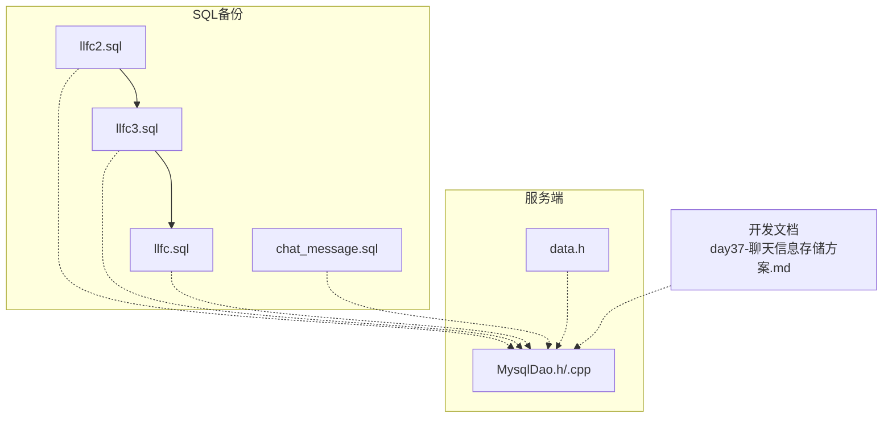
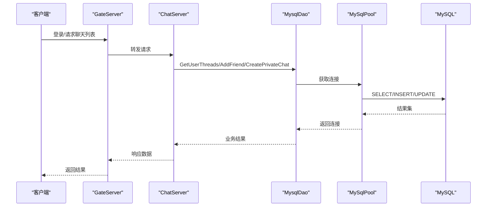
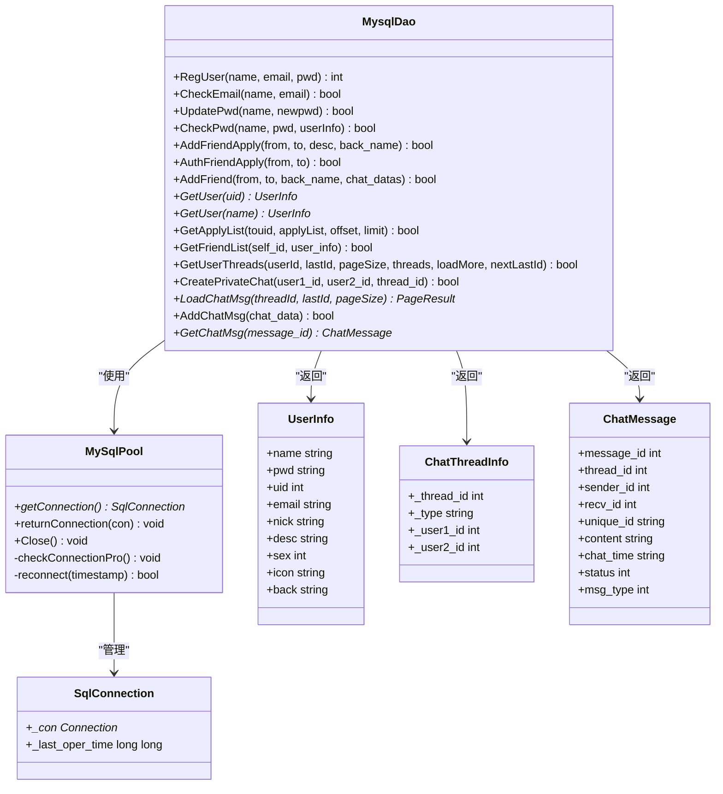
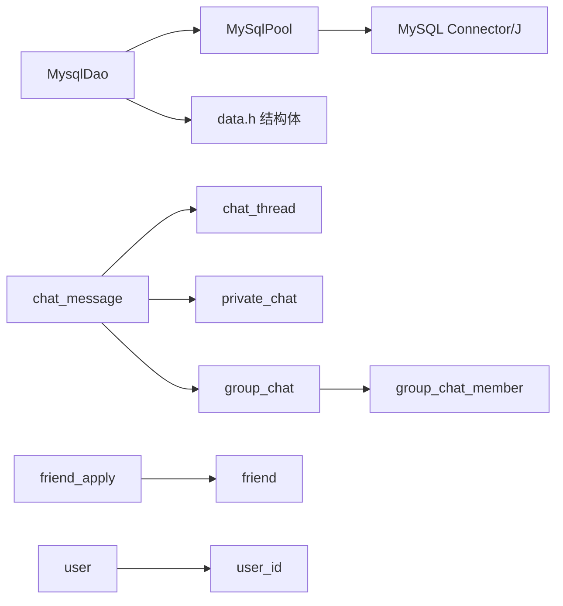

# 数据迁移管理

<cite>
**本文引用的文件**   
- [README.md](file://README.md)
- [llfc.sql](file://sql备份/llfc.sql)
- [llfc2.sql](file://sql备份/llfc2.sql)
- [llfc3.sql](file://sql备份/llfc3.sql)
- [chat_message.sql](file://sql备份/chat_message.sql)
- [MysqlDao.h](file://server/ChatServer/include/MysqlDao.h)
- [MysqlDao.cpp](file://server/ChatServer/src/MysqlDao.cpp)
- [data.h](file://server/ChatServer/include/data.h)
- [day37-聊天信息存储方案.md](file://开发文档/day37-聊天信息存储方案.md)
</cite>

## 目录
1. [简介](#简介)
2. [项目结构](#项目结构)
3. [核心组件](#核心组件)
4. [架构总览](#架构总览)
5. [详细组件分析](#详细组件分析)
6. [依赖关系分析](#依赖关系分析)
7. [性能考量](#性能考量)
8. [故障排查指南](#故障排查指南)
9. [结论](#结论)
10. [附录](#附录)

## 简介
本文件面向LLFCChat项目的数据库版本管理与数据迁移，目标包括：
- 梳理现有SQL脚本的版本演进过程（表结构变更、字段新增、索引优化、兼容性处理）
- 制定迁移脚本编写规范与回滚策略
- 给出数据备份恢复方案与迁移测试流程
- 明确生产环境部署时的注意事项与故障处理

本项目基于C++后端服务（ChatServer/GateServer/ResourceServer/StatusServer），使用MySQL作为持久化存储，并通过JDBC连接池访问数据库。聊天消息、会话、好友关系等核心数据均落库，且具备分页拉取、增量同步能力。

## 项目结构
与数据迁移相关的核心位置：
- SQL备份目录：存放各阶段数据库导出脚本，体现版本演进
- 服务端DAO层：封装数据库访问逻辑，包含连接池、事务、并发控制等
- 数据结构定义：用于映射数据库表结构与业务对象
- 开发文档：阐述聊天信息存储方案与查询设计

图表来源
- [llfc2.sql](file://sql备份/llfc2.sql)
- [llfc3.sql](file://sql备份/llfc3.sql)
- [llfc.sql](file://sql备份/llfc.sql)
- [chat_message.sql](file://sql备份/chat_message.sql)
- [MysqlDao.h](file://server/ChatServer/include/MysqlDao.h)
- [MysqlDao.cpp](file://server/ChatServer/src/MysqlDao.cpp)
- [data.h](file://server/ChatServer/include/data.h)
- [day37-聊天信息存储方案.md](file://开发文档/day37-聊天信息存储方案.md)

章节来源
- [README.md](file://README.md)

## 核心组件
- 数据库连接池与连接健康检查：MySqlPool负责连接复用、空闲检测、自动重连
- DAO层方法：注册、登录校验、好友申请与认证、好友建立、聊天线程加载、消息分页加载等
- 数据结构映射：UserInfo、ApplyInfo、ChatThreadInfo、ChatMessage、PageResult等
- SQL脚本版本：llfc2.sql → llfc3.sql → llfc.sql，逐步完善群聊、成员、消息类型等

章节来源
- [MysqlDao.h](file://server/ChatServer/include/MysqlDao.h)
- [MysqlDao.cpp](file://server/ChatServer/src/MysqlDao.cpp)
- [data.h](file://server/ChatServer/include/data.h)

## 架构总览
下图展示从客户端到数据库的调用链路与关键数据表之间的关系，以及迁移过程中涉及的表结构变化点。

图表来源
- [MysqlDao.cpp](file://server/ChatServer/src/MysqlDao.cpp)
- [MysqlDao.h](file://server/ChatServer/include/MysqlDao.h)

## 详细组件分析

### 数据库版本演进与差异对比
通过对三版SQL脚本的分析，可得出以下演进路径与差异：

- chat_message表
  - llfc2.sql / llfc3.sql：未包含msg_type字段
  - llfc.sql：新增msg_type字段（文本/图片/视频/文件），支持多媒体消息分类
  - 索引保持一致：idx_thread_created、idx_thread_message

- chat_thread表
  - 三版一致：type枚举private/group，created_at时间戳

- friend与friend_apply表
  - 三版结构一致；数据量随版本递增

- group_chat与group_chat_member表
  - llfc2.sql / llfc3.sql：存在但无或仅有空数据
  - llfc.sql：填充了多个群聊及成员记录，体现群聊功能落地

- private_chat表
  - 三版结构一致；llfc.sql中数据更丰富

- user与user_id表
  - 三版结构一致；自增ID与唯一约束保持不变

- 存储过程reg_user与reg_user_procedure
  - 三版均包含，保证用户注册原子性与幂等性

章节来源
- [llfc2.sql](file://sql备份/llfc2.sql)
- [llfc3.sql](file://sql备份/llfc3.sql)
- [llfc.sql](file://sql备份/llfc.sql)
- [chat_message.sql](file://sql备份/chat_message.sql)

### 聊天消息表结构与索引设计
- 主键message_id：全局自增，便于增量同步与去重
- 复合索引：
  - idx_thread_created：按会话+时间排序，适合分页与时间范围查询
  - idx_thread_message：按会话+消息ID排序，适合since_id增量拉取
- 新增msg_type：区分消息类型，为后续多媒体传输提供基础

章节来源
- [chat_message.sql](file://sql备份/chat_message.sql)
- [day37-聊天信息存储方案.md](file://开发文档/day37-聊天信息存储方案.md)

### 会话与群聊模型
- chat_thread：统一会话入口，type区分私聊/群聊
- private_chat：私聊双方用户ID与thread_id关联，唯一约束避免重复会话
- group_chat：群聊元数据（名称、创建时间）
- group_chat_member：成员角色、加入时间、禁言状态

章节来源
- [llfc.sql](file://sql备份/llfc.sql)
- [day37-聊天信息存储方案.md](file://开发文档/day37-聊天信息存储方案.md)

### 连接池与事务控制
- MySqlPool：
  - 初始化时创建固定数量连接，设置schema
  - 后台线程定期执行SELECT 1健康检查，超过阈值则重建连接
  - 失败计数驱动重连，确保连接可用性
- 事务：
  - AddFriend流程开启事务，锁定并读取申请记录，更新状态，插入双向好友关系，创建会话与初始消息，最后提交
  - 异常捕获后回滚，防止部分成功导致的数据不一致

章节来源
- [MysqlDao.h](file://server/ChatServer/include/MysqlDao.h)
- [MysqlDao.cpp](file://server/ChatServer/src/MysqlDao.cpp)

### 分页与增量拉取
- GetUserThreads：
  - 使用CTE合并私聊与群聊，LIMIT N+1判断是否还有更多数据
  - 返回loadMore与nextLastId，客户端据此继续拉取
- LoadChatMsg：
  - 基于thread_id与lastId进行增量拉取，提升大聊天记录场景下的性能

章节来源
- [MysqlDao.cpp](file://server/ChatServer/src/MysqlDao.cpp)
- [day37-聊天信息存储方案.md](file://开发文档/day37-聊天信息存储方案.md)

### 类图（DAO与数据结构）

图表来源
- [MysqlDao.h](file://server/ChatServer/include/MysqlDao.h)
- [data.h](file://server/ChatServer/include/data.h)

## 依赖关系分析
- 代码层面：
  - MysqlDao依赖MySqlPool进行连接管理
  - MysqlDao通过JDBC接口访问MySQL
  - data.h中的结构体用于承载查询结果
- 数据层面：
  - chat_message依赖chat_thread、private_chat、group_chat、group_chat_member
  - friend_apply与friend共同维护好友关系生命周期
  - user与user_id维护用户标识与自增序列

图表来源
- [MysqlDao.cpp](file://server/ChatServer/src/MysqlDao.cpp)
- [MysqlDao.h](file://server/ChatServer/include/MysqlDao.h)
- [data.h](file://server/ChatServer/include/data.h)
- [llfc.sql](file://sql备份/llfc.sql)

## 性能考量
- 索引设计：
  - 会话+时间、会话+消息ID双索引，支撑分页与增量拉取
  - 用户维度索引加速好友列表与申请列表查询
- 连接池：
  - 定时健康检查与自动重连，降低长连接失效影响
- 事务与锁：
  - 好友认证采用FOR UPDATE锁定申请记录，避免并发冲突
  - 插入好友关系按uid大小顺序，减少死锁概率
- 分页策略：
  - LIMIT N+1判断是否还有下一页，避免OFFSET在大偏移量时的性能问题

章节来源
- [MysqlDao.cpp](file://server/ChatServer/src/MysqlDao.cpp)
- [day37-聊天信息存储方案.md](file://开发文档/day37-聊天信息存储方案.md)

## 故障排查指南
- 连接异常：
  - 观察MySqlPool日志，确认健康检查与重连是否生效
  - 检查MySQL服务状态与网络连通性
- 事务失败：
  - 查看AddFriend流程的异常捕获与回滚日志
  - 关注死锁错误码（如1213），必要时增加重试机制
- 数据不一致：
  - 核对friend_apply状态与friend双向记录是否一致
  - 验证chat_thread与private_chat/group_chat对应关系

章节来源
- [MysqlDao.cpp](file://server/ChatServer/src/MysqlDao.cpp)

## 结论
LLFCChat的数据库版本演进清晰，从基础聊天到群聊与多媒体支持逐步完善。当前迁移策略以全量脚本为主，建议引入版本化迁移工具与增量脚本，以提升可维护性与安全性。同时，应强化备份恢复与测试流程，确保生产环境稳定。

## 附录

### 迁移脚本编写规范
- 命名约定：
  - 增量脚本：V<版本号>__<描述>.sql（如V001__add_msg_type.sql）
  - 回滚脚本：R<版本号>__<描述>.sql
- 内容要求：
  - 每个脚本只完成一个明确的变更任务
  - 包含前置检查（如字段是否存在）、DDL/DML语句、后置验证
  - 使用事务包裹多步操作，失败自动回滚
- 兼容性：
  - 新增字段设置默认值，避免破坏旧查询
  - 对历史数据转换提供幂等脚本，支持重复执行

### 回滚策略
- 每次迁移前生成快照备份
- 回滚脚本需严格对应正向脚本，顺序执行
- 回滚后进行数据一致性校验（行数、关键字段）

### 数据备份恢复方案
- 备份：
  - 全量备份：mysqldump导出完整库结构与数据
  - 增量备份：基于binlog的增量归档
- 恢复：
  - 先恢复结构，再导入数据
  - 恢复后执行完整性校验脚本

### 迁移测试流程
- 环境准备：
  - 搭建与生产一致的测试数据库
  - 导入最新全量备份
- 执行步骤：
  - 依次执行迁移脚本，记录每一步输出与耗时
  - 运行数据校验脚本，比对行数与关键字段
- 回归测试：
  - 覆盖核心业务流程（注册、登录、好友、聊天）
  - 压测高并发场景，观察锁与死锁情况

### 生产环境注意事项
- 停机窗口：
  - 尽量在低峰期执行，提前通知相关方
  - 准备快速回滚预案
- 监控告警：
  - 迁移期间开启详细日志与监控
  - 设置关键指标阈值（连接数、慢查询、错误率）
- 灰度发布：
  - 先小流量验证，再逐步扩大范围
  - 观察用户反馈与系统稳定性