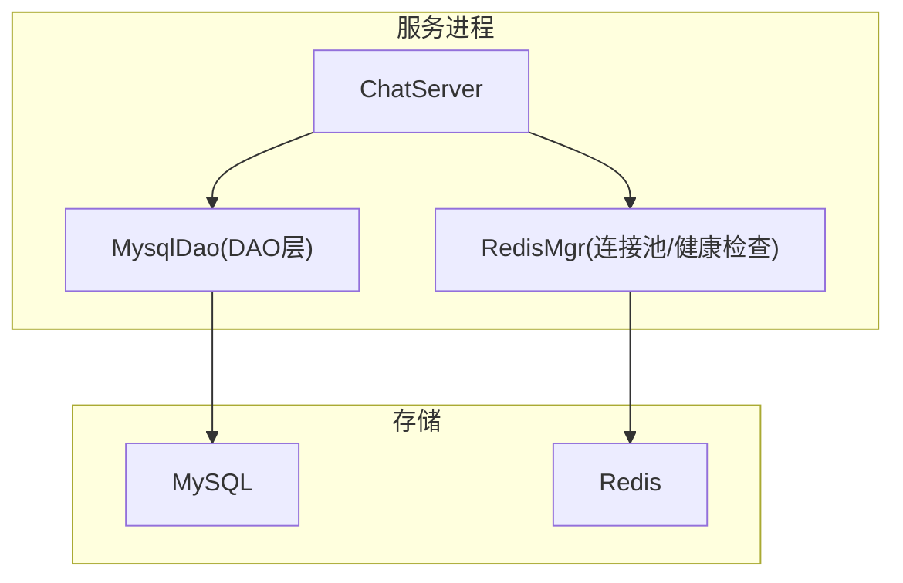
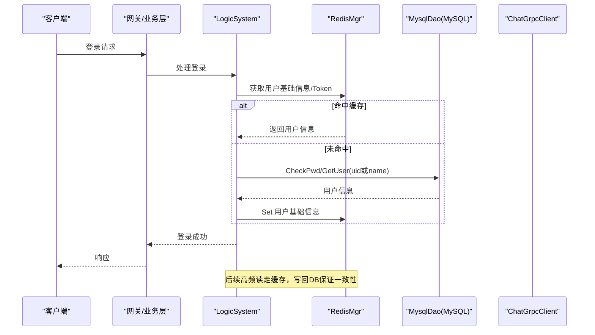
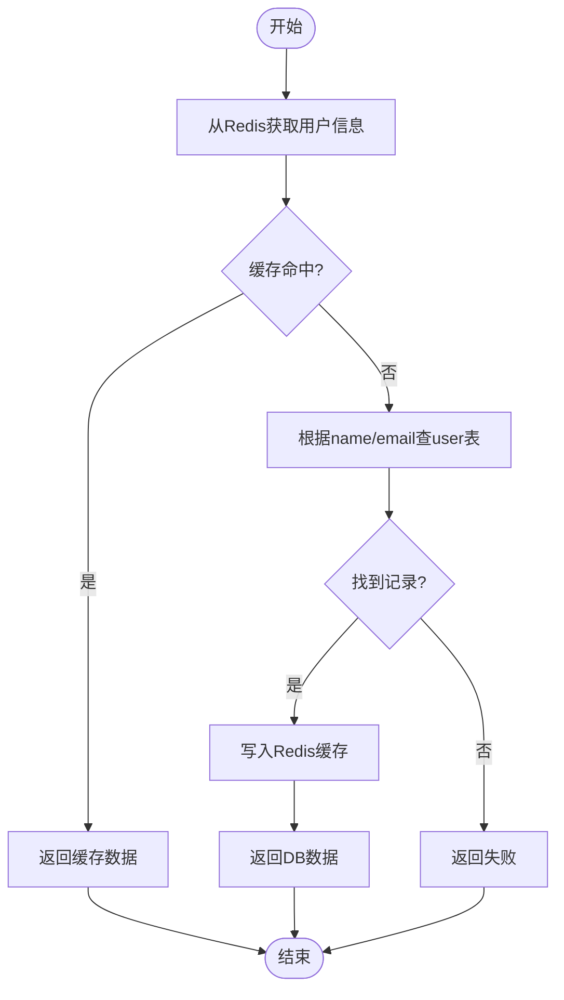
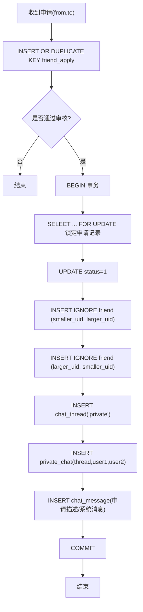
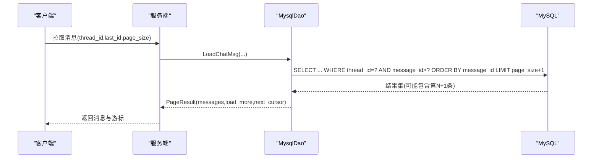
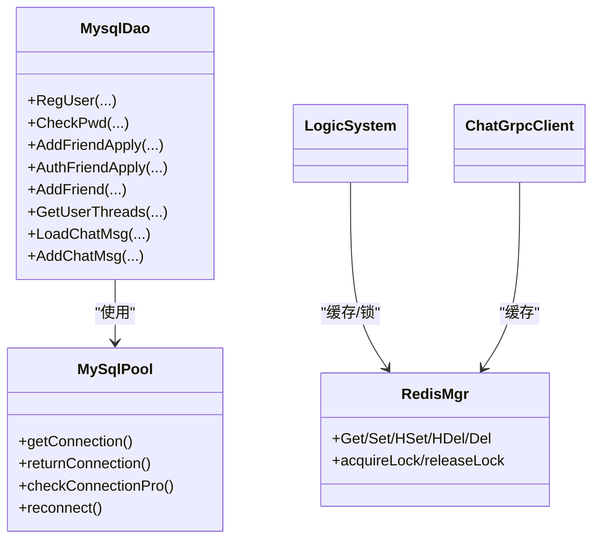

# 查询优化技术

<cite>
**本文引用的文件**   
- [MysqlDao.h](file://server/ChatServer/include/MysqlDao.h)
- [MysqlDao.cpp](file://server/ChatServer/src/MysqlDao.cpp)
- [data.h](file://server/ChatServer/include/data.h)
- [RedisMgr.h](file://server/ChatServer/include/RedisMgr.h)
- [chat_message.sql](file://sql备份/chat_message.sql)
- [llfc.sql](file://sql备份/llfc.sql)
- [chatserver1.ini](file://server/ChatServer/config/chatserver1.ini)
- [LogicSystem.cpp](file://server/ChatServer/src/LogicSystem.cpp)
- [ChatGrpcClient.cpp](file://server/ChatServer/src/ChatGrpcClient.cpp)
</cite>

## 目录
1. [引言](#引言)
2. [项目结构](#项目结构)
3. [核心组件](#核心组件)
4. [架构总览](#架构总览)
5. [详细组件分析](#详细组件分析)
6. [依赖关系分析](#依赖关系分析)
7. [性能考量与优化策略](#性能考量与优化策略)
8. [故障排查指南](#故障排查指南)
9. [结论](#结论)
10. [附录](#附录)

## 引言
本文件围绕 LLFCChat 的数据库查询优化展开，聚焦以下核心业务场景：用户登录验证、好友关系查询、聊天消息检索、群成员管理。文档从 SQL 模式、索引设计、分页与游标、连接池与事务、缓存与读写分离、监控与调优等方面给出系统化方案，并结合代码实现进行说明，帮助读者快速定位瓶颈并落地优化。

## 项目结构
- 数据层
  - MySQL 表结构与索引定义见 sql 备份文件；消息表 chat_message 具备按会话与时间/主键的复合索引，利于高效分页与排序。
- 服务层
  - ChatServer 的 MysqlDao 封装了所有数据库访问逻辑，包括注册、认证、好友申请与建立、聊天线程与消息的分页加载等。
  - RedisMgr 提供连接池、健康检查、自动重连与分布式锁能力，用于缓存用户基础信息与鉴权令牌。
- 配置
  - chatserver1.ini 定义了 MySQL、Redis、RPC 等关键参数，便于环境隔离与多实例部署。

图表来源
- [MysqlDao.h](file://server/ChatServer/include/MysqlDao.h)
- [MysqlDao.cpp](file://server/ChatServer/src/MysqlDao.cpp)
- [RedisMgr.h](file://server/ChatServer/include/RedisMgr.h)
- [chatserver1.ini](file://server/ChatServer/config/chatserver1.ini)

章节来源
- [chat_message.sql](file://sql备份/chat_message.sql)
- [llfc.sql](file://sql备份/llfc.sql)
- [chatserver1.ini](file://server/ChatServer/config/chatserver1.ini)

## 核心组件
- 连接池与连接健康
  - MySqlPool 维护固定大小连接队列，后台线程定期执行 SELECT 1 探测存活，失败则重建连接并补齐池容量。
- DAO 层
  - MysqlDao 提供注册、校验、好友申请/通过、创建私聊会话、聊天消息分页加载与批量写入等接口。
- 缓存与分布式锁
  - RedisMgr 提供连接池、PING 保活、自动重连、KV/HASH/LIST 操作以及基于 SET NX EX 的分布式锁。

章节来源
- [MysqlDao.h](file://server/ChatServer/include/MysqlDao.h)
- [MysqlDao.cpp](file://server/ChatServer/src/MysqlDao.cpp)
- [RedisMgr.h](file://server/ChatServer/include/RedisMgr.h)

## 架构总览
下图展示了“登录-缓存-数据库”的典型调用链，以及聊天消息分页读取的关键路径。

图表来源
- [LogicSystem.cpp](file://server/ChatServer/src/LogicSystem.cpp)
- [ChatGrpcClient.cpp](file://server/ChatServer/src/ChatGrpcClient.cpp)
- [RedisMgr.h](file://server/ChatServer/include/RedisMgr.h)
- [MysqlDao.cpp](file://server/ChatServer/src/MysqlDao.cpp)

## 详细组件分析

### 用户登录验证（CheckPwd）
- 查询模式
  - 使用用户名或邮箱精确匹配，取密码与用户基本信息。
- 索引建议
  - user.name/email 已建唯一索引，确保 O(logN) 查找。
- 缓存策略
  - 首次成功后将用户基础信息序列化存入 Redis，后续登录直接命中缓存，降低 DB 压力。
- 事务与一致性
  - 登录为只读路径，无需事务；写路径（如改密）需配合事务与缓存失效。

章节来源
- [MysqlDao.cpp](file://server/ChatServer/src/MysqlDao.cpp)
- [LogicSystem.cpp](file://server/ChatServer/src/LogicSystem.cpp)
- [llfc.sql](file://sql备份/llfc.sql)

### 好友关系查询与申请（friend/friend_apply）
- 查询模式
  - 好友列表：按 self_id 筛选 friend 表，再关联 user 表获取详情。
  - 申请列表：按 to_uid 过滤 friend_apply，JOIN user 获取申请人信息，支持 id > begin 的分页。
- 索引建议
  - friend.self_id + friend_id 唯一索引，避免重复且加速双向关系构建。
  - friend_apply.from_uid + to_uid 唯一索引，防止重复申请。
  - friend_apply.id 自增主键，适合基于 id 的增量分页。
- 并发与死锁规避
  - 通过 FOR UPDATE 锁定申请记录，统一插入顺序（较小 uid 先插），避免双向插入导致的死锁。

章节来源
- [MysqlDao.cpp](file://server/ChatServer/src/MysqlDao.cpp)
- [llfc.sql](file://sql备份/llfc.sql)

### 聊天消息检索（chat_message 分页）
- 查询模式
  - 基于 thread_id 和 message_id 游标的分页：WHERE thread_id=? AND message_id>? ORDER BY message_id ASC LIMIT N+1。
  - 多取一条判断 load_more，并以最后一条 message_id 作为 next_cursor。
- 索引建议
  - idx_thread_message(thread_id, message_id) 保障按会话与主键有序扫描，避免全表扫描。
  - idx_thread_created(thread_id, created_at) 可用于按时间维度的历史回溯或统计。
- 批量写入
  - AddChatMsg(vector) 关闭自动提交，逐条 INSERT 后 LAST_INSERT_ID() 回填 ID，最后统一 COMMIT，提升吞吐。

图表来源
- [MysqlDao.cpp](file://server/ChatServer/src/MysqlDao.cpp)
- [chat_message.sql](file://sql备份/chat_message.sql)

章节来源
- [MysqlDao.cpp](file://server/ChatServer/src/MysqlDao.cpp)
- [chat_message.sql](file://sql备份/chat_message.sql)

### 聊天线程列表（私聊/群聊合并分页）
- 查询模式
  - 使用 CTE + UNION ALL 合并 private_chat 与 group_chat_member 两个来源，按 thread_id 排序，LIMIT pageSize+1 判断是否有下一页。
- 索引建议
  - private_chat.user1_id/user2_id + thread_id 复合索引，加速按用户维度聚合。
  - group_chat_member.user_id 索引，加速群成员维度聚合。
- 输出字段
  - 返回 thread_id、type、user1_id、user2_id，供前端渲染会话列表。

章节来源
- [MysqlDao.cpp](file://server/ChatServer/src/MysqlDao.cpp)
- [llfc.sql](file://sql备份/llfc.sql)

### 群成员管理（group_chat / group_chat_member）
- 模型要点
  - group_chat.thread_id 为主键，group_chat_member 以 (thread_id, user_id) 联合主键约束成员唯一性。
  - role 区分普通成员/管理员/创建者，muted_until 支持禁言到期。
- 常用查询
  - 按 thread_id 获取成员列表；按 user_id 获取所属群集合。
- 索引建议
  - 已有 idx_user_threads(user_id)，满足“我的群”查询。

章节来源
- [llfc.sql](file://sql备份/llfc.sql)

## 依赖关系分析
- MysqlDao 依赖 MySqlPool 获取连接，内部使用 Prepared Statement 与事务控制。
- RedisMgr 独立于 DAO，负责缓存与分布式锁，被 LogicSystem/ChatGrpcClient 等上层模块调用。
- 配置文件集中管理 MySQL/Redis/RPC 地址端口，便于多实例部署。

图表来源
- [MysqlDao.h](file://server/ChatServer/include/MysqlDao.h)
- [MysqlDao.cpp](file://server/ChatServer/src/MysqlDao.cpp)
- [RedisMgr.h](file://server/ChatServer/include/RedisMgr.h)

章节来源
- [MysqlDao.h](file://server/ChatServer/include/MysqlDao.h)
- [RedisMgr.h](file://server/ChatServer/include/RedisMgr.h)
- [chatserver1.ini](file://server/ChatServer/config/chatserver1.ini)

## 性能考量与优化策略

### 连接池配置
- 连接数
  - 默认池大小为 5，可根据 QPS、CPU 核数与 MySQL max_connections 调整。高并发下适当增大，但需关注上下文切换与锁竞争。
- 健康检查
  - 每 60s 轮询一次，对空闲超时的连接执行 SELECT 1 探测，失败则重建连接并补齐池容量。
- 超时与重试
  - 建议在驱动层设置 connect_timeout/read_timeout/write_timeout，并在 DAO 层对偶发异常做有限次重试。

章节来源
- [MysqlDao.cpp](file://server/ChatServer/src/MysqlDao.cpp)
- [chatserver1.ini](file://server/ChatServer/config/chatserver1.ini)

### 事务管理策略
- 短事务优先
  - 将相关写操作集中在最小事务内，减少锁持有时间。
- 死锁规避
  - 统一资源加锁顺序（如 always 小uid先插），必要时使用 FOR UPDATE 明确锁定范围。
- 幂等与补偿
  - 对关键写操作增加幂等键（如 unique_id），失败可安全重试。

章节来源
- [MysqlDao.cpp](file://server/ChatServer/src/MysqlDao.cpp)

### 分页与游标
- 游标分页
  - 使用 lastId/message_id 作为游标，避免 OFFSET 带来的深翻页性能问题。
- 多源合并
  - 私聊/群聊合并查询采用 CTE + UNION ALL，限制排序列与返回列，减少网络传输。

章节来源
- [MysqlDao.cpp](file://server/ChatServer/src/MysqlDao.cpp)

### 缓存策略
- 热点数据缓存
  - 用户基础信息、登录 Token、在线状态等放入 Redis，读多写少场景显著降延迟。
- 一致性
  - 写路径更新 DB 后同步更新/失效缓存；读路径优先读缓存，缺失时回源 DB 并回填。
- 分布式锁
  - 基于 SET NX EX 实现细粒度锁，保护申请/通过等临界区。

章节来源
- [RedisMgr.h](file://server/ChatServer/include/RedisMgr.h)
- [LogicSystem.cpp](file://server/ChatServer/src/LogicSystem.cpp)
- [ChatGrpcClient.cpp](file://server/ChatServer/src/ChatGrpcClient.cpp)

### 读写分离方案
- 读多写少
  - 将查询路由到只读副本，写操作走主库；结合连接池标签或中间件实现自动分流。
- 数据一致性
  - 强一致场景（如好友建立）必须走主库；弱一致场景（如会话列表）可容忍短暂不一致。

[本节为通用策略说明，不直接引用具体文件]

### 索引与执行计划
- 关键索引
  - chat_message: (thread_id, message_id)、(thread_id, created_at)
  - private_chat: (user1_id, user2_id) 唯一、(user1_id, thread_id)、(user2_id, thread_id)
  - group_chat_member: (thread_id, user_id) 主键、(user_id) 索引
  - friend: (self_id, friend_id) 唯一
  - friend_apply: (from_uid, to_uid) 唯一
- 执行计划建议
  - 使用 EXPLAIN 验证索引命中与扫描行数，避免 filesort/temporary。
  - 对大表追加条件过滤，尽量走覆盖索引。

章节来源
- [chat_message.sql](file://sql备份/chat_message.sql)
- [llfc.sql](file://sql备份/llfc.sql)

## 故障排查指南
- 连接池耗尽
  - 现象：getConnection 阻塞或返回空指针；日志出现 pool empty。
  - 排查：检查长事务、未释放连接、连接泄漏；适当增大池大小。
- 连接频繁断开
  - 现象：SELECT 1 失败、Reconnect failed。
  - 排查：网络抖动、MySQL 重启、防火墙策略；确认 keepalive 与超时配置。
- 死锁与锁等待
  - 现象：错误码 1213；日志提示 Deadlock detected。
  - 排查：统一加锁顺序、缩短事务、拆分大事务；必要时引入重试。
- 缓存穿透/雪崩
  - 现象：大量请求直达 DB；Redis 大面积过期导致抖动。
  - 排查：布隆过滤器/空值缓存；热点 key 随机过期；限流降级。
- 慢查询
  - 现象：QPS 下降、CPU 升高。
  - 排查：开启慢查询日志，EXPLAIN 分析，补充索引或改写 SQL。

章节来源
- [MysqlDao.cpp](file://server/ChatServer/src/MysqlDao.cpp)
- [RedisMgr.h](file://server/ChatServer/include/RedisMgr.h)

## 结论
通过对聊天系统的核心查询模式进行梳理，结合索引设计、分页游标、连接池与健康检查、事务与死锁规避、缓存与分布式锁等手段，可以显著提升 LLFCChat 的查询性能与稳定性。建议在生产环境中持续采集慢查询与连接池指标，结合 EXPLAIN 与压测迭代优化，逐步逼近最优性能。

## 附录
- 配置项参考
  - MySQL：Host/Port/User/Passwd/Schema
  - Redis：Host/Port/Passwd
  - RPC：各服务 Host/Port
- 数据结构参考
  - UserInfo/ChatMessage/PageResult 等结构体定义位于 data.h

章节来源
- [chatserver1.ini](file://server/ChatServer/config/chatserver1.ini)
- [data.h](file://server/ChatServer/include/data.h)