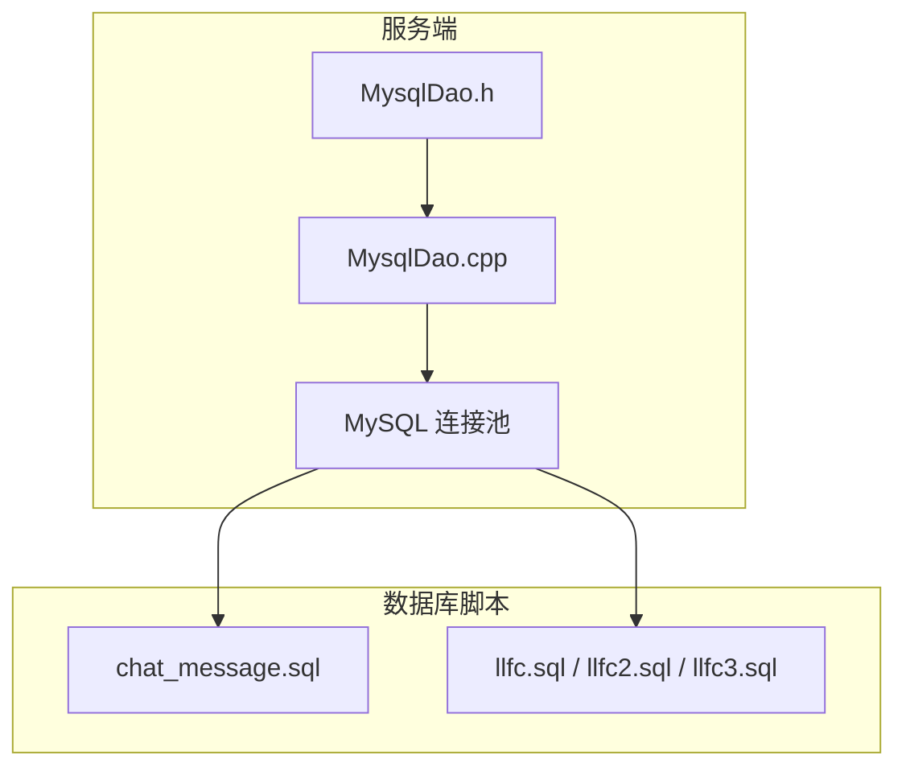
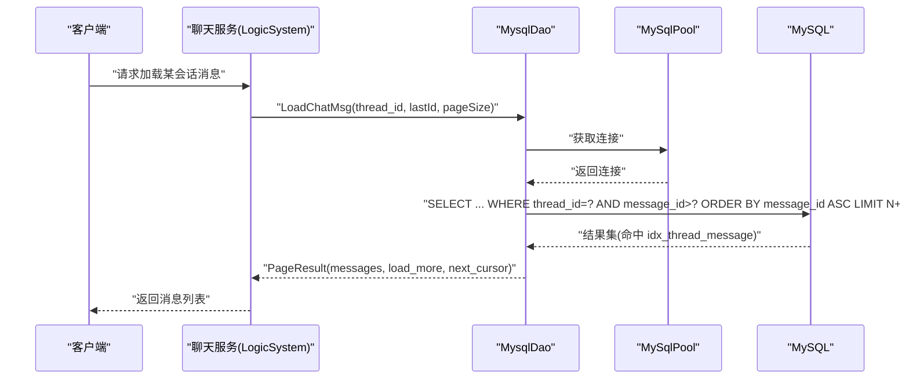
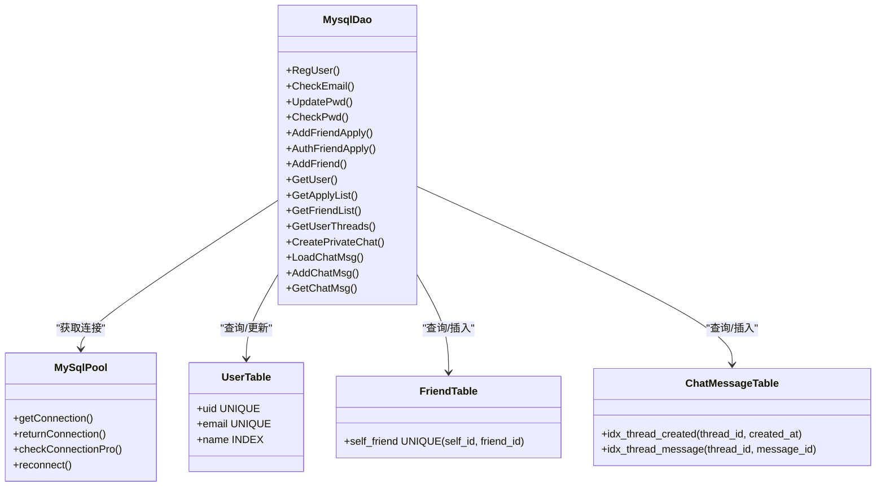

# 索引优化策略

<cite>
**本文引用的文件**   
- [chat_message.sql](file://sql备份/chat_message.sql)
- [llfc.sql](file://sql备份/llfc.sql)
- [llfc2.sql](file://sql备份/llfc2.sql)
- [llfc3.sql](file://sql备份/llfc3.sql)
- [MysqlDao.h](file://server/ChatServer/include/MysqlDao.h)
- [MysqlDao.cpp](file://server/ChatServer/src/MysqlDao.cpp)
- [data.h](file://server/ChatServer/include/data.h)
</cite>

## 目录
1. [引言](#引言)
2. [项目结构](#项目结构)
3. [核心组件](#核心组件)
4. [架构总览](#架构总览)
5. [详细组件分析](#详细组件分析)
6. [依赖关系分析](#依赖关系分析)
7. [性能考量与慢查询分析](#性能考量与慢查询分析)
8. [索引维护方案](#索引维护方案)
9. [分区表与分库分表的索引策略](#分区表与分库分表的索引策略)
10. [结论与建议](#结论与建议)

## 引言
本文件围绕LLFCChat的数据库索引设计与优化展开，重点分析以下方面：
- chat_message表的复合索引 idx_thread_created、idx_thread_message 的设计动机与适用场景
- user表的 uid、email 唯一索引的选择依据与使用方式
- friend表的 self_friend 联合唯一索引对好友关系一致性的保障
- 基于现有SQL查询路径的索引选择策略与性能评估
- 慢查询定位方法与索引效果评估流程
- 面向未来扩展的分区表与分库分表索引策略建议

## 项目结构
本项目包含客户端与服务端代码以及MySQL脚本。与索引相关的核心内容集中在 sql备份/*.sql 中的建表语句，以及 server/ChatServer 中 MysqlDao.* 对索引的使用情况。

图表来源
- [MysqlDao.h:18-270](file://server/ChatServer/include/MysqlDao.h#L18-L270)
- [MysqlDao.cpp:871-936](file://server/ChatServer/src/MysqlDao.cpp#L871-L936)
- [chat_message.sql:24-36](file://sql备份/chat_message.sql#L24-L36)
- [llfc.sql:24-37](file://sql备份/llfc.sql#L24-L37)

章节来源
- [MysqlDao.h:18-270](file://server/ChatServer/include/MysqlDao.h#L18-L270)
- [MysqlDao.cpp:871-936](file://server/ChatServer/src/MysqlDao.cpp#L871-L936)
- [chat_message.sql:24-36](file://sql备份/chat_message.sql#L24-L36)
- [llfc.sql:24-37](file://sql备份/llfc.sql#L24-L37)

## 核心组件
- chat_message：聊天消息主表，包含 message_id、thread_id、sender_id、recv_id、content、created_at、updated_at、status、msg_type 等字段，并定义两个复合索引以支撑按会话分页加载消息。
- user：用户信息表，uid、email 为唯一索引，name 为普通索引，用于登录校验、用户信息查询。
- friend：好友关系表，self_friend(self_id, friend_id) 为唯一索引，保证双向好友关系的唯一性与一致性。
- private_chat/group_chat：会话元数据表，配合 chat_message 完成私聊/群聊的消息归属。
- MysqlDao：封装所有数据库访问逻辑，包括注册、好友申请、创建会话、加载消息等，是索引使用的直接入口。

章节来源
- [chat_message.sql:24-36](file://sql备份/chat_message.sql#L24-L36)
- [llfc.sql:467-481](file://sql备份/llfc.sql#L467-L481)
- [llfc.sql:180-187](file://sql备份/llfc.sql#L180-L187)
- [MysqlDao.h:236-270](file://server/ChatServer/include/MysqlDao.h#L236-L270)

## 架构总览
下图展示从业务到数据库的关键调用链，突出索引参与的核心查询路径（如按 thread_id + message_id 分页加载消息）。

图表来源
- [MysqlDao.cpp:871-936](file://server/ChatServer/src/MysqlDao.cpp#L871-L936)
- [chat_message.sql:24-36](file://sql备份/chat_message.sql#L24-L36)

## 详细组件分析

### chat_message 表与索引设计
- 主键：message_id（自增）
- 索引：
  - idx_thread_created(thread_id, created_at)：适合“按会话按时间范围”查询或排序的场景
  - idx_thread_message(thread_id, message_id)：适合“按会话游标分页”查询（message_id > lastId）

当前 LoadChatMsg 的查询路径：
- 条件：thread_id = ? AND message_id > ?
- 排序：ORDER BY message_id ASC
- 限制：LIMIT page_size + 1

该查询能高效命中 idx_thread_message，因为：
- 等值条件在左前缀 thread_id
- 范围条件 message_id > ? 与排序 message_id ASC 一致，避免额外排序
- 覆盖性良好（若后续只取必要字段可减少回表）

潜在问题与建议：
- 如果存在按 created_at 范围查询的需求（例如“最近N分钟消息”），idx_thread_created 可被利用；但当前未使用该索引的查询路径，需确认是否遗漏此类查询。
- 若未来需要“按会话+状态过滤”，可在索引中追加 status 作为第三列，形成 (thread_id, message_id, status) 以支持覆盖查询。

章节来源
- [chat_message.sql:24-36](file://sql备份/chat_message.sql#L24-L36)
- [llfc.sql:24-37](file://sql备份/llfc.sql#L24-L37)
- [MysqlDao.cpp:871-936](file://server/ChatServer/src/MysqlDao.cpp#L871-L936)

### user 表与唯一索引
- 唯一索引：uid、email
- 普通索引：name

常用查询路径：
- 按 uid 查询用户：GetUser(uid) 使用 SELECT * FROM user WHERE uid = ?
- 按 name 查询用户：GetUser(name) 使用 SELECT * FROM user WHERE name = ?
- 注册/校验：存储过程 reg_user 检查 name/email 是否存在

索引选择策略：
- uid 唯一索引提供 O(logN) 精确查找，满足高频按ID查询
- email 唯一索引确保邮箱唯一且加速登录/校验
- name 普通索引支持模糊搜索前的精确匹配（注意：如需 LIKE '%xx%' 无法走索引）

优化建议：
- 若频繁按昵称搜索，考虑增加前缀索引或全文索引（视字符集与需求而定）
- 避免 SELECT *，按需选取字段以减少网络与内存开销

章节来源
- [llfc.sql:467-481](file://sql备份/llfc.sql#L467-L481)
- [MysqlDao.cpp:508-548](file://server/ChatServer/src/MysqlDao.cpp#L508-L548)
- [MysqlDao.cpp:550-590](file://server/ChatServer/src/MysqlDao.cpp#L550-L590)
- [llfc.sql:660-708](file://sql备份/llfc.sql#L660-L708)

### friend 表与 self_friend 联合唯一索引
- 联合唯一索引：self_friend(self_id, friend_id)
- 作用：
  - 防止重复插入同一方向的好友关系
  - 加速按 self_id 查询好友列表
  - 保证双向关系写入时的幂等性

常用查询路径：
- GetFriendList(self_id)：SELECT * FROM friend WHERE self_id = ?
- AddFriendApply/AuthFriendApply：基于 from_uid/to_uid 的唯一索引 from_to_uid

索引选择策略：
- self_friend 联合唯一索引既约束了关系唯一性，又支持按 self_id 快速检索
- 对于双向关系，通常插入两条记录（A->B 与 B->A），通过固定顺序插入避免死锁（见代码实现）

优化建议：
- 若需要按 friend_id 反向查询，可考虑添加 (friend_id, self_id) 的索引或使用覆盖索引
- 批量操作时建议使用 INSERT IGNORE 或 ON DUPLICATE KEY UPDATE 提升幂等性

章节来源
- [llfc.sql:180-187](file://sql备份/llfc.sql#L180-L187)
- [MysqlDao.cpp:635-678](file://server/ChatServer/src/MysqlDao.cpp#L635-L678)
- [MysqlDao.cpp:169-244](file://server/ChatServer/src/MysqlDao.cpp#L169-L244)

### 会话与消息关联模型
- chat_thread：会话元数据（类型、创建时间）
- private_chat：私聊会话映射（user1_id, user2_id, thread_id）
- group_chat_member：群成员关系（thread_id, user_id, role, joined_at, muted_until）
- chat_message：消息实体，通过 thread_id 关联会话

关键查询：
- GetUserThreads：CTE + UNION ALL 合并私聊与群聊会话，按 thread_id 分页
- LoadChatMsg：按 thread_id + message_id 游标分页

索引影响：
- GetUserThreads 依赖 private_chat.user1_id/user2_id 与 group_chat_member.user_id 的索引
- LoadChatMsg 依赖 idx_thread_message

章节来源
- [llfc.sql:147-175](file://sql备份/llfc.sql#L147-L175)
- [llfc.sql:406-434](file://sql备份/llfc.sql#L406-L434)
- [llfc.sql:380-404](file://sql备份/llfc.sql#L380-L404)
- [MysqlDao.cpp:681-770](file://server/ChatServer/src/MysqlDao.cpp#L681-L770)

## 依赖关系分析
- MysqlDao 依赖 MySqlPool 管理连接，所有SQL均通过 PreparedStatement 执行
- SQL 查询路径与索引强相关，错误的索引或缺失索引会导致全表扫描或临时表排序
- 事务与锁：AddFriend/CreatePrivateChat 使用事务与唯一键冲突处理，避免并发问题

图表来源
- [MysqlDao.h:236-270](file://server/ChatServer/include/MysqlDao.h#L236-L270)
- [MysqlDao.cpp:871-936](file://server/ChatServer/src/MysqlDao.cpp#L871-L936)
- [llfc.sql:467-481](file://sql备份/llfc.sql#L467-L481)
- [llfc.sql:180-187](file://sql备份/llfc.sql#L180-L187)
- [chat_message.sql:24-36](file://sql备份/chat_message.sql#L24-L36)

章节来源
- [MysqlDao.h:236-270](file://server/ChatServer/include/MysqlDao.h#L236-L270)
- [MysqlDao.cpp:871-936](file://server/ChatServer/src/MysqlDao.cpp#L871-L936)

## 性能考量与慢查询分析

### 当前索引使用评估
- LoadChatMsg：
  - 查询：WHERE thread_id = ? AND message_id > ? ORDER BY message_id ASC
  - 索引命中：idx_thread_message 完全匹配，无需额外排序
  - 复杂度：O(logN) 索引查找 + 顺序扫描，性能稳定
- GetUserThreads：
  - 查询：private_chat.user1_id/user2_id 与 group_chat_member.user_id 的过滤
  - 索引命中：依赖 unique_private_thread 与 idx_user_threads
  - 复杂度：UNION ALL 合并后排序，受 LIMIT 控制，整体可控
- GetFriendList：
  - 查询：WHERE self_id = ?
  - 索引命中：self_friend(self_id, friend_id) 的前缀匹配
  - 复杂度：O(logN) 索引查找

### 慢查询定位方法
- 开启 MySQL 慢查询日志（long_query_time=1s 或更低阈值）
- 使用 EXPLAIN/EXPLAIN ANALYZE 查看执行计划：
  - 关注 type、key、rows、Extra 字段
  - 检查是否出现 Using filesort、Using temporary、Full table scan
- 结合业务热点（如聊天加载、好友列表）进行针对性分析

### 索引效果评估指标
- QPS/TPS：观察索引变更前后吞吐变化
- 延迟分布：P95/P99 延迟是否下降
- IO 成本：磁盘读/写次数是否减少
- 锁等待：死锁/锁超时是否降低

章节来源
- [MysqlDao.cpp:871-936](file://server/ChatServer/src/MysqlDao.cpp#L871-L936)
- [MysqlDao.cpp:681-770](file://server/ChatServer/src/MysqlDao.cpp#L681-L770)
- [MysqlDao.cpp:635-678](file://server/ChatServer/src/MysqlDao.cpp#L635-L678)

## 索引维护方案
- 定期重建索引：
  - ALTER TABLE ... FORCE 或 OPTIMIZE TABLE（InnoDB 下等效于重建）
  - 建议在低峰期执行，避免影响在线服务
- 监控索引使用率：
  - INFORMATION_SCHEMA.STATISTICS 统计索引使用情况
  - 删除长期未使用的冗余索引
- 增量调整：
  - 新增查询路径时评估是否需要新索引
  - 合并相似索引，避免过度索引导致写入放大

章节来源
- [chat_message.sql:24-36](file://sql备份/chat_message.sql#L24-L36)
- [llfc.sql:467-481](file://sql备份/llfc.sql#L467-L481)
- [llfc.sql:180-187](file://sql备份/llfc.sql#L180-L187)

## 分区表与分库分表的索引策略

### 分区表（按时间）
- 适用场景：chat_message 按 created_at 按月/年分区，便于历史归档与清理
- 索引策略：
  - 局部索引：每个分区独立索引，查询时可裁剪分区
  - 全局索引：跨分区查询时使用，但维护成本高
- 建议：优先使用分区裁剪，避免全局索引带来的写入放大

### 分库分表（按会话/用户）
- 分片键选择：
  - chat_message：按 thread_id 哈希分片，保证同一会话消息在同一节点
  - user/friend：按 uid 分片，保证用户数据一致性
- 索引策略：
  - 本地索引：每个分片独立索引，查询路径清晰
  - 跨分片查询：尽量避免，或通过聚合层合并
- 注意事项：
  - 分片键变更成本高，需提前规划
  - 分布式事务与锁需谨慎设计（参考现有死锁解决方案文档）

章节来源
- [chat_message.sql:24-36](file://sql备份/chat_message.sql#L24-L36)
- [llfc.sql:467-481](file://sql备份/llfc.sql#L467-L481)
- [开发文档/day41-分布式死锁解决方案.md:580-924](file://开发文档/day41-分布式死锁解决方案.md#L580-L924)

## 结论与建议
- 现有索引设计合理，idx_thread_message 有效支撑聊天消息分页加载，uid/email 唯一索引保障用户数据一致性，self_friend 联合索引确保好友关系唯一性
- 建议补充按 created_at 范围的查询路径以充分利用 idx_thread_created
- 建立慢查询监控与索引使用率分析机制，定期优化冗余索引
- 面向未来扩展，优先考虑分区表与分库分表策略，明确分片键与索引布局