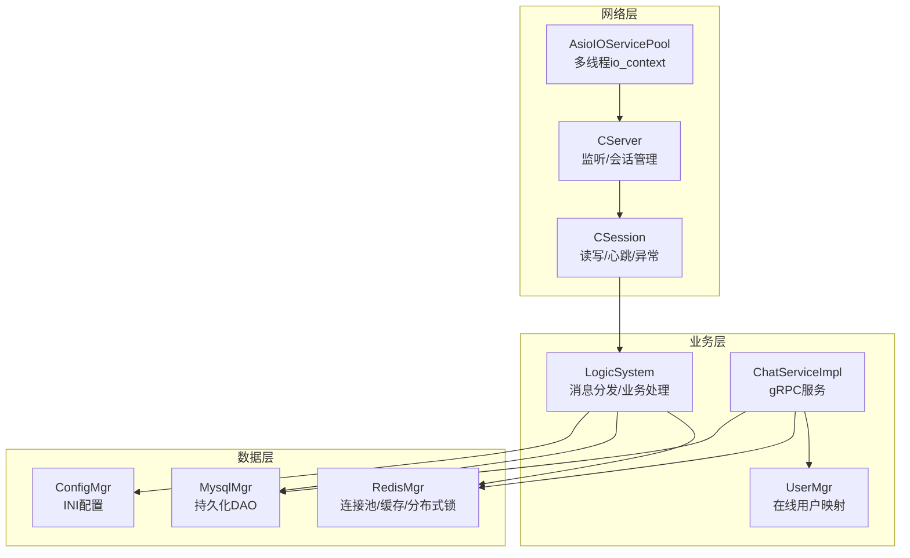
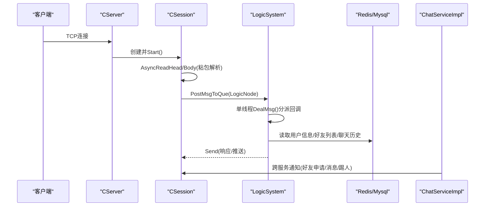
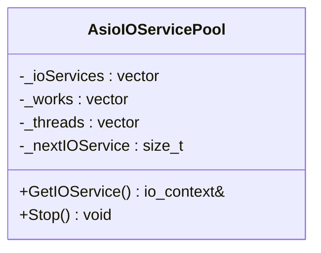
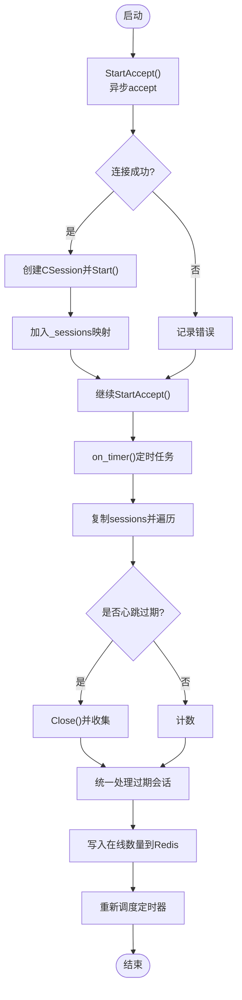
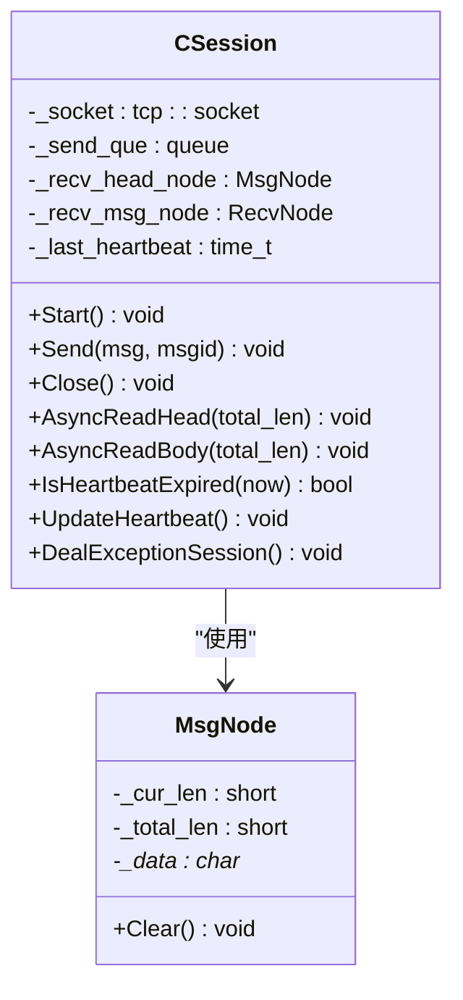
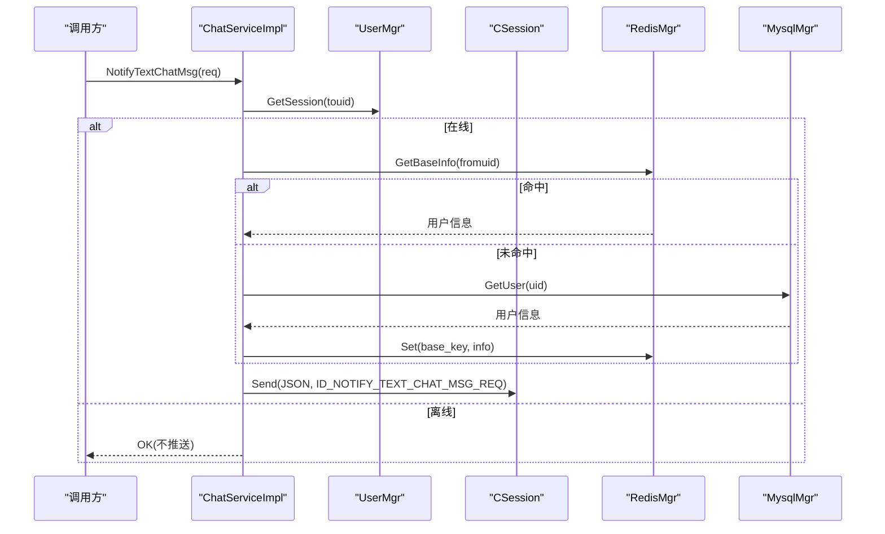
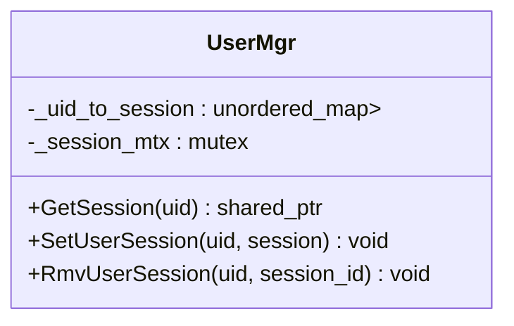
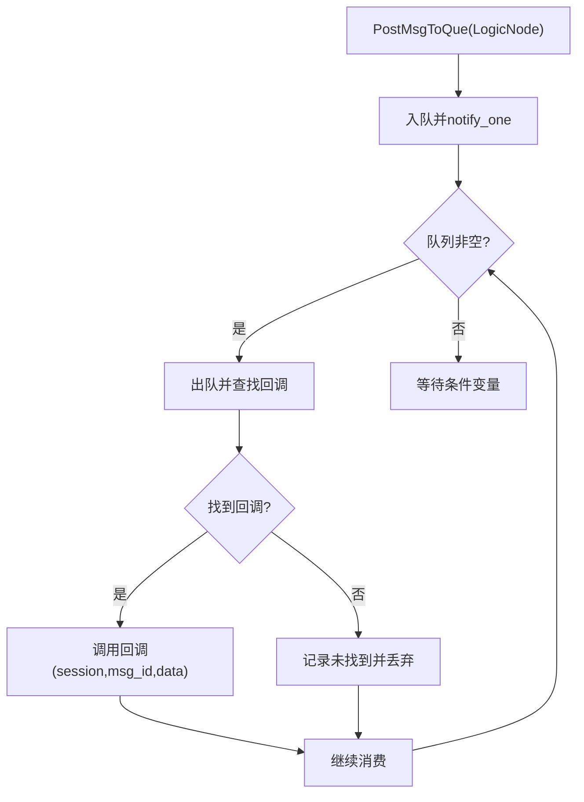
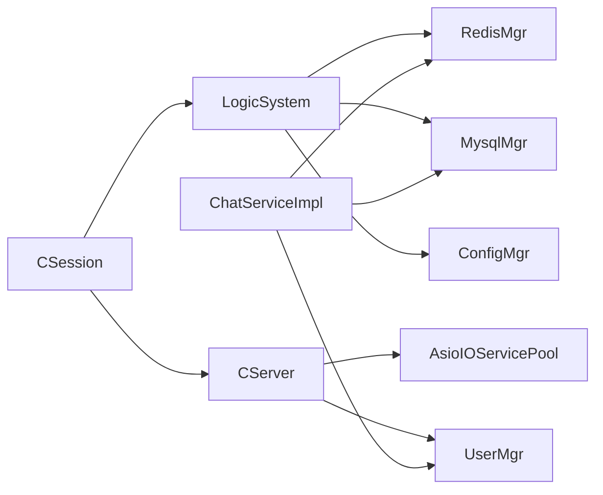

# ChatServer聊天服务

<cite>
**本文引用的文件**   
- [AsioIOServicePool.h](file://server/ChatServer/include/AsioIOServicePool.h)
- [AsioIOServicePool.cpp](file://server/ChatServer/src/AsioIOServicePool.cpp)
- [CServer.h](file://server/ChatServer/include/CServer.h)
- [CServer.cpp](file://server/ChatServer/src/CServer.cpp)
- [CSession.h](file://server/ChatServer/include/CSession.h)
- [CSession.cpp](file://server/ChatServer/src/CSession.cpp)
- [ChatServiceImpl.h](file://server/ChatServer/include/ChatServiceImpl.h)
- [ChatServiceImpl.cpp](file://server/ChatServer/src/ChatServiceImpl.cpp)
- [UserMgr.h](file://server/ChatServer/include/UserMgr.h)
- [UserMgr.cpp](file://server/ChatServer/src/UserMgr.cpp)
- [LogicSystem.h](file://server/ChatServer/include/LogicSystem.h)
- [LogicSystem.cpp](file://server/ChatServer/src/LogicSystem.cpp)
- [MsgNode.h](file://server/ChatServer/include/MsgNode.h)
- [data.h](file://server/ChatServer/include/data.h)
- [const.h](file://server/ChatServer/include/const.h)
- [ConfigMgr.h](file://server/ChatServer/include/ConfigMgr.h)
- [MysqlMgr.h](file://server/ChatServer/include/MysqlMgr.h)
- [RedisMgr.h](file://server/ChatServer/include/RedisMgr.h)
</cite>

## 目录
1. [简介](#简介)
2. [项目结构](#项目结构)
3. [核心组件](#核心组件)
4. [架构总览](#架构总览)
5. [详细组件分析](#详细组件分析)
6. [依赖关系分析](#依赖关系分析)
7. [性能考量](#性能考量)
8. [故障排查指南](#故障排查指南)
9. [结论](#结论)
10. [附录](#附录)

## 简介
本技术文档围绕ChatServer聊天核心服务，系统阐述基于Boost.Asio的高性能异步I/O模型与gRPC服务接口实现。重点覆盖：
- AsioIOServicePool线程池设计，用于多核并行处理网络事件
- CServer服务器主循环，负责TCP监听、会话管理与心跳检测
- CSession会话管理，封装读写协议、粘包处理、发送队列与异常恢复
- gRPC ChatServiceImpl接口，提供用户认证、消息路由、好友关系管理等业务
- UserMgr用户管理器，维护在线用户与Session映射
- LogicSystem逻辑系统，单线程串行化业务处理，包括登录、搜索、好友申请、文本/图片消息、群聊广播、踢人等
- 配置管理、日志记录、错误处理等横切关注点

## 项目结构
ChatServer位于server/ChatServer目录，采用分层组织：
- include：头文件定义（网络层、会话层、业务层、数据层）
- src：具体实现（Asio I/O、gRPC服务、数据库/缓存、配置与工具）
- proto：gRPC协议定义（message.proto等）
- config：运行期配置文件（chatserver1.ini等）

图表来源
- [AsioIOServicePool.h:1-28](file://server/ChatServer/include/AsioIOServicePool.h#L1-L28)
- [CServer.h:1-33](file://server/ChatServer/include/CServer.h#L1-L33)
- [CSession.h:1-86](file://server/ChatServer/include/CSession.h#L1-L86)
- [LogicSystem.h:1-61](file://server/ChatServer/include/LogicSystem.h#L1-L61)
- [UserMgr.h:1-22](file://server/ChatServer/include/UserMgr.h#L1-L22)
- [ChatServiceImpl.h:1-55](file://server/ChatServer/include/ChatServiceImpl.h#L1-L55)
- [RedisMgr.h:1-305](file://server/ChatServer/include/RedisMgr.h#L1-L305)
- [MysqlMgr.h:1-41](file://server/ChatServer/include/MysqlMgr.h#L1-L41)
- [ConfigMgr.h:1-84](file://server/ChatServer/include/ConfigMgr.h#L1-L84)

章节来源
- [AsioIOServicePool.h:1-28](file://server/ChatServer/include/AsioIOServicePool.h#L1-L28)
- [CServer.h:1-33](file://server/ChatServer/include/CServer.h#L1-L33)
- [CSession.h:1-86](file://server/ChatServer/include/CSession.h#L1-L86)
- [LogicSystem.h:1-61](file://server/ChatServer/include/LogicSystem.h#L1-L61)
- [UserMgr.h:1-22](file://server/ChatServer/include/UserMgr.h#L1-L22)
- [ChatServiceImpl.h:1-55](file://server/ChatServer/include/ChatServiceImpl.h#L1-L55)
- [RedisMgr.h:1-305](file://server/ChatServer/include/RedisMgr.h#L1-L305)
- [MysqlMgr.h:1-41](file://server/ChatServer/include/MysqlMgr.h#L1-L41)
- [ConfigMgr.h:1-84](file://server/ChatServer/include/ConfigMgr.h#L1-L84)

## 核心组件
- AsioIOServicePool：基于round-robin的多io_context线程池，每个io_context绑定一个工作线程，提升并发吞吐
- CServer：TCP监听器，维护sessions映射，定时心跳检测与过期清理
- CSession：封装socket读写、粘包解析、发送队列、心跳更新与异常处理
- LogicSystem：单线程消息队列+条件变量，按msg_id分派到对应回调处理业务
- UserMgr：uid到session的映射，支持设置、查询、删除
- ChatServiceImpl：gRPC服务实现，转发通知、消息、踢人等跨服务调用
- RedisMgr/MysqlMgr/ConfigMgr：缓存、数据库、配置等基础设施

章节来源
- [AsioIOServicePool.cpp:1-43](file://server/ChatServer/src/AsioIOServicePool.cpp#L1-L43)
- [CServer.cpp:1-133](file://server/ChatServer/src/CServer.cpp#L1-L133)
- [CSession.cpp:1-200](file://server/ChatServer/src/CSession.cpp#L1-L200)
- [LogicSystem.cpp:1-200](file://server/ChatServer/src/LogicSystem.cpp#L1-L200)
- [UserMgr.cpp:1-50](file://server/ChatServer/src/UserMgr.cpp#L1-L50)
- [ChatServiceImpl.cpp:1-200](file://server/ChatServer/src/ChatServiceImpl.cpp#L1-L200)
- [RedisMgr.h:1-305](file://server/ChatServer/include/RedisMgr.h#L1-L305)
- [MysqlMgr.h:1-41](file://server/ChatServer/include/MysqlMgr.h#L1-L41)
- [ConfigMgr.h:1-84](file://server/ChatServer/include/ConfigMgr.h#L1-L84)

## 架构总览
整体采用“网络层-业务层-数据层”三层架构。网络层使用Boost.Asio异步I/O；业务层通过LogicSystem串行化处理，避免竞态；数据层通过Redis和MySQL提供缓存与持久化；gRPC作为服务间通信通道。

图表来源
- [CServer.cpp:1-133](file://server/ChatServer/src/CServer.cpp#L1-L133)
- [CSession.cpp:1-200](file://server/ChatServer/src/CSession.cpp#L1-L200)
- [LogicSystem.cpp:1-200](file://server/ChatServer/src/LogicSystem.cpp#L1-L200)
- [ChatServiceImpl.cpp:1-200](file://server/ChatServer/src/ChatServiceImpl.cpp#L1-L200)

## 详细组件分析

### AsioIOServicePool线程池
- 设计要点
  - 初始化多个io_context，并为每个io_context创建work_guard防止run提前退出
  - 为每个io_context启动独立线程执行run()
  - GetIOService()轮询返回io_context，保证负载均衡
  - Stop()停止所有io_context并释放work，join线程
- 复杂度与特性
  - 获取io_context O(1)，线程数=硬件并发度
  - 无锁轮询计数器，简单高效

图表来源
- [AsioIOServicePool.h:1-28](file://server/ChatServer/include/AsioIOServicePool.h#L1-L28)
- [AsioIOServicePool.cpp:1-43](file://server/ChatServer/src/AsioIOServicePool.cpp#L1-L43)

章节来源
- [AsioIOServicePool.h:1-28](file://server/ChatServer/include/AsioIOServicePool.h#L1-L28)
- [AsioIOServicePool.cpp:1-43](file://server/ChatServer/src/AsioIOServicePool.cpp#L1-L43)

### CServer服务器主循环
- 功能
  - 监听端口，接受新连接，分配io_context
  - 维护sessions映射（session_id -> session）
  - 定时器每60秒扫描会话，检测心跳过期并关闭
  - 统计在线会话数量写入Redis
- 关键流程
  - StartAccept()异步accept
  - HandleAccept()启动Session并注册到sessions
  - on_timer()遍历副本map，收集过期session后统一处理，避免死锁

图表来源
- [CServer.cpp:1-133](file://server/ChatServer/src/CServer.cpp#L1-L133)

章节来源
- [CServer.h:1-33](file://server/ChatServer/include/CServer.h#L1-L33)
- [CServer.cpp:1-133](file://server/ChatServer/src/CServer.cpp#L1-L133)

### CSession会话管理
- 功能
  - 生成唯一session_id
  - 异步读取头部与正文，处理粘包与长度校验
  - 发送队列限流，顺序写出，异常时重试或关闭
  - 心跳时间戳更新与过期判断
  - 异常连接清理与资源回收
- 协议
  - 头部固定长度HEAD_TOTAL_LEN，包含msg_id与msg_len
  - 正文长度由头部决定，确保完整接收再投递LogicSystem

图表来源
- [CSession.h:1-86](file://server/ChatServer/include/CSession.h#L1-L86)
- [CSession.cpp:1-200](file://server/ChatServer/src/CSession.cpp#L1-L200)
- [MsgNode.h:1-48](file://server/ChatServer/include/MsgNode.h#L1-L48)

章节来源
- [CSession.h:1-86](file://server/ChatServer/include/CSession.h#L1-L86)
- [CSession.cpp:1-200](file://server/ChatServer/src/CSession.cpp#L1-L200)
- [MsgNode.h:1-48](file://server/ChatServer/include/MsgNode.h#L1-L48)

### ChatServiceImpl gRPC服务
- 接口
  - NotifyAddFriend：向目标用户推送好友申请
  - NotifyAuthFriend：认证好友请求，附带聊天历史
  - NotifyTextChatMsg：文本消息推送
  - NotifyKickUser：踢人通知
  - NotifyChatImgMsg：图片聊天通知
- 业务逻辑
  - 通过UserMgr查找在线session，存在则构造JSON并发送
  - 用户信息优先从Redis获取，不存在则查MySQL并回写Redis
  - 使用Defer统一设置返回码与字段

图表来源
- [ChatServiceImpl.cpp:1-200](file://server/ChatServer/src/ChatServiceImpl.cpp#L1-L200)
- [UserMgr.cpp:1-50](file://server/ChatServer/src/UserMgr.cpp#L1-L50)
- [RedisMgr.h:1-305](file://server/ChatServer/include/RedisMgr.h#L1-L305)
- [MysqlMgr.h:1-41](file://server/ChatServer/include/MysqlMgr.h#L1-L41)

章节来源
- [ChatServiceImpl.h:1-55](file://server/ChatServer/include/ChatServiceImpl.h#L1-L55)
- [ChatServiceImpl.cpp:1-200](file://server/ChatServer/src/ChatServiceImpl.cpp#L1-L200)

### UserMgr用户管理器
- 职责
  - 维护uid到session的映射
  - 提供SetUserSession、GetSession、RmvUserSession
  - 删除时校验session_id一致性，防止误删其他登录会话
- 并发安全
  - 使用mutex保护_map操作

图表来源
- [UserMgr.h:1-22](file://server/ChatServer/include/UserMgr.h#L1-L22)
- [UserMgr.cpp:1-50](file://server/ChatServer/src/UserMgr.cpp#L1-L50)

章节来源
- [UserMgr.h:1-22](file://server/ChatServer/include/UserMgr.h#L1-L22)
- [UserMgr.cpp:1-50](file://server/ChatServer/src/UserMgr.cpp#L1-L50)

### LogicSystem逻辑系统
- 设计
  - 单线程工作线程DealMsg()消费队列，避免并发竞争
  - 通过RegisterCallBacks将msg_id映射到处理函数
  - 支持登录、搜索、好友申请/认证、文本/图片消息、加载聊天线程/消息、心跳等
- 数据结构
  - _msg_que：待处理消息队列
  - _fun_callbacks：msg_id到回调函数的映射
  - 条件变量_consume唤醒消费者

图表来源
- [LogicSystem.cpp:1-200](file://server/ChatServer/src/LogicSystem.cpp#L1-L200)

章节来源
- [LogicSystem.h:1-61](file://server/ChatServer/include/LogicSystem.h#L1-L61)
- [LogicSystem.cpp:1-200](file://server/ChatServer/src/LogicSystem.cpp#L1-L200)

### 配置管理、日志与错误处理
- 配置管理
  - ConfigMgr基于INI文件，SectionInfo封装键值对，支持operator[]与GetValue
- 日志记录
  - 各模块通过cout输出关键路径与错误信息（生产环境建议替换为日志库）
- 错误处理
  - const.h定义ErrorCodes与MSG_IDS，统一错误码与消息ID
  - Defer类用于统一返回体设置与资源清理
  - CSession在读写异常时Close并触发DealExceptionSession进行清理

章节来源
- [ConfigMgr.h:1-84](file://server/ChatServer/include/ConfigMgr.h#L1-L84)
- [const.h:1-104](file://server/ChatServer/include/const.h#L1-L104)
- [CSession.cpp:1-200](file://server/ChatServer/src/CSession.cpp#L1-L200)

## 依赖关系分析
- 组件耦合
  - CServer依赖AsioIOServicePool获取io_context，依赖UserMgr管理会话
  - CSession依赖LogicSystem投递消息，依赖CServer进行会话有效性检查
  - LogicSystem依赖RedisMgr/MysqlMgr/ConfigMgr进行数据访问
  - ChatServiceImpl依赖UserMgr进行在线用户查找，依赖Redis/Mysql进行用户信息获取
- 外部依赖
  - Boost.Asio/Beast用于网络与HTTP
  - gRPC用于服务间通信
  - hiredis用于Redis交互
  - MySQL Connector用于数据库访问

图表来源
- [CServer.cpp:1-133](file://server/ChatServer/src/CServer.cpp#L1-L133)
- [CSession.cpp:1-200](file://server/ChatServer/src/CSession.cpp#L1-L200)
- [LogicSystem.cpp:1-200](file://server/ChatServer/src/LogicSystem.cpp#L1-L200)
- [ChatServiceImpl.cpp:1-200](file://server/ChatServer/src/ChatServiceImpl.cpp#L1-L200)

章节来源
- [CServer.cpp:1-133](file://server/ChatServer/src/CServer.cpp#L1-L133)
- [CSession.cpp:1-200](file://server/ChatServer/src/CSession.cpp#L1-L200)
- [LogicSystem.cpp:1-200](file://server/ChatServer/src/LogicSystem.cpp#L1-L200)
- [ChatServiceImpl.cpp:1-200](file://server/ChatServer/src/ChatServiceImpl.cpp#L1-L200)

## 性能考量
- 异步I/O
  - AsioIOServicePool多io_context并行处理，降低阻塞风险
  - CSession使用async_write与队列顺序写出，避免写放大
- 内存与队列
  - 发送队列限制MAX_SENDQUE，防止内存暴涨
  - 头部与正文分离解析，减少拷贝与碎片
- 缓存与数据库
  - Redis热数据优先，降低MySQL压力
  - 连接池与PING保活，提高稳定性
- 序列化
  - JSON字符串传输，注意体积与解析开销，必要时可引入Protobuf

[本节为通用指导，无需引用具体文件]

## 故障排查指南
- 常见问题
  - 连接断开：检查CSession的AsyncReadHead/Body错误分支与Close逻辑
  - 心跳超时：确认CSession.UpdateHeartbeat与CServer.on_timer扫描逻辑
  - 消息丢失：检查LogicSystem队列消费与回调注册
  - gRPC推送失败：确认UserMgr中是否存在目标session
- 定位方法
  - 查看各模块cout输出，定位错误码与msg_id
  - 检查Redis/Mysql连接状态与键值
  - 使用分布式锁相关接口排查并发问题

章节来源
- [CSession.cpp:1-200](file://server/ChatServer/src/CSession.cpp#L1-L200)
- [CServer.cpp:1-133](file://server/ChatServer/src/CServer.cpp#L1-L133)
- [LogicSystem.cpp:1-200](file://server/ChatServer/src/LogicSystem.cpp#L1-L200)
- [ChatServiceImpl.cpp:1-200](file://server/ChatServer/src/ChatServiceImpl.cpp#L1-L200)

## 结论
ChatServer通过Asio异步I/O与单线程逻辑队列实现了高吞吐、低延迟的聊天核心服务。gRPC接口提供了跨服务通信能力，配合Redis与MySQL完成缓存与持久化。合理的会话管理、心跳机制与错误处理保障了系统稳定性。后续可进一步优化序列化格式与监控指标采集。

[本节为总结性内容，无需引用具体文件]

## 附录
- 协议常量与错误码参考
  - MSG_IDS：消息类型标识
  - ErrorCodes：错误码定义
  - 头部长度与最大长度限制

章节来源
- [const.h:1-104](file://server/ChatServer/include/const.h#L1-L104)
- [data.h:1-65](file://server/ChatServer/include/data.h#L1-L65)