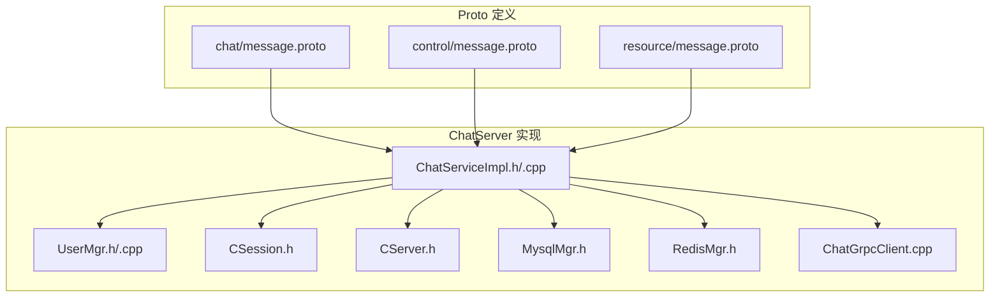
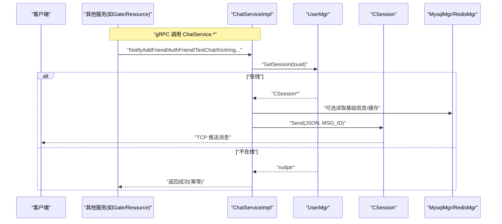
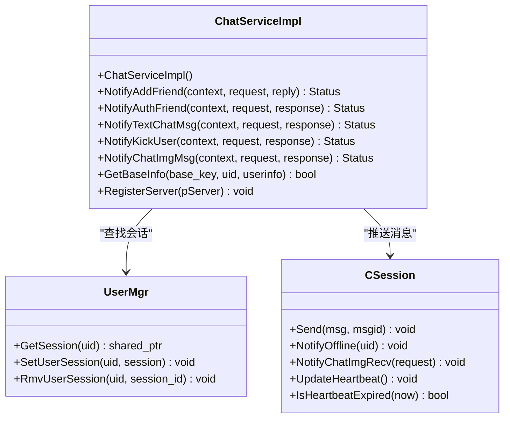
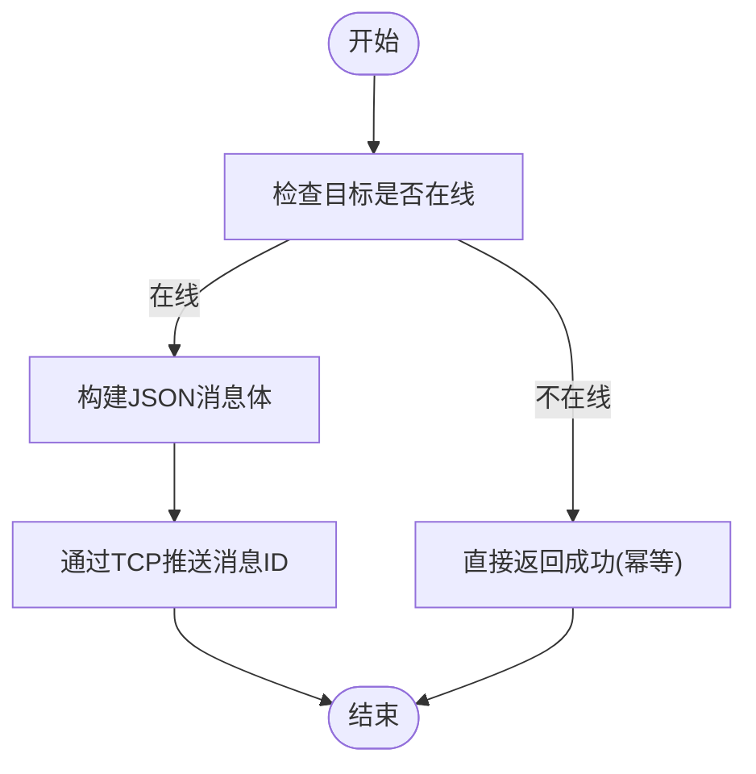
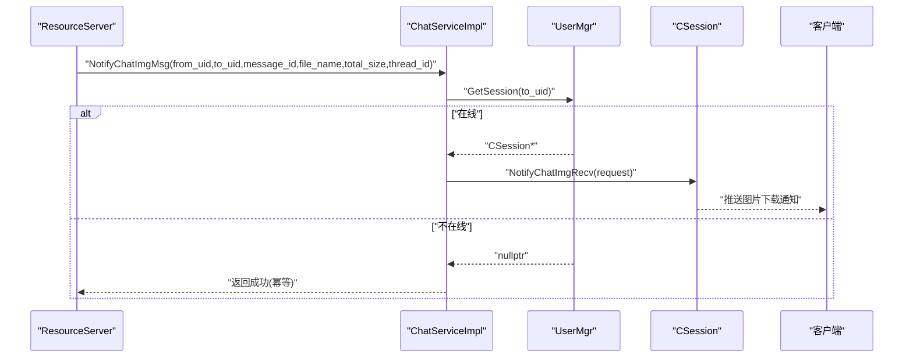
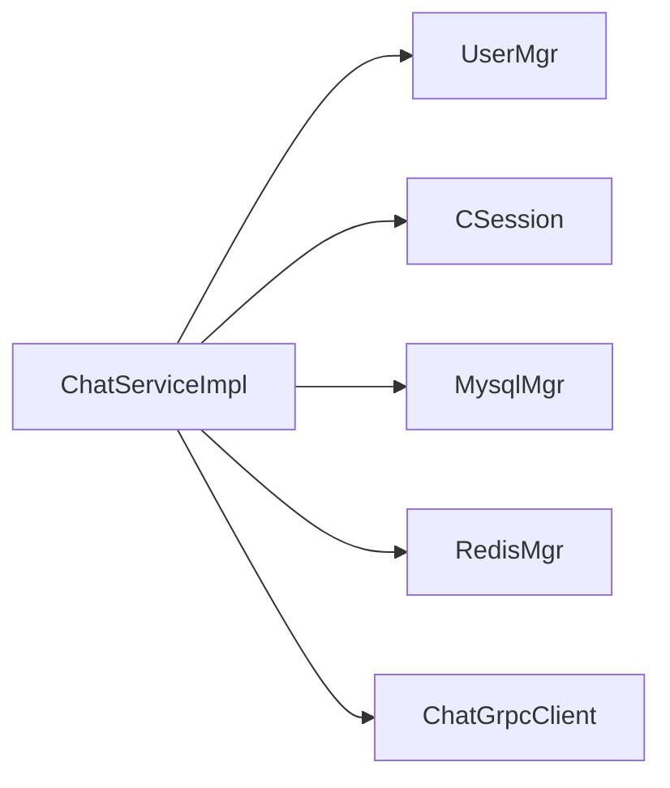

# gRPC服务接口

<cite>
**本文引用的文件**   
- [server/proto/chat/message.proto](file://server/proto/chat/message.proto)
- [server/proto/control/message.proto](file://server/proto/control/message.proto)
- [server/proto/resource/message.proto](file://server/proto/resource/message.proto)
- [server/ChatServer/include/ChatServiceImpl.h](file://server/ChatServer/include/ChatServiceImpl.h)
- [server/ChatServer/src/ChatServiceImpl.cpp](file://server/ChatServer/src/ChatServiceImpl.cpp)
- [server/ChatServer/include/UserMgr.h](file://server/ChatServer/include/UserMgr.h)
- [server/ChatServer/src/UserMgr.cpp](file://server/ChatServer/src/UserMgr.cpp)
- [server/ChatServer/include/CSession.h](file://server/ChatServer/include/CSession.h)
- [server/ChatServer/include/CServer.h](file://server/ChatServer/include/CServer.h)
- [server/ChatServer/include/data.h](file://server/ChatServer/include/data.h)
- [server/ChatServer/include/const.h](file://server/ChatServer/include/const.h)
- [server/ChatServer/include/MysqlMgr.h](file://server/ChatServer/include/MysqlMgr.h)
- [server/ChatServer/include/RedisMgr.h](file://server/ChatServer/include/RedisMgr.h)
- [server/ChatServer/src/ChatGrpcClient.cpp](file://server/ChatServer/src/ChatGrpcClient.cpp)
- [server/StatusServer/src/ChatGrpcClient.cpp](file://server/StatusServer/src/ChatGrpcClient.cpp)
</cite>

## 目录
1. [简介](#简介)
2. [项目结构](#项目结构)
3. [核心组件](#核心组件)
4. [架构总览](#架构总览)
5. [详细组件分析](#详细组件分析)
6. [依赖关系分析](#依赖关系分析)
7. [性能考量](#性能考量)
8. [故障排查指南](#故障排查指南)
9. [结论](#结论)
10. [附录](#附录)

## 简介
本技术文档聚焦于 ChatServer 的 gRPC 服务接口，围绕 ChatServiceImpl 的实现进行系统化说明。内容涵盖：
- gRPC 方法定义与实现细节（好友申请、认证、文本聊天、踢人、图片通知等）
- 用户认证相关接口（登录验证、注册处理、密码重置）在整体系统中的职责边界与调用路径
- 聊天消息相关接口（发送、接收、历史查询、已读状态同步）的数据流与协议约定
- 好友关系管理接口（申请、认证、删除）的处理流程
- 文件传输相关接口（上传下载控制、进度查询）的通知机制
- 参数校验、错误码定义、异常处理机制
- API 调用示例与客户端集成要点

## 项目结构
ChatServer 的 gRPC 服务由 proto 定义与 C++ 实现组成，关键文件分布如下：
- Proto 定义：chat/control/resource 三个命名空间下的 message.proto
- 服务实现：ChatServiceImpl.h/.cpp
- 会话与连接：CSession.h、CServer.h
- 用户会话管理：UserMgr.h/.cpp
- 数据访问：MysqlMgr.h、RedisMgr.h
- 常量与错误码：const.h、data.h
- 跨服务 gRPC 客户端：ChatGrpcClient.cpp（ChatServer 侧）、ChatGrpcClient.cpp（StatusServer 侧）

**图表来源** 
- [server/proto/chat/message.proto:1-167](file://server/proto/chat/message.proto#L1-L167)
- [server/proto/control/message.proto:1-143](file://server/proto/control/message.proto#L1-L143)
- [server/proto/resource/message.proto:1-169](file://server/proto/resource/message.proto#L1-L169)
- [server/ChatServer/include/ChatServiceImpl.h:1-55](file://server/ChatServer/include/ChatServiceImpl.h#L1-L55)
- [server/ChatServer/src/ChatServiceImpl.cpp:1-242](file://server/ChatServer/src/ChatServiceImpl.cpp#L1-L242)
- [server/ChatServer/include/UserMgr.h:1-22](file://server/ChatServer/include/UserMgr.h#L1-L22)
- [server/ChatServer/src/UserMgr.cpp:1-50](file://server/ChatServer/src/UserMgr.cpp#L1-L50)
- [server/ChatServer/include/CSession.h:1-86](file://server/ChatServer/include/CSession.h#L1-L86)
- [server/ChatServer/include/CServer.h:1-33](file://server/ChatServer/include/CServer.h#L1-L33)
- [server/ChatServer/include/MysqlMgr.h:1-41](file://server/ChatServer/include/MysqlMgr.h#L1-L41)
- [server/ChatServer/include/RedisMgr.h:1-305](file://server/ChatServer/include/RedisMgr.h#L1-L305)
- [server/ChatServer/src/ChatGrpcClient.cpp:1-60](file://server/ChatServer/src/ChatGrpcClient.cpp#L1-L60)
- [server/StatusServer/src/ChatGrpcClient.cpp:1-35](file://server/StatusServer/src/ChatGrpcClient.cpp#L1-L35)

**章节来源**
- [server/proto/chat/message.proto:1-167](file://server/proto/chat/message.proto#L1-L167)
- [server/proto/control/message.proto:1-143](file://server/proto/control/message.proto#L1-L143)
- [server/proto/resource/message.proto:1-169](file://server/proto/resource/message.proto#L1-L169)
- [server/ChatServer/include/ChatServiceImpl.h:1-55](file://server/ChatServer/include/ChatServiceImpl.h#L1-L55)
- [server/ChatServer/src/ChatServiceImpl.cpp:1-242](file://server/ChatServer/src/ChatServiceImpl.cpp#L1-L242)

## 核心组件
- ChatServiceImpl：gRPC ChatService 的具体实现，负责转发好友申请、认证、文本聊天、踢人、图片通知等请求到在线用户的 TCP 会话。
- UserMgr：维护 uid 到 CSession 的映射，提供线程安全的会话查找与清理。
- CSession：封装 Boost.Asio 的 TCP 会话，支持异步读写、心跳检测、离线通知、图片下载通知等。
- MysqlMgr/RedisMgr：分别提供 MySQL 与 Redis 的访问能力，用于用户信息、好友关系、聊天消息、缓存与分布式锁等。
- const.h/data.h：统一定义错误码、消息 ID、数据结构体等。

**章节来源**
- [server/ChatServer/include/ChatServiceImpl.h:1-55](file://server/ChatServer/include/ChatServiceImpl.h#L1-L55)
- [server/ChatServer/src/ChatServiceImpl.cpp:1-242](file://server/ChatServer/src/ChatServiceImpl.cpp#L1-L242)
- [server/ChatServer/include/UserMgr.h:1-22](file://server/ChatServer/include/UserMgr.h#L1-L22)
- [server/ChatServer/src/UserMgr.cpp:1-50](file://server/ChatServer/src/UserMgr.cpp#L1-L50)
- [server/ChatServer/include/CSession.h:1-86](file://server/ChatServer/include/CSession.h#L1-L86)
- [server/ChatServer/include/MysqlMgr.h:1-41](file://server/ChatServer/include/MysqlMgr.h#L1-L41)
- [server/ChatServer/include/RedisMgr.h:1-305](file://server/ChatServer/include/RedisMgr.h#L1-L305)
- [server/ChatServer/include/const.h:1-104](file://server/ChatServer/include/const.h#L1-L104)
- [server/ChatServer/include/data.h:1-65](file://server/ChatServer/include/data.h#L1-L65)

## 架构总览
ChatServer 作为聊天与好友关系的中心节点，通过 gRPC 暴露 ChatService 接口，供其他服务（如 GateServer、ResourceServer、StatusServer）调用。其核心流程为：
- 外部服务通过 gRPC 调用 ChatService 的方法
- ChatServiceImpl 根据目标 uid 查找在线会话
- 若在线，将业务数据组织为 JSON，通过 TCP 推送给客户端；否则直接返回成功（幂等）
- 对于图片资源，ResourceServer 完成上传后通过 gRPC 通知 ChatServer，再由 ChatServer 通知客户端开始异步下载

**图表来源** 
- [server/ChatServer/src/ChatServiceImpl.cpp:16-47](file://server/ChatServer/src/ChatServiceImpl.cpp#L16-L47)
- [server/ChatServer/src/ChatServiceImpl.cpp:49-103](file://server/ChatServer/src/ChatServiceImpl.cpp#L49-L103)
- [server/ChatServer/src/ChatServiceImpl.cpp:105-139](file://server/ChatServer/src/ChatServiceImpl.cpp#L105-L139)
- [server/ChatServer/src/ChatServiceImpl.cpp:189-212](file://server/ChatServer/src/ChatServiceImpl.cpp#L189-L212)
- [server/ChatServer/src/ChatServiceImpl.cpp:219-241](file://server/ChatServer/src/ChatServiceImpl.cpp#L219-L241)
- [server/ChatServer/include/UserMgr.h:11-19](file://server/ChatServer/include/UserMgr.h#L11-L19)
- [server/ChatServer/include/CSession.h:38-49](file://server/ChatServer/include/CSession.h#L38-L49)

## 详细组件分析

### ChatServiceImpl 类与方法
ChatServiceImpl 实现了 ChatService::Service 的所有 RPC 方法，核心职责是“按 uid 定位在线会话并推送消息”。

**图表来源** 
- [server/ChatServer/include/ChatServiceImpl.h:29-53](file://server/ChatServer/include/ChatServiceImpl.h#L29-L53)
- [server/ChatServer/include/UserMgr.h:11-19](file://server/ChatServer/include/UserMgr.h#L11-L19)
- [server/ChatServer/include/CSession.h:38-49](file://server/ChatServer/include/CSession.h#L38-L49)

#### NotifyAddFriend（好友申请通知）
- 输入：applyuid、touid、name、desc、icon、nick、sex
- 行为：
  - 通过 UserMgr.GetSession 获取 touid 的会话
  - 若在线，构造 JSON 并通过 TCP 推送 ID_NOTIFY_ADD_FRIEND_REQ
  - 若不在线，直接返回成功（幂等）
- 输出：error=Success，applyuid，touid

**章节来源**
- [server/proto/chat/message.proto:46-60](file://server/proto/chat/message.proto#L46-L60)
- [server/ChatServer/src/ChatServiceImpl.cpp:16-47](file://server/ChatServer/src/ChatServiceImpl.cpp#L16-L47)

#### NotifyAuthFriend（好友认证通知）
- 输入：fromuid、touid、textmsgs（数组，含 sender_id、unique_id、msg_id、thread_id、msgcontent、status）
- 行为：
  - 查找 touid 会话
  - 若在线，优先从 Redis 或 MySQL 获取 fromuid 的基础信息（name/nick/icon/sex），组装 chat_datas 列表
  - 通过 TCP 推送 ID_NOTIFY_AUTH_FRIEND_REQ
- 输出：error=Success，fromuid，touid

**章节来源**
- [server/proto/chat/message.proto:86-105](file://server/proto/chat/message.proto#L86-L105)
- [server/ChatServer/src/ChatServiceImpl.cpp:49-103](file://server/ChatServer/src/ChatServiceImpl.cpp#L49-L103)
- [server/ChatServer/include/MysqlMgr.h:16-20](file://server/ChatServer/include/MysqlMgr.h#L16-L20)
- [server/ChatServer/include/RedisMgr.h:273-284](file://server/ChatServer/include/RedisMgr.h#L273-L284)

#### NotifyTextChatMsg（文本聊天消息）
- 输入：fromuid、touid、thread_id、textmsgs（数组，含 unique_id、msg_id、msgcontent、chat_time）
- 行为：
  - 查找 touid 会话
  - 若在线，构造 chat_datas 数组并通过 TCP 推送 ID_NOTIFY_TEXT_CHAT_MSG_REQ
- 输出：error=Success，fromuid，touid，thread_id，textmsgs

**章节来源**
- [server/proto/chat/message.proto:107-127](file://server/proto/chat/message.proto#L107-L127)
- [server/ChatServer/src/ChatServiceImpl.cpp:105-139](file://server/ChatServer/src/ChatServiceImpl.cpp#L105-L139)

#### NotifyKickUser（踢人通知）
- 输入：uid
- 行为：
  - 查找 uid 会话
  - 若在线，调用 session.NotifyOffline(uid)，并从服务器清除该会话
- 输出：error=Success，uid

**章节来源**
- [server/proto/chat/message.proto:129-136](file://server/proto/chat/message.proto#L129-L136)
- [server/ChatServer/src/ChatServiceImpl.cpp:189-212](file://server/ChatServer/src/ChatServiceImpl.cpp#L189-L212)
- [server/ChatServer/include/CServer.h:15-18](file://server/ChatServer/include/CServer.h#L15-L18)

#### NotifyChatImgMsg（图片聊天通知）
- 输入：from_uid、to_uid、message_id、file_name、total_size、thread_id
- 行为：
  - 查找 to_uid 会话
  - 若在线，调用 session.NotifyChatImgRecv(request) 推送图片下载通知
- 输出：error=Success，message_id

**章节来源**
- [server/proto/resource/message.proto:138-155](file://server/proto/resource/message.proto#L138-L155)
- [server/ChatServer/src/ChatServiceImpl.cpp:219-241](file://server/ChatServer/src/ChatServiceImpl.cpp#L219-L241)
- [server/ChatServer/include/CSession.h:45-45](file://server/ChatServer/include/CSession.h#L45-L45)

### 用户认证相关接口（登录、注册、密码重置）
- 登录验证：StatusService.Login（proto 中定义），通常由 GateServer/StatusServer 调用，用于校验 token 并返回 ChatServer 地址与 token。
- 注册处理：MysqlMgr.RegUser 负责注册用户信息；验证码由 VarifyServer 提供（GetVarifyCode）。
- 密码重置：MysqlMgr.UpdatePwd 更新密码；需结合邮箱验证码流程。

这些接口不在 ChatServiceImpl 中实现，但与其协作紧密：
- Login 成功后，客户端连接 ChatServer，UserMgr.SetUserSession 建立 uid->session 映射
- 注册/重置涉及 Redis 验证码与 MySQL 持久化

**章节来源**
- [server/proto/chat/message.proto:19-44](file://server/proto/chat/message.proto#L19-L44)
- [server/proto/control/message.proto:19-44](file://server/proto/control/message.proto#L19-L44)
- [server/proto/resource/message.proto:19-44](file://server/proto/resource/message.proto#L19-L44)
- [server/ChatServer/include/MysqlMgr.h:13-16](file://server/ChatServer/include/MysqlMgr.h#L13-L16)
- [server/ChatServer/include/UserMgr.h:13-15](file://server/ChatServer/include/UserMgr.h#L13-L15)

### 聊天消息相关接口（发送、接收、历史查询、已读状态）
- 发送与接收：通过 NotifyTextChatMsg 推送文本消息；客户端收到后本地存储并标记未读
- 历史查询：MysqlMgr.LoadChatMsg 分页加载消息，使用 next_cursor（lastId）翻页
- 已读状态：客户端可上报已读消息列表，服务端更新数据库状态（具体上报接口未在 ChatServiceImpl 中体现，通常在 TCP 协议层处理）

**图表来源** 
- [server/ChatServer/src/ChatServiceImpl.cpp:105-139](file://server/ChatServer/src/ChatServiceImpl.cpp#L105-L139)
- [server/ChatServer/include/MysqlMgr.h:32-35](file://server/ChatServer/include/MysqlMgr.h#L32-L35)
- [server/ChatServer/include/data.h:53-58](file://server/ChatServer/include/data.h#L53-L58)

**章节来源**
- [server/ChatServer/src/ChatServiceImpl.cpp:105-139](file://server/ChatServer/src/ChatServiceImpl.cpp#L105-L139)
- [server/ChatServer/include/MysqlMgr.h:32-35](file://server/ChatServer/include/MysqlMgr.h#L32-L35)
- [server/ChatServer/include/data.h:53-58](file://server/ChatServer/include/data.h#L53-L58)

### 好友关系管理接口（申请、认证、删除）
- 申请：NotifyAddFriend 推送好友申请通知
- 认证：NotifyAuthFriend 推送认证消息（包含历史聊天记录）
- 删除：可通过 TCP 协议层实现（例如删除好友后清理关系表），此处不展开

**章节来源**
- [server/proto/chat/message.proto:46-105](file://server/proto/chat/message.proto#L46-L105)
- [server/ChatServer/src/ChatServiceImpl.cpp:16-103](file://server/ChatServer/src/ChatServiceImpl.cpp#L16-L103)

### 文件传输相关接口（上传下载控制、进度查询）
- 上传：由 ResourceServer 负责文件分片上传、断点续传、进度记录
- 下载通知：ResourceServer 完成后调用 ChatService.NotifyChatImgMsg，ChatServer 再通知客户端开始下载
- 进度查询：客户端根据 total_size 与已下载字节计算进度（客户端逻辑）

**图表来源** 
- [server/proto/resource/message.proto:138-155](file://server/proto/resource/message.proto#L138-L155)
- [server/ChatServer/src/ChatServiceImpl.cpp:219-241](file://server/ChatServer/src/ChatServiceImpl.cpp#L219-L241)
- [server/ChatServer/include/CSession.h:45-45](file://server/ChatServer/include/CSession.h#L45-L45)

**章节来源**
- [server/proto/resource/message.proto:138-155](file://server/proto/resource/message.proto#L138-L155)
- [server/ChatServer/src/ChatServiceImpl.cpp:219-241](file://server/ChatServer/src/ChatServiceImpl.cpp#L219-L241)

## 依赖关系分析
- ChatServiceImpl 依赖 UserMgr 获取会话，依赖 CSession 推送消息
- 数据访问依赖 MysqlMgr 与 RedisMgr（用户基础信息、缓存、分布式锁）
- 跨服务通信依赖 ChatGrpcClient（连接池、重试、错误码转换）

**图表来源** 
- [server/ChatServer/src/ChatServiceImpl.cpp:1-242](file://server/ChatServer/src/ChatServiceImpl.cpp#L1-L242)
- [server/ChatServer/include/UserMgr.h:1-22](file://server/ChatServer/include/UserMgr.h#L1-L22)
- [server/ChatServer/include/CSession.h:1-86](file://server/ChatServer/include/CSession.h#L1-L86)
- [server/ChatServer/include/MysqlMgr.h:1-41](file://server/ChatServer/include/MysqlMgr.h#L1-L41)
- [server/ChatServer/include/RedisMgr.h:1-305](file://server/ChatServer/include/RedisMgr.h#L1-L305)
- [server/ChatServer/src/ChatGrpcClient.cpp:1-60](file://server/ChatServer/src/ChatGrpcClient.cpp#L1-L60)

**章节来源**
- [server/ChatServer/src/ChatServiceImpl.cpp:1-242](file://server/ChatServer/src/ChatServiceImpl.cpp#L1-L242)
- [server/ChatServer/include/UserMgr.h:1-22](file://server/ChatServer/include/UserMgr.h#L1-L22)
- [server/ChatServer/include/CSession.h:1-86](file://server/ChatServer/include/CSession.h#L1-L86)
- [server/ChatServer/include/MysqlMgr.h:1-41](file://server/ChatServer/include/MysqlMgr.h#L1-L41)
- [server/ChatServer/include/RedisMgr.h:1-305](file://server/ChatServer/include/RedisMgr.h#L1-L305)
- [server/ChatServer/src/ChatGrpcClient.cpp:1-60](file://server/ChatServer/src/ChatGrpcClient.cpp#L1-L60)

## 性能考量
- 会话查找：UserMgr 使用 unordered_map，O(1) 平均复杂度，加互斥锁保证并发安全
- 数据缓存：Redis 优先读取用户基础信息，减少 MySQL 压力
- 消息推送：CSession 使用队列与异步 I/O，避免阻塞
- 连接池：Redis 连接池与 gRPC 客户端连接池提升吞吐
- 幂等性：对不在线用户直接返回成功，避免重复处理

[本节为通用指导，无需特定文件引用]

## 故障排查指南
- 错误码：参考 const.h 中的 ErrorCodes，常见包括 Success、RPCFailed、TokenInvalid、UidInvalid 等
- 常见问题：
  - 用户不在线导致消息未送达：检查 UserMgr 映射是否正确设置
  - Redis 连接失败：检查连接池初始化与 AUTH 配置
  - gRPC 调用失败：检查 ChatGrpcClient 的连接池与服务端地址配置
- 调试建议：
  - 打印 Defer 设置的 error 字段确认返回状态
  - 检查 TCP 消息 ID 是否与 const.h 中一致

**章节来源**
- [server/ChatServer/include/const.h:5-20](file://server/ChatServer/include/const.h#L5-L20)
- [server/ChatServer/include/const.h:49-79](file://server/ChatServer/include/const.h#L49-L79)
- [server/ChatServer/src/ChatServiceImpl.cpp:22-26](file://server/ChatServer/src/ChatServiceImpl.cpp#L22-L26)
- [server/ChatServer/src/ChatServiceImpl.cpp:56-60](file://server/ChatServer/src/ChatServiceImpl.cpp#L56-L60)
- [server/ChatServer/src/ChatServiceImpl.cpp:196-199](file://server/ChatServer/src/ChatServiceImpl.cpp#L196-L199)
- [server/ChatServer/src/ChatServiceImpl.cpp:225-229](file://server/ChatServer/src/ChatServiceImpl.cpp#L225-L229)

## 结论
ChatServiceImpl 以简洁的“按 uid 推送”模式实现了聊天与好友关系的核心功能，配合 UserMgr、CSession、MysqlMgr、RedisMgr 形成高内聚低耦合的服务。通过 proto 定义的标准化接口，系统具备良好的扩展性与可维护性。建议在后续迭代中补充更完善的参数校验、日志追踪与监控指标，以提升稳定性与可观测性。

[本节为总结，无需特定文件引用]

## 附录

### API 调用示例与客户端集成要点
- 好友申请：调用 NotifyAddFriend，传入 applyuid、touid、name、desc、icon、nick、sex；客户端收到 ID_NOTIFY_ADD_FRIEND_REQ 后展示申请列表
- 好友认证：调用 NotifyAuthFriend，携带 textmsgs；客户端收到 ID_NOTIFY_AUTH_FRIEND_REQ 后渲染认证对话
- 文本聊天：调用 NotifyTextChatMsg，携带 thread_id 与 textmsgs；客户端收到 ID_NOTIFY_TEXT_CHAT_MSG_REQ 后插入消息列表
- 踢人：调用 NotifyKickUser，客户端收到 ID_NOTIFY_OFF_LINE_REQ 后断开并重连
- 图片通知：ResourceServer 完成后调用 NotifyChatImgMsg；客户端收到 ID_NOTIFY_IMG_CHAT_MSG_REQ 后开始下载

注意：
- 所有 gRPC 方法在不在线时均返回成功（幂等）
- 客户端需正确处理错误码与消息 ID
- 历史消息分页使用 next_cursor（lastId）

**章节来源**
- [server/proto/chat/message.proto:46-166](file://server/proto/chat/message.proto#L46-L166)
- [server/proto/resource/message.proto:138-165](file://server/proto/resource/message.proto#L138-L165)
- [server/ChatServer/src/ChatServiceImpl.cpp:16-241](file://server/ChatServer/src/ChatServiceImpl.cpp#L16-L241)
- [server/ChatServer/include/const.h:49-79](file://server/ChatServer/include/const.h#L49-L79)