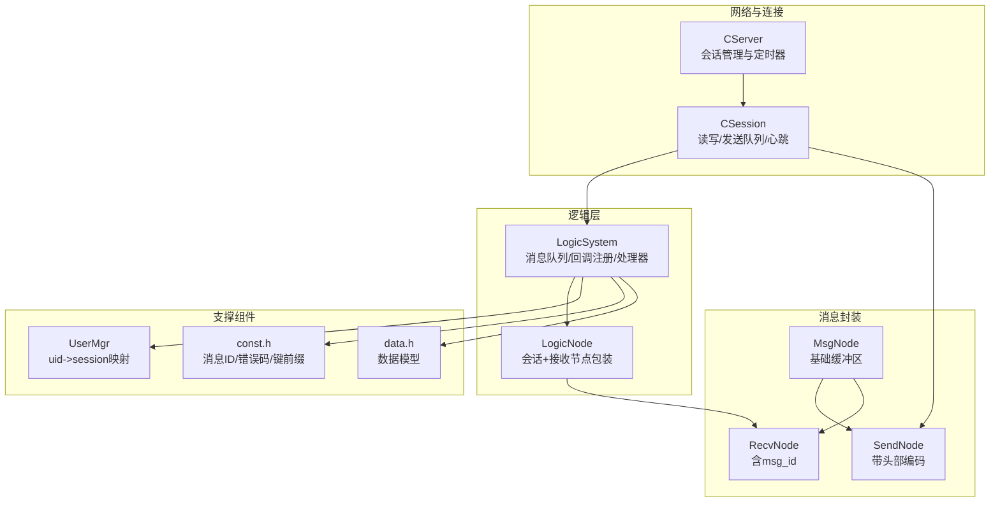
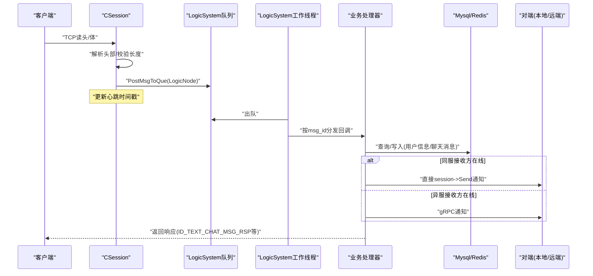
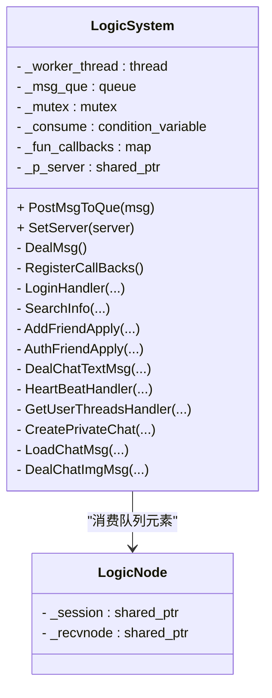
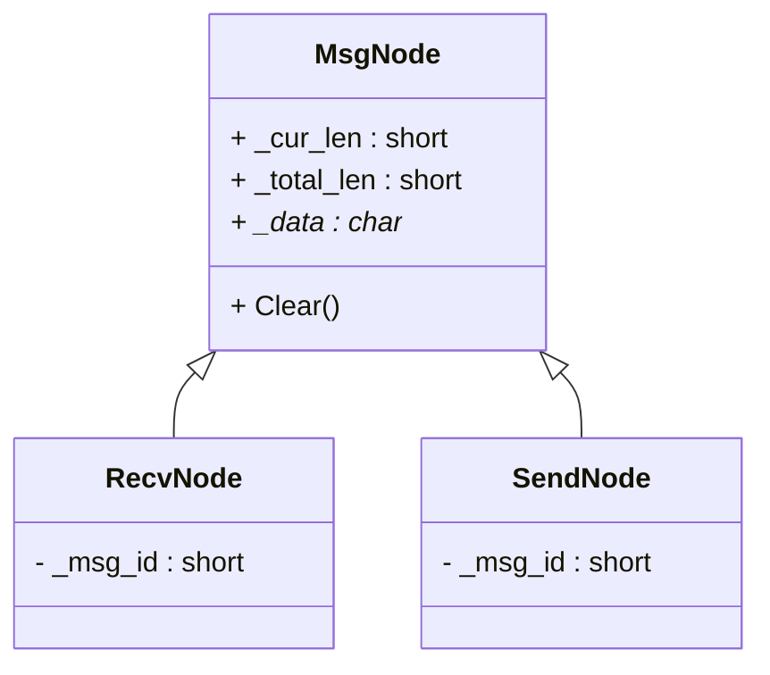
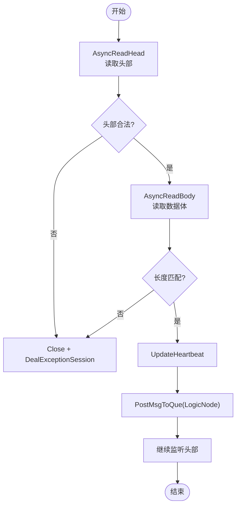
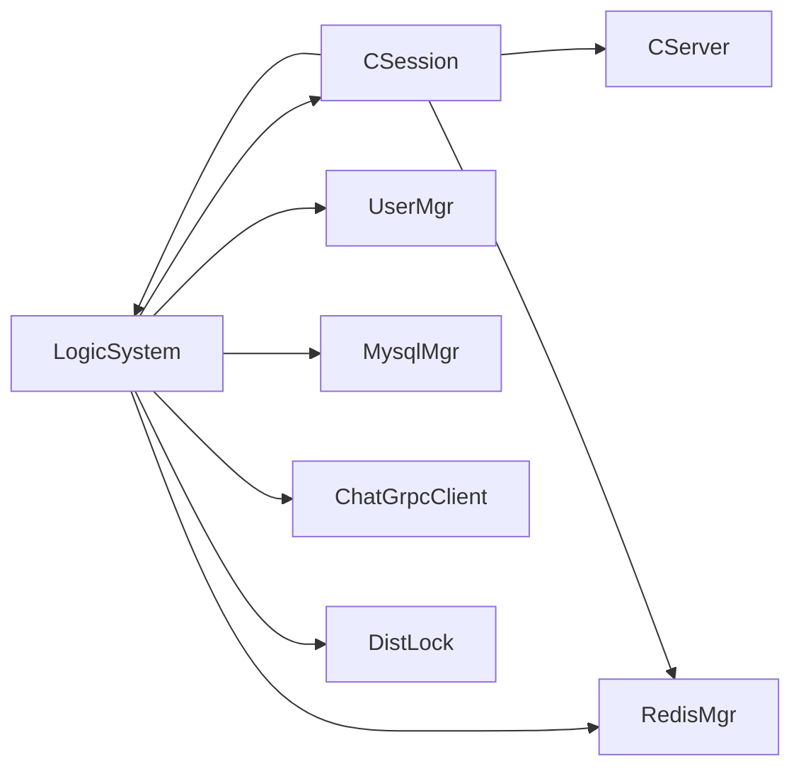
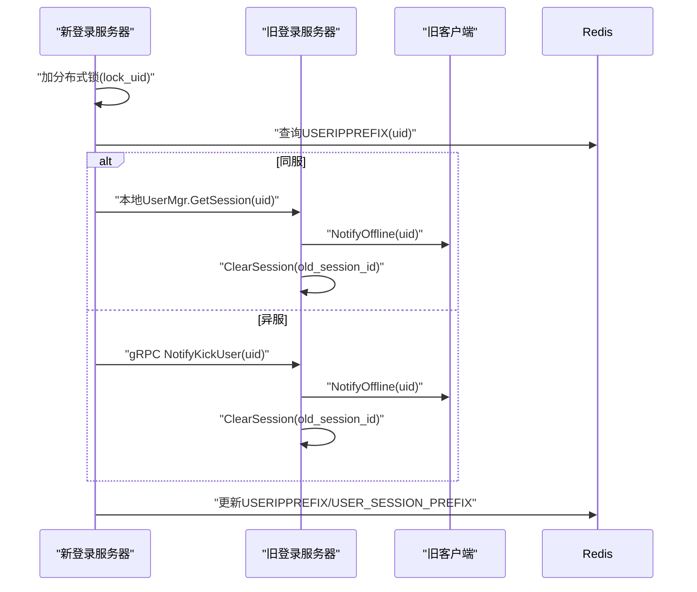
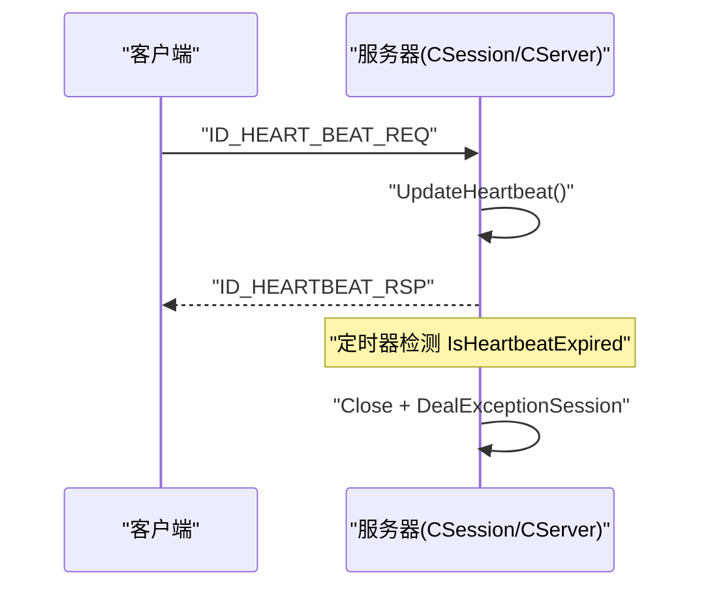

# 业务逻辑层

<cite>
**本文引用的文件**   
- [LogicSystem.h](file://server/ChatServer/include/LogicSystem.h)
- [LogicSystem.cpp](file://server/ChatServer/src/LogicSystem.cpp)
- [MsgNode.h](file://server/ChatServer/include/MsgNode.h)
- [MsgNode.cpp](file://server/ChatServer/src/MsgNode.cpp)
- [CSession.h](file://server/ChatServer/include/CSession.h)
- [CSession.cpp](file://server/ChatServer/src/CSession.cpp)
- [UserMgr.h](file://server/ChatServer/include/UserMgr.h)
- [const.h](file://server/ChatServer/include/const.h)
- [data.h](file://server/ChatServer/include/data.h)
- [CServer.h](file://server/ChatServer/include/CServer.h)
- [day33单服程踢人逻辑.md](file://开发文档/day33单服程踢人逻辑.md)
- [day34多服程踢人逻辑.md](file://开发文档/day34多服程踢人逻辑.md)
- [day35心跳逻辑.md](file://开发文档/day35心跳逻辑.md)
</cite>

## 目录
1. [简介](#简介)
2. [项目结构](#项目结构)
3. [核心组件](#核心组件)
4. [架构总览](#架构总览)
5. [详细组件分析](#详细组件分析)
6. [依赖关系分析](#依赖关系分析)
7. [性能考量](#性能考量)
8. [故障排查指南](#故障排查指南)
9. [结论](#结论)
10. [附录](#附录)

## 简介
本技术文档聚焦 ChatServer 的业务逻辑层，系统性阐述 LogicSystem 逻辑系统的核心设计：消息路由机制、业务场景处理流程、事件驱动架构；详解各类消息（文本消息转发、群聊广播、系统通知等）的处理逻辑；说明 MsgNode 消息节点的数据结构与队列管理、异步处理机制；解释踢人逻辑（单服程与多服程）的实现差异；阐述心跳检测、连接保活与异常连接清理策略；并提供扩展新业务逻辑的实践方法。

## 项目结构
ChatServer 业务逻辑层围绕以下关键模块组织：
- 会话与网络 I/O：CSession、CServer
- 逻辑调度与分发：LogicSystem、LogicNode
- 消息封装与序列化：MsgNode、SendNode、RecvNode
- 用户与会话映射：UserMgr
- 常量与协议定义：const.h（消息ID、错误码、Redis键前缀等）
- 数据模型：data.h（UserInfo、ApplyInfo、ChatThreadInfo、ChatMessage、PageResult 等）

**图表来源** 
- [CServer.h](file://server/ChatServer/include/CServer.h)
- [CSession.h](file://server/ChatServer/include/CSession.h)
- [LogicSystem.h](file://server/ChatServer/include/LogicSystem.h)
- [MsgNode.h](file://server/ChatServer/include/MsgNode.h)
- [UserMgr.h](file://server/ChatServer/include/UserMgr.h)
- [const.h](file://server/ChatServer/include/const.h)
- [data.h](file://server/ChatServer/include/data.h)

**章节来源**
- [CServer.h](file://server/ChatServer/include/CServer.h)
- [CSession.h](file://server/ChatServer/include/CSession.h)
- [LogicSystem.h](file://server/ChatServer/include/LogicSystem.h)
- [MsgNode.h](file://server/ChatServer/include/MsgNode.h)
- [UserMgr.h](file://server/ChatServer/include/UserMgr.h)
- [const.h](file://server/ChatServer/include/const.h)
- [data.h](file://server/ChatServer/include/data.h)

## 核心组件
- LogicSystem：单例逻辑引擎，维护消息队列、工作线程、回调表；负责将网络层收到的消息投递到队列，按 msg_id 分发给对应处理器。
- CSession：封装 TCP 套接字读写、粘包/半包处理、发送队列、心跳时间戳、异常清理；在读取完成后将消息封装为 LogicNode 投递给 LogicSystem。
- MsgNode/SendNode/RecvNode：统一的消息缓冲与头部封装，SendNode 负责将 msg_id 和长度转为网络字节序并拼接数据体。
- UserMgr：维护 uid 到 session 的映射，支持获取/设置/删除会话，配合分布式锁实现踢人与离线清理。
- const.h/data.h：定义消息 ID、错误码、Redis 键前缀、数据结构等，是跨模块契约。

**章节来源**
- [LogicSystem.h](file://server/ChatServer/include/LogicSystem.h)
- [LogicSystem.cpp](file://server/ChatServer/src/LogicSystem.cpp)
- [CSession.h](file://server/ChatServer/include/CSession.h)
- [CSession.cpp](file://server/ChatServer/src/CSession.cpp)
- [MsgNode.h](file://server/ChatServer/include/MsgNode.h)
- [MsgNode.cpp](file://server/ChatServer/src/MsgNode.cpp)
- [UserMgr.h](file://server/ChatServer/include/UserMgr.h)
- [const.h](file://server/ChatServer/include/const.h)
- [data.h](file://server/ChatServer/include/data.h)

## 架构总览
LogicSystem 采用“事件驱动 + 队列解耦”的设计：
- 网络层（CSession）解析头部与数据体后，构造 LogicNode(session, recvnode)，投递至 LogicSystem 的队列。
- LogicSystem 的工作线程从队列取出消息，根据 msg_id 查找回调函数并调用对应处理器。
- 处理器完成业务逻辑（数据库/缓存/跨服 RPC），并通过 session->Send 回包或推送通知。

**图表来源** 
- [CSession.cpp](file://server/ChatServer/src/CSession.cpp)
- [LogicSystem.cpp](file://server/ChatServer/src/LogicSystem.cpp)

## 详细组件分析

### LogicSystem：消息路由与业务处理
- 队列与工作线程：使用 std::queue + mutex + condition_variable 实现阻塞式消费；PostMsgToQue 入队并在首次入队时唤醒消费者。
- 回调表：以 short 类型的 msg_id 为键，绑定具体处理器函数指针，RegisterCallBacks 集中注册。
- 典型处理器：
  - 登录 LoginHandler：校验 token、拉取用户信息与好友列表、分布式锁保护下的踢人逻辑（同服/异服）、绑定 session 与 Redis 状态。
  - 搜索 SearchInfo：按 uid/name 查询用户信息（优先 Redis，再 MySQL）。
  - 好友申请 AddFriendApply/AuthFriendApply：持久化申请/认证，通知对方（同服直发，异服 gRPC）。
  - 文本消息 DealChatTextMsg：批量插入聊天消息，返回确认，推送通知（同服/异服）。
  - 图片消息 DealChatImgMsg：记录未上传状态，返回 message_id 供后续断点续传。
  - 心跳 HeartBeatHandler：简单回包，同时更新会话心跳时间戳（由 CSession 在读路径更新）。
  - 加载聊天线程/消息：分页查询 thread 列表与历史消息，返回 last_message_id 与 load_more 标志。

**图表来源** 
- [LogicSystem.h](file://server/ChatServer/include/LogicSystem.h)
- [LogicSystem.cpp](file://server/ChatServer/src/LogicSystem.cpp)

**章节来源**
- [LogicSystem.h](file://server/ChatServer/include/LogicSystem.h)
- [LogicSystem.cpp](file://server/ChatServer/src/LogicSystem.cpp)

### MsgNode：消息节点与序列化
- MsgNode：提供固定大小缓冲区与长度字段，便于复用与避免频繁分配。
- RecvNode：继承 MsgNode，附加 msg_id，用于接收侧解析。
- SendNode：继承 MsgNode，构造时将 msg_id 与数据长度转换为网络字节序，并拼接数据体，形成可发送的完整帧。

**图表来源** 
- [MsgNode.h](file://server/ChatServer/include/MsgNode.h)
- [MsgNode.cpp](file://server/ChatServer/src/MsgNode.cpp)

**章节来源**
- [MsgNode.h](file://server/ChatServer/include/MsgNode.h)
- [MsgNode.cpp](file://server/ChatServer/src/MsgNode.cpp)

### CSession：I/O、发送队列与心跳
- 读路径：AsyncReadHead 解析头部（msg_id、长度），校验合法性后分配 RecvNode，AsyncReadBody 读取数据体，成功后更新心跳时间戳，并将 LogicNode 投递给 LogicSystem。
- 写路径：Send 将消息封装为 SendNode 入队，若队列为空则立即发起异步写；HandleWrite 在回调中弹出已发送项并继续下一项。
- 心跳：UpdateHeartbeat 更新时间戳；IsHeartbeatExpired 判断是否超时；DealExceptionSession 在异常时通过分布式锁清理 Redis 中的 session/ip/token 信息。
- 通知：NotifyOffline、NotifyChatImgRecv 用于向客户端下发系统通知。

**图表来源** 
- [CSession.cpp](file://server/ChatServer/src/CSession.cpp)

**章节来源**
- [CSession.h](file://server/ChatServer/include/CSession.h)
- [CSession.cpp](file://server/ChatServer/src/CSession.cpp)

### UserMgr：用户与会话映射
- 提供 GetSession/SetUserSession/RmvUserSession，内部以互斥量保护 unordered_map<int, shared_ptr<CSession>>。
- 与分布式锁配合，确保踢人与离线清理的原子性。

**章节来源**
- [UserMgr.h](file://server/ChatServer/include/UserMgr.h)

### const.h 与 data.h：协议与数据模型
- const.h：定义 ErrorCodes、MSG_IDS（登录、搜索、好友、聊天、心跳、图片、文件同步等）、Redis 键前缀（USERIPPREFIX、USERTOKENPREFIX、USER_BASE_INFO、LOCK_PREFIX、USER_SESSION_PREFIX 等）、锁参数。
- data.h：定义 UserInfo、ApplyInfo、ChatThreadInfo、ChatMessage、PageResult、ChatMsgType 等结构，贯穿各处理器间的数据传递。

**章节来源**
- [const.h](file://server/ChatServer/include/const.h)
- [data.h](file://server/ChatServer/include/data.h)

## 依赖关系分析
- LogicSystem 依赖 CSession（发送回包）、UserMgr（会话映射）、MysqlMgr/RedisMgr（数据访问）、ChatGrpcClient（跨服通知）、DistLock（分布式锁）。
- CSession 依赖 CServer（会话生命周期管理）、LogicSystem（投递消息）、RedisMgr（异常清理）。
- 所有处理器依赖 const.h 中的消息 ID 与错误码，以及 data.h 的数据结构。

**图表来源** 
- [LogicSystem.cpp](file://server/ChatServer/src/LogicSystem.cpp)
- [CSession.cpp](file://server/ChatServer/src/CSession.cpp)

**章节来源**
- [LogicSystem.cpp](file://server/ChatServer/src/LogicSystem.cpp)
- [CSession.cpp](file://server/ChatServer/src/CSession.cpp)

## 性能考量
- 队列与线程：LogicSystem 的单生产者-单消费者模式减少竞争；条件变量避免忙轮询。
- 发送队列：CSession 的发送队列限流（MAX_SENDQUE），防止拥塞导致内存暴涨。
- 缓存优先：用户信息查询优先 Redis，命中后再落库，降低数据库压力。
- 批量操作：文本消息批量插入，减少 IO 次数。
- 定时任务：CServer 的心跳定时器周期性统计连接数并清理僵尸连接，避免资源泄漏。

[本节为通用指导，不直接分析具体文件]

## 故障排查指南
- 常见错误码：ErrorCodes 定义了 JSON 解析错误、RPC 失败、Token 失效、UID 无效等，可在各处理器返回中快速定位问题。
- 连接异常：CSession 的读/写错误路径会触发 DealExceptionSession，检查 Redis 中 USER_SESSION_PREFIX、USERIPPREFIX、USERTOKENPREFIX 是否被正确清理。
- 心跳超时：IsHeartbeatExpired 阈值默认较短（示例为 20s），生产建议调整为合理值（如 60s），并确保客户端定时发送心跳。
- 踢人逻辑：单服程踢人通过 UserMgr 获取旧 session 并发送下线通知；多服程踢人通过 gRPC 通知目标服务器执行相同逻辑。

**章节来源**
- [const.h](file://server/ChatServer/include/const.h)
- [CSession.cpp](file://server/ChatServer/src/CSession.cpp)
- [day33单服程踢人逻辑.md](file://开发文档/day33单服程踢人逻辑.md)
- [day34多服程踢人逻辑.md](file://开发文档/day34多服程踢人逻辑.md)
- [day35心跳逻辑.md](file://开发文档/day35心跳逻辑.md)

## 结论
LogicSystem 通过“队列 + 回调”的事件驱动架构，将网络 I/O 与业务逻辑解耦，具备高内聚、低耦合、易扩展的特点。结合 CSession 的健壮 I/O 与心跳机制、UserMgr 的会话映射、Redis/Mysql 的缓存与持久化、以及 gRPC 的跨服通信，形成了完整的聊天服务业务闭环。遵循统一的锁顺序与异常清理策略，可有效避免死锁与资源泄漏。

[本节为总结性内容，不直接分析具体文件]

## 附录

### 消息类型与处理流程示例
- 文本消息转发：
  - 客户端发送 ID_TEXT_CHAT_MSG_REQ，服务器解析并批量插入数据库，返回 ID_TEXT_CHAT_MSG_RSP；若接收方在同服则直接推送 ID_NOTIFY_TEXT_CHAT_MSG_REQ，否则通过 gRPC 通知。
- 群聊广播：
  - 当前代码以私聊为主，可扩展为按 thread_id 查找成员列表并逐一推送。
- 系统通知发送：
  - 下线通知 ID_NOTIFY_OFF_LINE_REQ、图片下载通知 ID_NOTIFY_IMG_CHAT_MSG_REQ 等，均由处理器组装 JSON 并通过 session->Send 下发。

**章节来源**
- [LogicSystem.cpp](file://server/ChatServer/src/LogicSystem.cpp)
- [const.h](file://server/ChatServer/include/const.h)

### 踢人逻辑：单服程与多服程
- 单服程踢人：
  - 登录时加分布式锁，若发现同服已有旧 session，则发送下线通知并清理旧连接。
- 多服程踢人：
  - 若旧连接在异服，则通过 gRPC NotifyKickUser 通知目标服务器执行相同清理流程。

**图表来源** 
- [LogicSystem.cpp](file://server/ChatServer/src/LogicSystem.cpp)
- [day33单服程踢人逻辑.md](file://开发文档/day33单服程踢人逻辑.md)
- [day34多服程踢人逻辑.md](file://开发文档/day34多服程踢人逻辑.md)

**章节来源**
- [day33单服程踢人逻辑.md](file://开发文档/day33单服程踢人逻辑.md)
- [day34多服程踢人逻辑.md](file://开发文档/day34多服程踢人逻辑.md)

### 心跳检测与连接保活
- 客户端每 N 秒发送 ID_HEART_BEAT_REQ，服务器回包 ID_HEARTBEAT_RSP 并更新会话心跳时间戳。
- 服务器定时器周期遍历会话，超过阈值则认为连接过期，关闭 socket 并清理 Redis 状态。

**图表来源** 
- [CSession.cpp](file://server/ChatServer/src/CSession.cpp)
- [day35心跳逻辑.md](file://开发文档/day35心跳逻辑.md)

**章节来源**
- [CSession.cpp](file://server/ChatServer/src/CSession.cpp)
- [day35心跳逻辑.md](file://开发文档/day35心跳逻辑.md)

### 扩展新业务逻辑的方法
- 新增消息 ID：在 const.h 的 MSG_IDS 中定义新的请求/响应 ID。
- 注册处理器：在 LogicSystem::RegisterCallBacks 中将新 msg_id 绑定到处理器函数。
- 实现处理器：在 LogicSystem.cpp 中实现处理器，完成数据校验、持久化、缓存、跨服通知与回包。
- 测试验证：通过客户端模拟请求，观察日志与数据库/缓存状态，确保一致性。

**章节来源**
- [const.h](file://server/ChatServer/include/const.h)
- [LogicSystem.cpp](file://server/ChatServer/src/LogicSystem.cpp)