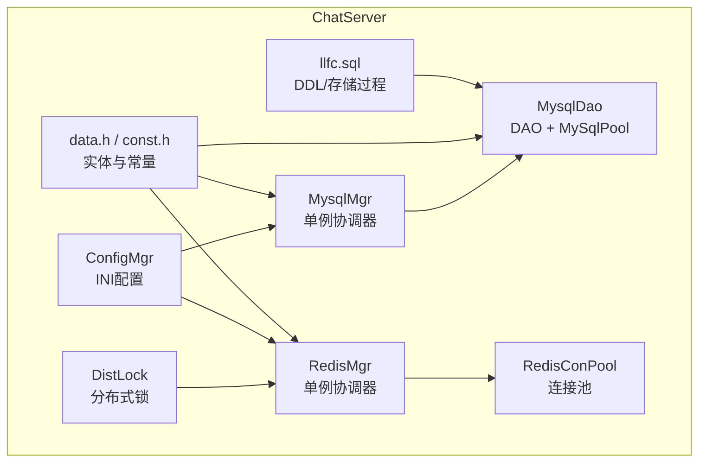
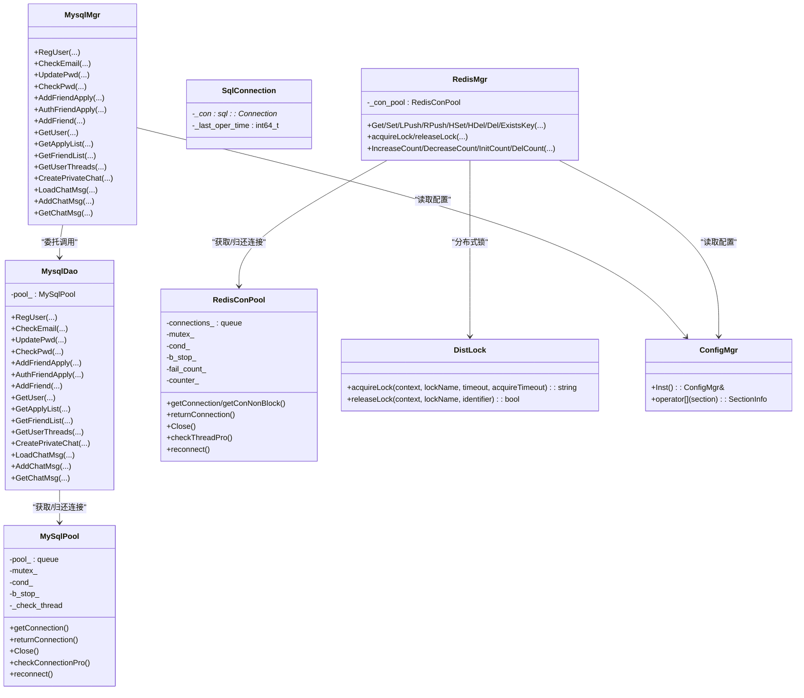
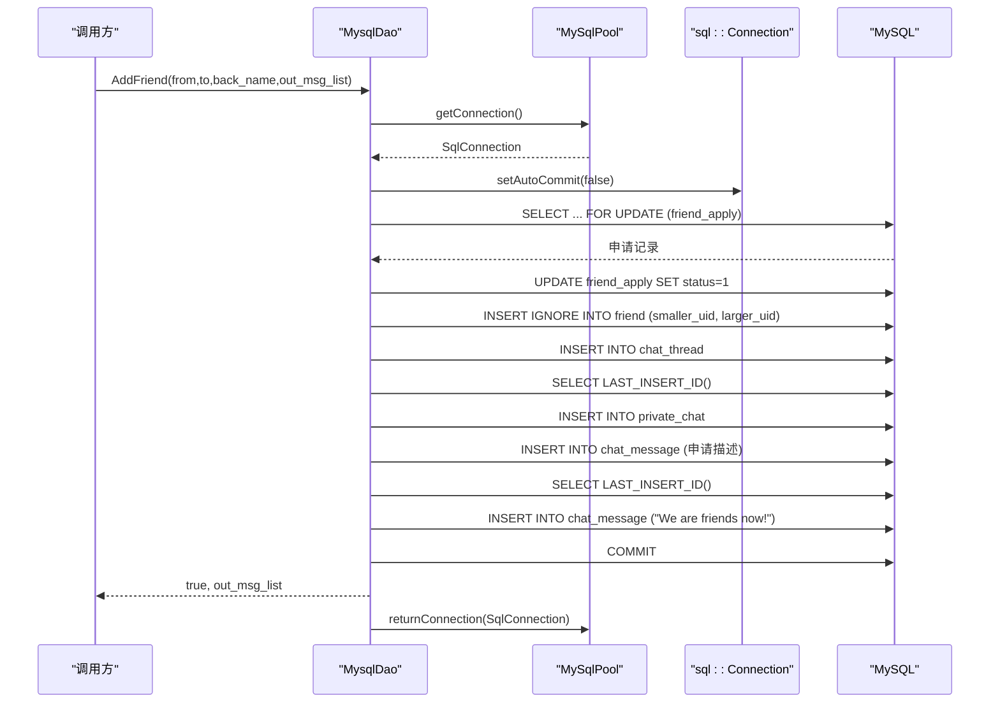
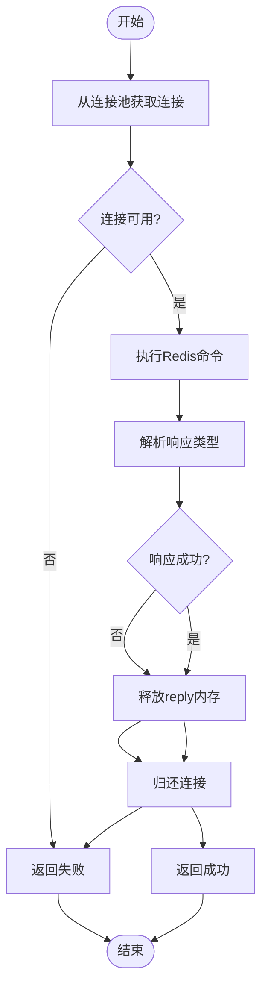
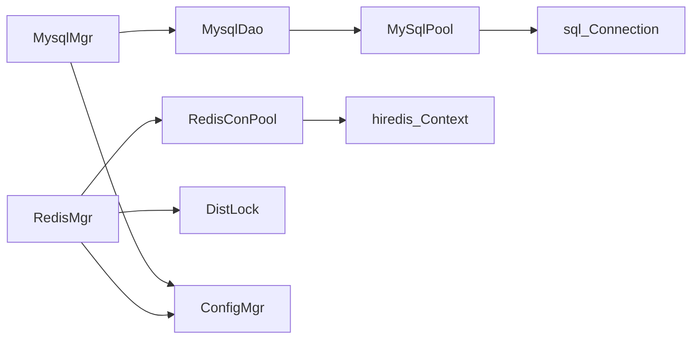
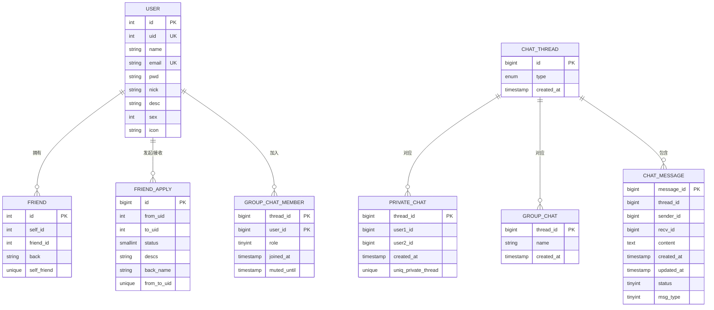

# 数据访问层

<cite>
**本文引用的文件**   
- [MysqlDao.h](file://server/ChatServer/include/MysqlDao.h)
- [MysqlDao.cpp](file://server/ChatServer/src/MysqlDao.cpp)
- [MysqlMgr.h](file://server/ChatServer/include/MysqlMgr.h)
- [MysqlMgr.cpp](file://server/ChatServer/src/MysqlMgr.cpp)
- [RedisMgr.h](file://server/ChatServer/include/RedisMgr.h)
- [RedisMgr.cpp](file://server/ChatServer/src/RedisMgr.cpp)
- [DistLock.h](file://server/ChatServer/include/DistLock.h)
- [data.h](file://server/ChatServer/include/data.h)
- [const.h](file://server/ChatServer/include/const.h)
- [ConfigMgr.h](file://server/ChatServer/include/ConfigMgr.h)
- [llfc.sql](file://sql备份/llfc.sql)
</cite>

## 目录
1. [简介](#简介)
2. [项目结构](#项目结构)
3. [核心组件](#核心组件)
4. [架构总览](#架构总览)
5. [详细组件分析](#详细组件分析)
6. [依赖关系分析](#依赖关系分析)
7. [性能考量](#性能考量)
8. [故障排查指南](#故障排查指南)
9. [结论](#结论)
10. [附录：数据库表结构与映射](#附录数据库表结构与映射)

## 简介
本文件面向 ChatServer 的数据访问层，系统性阐述 MySQL DAO、MySQL 管理器与 Redis 缓存管理器的设计模式与实现细节。内容涵盖连接池管理、SQL 封装、事务处理、分布式锁、读写一致性策略、分页与游标查询、以及最佳实践与调优建议。读者无需深入源码即可理解整体架构与关键流程。

## 项目结构
数据访问层位于 ChatServer 模块中，主要包含以下文件：
- MySQL 数据访问对象（DAO）与连接池：MysqlDao.h/.cpp
- MySQL 管理器（单例协调器）：MysqlMgr.h/.cpp
- Redis 缓存管理器与连接池：RedisMgr.h/.cpp
- 分布式锁接口：DistLock.h
- 数据模型与常量定义：data.h, const.h
- 配置读取：ConfigMgr.h
- 数据库脚本：llfc.sql

**图表来源** 
- [MysqlMgr.h:1-41](file://server/ChatServer/include/MysqlMgr.h#L1-L41)
- [MysqlDao.h:1-270](file://server/ChatServer/include/MysqlDao.h#L1-L270)
- [RedisMgr.h:1-305](file://server/ChatServer/include/RedisMgr.h#L1-L305)
- [DistLock.h:1-18](file://server/ChatServer/include/DistLock.h#L1-L18)
- [ConfigMgr.h:1-84](file://server/ChatServer/include/ConfigMgr.h#L1-L84)
- [data.h:1-65](file://server/ChatServer/include/data.h#L1-L65)
- [const.h:1-104](file://server/ChatServer/include/const.h#L1-L104)
- [llfc.sql:1-756](file://sql备份/llfc.sql#L1-L756)

**章节来源**
- [MysqlMgr.h:1-41](file://server/ChatServer/include/MysqlMgr.h#L1-L41)
- [MysqlDao.h:1-270](file://server/ChatServer/include/MysqlDao.h#L1-L270)
- [RedisMgr.h:1-305](file://server/ChatServer/include/RedisMgr.h#L1-L305)
- [ConfigMgr.h:1-84](file://server/ChatServer/include/ConfigMgr.h#L1-L84)
- [data.h:1-65](file://server/ChatServer/include/data.h#L1-L65)
- [const.h:1-104](file://server/ChatServer/include/const.h#L1-L104)
- [llfc.sql:1-756](file://sql备份/llfc.sql#L1-L756)

## 核心组件
- MysqlDao：封装所有 MySQL 操作，内部持有 MySqlPool 连接池，提供用户注册、认证、好友申请/通过、聊天线程与消息等接口。
- MysqlMgr：单例管理器，统一暴露 DAO 方法，屏蔽底层 DAO 细节，便于上层逻辑调用。
- RedisMgr：单例管理器，封装 Redis 基本命令、列表操作、哈希操作、键存在性检查、分布式锁获取/释放、登录计数统计等。
- DistLock：基于 Redis 的分布式锁实现，供 RedisMgr 使用。
- data.h/const.h：定义业务实体（UserInfo、ApplyInfo、ChatThreadInfo、ChatMessage、PageResult）与常量（错误码、消息ID、Key前缀、锁超时等）。
- ConfigMgr：从 INI 配置文件读取 MySQL/Redis 连接参数。

**章节来源**
- [MysqlDao.h:236-267](file://server/ChatServer/include/MysqlDao.h#L236-L267)
- [MysqlMgr.h:8-39](file://server/ChatServer/include/MysqlMgr.h#L8-L39)
- [RedisMgr.h:267-305](file://server/ChatServer/include/RedisMgr.h#L267-L305)
- [DistLock.h:4-16](file://server/ChatServer/include/DistLock.h#L4-L16)
- [data.h:4-58](file://server/ChatServer/include/data.h#L4-L58)
- [const.h:5-104](file://server/ChatServer/include/const.h#L5-L104)
- [ConfigMgr.h:46-84](file://server/ChatServer/include/ConfigMgr.h#L46-L84)

## 架构总览
数据访问层采用“管理器 -> DAO/缓存管理器 -> 连接池”的分层设计：
- 上层业务通过单例管理器（MysqlMgr/RedisMgr）访问数据。
- MysqlMgr 仅转发到 MysqlDao；RedisMgr 直接封装 hiredis 命令并复用连接池。
- 连接池负责连接生命周期、健康检查、自动重连与资源回收。
- 分布式锁由 DistLock 提供，确保跨进程/服务的一致性操作。

**图表来源** 
- [MysqlMgr.h:8-39](file://server/ChatServer/include/MysqlMgr.h#L8-L39)
- [MysqlDao.h:25-232](file://server/ChatServer/include/MysqlDao.h#L25-L232)
- [RedisMgr.h:267-305](file://server/ChatServer/include/RedisMgr.h#L267-L305)
- [DistLock.h:4-16](file://server/ChatServer/include/DistLock.h#L4-L16)
- [ConfigMgr.h:46-84](file://server/ChatServer/include/ConfigMgr.h#L46-L84)

## 详细组件分析

### MysqlDao：MySQL 数据访问对象与连接池
- 连接池设计
  - 初始化时创建固定数量的 MySqlConnection，设置 schema，记录最后操作时间戳。
  - 后台线程周期性执行健康检查：对空闲超过阈值的连接执行 SELECT 1 探测，失败则标记并尝试重建。
  - 支持条件变量等待获取连接，避免忙轮询；关闭时通知所有等待者并清理队列。
- SQL 封装与事务
  - 使用 PreparedStatement 绑定参数，避免注入风险。
  - 复杂业务（如 AddFriend）开启事务，按顺序锁定与更新，防止死锁；失败回滚。
  - 使用 Defer RAII 机制保证连接归还与异常安全。
- 典型流程（添加好友）
  - 锁定申请记录（FOR UPDATE），校验存在性。
  - 更新状态为已同意。
  - 按 uid 大小顺序插入双向好友关系，避免死锁。
  - 创建 chat_thread 与 private_chat 记录，插入初始消息。
  - 提交事务，返回生成的消息对象集合。

**图表来源** 
- [MysqlDao.cpp:247-504](file://server/ChatServer/src/MysqlDao.cpp#L247-L504)

**章节来源**
- [MysqlDao.h:25-232](file://server/ChatServer/include/MysqlDao.h#L25-L232)
- [MysqlDao.cpp:1-1104](file://server/ChatServer/src/MysqlDao.cpp#L1-L1104)

### MysqlMgr：MySQL 管理器（单例）
- 职责：对外暴露统一的数据库操作方法，内部委托给 _dao 实例。
- 特点：单例模式，简化全局访问；方法签名与 DAO 保持一致，便于替换或扩展。

**章节来源**
- [MysqlMgr.h:8-39](file://server/ChatServer/include/MysqlMgr.h#L8-L39)
- [MysqlMgr.cpp:1-95](file://server/ChatServer/src/MysqlMgr.cpp#L1-L95)

### RedisMgr：Redis 缓存管理器与连接池
- 连接池设计
  - 初始化固定数量 redisContext，AUTH 认证后入池。
  - 后台线程定期 PING 检测连接健康，失败计数并触发重连。
  - 提供阻塞与非阻塞两种获取连接方式，支持优雅关闭。
- 常用操作
  - 字符串：GET/SET/DEL/EXISTS
  - 列表：LPUSH/RPOP/LPOP/RPUSH
  - 哈希：HSET/HGET/HDEL
- 分布式锁
  - 通过 DistLock 实现加锁/解锁，用于并发安全的计数与状态更新。
- 登录计数
  - 使用 HASH 维护各服务器登录数，增加/减少/初始化/删除均带锁保护。

**图表来源** 
- [RedisMgr.cpp:18-79](file://server/ChatServer/src/RedisMgr.cpp#L18-L79)
- [RedisMgr.cpp:81-184](file://server/ChatServer/src/RedisMgr.cpp#L81-L184)
- [RedisMgr.cpp:186-333](file://server/ChatServer/src/RedisMgr.cpp#L186-L333)

**章节来源**
- [RedisMgr.h:9-265](file://server/ChatServer/include/RedisMgr.h#L9-L265)
- [RedisMgr.cpp:1-462](file://server/ChatServer/src/RedisMgr.cpp#L1-L462)
- [DistLock.h:4-16](file://server/ChatServer/include/DistLock.h#L4-L16)

### 数据模型与 ORM 映射
- UserInfo：用户基本信息（uid、name、email、pwd、nick、desc、sex、icon、back）。
- ApplyInfo：好友申请信息（from/to、status、desc、back_name）。
- ChatThreadInfo：聊天线程（thread_id、type、user1_id、user2_id）。
- ChatMessage：聊天消息（message_id、thread_id、sender_id、recv_id、content、chat_time、status、msg_type）。
- PageResult：分页结果（messages、load_more、next_cursor）。

这些结构体在 DAO 中用于封装查询结果，形成简单的 ORM 映射效果。

**章节来源**
- [data.h:4-58](file://server/ChatServer/include/data.h#L4-L58)

### 配置与常量
- ConfigMgr：从 INI 文件中读取 [Mysql] 与 [Redis] 段，提供 Host、Port、Passwd、Schema、User 等参数。
- const.h：定义错误码、消息 ID、Key 前缀（如 USER_BASE_INFO、LOGIN_COUNT）、分布式锁超时等。

**章节来源**
- [ConfigMgr.h:46-84](file://server/ChatServer/include/ConfigMgr.h#L46-L84)
- [const.h:5-104](file://server/ChatServer/include/const.h#L5-L104)

## 依赖关系分析
- MysqlMgr 依赖 MysqlDao；MysqlDao 依赖 MySqlPool；MySqlPool 依赖 sql::Connection。
- RedisMgr 依赖 RedisConPool；RedisConPool 依赖 hiredis 的 redisContext。
- DistLock 依赖 Redis 原子操作（通过 hiredis 执行）。
- 所有组件通过 ConfigMgr 读取配置。

**图表来源** 
- [MysqlMgr.h:8-39](file://server/ChatServer/include/MysqlMgr.h#L8-L39)
- [MysqlDao.h:25-232](file://server/ChatServer/include/MysqlDao.h#L25-L232)
- [RedisMgr.h:267-305](file://server/ChatServer/include/RedisMgr.h#L267-L305)
- [DistLock.h:4-16](file://server/ChatServer/include/DistLock.h#L4-L16)
- [ConfigMgr.h:46-84](file://server/ChatServer/include/ConfigMgr.h#L46-L84)

**章节来源**
- [MysqlMgr.h:8-39](file://server/ChatServer/include/MysqlMgr.h#L8-L39)
- [MysqlDao.h:25-232](file://server/ChatServer/include/MysqlDao.h#L25-L232)
- [RedisMgr.h:267-305](file://server/ChatServer/include/RedisMgr.h#L267-L305)
- [DistLock.h:4-16](file://server/ChatServer/include/DistLock.h#L4-L16)
- [ConfigMgr.h:46-84](file://server/ChatServer/include/ConfigMgr.h#L46-L84)

## 性能考量
- 连接池优化
  - MySQL：固定池大小、条件变量等待、后台健康检查与自动重连，降低连接建立开销与失效影响。
  - Redis：PING 心跳、失败计数与重连，非阻塞获取连接提升吞吐。
- SQL 优化
  - 使用 Prepared Statement 避免重复解析与注入风险。
  - 分页查询采用 LIMIT N+1 判断是否还有下一页，减少额外 COUNT 查询。
  - 索引利用：chat_message 的 thread_id+created_at、thread_id+message_id 索引加速范围查询。
- 事务与锁
  - 复杂写入使用事务保证一致性；按固定顺序插入避免死锁。
  - 分布式锁保护热点计数，避免竞争。
- 资源管理
  - 使用 Defer 与 RAII 确保连接与内存释放，避免泄漏。

[本节为通用指导，不直接分析具体文件]

## 故障排查指南
- MySQL 连接问题
  - 检查连接池初始化日志与 health check 输出；确认 URL、用户名、密码、schema 正确。
  - 观察 reconnect 日志，确认网络与权限。
- SQL 异常
  - 捕获 SQLException，打印 error code 与 SQLState，定位语句或参数问题。
  - 事务失败时检查 rollback 分支与回滚原因。
- Redis 连接与命令失败
  - 查看 AUTH 与 PING 结果；确认密码与端口。
  - 检查 reply 类型与值，确保内存释放与连接归还。
- 分布式锁
  - 确认锁超时与重试时间合理；检查 key 命名与前缀冲突。
- 配置加载
  - 验证 INI 文件路径与字段名是否与 ConfigMgr 一致。

**章节来源**
- [MysqlDao.cpp:19-57](file://server/ChatServer/src/MysqlDao.cpp#L19-L57)
- [MysqlDao.cpp:59-94](file://server/ChatServer/src/MysqlDao.cpp#L59-L94)
- [MysqlDao.cpp:96-124](file://server/ChatServer/src/MysqlDao.cpp#L96-L124)
- [MysqlDao.cpp:126-167](file://server/ChatServer/src/MysqlDao.cpp#L126-L167)
- [MysqlDao.cpp:169-209](file://server/ChatServer/src/MysqlDao.cpp#L169-L209)
- [MysqlDao.cpp:211-244](file://server/ChatServer/src/MysqlDao.cpp#L211-L244)
- [MysqlDao.cpp:247-504](file://server/ChatServer/src/MysqlDao.cpp#L247-L504)
- [MysqlDao.cpp:508-548](file://server/ChatServer/src/MysqlDao.cpp#L508-L548)
- [MysqlDao.cpp:550-590](file://server/ChatServer/src/MysqlDao.cpp#L550-L590)
- [MysqlDao.cpp:593-633](file://server/ChatServer/src/MysqlDao.cpp#L593-L633)
- [MysqlDao.cpp:635-678](file://server/ChatServer/src/MysqlDao.cpp#L635-L678)
- [MysqlDao.cpp:681-770](file://server/ChatServer/src/MysqlDao.cpp#L681-L770)
- [MysqlDao.cpp:772-800](file://server/ChatServer/src/MysqlDao.cpp#L772-L800)
- [RedisMgr.cpp:18-79](file://server/ChatServer/src/RedisMgr.cpp#L18-L79)
- [RedisMgr.cpp:81-184](file://server/ChatServer/src/RedisMgr.cpp#L81-L184)
- [RedisMgr.cpp:186-333](file://server/ChatServer/src/RedisMgr.cpp#L186-L333)
- [RedisMgr.cpp:362-393](file://server/ChatServer/src/RedisMgr.cpp#L362-L393)
- [RedisMgr.cpp:395-462](file://server/ChatServer/src/RedisMgr.cpp#L395-L462)

## 结论
ChatServer 的数据访问层以清晰的分层与单例管理器为核心，结合健壮的连接池与事务控制，实现了高可用的 MySQL 与 Redis 访问能力。通过合理的索引、分页策略与分布式锁，系统在并发场景下具备较好的稳定性与性能。后续可进一步引入读写分离、缓存一致性策略与更完善的监控告警，以提升整体可靠性与可观测性。

[本节为总结，不直接分析具体文件]

## 附录：数据库表结构与映射
- user：用户主表（uid、name、email、pwd、nick、desc、sex、icon），含唯一索引与名称索引。
- friend：好友关系（self_id、friend_id、back），唯一约束避免重复。
- friend_apply：好友申请（from_uid、to_uid、status、descs、back_name），唯一约束 on from_to_uid。
- chat_thread：聊天会话（id、type、created_at）。
- private_chat：私聊关系（thread_id、user1_id、user2_id），唯一约束与用户索引。
- group_chat/group_chat_member：群聊与成员关系。
- chat_message：聊天消息（message_id、thread_id、sender_id、recv_id、content、created_at、updated_at、status、msg_type），复合索引加速查询。
- reg_user 存储过程：注册新用户，包含事务与唯一性校验。

**图表来源** 
- [llfc.sql:24-37](file://sql备份/llfc.sql#L24-L37)
- [llfc.sql:150-155](file://sql备份/llfc.sql#L150-L155)
- [llfc.sql:180-187](file://sql备份/llfc.sql#L180-L187)
- [llfc.sql:295-304](file://sql备份/llfc.sql#L295-L304)
- [llfc.sql:364-369](file://sql备份/llfc.sql#L364-L369)
- [llfc.sql:383-391](file://sql备份/llfc.sql#L383-L391)
- [llfc.sql:409-418](file://sql备份/llfc.sql#L409-L418)
- [llfc.sql:467-481](file://sql备份/llfc.sql#L467-L481)

**章节来源**
- [llfc.sql:24-37](file://sql备份/llfc.sql#L24-L37)
- [llfc.sql:150-155](file://sql备份/llfc.sql#L150-L155)
- [llfc.sql:180-187](file://sql备份/llfc.sql#L180-L187)
- [llfc.sql:295-304](file://sql备份/llfc.sql#L295-L304)
- [llfc.sql:364-369](file://sql备份/llfc.sql#L364-L369)
- [llfc.sql:383-391](file://sql备份/llfc.sql#L383-L391)
- [llfc.sql:409-418](file://sql备份/llfc.sql#L409-L418)
- [llfc.sql:467-481](file://sql备份/llfc.sql#L467-L481)