# 用户管理

<cite>
**本文引用的文件**   
- [UserMgr.h](file://server/ChatServer/include/UserMgr.h)
- [UserMgr.cpp](file://server/ChatServer/src/UserMgr.cpp)
- [CSession.h](file://server/ChatServer/include/CSession.h)
- [LogicSystem.h](file://server/ChatServer/include/LogicSystem.h)
- [LogicSystem.cpp](file://server/ChatServer/src/LogicSystem.cpp)
- [ChatServiceImpl.h](file://server/ChatServer/include/ChatServiceImpl.h)
- [ChatServiceImpl.cpp](file://server/ChatServer/src/ChatServiceImpl.cpp)
- [StatusGrpcClient.h](file://server/ChatServer/include/StatusGrpcClient.h)
- [ChatGrpcClient.h](file://server/ChatServer/include/ChatGrpcClient.h)
- [data.h](file://server/ChatServer/include/data.h)
- [const.h](file://server/ChatServer/include/const.h)
- [MysqlDao.h](file://server/ChatServer/include/MysqlDao.h)
- [RedisMgr.h](file://server/ChatServer/include/RedisMgr.h)
</cite>

## 目录
1. [简介](#简介)
2. [项目结构](#项目结构)
3. [核心组件](#核心组件)
4. [架构总览](#架构总览)
5. [详细组件分析](#详细组件分析)
6. [依赖关系分析](#依赖关系分析)
7. [性能考量](#性能考量)
8. [故障排查指南](#故障排查指南)
9. [结论](#结论)
10. [附录：数据结构与操作示例](#附录数据结构与操作示例)

## 简介
本技术文档聚焦于 ChatServer 的用户管理系统，围绕 UserMgr 用户管理器及其在登录认证、好友关系、会话信息、状态同步与多设备处理中的核心作用进行系统化说明。文档涵盖以下要点：
- 用户在线状态维护（内存会话映射、心跳检测、离线清理）
- 好友关系管理（申请、认证、联系人列表维护）
- 会话信息管理（创建、更新、销毁、跨服通知）
- 登录认证流程（与 StatusServer gRPC 交互、Token 校验、权限检查）
- 用户状态同步机制（分布式锁、跨服务踢人、Redis 缓存一致性）
- 数据模型与常见操作示例

## 项目结构
ChatServer 中用户管理相关的关键代码位于 server/ChatServer 模块，主要包含：
- 会话与连接层：CSession（TCP 会话、心跳、消息收发）
- 业务逻辑层：LogicSystem（消息路由、业务处理、缓存与数据库访问）
- 用户会话管理：UserMgr（uid 到 session 的映射、并发安全）
- gRPC 客户端：StatusGrpcClient（与 StatusServer 交互）、ChatGrpcClient（与其他 ChatServer 实例交互）
- gRPC 服务端：ChatServiceImpl（接收跨服通知、图片消息推送、踢人）
- 数据层：MysqlDao（MySQL 访问）、RedisMgr（Redis 缓存与分布式锁）
- 常量与数据模型：const.h（错误码、消息ID、键前缀等）、data.h（用户、申请、聊天消息等结构体）

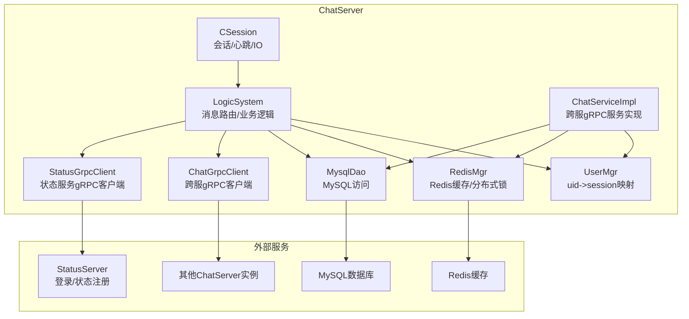

图表来源 
- [CSession.h:1-86](file://server/ChatServer/include/CSession.h#L1-L86)
- [LogicSystem.h:1-61](file://server/ChatServer/include/LogicSystem.h#L1-L61)
- [UserMgr.h:1-22](file://server/ChatServer/include/UserMgr.h#L1-L22)
- [ChatGrpcClient.h:1-120](file://server/ChatServer/include/ChatGrpcClient.h#L1-L120)
- [StatusGrpcClient.h:1-99](file://server/ChatServer/include/StatusGrpcClient.h#L1-L99)
- [ChatServiceImpl.h:1-55](file://server/ChatServer/include/ChatServiceImpl.h#L1-L55)
- [MysqlDao.h:1-270](file://server/ChatServer/include/MysqlDao.h#L1-L270)
- [RedisMgr.h:1-305](file://server/ChatServer/include/RedisMgr.h#L1-L305)

章节来源
- [CSession.h:1-86](file://server/ChatServer/include/CSession.h#L1-L86)
- [LogicSystem.h:1-61](file://server/ChatServer/include/LogicSystem.h#L1-L61)
- [UserMgr.h:1-22](file://server/ChatServer/include/UserMgr.h#L1-L22)
- [ChatGrpcClient.h:1-120](file://server/ChatServer/include/ChatGrpcClient.h#L1-L120)
- [StatusGrpcClient.h:1-99](file://server/ChatServer/include/StatusGrpcClient.h#L1-L99)
- [ChatServiceImpl.h:1-55](file://server/ChatServer/include/ChatServiceImpl.h#L1-L55)
- [MysqlDao.h:1-270](file://server/ChatServer/include/MysqlDao.h#L1-L270)
- [RedisMgr.h:1-305](file://server/ChatServer/include/RedisMgr.h#L1-L305)

## 核心组件
- UserMgr：单例，维护 uid 到 CSession 的映射，提供线程安全的获取、设置、删除会话接口，支持多设备登录时的会话替换与踢人。
- CSession：封装 TCP 连接、消息读写队列、心跳时间戳、会话 ID、用户 UID，提供发送、关闭、异步读取、心跳过期判断等方法。
- LogicSystem：单例，负责消息队列消费、回调分发、业务处理（登录、搜索、好友申请/认证、文本/图片聊天、心跳、会话加载等），并协调 Redis/MySQL/gRPC。
- ChatGrpcClient/StatusGrpcClient：gRPC 连接池与客户端封装，分别用于与其他 ChatServer 实例和 StatusServer 通信。
- ChatServiceImpl：gRPC 服务端实现，处理跨服通知（好友申请、认证通过、文本消息、图片消息、踢人）。
- MysqlDao/RedisMgr：数据访问与缓存抽象，提供连接池、健康检查、分布式锁、计数器等能力。

章节来源
- [UserMgr.h:1-22](file://server/ChatServer/include/UserMgr.h#L1-L22)
- [UserMgr.cpp:1-50](file://server/ChatServer/src/UserMgr.cpp#L1-L50)
- [CSession.h:1-86](file://server/ChatServer/include/CSession.h#L1-L86)
- [LogicSystem.h:1-61](file://server/ChatServer/include/LogicSystem.h#L1-L61)
- [ChatGrpcClient.h:1-120](file://server/ChatServer/include/ChatGrpcClient.h#L1-L120)
- [StatusGrpcClient.h:1-99](file://server/ChatServer/include/StatusGrpcClient.h#L1-L99)
- [ChatServiceImpl.h:1-55](file://server/ChatServer/include/ChatServiceImpl.h#L1-L55)
- [MysqlDao.h:1-270](file://server/ChatServer/include/MysqlDao.h#L1-L270)
- [RedisMgr.h:1-305](file://server/ChatServer/include/RedisMgr.h#L1-L305)

## 架构总览
下图展示用户登录与在线状态管理的整体流程，包括客户端、ChatServer、StatusServer、Redis、MySQL 的交互。

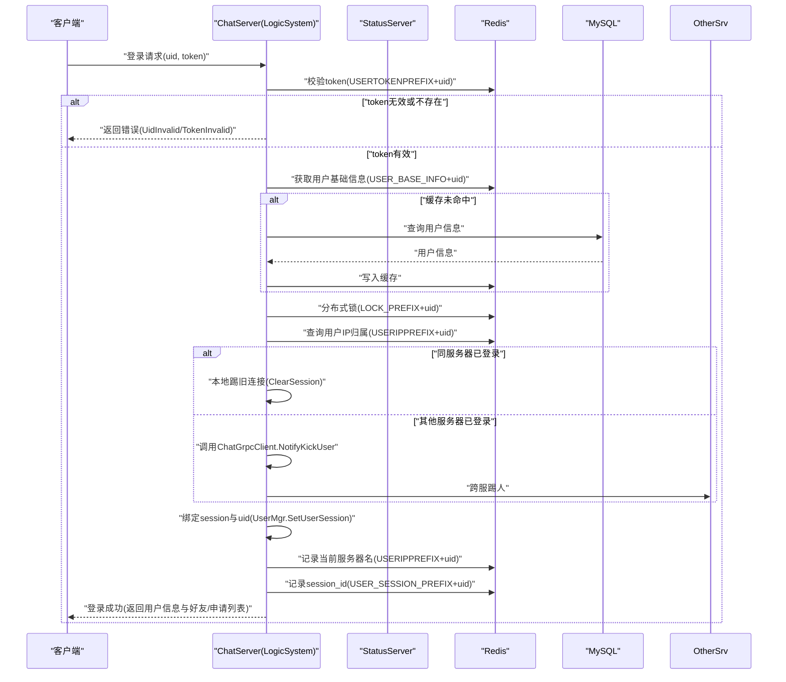

图表来源 
- [LogicSystem.cpp:116-254](file://server/ChatServer/src/LogicSystem.cpp#L116-L254)
- [RedisMgr.h:1-305](file://server/ChatServer/include/RedisMgr.h#L1-L305)
- [MysqlDao.h:1-270](file://server/ChatServer/include/MysqlDao.h#L1-L270)
- [ChatGrpcClient.h:1-120](file://server/ChatServer/include/ChatGrpcClient.h#L1-L120)
- [const.h:1-104](file://server/ChatServer/include/const.h#L1-L104)

## 详细组件分析

### UserMgr 用户管理器
- 职责：维护 uid 到 CSession 的映射，提供线程安全的 Get/Set/Rmv 接口。
- 并发控制：使用互斥量保护 _uid_to_session 容器。
- 多设备处理：RmvUserSession 比较 session_id，仅当一致时才移除，避免误删其他设备的会话。
- 生命周期：析构时清空映射。

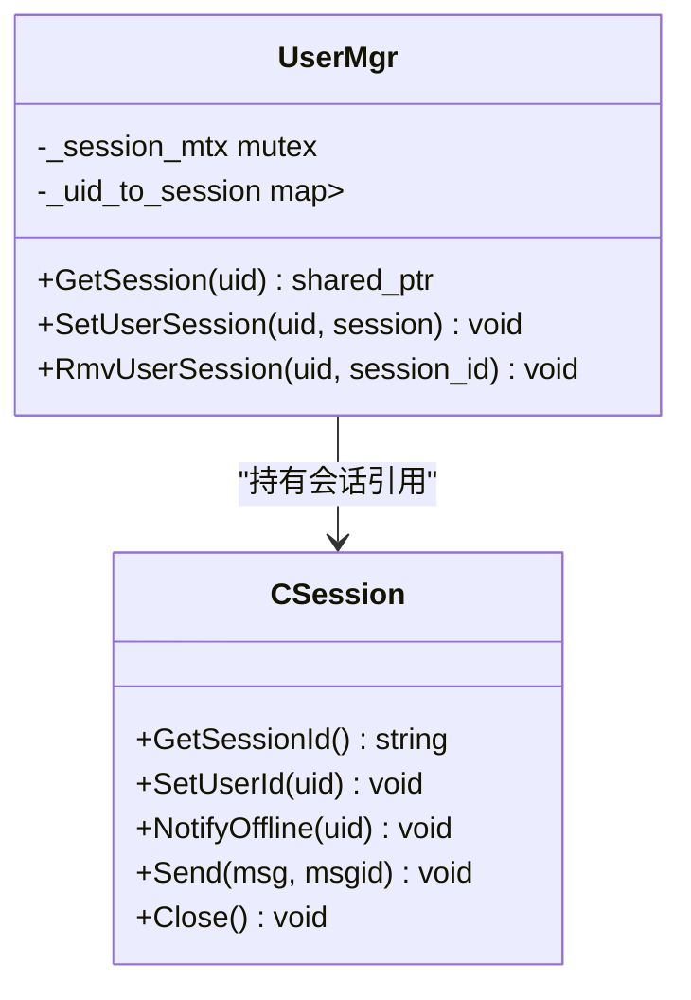

图表来源 
- [UserMgr.h:1-22](file://server/ChatServer/include/UserMgr.h#L1-L22)
- [UserMgr.cpp:1-50](file://server/ChatServer/src/UserMgr.cpp#L1-L50)
- [CSession.h:1-86](file://server/ChatServer/include/CSession.h#L1-L86)

章节来源
- [UserMgr.h:1-22](file://server/ChatServer/include/UserMgr.h#L1-L22)
- [UserMgr.cpp:1-50](file://server/ChatServer/src/UserMgr.cpp#L1-L50)

### CSession 会话与心跳
- 功能：封装 TCP socket、消息队列、异步读写、心跳时间戳、会话 ID、用户 UID。
- 心跳：IsHeartbeatExpired 判断超时；UpdateHeartbeat 更新时间；HeartBeatHandler 响应心跳。
- 异常处理：DealExceptionSession 处理异常连接；Close 关闭连接。
- 通知：NotifyOffline 通知下线；NotifyChatImgRecv 接收图片消息通知。

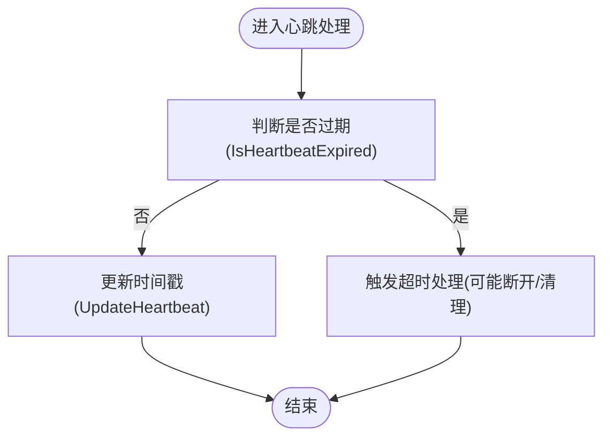

图表来源 
- [CSession.h:1-86](file://server/ChatServer/include/CSession.h#L1-L86)
- [LogicSystem.cpp:578-587](file://server/ChatServer/src/LogicSystem.cpp#L578-L587)

章节来源
- [CSession.h:1-86](file://server/ChatServer/include/CSession.h#L1-L86)
- [LogicSystem.cpp:578-587](file://server/ChatServer/src/LogicSystem.cpp#L578-L587)

### LogicSystem 业务逻辑与消息路由
- 消息队列：PostMsgToQue 入队，DealMsg 消费线程处理，按 msg_id 分发给对应回调。
- 回调注册：RegisterCallBacks 将 MSG_CHAT_LOGIN、ID_ADD_FRIEND_REQ、ID_AUTH_FRIEND_REQ、ID_TEXT_CHAT_MSG_REQ、ID_HEART_BEAT_REQ 等绑定到处理方法。
- 登录处理：LoginHandler 完成 token 校验、用户信息加载、分布式锁、踢人逻辑、会话绑定、Redis 状态更新。
- 好友申请：AddFriendApply 持久化申请、查找目标服务器、本地或跨服通知。
- 好友认证：AuthFriendApply 更新数据库、同步历史消息、通知对方。
- 文本聊天：DealChatTextMsg 批量插入消息、本地或跨服推送。
- 会话加载与私聊创建：GetUserThreadsHandler、CreatePrivateChat、LoadChatMsg。

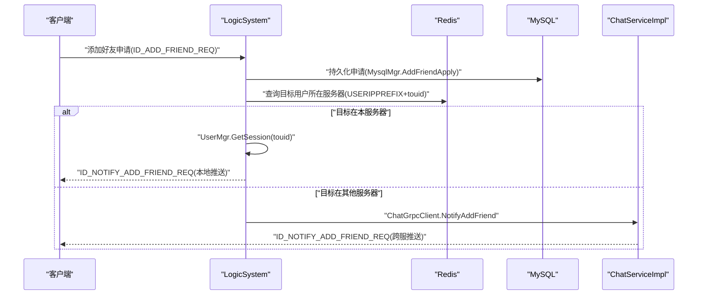

图表来源 
- [LogicSystem.cpp:281-358](file://server/ChatServer/src/LogicSystem.cpp#L281-L358)
- [ChatGrpcClient.h:1-120](file://server/ChatServer/include/ChatGrpcClient.h#L1-L120)
- [ChatServiceImpl.cpp:16-47](file://server/ChatServer/src/ChatServiceImpl.cpp#L16-L47)

章节来源
- [LogicSystem.h:1-61](file://server/ChatServer/include/LogicSystem.h#L1-L61)
- [LogicSystem.cpp:83-114](file://server/ChatServer/src/LogicSystem.cpp#L83-L114)
- [LogicSystem.cpp:116-254](file://server/ChatServer/src/LogicSystem.cpp#L116-L254)
- [LogicSystem.cpp:281-358](file://server/ChatServer/src/LogicSystem.cpp#L281-L358)
- [LogicSystem.cpp:360-478](file://server/ChatServer/src/LogicSystem.cpp#L360-L478)
- [LogicSystem.cpp:480-576](file://server/ChatServer/src/LogicSystem.cpp#L480-L576)

### ChatServiceImpl 跨服通知与踢人
- NotifyAddFriend：根据 touid 查找本地会话，若存在则直接推送好友申请通知。
- NotifyAuthFriend：认证通过后推送双方信息与历史消息。
- NotifyTextChatMsg：转发文本消息数组给目标用户。
- NotifyKickUser：收到跨服踢人请求后，查找会话并下发下线通知，清理连接。
- NotifyChatImgMsg：接收资源服务器图片消息通知并推送给目标用户。

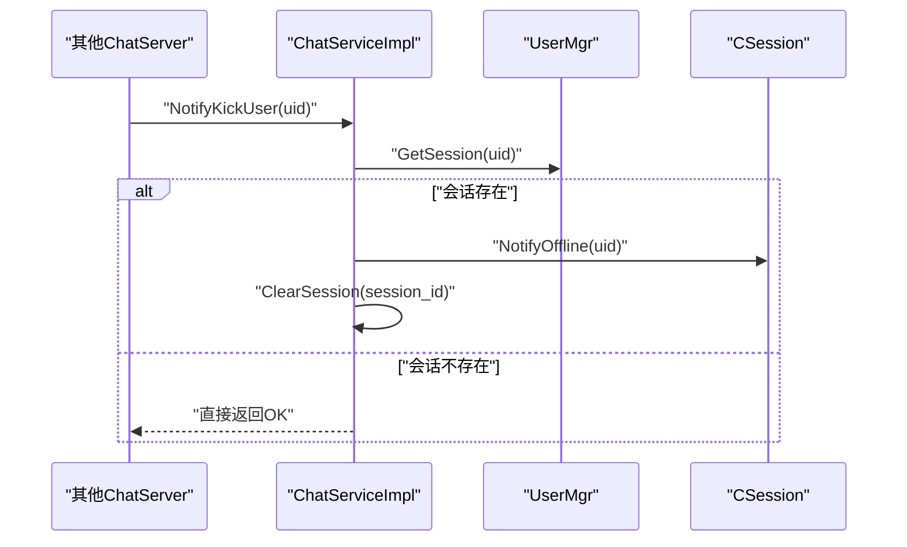

图表来源 
- [ChatServiceImpl.cpp:189-212](file://server/ChatServer/src/ChatServiceImpl.cpp#L189-L212)
- [UserMgr.h:1-22](file://server/ChatServer/include/UserMgr.h#L1-L22)
- [CSession.h:1-86](file://server/ChatServer/include/CSession.h#L1-L86)

章节来源
- [ChatServiceImpl.h:1-55](file://server/ChatServer/include/ChatServiceImpl.h#L1-L55)
- [ChatServiceImpl.cpp:16-47](file://server/ChatServer/src/ChatServiceImpl.cpp#L16-L47)
- [ChatServiceImpl.cpp:49-103](file://server/ChatServer/src/ChatServiceImpl.cpp#L49-L103)
- [ChatServiceImpl.cpp:105-139](file://server/ChatServer/src/ChatServiceImpl.cpp#L105-L139)
- [ChatServiceImpl.cpp:189-212](file://server/ChatServer/src/ChatServiceImpl.cpp#L189-L212)
- [ChatServiceImpl.cpp:219-242](file://server/ChatServer/src/ChatServiceImpl.cpp#L219-L242)

### 登录认证流程（与 StatusServer 交互）
- 客户端携带 uid 与 token 发起登录请求。
- ChatServer 从 Redis 校验 token（USERTOKENPREFIX+uid）。
- 校验成功后，从 Redis/MySQL 加载用户基础信息（USER_BASE_INFO+uid）。
- 使用分布式锁（LOCK_PREFIX+uid）保证登录原子性。
- 查询 USERIPPREFIX+uid 确定是否已在其他位置登录，必要时跨服踢人。
- 绑定 session 与 uid，记录当前服务器名与 session_id。
- 返回用户信息与好友/申请列表。

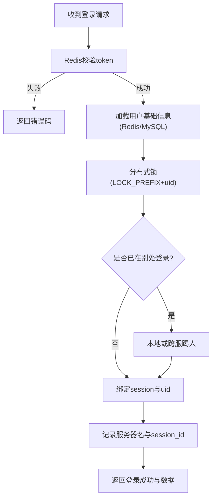

图表来源 
- [LogicSystem.cpp:116-254](file://server/ChatServer/src/LogicSystem.cpp#L116-L254)
- [RedisMgr.h:1-305](file://server/ChatServer/include/RedisMgr.h#L1-L305)
- [const.h:1-104](file://server/ChatServer/include/const.h#L1-L104)

章节来源
- [LogicSystem.cpp:116-254](file://server/ChatServer/src/LogicSystem.cpp#L116-L254)

### 好友关系增删改查与申请处理
- 申请添加：AddFriendApply 持久化申请，查找目标服务器，本地或跨服通知。
- 认证通过：AuthFriendApply 更新数据库，同步历史消息，通知对方。
- 联系人列表：GetFriendList 从 MySQL 获取好友列表，登录时一并返回。
- 申请列表：GetFriendApplyInfo 从 MySQL 获取待处理申请，登录时一并返回。

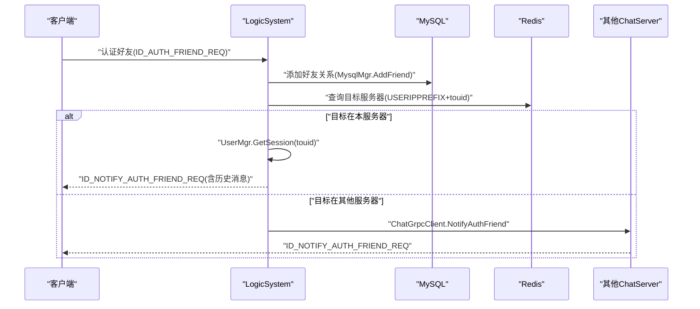

图表来源 
- [LogicSystem.cpp:360-478](file://server/ChatServer/src/LogicSystem.cpp#L360-L478)
- [ChatGrpcClient.h:1-120](file://server/ChatServer/include/ChatGrpcClient.h#L1-L120)
- [ChatServiceImpl.cpp:49-103](file://server/ChatServer/src/ChatServiceImpl.cpp#L49-L103)

章节来源
- [LogicSystem.cpp:281-358](file://server/ChatServer/src/LogicSystem.cpp#L281-L358)
- [LogicSystem.cpp:360-478](file://server/ChatServer/src/LogicSystem.cpp#L360-L478)
- [MysqlDao.h:245-262](file://server/ChatServer/include/MysqlDao.h#L245-L262)

### 会话生命周期管理（创建、更新、销毁）
- 创建：登录成功后，LogicSystem 绑定 session 与 uid，UserMgr.SetUserSession 建立映射。
- 更新：心跳更新（UpdateHeartbeat），Redis 中 session_id 保持最新。
- 销毁：客户端主动断开或异常连接触发 DealExceptionSession；跨服踢人触发 NotifyKickUser，清理会话并从 UserMgr 移除。

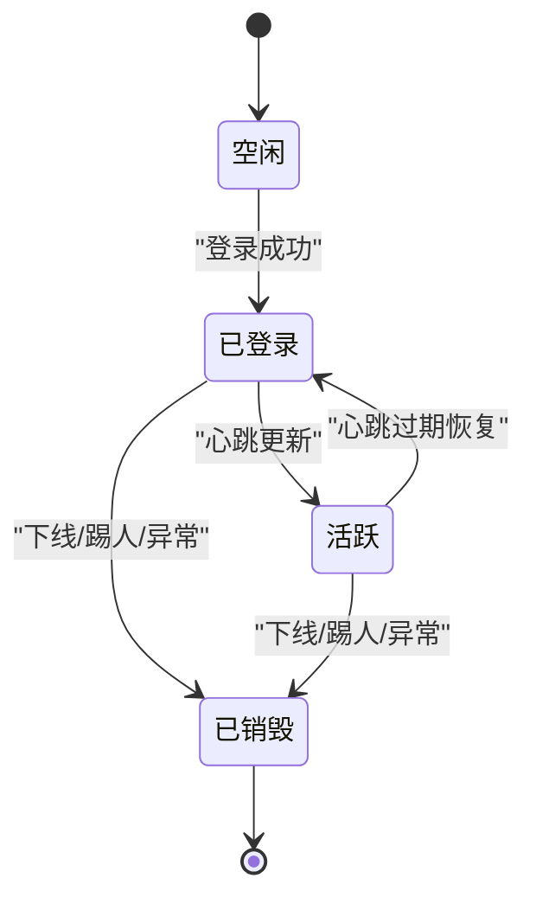

图表来源 
- [UserMgr.cpp:27-44](file://server/ChatServer/src/UserMgr.cpp#L27-L44)
- [ChatServiceImpl.cpp:189-212](file://server/ChatServer/src/ChatServiceImpl.cpp#L189-L212)
- [CSession.h:1-86](file://server/ChatServer/include/CSession.h#L1-L86)

章节来源
- [UserMgr.cpp:1-50](file://server/ChatServer/src/UserMgr.cpp#L1-L50)
- [ChatServiceImpl.cpp:189-212](file://server/ChatServer/src/ChatServiceImpl.cpp#L189-L212)

### 用户状态同步与多设备登录处理
- 状态存储：USERIPPREFIX+uid 记录用户当前所在服务器名；USER_SESSION_PREFIX+uid 记录 session_id。
- 多设备冲突：登录时使用分布式锁确保原子性；若发现已在别处登录，则本地或跨服踢人。
- 跨服踢人：通过 ChatGrpcClient.NotifyKickUser 通知其他 ChatServer 实例执行清理。

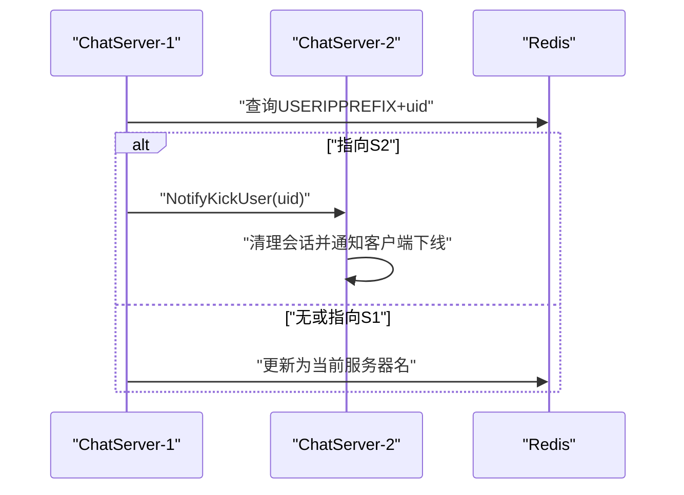

图表来源 
- [LogicSystem.cpp:199-251](file://server/ChatServer/src/LogicSystem.cpp#L199-L251)
- [ChatGrpcClient.h:1-120](file://server/ChatServer/include/ChatGrpcClient.h#L1-L120)
- [ChatServiceImpl.cpp:189-212](file://server/ChatServer/src/ChatServiceImpl.cpp#L189-L212)

章节来源
- [LogicSystem.cpp:199-251](file://server/ChatServer/src/LogicSystem.cpp#L199-L251)
- [RedisMgr.h:1-305](file://server/ChatServer/include/RedisMgr.h#L1-L305)

## 依赖关系分析
- LogicSystem 依赖 UserMgr、RedisMgr、MysqlDao、ChatGrpcClient、StatusGrpcClient。
- ChatServiceImpl 依赖 UserMgr、RedisMgr、MysqlDao。
- UserMgr 依赖 CSession。
- RedisMgr 与 MysqlDao 提供底层数据与缓存能力。

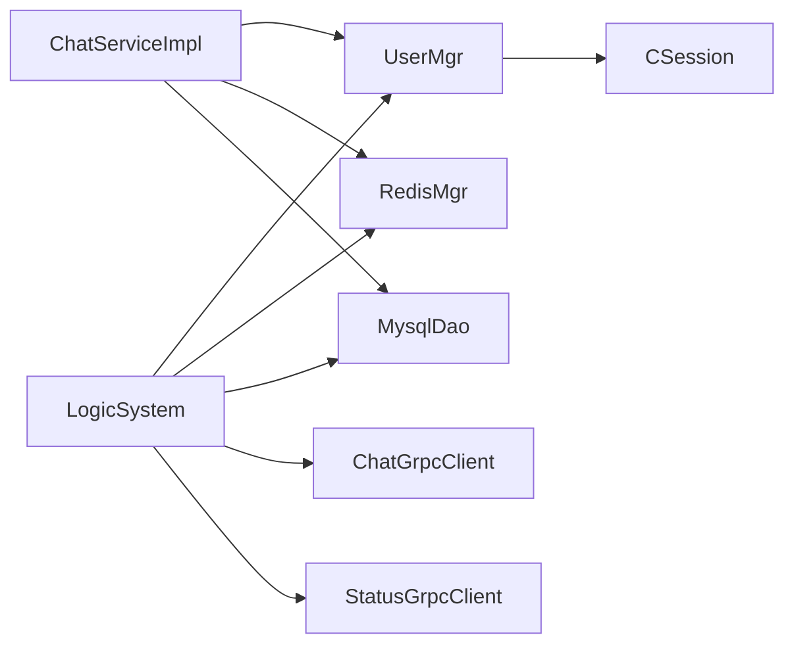

图表来源 
- [LogicSystem.h:1-61](file://server/ChatServer/include/LogicSystem.h#L1-L61)
- [ChatServiceImpl.h:1-55](file://server/ChatServer/include/ChatServiceImpl.h#L1-L55)
- [UserMgr.h:1-22](file://server/ChatServer/include/UserMgr.h#L1-L22)
- [CSession.h:1-86](file://server/ChatServer/include/CSession.h#L1-L86)

章节来源
- [LogicSystem.h:1-61](file://server/ChatServer/include/LogicSystem.h#L1-L61)
- [ChatServiceImpl.h:1-55](file://server/ChatServer/include/ChatServiceImpl.h#L1-L55)
- [UserMgr.h:1-22](file://server/ChatServer/include/UserMgr.h#L1-L22)
- [CSession.h:1-86](file://server/ChatServer/include/CSession.h#L1-L86)

## 性能考量
- 连接池：RedisMgr 与 MysqlDao 均实现连接池与自动重连，降低连接开销与故障影响。
- 缓存策略：用户基础信息优先从 Redis 读取，未命中再回源 MySQL 并写回缓存。
- 消息队列：LogicSystem 使用独立工作线程消费消息队列，避免阻塞 IO。
- 分布式锁：登录关键路径加锁，避免竞态条件，提升一致性。
- 心跳机制：CSession 维护心跳时间戳，及时清理不活跃连接，释放资源。

[本节为通用指导，不直接分析具体文件]

## 故障排查指南
- 登录失败：检查 Redis 中 token 是否存在且匹配；确认 USER_BASE_INFO+uid 是否可加载；查看分布式锁是否被占用。
- 好友申请未送达：确认目标用户所在服务器是否正确；检查跨服 gRPC 调用是否成功；验证 ChatServiceImpl 是否接收到通知。
- 聊天消息未推送：检查目标用户会话是否存在；确认跨服推送是否成功；核对消息唯一 ID 与状态。
- 踢人无效：检查 USERIPPREFIX+uid 是否指向正确服务器；确认 ChatServiceImpl.NotifyKickUser 是否被执行；验证会话清理是否完成。
- 心跳超时：检查客户端心跳发送频率；确认服务器心跳处理是否正常；观察连接池健康检查日志。

章节来源
- [LogicSystem.cpp:116-254](file://server/ChatServer/src/LogicSystem.cpp#L116-L254)
- [ChatServiceImpl.cpp:189-212](file://server/ChatServer/src/ChatServiceImpl.cpp#L189-L212)
- [RedisMgr.h:1-305](file://server/ChatServer/include/RedisMgr.h#L1-L305)
- [MysqlDao.h:1-270](file://server/ChatServer/include/MysqlDao.h#L1-L270)

## 结论
ChatServer 的用户管理系统以 UserMgr 为核心，结合 LogicSystem 的业务编排、Redis/MySQL 的数据与缓存、以及 gRPC 的跨服通信，实现了健壮的登录认证、好友关系管理与会话生命周期控制。通过分布式锁与心跳机制，系统能够有效处理多设备登录与状态同步，保障用户体验与系统稳定性。

[本节为总结，不直接分析具体文件]

## 附录：数据结构与操作示例
- UserInfo：用户基本信息（name、pwd、uid、email、nick、desc、sex、icon、back）。
- ApplyInfo：好友申请信息（uid、name、desc、icon、nick、sex、status）。
- ChatThreadInfo：聊天线程信息（thread_id、type、user1_id、user2_id）。
- ChatMessage：聊天消息（message_id、thread_id、sender_id、recv_id、unique_id、content、chat_time、status、msg_type）。
- PageResult：分页结果（messages、load_more、next_cursor）。
- 错误码与消息ID：ErrorCodes、MSG_IDS、MsgStatus、键前缀（USER_BASE_INFO、USERTOKENPREFIX、USERIPPREFIX 等）。

章节来源
- [data.h:1-65](file://server/ChatServer/include/data.h#L1-L65)
- [const.h:1-104](file://server/ChatServer/include/const.h#L1-L104)