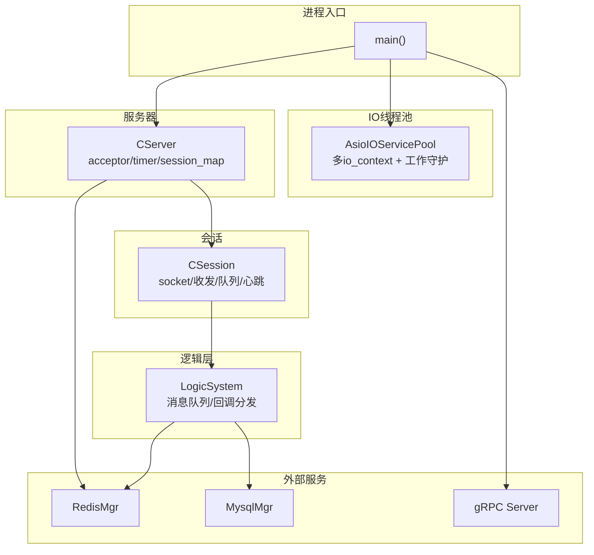
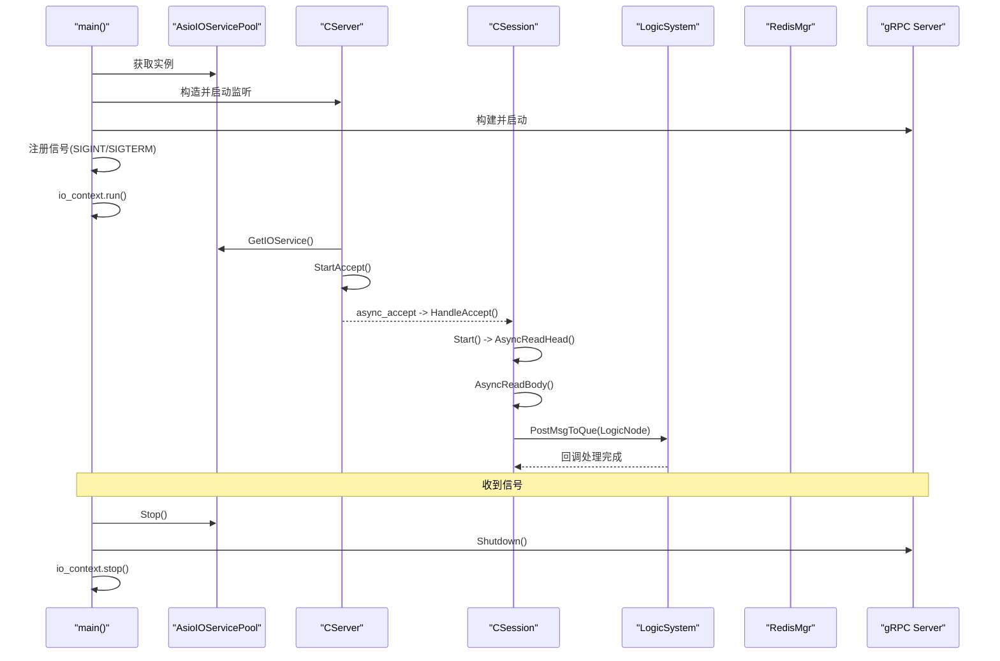
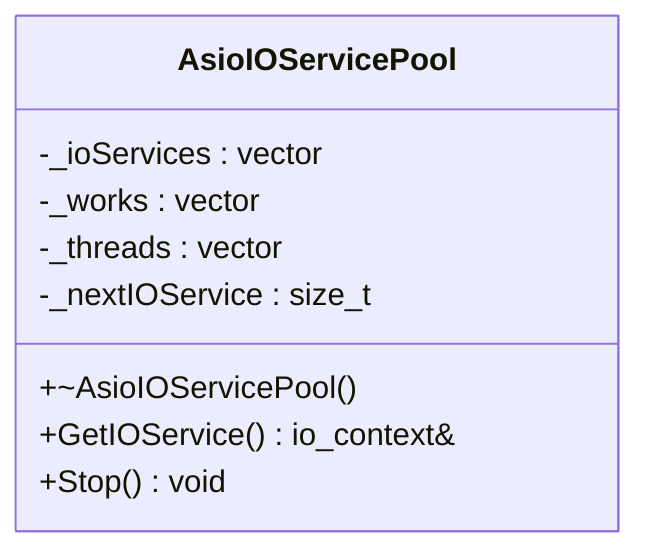
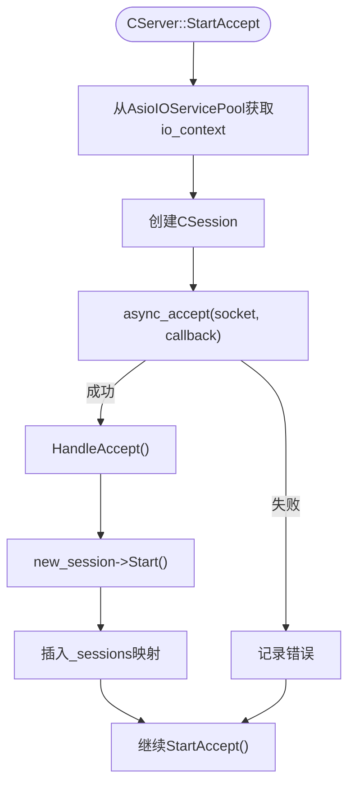
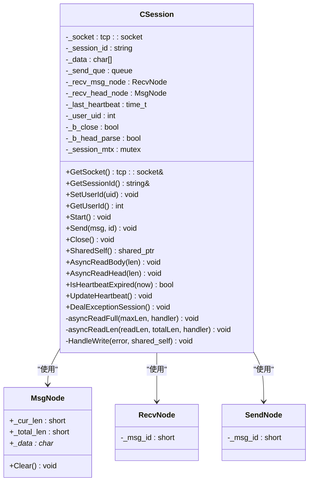
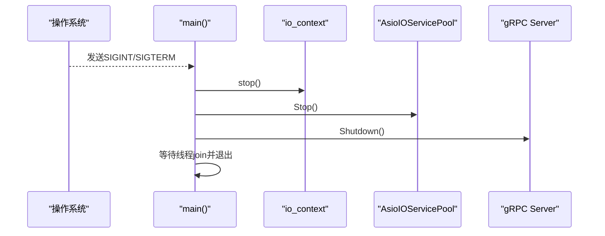
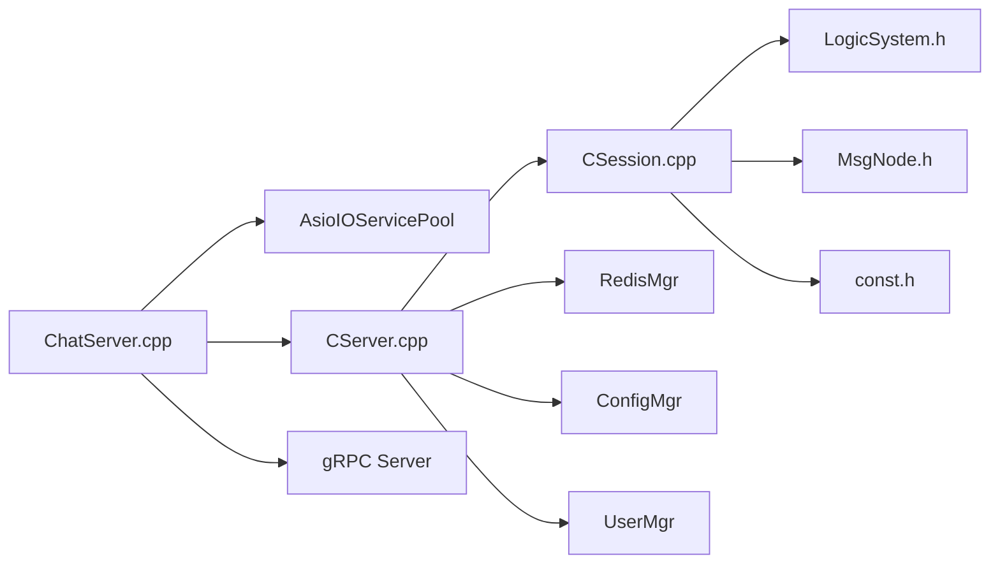

# 网络通信层

<cite>
**本文引用的文件**   
- [CServer.h](file://server/ChatServer/include/CServer.h)
- [CSession.h](file://server/ChatServer/include/CSession.h)
- [AsioIOServicePool.h](file://server/ChatServer/include/AsioIOServicePool.h)
- [CServer.cpp](file://server/ChatServer/src/CServer.cpp)
- [CSession.cpp](file://server/ChatServer/src/CSession.cpp)
- [AsioIOServicePool.cpp](file://server/ChatServer/src/AsioIOServicePool.cpp)
- [MsgNode.h](file://server/ChatServer/include/MsgNode.h)
- [const.h](file://server/ChatServer/include/const.h)
- [LogicSystem.h](file://server/ChatServer/include/LogicSystem.h)
- [ChatServer.cpp](file://server/ChatServer/src/ChatServer.cpp)
- [chatserver1.ini](file://server/ChatServer/config/chatserver1.ini)
</cite>

## 目录
1. [简介](#简介)
2. [项目结构](#项目结构)
3. [核心组件](#核心组件)
4. [架构总览](#架构总览)
5. [详细组件分析](#详细组件分析)
6. [依赖关系分析](#依赖关系分析)
7. [性能考量](#性能考量)
8. [故障排查指南](#故障排查指南)
9. [结论](#结论)
10. [附录：扩展协议与处理器示例](#附录扩展协议与处理器示例)

## 简介
本技术文档聚焦于 ChatServer 的网络通信层，基于 Boost.Asio 实现高性能异步 I/O。内容涵盖 AsioIOServicePool 线程池设计、CServer 主循环与端口监听、连接接受处理、CSession 会话生命周期管理（建立、维护、断开）、消息异步读写与粘包拆包、信号处理与优雅关闭、错误处理与异常恢复策略，并提供扩展新协议或新增连接处理器的实践指引。

## 项目结构
ChatServer 的通信层主要由以下模块组成：
- AsioIOServicePool：多 io_context 线程池，轮询分配 IO 服务，提升并发能力
- CServer：服务器主循环，负责监听端口、接受连接、定时器心跳检测、会话集合管理
- CSession：单个 TCP 连接的会话对象，封装 socket、收发缓冲、粘包拆包、发送队列、心跳与异常清理
- MsgNode/RecvNode/SendNode：消息节点抽象，承载头部与数据体
- LogicSystem：逻辑系统单例，提供消息分发队列与回调注册机制
- 入口程序 ChatServer.cpp：初始化配置、启动 gRPC、注册信号处理、运行 io_context

**图表来源** 
- [ChatServer.cpp:20-79](file://server/ChatServer/src/ChatServer.cpp#L20-L79)
- [AsioIOServicePool.cpp:1-43](file://server/ChatServer/src/AsioIOServicePool.cpp#L1-L43)
- [CServer.cpp:8-38](file://server/ChatServer/src/CServer.cpp#L8-L38)
- [CSession.cpp:42-44](file://server/ChatServer/src/CSession.cpp#L42-L44)
- [LogicSystem.h:18-59](file://server/ChatServer/include/LogicSystem.h#L18-L59)

**章节来源**
- [ChatServer.cpp:20-79](file://server/ChatServer/src/ChatServer.cpp#L20-L79)
- [chatserver1.ini:1-30](file://server/ChatServer/config/chatserver1.ini#L1-L30)

## 核心组件
- AsioIOServicePool：以硬件并发数为默认大小创建多个 io_context，每个绑定一个 work_guard 防止 run() 提前退出；通过 GetIOService() 轮询返回 io_context，Stop() 统一停止并 join 线程
- CServer：持有 acceptor 与 timer，StartAccept() 异步接受连接，HandleAccept() 启动会话并加入会话表；on_timer() 定时扫描过期会话并清理
- CSession：封装 socket、发送队列、接收缓冲、粘包拆包（先读固定长度头部，再按长度读体），异步写 HandleWrite() 串行出队发送；心跳更新与过期判断；异常时释放分布式锁并清理 Redis 中的用户会话信息
- MsgNode/RecvNode/SendNode：统一的消息容器，支持清空与长度控制
- LogicSystem：单例，维护消息队列与回调映射，将网络事件投递到独立线程处理

**章节来源**
- [AsioIOServicePool.h:8-27](file://server/ChatServer/include/AsioIOServicePool.h#L8-L27)
- [AsioIOServicePool.cpp:4-43](file://server/ChatServer/src/AsioIOServicePool.cpp#L4-L43)
- [CServer.h:10-31](file://server/ChatServer/include/CServer.h#L10-L31)
- [CServer.cpp:8-133](file://server/ChatServer/src/CServer.cpp#L8-L133)
- [CSession.h:28-76](file://server/ChatServer/include/CSession.h#L28-L76)
- [CSession.cpp:13-338](file://server/ChatServer/src/CSession.cpp#L13-L338)
- [MsgNode.h:9-48](file://server/ChatServer/include/MsgNode.h#L9-L48)
- [LogicSystem.h:18-59](file://server/ChatServer/include/LogicSystem.h#L18-L59)

## 架构总览
下图展示从 main 启动到 Accept、Read/Write、逻辑处理的完整调用链，以及信号触发时的优雅关闭流程。

**图表来源** 
- [ChatServer.cpp:20-79](file://server/ChatServer/src/ChatServer.cpp#L20-L79)
- [CServer.cpp:34-38](file://server/ChatServer/src/CServer.cpp#L34-L38)
- [CSession.cpp:42-44](file://server/ChatServer/src/CSession.cpp#L42-L44)
- [CSession.cpp:90-131](file://server/ChatServer/src/CSession.cpp#L90-L131)
- [LogicSystem.h:22-28](file://server/ChatServer/include/LogicSystem.h#L22-L28)

## 详细组件分析

### AsioIOServicePool 线程池设计与实现
- 设计要点
  - 多 io_context 并行执行，避免单点阻塞
  - 每个 io_context 绑定 work_guard，确保 run() 不会在无任务时退出
  - 轮询选择下一个 io_context，保证负载均衡
  - Stop() 顺序：stop 所有 context -> 释放 work_guard -> join 线程
- 复杂度与性能
  - GetIOService() O(1)，无锁轮询索引
  - 线程数默认等于硬件并发，适合高并发网络 I/O
- 关键接口
  - GetIOService()：返回引用，供 acceptor/socket 使用
  - Stop()：优雅停止，等待线程退出

**图表来源** 
- [AsioIOServicePool.h:8-27](file://server/ChatServer/include/AsioIOServicePool.h#L8-L27)
- [AsioIOServicePool.cpp:4-43](file://server/ChatServer/src/AsioIOServicePool.cpp#L4-L43)

**章节来源**
- [AsioIOServicePool.h:8-27](file://server/ChatServer/include/AsioIOServicePool.h#L8-L27)
- [AsioIOServicePool.cpp:4-43](file://server/ChatServer/src/AsioIOServicePool.cpp#L4-L43)

### CServer 服务器主循环与端口监听
- 启动流程
  - 构造时创建 acceptor 监听端口，打印监听信息
  - StartAccept() 从 AsioIOServicePool 获取 io_context，创建新 CSession，发起 async_accept
  - HandleAccept() 成功则启动会话并加入 _sessions 表，失败记录错误
- 定时器与心跳
  - on_timer() 每 60s 遍历会话副本，检查心跳是否过期，关闭并收集待清理会话
  - 统计在线会话数量并写入 Redis，用于监控
  - 再次设置定时器，形成周期性任务
- 会话管理
  - ClearSession()：删除本地 map 条目，并通知 UserMgr 解除用户与会话关联
  - GetSession()/CheckValid()：线程安全查询会话有效性

**图表来源** 
- [CServer.cpp:34-38](file://server/ChatServer/src/CServer.cpp#L34-L38)
- [CServer.cpp:21-32](file://server/ChatServer/src/CServer.cpp#L21-L32)

**章节来源**
- [CServer.cpp:8-133](file://server/ChatServer/src/CServer.cpp#L8-L133)
- [CServer.h:10-31](file://server/ChatServer/include/CServer.h#L10-L31)

### CSession 会话管理与消息处理
- 生命周期
  - 构造：生成唯一 session_id，初始化接收头节点与心跳时间
  - Start()：开始读取头部
  - Close()：关闭 socket，标记关闭状态
- 粘包拆包
  - 先读取固定长度的 HEAD_TOTAL_LEN（包含 msg_id 与 msg_len）
  - 校验 msg_id/msg_len 合法性，构造 RecvNode，再按长度读取 body
  - 成功后更新心跳，投递到 LogicSystem 队列，继续监听头部
- 异步写
  - Send() 将消息入队，若队列为空则立即发起 async_write
  - HandleWrite() 在回调中出队并继续发送，错误则关闭并清理
- 心跳与异常
  - IsHeartbeatExpired()：超过阈值判定为过期
  - UpdateHeartbeat()：每次成功接收后更新时间
  - DealExceptionSession()：获取分布式锁，校验 Redis 中的会话一致性，清理用户会话、IP、Token 等缓存

**图表来源** 
- [CSession.h:28-76](file://server/ChatServer/include/CSession.h#L28-L76)
- [MsgNode.h:9-48](file://server/ChatServer/include/MsgNode.h#L9-L48)

**章节来源**
- [CSession.cpp:13-338](file://server/ChatServer/src/CSession.cpp#L13-L338)
- [CSession.h:28-76](file://server/ChatServer/include/CSession.h#L28-L76)
- [MsgNode.h:9-48](file://server/ChatServer/include/MsgNode.h#L9-L48)

### 信号处理与优雅关闭
- 信号注册：在 main 中使用 boost::asio::signal_set 注册 SIGINT/SIGTERM
- 处理逻辑：收到信号后依次停止 io_context、AsioIOServicePool、gRPC Server，然后 join 线程并退出
- 资源清理：Defer 机制确保 Redis 登录计数键清理与连接关闭

**图表来源** 
- [ChatServer.cpp:59-73](file://server/ChatServer/src/ChatServer.cpp#L59-L73)

**章节来源**
- [ChatServer.cpp:20-79](file://server/ChatServer/src/ChatServer.cpp#L20-L79)

### 错误处理与异常恢复策略
- 网络层错误
  - async_read_some/async_write 回调中捕获 error_code，记录日志并关闭连接
  - 长度不匹配或非法 msg_id/msg_len 直接关闭并清理会话
- 会话级异常
  - DealExceptionSession() 使用分布式锁保护清理逻辑，避免竞态
  - 校验 Redis 中当前会话是否与本地一致，不一致说明异地登录，直接返回
- 资源清理
  - 清理 Redis 中的用户会话、IP、Token 等键
  - 从 CServer::_sessions 移除本地会话映射

**章节来源**
- [CSession.cpp:90-131](file://server/ChatServer/src/CSession.cpp#L90-L131)
- [CSession.cpp:196-220](file://server/ChatServer/src/CSession.cpp#L196-L220)
- [CSession.cpp:304-336](file://server/ChatServer/src/CSession.cpp#L304-L336)
- [CServer.cpp:41-53](file://server/ChatServer/src/CServer.cpp#L41-L53)

## 依赖关系分析
- CServer 依赖 AsioIOServicePool 获取 io_context，依赖 CSession 管理连接，依赖 RedisMgr/ConfigMgr/UserMgr 进行状态同步
- CSession 依赖 MsgNode/RecvNode/SendNode 进行消息封装，依赖 LogicSystem 投递业务逻辑，依赖 RedisMgr 做分布式锁与会话一致性校验
- 入口程序依赖 ConfigMgr 读取配置，依赖 gRPC 提供服务，依赖 AsioIOServicePool 与 CServer 启动网络栈

**图表来源** 
- [ChatServer.cpp:20-79](file://server/ChatServer/src/ChatServer.cpp#L20-L79)
- [CServer.cpp:1-133](file://server/ChatServer/src/CServer.cpp#L1-L133)
- [CSession.cpp:1-338](file://server/ChatServer/src/CSession.cpp#L1-L338)
- [LogicSystem.h:18-59](file://server/ChatServer/include/LogicSystem.h#L18-L59)
- [MsgNode.h:9-48](file://server/ChatServer/include/MsgNode.h#L9-L48)
- [const.h:38-79](file://server/ChatServer/include/const.h#L38-L79)

**章节来源**
- [ChatServer.cpp:20-79](file://server/ChatServer/src/ChatServer.cpp#L20-L79)
- [CServer.cpp:1-133](file://server/ChatServer/src/CServer.cpp#L1-L133)
- [CSession.cpp:1-338](file://server/ChatServer/src/CSession.cpp#L1-L338)

## 性能考量
- 多线程 IO 模型：多 io_context 降低竞争，提高吞吐
- 异步 I/O：避免阻塞，充分利用内核事件驱动
- 发送队列：限制最大队列长度，防止内存暴涨；串行出队减少锁竞争
- 粘包拆包：固定头部长度解析，避免复杂分帧逻辑
- 心跳检测：定期清理空闲连接，释放资源
- 分布式锁：清理逻辑加锁，避免重复清理与竞态

[本节为通用指导，不直接分析具体文件]

## 故障排查指南
- 常见问题定位
  - 连接接受失败：查看 HandleAccept 的错误码与日志
  - 读取长度不匹配：检查客户端发送的头部与数据长度是否一致
  - 非法 msg_id/msg_len：确认协议定义与序列化是否正确
  - 发送队列满：检查下游处理速度或调整 MAX_SENDQUE
  - 心跳超时：检查客户端心跳频率与服务器阈值
- 调试建议
  - 开启详细日志输出（如 receive data、handle read/write failed）
  - 使用 Redis 监控登录计数与会话键
  - 使用抓包工具验证网络报文格式

**章节来源**
- [CServer.cpp:21-32](file://server/ChatServer/src/CServer.cpp#L21-L32)
- [CSession.cpp:90-131](file://server/ChatServer/src/CSession.cpp#L90-L131)
- [CSession.cpp:196-220](file://server/ChatServer/src/CSession.cpp#L196-L220)
- [const.h:38-79](file://server/ChatServer/include/const.h#L38-L79)

## 结论
ChatServer 的网络通信层采用基于 Boost.Asio 的高性能异步 I/O 模型，结合多 io_context 线程池、严格的粘包拆包与心跳机制，实现了稳定可靠的 TCP 连接管理。通过分布式锁与会话一致性校验，保证了异常场景下的资源清理正确性。整体架构清晰、可扩展性强，便于后续添加新协议与处理器。

[本节为总结，不直接分析具体文件]

## 附录：扩展协议与处理器示例
- 扩展新协议步骤
  - 在 const.h 的 MSG_IDS 枚举中添加新的消息 ID
  - 在 CSession 的 AsyncReadHead/AsyncReadBody 中保持现有解析流程不变（已支持任意 msg_id/msg_len）
  - 在 LogicSystem 中注册新的回调函数，处理新协议的业务逻辑
  - 如需自定义发送格式，可在 Send() 中组装新协议的头部与数据体
- 示例路径参考
  - 新增消息 ID：[const.h:49-79](file://server/ChatServer/include/const.h#L49-L79)
  - 注册回调：[LogicSystem.h:22-28](file://server/ChatServer/include/LogicSystem.h#L22-L28)
  - 发送消息：[CSession.cpp:46-78](file://server/ChatServer/src/CSession.cpp#L46-L78)

**章节来源**
- [const.h:49-79](file://server/ChatServer/include/const.h#L49-L79)
- [LogicSystem.h:22-28](file://server/ChatServer/include/LogicSystem.h#L22-L28)
- [CSession.cpp:46-78](file://server/ChatServer/src/CSession.cpp#L46-L78)