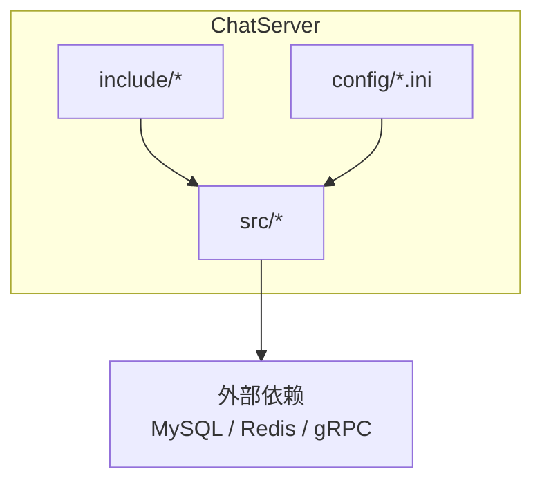
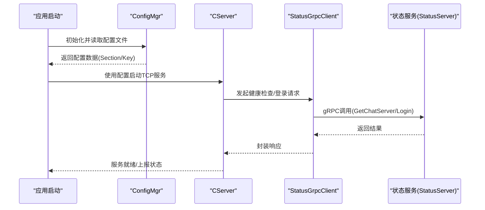
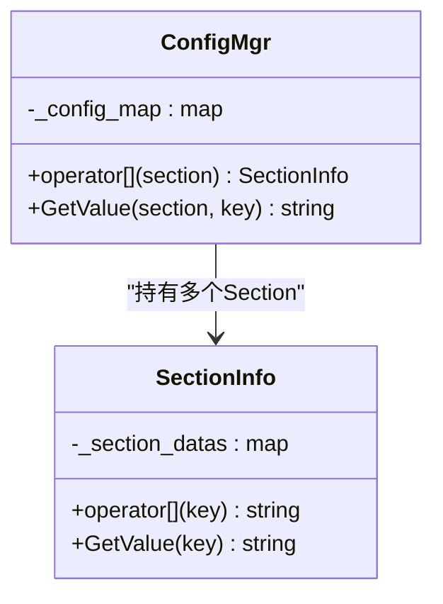
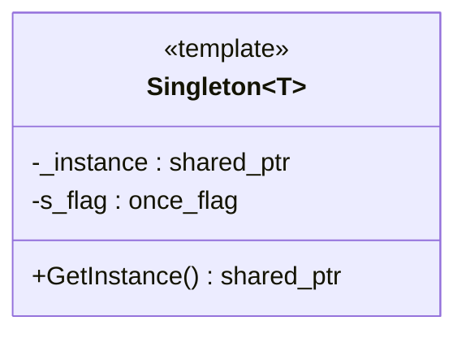
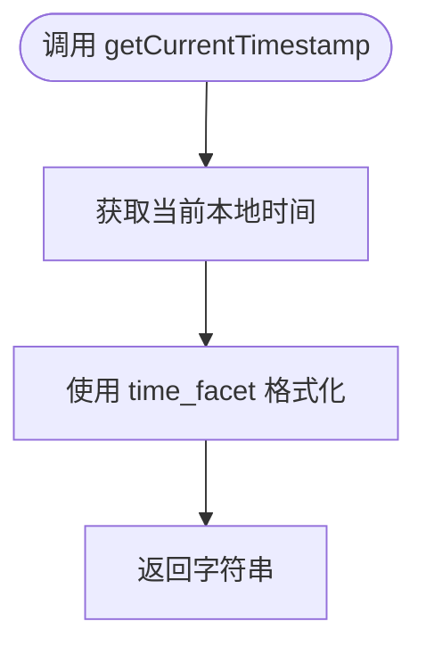
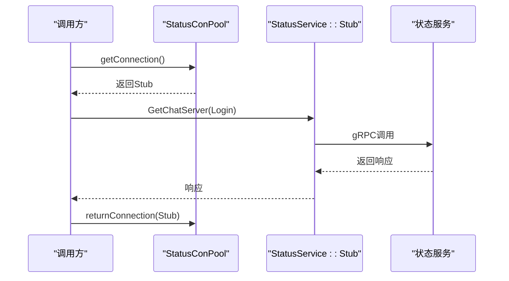
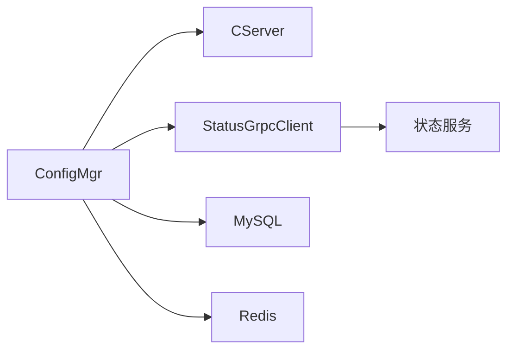

# 配置与监控

<cite>
**本文引用的文件**   
- [ConfigMgr.h](file://server/ChatServer/include/ConfigMgr.h)
- [ConfigMgr.cpp](file://server/ChatServer/src/ConfigMgr.cpp)
- [Singleton.h](file://server/ChatServer/include/Singleton.h)
- [utils.h](file://server/ChatServer/include/utils.h)
- [utils.cpp](file://server/ChatServer/src/utils.cpp)
- [chatserver1.ini](file://server/ChatServer/config/chatserver1.ini)
- [chatserver2.ini](file://server/ChatServer/config/chatserver2.ini)
- [StatusGrpcClient.h](file://server/ChatServer/include/StatusGrpcClient.h)
- [StatusGrpcClient.cpp](file://server/ChatServer/src/StatusGrpcClient.cpp)
- [CServer.h](file://server/ChatServer/include/CServer.h)
</cite>

## 目录
1. [简介](#简介)
2. [项目结构](#项目结构)
3. [核心组件](#核心组件)
4. [架构总览](#架构总览)
5. [详细组件分析](#详细组件分析)
6. [依赖关系分析](#依赖关系分析)
7. [性能考量](#性能考量)
8. [故障排查指南](#故障排查指南)
9. [结论](#结论)
10. [附录](#附录)

## 简介
本技术文档聚焦于 ChatServer 的配置管理与监控系统，围绕以下目标展开：
- 深入解析 ConfigMgr 配置管理器的实现，包括配置文件解析、动态配置更新策略与环境变量支持方案。
- 详细说明 Singleton 单例模式的实现，确保全局唯一实例的正确性与线程安全。
- 阐述 utils 工具类的辅助功能，如时间戳获取等通用能力。
- 解释服务监控指标收集、性能统计与健康检查机制的设计思路与落地方式。
- 说明配置文件格式规范、热重载机制与配置验证规则，并提供最佳实践与常见问题解决方案。

## 项目结构
ChatServer 相关代码位于 server/ChatServer 目录下，关键目录与职责如下：
- include: 头文件定义，包含配置管理器、单例模板、gRPC 客户端、服务器会话等接口。
- src: 具体实现，包含配置加载、gRPC 客户端连接池、服务端启动与心跳定时器等。
- config: 运行期配置文件（INI 格式），用于描述服务端口、数据库、缓存、对端节点等信息。

图表来源 
- [ConfigMgr.h:1-84](file://server/ChatServer/include/ConfigMgr.h#L1-L84)
- [ConfigMgr.cpp:1-50](file://server/ChatServer/src/ConfigMgr.cpp#L1-L50)
- [chatserver1.ini:1-30](file://server/ChatServer/config/chatserver1.ini#L1-L30)
- [chatserver2.ini:1-30](file://server/ChatServer/config/chatserver2.ini#L1-L30)

章节来源
- [ConfigMgr.h:1-84](file://server/ChatServer/include/ConfigMgr.h#L1-L84)
- [ConfigMgr.cpp:1-50](file://server/ChatServer/src/ConfigMgr.cpp#L1-L50)
- [chatserver1.ini:1-30](file://server/ChatServer/config/chatserver1.ini#L1-L30)
- [chatserver2.ini:1-30](file://server/ChatServer/config/chatserver2.ini#L1-L30)

## 核心组件
- 配置管理器 ConfigMgr：负责读取 INI 配置文件，提供按 Section 和 Key 的访问接口；当前为进程内静态初始化加载。
- 单例模板 Singleton：基于 std::once_flag 与 shared_ptr 的线程安全单例模式，避免重复构造与拷贝。
- 工具类 utils：提供时间戳格式化等通用方法，便于日志与审计。
- 状态 gRPC 客户端 StatusGrpcClient：通过连接池调用状态服务，完成健康检查与登录校验等。

章节来源
- [ConfigMgr.h:46-82](file://server/ChatServer/include/ConfigMgr.h#L46-L82)
- [ConfigMgr.cpp:1-50](file://server/ChatServer/src/ConfigMgr.cpp#L1-L50)
- [Singleton.h:1-33](file://server/ChatServer/include/Singleton.h#L1-L33)
- [utils.h:1-7](file://server/ChatServer/include/utils.h#L1-L7)
- [utils.cpp:1-15](file://server/ChatServer/src/utils.cpp#L1-L15)
- [StatusGrpcClient.h:1-99](file://server/ChatServer/include/StatusGrpcClient.h#L1-L99)
- [StatusGrpcClient.cpp:1-53](file://server/ChatServer/src/StatusGrpcClient.cpp#L1-L53)

## 架构总览
下图展示了 ChatServer 在运行时如何从配置文件加载参数，并通过 gRPC 客户端与状态服务交互，形成“配置—服务—监控”的闭环。

图表来源 
- [ConfigMgr.cpp:1-50](file://server/ChatServer/src/ConfigMgr.cpp#L1-L50)
- [CServer.h:1-33](file://server/ChatServer/include/CServer.h#L1-L33)
- [StatusGrpcClient.cpp:1-53](file://server/ChatServer/src/StatusGrpcClient.cpp#L1-L53)
- [StatusGrpcClient.h:1-99](file://server/ChatServer/include/StatusGrpcClient.h#L1-L99)

## 详细组件分析

### ConfigMgr 配置管理器
- 设计要点
  - 使用 Boost.PropertyTree 解析 INI 文件，将每个 Section 映射到 SectionInfo，内部以 map<string,string> 存储键值。
  - 提供 operator[] 与 GetValue(section,key) 两种访问方式，便于上层按需取值。
  - 构造函数中定位工作目录下的 config.ini 并一次性加载，未实现热重载。
- 数据结构与复杂度
  - SectionInfo 内部 map 查找 O(logN)，整体内存占用与配置项数量线性相关。
- 错误处理
  - 缺失 Section/Key 时返回空字符串，需在上层做非空校验。
- 扩展建议
  - 增加环境变量覆盖机制（例如以 ENV_ 前缀的环境变量覆盖对应 key）。
  - 引入增量热重载：监听文件变更事件，原子替换内存中的配置快照，保证并发读安全。
  - 增加类型转换与校验（端口范围、IP 合法性、必填字段校验）。

图表来源 
- [ConfigMgr.h:9-82](file://server/ChatServer/include/ConfigMgr.h#L9-L82)
- [ConfigMgr.cpp:1-50](file://server/ChatServer/src/ConfigMgr.cpp#L1-L50)

章节来源
- [ConfigMgr.h:9-82](file://server/ChatServer/include/ConfigMgr.h#L9-L82)
- [ConfigMgr.cpp:1-50](file://server/ChatServer/src/ConfigMgr.cpp#L1-L50)

### Singleton 单例模式
- 设计要点
  - 模板类 Singleton<T> 通过 static once_flag 与 call_once 保证首次构造的线程安全。
  - 使用 shared_ptr 管理生命周期，避免手动释放与悬垂指针。
  - 禁止拷贝构造与赋值，防止意外复制。
- 适用场景
  - 全局唯一的配置管理器、gRPC 客户端、连接池等。
- 注意事项
  - 析构顺序需谨慎，避免静态对象销毁阶段访问已销毁的单例。

图表来源 
- [Singleton.h:1-33](file://server/ChatServer/include/Singleton.h#L1-L33)

章节来源
- [Singleton.h:1-33](file://server/ChatServer/include/Singleton.h#L1-L33)

### utils 工具类
- 功能概述
  - getCurrentTimestamp() 使用 Boost.Posix_Time 获取本地时间并以固定格式输出，便于日志记录与审计。
- 复杂度与线程安全
  - 仅涉及时间格式化与流操作，无共享状态，线程安全。
- 扩展建议
  - 可补充日志级别过滤、结构化日志输出、加密解密工具函数等。

图表来源 
- [utils.cpp:1-15](file://server/ChatServer/src/utils.cpp#L1-L15)

章节来源
- [utils.h:1-7](file://server/ChatServer/include/utils.h#L1-L7)
- [utils.cpp:1-15](file://server/ChatServer/src/utils.cpp#L1-L15)

### 状态 gRPC 客户端与连接池
- 设计要点
  - StatusConPool 维护固定数量的 gRPC Stub 连接，通过条件变量实现取用与归还。
  - StatusGrpcClient 继承自 Singleton，构造时从配置读取 StatusServer 的 Host/Port 并初始化连接池。
  - 对外暴露 GetChatServer 与 Login 两个 RPC 方法，统一错误码封装。
- 错误处理
  - RPC 失败时设置错误码并返回默认响应，调用方需判断 error 字段。
- 监控与健康检查
  - 可通过周期性调用 GetChatServer 进行健康检查，结合超时与重试策略提升可用性。

图表来源 
- [StatusGrpcClient.h:20-99](file://server/ChatServer/include/StatusGrpcClient.h#L20-L99)
- [StatusGrpcClient.cpp:1-53](file://server/ChatServer/src/StatusGrpcClient.cpp#L1-L53)

章节来源
- [StatusGrpcClient.h:1-99](file://server/ChatServer/include/StatusGrpcClient.h#L1-L99)
- [StatusGrpcClient.cpp:1-53](file://server/ChatServer/src/StatusGrpcClient.cpp#L1-L53)

### 配置文件格式规范与示例
- 文件格式
  - 采用 INI 格式，包含多个 Section，每个 Section 下有多行 key=value。
- 常用 Section
  - GateServer：网关端口
  - VarifyServer/StatusServer：认证与状态服务的地址
  - SelfServer：自身服务名称、监听地址与端口、RPC 端口
  - Mysql/Redis：数据库与缓存连接信息
  - PeerServer/Servers：对端节点列表或名称
- 示例文件
  - chatserver1.ini、chatserver2.ini 展示了两台节点的差异化配置（端口、名称、对端信息等）

章节来源
- [chatserver1.ini:1-30](file://server/ChatServer/config/chatserver1.ini#L1-L30)
- [chatserver2.ini:1-30](file://server/ChatServer/config/chatserver2.ini#L1-L30)

## 依赖关系分析
- 组件耦合
  - ConfigMgr 被多处模块引用（如 CServer、LogicSystem、MysqlDao、RedisMgr、StatusGrpcClient 等），作为统一的配置入口。
  - StatusGrpcClient 依赖 ConfigMgr 获取状态服务地址，同时被业务逻辑用于健康检查与登录校验。
- 外部依赖
  - Boost.PropertyTree/Boost.Filesystem：INI 解析与路径处理
  - gRPC：与状态服务通信
  - MySQL/Redis：持久化与缓存（由其他模块使用配置连接）

图表来源 
- [ConfigMgr.h:46-82](file://server/ChatServer/include/ConfigMgr.h#L46-L82)
- [StatusGrpcClient.h:1-99](file://server/ChatServer/include/StatusGrpcClient.h#L1-L99)
- [CServer.h:1-33](file://server/ChatServer/include/CServer.h#L1-L33)

章节来源
- [ConfigMgr.h:46-82](file://server/ChatServer/include/ConfigMgr.h#L46-L82)
- [StatusGrpcClient.h:1-99](file://server/ChatServer/include/StatusGrpcClient.h#L1-L99)
- [CServer.h:1-33](file://server/ChatServer/include/CServer.h#L1-L33)

## 性能考量
- 配置加载
  - 当前在进程启动时一次性读取 INI，适合小中型配置规模；若配置较大或频繁变更，建议引入增量热重载与内存快照。
- 连接池
  - StatusConPool 固定大小连接可减少握手开销，但需根据 QPS 调整 poolSize，避免阻塞与资源耗尽。
- I/O 与序列化
  - gRPC 调用应配合合理的超时与重试策略；日志输出建议使用异步写入降低主链路延迟。
- 线程安全
  - 单例与连接池均考虑了并发访问，后续新增共享状态时应遵循相同的同步策略。

## 故障排查指南
- 配置文件问题
  - 症状：启动后无法获取配置或值为空
  - 排查：确认工作目录下存在 config.ini；Section/Key 拼写正确；INI 语法无误
- gRPC 调用失败
  - 症状：GetChatServer/Login 返回错误码
  - 排查：检查 StatusServer 地址与端口是否正确；网络连通性；服务是否在线；超时与重试策略
- 连接池耗尽
  - 症状：高并发下出现阻塞或超时
  - 排查：增大 poolSize；检查调用方是否及时归还连接；是否存在长事务或异常分支未归还
- 时间戳异常
  - 症状：日志时间格式不正确
  - 排查：确认 locale 设置与 time_facet 格式一致；避免跨平台时区差异

章节来源
- [ConfigMgr.cpp:1-50](file://server/ChatServer/src/ConfigMgr.cpp#L1-L50)
- [StatusGrpcClient.cpp:1-53](file://server/ChatServer/src/StatusGrpcClient.cpp#L1-L53)
- [utils.cpp:1-15](file://server/ChatServer/src/utils.cpp#L1-L15)

## 结论
ChatServer 的配置管理与监控系统以 ConfigMgr 为核心，结合 Singleton 保证全局唯一实例，辅以 utils 工具类与 gRPC 客户端完成健康检查与状态上报。当前实现简洁可靠，建议在以下方面持续演进：
- 引入环境变量覆盖与配置热重载，提升运维灵活性。
- 完善配置校验与类型转换，增强健壮性。
- 建立统一的监控指标采集与告警机制，提高可观测性。

## 附录
- 配置最佳实践
  - 将敏感信息（密码、密钥）放入环境变量，不在配置文件中明文存储。
  - 为不同环境（开发/测试/生产）准备独立配置文件，避免混用。
  - 对关键配置（端口、Host、Schema）增加默认值与边界校验。
- 常见问题解决方案
  - 找不到配置文件：确保程序工作目录正确或在启动脚本中指定配置文件路径。
  - 配置项缺失：在应用启动时打印缺失项清单并退出，避免静默失败。
  - gRPC 连接不稳定：增加指数退避重试与熔断降级策略。