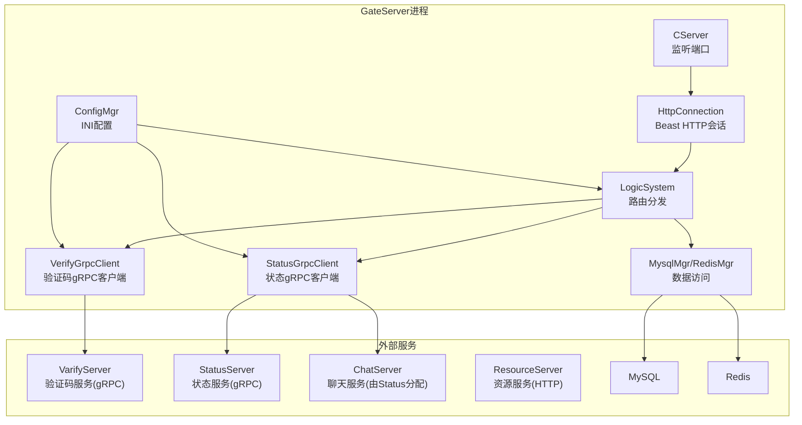
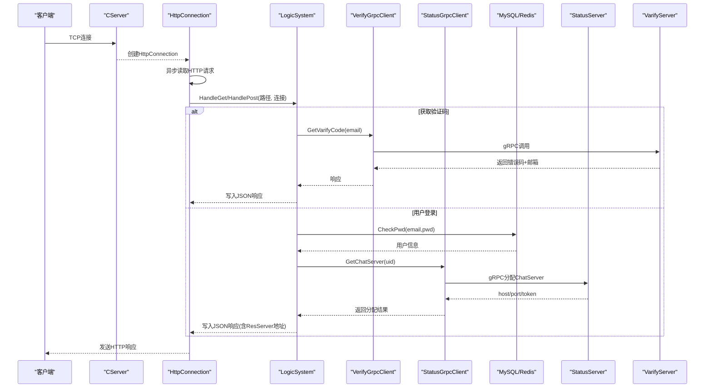
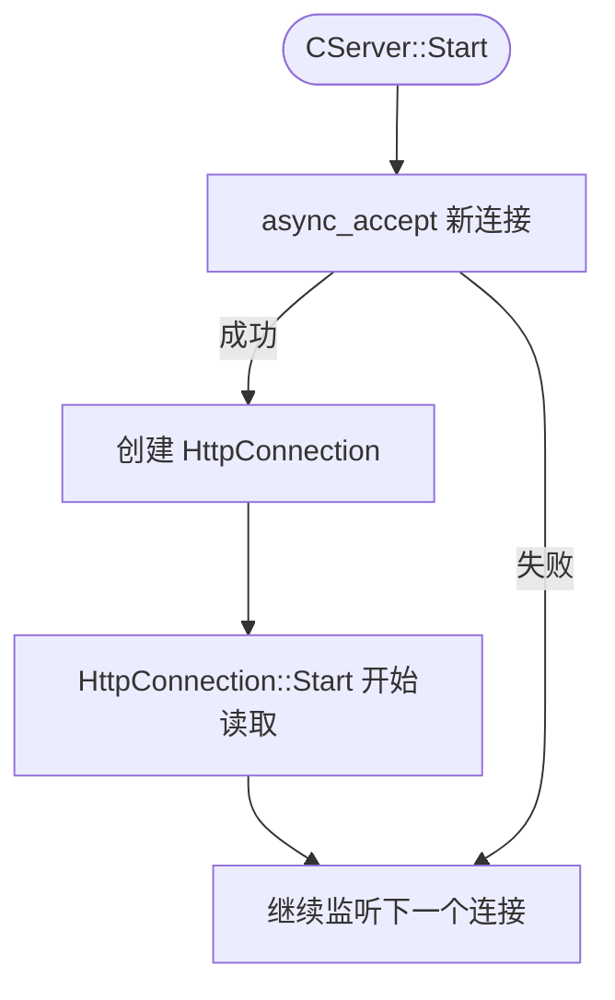
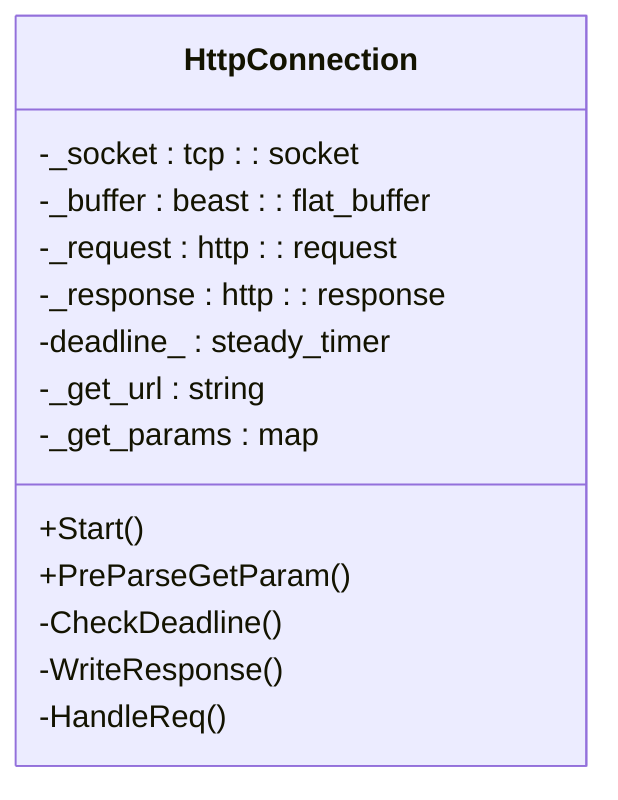
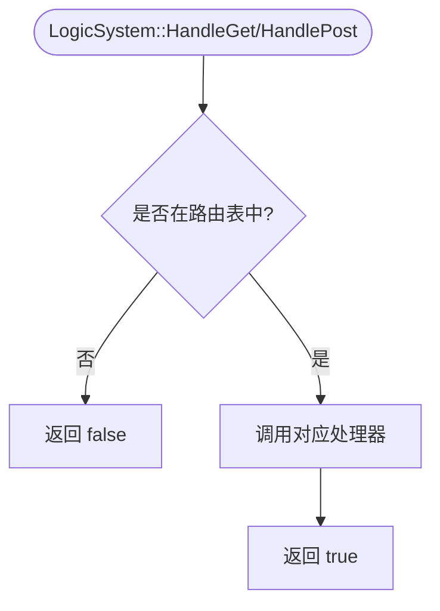
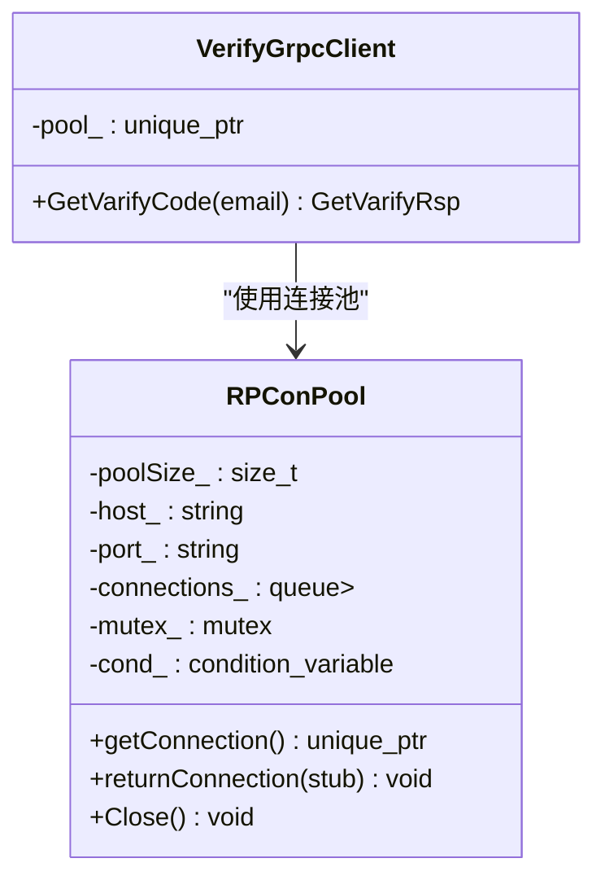
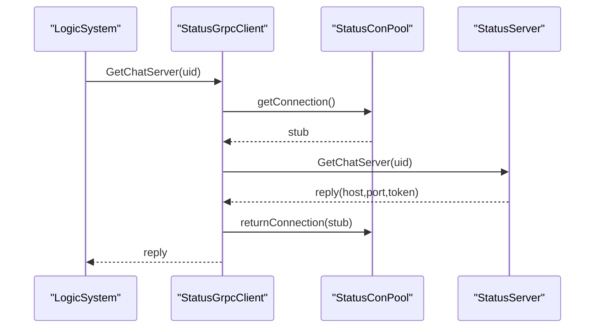
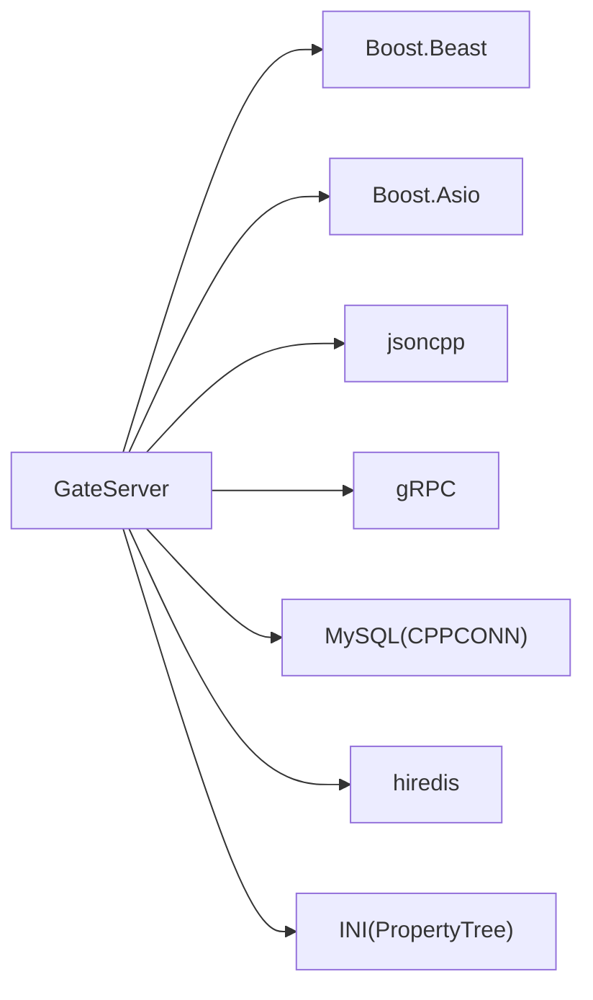

# GateServer网关服务

<cite>
**本文引用的文件**   
- [GateServer.cpp](file://server/GateServer/src/GateServer.cpp)
- [CServer.h](file://server/GateServer/include/CServer.h)
- [CServer.cpp](file://server/GateServer/src/CServer.cpp)
- [HttpConnection.h](file://server/GateServer/include/HttpConnection.h)
- [HttpConnection.cpp](file://server/GateServer/src/HttpConnection.cpp)
- [LogicSystem.h](file://server/GateServer/include/LogicSystem.h)
- [LogicSystem.cpp](file://server/GateServer/src/LogicSystem.cpp)
- [VerifyGrpcClient.h](file://server/GateServer/include/VerifyGrpcClient.h)
- [VerifyGrpcClient.cpp](file://server/GateServer/src/VerifyGrpcClient.cpp)
- [StatusGrpcClient.h](file://server/GateServer/include/StatusGrpcClient.h)
- [StatusGrpcClient.cpp](file://server/GateServer/src/StatusGrpcClient.cpp)
- [ConfigMgr.h](file://server/GateServer/include/ConfigMgr.h)
- [ConfigMgr.cpp](file://server/GateServer/src/ConfigMgr.cpp)
- [const.h](file://server/GateServer/include/const.h)
- [config.ini](file://server/GateServer/config/config.ini)
- [MysqlMgr.h](file://server/GateServer/include/MysqlMgr.h)
- [RedisMgr.h](file://server/GateServer/include/RedisMgr.h)
</cite>

## 目录
1. [简介](#简介)
2. [项目结构](#项目结构)
3. [核心组件](#核心组件)
4. [架构总览](#架构总览)
5. [详细组件分析](#详细组件分析)
6. [依赖关系分析](#依赖关系分析)
7. [性能与扩展性](#性能与扩展性)
8. [故障排查指南](#故障排查指南)
9. [API接口文档](#api接口文档)
10. [结论](#结论)

## 简介
本技术文档面向GateServer HTTP网关服务，基于Boost.Beast实现HTTP服务器，负责请求解析、响应生成、连接管理；通过gRPC客户端集成验证码服务（VarifyServer）与状态服务（StatusServer），完成用户注册、登录、密码重置等业务流程。GateServer同时对接MySQL与Redis，提供数据持久化与验证码缓存能力，并通过配置中心读取服务地址与端口。

## 项目结构
GateServer位于server/GateServer目录下，主要包含：
- 网络层：CServer监听TCP端口，创建并管理HttpConnection连接
- 协议处理层：HttpConnection使用Boost.Beast异步读写HTTP请求/响应
- 业务路由层：LogicSystem维护GET/POST路由表，分发到具体处理器
- 外部集成：VerifyGrpcClient调用验证码服务，StatusGrpcClient调用状态服务分配ChatServer
- 基础设施：ConfigMgr加载INI配置，MysqlMgr/RedisMgr封装数据库与缓存操作

图表来源
- [CServer.cpp:10-33](file://server/GateServer/src/CServer.cpp#L10-L33)
- [HttpConnection.cpp:133-194](file://server/GateServer/src/HttpConnection.cpp#L133-L194)
- [LogicSystem.cpp:36-406](file://server/GateServer/src/LogicSystem.cpp#L36-L406)
- [VerifyGrpcClient.cpp:4-9](file://server/GateServer/src/VerifyGrpcClient.cpp#L4-L9)
- [StatusGrpcClient.cpp:46-52](file://server/GateServer/src/StatusGrpcClient.cpp#L46-L52)
- [ConfigMgr.cpp:2-42](file://server/GateServer/src/ConfigMgr.cpp#L2-L42)

章节来源
- [GateServer.cpp:131-163](file://server/GateServer/src/GateServer.cpp#L131-L163)
- [CServer.h:5-14](file://server/GateServer/include/CServer.h#L5-L14)
- [CServer.cpp:10-33](file://server/GateServer/src/CServer.cpp#L10-L33)
- [HttpConnection.h:4-34](file://server/GateServer/include/HttpConnection.h#L4-L34)
- [HttpConnection.cpp:133-194](file://server/GateServer/src/HttpConnection.cpp#L133-L194)
- [LogicSystem.h:9-22](file://server/GateServer/include/LogicSystem.h#L9-L22)
- [LogicSystem.cpp:36-406](file://server/GateServer/src/LogicSystem.cpp#L36-L406)
- [VerifyGrpcClient.h:80-110](file://server/GateServer/include/VerifyGrpcClient.h#L80-L110)
- [StatusGrpcClient.h:81-94](file://server/GateServer/include/StatusGrpcClient.h#L81-L94)
- [ConfigMgr.h:46-82](file://server/GateServer/include/ConfigMgr.h#L46-L82)
- [ConfigMgr.cpp:2-42](file://server/GateServer/src/ConfigMgr.cpp#L2-L42)
- [const.h:32-45](file://server/GateServer/include/const.h#L32-L45)
- [config.ini:1-25](file://server/GateServer/config/config.ini#L1-L25)
- [MysqlMgr.h:4-18](file://server/GateServer/include/MysqlMgr.h#L4-L18)
- [RedisMgr.h:267-303](file://server/GateServer/include/RedisMgr.h#L267-L303)

## 核心组件
- CServer：基于Boost.Asio的TCP监听器，接受新连接并创建HttpConnection实例
- HttpConnection：封装Beast的HTTP会话，负责异步读请求、解析URL参数、设置响应头、写回响应
- LogicSystem：单例路由系统，维护GET/POST处理器映射，按路径分发请求
- VerifyGrpcClient：验证码服务gRPC客户端，带连接池与错误码转换
- StatusGrpcClient：状态服务gRPC客户端，用于为用户分配ChatServer并返回认证token
- ConfigMgr：INI配置文件加载器，提供Section/Key访问接口
- MysqlMgr/RedisMgr：数据库与缓存管理器，封装常用操作与连接池

章节来源
- [CServer.cpp:10-33](file://server/GateServer/src/CServer.cpp#L10-L33)
- [HttpConnection.cpp:8-30](file://server/GateServer/src/HttpConnection.cpp#L8-L30)
- [LogicSystem.cpp:416-477](file://server/GateServer/src/LogicSystem.cpp#L416-L477)
- [VerifyGrpcClient.h:80-110](file://server/GateServer/include/VerifyGrpcClient.h#L80-L110)
- [StatusGrpcClient.h:81-94](file://server/GateServer/include/StatusGrpcClient.h#L81-L94)
- [ConfigMgr.h:46-82](file://server/GateServer/include/ConfigMgr.h#L46-L82)
- [MysqlMgr.h:4-18](file://server/GateServer/include/MysqlMgr.h#L4-L18)
- [RedisMgr.h:267-303](file://server/GateServer/include/RedisMgr.h#L267-L303)

## 架构总览
GateServer作为统一入口，将HTTP请求路由至对应处理器，处理器再根据业务需要调用gRPC或数据库/缓存服务。整体流程如下：

图表来源
- [CServer.cpp:10-33](file://server/GateServer/src/CServer.cpp#L10-L33)
- [HttpConnection.cpp:133-194](file://server/GateServer/src/HttpConnection.cpp#L133-L194)
- [LogicSystem.cpp:107-151](file://server/GateServer/src/LogicSystem.cpp#L107-L151)
- [LogicSystem.cpp:326-405](file://server/GateServer/src/LogicSystem.cpp#L326-L405)
- [VerifyGrpcClient.h:87-104](file://server/GateServer/include/VerifyGrpcClient.h#L87-L104)
- [StatusGrpcClient.cpp:3-21](file://server/GateServer/src/StatusGrpcClient.cpp#L3-L21)

## 详细组件分析

### CServer与连接生命周期
- CServer在构造时绑定端口，Start方法循环异步accept新连接
- 每次成功accept后，创建HttpConnection并启动其Start进行HTTP读取
- 异常情况下继续监听，保证服务高可用

图表来源
- [CServer.cpp:10-33](file://server/GateServer/src/CServer.cpp#L10-L33)

章节来源
- [CServer.h:5-14](file://server/GateServer/include/CServer.h#L5-L14)
- [CServer.cpp:10-33](file://server/GateServer/src/CServer.cpp#L10-L33)

### HttpConnection：HTTP会话与请求处理
- Start：使用beast::async_read异步读取HTTP请求，捕获异常并进入HandleReq
- PreParseGetParam：解析URI查询字符串，支持URL编码/解码，填充_get_params
- HandleReq：根据HTTP方法分派到LogicSystem的HandleGet/HandlePost，未匹配路由返回404
- WriteResponse：设置Content-Length并异步发送响应，关闭发送端并取消超时定时器

图表来源
- [HttpConnection.h:4-34](file://server/GateServer/include/HttpConnection.h#L4-L34)
- [HttpConnection.cpp:8-30](file://server/GateServer/src/HttpConnection.cpp#L8-L30)
- [HttpConnection.cpp:96-130](file://server/GateServer/src/HttpConnection.cpp#L96-L130)
- [HttpConnection.cpp:133-194](file://server/GateServer/src/HttpConnection.cpp#L133-L194)
- [HttpConnection.cpp:196-223](file://server/GateServer/src/HttpConnection.cpp#L196-L223)

章节来源
- [HttpConnection.h:4-34](file://server/GateServer/include/HttpConnection.h#L4-L34)
- [HttpConnection.cpp:8-30](file://server/GateServer/src/HttpConnection.cpp#L8-L30)
- [HttpConnection.cpp:96-130](file://server/GateServer/src/HttpConnection.cpp#L96-L130)
- [HttpConnection.cpp:133-194](file://server/GateServer/src/HttpConnection.cpp#L133-L194)
- [HttpConnection.cpp:196-223](file://server/GateServer/src/HttpConnection.cpp#L196-L223)

### LogicSystem：路由注册与分发
- 构造函数中注册所有GET/POST路由处理器（lambda），包括测试、验证码、注册、重置密码、登录等
- RegGet/RegPost将路径与处理器函数存入map
- HandleGet/HandlePost根据路径查找处理器并执行，未找到返回false触发404

图表来源
- [LogicSystem.cpp:36-406](file://server/GateServer/src/LogicSystem.cpp#L36-L406)
- [LogicSystem.cpp:416-477](file://server/GateServer/src/LogicSystem.cpp#L416-L477)

章节来源
- [LogicSystem.h:9-22](file://server/GateServer/include/LogicSystem.h#L9-L22)
- [LogicSystem.cpp:36-406](file://server/GateServer/src/LogicSystem.cpp#L36-L406)
- [LogicSystem.cpp:416-477](file://server/GateServer/src/LogicSystem.cpp#L416-L477)

### VerifyGrpcClient：验证码服务gRPC客户端
- 使用RPConPool维护gRPC连接池，默认大小5
- GetVarifyCode构建请求并调用远端服务，成功返回reply，失败设置错误码
- 连接使用后归还连接池，支持优雅关闭

图表来源
- [VerifyGrpcClient.h:18-78](file://server/GateServer/include/VerifyGrpcClient.h#L18-L78)
- [VerifyGrpcClient.h:80-110](file://server/GateServer/include/VerifyGrpcClient.h#L80-L110)
- [VerifyGrpcClient.cpp:4-9](file://server/GateServer/src/VerifyGrpcClient.cpp#L4-L9)

章节来源
- [VerifyGrpcClient.h:18-110](file://server/GateServer/include/VerifyGrpcClient.h#L18-L110)
- [VerifyGrpcClient.cpp:4-9](file://server/GateServer/src/VerifyGrpcClient.cpp#L4-L9)

### StatusGrpcClient：状态服务gRPC客户端
- StatusConPool维护gRPC连接池
- GetChatServer根据uid分配ChatServer，返回host/port/token
- Login用于后续认证校验（当前登录流程主要使用GetChatServer）

图表来源
- [StatusGrpcClient.cpp:3-21](file://server/GateServer/src/StatusGrpcClient.cpp#L3-L21)
- [StatusGrpcClient.h:19-79](file://server/GateServer/include/StatusGrpcClient.h#L19-L79)

章节来源
- [StatusGrpcClient.h:19-94](file://server/GateServer/include/StatusGrpcClient.h#L19-L94)
- [StatusGrpcClient.cpp:3-21](file://server/GateServer/src/StatusGrpcClient.cpp#L3-L21)
- [StatusGrpcClient.cpp:46-52](file://server/GateServer/src/StatusGrpcClient.cpp#L46-L52)

### 配置与数据访问
- ConfigMgr：从工作目录加载config.ini，提供Section/Key访问
- MysqlMgr：封装用户注册、密码校验、存储过程调用等
- RedisMgr：封装验证码存取、分布式锁、计数器等，内部有连接池与健康检查线程

章节来源
- [ConfigMgr.h:46-82](file://server/GateServer/include/ConfigMgr.h#L46-L82)
- [ConfigMgr.cpp:2-42](file://server/GateServer/src/ConfigMgr.cpp#L2-L42)
- [MysqlMgr.h:4-18](file://server/GateServer/include/MysqlMgr.h#L4-L18)
- [RedisMgr.h:267-303](file://server/GateServer/include/RedisMgr.h#L267-L303)

## 依赖关系分析
GateServer依赖的外部组件与模块关系如下：

图表来源
- [const.h:27-30](file://server/GateServer/include/const.h#L27-L30)
- [ConfigMgr.h:2-6](file://server/GateServer/include/ConfigMgr.h#L2-L6)
- [RedisMgr.h:1-8](file://server/GateServer/include/RedisMgr.h#L1-L8)

章节来源
- [const.h:27-30](file://server/GateServer/include/const.h#L27-L30)
- [ConfigMgr.h:2-6](file://server/GateServer/include/ConfigMgr.h#L2-L6)
- [RedisMgr.h:1-8](file://server/GateServer/include/RedisMgr.h#L1-L8)

## 性能与扩展性
- 异步I/O：CServer与HttpConnection均使用Asio/Beast异步模型，避免阻塞
- 连接池：gRPC与Redis均采用连接池，减少握手与连接开销
- 超时控制：每个连接设置60秒超时，防止僵尸连接占用资源
- 可扩展点：
  - 路由扩展：在LogicSystem构造函数中新增RegGet/RegPost即可
  - 限流策略：可在CServer或LogicSystem入口处增加令牌桶/漏桶实现
  - 安全认证：可在HttpConnection层添加鉴权中间件（如JWT校验）
  - 负载均衡：StatusServer已承担ChatServer分配职责，GateServer无需重复实现

[本节为通用指导，不直接分析具体文件]

## 故障排查指南
- JSON解析失败：检查请求体是否为合法JSON，参考错误码Error_Json
- RPC失败：检查gRPC服务是否可达，查看错误码RPCFailed
- 验证码过期/错误：确认Redis中是否存在对应key且未过期，核对输入验证码
- 用户已存在：注册时用户名或邮箱冲突，需更换
- 密码不匹配：登录时邮箱与密码不一致
- 邮箱不匹配：重置密码时用户名与邮箱不匹配
- 更新密码失败：数据库更新异常，检查连接与权限

章节来源
- [const.h:32-45](file://server/GateServer/include/const.h#L32-L45)
- [LogicSystem.cpp:60-105](file://server/GateServer/src/LogicSystem.cpp#L60-L105)
- [LogicSystem.cpp:107-151](file://server/GateServer/src/LogicSystem.cpp#L107-L151)
- [LogicSystem.cpp:152-239](file://server/GateServer/src/LogicSystem.cpp#L152-L239)
- [LogicSystem.cpp:241-324](file://server/GateServer/src/LogicSystem.cpp#L241-L324)
- [LogicSystem.cpp:326-405](file://server/GateServer/src/LogicSystem.cpp#L326-L405)

## API接口文档
以下接口均由LogicSystem注册，请求体为JSON，响应体为JSON，错误码见const.h中的ErrorCodes。

- GET /get_test
  - 功能：测试GET参数解析，回显所有查询参数
  - 请求：无请求体，URL查询参数任意键值对
  - 响应：text/plain，逐行输出参数键值

- POST /test_procedure
  - 功能：测试MySQL存储过程调用
  - 请求体：{"email":"..."}
  - 响应体：{"error":0,"email":"...","name":"...","uid":123}

- POST /get_varifycode
  - 功能：获取邮箱验证码（调用VarifyServer）
  - 请求体：{"email":"..."}
  - 响应体：{"error":0,"email":"..."}

- POST /user_register
  - 功能：用户注册（校验两次密码一致、验证码有效、用户名/邮箱唯一）
  - 请求体：{"email":"...","user":"...","passwd":"...","confirm":"...","icon":"...","varifycode":"..."}
  - 响应体：{"error":0,"uid":123,"email":"...","user":"...","passwd":"...","confirm":"...","icon":"...","varifycode":"..."}

- POST /reset_pwd
  - 功能：重置密码（验证码校验、用户名与邮箱匹配）
  - 请求体：{"email":"...","user":"...","passwd":"...","varifycode":"..."}
  - 响应体：{"error":0,"email":"...","user":"...","passwd":"...","varifycode":"..."}

- POST /user_login
  - 功能：用户登录（校验密码、分配ChatServer、返回资源服务器地址）
  - 请求体：{"email":"...","passwd":"..."}
  - 响应体：{"error":0,"email":"...","uid":123,"token":"...","chathost":"...","chatport":"...","reshost":"...","resport":"..."}

调用示例（以/user_login为例）
- 请求
  - URL: POST http://127.0.0.1:8080/user_login
  - Header: Content-Type: application/json
  - Body: {"email":"user@example.com","passwd":"yourpassword"}
- 响应
  - 200 OK
  - Body: {"error":0,"email":"user@example.com","uid":123,"token":"abc123","chathost":"127.0.0.1","chatport":"9090","reshost":"127.0.0.1","resport":"9090"}

章节来源
- [LogicSystem.cpp:36-406](file://server/GateServer/src/LogicSystem.cpp#L36-L406)
- [const.h:32-45](file://server/GateServer/include/const.h#L32-L45)
- [config.ini:1-25](file://server/GateServer/config/config.ini#L1-L25)

## 结论
GateServer通过Boost.Beast实现了高性能的HTTP网关，结合gRPC客户端与数据库/缓存服务，完成了完整的用户认证与资源分配流程。其模块化设计便于扩展新的HTTP接口与安全机制。建议在生产环境中补充请求限流、安全认证与监控告警，以提升系统的稳定性与安全性。