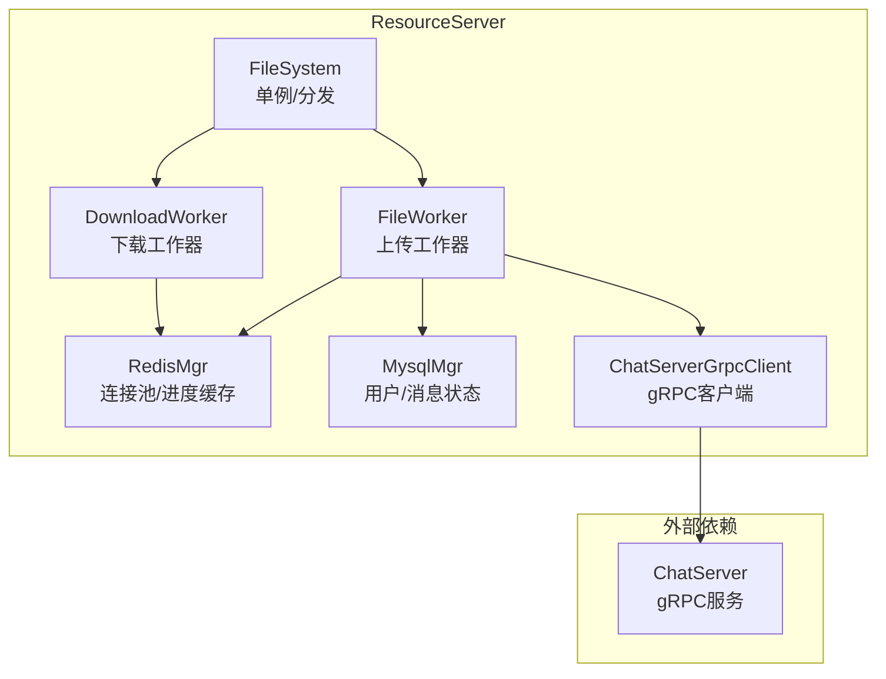
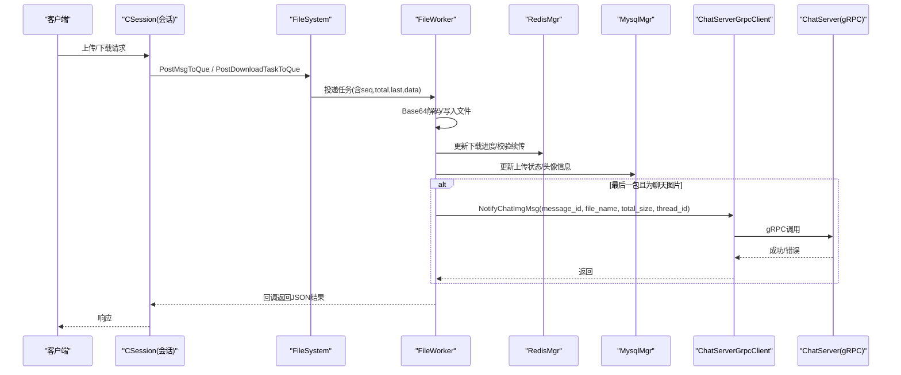
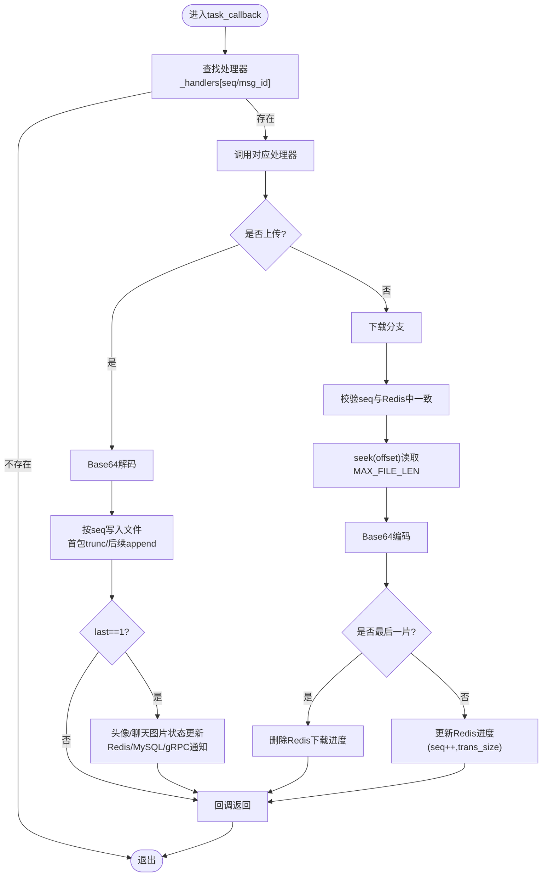
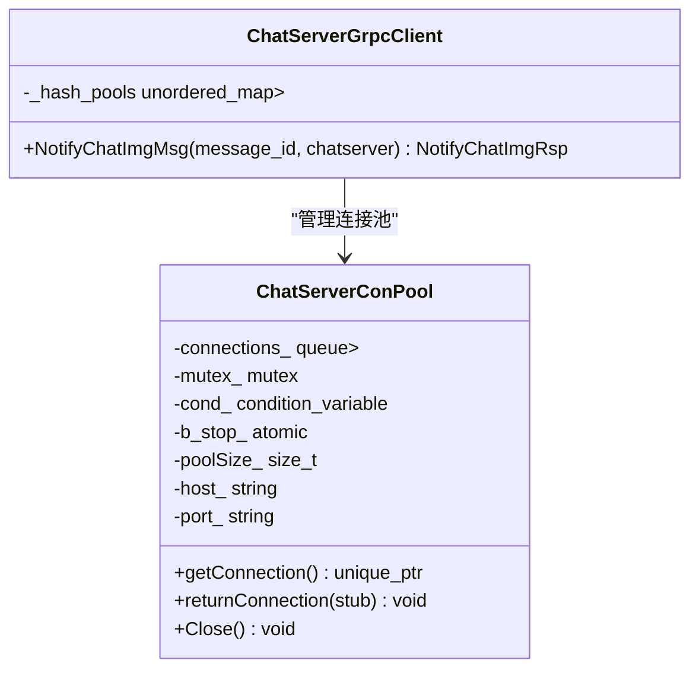
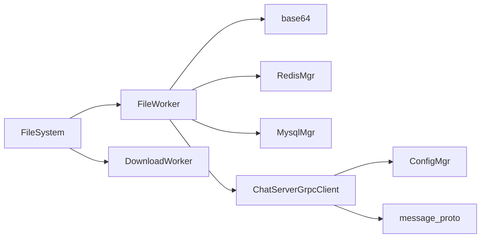

# ResourceServer资源服务

<cite>
**本文引用的文件**   
- [FileWorker.h](file://server/ResourceServer/include/FileWorker.h)
- [FileSystem.h](file://server/ResourceServer/include/FileSystem.h)
- [FileInfo.h](file://server/ResourceServer/include/FileInfo.h)
- [base64.h](file://server/ResourceServer/include/base64.h)
- [ChatServerGrpcClient.h](file://server/ResourceServer/include/ChatServerGrpcClient.h)
- [const.h](file://server/ResourceServer/include/const.h)
- [MysqlMgr.h](file://server/ResourceServer/include/MysqlMgr.h)
- [RedisMgr.h](file://server/ResourceServer/include/RedisMgr.h)
- [FileWorker.cpp](file://server/ResourceServer/src/FileWorker.cpp)
- [FileSystem.cpp](file://server/ResourceServer/src/FileSystem.cpp)
- [FileInfo.cpp](file://server/ResourceServer/src/FileInfo.cpp)
- [base64.cpp](file://server/ResourceServer/src/base64.cpp)
- [ChatServerGrpcClient.cpp](file://server/ResourceServer/src/ChatServerGrpcClient.cpp)
- [config.ini](file://server/ResourceServer/config/config.ini)
- [message.proto](file://server/proto/resource/message.proto)
</cite>

## 目录
1. [简介](#简介)
2. [项目结构](#项目结构)
3. [核心组件](#核心组件)
4. [架构总览](#架构总览)
5. [详细组件分析](#详细组件分析)
6. [依赖关系分析](#依赖关系分析)
7. [性能考量](#性能考量)
8. [故障排查指南](#故障排查指南)
9. [结论](#结论)
10. [附录：API与客户端集成指南](#附录api与客户端集成指南)

## 简介
本技术文档面向ResourceServer资源存储服务，聚焦于文件上传/下载的核心实现、断点续传机制、Base64编解码在图片传输中的应用、大文件内存优化策略，以及与ChatServer的gRPC集成（文件传输通知与元数据同步）。同时涵盖文件存储路径管理、权限控制、以及可扩展的安全能力（如病毒扫描）的设计建议。

## 项目结构
ResourceServer采用“工作器+队列”的异步处理模型，将上传与下载任务解耦到独立线程池，通过文件系统抽象进行统一调度；使用Redis作为断点续传的进度缓存，MySQL用于持久化用户与消息状态；通过gRPC与ChatServer通信完成图片上传后的通知与元数据同步。

图表来源 
- [FileSystem.cpp:1-29](file://server/ResourceServer/src/FileSystem.cpp#L1-L29)
- [FileWorker.cpp:1-663](file://server/ResourceServer/src/FileWorker.cpp#L1-L663)
- [RedisMgr.h:1-313](file://server/ResourceServer/include/RedisMgr.h#L1-L313)
- [MysqlMgr.h:1-44](file://server/ResourceServer/include/MysqlMgr.h#L1-L44)
- [ChatServerGrpcClient.cpp:1-53](file://server/ResourceServer/src/ChatServerGrpcClient.cpp#L1-L53)

章节来源
- [FileSystem.cpp:1-29](file://server/ResourceServer/src/FileSystem.cpp#L1-L29)
- [FileWorker.cpp:1-663](file://server/ResourceServer/src/FileWorker.cpp#L1-L663)
- [RedisMgr.h:1-313](file://server/ResourceServer/include/RedisMgr.h#L1-L313)
- [MysqlMgr.h:1-44](file://server/ResourceServer/include/MysqlMgr.h#L1-L44)
- [ChatServerGrpcClient.cpp:1-53](file://server/ResourceServer/src/ChatServerGrpcClient.cpp#L1-L53)

## 核心组件
- FileWorker/DownloadWorker：基于线程+条件变量的任务队列，分别处理上传与下载任务，支持回调返回结果。
- FileSystem：单例，维护多个FileWorker与DownloadWorker实例，按哈希分片投递任务，提升并发吞吐。
- FileInfo：描述文件分片序列、名称、总大小、已传输大小及本地路径，用于断点续传状态跟踪。
- base64：提供字符串与二进制数据的Base64编解码接口，用于图片传输时的文本化传输。
- ChatServerGrpcClient：gRPC客户端连接池，向ChatServer发送图片上传完成的通知，包含文件名、大小、会话信息等。
- MysqlMgr/RedisMgr：数据库与缓存管理器，负责用户信息、聊天消息状态、以及下载进度等键值操作。

章节来源
- [FileWorker.h:1-90](file://server/ResourceServer/include/FileWorker.h#L1-L90)
- [FileSystem.h:1-21](file://server/ResourceServer/include/FileSystem.h#L1-L21)
- [FileInfo.h:1-26](file://server/ResourceServer/include/FileInfo.h#L1-L26)
- [base64.h:1-36](file://server/ResourceServer/include/base64.h#L1-L36)
- [ChatServerGrpcClient.h:1-93](file://server/ResourceServer/include/ChatServerGrpcClient.h#L1-L93)
- [MysqlMgr.h:1-44](file://server/ResourceServer/include/MysqlMgr.h#L1-L44)
- [RedisMgr.h:1-313](file://server/ResourceServer/include/RedisMgr.h#L1-L313)

## 架构总览
ResourceServer以“请求路由→任务入队→工作器执行→回调响应”为主线，结合Redis做断点续传状态缓存，MySQL做业务状态持久化，gRPC完成跨服务通知。

图表来源 
- [FileWorker.cpp:1-663](file://server/ResourceServer/src/FileWorker.cpp#L1-L663)
- [ChatServerGrpcClient.cpp:1-53](file://server/ResourceServer/src/ChatServerGrpcClient.cpp#L1-L53)
- [RedisMgr.h:1-313](file://server/ResourceServer/include/RedisMgr.h#L1-L313)
- [MysqlMgr.h:1-44](file://server/ResourceServer/include/MysqlMgr.h#L1-L44)

## 详细组件分析

### FileWorker：上传/下载任务处理器
- 上传流程：接收Base64编码的数据，解码后按seq顺序写入目标文件；首包trunc创建，后续包append追加；last标志表示结束，触发后续逻辑（如头像更新、聊天图片状态更新、gRPC通知）。
- 下载流程：根据seq定位偏移量读取固定大小的分片，Base64编码后返回；首次下载初始化FileInfo并写入Redis，后续续传从Redis恢复进度；最后一片完成后清理Redis中的下载进度。
- 并发控制：每个FileWorker/DownloadWorker内部有独立线程与队列，通过互斥锁与条件变量保证安全消费；FileSystem按哈希分片将任务均匀投递到多个工作器。

图表来源 
- [FileWorker.cpp:1-663](file://server/ResourceServer/src/FileWorker.cpp#L1-L663)

章节来源
- [FileWorker.cpp:1-663](file://server/ResourceServer/src/FileWorker.cpp#L1-L663)

### FileSystem：任务分发与工作者管理
- 单例模式，构造时创建固定数量的FileWorker与DownloadWorker实例。
- 提供PostMsgToQue与PostDownloadTaskToQue方法，按index将任务投递到对应工作器，实现负载均衡与隔离。

章节来源
- [FileSystem.cpp:1-29](file://server/ResourceServer/src/FileSystem.cpp#L1-L29)
- [FileSystem.h:1-21](file://server/ResourceServer/include/FileSystem.h#L1-L21)

### FileInfo：文件信息与进度模型
- 字段包括seq、name、total_size、trans_size、file_path_str，用于描述分片序号、文件名、总大小、已传输大小与本地路径。
- 在断点续传中，配合Redis进行状态持久化，确保中断后可恢复。

章节来源
- [FileInfo.h:1-26](file://server/ResourceServer/include/FileInfo.h#L1-L26)
- [FileInfo.cpp:1-2](file://server/ResourceServer/src/FileInfo.cpp#L1-L2)

### base64：图片传输的编解码
- 提供字符串与二进制数据的Base64编解码接口，支持URL安全字符集与PEM/MIME换行格式。
- 上传时将二进制数据Base64编码后传输，服务端解码后落盘；下载时读取二进制分片再Base64编码返回，便于网络传输与前端展示。

章节来源
- [base64.h:1-36](file://server/ResourceServer/include/base64.h#L1-L36)
- [base64.cpp:1-283](file://server/ResourceServer/src/base64.cpp#L1-L283)

### ChatServerGrpcClient：与ChatServer的gRPC集成
- 维护多ChatServer的连接池，按配置初始化host/port，获取Stub进行远程调用。
- 通知接口NotifyChatImgMsg携带message_id、file_name、from_uid、to_uid、thread_id、total_size等元数据，由ChatServer推送给在线接收方。

图表来源 
- [ChatServerGrpcClient.h:1-93](file://server/ResourceServer/include/ChatServerGrpcClient.h#L1-L93)
- [ChatServerGrpcClient.cpp:1-53](file://server/ResourceServer/src/ChatServerGrpcClient.cpp#L1-L53)

章节来源
- [ChatServerGrpcClient.h:1-93](file://server/ResourceServer/include/ChatServerGrpcClient.h#L1-L93)
- [ChatServerGrpcClient.cpp:1-53](file://server/ResourceServer/src/ChatServerGrpcClient.cpp#L1-L53)

### RedisMgr与MysqlMgr：缓存与持久化
- RedisMgr：连接池管理、PING保活、自动重连；提供Set/Get/Del/HSet/HDel等操作；封装下载进度SetDownLoadInfo/GetDownloadInfo/DelDownLoadInfo。
- MysqlMgr：用户信息查询、头像更新、聊天消息状态更新（UpdateUploadStatus）、消息元数据查询（GetChatMsgById）等。

章节来源
- [RedisMgr.h:1-313](file://server/ResourceServer/include/RedisMgr.h#L1-L313)
- [MysqlMgr.h:1-44](file://server/ResourceServer/include/MysqlMgr.h#L1-L44)

## 依赖关系分析
- FileWorker依赖base64进行编解码，依赖RedisMgr进行进度缓存，依赖MysqlMgr进行状态持久化，依赖ChatServerGrpcClient进行跨服务通知。
- FileSystem依赖FileWorker与DownloadWorker，按索引分派任务。
- ChatServerGrpcClient依赖配置管理与gRPC协议定义。

图表来源 
- [FileWorker.cpp:1-663](file://server/ResourceServer/src/FileWorker.cpp#L1-L663)
- [FileSystem.cpp:1-29](file://server/ResourceServer/src/FileSystem.cpp#L1-L29)
- [ChatServerGrpcClient.cpp:1-53](file://server/ResourceServer/src/ChatServerGrpcClient.cpp#L1-L53)
- [message.proto:1-169](file://server/proto/resource/message.proto#L1-L169)

章节来源
- [FileWorker.cpp:1-663](file://server/ResourceServer/src/FileWorker.cpp#L1-L663)
- [FileSystem.cpp:1-29](file://server/ResourceServer/src/FileSystem.cpp#L1-L29)
- [ChatServerGrpcClient.cpp:1-53](file://server/ResourceServer/src/ChatServerGrpcClient.cpp#L1-L53)
- [message.proto:1-169](file://server/proto/resource/message.proto#L1-L169)

## 性能考量
- 分片大小：MAX_FILE_LEN=32KB，平衡网络开销与内存占用，避免单次过大导致内存峰值过高。
- 并发模型：多工作器并行处理，减少串行阻塞；下载路径使用Redis缓存进度，降低重复IO。
- I/O策略：上传首包trunc创建文件，后续append追加，减少随机写；下载使用seek定位偏移，避免全量加载。
- 连接池：Redis与gRPC均使用连接池，减少握手与上下文切换开销。
- 内存优化：Base64编解码按需分配，下载分片读取后立即编码返回，不累积大对象。

[本节为通用指导，不直接分析具体文件]

## 故障排查指南
- 文件不存在：检查路径是否存在、目录是否创建成功；确认Redis中是否有下载进度信息。
- 权限不足：读写失败时检查进程对目标目录的权限；确认输出路径配置正确。
- 序列号不匹配：断点续传需保证客户端与服务端seq一致；检查Redis中保存的seq是否正确递增。
- 偏移量越界：计算offset=(seq-1)*MAX_FILE_LEN，确保不超过文件大小；若越界则终止并返回错误码。
- gRPC失败：检查ChatServer地址配置、连接池是否可用；确认消息ID对应的元数据可查。
- Redis连接异常：连接池PING检测失败会尝试重连；关注日志中的认证与连通性错误。

章节来源
- [const.h:1-117](file://server/ResourceServer/include/const.h#L1-L117)
- [FileWorker.cpp:1-663](file://server/ResourceServer/src/FileWorker.cpp#L1-L663)
- [RedisMgr.h:1-313](file://server/ResourceServer/include/RedisMgr.h#L1-L313)
- [ChatServerGrpcClient.cpp:1-53](file://server/ResourceServer/src/ChatServerGrpcClient.cpp#L1-L53)

## 结论
ResourceServer通过清晰的分层与模块化设计，实现了稳定高效的文件上传/下载与断点续传能力；借助Redis与MySQL保障状态一致性与持久化；通过gRPC与ChatServer协同完成图片资源的即时通知与元数据同步。整体架构具备良好的扩展性与可维护性，适合大规模聊天场景下的资源服务需求。

[本节为总结性内容，不直接分析具体文件]

## 附录：API与客户端集成指南

### 文件上传/下载消息类型
- ID_UPLOAD_FILE_REQ：上传文件请求，包含md5、name、seq、total_size、trans_size、last、data等字段。
- ID_DOWN_LOAD_FILE_REQ：下载文件请求，包含name、seq等字段。
- ID_IMG_CHAT_UPLOAD_REQ：聊天图片上传请求，包含chat_msg_id、sender、receiver等上下文。
- ID_IMG_CHAT_CONTINUE_UPLOAD_REQ：聊天图片续传请求，结构与上传类似但强调续传语义。
- ID_FILE_INFO_SYNC_REQ：文件信息同步请求，用于恢复上传进度。

章节来源
- [const.h:1-117](file://server/ResourceServer/include/const.h#L1-L117)
- [FileWorker.cpp:1-663](file://server/ResourceServer/src/FileWorker.cpp#L1-L663)

### 断点续传流程（客户端侧）
- 首次上传：计算文件MD5，读取第一分片发送ID_UPLOAD_FILE_REQ，记录last_seq与进度。
- 收到响应：解析回包中的trans_size与seq，若未完成则继续读取下一分片发送。
- 暂停/继续：暂停时保持当前seq与trans_size；继续时可通过ID_SYNC_FILE_REQ同步服务器进度，然后从断点继续上传。
- 下载续传：首次下载初始化Redis中的FileInfo；后续请求携带相同seq，服务端校验并返回对应分片。

章节来源
- [FileWorker.cpp:1-663](file://server/ResourceServer/src/FileWorker.cpp#L1-L663)
- [RedisMgr.h:1-313](file://server/ResourceServer/include/RedisMgr.h#L1-L313)

### gRPC通知接口（ChatServer）
- NotifyChatImgReq：包含from_uid、to_uid、message_id、file_name、total_size、thread_id。
- NotifyChatImgRsp：包含error、from_uid、to_uid、message_id、file_name、total_size、thread_id。

章节来源
- [message.proto:1-169](file://server/proto/resource/message.proto#L1-L169)
- [ChatServerGrpcClient.cpp:1-53](file://server/ResourceServer/src/ChatServerGrpcClient.cpp#L1-L53)

### 配置项说明
- SelfServer：服务名、监听地址与端口。
- Mysql/Redis：数据库与缓存连接参数。
- Output/Static：输出目录与静态资源目录。
- chatserver1/chatserver2：ChatServer的gRPC主机与端口。

章节来源
- [config.ini:1-27](file://server/ResourceServer/config/config.ini#L1-L27)

### 安全功能建议（可扩展）
- 权限控制：在服务端校验用户身份与访问令牌，限制上传/下载目标路径；对敏感目录实施白名单。
- 病毒扫描：在文件落盘前调用外部杀毒引擎或沙箱扫描，失败则拒绝写入并记录审计日志。
- 输入校验：严格校验文件名、大小、类型与Base64合法性，防止注入与越界访问。
- 速率限制：对同一用户或IP设置上传/下载速率上限，防止滥用与DDoS。

[本节为通用指导，不直接分析具体文件]