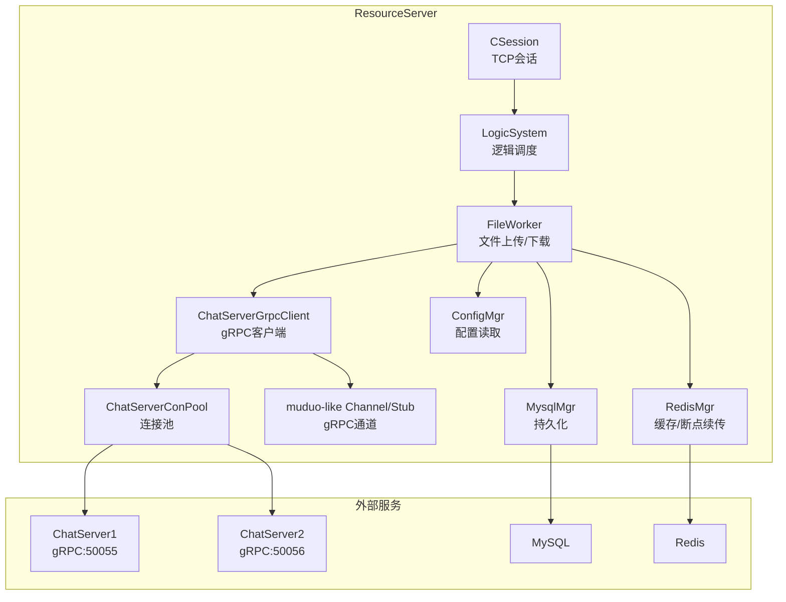
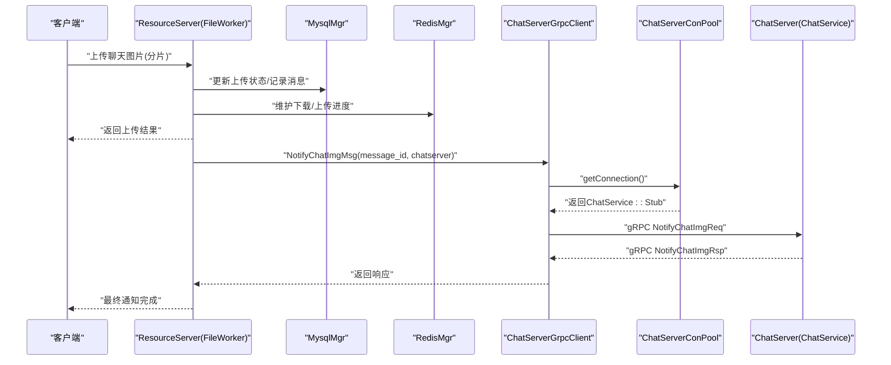
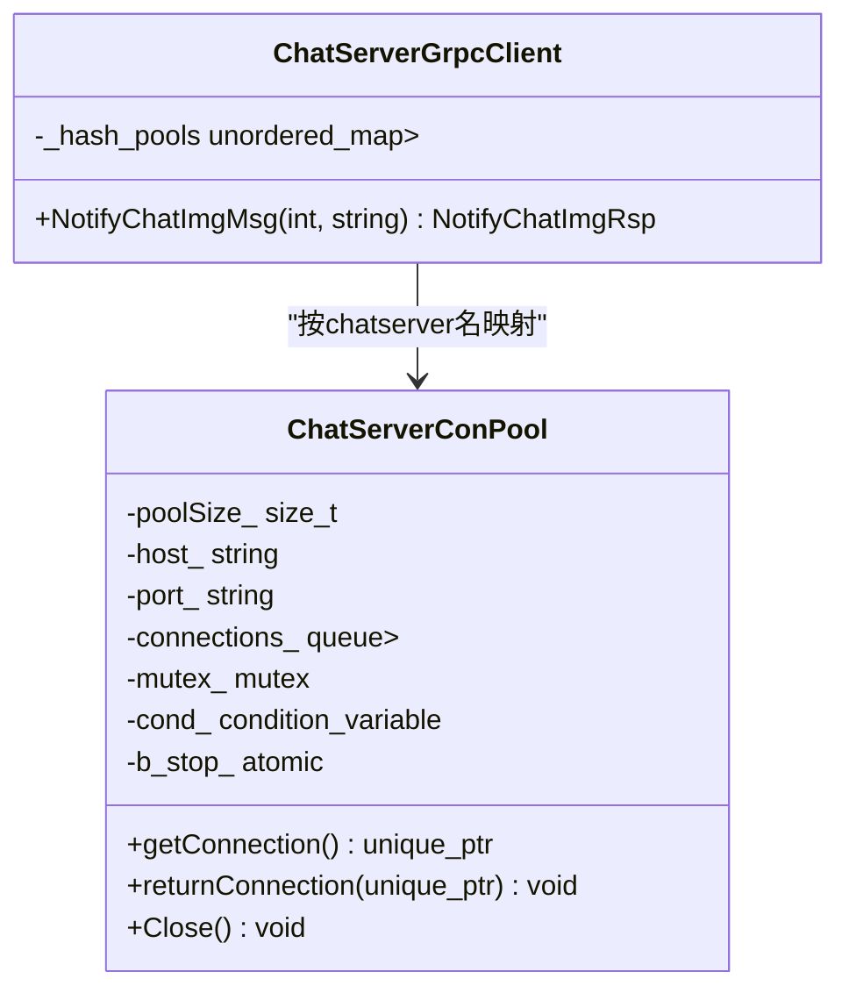
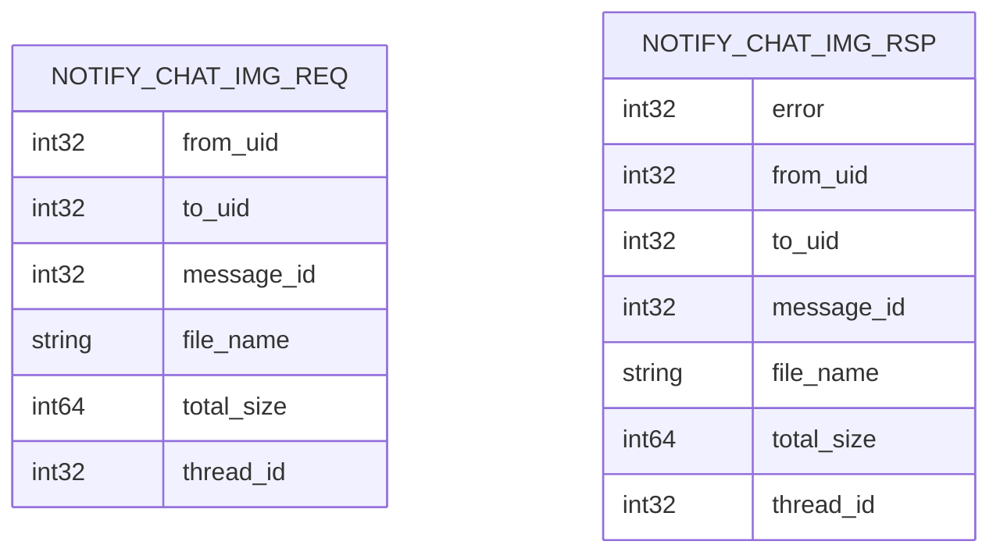
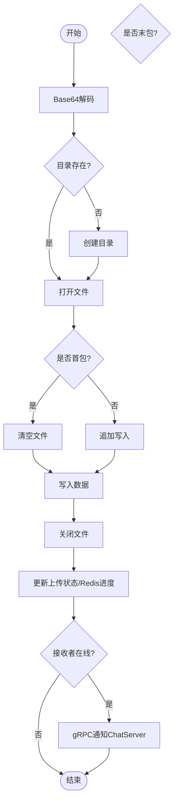
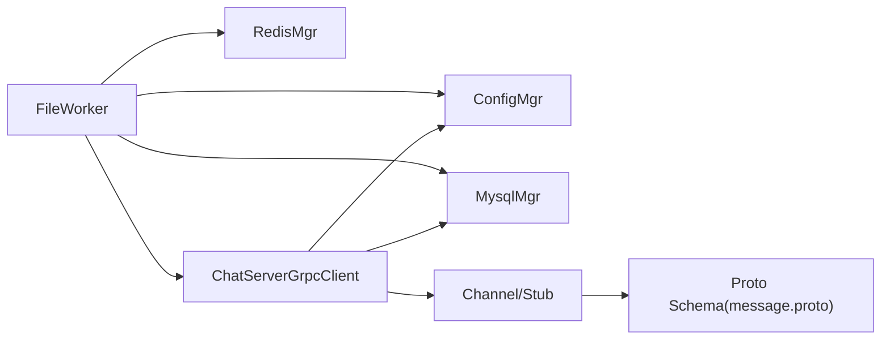

# gRPC服务集成

<cite>
**本文引用的文件**   
- [ChatServerGrpcClient.h](file://server/ResourceServer/include/ChatServerGrpcClient.h)
- [ChatServerGrpcClient.cpp](file://server/ResourceServer/src/ChatServerGrpcClient.cpp)
- [message.proto](file://server/proto/resource/message.proto)
- [FileWorker.h](file://server/ResourceServer/include/FileWorker.h)
- [FileWorker.cpp](file://server/ResourceServer/src/FileWorker.cpp)
- [ConfigMgr.h](file://server/ResourceServer/include/ConfigMgr.h)
- [config.ini](file://server/ResourceServer/config/config.ini)
- [const.h](file://server/ResourceServer/include/const.h)
- [MysqlMgr.h](file://server/ResourceServer/include/MysqlMgr.h)
- [FileInfo.h](file://server/ResourceServer/include/FileInfo.h)
</cite>

## 目录
1. [简介](#简介)
2. [项目结构](#项目结构)
3. [核心组件](#核心组件)
4. [架构总览](#架构总览)
5. [详细组件分析](#详细组件分析)
6. [依赖关系分析](#依赖关系分析)
7. [性能考虑](#性能考虑)
8. [故障排查指南](#故障排查指南)
9. [结论](#结论)
10. [附录](#附录)

## 简介
本技术文档聚焦于 ResourceServer 的 gRPC 服务集成，重点阐述 ChatServerGrpcClient 客户端的实现与使用方式，包括连接池管理、消息序列化、错误处理机制；详细说明 resource 协议定义的消息类型（如聊天图片上传通知、下载请求、状态同步等）；说明与服务发现机制的集成（基于配置的服务注册、健康检查思路、负载均衡策略建议）；解释异步调用与回调机制（任务队列、回调函数模式）、超时控制与重试策略的建议；详述错误处理与异常传播（网络异常、业务异常、超时异常的统一处理）；并给出 gRPC 拦截器与中间件的使用建议（日志、监控、鉴权），以及调试方法与性能分析工具使用指南。

## 项目结构
ResourceServer 中涉及 gRPC 集成的关键代码位于以下位置：
- gRPC 客户端与连接池：server/ResourceServer/include/ChatServerGrpcClient.h, server/ResourceServer/src/ChatServerGrpcClient.cpp
- 协议定义：server/proto/resource/message.proto
- 文件上传/下载工作线程与回调：server/ResourceServer/include/FileWorker.h, server/ResourceServer/src/FileWorker.cpp
- 配置管理：server/ResourceServer/include/ConfigMgr.h, server/ResourceServer/config/config.ini
- 常量与错误码：server/ResourceServer/include/const.h
- 数据库访问：server/ResourceServer/include/MysqlMgr.h
- 文件信息模型：server/ResourceServer/include/FileInfo.h

图表来源 
- [ChatServerGrpcClient.h:1-93](file://server/ResourceServer/include/ChatServerGrpcClient.h#L1-L93)
- [ChatServerGrpcClient.cpp:1-53](file://server/ResourceServer/src/ChatServerGrpcClient.cpp#L1-L53)
- [FileWorker.cpp:1-663](file://server/ResourceServer/src/FileWorker.cpp#L1-L663)
- [ConfigMgr.h:1-90](file://server/ResourceServer/include/ConfigMgr.h#L1-L90)
- [config.ini:1-27](file://server/ResourceServer/config/config.ini#L1-L27)

章节来源
- [ChatServerGrpcClient.h:1-93](file://server/ResourceServer/include/ChatServerGrpcClient.h#L1-L93)
- [ChatServerGrpcClient.cpp:1-53](file://server/ResourceServer/src/ChatServerGrpcClient.cpp#L1-L53)
- [message.proto:1-169](file://server/proto/resource/message.proto#L1-L169)
- [FileWorker.h:1-90](file://server/ResourceServer/include/FileWorker.h#L1-L90)
- [FileWorker.cpp:1-663](file://server/ResourceServer/src/FileWorker.cpp#L1-L663)
- [ConfigMgr.h:1-90](file://server/ResourceServer/include/ConfigMgr.h#L1-L90)
- [config.ini:1-27](file://server/ResourceServer/config/config.ini#L1-L27)
- [const.h:1-117](file://server/ResourceServer/include/const.h#L1-L117)
- [MysqlMgr.h:1-44](file://server/ResourceServer/include/MysqlMgr.h#L1-L44)
- [FileInfo.h:1-26](file://server/ResourceServer/include/FileInfo.h#L1-L26)

## 核心组件
- ChatServerGrpcClient：单例 gRPC 客户端，负责向 ChatServer 发起聊天图片上传通知等 RPC 调用。内部维护按目标 ChatServer 名称映射的连接池 ChatServerConPool，提供连接的获取与归还。
- ChatServerConPool：基于 std::queue 的简单连接池，使用互斥量与条件变量实现线程安全的连接借用与归还，支持优雅关闭。
- FileWorker：文件上传/下载的工作线程，通过消息 ID 路由到具体处理器，完成文件写入、状态更新、Redis 断点续传信息维护，并在上传完成后通过 ChatServerGrpcClient 触发 gRPC 通知。
- ConfigMgr：INI 配置文件解析与管理，提供 GetFileOutPath 等方法，用于确定资源输出路径及 ChatServer 地址端口。
- const.h：统一错误码、消息ID、常量定义，贯穿各模块的错误与状态上报。
- MysqlMgr：数据库访问封装，提供聊天消息查询、头像更新、上传状态更新等能力。
- FileInfo：下载进度与元数据模型，配合 Redis 实现断点续传。

章节来源
- [ChatServerGrpcClient.h:1-93](file://server/ResourceServer/include/ChatServerGrpcClient.h#L1-L93)
- [ChatServerGrpcClient.cpp:1-53](file://server/ResourceServer/src/ChatServerGrpcClient.cpp#L1-L53)
- [FileWorker.h:1-90](file://server/ResourceServer/include/FileWorker.h#L1-L90)
- [FileWorker.cpp:1-663](file://server/ResourceServer/src/FileWorker.cpp#L1-L663)
- [ConfigMgr.h:1-90](file://server/ResourceServer/include/ConfigMgr.h#L1-L90)
- [const.h:1-117](file://server/ResourceServer/include/const.h#L1-L117)
- [MysqlMgr.h:1-44](file://server/ResourceServer/include/MysqlMgr.h#L1-L44)
- [FileInfo.h:1-26](file://server/ResourceServer/include/FileInfo.h#L1-L26)

## 架构总览
ResourceServer 在收到文件上传或下载相关请求后，由 FileWorker 执行具体的 IO 操作，并在适当时机通过 ChatServerGrpcClient 调用 ChatService.NotifyChatImgMsg 通知 ChatServer 进行消息推送。连接池保证对多个 ChatServer 实例的稳定连接复用。配置中心提供 ChatServer 的地址与端口，便于动态扩展。

图表来源 
- [FileWorker.cpp:198-283](file://server/ResourceServer/src/FileWorker.cpp#L198-L283)
- [ChatServerGrpcClient.cpp:1-53](file://server/ResourceServer/src/ChatServerGrpcClient.cpp#L1-L53)
- [ChatServerGrpcClient.h:1-93](file://server/ResourceServer/include/ChatServerGrpcClient.h#L1-L93)
- [message.proto:138-165](file://server/proto/resource/message.proto#L138-L165)

## 详细组件分析

### ChatServerGrpcClient 客户端实现
- 连接管理
  - 构造时从配置读取 chatserver1/chatserver2 的 Host/Port，为每个目标创建独立的 ChatServerConPool，默认池大小为 5。
  - getConnection() 通过条件变量等待可用连接，避免忙等；returnConnection() 将连接归还并唤醒等待者。
  - Close() 设置停止标志并广播唤醒，确保析构安全。
- 消息序列化
  - 使用 proto3 生成的 message::NotifyChatImgReq/Rsp，填充 from_uid、to_uid、message_id、file_name、total_size、thread_id 等字段。
  - 通过 MysqlMgr::GetChatMsgById 获取消息内容，计算文件大小作为 total_size。
- 错误处理
  - 若目标 chatserver 未注册，返回 ServerIpErr。
  - 若 RPC 失败，设置 RPCFailed 并返回；成功则透传 reply.error。
- 资源释放
  - 使用 Defer RAII 确保连接归还，避免泄漏。

图表来源 
- [ChatServerGrpcClient.h:19-79](file://server/ResourceServer/include/ChatServerGrpcClient.h#L19-L79)
- [ChatServerGrpcClient.cpp:42-52](file://server/ResourceServer/src/ChatServerGrpcClient.cpp#L42-L52)

章节来源
- [ChatServerGrpcClient.h:1-93](file://server/ResourceServer/include/ChatServerGrpcClient.h#L1-L93)
- [ChatServerGrpcClient.cpp:1-53](file://server/ResourceServer/src/ChatServerGrpcClient.cpp#L1-L53)
- [const.h:5-29](file://server/ResourceServer/include/const.h#L5-L29)
- [MysqlMgr.h:36-38](file://server/ResourceServer/include/MysqlMgr.h#L36-L38)

### resource 协议定义与消息类型
- ChatService 接口
  - NotifyChatImgMsg：聊天图片上传通知，参数包含发送方/接收方UID、消息ID、文件名、总大小、线程ID；返回统一 error 字段。
- 其他相关消息
  - TextChatMsgReq/Rsp：文本聊天消息批量传输。
  - KickUserReq/Rsp：踢人通知。
  - AddFriend/RplyFriend：好友申请与回复。
  - StatusService：登录、获取 ChatServer 信息等。

图表来源 
- [message.proto:138-155](file://server/proto/resource/message.proto#L138-L155)

章节来源
- [message.proto:1-169](file://server/proto/resource/message.proto#L1-L169)

### 文件上传/下载与回调机制
- 上传流程
  - FileWorker 根据 MSG_IDS 路由到对应处理器，解码 Base64 数据，按 seq 分片写入文件，首包清空、后续追加。
  - 最后一个分片写入后，更新数据库上传状态，查询接收者在线状态（Redis），若在线则通过 ChatServerGrpcClient 发起 gRPC 通知。
- 下载流程
  - DownloadWorker 支持断点续传：首次下载记录 total_size 与 seq，后续请求校验 seq 与偏移量，读取指定分片并 Base64 编码返回。
  - 使用 Redis 存储下载进度，最后分片完成后清理进度信息。
- 回调机制
  - 所有处理器通过 std::function<void(const Json::Value&)> 回调返回结果，上层可据此进行 UI 更新或进一步处理。

图表来源 
- [FileWorker.cpp:198-283](file://server/ResourceServer/src/FileWorker.cpp#L198-L283)
- [FileWorker.cpp:518-663](file://server/ResourceServer/src/FileWorker.cpp#L518-L663)

章节来源
- [FileWorker.h:1-90](file://server/ResourceServer/include/FileWorker.h#L1-L90)
- [FileWorker.cpp:1-663](file://server/ResourceServer/src/FileWorker.cpp#L1-L663)
- [FileInfo.h:1-26](file://server/ResourceServer/include/FileInfo.h#L1-L26)

### 配置与服务发现
- 配置项
  - config.ini 定义了 SelfServer、Mysql、Redis、Output、Static 以及 chatserver1/chatserver2 的 Host/Port。
  - ConfigMgr 提供 operator[] 与 GetValue 访问配置，GetFileOutPath 返回资源输出路径。
- 服务发现
  - 当前实现采用静态配置（INI）进行服务注册，未使用动态注册中心。
  - 可扩展方案：引入 etcd/Nacos/Zookeeper，启动时注册服务，定期心跳与健康检查；客户端侧增加服务列表缓存与刷新机制。

章节来源
- [config.ini:1-27](file://server/ResourceServer/config/config.ini#L1-L27)
- [ConfigMgr.h:1-90](file://server/ResourceServer/include/ConfigMgr.h#L1-L90)

### 异步调用与回调、超时与重试
- 异步调用
  - FileWorker 使用独立工作线程与任务队列，PostTask 提交任务并通过条件变量唤醒消费者，实现非阻塞处理。
  - ChatServerGrpcClient 的 NotifyChatImgMsg 为同步 gRPC 调用，适合小消息快速返回场景。
- 回调机制
  - 处理器通过回调函数返回 JSON 结果，上层统一处理错误码与业务状态。
- 超时控制
  - 当前未显式设置 gRPC 超时，建议在 ClientContext 中设置 deadline，结合业务 SLA 调整。
- 重试策略
  - 可在 ChatServerGrpcClient 层增加指数退避重试，针对幂等接口（如通知类）谨慎使用；非幂等接口应避免自动重试。

章节来源
- [FileWorker.cpp:460-481](file://server/ResourceServer/src/FileWorker.cpp#L460-L481)
- [ChatServerGrpcClient.cpp:4-40](file://server/ResourceServer/src/ChatServerGrpcClient.cpp#L4-L40)

### 错误处理与异常传播
- 错误码
  - const.h 统一定义了 ErrorCodes，涵盖 JSON 解析、RPC 失败、验证码、用户、文件、Redis、服务器 IP 等错误。
- 网络异常
  - gRPC 调用失败时设置 RPCFailed；连接池关闭时直接返回空指针，避免悬挂引用。
- 业务异常
  - 文件读写权限、序列号/偏移量非法、Redis 读取失败等均有明确错误码与日志输出。
- 统一处理
  - 各处理器在异常分支设置 result["error"] 并调用回调返回，上层可集中处理。

章节来源
- [const.h:5-29](file://server/ResourceServer/include/const.h#L5-L29)
- [ChatServerGrpcClient.cpp:10-39](file://server/ResourceServer/src/ChatServerGrpcClient.cpp#L10-L39)
- [FileWorker.cpp:540-663](file://server/ResourceServer/src/FileWorker.cpp#L540-L663)

### gRPC 拦截器与中间件建议
- 日志记录
  - 使用 grpc::Interceptor 在 CallData 前后记录请求/响应摘要、耗时、错误码。
- 性能监控
  - 暴露 Prometheus 指标：RPC 调用次数、延迟分布、错误率、连接池大小。
- 安全认证
  - 服务端启用 TLS，客户端使用 SSL 凭据；在拦截器中校验 token/签名，防止伪造请求。
- 限流与熔断
  - 基于令牌桶或滑动窗口限制 QPS；当下游错误率超过阈值时熔断降级。

[本节为通用建议，不直接分析具体文件]

### 调试方法与性能分析工具
- gRPC 调试
  - 使用 grpcurl 或 protoc-gen-grpc-tools 生成 CLI 工具，构造 NotifyChatImgReq 进行端到端测试。
  - 开启 gRPC 环境变量 GRPC_VERBOSITY=DEBUG、GRPC_TRACE=all 查看底层通信细节。
- 性能分析
  - Linux perf / Windows VTune 采集 CPU 热点；gRPC 内置 stats 收集延迟与吞吐。
  - 观察连接池占用、任务队列长度、Redis/MySQL 慢查询。
- 日志定位
  - 统一日志级别与格式，关键路径打印 message_id、uid、file_name、seq、offset 等上下文。

[本节为通用建议，不直接分析具体文件]

## 依赖关系分析
- ChatServerGrpcClient 依赖：
  - ConfigMgr：读取 ChatServer 地址端口
  - MysqlMgr：查询聊天消息内容与元数据
  - const.h：错误码
- FileWorker 依赖：
  - ConfigMgr：资源输出路径
  - MysqlMgr：更新上传状态、查询消息
  - RedisMgr：断点续传进度
  - ChatServerGrpcClient：通知 ChatServer
- 协议依赖：
  - message.proto：定义 ChatService 与消息结构

图表来源 
- [FileWorker.cpp:1-663](file://server/ResourceServer/src/FileWorker.cpp#L1-L663)
- [ChatServerGrpcClient.cpp:1-53](file://server/ResourceServer/src/ChatServerGrpcClient.cpp#L1-L53)
- [message.proto:1-169](file://server/proto/resource/message.proto#L1-L169)

章节来源
- [FileWorker.cpp:1-663](file://server/ResourceServer/src/FileWorker.cpp#L1-L663)
- [ChatServerGrpcClient.cpp:1-53](file://server/ResourceServer/src/ChatServerGrpcClient.cpp#L1-L53)
- [message.proto:1-169](file://server/proto/resource/message.proto#L1-L169)

## 性能考虑
- 连接池
  - 合理设置池大小（默认 5），避免过多连接导致内存与句柄耗尽；在高并发下可动态扩容。
- IO 优化
  - 文件写入使用二进制模式与顺序写，减少随机 IO；大文件分片大小需权衡网络与磁盘开销。
- 缓存与持久化
  - Redis 断点续传降低重复 IO；MySQL 仅做必要状态更新，避免热路径频繁写库。
- 超时与背压
  - 设置合理的 gRPC 超时与队列上限，防止雪崩；上游客户端应实现退避与重试上限。

[本节为通用建议，不直接分析具体文件]

## 故障排查指南
- 常见问题
  - 连接池无可用连接：检查 ChatServer 是否启动、端口是否正确、池大小是否不足。
  - RPC 失败：确认 ChatServer 服务正常、消息字段完整、错误码是否为 RPCFailed。
  - 文件写入失败：检查目录权限、磁盘空间、Base64 解码结果。
  - 断点续传失败：核对 Redis 中的 seq 与 offset，确保客户端与服务端一致。
- 定位步骤
  - 查看日志中的 message_id、uid、file_name、seq、offset 等关键字段。
  - 使用 grpcurl 模拟请求验证协议正确性。
  - 检查 MySQL/Redis 状态与慢查询。

章节来源
- [const.h:5-29](file://server/ResourceServer/include/const.h#L5-L29)
- [FileWorker.cpp:540-663](file://server/ResourceServer/src/FileWorker.cpp#L540-L663)
- [ChatServerGrpcClient.cpp:10-39](file://server/ResourceServer/src/ChatServerGrpcClient.cpp#L10-L39)

## 结论
ResourceServer 的 gRPC 集成以 ChatServerGrpcClient 为核心，结合连接池与 FileWorker 的任务队列，实现了稳定高效的聊天图片上传通知与文件下载能力。通过统一的错误码与回调机制，系统具备良好的可观测性与可维护性。未来可引入动态服务发现、gRPC 拦截器与更完善的超时重试策略，进一步提升系统的弹性与可靠性。

[本节为总结，不直接分析具体文件]

## 附录
- 配置示例
  - chatserver1/chatserver2 的 Host/Port 需在 config.ini 中正确配置。
- 协议参考
  - NotifyChatImgReq/Rsp 字段含义参见 message.proto。
- 扩展建议
  - 引入 etcd/Nacos 进行服务注册与发现；在 gRPC 层添加鉴权与审计拦截器。

[本节为补充信息，不直接分析具体文件]