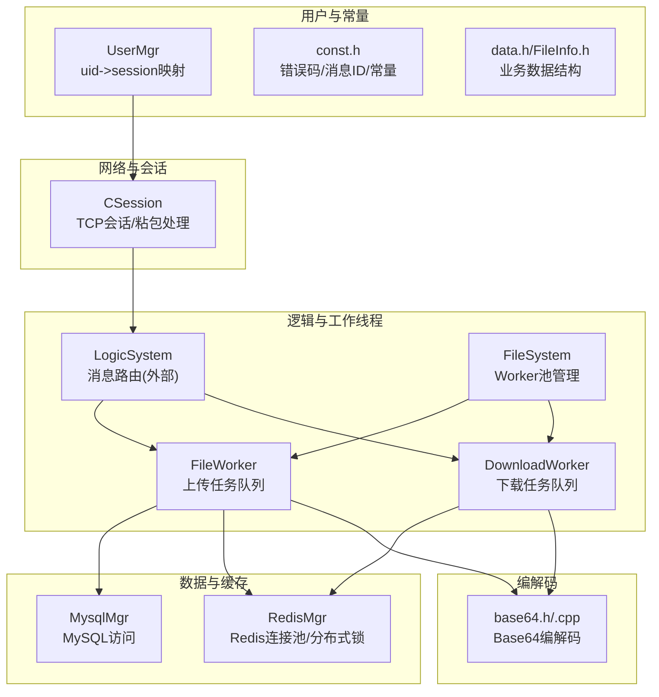
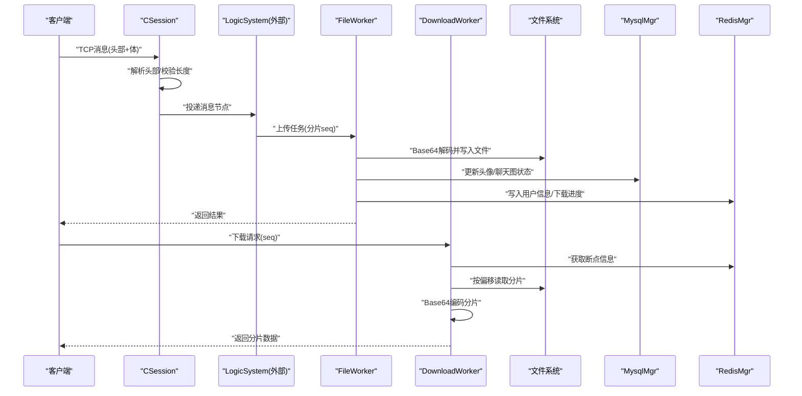
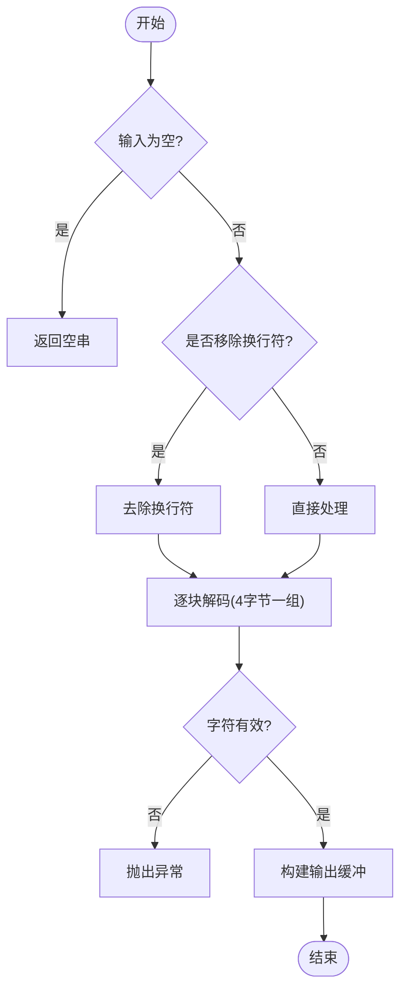
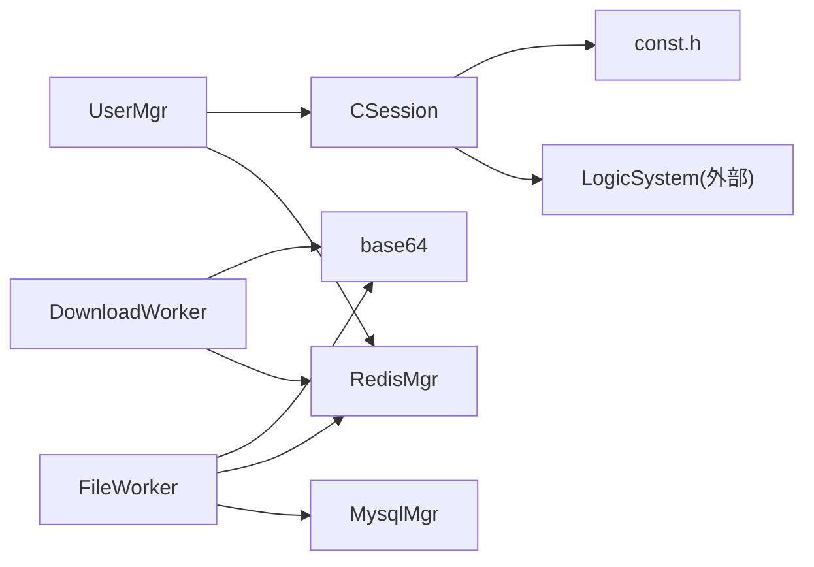

# 安全加密与权限控制

<cite>
**本文引用的文件**   
- [base64.h](file://server/ResourceServer/include/base64.h)
- [base64.cpp](file://server/ResourceServer/src/base64.cpp)
- [FileWorker.h](file://server/ResourceServer/include/FileWorker.h)
- [FileWorker.cpp](file://server/ResourceServer/src/FileWorker.cpp)
- [FileSystem.h](file://server/ResourceServer/include/FileSystem.h)
- [FileSystem.cpp](file://server/ResourceServer/src/FileSystem.cpp)
- [FileInfo.h](file://server/ResourceServer/include/FileInfo.h)
- [const.h](file://server/ResourceServer/include/const.h)
- [data.h](file://server/ResourceServer/include/data.h)
- [UserMgr.h](file://server/ResourceServer/include/UserMgr.h)
- [UserMgr.cpp](file://server/ResourceServer/src/UserMgr.cpp)
- [MysqlMgr.h](file://server/ResourceServer/include/MysqlMgr.h)
- [MysqlMgr.cpp](file://server/ResourceServer/src/MysqlMgr.cpp)
- [RedisMgr.h](file://server/ResourceServer/include/RedisMgr.h)
- [RedisMgr.cpp](file://server/ResourceServer/src/RedisMgr.cpp)
- [CSession.h](file://server/ResourceServer/include/CSession.h)
- [CSession.cpp](file://server/ResourceServer/src/CSession.cpp)
</cite>

## 目录
1. [简介](#简介)
2. [项目结构](#项目结构)
3. [核心组件](#核心组件)
4. [架构总览](#架构总览)
5. [详细组件分析](#详细组件分析)
6. [依赖关系分析](#依赖关系分析)
7. [性能考虑](#性能考虑)
8. [故障排查指南](#故障排查指南)
9. [结论](#结论)
10. [附录](#附录)

## 简介
本技术文档聚焦于 ResourceServer 的安全加密与权限控制能力，围绕以下主题展开：
- Base64 编解码的实现原理与应用场景（图片数据传输、敏感信息编码、性能优化）
- 用户权限管理机制（会话管理、访问控制、资源隔离）
- 文件访问安全验证流程（身份认证、权限检查、操作审计）
- 敏感数据加密存储方案（AES 加密建议、密钥管理、数据脱敏）
- 防攻击安全措施（输入校验、SQL 注入防护、XSS 防护）
- 安全日志与审计（操作记录、异常告警、合规报告）
- 安全配置最佳实践与安全漏洞修复指南

## 项目结构
ResourceServer 采用多进程/多线程的异步 I/O 架构，核心模块包括：
- 网络会话层：CSession 负责 TCP 粘包处理、消息头解析、异步读写
- 逻辑调度层：LogicSystem（未在本节详述）将请求分发到具体 Worker
- 文件工作层：FileWorker/DownloadWorker 负责上传/下载任务队列与执行
- 文件系统抽象：FileSystem 维护多个 FileWorker/DownloadWorker 实例
- 数据持久化：MysqlMgr/RedisMgr 提供数据库与缓存访问
- 用户会话：UserMgr 维护 uid 到 CSession 的映射
- 常量与错误码：const.h 定义错误码、消息 ID、常量等
- 数据结构：data.h、FileInfo.h 定义业务实体



**图表来源** 
- [CSession.h](file://server/ResourceServer/include/CSession.h)
- [CSession.cpp](file://server/ResourceServer/src/CSession.cpp)
- [FileWorker.h](file://server/ResourceServer/include/FileWorker.h)
- [FileWorker.cpp](file://server/ResourceServer/src/FileWorker.cpp)
- [FileSystem.h](file://server/ResourceServer/include/FileSystem.h)
- [FileSystem.cpp](file://server/ResourceServer/src/FileSystem.cpp)
- [MysqlMgr.h](file://server/ResourceServer/include/MysqlMgr.h)
- [RedisMgr.h](file://server/ResourceServer/include/RedisMgr.h)
- [UserMgr.h](file://server/ResourceServer/include/UserMgr.h)
- [const.h](file://server/ResourceServer/include/const.h)
- [data.h](file://server/ResourceServer/include/data.h)
- [base64.h](file://server/ResourceServer/include/base64.h)

**章节来源**
- [CSession.h](file://server/ResourceServer/include/CSession.h)
- [CSession.cpp](file://server/ResourceServer/src/CSession.cpp)
- [FileWorker.h](file://server/ResourceServer/include/FileWorker.h)
- [FileWorker.cpp](file://server/ResourceServer/src/FileWorker.cpp)
- [FileSystem.h](file://server/ResourceServer/include/FileSystem.h)
- [FileSystem.cpp](file://server/ResourceServer/src/FileSystem.cpp)
- [MysqlMgr.h](file://server/ResourceServer/include/MysqlMgr.h)
- [RedisMgr.h](file://server/ResourceServer/include/RedisMgr.h)
- [UserMgr.h](file://server/ResourceServer/include/UserMgr.h)
- [const.h](file://server/ResourceServer/include/const.h)
- [data.h](file://server/ResourceServer/include/data.h)
- [base64.h](file://server/ResourceServer/include/base64.h)

## 核心组件
- Base64 编解码：用于二进制数据的文本化传输与存储，支持 URL-safe 模式与 PEM/MIME 换行格式。
- 文件工作器：基于线程+队列的任务模型，实现分片上传、断点续传、大文件下载。
- Redis 连接池：带健康检查、自动重连、分布式锁、计数器等能力。
- MySQL 管理器：封装用户、聊天消息、头像更新等操作。
- 用户会话管理：维护 uid 到 CSession 的映射，支撑在线状态与推送。
- 会话层：处理 TCP 粘包、长度校验、非法消息拒绝。

**章节来源**
- [base64.h](file://server/ResourceServer/include/base64.h)
- [base64.cpp](file://server/ResourceServer/src/base64.cpp)
- [FileWorker.h](file://server/ResourceServer/include/FileWorker.h)
- [FileWorker.cpp](file://server/ResourceServer/src/FileWorker.cpp)
- [RedisMgr.h](file://server/ResourceServer/include/RedisMgr.h)
- [RedisMgr.cpp](file://server/ResourceServer/src/RedisMgr.cpp)
- [MysqlMgr.h](file://server/ResourceServer/include/MysqlMgr.h)
- [MysqlMgr.cpp](file://server/ResourceServer/src/MysqlMgr.cpp)
- [UserMgr.h](file://server/ResourceServer/include/UserMgr.h)
- [UserMgr.cpp](file://server/ResourceServer/src/UserMgr.cpp)
- [CSession.h](file://server/ResourceServer/include/CSession.h)
- [CSession.cpp](file://server/ResourceServer/src/CSession.cpp)

## 架构总览
ResourceServer 的请求处理链路如下：
- 客户端通过 TCP 发送消息头（包含 msg_id 和 msg_len），CSession 完成粘包读取与合法性校验
- 消息交由 LogicSystem 路由至对应处理器（如文件上传/下载）
- 文件相关请求进入 FileWorker/DownloadWorker 队列，按 seq 分片处理
- 上传路径：Base64 解码 -> 写入磁盘 -> 更新数据库/缓存 -> 通知 ChatServer
- 下载路径：从 Redis 获取断点信息 -> 定位偏移量 -> 读取分片 -> Base64 编码返回
- 用户在线状态通过 UserMgr 维护，结合 Redis 中的 IP 映射进行推送



**图表来源** 
- [CSession.cpp](file://server/ResourceServer/src/CSession.cpp)
- [FileWorker.cpp](file://server/ResourceServer/src/FileWorker.cpp)
- [RedisMgr.cpp](file://server/ResourceServer/src/RedisMgr.cpp)
- [MysqlMgr.cpp](file://server/ResourceServer/src/MysqlMgr.cpp)

## 详细组件分析

### Base64 编解码组件
- 功能要点
  - 支持标准与 URL-safe 字符集，便于在 HTTP/URL 中安全传输
  - 支持 PEM/MIME 换行插入，适配证书/邮件等格式
  - 解码时兼容“无填充”或“非标准填充”，提升鲁棒性
- 应用场景
  - 图片分片上传：客户端将二进制数据 Base64 编码后传输，服务端解码落盘
  - 敏感信息编码：避免明文在网络中暴露
  - 性能优化：预分配输出缓冲区、减少拷贝；对大文件分片处理降低内存峰值
- 复杂度与边界
  - 时间复杂度 O(n)，空间复杂度 O(n)
  - 输入校验失败抛出运行时异常，调用方需捕获处理



**图表来源** 
- [base64.cpp](file://server/ResourceServer/src/base64.cpp)

**章节来源**
- [base64.h](file://server/ResourceServer/include/base64.h)
- [base64.cpp](file://server/ResourceServer/src/base64.cpp)

### 文件工作器（上传/下载）
- 上传流程
  - 接收 FileTask，先 Base64 解码
  - 根据 seq=1 判断新建/覆盖文件，否则追加写入
  - 最后一片触发回调：更新数据库（头像/聊天图状态）、刷新 Redis 缓存、必要时通知 ChatServer
- 下载流程
  - 首次下载：读取文件大小，初始化 FileInfo 并写入 Redis（设置过期时间）
  - 续传：从 Redis 取回断点信息，校验 seq 一致性，计算偏移量读取分片
  - 每片 Base64 编码后返回，完成后清理 Redis 中的断点信息
- 错误处理
  - 文件不存在、权限不足、序列号不匹配、偏移越界、读取失败等均返回明确错误码

```mermaid
classDiagram
class FileTask {
+shared_ptr<CSession> _session
+MSG_IDS _msg_id
+int _uid
+int _seq
+string _path
+string _name
+int _total_size
+int _trans_size
+int _last
+string _file_data
+function<void(Json : : Value&)> _callback
+int _chat_msg_id
+int _sender
+int _receiver
+int _thread_id
}
class DownloadTask {
+shared_ptr<CSession> _session
+int _uid
+int _seq
+string _name
+string _file_path
+function<void(Json : : Value&)> _callback
}
class FileWorker {
+RegisterHandlers()
+PostTask(task)
-task_callback(task)
-_handlers
-_work_thread
-_task_que
-_b_stop
-_mtx
-_cv
}
class DownloadWorker {
+PostTask(task)
-task_callback(task)
-_work_thread
-_task_que
-_b_stop
-_mtx
-_cv
}
FileWorker --> FileTask : "处理"
DownloadWorker --> DownloadTask : "处理"
```

**图表来源** 
- [FileWorker.h](file://server/ResourceServer/include/FileWorker.h)

**章节来源**
- [FileWorker.h](file://server/ResourceServer/include/FileWorker.h)
- [FileWorker.cpp](file://server/ResourceServer/src/FileWorker.cpp)

### 文件系统抽象与 Worker 池
- FileSystem 维护固定数量的 FileWorker 与 DownloadWorker 实例，按索引分发任务，实现负载均衡与并发控制
- 构造时创建指定数量的 Worker，后续通过 PostMsgToQue/PostDownloadTaskToQue 入队

**章节来源**
- [FileSystem.h](file://server/ResourceServer/include/FileSystem.h)
- [FileSystem.cpp](file://server/ResourceServer/src/FileSystem.cpp)

### 用户会话与权限映射
- UserMgr 以单例形式维护 uid 到 CSession 的映射，使用互斥锁保证线程安全
- SetUserSession/RmvUserSession 用于登录/登出时的会话注册与清理
- 结合 Redis 中的 uip_ 前缀键，可查询用户当前 IP，用于消息推送与在线状态管理

**章节来源**
- [UserMgr.h](file://server/ResourceServer/include/UserMgr.h)
- [UserMgr.cpp](file://server/ResourceServer/src/UserMgr.cpp)
- [const.h](file://server/ResourceServer/include/const.h)

### 数据库与缓存管理
- MysqlMgr：封装用户注册、密码校验、好友申请、聊天消息存取、头像更新、上传状态更新等
- RedisMgr：连接池、PING 健康检查、自动重连、分布式锁、计数统计、文件上传/下载断点信息存储
- 关键键名约定：uip_（用户IP）、utoken_（Token）、ubaseinfo_（用户基础信息）、file_upload_/file_download_（断点信息）

**章节来源**
- [MysqlMgr.h](file://server/ResourceServer/include/MysqlMgr.h)
- [MysqlMgr.cpp](file://server/ResourceServer/src/MysqlMgr.cpp)
- [RedisMgr.h](file://server/ResourceServer/include/RedisMgr.h)
- [RedisMgr.cpp](file://server/ResourceServer/src/RedisMgr.cpp)
- [const.h](file://server/ResourceServer/include/const.h)

### 会话层与输入校验
- CSession 负责：
  - 读取固定长度的消息头（ID 2 字节 + 长度 4 字节）
  - 校验 msg_id/msg_len 范围，拒绝非法请求
  - 异步读取消息体，投递到 LogicSystem
  - 发送队列限流与错误处理
- 该机制为第一道安全防线，防止畸形报文与超长负载

**章节来源**
- [CSession.h](file://server/ResourceServer/include/CSession.h)
- [CSession.cpp](file://server/ResourceServer/src/CSession.cpp)
- [const.h](file://server/ResourceServer/include/const.h)

## 依赖关系分析
- 组件耦合
  - FileWorker/DownloadWorker 强依赖 base64、RedisMgr、MysqlMgr
  - CSession 依赖 const.h 中的常量与 LogicSystem（外部）
  - UserMgr 依赖 CSession 与 RedisMgr（IP 映射）
- 潜在循环依赖
  - 当前未见明显循环引用，但需注意 LogicSystem 与 Worker 之间的职责边界
- 外部依赖
  - Boost.Asio/Beast（网络）、JSON（消息体）、Hiredis（Redis）、MySQL（数据库）



**图表来源** 
- [CSession.cpp](file://server/ResourceServer/src/CSession.cpp)
- [FileWorker.cpp](file://server/ResourceServer/src/FileWorker.cpp)
- [RedisMgr.cpp](file://server/ResourceServer/src/RedisMgr.cpp)
- [MysqlMgr.cpp](file://server/ResourceServer/src/MysqlMgr.cpp)
- [base64.cpp](file://server/ResourceServer/src/base64.cpp)
- [const.h](file://server/ResourceServer/include/const.h)

**章节来源**
- [CSession.cpp](file://server/ResourceServer/src/CSession.cpp)
- [FileWorker.cpp](file://server/ResourceServer/src/FileWorker.cpp)
- [RedisMgr.cpp](file://server/ResourceServer/src/RedisMgr.cpp)
- [MysqlMgr.cpp](file://server/ResourceServer/src/MysqlMgr.cpp)
- [base64.cpp](file://server/ResourceServer/src/base64.cpp)
- [const.h](file://server/ResourceServer/include/const.h)

## 性能考虑
- Base64 编解码
  - 预分配输出缓冲区，避免频繁扩容
  - 对大文件分片处理，降低内存峰值
  - URL-safe 模式仅在需要时使用，减少不必要的转换
- 文件 I/O
  - 分片大小 MAX_FILE_LEN 平衡网络与磁盘开销
  - 首包 trunc、后续包 append，减少重复写入
  - 使用二进制模式读写，避免编码转换损耗
- Redis 连接池
  - PING 健康检查与自动重连，降低连接失效影响
  - 分布式锁与原子操作保障并发安全
- 线程模型
  - 多 Worker 并行处理，提高吞吐
  - 发送队列限流，避免拥塞

[本节为通用指导，无需特定文件来源]

## 故障排查指南
- 常见问题定位
  - 上传失败：检查文件路径是否存在、写权限、Base64 解码是否成功、seq 是否正确
  - 下载失败：确认 Redis 中断点信息是否存在且未过期、seq 是否一致、偏移量是否越界
  - 推送失败：检查 Redis 中 uip_ 键是否存在（用户是否在线）
- 错误码参考
  - FileNotExists、FileWritePermissionFailed、FileReadPermissionFailed、FileSeqInvalid、FileOffsetInvalid、FileReadFailed、RedisReadErr 等
- 日志与调试
  - 关注 CSession 的读/写错误与长度不匹配日志
  - 关注 FileWorker/DownloadWorker 的错误打印与回调返回码

**章节来源**
- [const.h](file://server/ResourceServer/include/const.h)
- [CSession.cpp](file://server/ResourceServer/src/CSession.cpp)
- [FileWorker.cpp](file://server/ResourceServer/src/FileWorker.cpp)
- [RedisMgr.cpp](file://server/ResourceServer/src/RedisMgr.cpp)

## 结论
ResourceServer 在安全与权限方面具备以下特点：
- 通过 Base64 编解码实现安全的二进制数据传输
- 基于会话与 Redis 的用户在线状态管理，支撑精准推送
- 完善的文件上传/下载流程，支持断点续传与错误恢复
- 明确的错误码体系与日志输出，便于问题定位
- 可扩展的安全加固点（见附录）

[本节为总结，无需特定文件来源]

## 附录

### 用户权限管理机制（建议扩展）
- 访问控制列表（ACL）
  - 建议在 LogicSystem 层增加基于角色的权限校验，例如：仅允许上传者访问其上传的资源
- 角色权限
  - 引入角色表与用户-角色映射，限制敏感操作（如删除、批量下载）
- 资源隔离策略
  - 按用户目录隔离文件存储路径，避免越权访问
  - 下载接口校验 uid 与文件归属关系

[本节为概念性内容，无需特定文件来源]

### 文件访问安全验证流程（建议增强）
- 身份认证
  - 在 CSession 建立后要求携带 Token（utoken_ 前缀），校验有效性后再处理业务
- 权限检查
  - 上传/下载前校验 uid 与目标资源的归属关系
- 操作审计
  - 记录关键操作的 uid、时间、操作类型、结果码，便于审计与追溯

[本节为概念性内容，无需特定文件来源]

### 敏感数据加密存储方案（建议实施）
- AES 加密
  - 对敏感字段（如密码、邮箱）在入库前进行 AES 加密，出库时解密展示
- 密钥管理
  - 使用独立的密钥管理服务或环境变量注入，禁止硬编码
- 数据脱敏
  - 对外返回用户信息时对敏感字段进行掩码处理（如邮箱、手机号）

[本节为概念性内容，无需特定文件来源]

### 防攻击安全措施（建议实施）
- 输入验证
  - 对所有外部输入进行白名单校验与长度限制
- SQL 注入防护
  - 使用参数化查询，避免拼接 SQL
- XSS 防护
  - 对用户输入进行 HTML 转义，避免脚本注入

[本节为概念性内容，无需特定文件来源]

### 安全日志与审计（建议实施）
- 操作记录
  - 统一日志格式，包含时间戳、uid、操作类型、结果码、附加信息
- 异常告警
  - 对高频失败、权限拒绝、IO 异常等进行告警
- 合规报告
  - 定期导出审计日志，满足合规审查需求

[本节为概念性内容，无需特定文件来源]

### 安全配置最佳实践与漏洞修复指南
- 配置项
  - Redis 密码、Host、Port 通过配置文件注入，禁止明文写在代码中
  - 调整 MAX_LENGTH、MAX_SENDQUE、MAX_RECVQUE 等阈值，适应不同负载
- 漏洞修复
  - 修复非法 msg_id/msg_len 导致的越界风险（已在 CSession 中校验）
  - 确保 Base64 解码异常被捕获并返回错误码
  - 完善文件路径校验，防止目录穿越

[本节为概念性内容，无需特定文件来源]