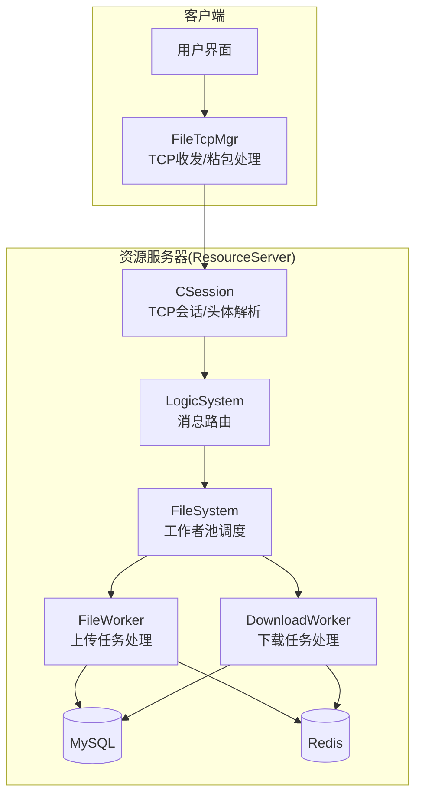
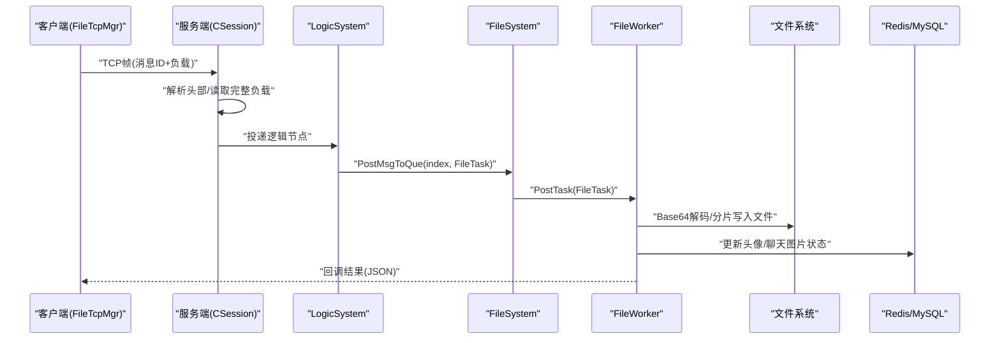
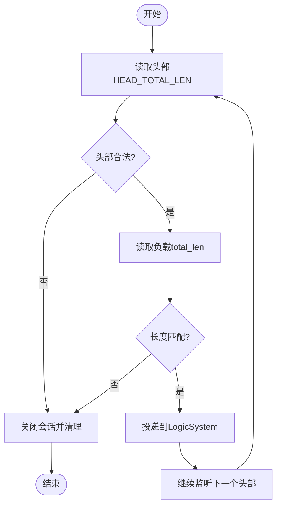
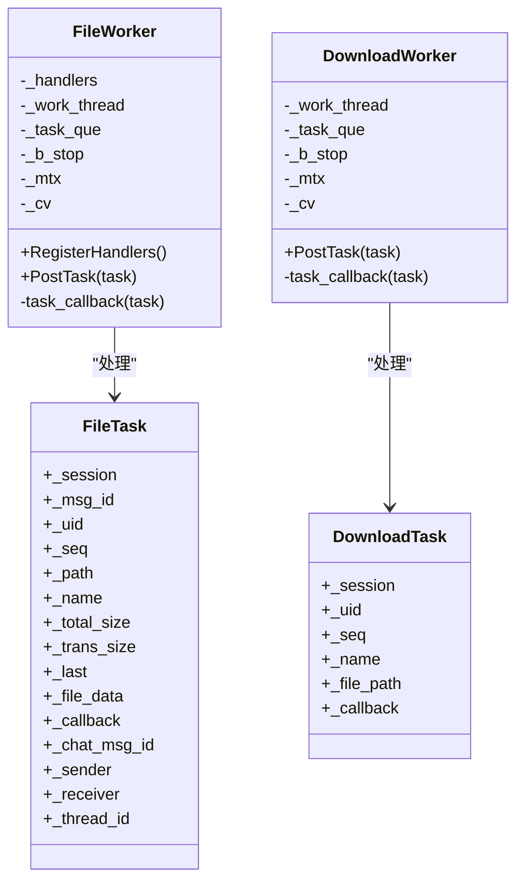
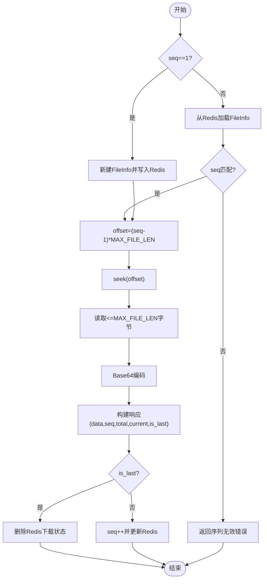
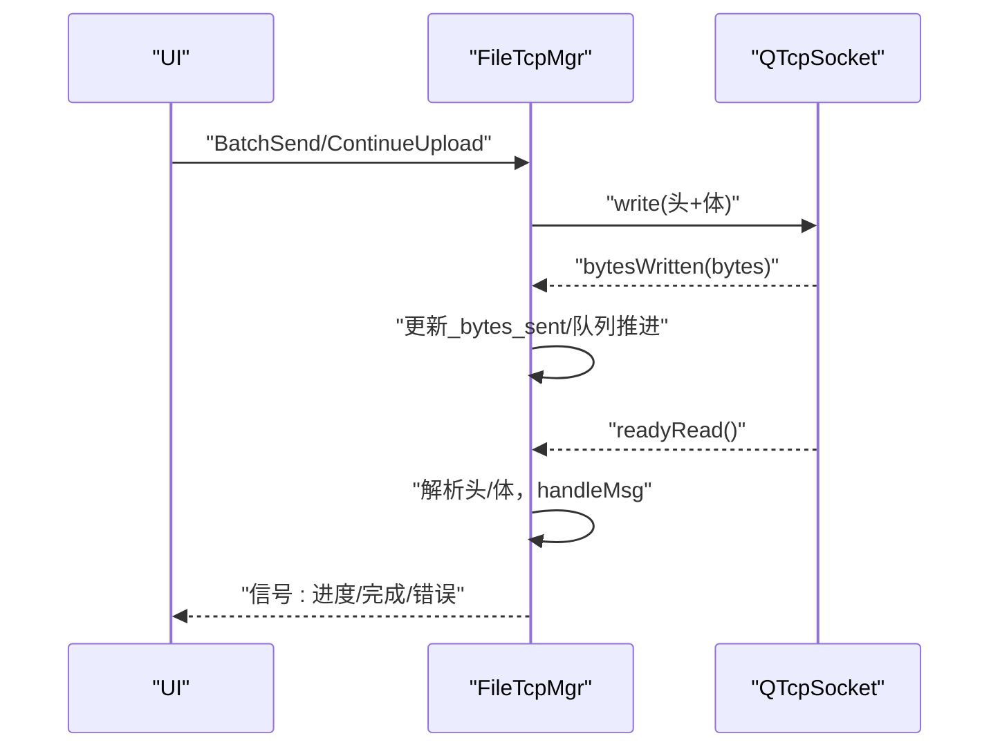
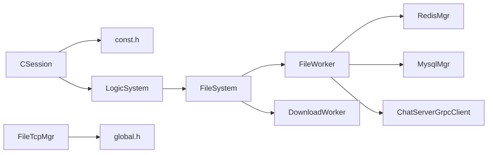

# 文件上传下载功能

<cite>
**本文引用的文件**   
- [FileWorker.h](file://server/ResourceServer/include/FileWorker.h)
- [FileWorker.cpp](file://server/ResourceServer/src/FileWorker.cpp)
- [CSession.h](file://server/ResourceServer/include/CSession.h)
- [CSession.cpp](file://server/ResourceServer/src/CSession.cpp)
- [const.h](file://server/ResourceServer/include/const.h)
- [FileInfo.h](file://server/ResourceServer/include/FileInfo.h)
- [FileSystem.h](file://server/ResourceServer/include/FileSystem.h)
- [FileSystem.cpp](file://server/ResourceServer/src/FileSystem.cpp)
- [filetcpmgr.h](file://client/llfcchat/include/filetcpmgr.h)
- [filetcpmgr.cpp](file://client/llfcchat/src/filetcpmgr.cpp)
- [global.h](file://client/llfcchat/include/global.h)
</cite>

## 目录
1. [简介](#简介)
2. [项目结构](#项目结构)
3. [核心组件](#核心组件)
4. [架构总览](#架构总览)
5. [详细组件分析](#详细组件分析)
6. [依赖关系分析](#依赖关系分析)
7. [性能考量](#性能考量)
8. [故障排查指南](#故障排查指南)
9. [结论](#结论)
10. [附录：API接口规范](#附录api接口规范)

## 简介
本技术文档聚焦于 ResourceServer 的文件上传与下载能力，围绕以下关键点展开：
- FileWorker 文件工作器的设计模式与实现原理（任务队列、分片处理、回调机制）
- CSession 会话管理中的 TCP 协议（头部解析、粘包处理、异步读写）
- 大文件处理的内存策略（固定缓冲、流式读取/写入、Redis 断点续传状态）
- 文件完整性校验（MD5 客户端计算、服务端序列号与偏移量校验；CRC32 未在当前代码中体现）
- 文件上传下载的 API 消息定义、请求参数、响应格式与错误码
- 性能调优建议与常见问题排查

## 项目结构
ResourceServer 侧通过 CSession 接收 TCP 帧，解析出消息 ID 与负载后交由 LogicSystem 路由到具体业务逻辑。文件相关逻辑由 FileSystem 单例分发到多个 FileWorker/DownloadWorker 实例，形成“多工作者 + 任务队列”的并发模型。客户端侧通过 FileTcpMgr 维护独立 TCP 连接，按自定义协议进行分片上传/下载。

**图表来源** 
- [CSession.h:1-64](file://server/ResourceServer/include/CSession.h#L1-L64)
- [CSession.cpp:1-244](file://server/ResourceServer/src/CSession.cpp#L1-L244)
- [FileSystem.h:1-21](file://server/ResourceServer/include/FileSystem.h#L1-L21)
- [FileSystem.cpp:1-29](file://server/ResourceServer/src/FileSystem.cpp#L1-L29)
- [FileWorker.h:1-90](file://server/ResourceServer/include/FileWorker.h#L1-L90)
- [FileWorker.cpp:1-663](file://server/ResourceServer/src/FileWorker.cpp#L1-L663)

**章节来源**
- [CSession.h:1-64](file://server/ResourceServer/include/CSession.h#L1-L64)
- [CSession.cpp:1-244](file://server/ResourceServer/src/CSession.cpp#L1-L244)
- [FileSystem.h:1-21](file://server/ResourceServer/include/FileSystem.h#L1-L21)
- [FileSystem.cpp:1-29](file://server/ResourceServer/src/FileSystem.cpp#L1-L29)
- [FileWorker.h:1-90](file://server/ResourceServer/include/FileWorker.h#L1-L90)
- [FileWorker.cpp:1-663](file://server/ResourceServer/src/FileWorker.cpp#L1-L663)

## 核心组件
- CSession：封装 TCP Socket 生命周期、异步读头/体、发送队列与写回调，保证粘包/半包正确处理。
- FileWorker：基于单线程工作循环与条件变量，将上传任务按消息 ID 路由到对应处理器，支持 Base64 解码、分片写入、目录创建、数据库/Redis 更新与回调通知。
- DownloadWorker：基于 Redis 的断点续传状态，按 seq 定位偏移量读取文件块，Base64 编码后回传，并在完成时清理状态。
- FileSystem：单例，维护 FileWorker 与 DownloadWorker 数组，提供按索引投递任务的接口。
- 客户端 FileTcpMgr：维护独立 TCP 连接，实现自定义协议头解析、粘包处理、拥塞窗口控制、进度上报与续传。

**章节来源**
- [CSession.h:1-64](file://server/ResourceServer/include/CSession.h#L1-L64)
- [CSession.cpp:1-244](file://server/ResourceServer/src/CSession.cpp#L1-L244)
- [FileWorker.h:1-90](file://server/ResourceServer/include/FileWorker.h#L1-L90)
- [FileWorker.cpp:1-663](file://server/ResourceServer/src/FileWorker.cpp#L1-L663)
- [FileSystem.h:1-21](file://server/ResourceServer/include/FileSystem.h#L1-L21)
- [FileSystem.cpp:1-29](file://server/ResourceServer/src/FileSystem.cpp#L1-L29)
- [filetcpmgr.h:1-85](file://client/llfcchat/include/filetcpmgr.h#L1-L85)
- [filetcpmgr.cpp:1-200](file://client/llfcchat/src/filetcpmgr.cpp#L1-L200)

## 架构总览
下图展示从客户端发起上传到服务端落盘并回调通知的整体流程。

**图表来源** 
- [CSession.cpp:127-182](file://server/ResourceServer/src/CSession.cpp#L127-L182)
- [FileSystem.cpp:9-17](file://server/ResourceServer/src/FileSystem.cpp#L9-L17)
- [FileWorker.cpp:49-112](file://server/ResourceServer/src/FileWorker.cpp#L49-L112)

## 详细组件分析

### CSession 会话管理与 TCP 协议
- 协议格式：固定长度头部（消息 ID 2 字节 + 数据长度 4 字节），随后为变长负载。
- 读流程：AsyncReadHead 读取 HEAD_TOTAL_LEN，校验 ID/长度合法性后分配 RecvNode，再调用 AsyncReadBody 累计读取至 total_len。
- 写流程：Send 入队 SendNode，使用 async_write 非阻塞写出，HandleWrite 在回调中弹出已发送项并继续发送队列。
- 粘包处理：read 循环累积直到达到 total_len，避免半包/粘包问题。
- 错误处理：网络错误或长度不匹配时关闭 socket 并从服务器移除会话。

**图表来源** 
- [CSession.cpp:127-182](file://server/ResourceServer/src/CSession.cpp#L127-L182)
- [CSession.cpp:87-125](file://server/ResourceServer/src/CSession.cpp#L87-L125)
- [const.h:53-61](file://server/ResourceServer/include/const.h#L53-L61)

**章节来源**
- [CSession.h:1-64](file://server/ResourceServer/include/CSession.h#L1-L64)
- [CSession.cpp:1-244](file://server/ResourceServer/src/CSession.cpp#L1-L244)
- [const.h:53-61](file://server/ResourceServer/include/const.h#L53-L61)

### FileWorker 文件工作器（上传）
- 设计模式：注册表模式（_handlers 映射 MSG_IDS 到处理器）、生产者-消费者（PostTask 入队，工作线程消费）。
- 任务结构：FileTask 包含会话、消息 ID、用户 ID、路径、文件名、分片序号、总大小、传输大小、是否最后分片、Base64 数据、回调等。
- 处理器：
  - 通用文件上传：Base64 解码、确保目录存在、首包 trunc、后续包 append、写入失败返回权限错误。
  - 头像上传：同通用流程，完成后更新用户头像并刷新 Redis 缓存。
  - 聊天图片上传：完成后更新数据库上传状态，查询接收者 IP，若在线则通过 gRPC 通知 ChatServer。
  - 文件信息同步：与聊天图片上传类似，用于跨端同步。
  - 续传聊天图片：与聊天图片上传一致，但强调续传场景。
- 回调机制：每个处理器构造 Json::Value 结果并通过 task->_callback 返回给上层。

**图表来源** 
- [FileWorker.h:14-56](file://server/ResourceServer/include/FileWorker.h#L14-L56)
- [FileWorker.h:58-73](file://server/ResourceServer/include/FileWorker.h#L58-L73)
- [FileWorker.h:76-88](file://server/ResourceServer/include/FileWorker.h#L76-L88)

**章节来源**
- [FileWorker.h:1-90](file://server/ResourceServer/include/FileWorker.h#L1-L90)
- [FileWorker.cpp:49-458](file://server/ResourceServer/src/FileWorker.cpp#L49-L458)

### DownloadWorker 下载与断点续传
- 首次下载（seq=1）：获取文件大小，初始化 FileInfo，立即写入 Redis（覆盖旧数据，设置过期时间）。
- 续传下载（seq>1）：从 Redis 读取历史状态，校验 seq 一致性，计算 offset=(seq-1)*MAX_FILE_LEN，定位读取。
- 读取与编码：读取最多 MAX_FILE_LEN 字节，Base64 编码后返回 data、seq、total_size、current_size、is_last。
- 完成与清理：当 is_last 为真时删除 Redis 中的下载状态，否则递增 seq 并更新 trans_size。

**图表来源** 
- [FileWorker.cpp:528-662](file://server/ResourceServer/src/FileWorker.cpp#L528-L662)
- [FileInfo.h:1-26](file://server/ResourceServer/include/FileInfo.h#L1-L26)

**章节来源**
- [FileWorker.cpp:483-662](file://server/ResourceServer/src/FileWorker.cpp#L483-L662)
- [FileInfo.h:1-26](file://server/ResourceServer/include/FileInfo.h#L1-L26)

### 客户端 FileTcpMgr 与协议交互
- 协议头：FILE_UPLOAD_HEAD_LEN=6（ID 2 字节 + 长度 4 字节），BigEndian。
- 粘包处理：readyRead 中持续读取到缓冲区，先解析头，再判断 body 长度是否足够，不足则等待。
- 发送流程：slot_send_data 组装头与负载，bytesWritten 回调驱动队列发送，实现背压与拥塞控制。
- 上传/下载：按 MAX_FILE_LEN 分片，维护 _seq、_rsp_seqs、_flighting_seqs、_last_confirmed_seq 等字段，支持续传。

**图表来源** 
- [filetcpmgr.cpp:16-55](file://client/llfcchat/src/filetcpmgr.cpp#L16-L55)
- [filetcpmgr.cpp:186-200](file://client/llfcchat/src/filetcpmgr.cpp#L186-L200)
- [global.h:15-24](file://client/llfcchat/include/global.h#L15-L24)

**章节来源**
- [filetcpmgr.h:1-85](file://client/llfcchat/include/filetcpmgr.h#L1-L85)
- [filetcpmgr.cpp:1-200](file://client/llfcchat/src/filetcpmgr.cpp#L1-L200)
- [global.h:15-24](file://client/llfcchat/include/global.h#L15-L24)

## 依赖关系分析
- CSession 依赖 const.h 中的常量（头部长度、最大长度、消息 ID 范围）。
- FileWorker/DownloadWorker 依赖 Redis/MySQL 管理器与 gRPC 客户端（头像/聊天图片场景）。
- FileSystem 作为单例聚合多个 FileWorker/DownloadWorker，按 index 分发任务。
- 客户端 FileTcpMgr 依赖 global.h 中的协议常量与数据结构。

**图表来源** 
- [CSession.cpp:127-182](file://server/ResourceServer/src/CSession.cpp#L127-L182)
- [FileSystem.cpp:19-28](file://server/ResourceServer/src/FileSystem.cpp#L19-L28)
- [FileWorker.cpp:172-191](file://server/ResourceServer/src/FileWorker.cpp#L172-L191)
- [global.h:15-24](file://client/llfcchat/include/global.h#L15-L24)

**章节来源**
- [CSession.cpp:127-182](file://server/ResourceServer/src/CSession.cpp#L127-L182)
- [FileSystem.cpp:19-28](file://server/ResourceServer/src/FileSystem.cpp#L19-L28)
- [FileWorker.cpp:172-191](file://server/ResourceServer/src/FileWorker.cpp#L172-L191)
- [global.h:15-24](file://client/llfcchat/include/global.h#L15-L24)

## 性能考量
- I/O 模型
  - 服务端采用 Boost.Asio 异步读写，减少阻塞；发送队列避免频繁锁竞争。
  - 客户端使用 QIODevice 事件驱动，bytesWritten 回调推进发送队列，降低 CPU 占用。
- 分片大小
  - MAX_FILE_LEN=32KB，兼顾网络吞吐与内存占用；可根据带宽调整。
- 并发模型
  - 多工作者（FILE_WORKER_COUNT/DOWN_LOAD_WORKER_COUNT）提升吞吐；注意热点键导致的 Redis 竞争。
- 内存管理
  - 固定缓冲 _data[MAX_LENGTH]，避免频繁分配；Base64 编解码产生临时字符串，注意峰值内存。
- 持久化与缓存
  - 下载状态存 Redis，设置过期时间防止脏数据；头像/聊天图片完成后更新 MySQL 并刷新 Redis。
- 背压与拥塞
  - 客户端拥塞窗口控制（MAX_CWND_SIZE），避免突发流量导致丢包或重传风暴。

[本节为通用指导，不直接分析具体文件]

## 故障排查指南
- 常见错误码
  - FileNotExists、FileWritePermissionFailed、FileReadPermissionFailed、FileSeqInvalid、FileOffsetInvalid、FileReadFailed、RedisReadErr 等。
- 典型症状与定位
  - 上传中断：检查 last 标志与 seq 连续性；确认目录创建与写入权限。
  - 下载错位：核对 Redis 中 seq 与当前 seq 是否一致；检查 offset 计算。
  - 头像未生效：确认头像上传完成后是否成功更新 MySQL 与 Redis。
  - 聊天图片未通知：检查接收者 IP 是否存在于 Redis，gRPC 通知是否成功。
- 日志关键字
  - “无法打开文件进行写入/读取”、“偏移量超出文件大小”、“序列号不匹配”、“Redis 中无下载信息”。

**章节来源**
- [const.h:5-29](file://server/ResourceServer/include/const.h#L5-L29)
- [FileWorker.cpp:89-102](file://server/ResourceServer/src/FileWorker.cpp#L89-L102)
- [FileWorker.cpp:540-553](file://server/ResourceServer/src/FileWorker.cpp#L540-L553)
- [FileWorker.cpp:576-594](file://server/ResourceServer/src/FileWorker.cpp#L576-L594)

## 结论
ResourceServer 的文件上传下载模块以 CSession 为入口，结合 FileSystem 的多工作者模型与 FileWorker/DownloadWorker 的分片处理，实现了高吞吐、可恢复、可扩展的文件传输能力。客户端通过 FileTcpMgr 实现稳定的粘包处理与拥塞控制。整体方案在内存与 I/O 层面做了合理优化，并通过 Redis/MySQL 保障状态一致性与持久化。建议在大规模部署时关注 Redis 热点与磁盘 I/O 瓶颈，并根据网络环境调优分片大小与拥塞窗口。

[本节为总结性内容，不直接分析具体文件]

## 附录：API接口规范
- 协议基础
  - 传输层：TCP
  - 帧格式：2 字节消息 ID + 4 字节负载长度（BigEndian）+ 负载（JSON）
  - 分片大小：MAX_FILE_LEN=32KB
- 消息 ID（部分）
  - ID_UPLOAD_FILE_REQ/RSP
  - ID_UPLOAD_HEAD_ICON_REQ/RSP
  - ID_IMG_CHAT_UPLOAD_REQ/RSP
  - ID_FILE_INFO_SYNC_REQ/RSP
  - ID_IMG_CHAT_CONTINUE_UPLOAD_REQ/RSP
  - ID_DOWN_LOAD_FILE_REQ/RSP
  - ID_IMG_CHAT_DOWN_REQ/RSP
- 上传请求负载（示例字段）
  - path: 目标路径
  - name: 文件名
  - seq: 分片序号（从1开始）
  - total_size: 总大小
  - trans_size: 已传输累计大小
  - last: 是否最后一个分片
  - file_data: Base64 编码的分片数据
  - chat_msg_id/sender/receiver: 聊天图片场景关联字段
- 下载请求负载（示例字段）
  - name: 文件名
  - seq: 分片序号（首次为1，续传为上次确认的下一位）
- 响应负载（通用）
  - error: 错误码（Success=0 表示成功）
  - data: Base64 编码的分片数据（下载）
  - seq/total_size/current_size/is_last: 下载进度与结束标志
- 错误码（节选）
  - Success=0
  - FileNotExists=1012
  - FileWritePermissionFailed=1015
  - FileReadPermissionFailed=1016
  - FileSeqInvalid=1017
  - FileOffsetInvalid=1018
  - FileReadFailed=1019
  - RedisReadErr=1020

**章节来源**
- [const.h:72-95](file://server/ResourceServer/include/const.h#L72-L95)
- [const.h:5-29](file://server/ResourceServer/include/const.h#L5-L29)
- [FileWorker.cpp:49-112](file://server/ResourceServer/src/FileWorker.cpp#L49-L112)
- [FileWorker.cpp:528-662](file://server/ResourceServer/src/FileWorker.cpp#L528-L662)
- [global.h:15-24](file://client/llfcchat/include/global.h#L15-L24)