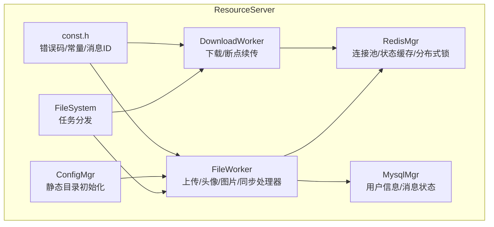
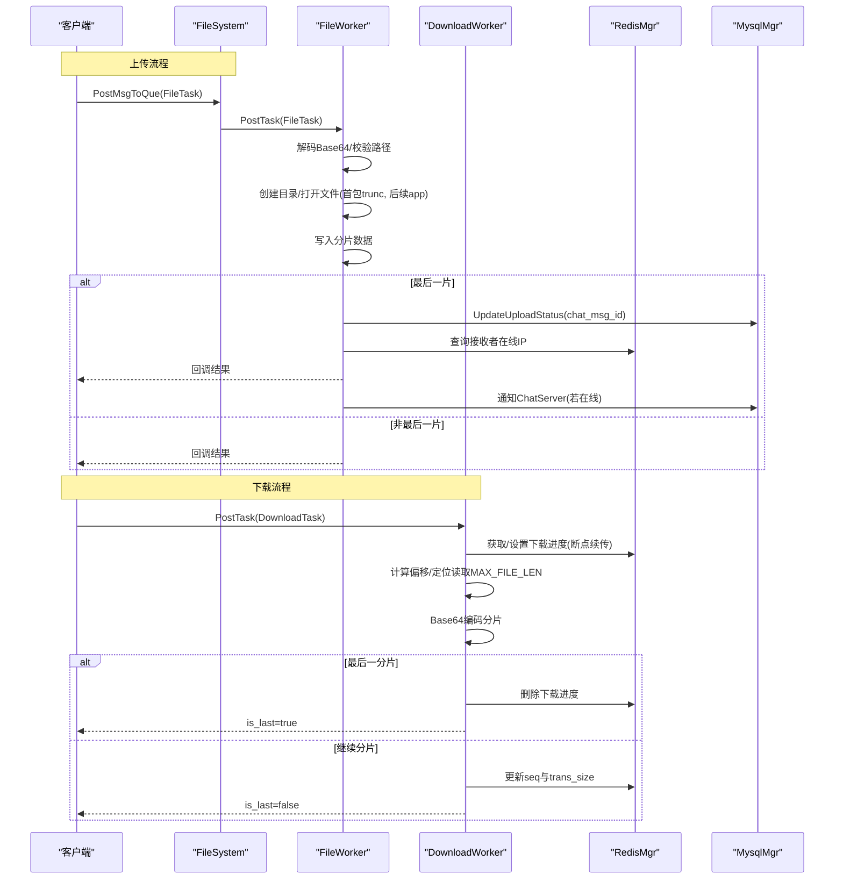
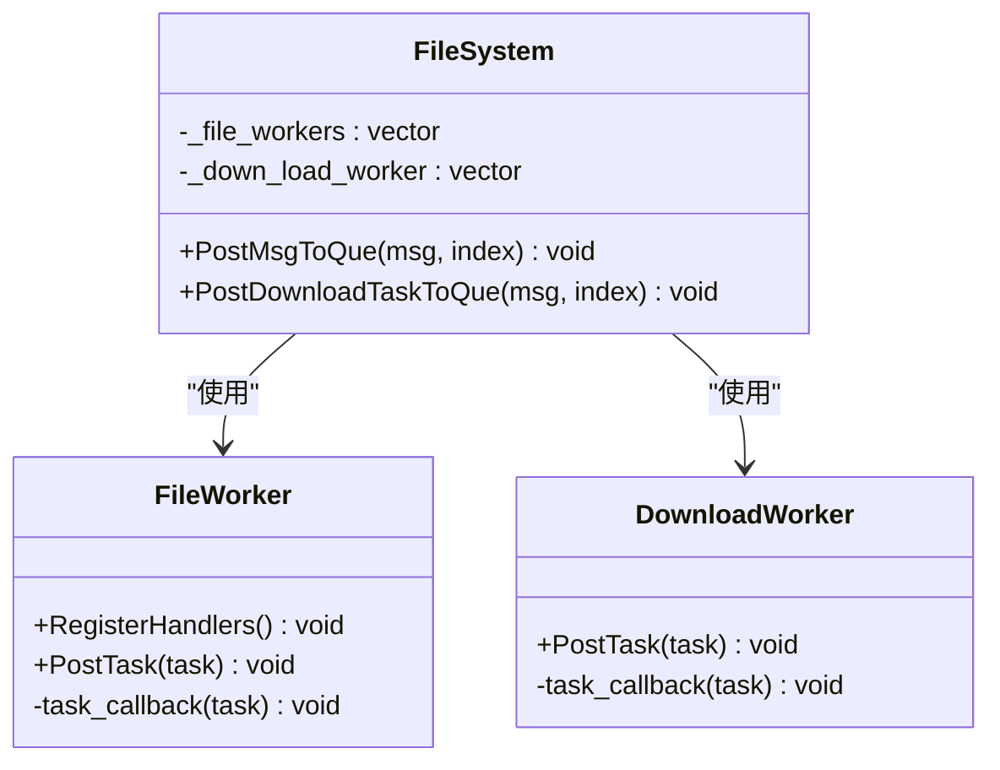
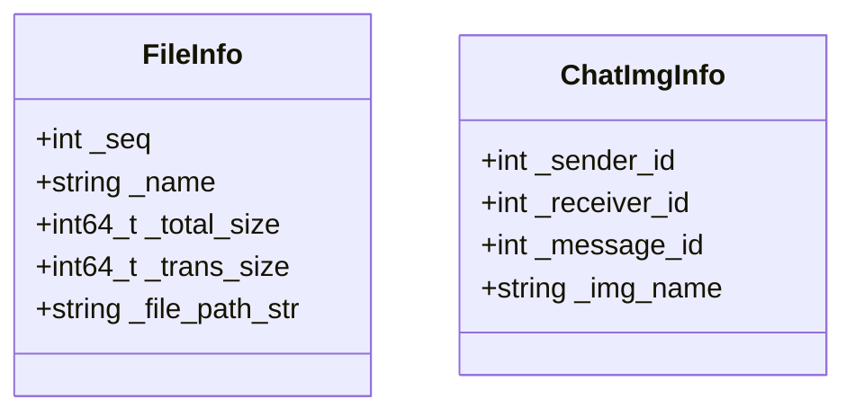
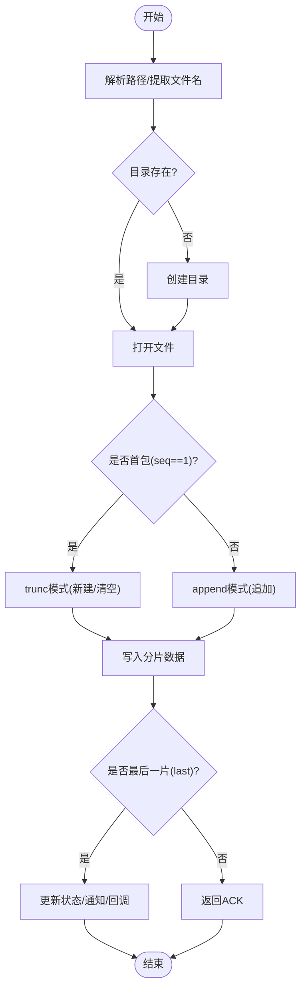
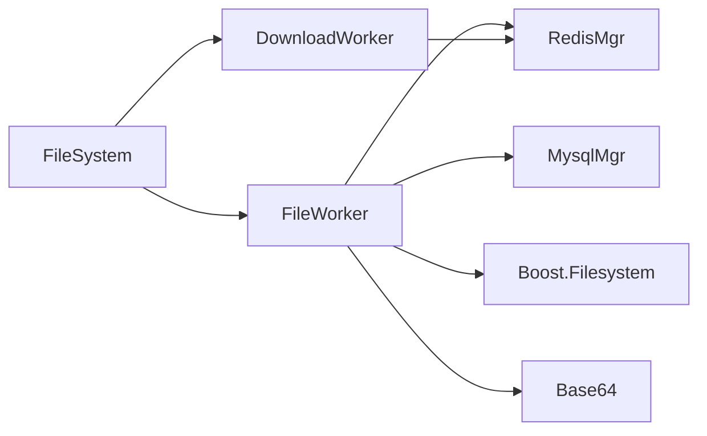

# 文件系统存储管理

<cite>
**本文引用的文件**   
- [FileSystem.h](file://server/ResourceServer/include/FileSystem.h)
- [FileSystem.cpp](file://server/ResourceServer/src/FileSystem.cpp)
- [FileInfo.h](file://server/ResourceServer/include/FileInfo.h)
- [FileWorker.h](file://server/ResourceServer/include/FileWorker.h)
- [FileWorker.cpp](file://server/ResourceServer/src/FileWorker.cpp)
- [const.h](file://server/ResourceServer/include/const.h)
- [RedisMgr.h](file://server/ResourceServer/include/RedisMgr.h)
- [RedisMgr.cpp](file://server/ResourceServer/src/RedisMgr.cpp)
- [MysqlMgr.h](file://server/ResourceServer/include/MysqlMgr.h)
- [MysqlMgr.cpp](file://server/ResourceServer/src/MysqlMgr.cpp)
- [config.ini](file://server/ResourceServer/config/config.ini)
</cite>

## 目录
1. [简介](#简介)
2. [项目结构](#项目结构)
3. [核心组件](#核心组件)
4. [架构总览](#架构总览)
5. [详细组件分析](#详细组件分析)
6. [依赖关系分析](#依赖关系分析)
7. [性能考量](#性能考量)
8. [故障排查指南](#故障排查指南)
9. [结论](#结论)
10. [附录](#附录)

## 简介
本技术文档聚焦 ResourceServer 的文件系统存储管理，围绕 FileSystem 抽象层、FileInfo 元数据与索引、分目录存储策略、原子性写入与一致性保障、断点续传下载、以及清理回收与监控统计等主题展开。通过解析现有代码实现，总结跨平台路径处理、权限控制、并发模型与持久化策略，为后续扩展与维护提供清晰的技术蓝图。

## 项目结构
ResourceServer 中涉及文件系统的核心位于 include 与 src 两个目录：
- include: 定义 FileSystem、FileInfo、FileWorker、RedisMgr、MysqlMgr 等接口与数据结构
- src: 实现工作线程调度、文件读写、Redis 连接池与分布式锁、MySQL 操作封装、配置加载等

图表来源
- [FileSystem.h:1-21](file://server/ResourceServer/include/FileSystem.h#L1-L21)
- [FileSystem.cpp:1-29](file://server/ResourceServer/src/FileSystem.cpp#L1-L29)
- [FileWorker.h:1-90](file://server/ResourceServer/include/FileWorker.h#L1-L90)
- [FileWorker.cpp:1-663](file://server/ResourceServer/src/FileWorker.cpp#L1-L663)
- [RedisMgr.h:1-313](file://server/ResourceServer/include/RedisMgr.h#L1-L313)
- [RedisMgr.cpp:300-602](file://server/ResourceServer/src/RedisMgr.cpp#L300-L602)
- [MysqlMgr.h:1-44](file://server/ResourceServer/include/MysqlMgr.h#L1-L44)
- [MysqlMgr.cpp:1-104](file://server/ResourceServer/src/MysqlMgr.cpp#L1-L104)
- [const.h:1-117](file://server/ResourceServer/include/const.h#L1-L117)

章节来源
- [FileSystem.h:1-21](file://server/ResourceServer/include/FileSystem.h#L1-L21)
- [FileSystem.cpp:1-29](file://server/ResourceServer/src/FileSystem.cpp#L1-L29)
- [FileWorker.h:1-90](file://server/ResourceServer/include/FileWorker.h#L1-L90)
- [FileWorker.cpp:1-663](file://server/ResourceServer/src/FileWorker.cpp#L1-L663)
- [RedisMgr.h:1-313](file://server/ResourceServer/include/RedisMgr.h#L1-L313)
- [RedisMgr.cpp:300-602](file://server/ResourceServer/src/RedisMgr.cpp#L300-L602)
- [MysqlMgr.h:1-44](file://server/ResourceServer/include/MysqlMgr.h#L1-L44)
- [MysqlMgr.cpp:1-104](file://server/ResourceServer/src/MysqlMgr.cpp#L1-L104)
- [const.h:1-117](file://server/ResourceServer/include/const.h#L1-L117)
- [config.ini:1-27](file://server/ResourceServer/config/config.ini#L1-L27)

## 核心组件
- FileSystem：单例，维护多实例 FileWorker 与 DownloadWorker，负责将上传与下载任务投递到对应队列。
- FileInfo / ChatImgInfo：轻量元数据载体，用于记录文件名、大小、传输进度、路径及聊天图片关联信息。
- FileWorker：基于线程+队列的异步处理器，注册多种消息 ID 的处理回调（普通文件、头像、聊天图片、文件信息同步、续传）。
- DownloadWorker：独立下载工作线程，按块读取文件并 Base64 编码返回，结合 Redis 实现断点续传。
- RedisMgr：Hiredis 连接池、键值存取、分布式锁、文件上传/下载状态缓存（含过期时间）。
- MysqlMgr：用户信息与聊天消息状态的数据库访问封装。
- const.h：统一错误码、消息 ID、常量（如最大分片大小、工作线程数等）。

章节来源
- [FileSystem.h:1-21](file://server/ResourceServer/include/FileSystem.h#L1-L21)
- [FileSystem.cpp:1-29](file://server/ResourceServer/src/FileSystem.cpp#L1-L29)
- [FileInfo.h:1-26](file://server/ResourceServer/include/FileInfo.h#L1-L26)
- [FileWorker.h:1-90](file://server/ResourceServer/include/FileWorker.h#L1-L90)
- [FileWorker.cpp:1-663](file://server/ResourceServer/src/FileWorker.cpp#L1-L663)
- [RedisMgr.h:1-313](file://server/ResourceServer/include/RedisMgr.h#L1-L313)
- [RedisMgr.cpp:300-602](file://server/ResourceServer/src/RedisMgr.cpp#L300-L602)
- [MysqlMgr.h:1-44](file://server/ResourceServer/include/MysqlMgr.h#L1-L44)
- [MysqlMgr.cpp:1-104](file://server/ResourceServer/src/MysqlMgr.cpp#L1-L104)
- [const.h:1-117](file://server/ResourceServer/include/const.h#L1-L117)

## 架构总览
ResourceServer 的文件系统存储采用“任务队列 + 工作线程”的解耦设计：
- 上层通过 FileSystem 将上传/下载任务投递到不同 Worker 队列
- FileWorker 根据消息类型路由到具体处理器，完成解码、目录创建、分片写入、状态更新、通知下游服务
- DownloadWorker 按分片偏移读取文件，结合 Redis 中的 FileInfo 进行断点续传
- 元数据与状态通过 Redis 缓存，关键业务状态落库 MySQL

图表来源
- [FileSystem.cpp:1-29](file://server/ResourceServer/src/FileSystem.cpp#L1-L29)
- [FileWorker.cpp:1-663](file://server/ResourceServer/src/FileWorker.cpp#L1-L663)
- [RedisMgr.cpp:499-602](file://server/ResourceServer/src/RedisMgr.cpp#L499-L602)
- [MysqlMgr.cpp:86-104](file://server/ResourceServer/src/MysqlMgr.cpp#L86-L104)

## 详细组件分析

### FileSystem 抽象层
- 职责：单例管理多个 FileWorker 与 DownloadWorker，提供统一的 PostMsgToQue 与 PostDownloadTaskToQue 接口
- 并发模型：内部维护固定数量的工作者实例（由常量决定），按 index 选择目标 Worker
- 生命周期：构造时初始化工作者集合；析构无特殊资源释放逻辑

图表来源
- [FileSystem.h:1-21](file://server/ResourceServer/include/FileSystem.h#L1-L21)
- [FileSystem.cpp:1-29](file://server/ResourceServer/src/FileSystem.cpp#L1-L29)
- [FileWorker.h:1-90](file://server/ResourceServer/include/FileWorker.h#L1-L90)
- [const.h:63-69](file://server/ResourceServer/include/const.h#L63-L69)

章节来源
- [FileSystem.h:1-21](file://server/ResourceServer/include/FileSystem.h#L1-L21)
- [FileSystem.cpp:1-29](file://server/ResourceServer/src/FileSystem.cpp#L1-L29)
- [const.h:63-69](file://server/ResourceServer/include/const.h#L63-L69)

### FileInfo 文件信息管理
- 字段：序列号、文件名、总大小、已传输大小、文件路径
- 用途：上传/下载过程中的元数据载体，配合 Redis 做状态缓存
- 复杂度：O(1) 构造与赋值；序列化/反序列化在 RedisMgr 中完成

图表来源
- [FileInfo.h:1-26](file://server/ResourceServer/include/FileInfo.h#L1-L26)

章节来源
- [FileInfo.h:1-26](file://server/ResourceServer/include/FileInfo.h#L1-L26)

### 文件存储策略（分目录、命名规则、空间分配）
- 分目录存储：使用 boost::filesystem 解析目标路径，自动创建父目录；首包以 trunc 模式创建或清空文件，后续包以 append 追加
- 命名规则：文件名来自请求参数，未做额外规范化（建议在上层保证唯一性与安全字符）
- 空间分配：按固定分片大小 MAX_FILE_LEN 进行分片读写；总大小通过首次读取文件大小确定

图表来源
- [FileWorker.cpp:51-112](file://server/ResourceServer/src/FileWorker.cpp#L51-L112)
- [const.h](file://server/ResourceServer/include/const.h#L114)

章节来源
- [FileWorker.cpp:51-112](file://server/ResourceServer/src/FileWorker.cpp#L51-L112)
- [const.h](file://server/ResourceServer/include/const.h#L114)

### 原子性保证（事务、回滚、一致性）
- 当前实现：文件写入为逐分片追加，未引入事务或原子替换机制；异常情况下可能出现部分写入
- 建议改进：
  - 临时文件写入 + 原子重命名（rename）确保最终一致性
  - 对关键状态（数据库/Redis）采用事务或幂等更新
  - 增加完整性校验（如哈希校验）与失败回滚

章节来源
- [FileWorker.cpp:77-112](file://server/ResourceServer/src/FileWorker.cpp#L77-L112)
- [MysqlMgr.cpp:90-93](file://server/ResourceServer/src/MysqlMgr.cpp#L90-L93)

### 文件清理与回收（过期删除、碎片整理、空间回收）
- 过期删除：Redis 中下载/上传状态键设置过期时间（默认 3600s），避免长期占用
- 碎片整理：当前未实现；可在后台任务扫描目录，合并小文件或重建索引
- 空间回收：可基于定时任务统计目录大小，清理过期或无效文件

章节来源
- [RedisMgr.cpp:499-531](file://server/ResourceServer/src/RedisMgr.cpp#L499-L531)
- [const.h](file://server/ResourceServer/include/const.h#L114)

### 监控与统计（容量、频率、性能指标）
- 容量使用：可通过扫描静态目录统计总大小与文件数量
- 访问频率：利用 Redis 计数器记录上传/下载次数（参考登录计数模式）
- 性能指标：记录各处理器耗时、队列长度、错误率，输出至日志或监控系统

章节来源
- [RedisMgr.cpp:431-497](file://server/ResourceServer/src/RedisMgr.cpp#L431-L497)
- [config.ini:15-18](file://server/ResourceServer/config/config.ini#L15-L18)

## 依赖关系分析
- FileSystem 依赖 FileWorker/DownloadWorker（工作者实例）
- FileWorker 依赖 RedisMgr（状态缓存）、MysqlMgr（状态落库）、base64（编解码）、boost::filesystem（路径与IO）
- DownloadWorker 依赖 RedisMgr（断点续传状态）
- 常量与错误码集中在 const.h

图表来源
- [FileSystem.h:1-21](file://server/ResourceServer/include/FileSystem.h#L1-L21)
- [FileWorker.h:1-90](file://server/ResourceServer/include/FileWorker.h#L1-L90)
- [RedisMgr.h:1-313](file://server/ResourceServer/include/RedisMgr.h#L1-L313)
- [MysqlMgr.h:1-44](file://server/ResourceServer/include/MysqlMgr.h#L1-L44)
- [const.h:1-117](file://server/ResourceServer/include/const.h#L1-L117)

章节来源
- [FileSystem.h:1-21](file://server/ResourceServer/include/FileSystem.h#L1-L21)
- [FileWorker.h:1-90](file://server/ResourceServer/include/FileWorker.h#L1-L90)
- [RedisMgr.h:1-313](file://server/ResourceServer/include/RedisMgr.h#L1-L313)
- [MysqlMgr.h:1-44](file://server/ResourceServer/include/MysqlMgr.h#L1-L44)
- [const.h:1-117](file://server/ResourceServer/include/const.h#L1-L117)

## 性能考量
- 并发模型：多 Worker 实例并行处理，降低队列阻塞；建议根据 CPU 核数与 IO 特性调整 WORKER_COUNT
- I/O 模式：二进制流分片读写，减少内存拷贝；Base64 编解码带来一定开销，可考虑直接二进制传输
- 缓存命中：Redis 作为热点状态缓存，降低数据库压力；注意键过期策略与一致性
- 磁盘 I/O：大文件分片写入可降低瞬时负载；建议 SSD 与合理分区布局提升吞吐

[本节为通用指导，不直接分析具体文件]

## 故障排查指南
- 常见错误码：文件不存在、写权限不足、读权限不足、序列号/偏移量非法、Redis 读取失败等
- 排查步骤：
  - 检查目录权限与路径有效性
  - 确认 Redis 连接与键是否存在（下载进度、上传状态）
  - 核对 seq 与 total_size 的一致性
  - 查看日志输出定位失败阶段（目录创建、文件打开、写入、回调）

章节来源
- [const.h:5-29](file://server/ResourceServer/include/const.h#L5-L29)
- [FileWorker.cpp:89-112](file://server/ResourceServer/src/FileWorker.cpp#L89-L112)
- [RedisMgr.cpp:345-395](file://server/ResourceServer/src/RedisMgr.cpp#L345-L395)

## 结论
ResourceServer 的文件系统存储管理以“任务队列 + 工作线程”为核心，结合 Redis 状态缓存与 MySQL 持久化，实现了稳定的上传/下载能力。当前实现具备分片写入与断点续传，但原子性、一致性、清理回收与监控统计仍有优化空间。建议引入原子替换、完整性校验、后台清理任务与指标采集，以提升可靠性与可观测性。

[本节为总结，不直接分析具体文件]

## 附录
- 配置项说明（示例）：
  - Output.Path：静态输出目录
  - Static.Path：静态资源目录
  - Redis/Mysql：连接参数
- 常量说明：
  - MAX_FILE_LEN：分片大小
  - FILE_WORKER_COUNT/DOWN_LOAD_WORKER_COUNT：工作线程数量

章节来源
- [config.ini:15-18](file://server/ResourceServer/config/config.ini#L15-L18)
- [const.h:63-69](file://server/ResourceServer/include/const.h#L63-L69)
- [const.h](file://server/ResourceServer/include/const.h#L114)